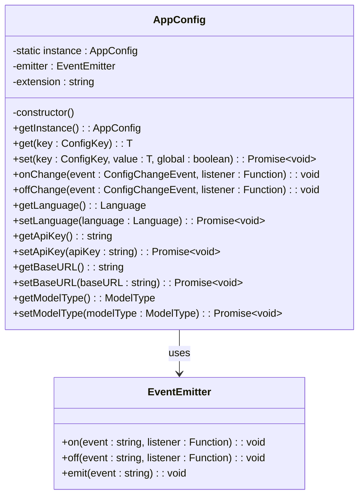
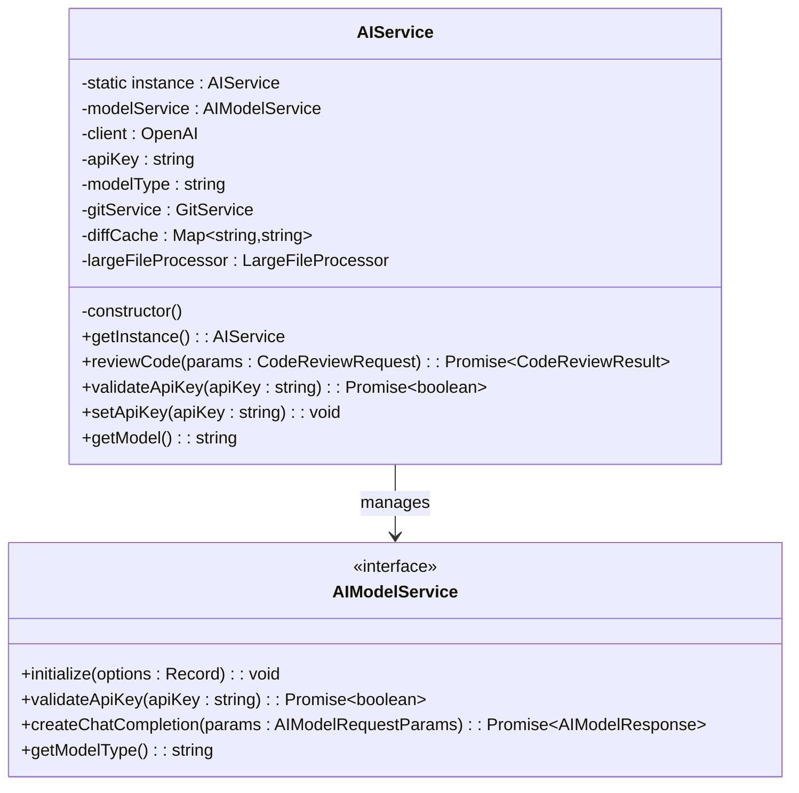
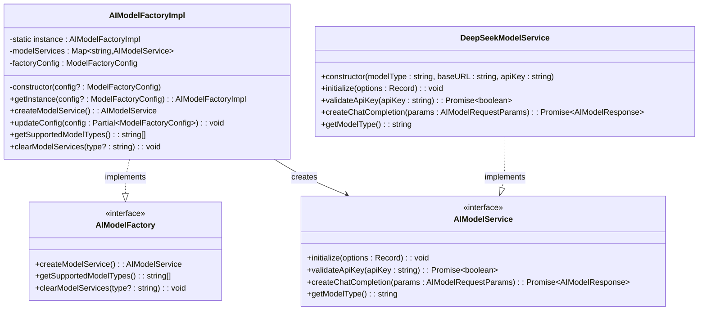
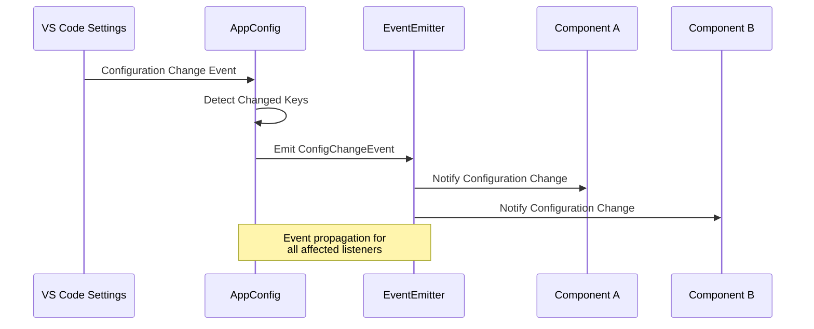
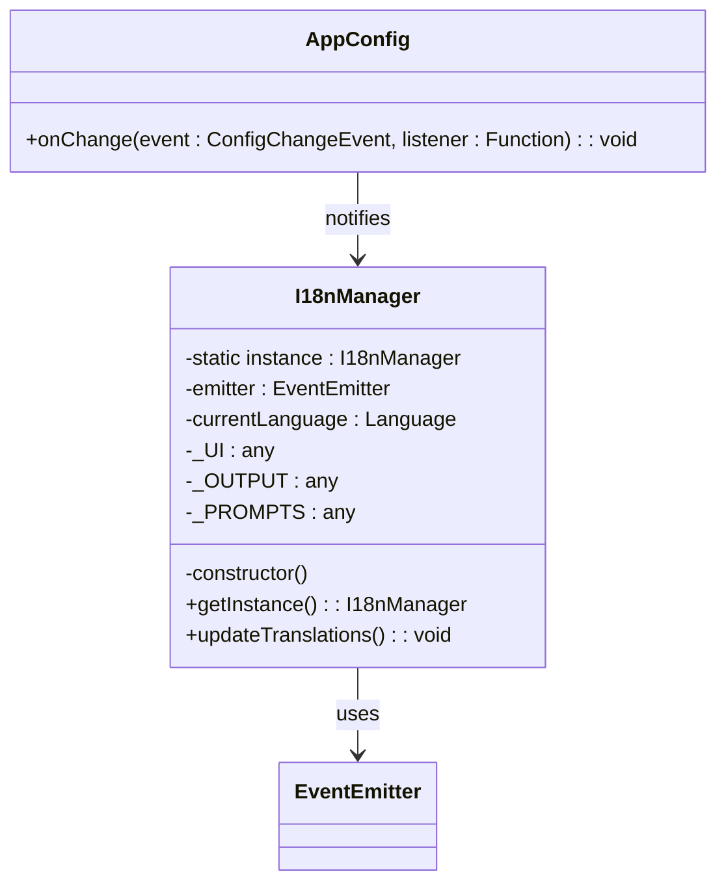
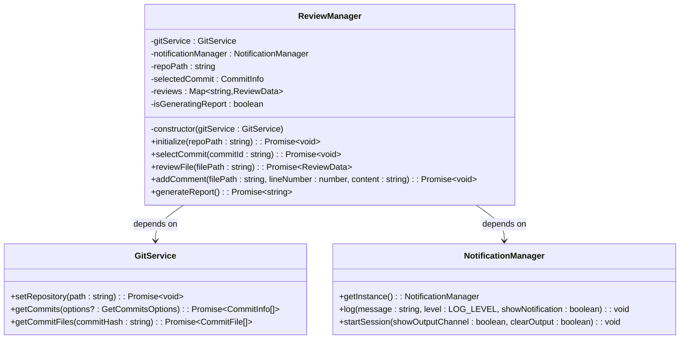
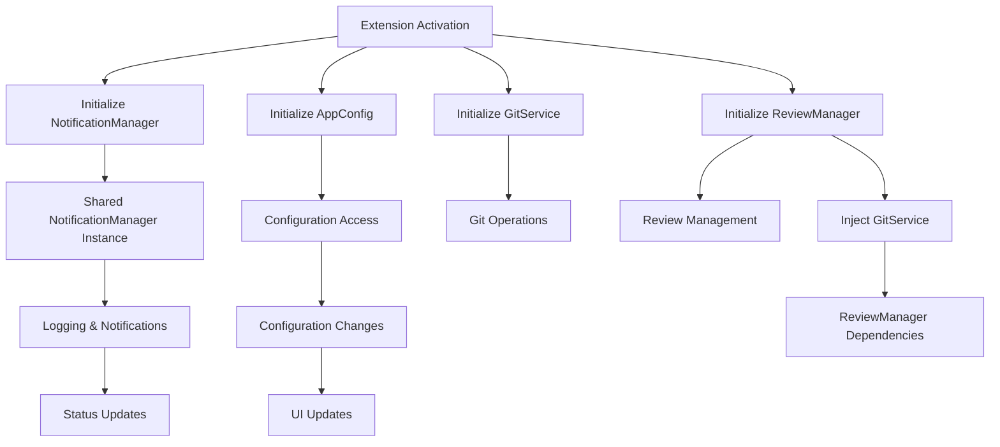
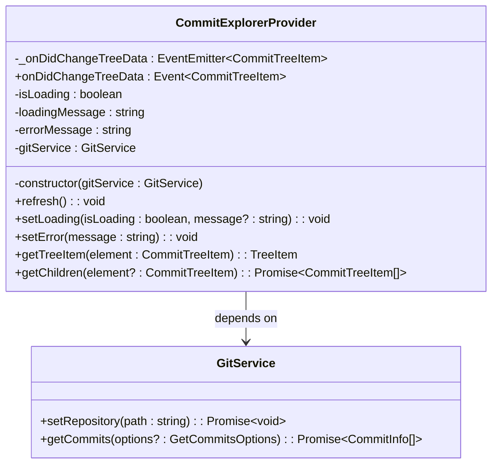
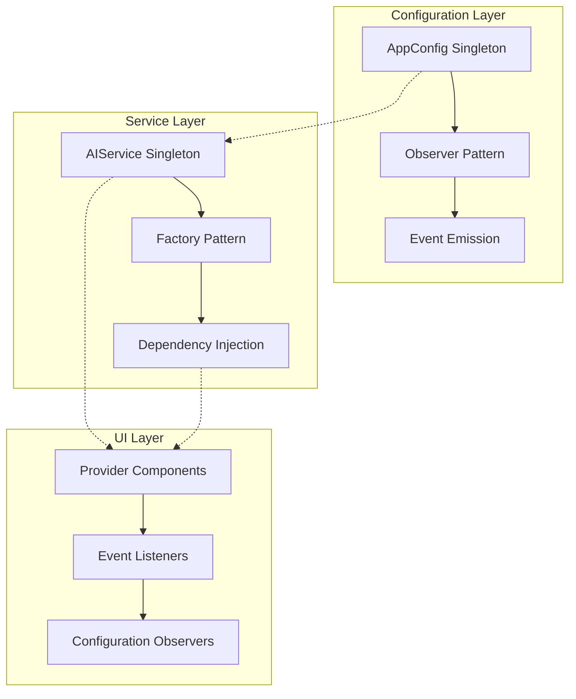

# Design Patterns

<cite>
**Referenced Files in This Document**
- [appConfig.ts](file://src/config/appConfig.ts)
- [aiService.ts](file://src/services/ai/aiService.ts)
- [modelFactory.ts](file://src/models/modelFactory.ts)
- [modelInterface.ts](file://src/models/modelInterface.ts)
- [types.ts](file://src/models/types.ts)
- [notificationManager.ts](file://src/services/notification/notificationManager.ts)
- [commitExplorer.ts](file://src/ui/components/commitExplorer.ts)
- [reviewManager.ts](file://src/services/review/reviewManager.ts)
- [extension.ts](file://src/extension.ts)
- [index.ts](file://src/i18n/index.ts)
</cite>

## Table of Contents
1. [Introduction](#introduction)
2. [Singleton Pattern](#singleton-pattern)
3. [Factory Pattern](#factory-pattern)
4. [Observer Pattern](#observer-pattern)
5. [Dependency Injection Pattern](#dependency-injection-pattern)
6. [Implementation Analysis](#implementation-analysis)
7. [Common Issues and Solutions](#common-issues-and-solutions)
8. [Best Practices](#best-practices)
9. [Conclusion](#conclusion)

## Introduction

The CodeKarmic VS Code extension demonstrates sophisticated design patterns that ensure maintainable, scalable, and extensible architecture. This document explores four primary design patterns implemented throughout the system: Singleton, Factory, Observer, and Dependency Injection patterns. Each pattern serves specific architectural purposes and contributes to the overall robustness of the extension.

The system's architecture revolves around managing AI-powered code reviews while maintaining clean separation of concerns, enabling easy configuration management, and providing responsive user experiences through event-driven communication.

## Singleton Pattern

The Singleton pattern ensures that only one instance of a class exists throughout the application lifecycle, providing global access points to shared resources and services.

### AppConfig Singleton Implementation

The [`AppConfig`](file://src/config/appConfig.ts#L49-L189) class exemplifies the Singleton pattern for centralized configuration management:



**Diagram sources**
- [appConfig.ts](file://src/config/appConfig.ts#L49-L189)

#### Key Features:
- **Lazy Initialization**: Instance creation occurs only when [`getInstance()`](file://src/config/appConfig.ts#L83-L88) is called
- **Thread Safety**: Atomic instance creation prevents race conditions
- **Global Access**: Single point of configuration access across the application
- **Event Integration**: Built-in event emission for configuration change notifications

#### Benefits:
- **Centralized Management**: All configuration settings accessed through one interface
- **Memory Efficiency**: Single instance reduces memory footprint
- **Consistency**: Ensures uniform configuration access patterns

#### Trade-offs:
- **Test Complexity**: Requires careful mocking in unit tests
- **Global State**: Potential for unintended side effects across components

### AIService Singleton Implementation

The [`AIService`](file://src/services/ai/aiService.ts#L40-L787) follows the Singleton pattern for AI service management:



**Diagram sources**
- [aiService.ts](file://src/services/ai/aiService.ts#L40-L787)

#### Implementation Details:
- **Private Constructor**: Prevents external instantiation
- **Static Factory Method**: [`getInstance()`](file://src/services/ai/aiService.ts#L67-L72) controls instance creation
- **Resource Management**: Single AI service instance handles all code review operations
- **Lazy Loading**: Services are initialized only when needed

**Section sources**
- [appConfig.ts](file://src/config/appConfig.ts#L49-L189)
- [aiService.ts](file://src/services/ai/aiService.ts#L40-L787)

## Factory Pattern

The Factory pattern provides object creation logic while decoupling clients from specific class implementations, enabling flexible model service instantiation.

### AIModelFactoryImpl Implementation

The [`AIModelFactoryImpl`](file://src/models/modelFactory.ts#L19-L140) demonstrates the Factory pattern for creating AI model services:



**Diagram sources**
- [modelFactory.ts](file://src/models/modelFactory.ts#L19-L140)
- [modelInterface.ts](file://src/models/modelInterface.ts#L120-L139)

#### Factory Features:
- **Singleton Factory**: [`getInstance()`](file://src/models/modelFactory.ts#L36-L44) ensures single factory instance
- **Caching Mechanism**: Model services cached by model type and base URL
- **Dynamic Creation**: Supports multiple AI model types through switch statement
- **Configuration Management**: Factory configuration updates through [`updateConfig()`](file://src/models/modelFactory.ts#L50-L52)

#### Creation Logic:
The factory determines the appropriate model service based on configuration:

```typescript
switch (modelType.toLowerCase()) {
    case ModelType.DEEPSEEK_V3:
    case ModelType.DEEPSEEK_R1:
        service = new DeepSeekModelService(modelType, baseURL, apiKey);
        break;
    default:
        throw new Error(`Unsupported model type: ${modelType}`);
}
```

#### Benefits:
- **Abstraction**: Clients don't need to know specific model implementations
- **Extensibility**: Easy addition of new model types
- **Resource Optimization**: Service caching reduces memory usage
- **Configuration Flexibility**: Dynamic model selection based on settings

**Section sources**
- [modelFactory.ts](file://src/models/modelFactory.ts#L19-L140)
- [modelInterface.ts](file://src/models/modelInterface.ts#L120-L139)

## Observer Pattern

The Observer pattern enables loose coupling between components through event-driven communication, particularly evident in configuration change notifications.

### Event Emitter Implementation

The system uses Node.js [`EventEmitter`](file://src/config/appConfig.ts#L51) for configuration change notifications:



**Diagram sources**
- [appConfig.ts](file://src/config/appConfig.ts#L54-L77)

#### Configuration Change Events:

The [`ConfigChangeEvent`](file://src/config/appConfig.ts#L11-L17) enumeration defines observable events:

```typescript
export enum ConfigChangeEvent {
    LANGUAGE = 'language',
    API_KEY = 'apiKey',
    BASE_URL = 'baseUrl',
    MODEL_TYPE = 'modelType',
    ANY = 'any'
}
```

#### Observer Pattern Features:
- **Event-Driven Updates**: Components react to configuration changes automatically
- **Decoupled Communication**: Publishers don't know subscribers
- **Multiple Listeners**: Multiple components can observe the same event
- **Granular Control**: Specific events for different configuration areas

#### Implementation Details:
- **Automatic Detection**: [`onDidChangeConfiguration`](file://src/config/appConfig.ts#L58-L77) listener detects changes
- **Event Broadcasting**: [`emit()`](file://src/config/appConfig.ts#L74) notifies all registered listeners
- **Flexible Registration**: [`onChange()`](file://src/config/appConfig.ts#L117-L118) allows dynamic subscription

### I18nManager Observer Pattern

The [`I18nManager`](file://src/i18n/index.ts#L75-L113) demonstrates another Observer pattern implementation:



**Diagram sources**
- [index.ts](file://src/i18n/index.ts#L75-L113)

**Section sources**
- [appConfig.ts](file://src/config/appConfig.ts#L11-L189)
- [index.ts](file://src/i18n/index.ts#L75-L113)

## Dependency Injection Pattern

The Dependency Injection pattern promotes loose coupling by injecting dependencies rather than creating them internally, enhancing testability and flexibility.

### Service Dependencies

The [`ReviewManager`](file://src/services/review/reviewManager.ts#L79-L93) demonstrates dependency injection through constructor parameters:



**Diagram sources**
- [reviewManager.ts](file://src/services/review/reviewManager.ts#L79-L93)

#### Injection Benefits:
- **Testability**: Dependencies can be easily mocked for testing
- **Flexibility**: Different implementations can be injected
- **Separation of Concerns**: Clear dependency boundaries
- **Lifecycle Management**: Dependencies managed externally

### Extension-Level Injection

The [`extension.ts`](file://src/extension.ts#L20-L920) shows comprehensive dependency injection at the extension activation level:



**Diagram sources**
- [extension.ts](file://src/extension.ts#L20-L920)

#### Injection Patterns:
- **Constructor Injection**: [`ReviewManager(gitService)`](file://src/extension.ts#L72)
- **Singleton Access**: [`NotificationManager.getInstance()`](file://src/extension.ts#L23)
- **Factory Injection**: [`AIModelFactoryImpl.getInstance()`](file://src/extension.ts#L51)

### Provider Dependencies

The [`CommitExplorerProvider`](file://src/ui/components/commitExplorer.ts#L5) demonstrates UI component dependency injection:



**Diagram sources**
- [commitExplorer.ts](file://src/ui/components/commitExplorer.ts#L5)

**Section sources**
- [reviewManager.ts](file://src/services/review/reviewManager.ts#L79-L93)
- [extension.ts](file://src/extension.ts#L20-L920)
- [commitExplorer.ts](file://src/ui/components/commitExplorer.ts#L5)

## Implementation Analysis

### Pattern Combinations

The CodeKarmic system effectively combines multiple design patterns to achieve architectural excellence:



### Architectural Benefits

1. **Maintainability**: Clear separation of concerns through pattern implementation
2. **Scalability**: Easy addition of new AI models, configuration options, and UI components
3. **Testability**: Dependency injection enables comprehensive unit testing
4. **Flexibility**: Observer pattern allows dynamic component registration
5. **Performance**: Singleton pattern reduces memory overhead for frequently accessed services

### Code Quality Indicators

- **Single Responsibility**: Each class has focused, well-defined responsibilities
- **Open/Closed Principle**: Systems open for extension, closed for modification
- **Dependency Inversion**: High-level modules depend on abstractions, not concretions
- **Loose Coupling**: Components communicate through well-defined interfaces

**Section sources**
- [appConfig.ts](file://src/config/appConfig.ts#L49-L189)
- [aiService.ts](file://src/services/ai/aiService.ts#L40-L787)
- [modelFactory.ts](file://src/models/modelFactory.ts#L19-L140)
- [reviewManager.ts](file://src/services/review/reviewManager.ts#L79-L93)

## Common Issues and Solutions

### Singleton Pattern Issues

#### Problem: Memory Leaks in Singleton Instances
**Issue**: Singleton instances persist throughout application lifecycle, potentially causing memory leaks.

**Solution**: Implement proper cleanup mechanisms:
```typescript
// Example cleanup approach in factory pattern
public clearModelServices(type?: string): void {
    if (type) {
        // Clear specific model type
        for (const [key, _] of this.modelServices.entries()) {
            if (key.startsWith(type)) {
                this.modelServices.delete(key);
            }
        }
    } else {
        // Clear all cached services
        this.modelServices.clear();
    }
}
```

#### Problem: Testing Challenges
**Issue**: Singleton instances complicate unit testing due to shared state.

**Solution**: Implement test-friendly patterns:
```typescript
// Test-friendly singleton approach
export class TestableSingleton {
    private static instance: TestableSingleton;
    
    public static getInstance(testInstance?: TestableSingleton): TestableSingleton {
        if (!TestableSingleton.instance && testInstance) {
            TestableSingleton.instance = testInstance;
        }
        return TestableSingleton.instance;
    }
}
```

### Factory Pattern Issues

#### Problem: Tight Coupling Between Factory and Concrete Products
**Issue**: Adding new model types requires modifying factory switch statements.

**Solution**: Use plugin architecture or registry pattern:
```typescript
// Registry-based approach
private static factories: Map<string, () => AIModelService> = new Map();

public static registerFactory(type: string, factory: () => AIModelService): void {
    this.factories.set(type, factory);
}

public createModelService(): AIModelService {
    const factory = AIModelFactoryImpl.factories.get(modelType);
    if (!factory) {
        throw new Error(`No factory registered for model type: ${modelType}`);
    }
    return factory();
}
```

### Observer Pattern Issues

#### Problem: Memory Leaks from Unremoved Event Listeners
**Issue**: Event listeners accumulate over time, causing memory leaks.

**Solution**: Implement proper cleanup:
```typescript
// Cleanup approach
public dispose(): void {
    this.emitter.removeAllListeners();
    this.listeners.clear();
}
```

#### Problem: Event Handler Complexity
**Issue**: Complex event handling logic becomes difficult to manage.

**Solution**: Use event bus pattern with message routing:
```typescript
// Event bus implementation
export class EventBus {
    private handlers: Map<string, Function[]> = new Map();
    
    public subscribe(event: string, handler: Function): void {
        if (!this.handlers.has(event)) {
            this.handlers.set(event, []);
        }
        this.handlers.get(event)!.push(handler);
    }
    
    public publish(event: string, data: any): void {
        const handlers = this.handlers.get(event);
        if (handlers) {
            handlers.forEach(handler => handler(data));
        }
    }
}
```

### Dependency Injection Issues

#### Problem: Circular Dependencies
**Issue**: Services depend on each other, creating circular dependency chains.

**Solution**: Use lazy loading or service locator pattern:
```typescript
// Lazy loading approach
export class ReviewManager {
    private _gitService: GitService;
    
    public get gitService(): GitService {
        if (!this._gitService) {
            this._gitService = new GitService(); // Or use DI container
        }
        return this._gitService;
    }
}
```

#### Problem: Over-Injection
**Issue**: Services receive unnecessary dependencies, increasing complexity.

**Solution**: Implement interface segregation principle:
```typescript
// Interface segregation
export interface GitOperations {
    getCommits(): Promise<CommitInfo[]>;
    getCommitFiles(hash: string): Promise<CommitFile[]>;
}

export interface RepositoryManagement {
    setRepository(path: string): Promise<void>;
}

export class GitService implements GitOperations, RepositoryManagement {
    // Implementation
}
```

**Section sources**
- [modelFactory.ts](file://src/models/modelFactory.ts#L113-L140)
- [reviewManager.ts](file://src/services/review/reviewManager.ts#L79-L93)

## Best Practices

### Singleton Pattern Best Practices

1. **Thread Safety**: Ensure atomic instance creation
2. **Lazy Initialization**: Create instances only when needed
3. **Cleanup Strategy**: Implement proper disposal mechanisms
4. **Testing Support**: Provide ways to reset or replace instances in tests

### Factory Pattern Best Practices

1. **Interface Segregation**: Define specific factory interfaces
2. **Caching Strategy**: Implement intelligent caching for expensive operations
3. **Error Handling**: Provide meaningful error messages for unsupported types
4. **Configuration Management**: Allow runtime configuration updates

### Observer Pattern Best Practices

1. **Event Naming**: Use consistent, descriptive event names
2. **Handler Cleanup**: Always remove listeners when components are disposed
3. **Error Isolation**: Prevent observer failures from affecting publishers
4. **Performance**: Limit the number of listeners and optimize event dispatching

### Dependency Injection Best Practices

1. **Constructor Injection**: Prefer constructor injection for mandatory dependencies
2. **Interface Abstraction**: Depend on interfaces, not implementations
3. **Lifecycle Management**: Properly manage dependency lifecycles
4. **Testing Support**: Enable easy mocking and stubbing in tests

## Conclusion

The CodeKarmic VS Code extension demonstrates exemplary implementation of fundamental design patterns that contribute to its robust architecture. The combination of Singleton, Factory, Observer, and Dependency Injection patterns creates a maintainable, scalable, and testable codebase.

### Key Architectural Achievements

- **Configuration Management**: Centralized, event-driven configuration through AppConfig singleton
- **Service Abstraction**: Flexible AI model service creation via factory pattern
- **Responsive UI**: Event-driven UI updates through observer pattern
- **Modular Design**: Clean dependency injection enabling modular component development

### Future Enhancement Opportunities

1. **Plugin Architecture**: Extend factory pattern for third-party model integrations
2. **Advanced Caching**: Implement LRU caching for frequently accessed model services
3. **Event Streaming**: Enhance observer pattern with real-time event streaming
4. **Dependency Graph**: Visualize and analyze dependency relationships for optimization

The design patterns implemented in CodeKarmic serve as excellent examples of how thoughtful pattern application can lead to high-quality, maintainable software systems. These patterns not only solve immediate architectural challenges but also provide a foundation for future growth and enhancement.