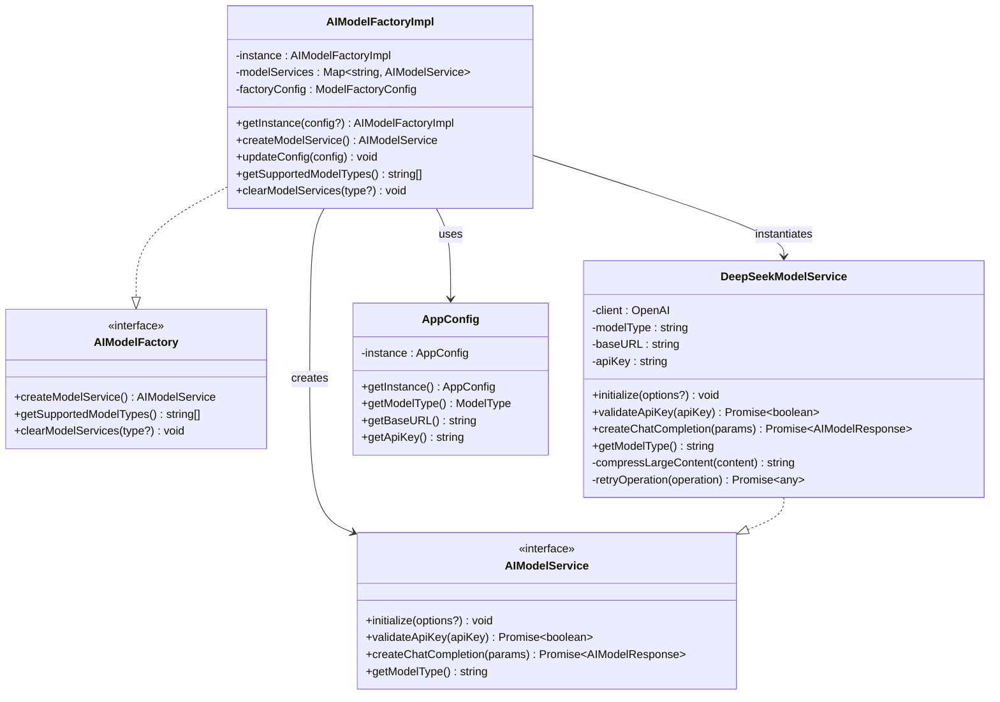
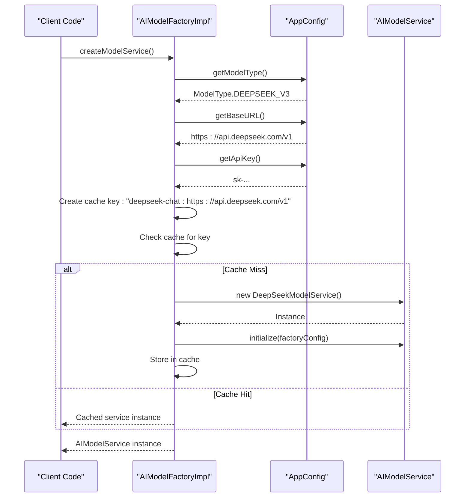
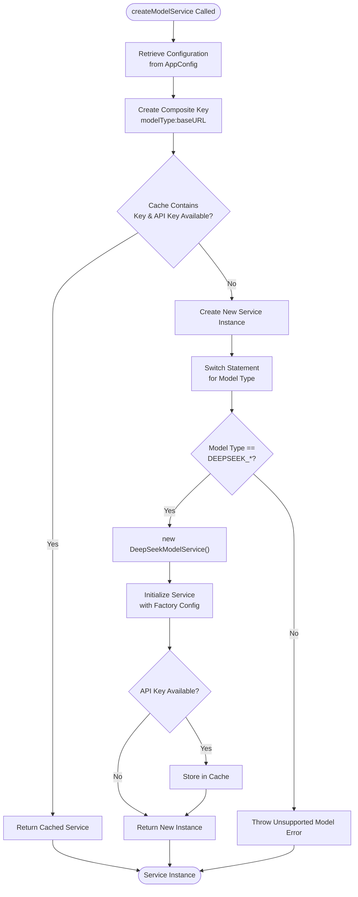
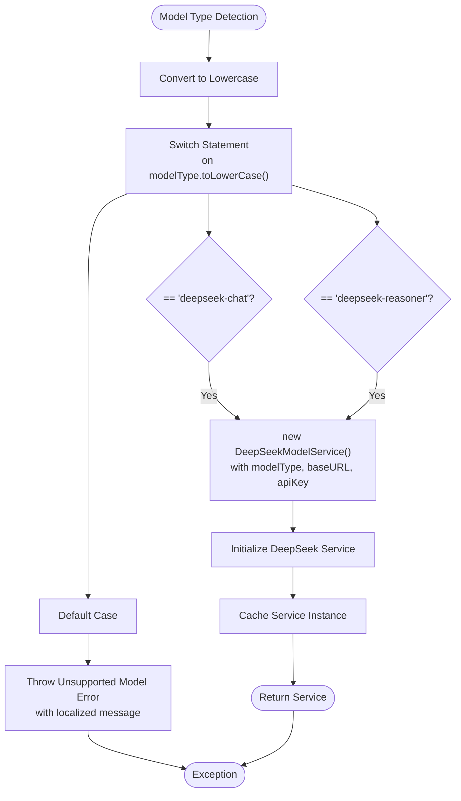
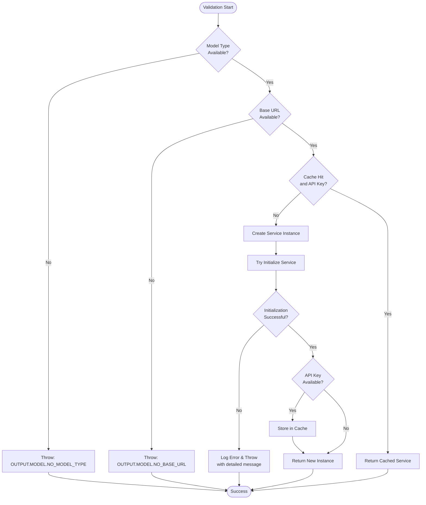

# Factory Pattern Implementation in AIModelFactoryImpl

<cite>
**Referenced Files in This Document**
- [modelFactory.ts](file://src/models/modelFactory.ts)
- [appConfig.ts](file://src/config/appConfig.ts)
- [deepseek.ts](file://src/models/providers/deepseek.ts)
- [types.ts](file://src/models/types.ts)
- [modelInterface.ts](file://src/models/modelInterface.ts)
- [aiService.ts](file://src/services/ai/aiService.ts)
- [index.ts](file://src/i18n/index.ts)
</cite>

## Table of Contents
1. [Introduction](#introduction)
2. [Factory Pattern Architecture](#factory-pattern-architecture)
3. [Core Components Analysis](#core-components-analysis)
4. [Configuration-Driven Service Creation](#configuration-driven-service-creation)
5. [Caching Mechanism](#caching-mechanism)
6. [Switch Statement Implementation](#switch-statement-implementation)
7. [Error Handling and Validation](#error-handling-and-validation)
8. [Performance Benefits](#performance-benefits)
9. [Extending the Factory](#extending-the-factory)
10. [Best Practices and Guidelines](#best-practices-and-guidelines)
11. [Troubleshooting Guide](#troubleshooting-guide)
12. [Conclusion](#conclusion)

## Introduction

The AIModelFactoryImpl implements a sophisticated Factory Pattern that dynamically creates and manages AI model services based on configuration-driven parameters. This implementation serves as the central hub for instantiating different AI model providers while maintaining optimal performance through intelligent caching mechanisms and robust error handling.

The factory pattern in this context provides several key advantages:
- **Abstraction**: Hides the complexity of model instantiation behind a unified interface
- **Flexibility**: Supports multiple AI providers with minimal code changes
- **Performance**: Implements intelligent caching to avoid redundant service creation
- **Maintainability**: Centralizes configuration and initialization logic

## Factory Pattern Architecture

The factory follows a classic Singleton pattern with factory capabilities, ensuring that only one instance manages all model services while providing thread-safe access to configuration and service creation methods.



**Diagram sources**
- [modelFactory.ts](file://src/models/modelFactory.ts#L19-L140)
- [modelInterface.ts](file://src/models/modelInterface.ts#L120-L139)
- [deepseek.ts](file://src/models/providers/deepseek.ts#L11-L211)
- [appConfig.ts](file://src/config/appConfig.ts#L49-L189)

## Core Components Analysis

### AIModelFactoryImpl Class

The factory implementation serves as the primary orchestrator for model service creation, featuring:

- **Singleton Pattern**: Ensures single instance management with configurable updates
- **Service Registry**: Maintains a Map-based cache of instantiated services
- **Configuration Management**: Integrates with AppConfig for dynamic parameter retrieval
- **Factory Configuration**: Supports runtime configuration updates for compression settings

### ModelFactoryConfig Interface

Defines the factory's operational parameters:
- `enableLargeFileCompression`: Controls automatic content compression for large files
- `compressionThreshold`: Sets the character limit for triggering compression

### Service Lifecycle Management

The factory manages the complete lifecycle of AI model services:
1. **Configuration Retrieval**: Fetches model type, base URL, and API key from AppConfig
2. **Cache Lookup**: Checks for existing service instances using composite keys
3. **Service Instantiation**: Creates new instances when cache misses occur
4. **Initialization**: Configures services with factory settings and default parameters
5. **Caching**: Stores successful instances for future reuse

**Section sources**
- [modelFactory.ts](file://src/models/modelFactory.ts#L19-L140)

## Configuration-Driven Service Creation

The factory leverages the AppConfig system to retrieve configuration parameters dynamically, enabling runtime adjustments without code changes.

### Configuration Flow



**Diagram sources**
- [modelFactory.ts](file://src/models/modelFactory.ts#L58-L113)
- [appConfig.ts](file://src/config/appConfig.ts#L176-L188)

### Configuration Parameters

The factory relies on four critical configuration parameters:

| Parameter | Type | Purpose | Default Value |
|-----------|------|---------|---------------|
| `modelType` | ModelType | Specifies the AI provider and model variant | `deepseek-reasoner` |
| `baseURL` | string | API endpoint URL for the model provider | `https://api.deepseek.com/v1` |
| `apiKey` | string | Authentication credentials for API access | Empty string |
| `enableLargeFileCompression` | boolean | Controls automatic content compression | `true` |
| `compressionThreshold` | number | Character limit for compression trigger | `10000` |

**Section sources**
- [modelFactory.ts](file://src/models/modelFactory.ts#L58-L70)
- [appConfig.ts](file://src/config/appConfig.ts#L37-L42)

## Caching Mechanism

The factory implements a sophisticated caching system using composite keys to optimize performance and resource utilization.

### Composite Key Strategy

The caching mechanism employs a composite key format combining model type and base URL:

```typescript
// Cache key format: "${modelType}:${baseURL}"
const cacheKey = `${modelType}:${baseURL}`;
```

This approach ensures:
- **Provider Isolation**: Different providers (DeepSeek, OpenAI, etc.) don't interfere with each other
- **Endpoint Separation**: Multiple endpoints for the same provider are treated as distinct services
- **API Key Protection**: Services without API keys aren't cached, preventing unauthorized access attempts

### Cache Operations



**Diagram sources**
- [modelFactory.ts](file://src/models/modelFactory.ts#L72-L113)

### Cache Management Methods

The factory provides comprehensive cache management capabilities:

- **Selective Clearing**: Remove services for specific model types
- **Complete Clearing**: Reset the entire cache registry
- **Automatic Cleanup**: Services without API keys aren't cached

**Section sources**
- [modelFactory.ts](file://src/models/modelFactory.ts#L123-L139)

## Switch Statement Implementation

The factory uses a strategic switch statement to handle different model types, currently supporting DeepSeek models with extensible architecture for future providers.

### Current Implementation



**Diagram sources**
- [modelFactory.ts](file://src/models/modelFactory.ts#L85-L93)

### Supported Model Types

The factory currently supports the following DeepSeek variants:

| Model Type | Constant | Display Name | Use Case |
|------------|----------|--------------|----------|
| `deepseek-chat` | `DEEPSEEK_V3` | DeepSeek V3 | General chat and code assistance |
| `deepseek-reasoner` | `DEEPSEEK_R1` | DeepSeek R1 | Advanced reasoning tasks |

### Extensibility Design

The switch statement structure allows easy addition of new model providers:

```typescript
// Future extension example
switch (modelType.toLowerCase()) {
    case ModelType.DEEPSEEK_V3:
    case ModelType.DEEPSEEK_R1:
        service = new DeepSeekModelService(modelType, baseURL, apiKey);
        break;
    case ModelType.OPENAI:
        service = new OpenAIModelService(modelType, baseURL, apiKey);
        break;
    case ModelType.ANTHROPIC:
        service = new AnthropicModelService(modelType, baseURL, apiKey);
        break;
    default:
        throw new Error(OUTPUT.MODEL.UNSUPPORTED_MODEL_TYPE + modelType);
}
```

**Section sources**
- [modelFactory.ts](file://src/models/modelFactory.ts#L85-L93)
- [types.ts](file://src/models/types.ts#L10-L13)

## Error Handling and Validation

The factory implements comprehensive error handling with localized messages and graceful degradation strategies.

### Validation Pipeline



**Diagram sources**
- [modelFactory.ts](file://src/models/modelFactory.ts#L64-L113)

### Error Categories

The factory handles multiple error scenarios with appropriate messaging:

| Error Type | Condition | Message Source | Recovery Strategy |
|------------|-----------|----------------|-------------------|
| Missing Model Type | `!modelType` | `OUTPUT.MODEL.NO_MODEL_TYPE` | Throw with configuration guidance |
| Missing Base URL | `!baseURL` | `OUTPUT.MODEL.NO_BASE_URL` | Throw with endpoint configuration |
| Unsupported Model | Default case | `OUTPUT.MODEL.UNSUPPORTED_MODEL_TYPE` | Throw with supported model list |
| Initialization Failure | Exception during `service.initialize()` | Detailed error message | Log and rethrow with context |

### Internationalization Support

Error messages leverage the i18n system for localization:

```typescript
// Example error message construction
const errorMessage = OUTPUT.MODEL.UNSUPPORTED_MODEL_TYPE + modelType;
throw new Error(errorMessage);
```

**Section sources**
- [modelFactory.ts](file://src/models/modelFactory.ts#L64-L93)
- [index.ts](file://src/i18n/index.ts#L1-L188)

## Performance Benefits

The factory implementation delivers significant performance improvements through strategic caching and optimization techniques.

### Caching Benefits

| Benefit | Implementation | Performance Impact |
|---------|----------------|-------------------|
| **Instance Reuse** | Composite key caching | Eliminates redundant object creation |
| **Memory Efficiency** | Single service instance per configuration | Reduces memory footprint |
| **Initialization Speed** | Cached services skip expensive setup | Faster response times |
| **Resource Management** | Controlled service lifecycle | Prevents resource leaks |

### Optimization Strategies

1. **Lazy Initialization**: Services are only created when needed
2. **Conditional Caching**: Only services with API keys are cached
3. **Composite Keys**: Prevents cache collisions across providers/endpoints
4. **Factory Configuration**: Centralized settings for all services

### Performance Metrics

The factory enables several performance optimizations:

- **Reduced API Calls**: Cached services avoid unnecessary initialization overhead
- **Faster Response Times**: Direct cache hits eliminate creation delays
- **Memory Conservation**: Shared instances reduce garbage collection pressure
- **Scalability**: Efficient resource management supports concurrent usage

**Section sources**
- [modelFactory.ts](file://src/models/modelFactory.ts#L72-L113)

## Extending the Factory

The factory's modular design facilitates easy extension for new AI model providers while maintaining backward compatibility and consistent behavior.

### Adding New Model Providers

To add support for a new AI provider:

1. **Define Model Type**: Add constant to `ModelType` enum
2. **Update Display Names**: Add mapping to `ModelDisplayNames`
3. **Implement Service Class**: Create provider-specific service class
4. **Extend Switch Statement**: Add case for new model type
5. **Update Supported Types**: Modify `getSupportedModelTypes()`

### Extension Example

```typescript
// Step 1: Add to ModelType enum
export enum ModelType {
    DEEPSEEK_V3 = 'deepseek-chat',
    DEEPSEEK_R1 = 'deepseek-reasoner',
    OPENAI = 'openai',
    ANTHROPIC = 'anthropic', // New provider
    NEW_PROVIDER = 'new-provider' // New provider
}

// Step 2: Update display names
export const ModelDisplayNames = {
    [ModelType.DEEPSEEK_V3]: 'DeepSeek V3',
    [ModelType.DEEPSEEK_R1]: 'DeepSeek R1',
    [ModelType.OPENAI]: 'OpenAI',
    [ModelType.ANTHROPIC]: 'Anthropic', // New provider
    [ModelType.NEW_PROVIDER]: 'New Provider' // New provider
};

// Step 3: Implement service class (similar to DeepSeekModelService)
export class NewProviderModelService extends AbstractAIModelService {
    // Implementation details...
}

// Step 4: Extend switch statement
switch (modelType.toLowerCase()) {
    // Existing cases...
    case ModelType.NEW_PROVIDER:
        service = new NewProviderModelService(modelType, baseURL, apiKey);
        break;
    default:
        throw new Error(OUTPUT.MODEL.UNSUPPORTED_MODEL_TYPE + modelType);
}
```

### Best Practices for Extensions

1. **Inherit from AbstractAIModelService**: Leverage common functionality
2. **Implement Required Methods**: Ensure compliance with AIModelService interface
3. **Add Comprehensive Error Handling**: Provide meaningful error messages
4. **Support Configuration Options**: Allow factory configuration customization
5. **Test Thoroughly**: Verify caching and initialization behavior

**Section sources**
- [modelFactory.ts](file://src/models/modelFactory.ts#L116-L121)
- [types.ts](file://src/models/types.ts#L10-L21)

## Best Practices and Guidelines

### Factory Usage Patterns

1. **Singleton Access**: Always use `AIModelFactoryImpl.getInstance()` for factory access
2. **Configuration Updates**: Use `updateConfig()` for runtime parameter changes
3. **Cache Management**: Clear caches appropriately when configuration changes
4. **Error Handling**: Wrap factory calls in try-catch blocks for production code

### Configuration Management

```typescript
// Recommended usage pattern
const factory = AIModelFactoryImpl.getInstance({
    enableLargeFileCompression: true,
    compressionThreshold: 10000
});

// Update configuration if needed
factory.updateConfig({
    compressionThreshold: 20000
});
```

### Service Lifecycle Management

- **Initialization**: Factory handles service initialization automatically
- **Reuse**: Leverage caching for improved performance
- **Cleanup**: Use `clearModelServices()` when appropriate
- **Monitoring**: Track cache hit rates for performance optimization

### Security Considerations

1. **API Key Protection**: Services without API keys aren't cached
2. **Configuration Validation**: Factory validates all required parameters
3. **Error Information**: Avoid exposing sensitive information in error messages
4. **Resource Limits**: Monitor cache size and service counts

## Troubleshooting Guide

### Common Issues and Solutions

| Issue | Symptoms | Cause | Solution |
|-------|----------|-------|---------|
| **Unsupported Model Type** | Factory throws error | Invalid model type in configuration | Check `ModelType` enum and configuration |
| **Missing API Key** | Service initialization fails | Empty or missing API key | Configure valid API key in settings |
| **Cache Not Working** | New instances created frequently | API key not available for caching | Ensure API key is configured |
| **Configuration Not Applied** | Changes not reflected | Factory not updated | Call `updateConfig()` after changes |
| **Performance Issues** | Slow service creation | Cache misses or initialization overhead | Check cache configuration and keys |

### Debugging Techniques

1. **Enable Logging**: Monitor factory operations through console logs
2. **Check Cache State**: Use `clearModelServices()` to reset cache
3. **Validate Configuration**: Verify AppConfig parameters are correct
4. **Test Individual Services**: Create services manually to isolate issues

### Diagnostic Commands

```typescript
// Check supported model types
const factory = AIModelFactoryImpl.getInstance();
console.log('Supported models:', factory.getSupportedModelTypes());

// Clear cache for specific model type
factory.clearModelServices(ModelType.DEEPSEEK_V3);

// Update configuration
factory.updateConfig({ enableLargeFileCompression: false });
```

**Section sources**
- [modelFactory.ts](file://src/models/modelFactory.ts#L116-L139)

## Conclusion

The AIModelFactoryImpl demonstrates a sophisticated implementation of the Factory Pattern that successfully balances flexibility, performance, and maintainability. Through its configuration-driven approach, intelligent caching mechanism, and extensible architecture, it provides a robust foundation for managing AI model services in diverse environments.

Key strengths of this implementation include:

- **Dynamic Service Creation**: Configuration-driven instantiation eliminates hard-coded dependencies
- **Intelligent Caching**: Composite key strategy optimizes resource utilization while maintaining isolation
- **Error Resilience**: Comprehensive validation and error handling ensure reliable operation
- **Extensibility**: Modular design supports easy addition of new model providers
- **Performance Optimization**: Strategic caching reduces initialization overhead and memory usage

The factory serves as an excellent example of how the Factory Pattern can be applied to real-world AI service management, providing developers with a clean abstraction layer while delivering significant performance benefits through intelligent caching and resource management.

Future enhancements could include support for asynchronous initialization, more granular cache expiration policies, and expanded monitoring capabilities for production deployments.