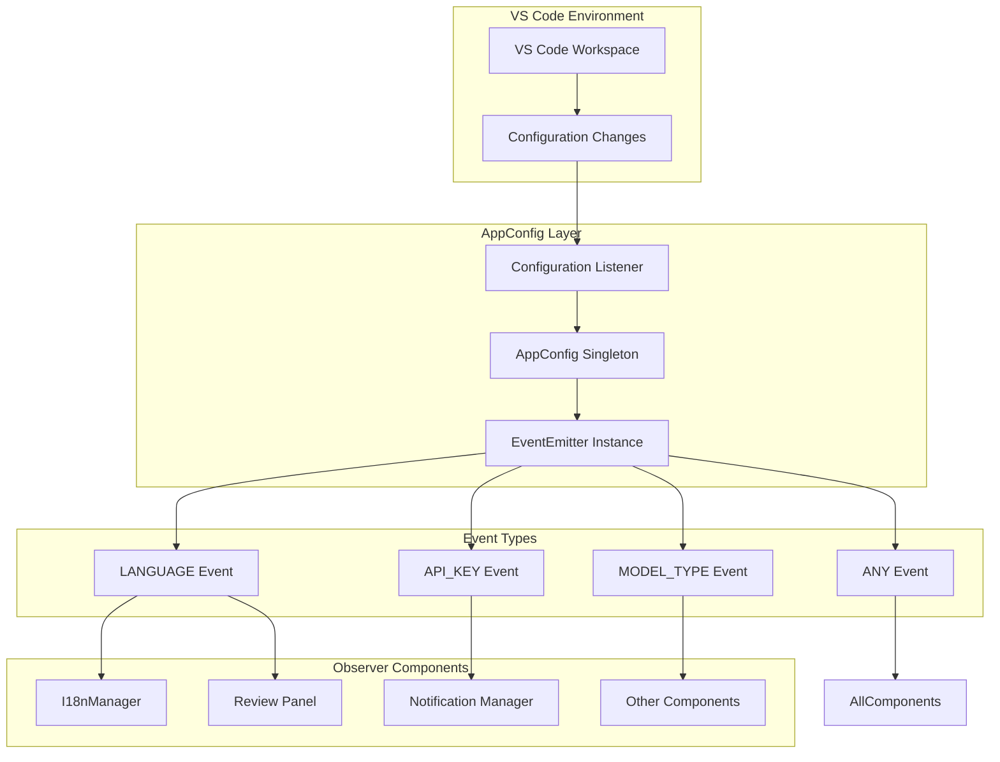
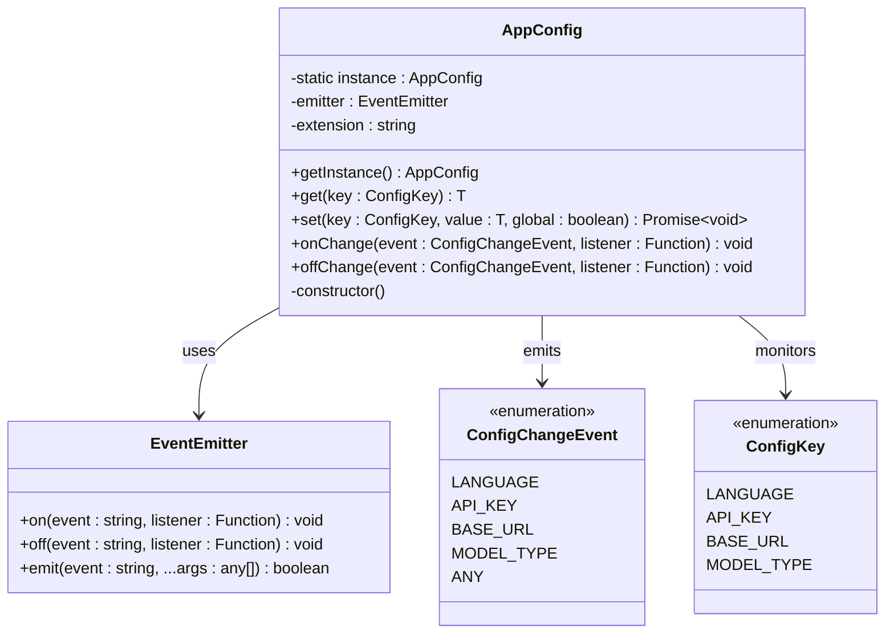
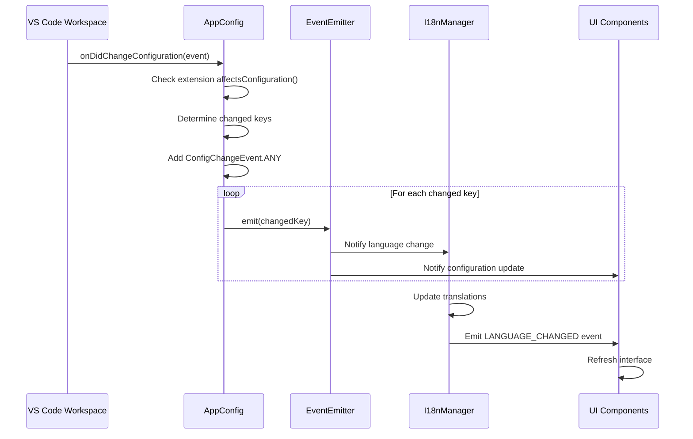
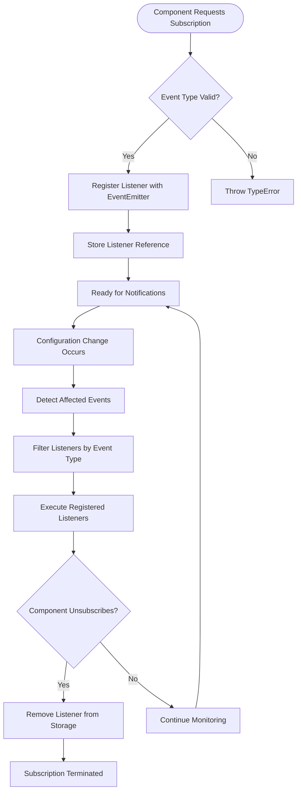
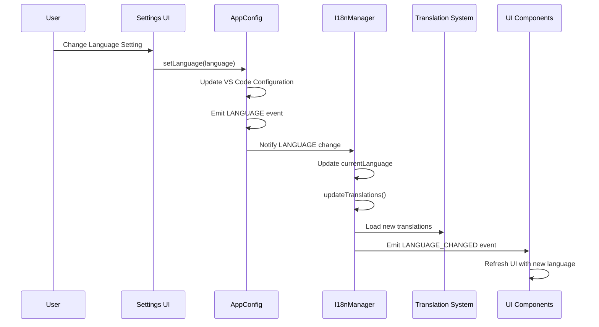
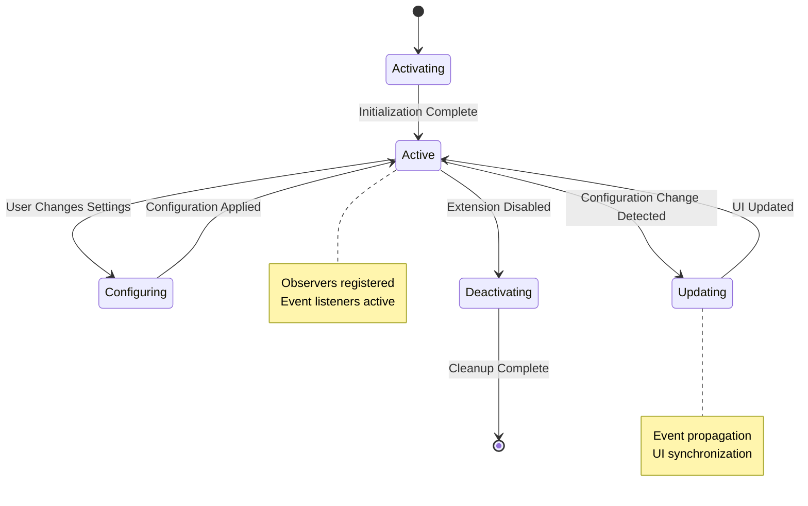
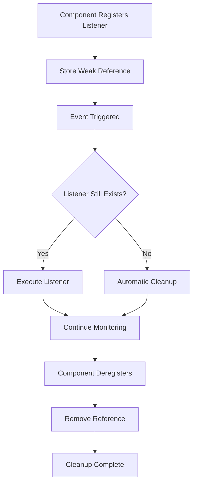
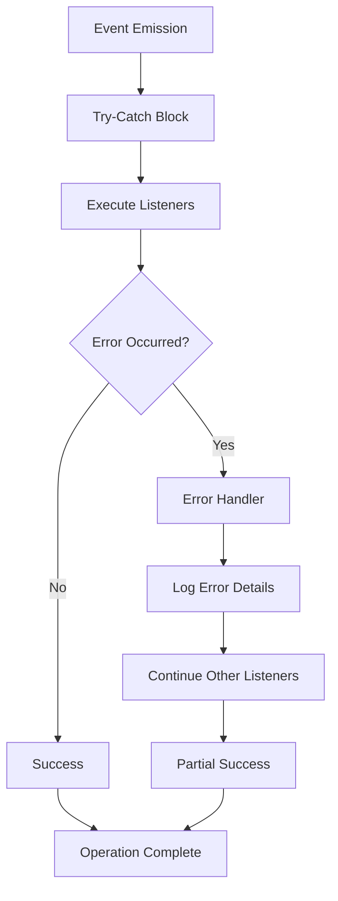

# Observer Pattern Implementation in AppConfig

<cite>
**Referenced Files in This Document**
- [appConfig.ts](file://src/config/appConfig.ts)
- [index.ts](file://src/i18n/index.ts)
- [types.ts](file://src/models/types.ts)
- [extension.ts](file://src/extension.ts)
- [notificationManager.ts](file://src/services/notification/notificationManager.ts)
</cite>

## Table of Contents
1. [Introduction](#introduction)
2. [Architecture Overview](#architecture-overview)
3. [EventEmitter Foundation](#eventemitter-foundation)
4. [Configuration Change Events](#configuration-change-events)
5. [Observer Pattern Implementation](#observer-pattern-implementation)
6. [Language Switching and UI Updates](#language-switching-and-ui-updates)
7. [Lifecycle Management](#lifecycle-management)
8. [Memory Leak Prevention](#memory-leak-prevention)
9. [Performance Considerations](#performance-considerations)
10. [Error Handling and Propagation](#error-handling-and-propagation)
11. [Best Practices](#best-practices)
12. [Troubleshooting Guide](#troubleshooting-guide)

## Introduction

The CodeKarmic extension implements a sophisticated Observer Pattern through the AppConfig class to manage configuration changes in the VS Code environment. This pattern enables reactive updates across the entire application whenever configuration settings change, particularly for language preferences, API keys, model types, and base URLs.

The implementation leverages Node.js's built-in EventEmitter alongside VS Code's native configuration change detection to create a robust, event-driven architecture that ensures UI consistency and responsive user experiences.

## Architecture Overview

The Observer Pattern implementation follows a centralized configuration management approach with distributed event handling:

**Diagram sources**
- [appConfig.ts](file://src/config/appConfig.ts#L54-L77)
- [index.ts](file://src/i18n/index.ts#L85-L102)

**Section sources**
- [appConfig.ts](file://src/config/appConfig.ts#L44-L88)
- [index.ts](file://src/i18n/index.ts#L75-L112)

## EventEmitter Foundation

The AppConfig class establishes the foundation for the Observer Pattern through a dedicated EventEmitter instance that manages all configuration change notifications:

**Diagram sources**
- [appConfig.ts](file://src/config/appConfig.ts#L49-L128)

The EventEmitter serves as the central hub for all configuration change notifications, providing:

- **Type-safe event emission** through strongly-typed enums
- **Flexible listener management** with registration and deregistration capabilities
- **Automatic event propagation** to all registered observers
- **Performance optimization** through efficient event dispatching

**Section sources**
- [appConfig.ts](file://src/config/appConfig.ts#L50-L56)

## Configuration Change Events

The system defines a comprehensive set of configuration change events that enable fine-grained control over which components respond to specific changes:

| Event Type | Purpose | Trigger Conditions | Impact |
|------------|---------|-------------------|---------|
| `LANGUAGE` | Language preference changes | User changes language setting | UI translation updates, locale-specific formatting |
| `API_KEY` | Authentication credential changes | API key modification | Service availability, authentication state |
| `BASE_URL` | Service endpoint changes | Base URL configuration update | API connectivity, service routing |
| `MODEL_TYPE` | AI model selection changes | Model type configuration | AI service behavior, feature availability |
| `ANY` | General configuration changes | Any configuration setting modification | Comprehensive system refresh |

### Event Emission Process

The configuration change detection and event emission process follows a systematic approach:

**Diagram sources**
- [appConfig.ts](file://src/config/appConfig.ts#L57-L77)
- [index.ts](file://src/i18n/index.ts#L96-L102)

**Section sources**
- [appConfig.ts](file://src/config/appConfig.ts#L11-L17)
- [appConfig.ts](file://src/config/appConfig.ts#L57-L77)

## Observer Pattern Implementation

### Constructor Registration

The AppConfig constructor establishes the primary event listener that monitors VS Code's workspace configuration changes:

The implementation demonstrates several key observer pattern principles:

- **Centralized Event Detection**: Single listener monitors all configuration changes
- **Selective Processing**: Only processes changes affecting the extension
- **Event Aggregation**: Groups multiple changes into unified notifications
- **Type Safety**: Uses strongly-typed enums for event identification

### onChange and offChange Methods

The observer pattern provides explicit subscription and unsubscription mechanisms:

**Diagram sources**
- [appConfig.ts](file://src/config/appConfig.ts#L117-L128)

**Section sources**
- [appConfig.ts](file://src/config/appConfig.ts#L117-L128)

## Language Switching and UI Updates

The language switching mechanism exemplifies the Observer Pattern's power in maintaining UI consistency:

### Language Change Flow

**Diagram sources**
- [index.ts](file://src/i18n/index.ts#L96-L102)
- [appConfig.ts](file://src/config/appConfig.ts#L139-L141)

### Translation Fallback Mechanism

The I18nManager implements a sophisticated fallback system that ensures graceful degradation when translations are missing:

- **Primary Language Loading**: Loads translations for the selected language
- **Fallback to English**: Automatically falls back to English for missing translations
- **Nested Object Support**: Handles nested translation objects with recursive fallback
- **Proxy-based Transparency**: Provides transparent access to translated content

**Section sources**
- [index.ts](file://src/i18n/index.ts#L75-L173)

## Lifecycle Management

### Extension Activation and Deactivation

The extension lifecycle demonstrates proper observer pattern implementation with resource management:

**Diagram sources**
- [extension.ts](file://src/extension.ts#L20-L520)
- [extension.ts](file://src/extension.ts#L662-L665)

### Resource Management Best Practices

The extension implements several lifecycle management patterns:

- **Singleton Pattern**: AppConfig maintains a single instance throughout the extension lifecycle
- **Lazy Initialization**: Components initialize only when needed
- **Graceful Degradation**: Components handle missing configurations appropriately
- **Resource Cleanup**: Proper cleanup during extension deactivation

**Section sources**
- [extension.ts](file://src/extension.ts#L20-L520)
- [extension.ts](file://src/extension.ts#L662-L665)

## Memory Leak Prevention

### Automatic Listener Management

The observer pattern implementation includes several mechanisms to prevent memory leaks:

### Best Practices for Listener Management

1. **Explicit Unsubscription**: Components should explicitly remove listeners when appropriate
2. **Context Binding**: Properly bind listener contexts to prevent orphaned references
3. **Weak References**: Use weak references where possible to avoid circular dependencies
4. **Lifecycle Awareness**: Components should be aware of their lifecycle boundaries

**Section sources**
- [appConfig.ts](file://src/config/appConfig.ts#L117-L128)

## Performance Considerations

### Event Propagation Optimization

The system implements several performance optimizations for event-driven updates:

| Optimization Technique | Implementation | Performance Benefit |
|----------------------|----------------|-------------------|
| **Event Aggregation** | Single listener processes multiple changes | Reduced overhead from multiple callbacks |
| **Selective Broadcasting** | Only affected components receive notifications | Minimized unnecessary UI updates |
| **Batch Processing** | Group related changes into single update cycles | Improved responsiveness |
| **Lazy Evaluation** | Defer expensive operations until needed | Better initial load performance |

### Scalability Patterns

The observer pattern scales efficiently with:

- **Modular Architecture**: Components register only for relevant events
- **Event Filtering**: Early filtering prevents unnecessary processing
- **Asynchronous Processing**: Non-blocking event handling maintains UI responsiveness
- **Resource Pooling**: Shared resources reduce memory footprint

**Section sources**
- [appConfig.ts](file://src/config/appConfig.ts#L57-L77)

## Error Handling and Propagation

### Robust Error Management

The system implements comprehensive error handling for observer pattern operations:

### Error Recovery Strategies

1. **Graceful Degradation**: Components continue operating with reduced functionality
2. **Error Isolation**: Failed listeners don't affect other components
3. **Logging and Monitoring**: Comprehensive error logging for debugging
4. **User Feedback**: Appropriate user notifications for critical errors

**Section sources**
- [notificationManager.ts](file://src/services/notification/notificationManager.ts#L79-L117)

## Best Practices

### Observer Pattern Implementation Guidelines

1. **Single Responsibility**: Each observer handles one specific aspect of configuration changes
2. **Loose Coupling**: Components depend on abstractions, not concrete implementations
3. **Event Naming Conventions**: Consistent, descriptive event names improve maintainability
4. **Documentation**: Comprehensive documentation of event types and listener requirements

### Code Organization Principles

- **Separation of Concerns**: Configuration management separate from UI logic
- **Dependency Injection**: Loose coupling through dependency injection patterns
- **Testing Strategy**: Observable patterns lend themselves to effective unit testing
- **Debugging Support**: Comprehensive logging and debugging capabilities

## Troubleshooting Guide

### Common Issues and Solutions

| Issue | Symptoms | Root Cause | Solution |
|-------|----------|------------|----------|
| **Stale UI After Language Change** | Interface remains in old language | Listener not properly registered | Verify onChange registration |
| **Memory Leaks** | Increasing memory usage over time | Listeners not removed | Implement proper offChange calls |
| **Missing Configuration Updates** | Settings changes not reflected | Incorrect event type | Check ConfigChangeEvent usage |
| **Performance Degradation** | Slow UI updates | Too many listeners or heavy processing | Optimize listener implementations |

### Debugging Observer Pattern Issues

1. **Enable Debug Logging**: Use NotificationManager for detailed event tracing
2. **Verify Event Registration**: Ensure all components properly register for relevant events
3. **Check Event Propagation**: Verify events are being emitted and received correctly
4. **Monitor Memory Usage**: Regular monitoring helps identify potential leaks

### Performance Monitoring

- **Event Frequency Tracking**: Monitor how often configuration changes occur
- **Listener Execution Time**: Measure time spent in individual listeners
- **Memory Usage Patterns**: Track memory allocation during event processing
- **UI Responsiveness Metrics**: Monitor UI update performance

**Section sources**
- [notificationManager.ts](file://src/services/notification/notificationManager.ts#L79-L128)

## Conclusion

The Observer Pattern implementation in CodeKarmic's AppConfig system demonstrates a sophisticated approach to configuration management in VS Code extensions. Through careful design of EventEmitter-based communication, type-safe event handling, and comprehensive lifecycle management, the system provides a robust foundation for reactive UI updates while maintaining performance and preventing memory leaks.

The implementation showcases best practices for event-driven architectures, including proper resource management, error handling, and scalability considerations. By following these patterns, developers can build responsive, maintainable applications that adapt seamlessly to user configuration changes.