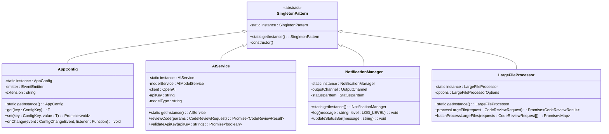

# Singleton Pattern Implementation in CodeKarmic

<cite>
**Referenced Files in This Document**
- [appConfig.ts](file://src/config/appConfig.ts)
- [aiService.ts](file://src/services/ai/aiService.ts)
- [notificationManager.ts](file://src/services/notification/notificationManager.ts)
- [largeFileProcessor.ts](file://src/core/compression/largeFileProcessor.ts)
- [extension.ts](file://src/extension.ts)
</cite>

## Table of Contents
1. [Introduction](#introduction)
2. [Singleton Pattern Overview](#singleton-pattern-overview)
3. [AppConfig Singleton Implementation](#appconfig-singleton-implementation)
4. [AIService Singleton Implementation](#aiservice-singleton-implementation)
5. [Additional Singleton Services](#additional-singleton-services)
6. [Benefits in VS Code Extension Context](#benefits-in-vs-code-extension-context)
7. [Performance Considerations](#performance-considerations)
8. [Testing Challenges and Solutions](#testing-challenges-and-solutions)
9. [Common Issues and Best Practices](#common-issues-and-best-practices)
10. [Conclusion](#conclusion)

## Introduction

The CodeKarmic VS Code extension employs the Singleton design pattern extensively to manage critical resources and ensure consistent state across the entire application. Singletons provide controlled access to shared instances of configuration managers, AI services, and notification systems, which is essential for maintaining coherence in a complex development tool that integrates with external APIs and manages multiple concurrent operations.

This documentation explores how CodeKarmic implements the Singleton pattern through four primary components: AppConfig for centralized configuration management, AIService for AI operations coordination, NotificationManager for user communication, and LargeFileProcessor for handling large code files efficiently.

## Singleton Pattern Overview

The Singleton pattern ensures that a class has only one instance while providing a global access point to that instance. In CodeKarmic, this pattern is implemented consistently across all major services with the following characteristics:

- **Private Constructor**: Prevents external instantiation
- **Static Instance Reference**: Maintains a single instance reference
- **Static Factory Method**: Provides controlled access to the instance
- **Lazy Initialization**: Creates the instance only when needed



**Diagram sources**
- [appConfig.ts](file://src/config/appConfig.ts#L49-L189)
- [aiService.ts](file://src/services/ai/aiService.ts#L40-L787)
- [notificationManager.ts](file://src/services/notification/notificationManager.ts#L7-L211)
- [largeFileProcessor.ts](file://src/core/compression/largeFileProcessor.ts#L23-L242)

## AppConfig Singleton Implementation

The AppConfig class serves as the central configuration hub for the entire CodeKarmic extension, managing all application settings including API keys, model types, base URLs, and language preferences.

### Implementation Details

The AppConfig singleton follows the classic Singleton pattern with lazy initialization:

```typescript
// Private static instance reference
private static instance: AppConfig;

// Private constructor prevents external instantiation
private constructor() {
    this.emitter = new EventEmitter();
    
    // Listen for VS Code configuration changes
    vscode.workspace.onDidChangeConfiguration(e => {
        if (e.affectsConfiguration(this.extension)) {
            // Handle configuration change events
        }
    });
}

// Static factory method for controlled access
public static getInstance(): AppConfig {
    if (!AppConfig.instance) {
        AppConfig.instance = new AppConfig();
    }
    return AppConfig.instance;
}
```

### Key Features

**Centralized Configuration Management**: AppConfig provides unified access to all extension settings through a consistent interface:

- **Type-Safe Configuration Keys**: Uses enums for configuration keys to prevent typos
- **Event-Driven Updates**: Automatically notifies subscribers when configurations change
- **Default Value Support**: Provides sensible defaults for all configuration options
- **Validation**: Ensures configuration values meet required criteria

**Configuration Change Events**: The system supports fine-grained event handling for configuration updates:

```typescript
// Event types for configuration changes
export enum ConfigChangeEvent {
    LANGUAGE = 'language',
    API_KEY = 'apiKey',
    BASE_URL = 'baseUrl',
    MODEL_TYPE = 'modelType',
    ANY = 'any'
}
```

**Section sources**
- [appConfig.ts](file://src/config/appConfig.ts#L49-L189)

## AIService Singleton Implementation

The AIService singleton coordinates all AI-related operations in the CodeKarmic extension, serving as the primary interface between the extension and external AI models like DeepSeek.

### Architecture and Design

The AIService implements a sophisticated singleton pattern with dependency injection:

```typescript
// Singleton instance management
private static instance: AIService;

// Dependencies injected during construction
private modelService: AIModelService | undefined;
private client: OpenAI | undefined;
private apiKey: string | undefined;
private modelType: string;

// Constructor initializes dependencies
private constructor() {
    const modelFactory = AIModelFactoryImpl.getInstance();
    const config = AppConfig.getInstance();
    const apiKey = config.getApiKey();
    const modelType = config.getModelType();
    
    if (apiKey) {
        this.modelService = modelFactory.createModelService();
    }
    
    this.largeFileProcessor = LargeFileProcessor.getInstance();
}
```

### Core Capabilities

**Unified AI Operations**: The AIService provides a single entry point for all AI-related functionality:

- **Code Review**: Comprehensive code analysis with support for both full file and diff-based reviews
- **Batch Processing**: Efficient handling of multiple files simultaneously
- **Large File Support**: Specialized processing for files exceeding token limits
- **Streaming Responses**: Real-time AI response streaming for improved user experience

**Intelligent Caching**: Implements intelligent caching mechanisms to optimize performance:

```typescript
// Diff content caching for Git operations
private diffCache: Map<string, string> = new Map();

// Cache key generation based on file path and content fingerprint
const cacheKey = `${params.filePath}:${this.largeFileProcessor.calculateFingerprint(params.currentContent)}`;
```

**Error Handling and Recovery**: Robust error handling with automatic retry mechanisms and graceful degradation.

**Section sources**
- [aiService.ts](file://src/services/ai/aiService.ts#L40-L787)

## Additional Singleton Services

### NotificationManager Singleton

The NotificationManager provides centralized notification and logging capabilities across the entire extension:

```typescript
// Singleton implementation with lazy initialization
private static instance: NotificationManager;

private constructor() {
    this.outputChannel = vscode.window.createOutputChannel('CodeKarmic');
    this.statusBarItem = vscode.window.createStatusBarItem(vscode.StatusBarAlignment.Left, 100);
    this.debugMode = process.env['NODE_ENV'] === 'development';
}

public static getInstance(): NotificationManager {
    if (!NotificationManager.instance) {
        NotificationManager.instance = new NotificationManager();
    }
    return NotificationManager.instance;
}
```

**Features**:
- **Multi-Level Logging**: Supports INFO, WARNING, and ERROR log levels
- **Status Bar Integration**: Real-time status updates in VS Code status bar
- **Output Channel Management**: Centralized logging output for debugging
- **Conditional Notifications**: Configurable notification thresholds

### LargeFileProcessor Singleton

Handles specialized processing for large files that exceed standard AI model token limits:

```typescript
// Intelligent batching and compression
public async batchProcessLargeFiles(requests: CodeReviewRequest[]): Promise<Map<string, CodeReviewResult>> {
    const results = new Map<string, CodeReviewResult>();
    const batches: CodeReviewRequest[][] = [[]];
    
    // Token-aware batching to stay within model limits
    for (const request of requests) {
        if (!this.isLargeFile(request)) continue;
        
        const { compressed } = compressContent(
            request.currentContent, 
            this.options.compressionOptions
        );
        
        // Estimate token count and create appropriate batches
        const estimatedTokens = compressed.length * TOKENS_PER_CHAR;
        
        if (currentBatchSize + estimatedTokens > MAX_BATCH_TOKENS) {
            currentBatchIndex++;
            batches[currentBatchIndex] = [];
            currentBatchSize = 0;
        }
        
        batches[currentBatchIndex].push(request);
        currentBatchSize += estimatedTokens;
    }
}
```

**Section sources**
- [notificationManager.ts](file://src/services/notification/notificationManager.ts#L7-L211)
- [largeFileProcessor.ts](file://src/core/compression/largeFileProcessor.ts#L23-L242)

## Benefits in VS Code Extension Context

### State Consistency

Singletons ensure consistent state across the entire extension lifecycle:

**Configuration Uniformity**: All components access the same AppConfig instance, guaranteeing that configuration changes are immediately reflected everywhere:

```typescript
// Example: Configuration access from multiple components
const config = AppConfig.getInstance(); // Same instance accessed everywhere
const apiKey = config.getApiKey();
const modelType = config.getModelType();
```

**Resource Management**: Single instances prevent resource duplication and ensure efficient memory usage:

- **AI Client Connections**: Only one OpenAI client instance maintains connections
- **File Processing**: LargeFileProcessor handles file processing consistently
- **Notification Channels**: Centralized logging prevents output conflicts

### Memory Efficiency

Singletons provide significant memory savings in resource-intensive scenarios:

**Reduced Memory Footprint**: Instead of multiple instances consuming redundant memory:

```typescript
// Without singletons - multiple instances
const config1 = new AppConfig(); // Redundant
const config2 = new AppConfig(); // Redundant
const config3 = new AppConfig(); // Redundant

// With singletons - single instance
const config1 = AppConfig.getInstance(); // Shared instance
const config2 = AppConfig.getInstance(); // Same instance
const config3 = AppConfig.getInstance(); // Same instance
```

**Lazy Initialization**: Resources are created only when needed, reducing startup overhead:

```typescript
// AI service created only when needed
if (!AIService.getInstance().modelService) {
    // Initialize AI service lazily
    AIService.getInstance().initializeModelService();
}
```

### Simplified Dependency Management

Singletons eliminate complex dependency injection requirements:

**Automatic Service Discovery**: Components automatically access required services without explicit injection:

```typescript
// Automatic service discovery
const aiService = AIService.getInstance(); // No injection required
const config = AppConfig.getInstance();    // No injection required
const notifier = NotificationManager.getInstance(); // No injection required
```

**Thread Safety**: VS Code extensions run in a single-threaded environment, making traditional thread-safe singletons unnecessary but still beneficial for resource management.

## Performance Considerations

### Access Overhead

Singleton access involves minimal overhead due to static method calls:

**Fast Instance Retrieval**: Static factory methods provide O(1) access time:

```typescript
// Fast singleton access
const config = AppConfig.getInstance(); // O(1) operation
const aiService = AIService.getInstance(); // O(1) operation
```

**Memory Locality**: Single instances improve cache locality as frequently accessed objects remain in memory:

- **Hot Paths**: Frequently accessed services stay in CPU caches
- **Reduced GC Pressure**: Fewer objects mean less garbage collection overhead
- **Predictable Memory Usage**: Known memory footprint for resource planning

### Concurrent Access Patterns

While singletons provide thread safety guarantees, VS Code extensions operate in a single-threaded environment:

**Synchronous Operations**: All singleton operations are synchronous, eliminating concurrency concerns:

```typescript
// Synchronous configuration access
const apiKey = AppConfig.getInstance().getApiKey(); // Immediate result
const isValid = AIService.getInstance().validateApiKey(apiKey); // Immediate result
```

**Asynchronous Processing**: Long-running operations use promises but maintain singleton state consistency:

```typescript
// Asynchronous operations with singleton state
const review = await AIService.getInstance().reviewCode(params);
// Singleton state remains consistent throughout the operation
```

### Caching Strategies

Smart caching reduces computational overhead and improves response times:

**Intelligent Caching**: Multiple caching layers optimize different types of data:

```typescript
// Multi-level caching strategy
private diffCache: Map<string, string> = new Map(); // Git diff caching
private modelCache: Map<string, ModelResponse> = new Map(); // AI response caching

// Cache key generation based on content fingerprints
const cacheKey = `${filePath}:${calculateFingerprint(content)}`;
```

**Cache Invalidation**: Automatic cache invalidation ensures data freshness:

```typescript
// Configuration change triggers cache invalidation
vscode.workspace.onDidChangeConfiguration(e => {
    if (e.affectsConfiguration('codekarmic')) {
        this.invalidateCaches(); // Clear related caches
    }
});
```

## Testing Challenges and Solutions

### Dependency Injection Alternatives

Testing singletons presents unique challenges due to their global state nature:

**Mocking Singletons**: Traditional mocking approaches require careful consideration:

```typescript
// Test-friendly singleton pattern
class TestableSingleton {
    private static instance: TestableSingleton;
    
    // Injectable dependency for testing
    protected dependencies: any;
    
    public static getInstance(deps?: any): TestableSingleton {
        if (!TestableSingleton.instance) {
            TestableSingleton.instance = new TestableSingleton(deps);
        }
        return TestableSingleton.instance;
    }
    
    // Protected constructor for testing
    protected constructor(deps?: any) {
        this.dependencies = deps || {
            config: AppConfig.getInstance(),
            ai: AIService.getInstance()
        };
    }
}
```

**Test Isolation**: Proper test isolation requires careful singleton management:

```typescript
// Test setup with singleton reset
beforeEach(() => {
    // Reset singleton instances for each test
    AppConfig['instance'] = undefined;
    AIService['instance'] = undefined;
});

afterEach(() => {
    // Clean up singleton state
    AppConfig['instance'] = undefined;
    AIService['instance'] = undefined;
});
```

### Alternative Testing Approaches

**Factory Pattern Integration**: Combine singletons with factories for better testability:

```typescript
// Factory pattern for testable dependencies
class ServiceFactory {
    public createConfig(): AppConfig {
        return AppConfig.getInstance();
    }
    
    public createAI(): AIService {
        return AIService.getInstance();
    }
}

// Test with injectable factory
const factory = new ServiceFactory();
const config = factory.createConfig();
```

**Dependency Injection Containers**: Use containers for complex dependency management:

```typescript
// Container-based dependency injection
class Container {
    private services: Map<string, any> = new Map();
    
    public register<T>(name: string, factory: () => T): void {
        this.services.set(name, factory());
    }
    
    public resolve<T>(name: string): T {
        return this.services.get(name);
    }
}

// Usage in tests
const container = new Container();
container.register('config', () => new MockAppConfig());
const config = container.resolve<AppConfig>('config');
```

## Common Issues and Best Practices

### Singleton Lifecycle Management

**Initialization Timing**: Ensure singletons are initialized before use:

```typescript
// Safe initialization pattern
export function activate() {
    try {
        // Initialize singletons early
        const config = AppConfig.getInstance();
        const aiService = AIService.getInstance();
        
        // Proceed with activation
        initializeExtension(config, aiService);
    } catch (error) {
        console.error('Singleton initialization failed:', error);
    }
}
```

**Graceful Degradation**: Handle singleton failures gracefully:

```typescript
// Fallback mechanism for singleton failures
try {
    const service = AIService.getInstance();
    return await service.reviewCode(params);
} catch (error) {
    console.error('AI service unavailable, using fallback:', error);
    return createFallbackReviewResult(params);
}
```

### Memory Leak Prevention

**Proper Cleanup**: Ensure singletons clean up resources appropriately:

```typescript
// Resource cleanup in deactivation
export function deactivate() {
    // Clean up singleton resources
    const aiService = AIService.getInstance();
    aiService.cleanup();
    
    const config = AppConfig.getInstance();
    config.cleanup();
}
```

**Reference Management**: Avoid circular references that prevent garbage collection:

```typescript
// Weak references for optional dependencies
private weakAiService: WeakRef<AIService> | null = null;

public setAiService(service: AIService): void {
    this.weakAiService = new WeakRef(service);
}

public getAiService(): AIService | null {
    return this.weakAiService?.deref() || null;
}
```

### Thread Safety in Multi-Window Environments

**VS Code Extension Context**: While VS Code extensions are single-threaded, consider multi-window scenarios:

```typescript
// Window-specific singleton management
class WindowManager {
    private static windows: Map<string, SingletonManager> = new Map();
    
    public static getInstance(windowId: string): SingletonManager {
        if (!WindowManager.windows.has(windowId)) {
            WindowManager.windows.set(windowId, new SingletonManager());
        }
        return WindowManager.windows.get(windowId)!;
    }
}
```

## Conclusion

The Singleton pattern implementation in CodeKarmic demonstrates how this design pattern can effectively address the unique challenges of VS Code extension development. By providing centralized access to critical resources like configuration management, AI operations, and user notifications, singletons ensure consistent behavior across the entire extension lifecycle.

The implementation showcases several key benefits:

**Consistency**: Single instances guarantee uniform behavior across all extension components
**Efficiency**: Reduced memory usage and improved performance through shared resources
**Simplicity**: Eliminated complex dependency injection requirements
**Maintainability**: Centralized management of critical system state

However, the implementation also highlights important considerations for testing, memory management, and graceful error handling. The combination of traditional singleton patterns with modern testing approaches and resource management strategies creates a robust foundation for the CodeKarmic extension.

For developers implementing similar patterns in VS Code extensions, the CodeKarmic approach provides valuable insights into balancing the benefits of singletons with the practical challenges of extension development in a complex, multi-component environment.