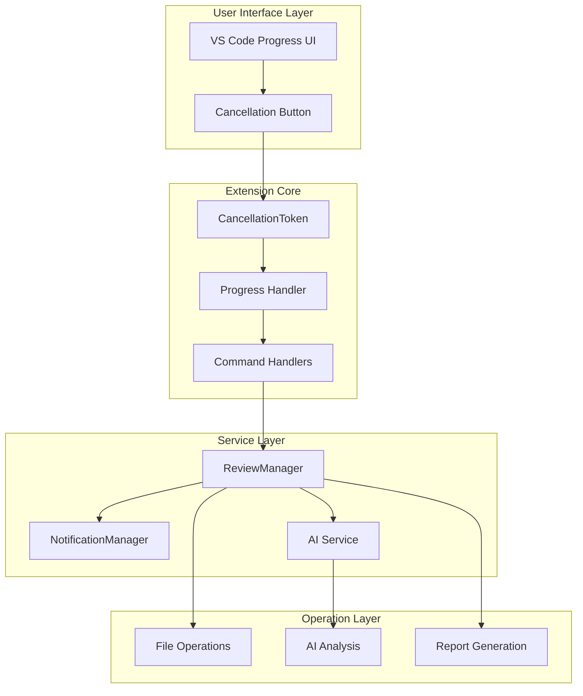
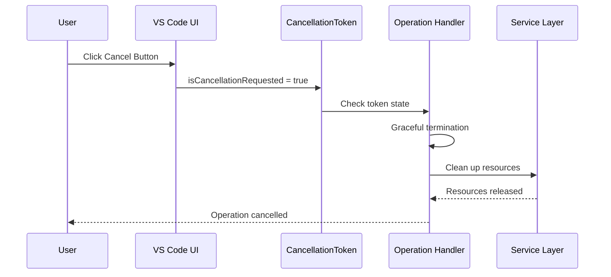
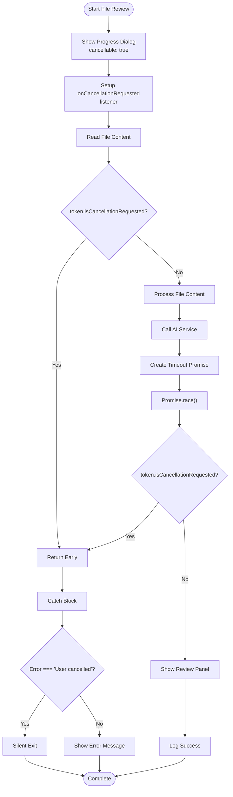
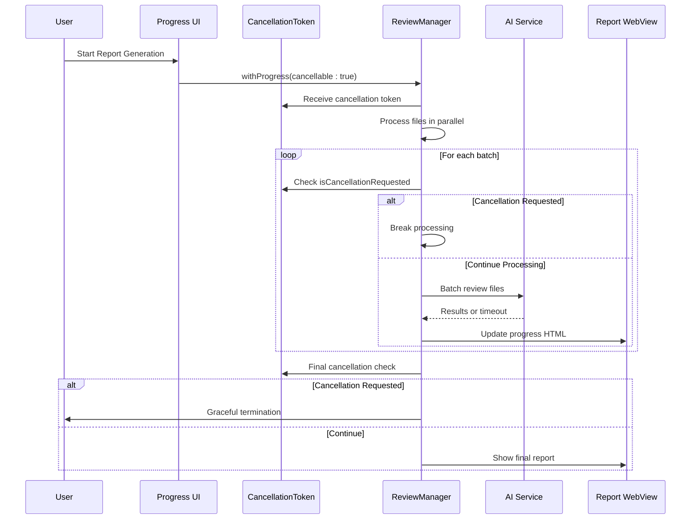
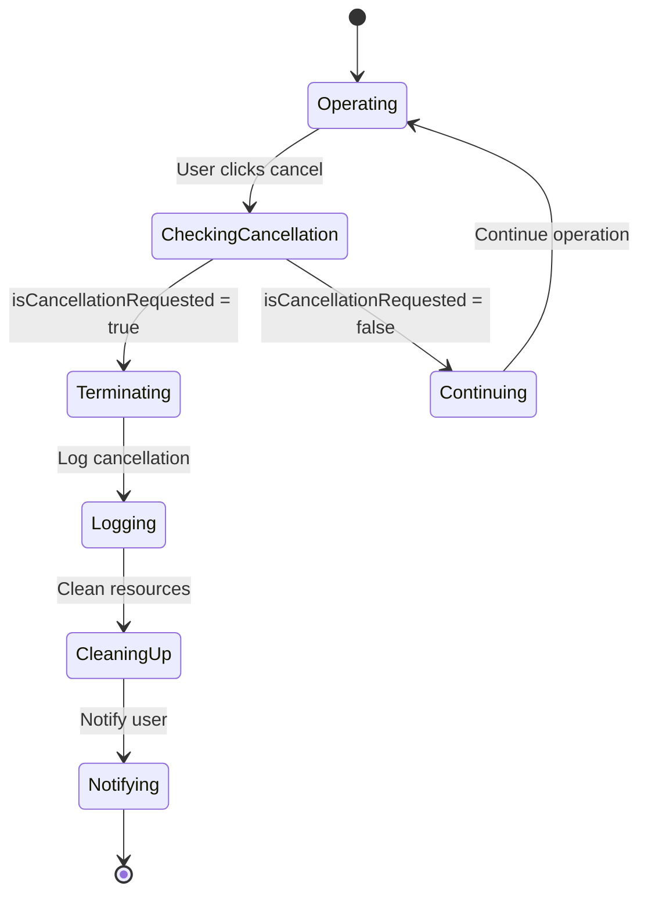
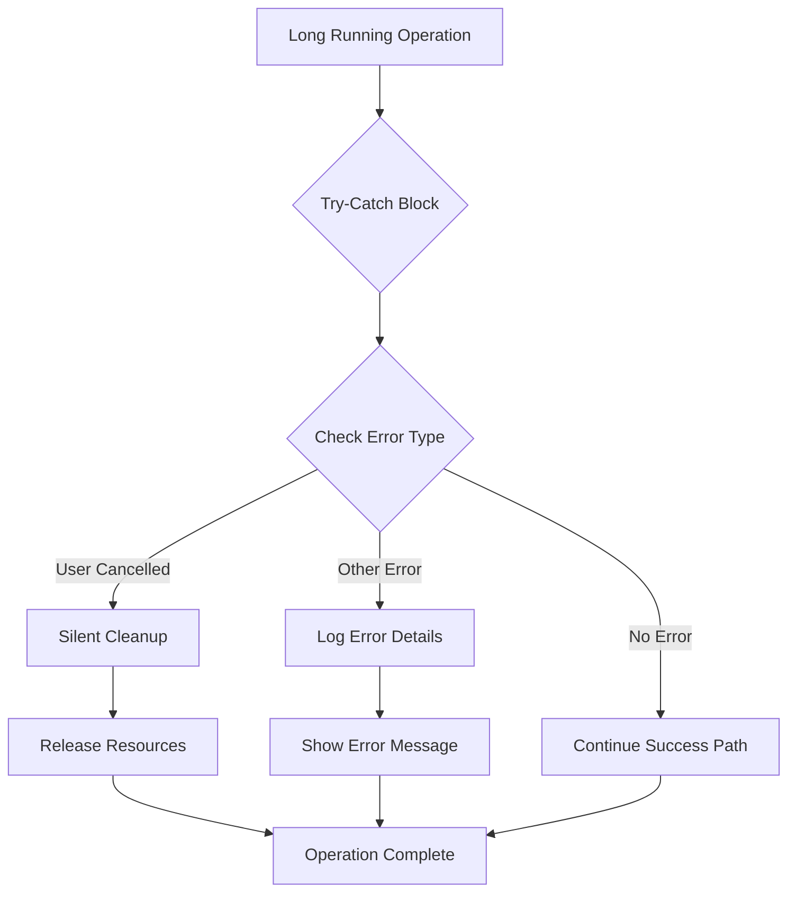
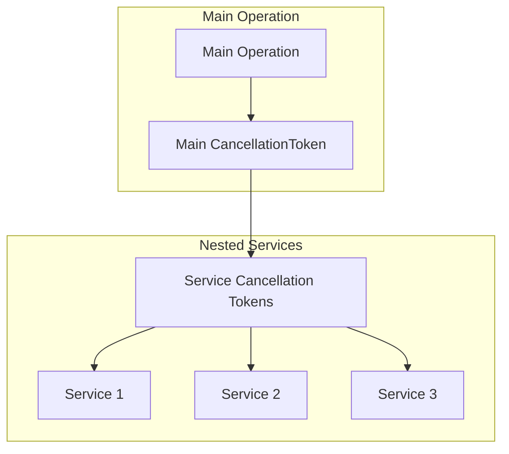

# Command Cancellation

<cite>
**Referenced Files in This Document**
- [extension.ts](file://src/extension.ts)
- [reviewManager.ts](file://src/services/review/reviewManager.ts)
- [notificationManager.ts](file://src/services/notification/notificationManager.ts)
</cite>

## Table of Contents
1. [Introduction](#introduction)
2. [Cancellation Architecture Overview](#cancellation-architecture-overview)
3. [VS Code Progress API Integration](#vs-code-progress-api-integration)
4. [Implementation Patterns](#implementation-patterns)
5. [Concrete Implementation Examples](#concrete-implementation-examples)
6. [User Experience Aspects](#user-experience-aspects)
7. [Error Handling and Resource Cleanup](#error-handling-and-resource-cleanup)
8. [Best Practices](#best-practices)
9. [Advanced Cancellation Scenarios](#advanced-cancellation-scenarios)
10. [Troubleshooting Guide](#troubleshooting-guide)

## Introduction

The CodeKarmic extension implements comprehensive command cancellation handling to provide responsive user experiences during long-running operations. Built on VS Code's progress API, the extension supports cancellation through the CancellationToken mechanism, allowing users to interrupt operations when they become unnecessary or take too long.

Cancellation handling is crucial for operations involving AI code analysis, file processing, and report generation, where operations can take significant time depending on the size of the codebase and network conditions. The extension provides graceful termination of these operations while maintaining system stability and providing clear user feedback.

## Cancellation Architecture Overview

The cancellation system in CodeKarmic follows a layered architecture that integrates seamlessly with VS Code's progress reporting infrastructure:



**Diagram sources**
- [extension.ts](file://src/extension.ts#L677-L748)
- [reviewManager.ts](file://src/services/review/reviewManager.ts#L466-L647)

## VS Code Progress API Integration

### withProgress Configuration

The extension leverages VS Code's `vscode.window.withProgress()` API to implement cancellation support. The key configuration parameters enable cancellation functionality:

| Configuration Option | Value | Purpose |
|---------------------|-------|---------|
| `location` | `ProgressLocation.Notification` | Shows progress in the notification area |
| `location` | `ProgressLocation.Window` | Shows progress in the window status bar |
| `title` | Custom string | Descriptive operation title |
| `cancellable` | `true` | Enables cancellation button |

### CancellationToken Monitoring

The CancellationToken provides multiple mechanisms for monitoring cancellation requests:



**Diagram sources**
- [extension.ts](file://src/extension.ts#L685-L689)
- [reviewManager.ts](file://src/services/review/reviewManager.ts#L510-L512)

**Section sources**
- [extension.ts](file://src/extension.ts#L677-L748)
- [reviewManager.ts](file://src/services/review/reviewManager.ts#L466-L647)

## Implementation Patterns

### Pattern 1: Basic Cancellation with Event Listener

The simplest cancellation pattern uses event listeners to handle cancellation requests:

```typescript
// Pattern structure - actual implementation in source files
await vscode.window.withProgress({
    location: vscode.ProgressLocation.Notification,
    title: 'Operation Title',
    cancellable: true
}, async (progress, token) => {
    token.onCancellationRequested(() => {
        // Handle cancellation event
        NotificationManager.getInstance().log('Operation cancelled', 'info', true);
        throw new Error('User cancelled operation');
    });
    
    // Perform operation steps
    // Check token periodically
});
```

### Pattern 2: Periodic Cancellation Checks

Operations that involve multiple steps or loops should check for cancellation at strategic points:

```typescript
// Pattern structure - actual implementation in source files
for (const item of items) {
    if (token.isCancellationRequested) {
        break; // Exit loop gracefully
    }
    
    // Process item
    await processItem(item);
}
```

### Pattern 3: Promise-Based Cancellation

For asynchronous operations, create cancellable promises that resolve when cancellation occurs:

```typescript
// Pattern structure - actual implementation in source files
const timeoutPromise = new Promise((_, reject) => {
    const interval = setInterval(() => {
        if (token.isCancellationRequested) {
            clearInterval(interval);
            reject(new Error('User cancelled operation'));
        }
    }, 100);
});

const result = await Promise.race([
    operationPromise,
    timeoutPromise
]);
```

**Section sources**
- [extension.ts](file://src/extension.ts#L685-L689)
- [extension.ts](file://src/extension.ts#L714-L721)
- [reviewManager.ts](file://src/services/review/reviewManager.ts#L510-L512)

## Concrete Implementation Examples

### Example 1: reviewWorkspaceFile() Cancellation Handling

The [`reviewWorkspaceFile()`](file://src/extension.ts#L669-L748) function demonstrates comprehensive cancellation handling for individual file review operations:



**Diagram sources**
- [extension.ts](file://src/extension.ts#L669-L748)

Key cancellation points in this implementation:
- **Event Listener Setup**: [`token.onCancellationRequested()`](file://src/extension.ts#L685-L689) immediately handles cancellation events
- **Pre-operation Check**: [`token.isCancellationRequested`](file://src/extension.ts#L698) before expensive operations
- **AI Service Cancellation**: Uses [`Promise.race()`](file://src/extension.ts#L724-L727) with timeout promise
- **Graceful Error Handling**: Distinguishes user cancellation from other errors

### Example 2: generateReport() Cancellation Handling

The [`generateReport()`](file://src/services/review/reviewManager.ts#L372-L647) method showcases cancellation handling in complex multi-stage operations:



**Diagram sources**
- [reviewManager.ts](file://src/services/review/reviewManager.ts#L466-L647)

**Section sources**
- [extension.ts](file://src/extension.ts#L669-L748)
- [reviewManager.ts](file://src/services/review/reviewManager.ts#L372-L647)

## User Experience Aspects

### Progress Notification Interface

The extension provides intuitive progress notifications with cancellation capabilities:

| Progress Location | Use Case | Cancellation Support |
|------------------|----------|---------------------|
| `ProgressLocation.Notification` | Short operations (< 1 minute) | Full cancellation support |
| `ProgressLocation.Window` | Long operations (> 1 minute) | Full cancellation support |

### Cancellation Button Behavior

When users click the cancellation button, the extension responds with immediate visual feedback:



### User Feedback Mechanisms

The extension provides multiple channels for cancellation feedback:

1. **Status Bar Updates**: Changes icon and text when operations are cancelled
2. **Notification Messages**: Shows appropriate messages for cancellation vs. errors
3. **Output Channel Logging**: Records cancellation events for debugging
4. **Visual Indicators**: Progress bars and completion markers

**Section sources**
- [notificationManager.ts](file://src/services/notification/notificationManager.ts#L130-L176)

## Error Handling and Resource Cleanup

### Exception Handling Strategy

The extension implements a hierarchical error handling approach:



### Resource Cleanup Patterns

Different types of resources require specific cleanup approaches:

| Resource Type | Cleanup Strategy | Implementation |
|--------------|------------------|----------------|
| File Handles | Automatic closure on Promise rejection | VS Code FS APIs |
| Network Connections | Immediate abort | Fetch AbortController |
| Memory Allocations | Garbage collection | JavaScript automatic |
| UI Elements | Explicit disposal | VS Code dispose methods |

### State Recovery

After cancellation, the extension ensures the system returns to a stable state:

- **UI State**: Progress indicators are removed, buttons restored
- **Service State**: Active operations are terminated, pending requests cancelled
- **Data State**: Partial results are discarded, clean state maintained
- **Notification State**: Status bar returns to normal, notifications cleared

**Section sources**
- [extension.ts](file://src/extension.ts#L750-L758)
- [notificationManager.ts](file://src/services/notification/notificationManager.ts#L31-L71)

## Best Practices

### Implementation Guidelines

1. **Always Enable Cancellation**: Set `cancellable: true` for operations expected to take more than a few seconds
2. **Check Frequently**: Monitor cancellation token at least once per major operation step
3. **Provide Immediate Feedback**: Respond to cancellation requests within 100-200ms
4. **Clean Up Resources**: Ensure all resources are properly released on cancellation
5. **Distinguish Errors**: Handle user cancellation differently from other errors

### Performance Considerations

Cancellation handling should not significantly impact normal operation performance:

- **Minimal Overhead**: Token checking adds minimal computational overhead
- **Efficient Checks**: Use `isCancellationRequested` for quick checks
- **Selective Monitoring**: Only monitor cancellation in long-running operations
- **Batch Processing**: Check cancellation between batches in iterative operations

### User Experience Guidelines

- **Clear Progress Indicators**: Show meaningful progress information
- **Responsive UI**: Keep UI responsive during cancellation
- **Informative Messages**: Provide clear feedback about operation state
- **Consistent Behavior**: Maintain consistent cancellation behavior across operations

### Testing Strategies

Implement comprehensive testing for cancellation scenarios:

- **Normal Cancellation**: Test cancellation at various operation stages
- **Rapid Cancellation**: Test cancellation immediately after operation start
- **Concurrent Operations**: Test cancellation with multiple simultaneous operations
- **Resource Cleanup**: Verify proper resource cleanup after cancellation

## Advanced Cancellation Scenarios

### Nested Operation Cancellation

Complex operations may involve multiple nested services that need coordinated cancellation:



### Timeout-Based Cancellation

Some operations benefit from automatic timeout cancellation:

```typescript
// Example pattern for timeout-based cancellation
const timeoutPromise = new Promise((_, reject) => {
    setTimeout(() => {
        reject(new Error('Operation timed out'));
    }, 30000); // 30 second timeout
});

try {
    await Promise.race([operationPromise, timeoutPromise]);
} catch (error) {
    if (error.message === 'Operation timed out') {
        // Handle timeout specifically
    }
}
```

### Graceful Degradation

When operations cannot be cancelled cleanly, implement graceful degradation:

- **Partial Results**: Return whatever was computed before cancellation
- **Fallback Operations**: Provide alternative, quicker operations
- **Progressive Enhancement**: Allow partial completion of multi-step operations

## Troubleshooting Guide

### Common Issues and Solutions

| Issue | Symptoms | Solution |
|-------|----------|----------|
| Cancellation Not Working | Cancel button ignored | Verify `cancellable: true` in withProgress options |
| Slow Cancellation Response | Delay after clicking cancel | Add frequent `token.isCancellationRequested` checks |
| Resource Leaks | Memory/CPU usage continues | Implement proper cleanup in catch blocks |
| UI Stuck | Progress indicator never disappears | Ensure proper token handling in async operations |

### Debugging Cancellation Issues

Enable debug logging to diagnose cancellation problems:

```typescript
// Enable debug mode for cancellation debugging
console.log('Cancellation state:', token.isCancellationRequested);
console.log('Cancellation listener attached:', !!token.onCancellationRequested);
```

### Performance Monitoring

Monitor cancellation performance to ensure good user experience:

- **Cancellation Latency**: Measure time from cancel button press to operation termination
- **Resource Usage**: Track memory and CPU usage during cancellation
- **Error Rates**: Monitor cancellation-related errors and failures

### Recovery Procedures

When cancellation handling fails:

1. **Immediate Termination**: Forcefully terminate the operation
2. **State Reset**: Reset extension state to prevent corruption
3. **User Notification**: Inform users of the issue and suggest next steps
4. **Error Reporting**: Log detailed error information for debugging

**Section sources**
- [extension.ts](file://src/extension.ts#L750-L758)
- [reviewManager.ts](file://src/services/review/reviewManager.ts#L510-L512)