# Command Execution

<cite>
**Referenced Files in This Document**
- [extension.ts](file://src/extension.ts)
- [reviewManager.ts](file://src/services/review/reviewManager.ts)
- [gitService.ts](file://src/services/git/gitService.ts)
- [notificationManager.ts](file://src/services/notification/notificationManager.ts)
- [logger.ts](file://src/utils/logger.ts)
- [package.json](file://package.json)
</cite>

## Table of Contents
1. [Introduction](#introduction)
2. [Command Registration Architecture](#command-registration-architecture)
3. [Command Execution Flow](#command-execution-flow)
4. [Parameter Passing and Validation](#parameter-passing-and-validation)
5. [Return Value Handling](#return-value-handling)
6. [Concrete Command Examples](#concrete-command-examples)
7. [Error Handling Patterns](#error-handling-patterns)
8. [Progress Reporting Systems](#progress-reporting-systems)
9. [Asynchronous Operation Management](#asynchronous-operation-management)
10. [Common Execution Issues](#common-execution-issues)
11. [Best Practices](#best-practices)

## Introduction

The CodeKarmic extension implements a sophisticated command execution system that enables users to interact with Git repositories and AI-powered code review capabilities through multiple interfaces including the command palette, context menus, and UI components. This system follows VS Code's command framework architecture while providing robust error handling, progress reporting, and asynchronous operation management.

The command execution system is built around VS Code's `vscode.commands.registerCommand()` API, which allows for declarative command registration and execution. Each command follows a consistent pattern of parameter validation, service orchestration, and user feedback provision.

## Command Registration Architecture

### Command Declaration in Package.json

Commands are declared in the extension's package.json file, defining their metadata, categories, and activation events. The system registers numerous commands covering various functionality areas:

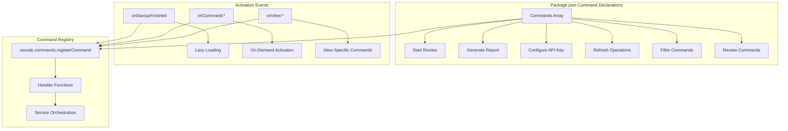
```mermaid
graph TB
subgraph "Package.json Command Declarations"
A[Commands Array] --> B[Start Review]
A --> C[Generate Report]
A --> D[Configure API Key]
A --> E[Refresh Operations]
A --> F[Filter Commands]
A --> G[Review Commands]
end
subgraph "Activation Events"
H[onStartupFinished] --> I[Lazy Loading]
J[onCommand:*] --> K[On-Demand Activation]
L[onView:*] --> M[View-Specific Commands]
end
subgraph "Command Registry"
N[vscode.commands.registerCommand] --> O[Handler Functions]
O --> P[Service Orchestration]
end
A --> N
H --> N
J --> N
L --> N
```

**Diagram sources**
- [package.json](file://package.json#L26-L116)

### Extension Activation Pattern

The extension follows a lazy loading pattern where commands are only activated when explicitly invoked. This approach optimizes startup performance and resource utilization:

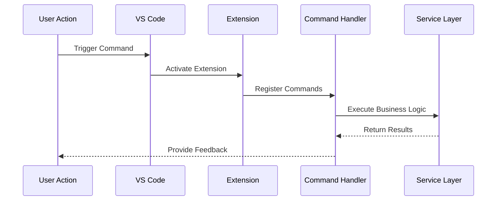
```mermaid
sequenceDiagram
participant User as User Action
participant VSCode as VS Code
participant Ext as Extension
participant Cmd as Command Handler
participant Service as Service Layer
User->>VSCode : Trigger Command
VSCode->>Ext : Activate Extension
Ext->>Cmd : Register Commands
Cmd->>Service : Execute Business Logic
Service-->>Cmd : Return Results
Cmd-->>User : Provide Feedback
```

**Section sources**
- [extension.ts](file://src/extension.ts#L20-L520)
- [package.json](file://package.json#L26-L35)

## Command Execution Flow

### Standard Command Execution Pattern

All commands in CodeKarmic follow a consistent execution pattern that ensures reliability and user experience quality:

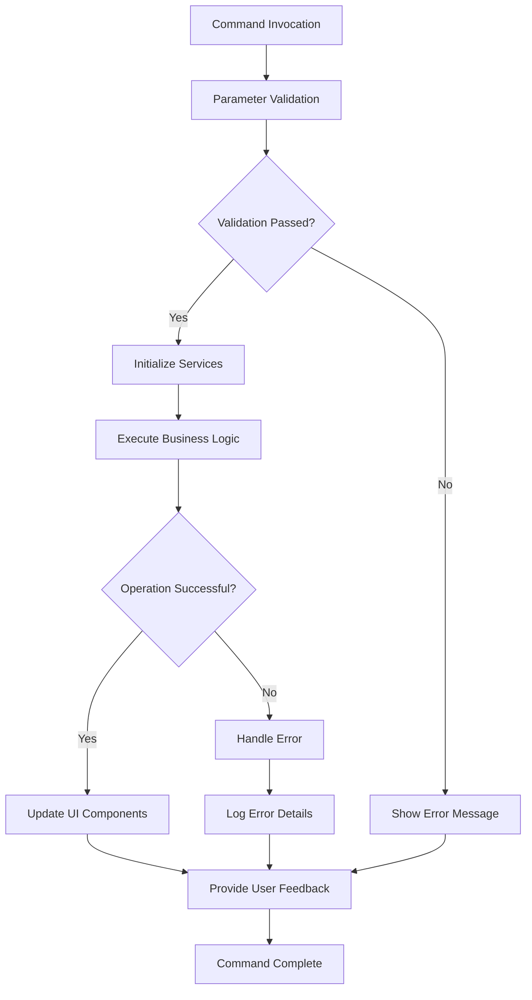
```mermaid
flowchart TD
A[Command Invocation] --> B[Parameter Validation]
B --> C{Validation Passed?}
C --> |No| D[Show Error Message]
C --> |Yes| E[Initialize Services]
E --> F[Execute Business Logic]
F --> G{Operation Successful?}
G --> |No| H[Handle Error]
G --> |Yes| I[Update UI Components]
H --> J[Log Error Details]
I --> K[Provide User Feedback]
J --> K
D --> K
K --> L[Command Complete]
```

### Service Initialization and Coordination

Commands coordinate between multiple service layers, ensuring proper initialization and dependency injection:

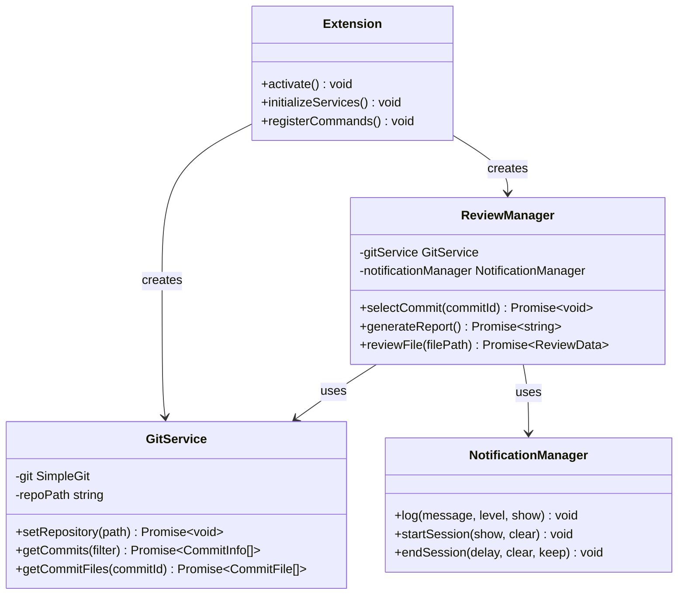
```mermaid
classDiagram
class Extension {
+activate() void
+initializeServices() void
+registerCommands() void
}
class ReviewManager {
-gitService GitService
-notificationManager NotificationManager
+selectCommit(commitId) Promise~void~
+generateReport() Promise~string~
+reviewFile(filePath) Promise~ReviewData~
}
class GitService {
-git SimpleGit
-repoPath string
+setRepository(path) Promise~void~
+getCommits(filter) Promise~CommitInfo[]~
+getCommitFiles(commitId) Promise~CommitFile[]~
}
class NotificationManager {
+log(message, level, show) void
+startSession(show, clear) void
+endSession(delay, clear, keep) void
}
Extension --> ReviewManager : creates
Extension --> GitService : creates
ReviewManager --> GitService : uses
ReviewManager --> NotificationManager : uses
```

**Diagram sources**
- [extension.ts](file://src/extension.ts#L68-L73)
- [reviewManager.ts](file://src/services/review/reviewManager.ts#L82-L93)

**Section sources**
- [extension.ts](file://src/extension.ts#L20-L520)
- [reviewManager.ts](file://src/services/review/reviewManager.ts#L82-L110)

## Parameter Passing and Validation

### Command Parameter Types

CodeKarmic commands handle various parameter types depending on their functionality:

| Parameter Type | Usage Example | Validation Pattern |
|---------------|---------------|-------------------|
| **No Parameters** | `codekarmic.startReview` | Workspace validation |
| **Single Object** | `codekarmic.reviewCode` | Interface validation |
| **Multiple Parameters** | `codekarmic.reviewExplorerItem` | Type checking |
| **Optional Parameters** | `codekarmic.generateReport` | Conditional validation |

### Parameter Validation Strategies

The system implements multiple validation layers to ensure command safety and reliability:

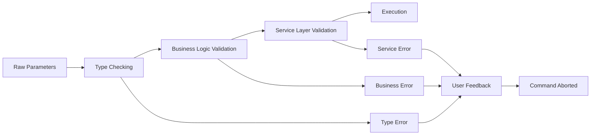
```mermaid
flowchart LR
A[Raw Parameters] --> B[Type Checking]
B --> C[Business Logic Validation]
C --> D[Service Layer Validation]
D --> E[Execution]
B --> F[Type Error]
C --> G[Business Error]
D --> H[Service Error]
F --> I[User Feedback]
G --> I
H --> I
I --> J[Command Aborted]
```

**Section sources**
- [extension.ts](file://src/extension.ts#L102-L139)
- [extension.ts](file://src/extension.ts#L141-L184)

## Return Value Handling

### Command Return Patterns

Commands in CodeKarmic follow specific return value patterns based on their functionality:

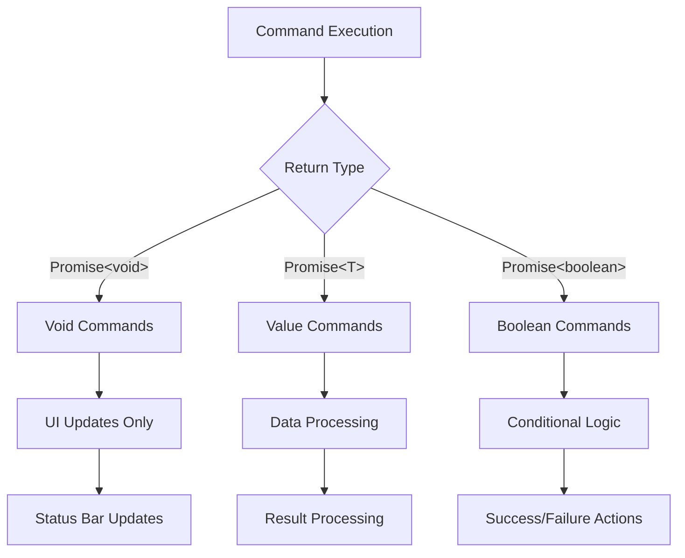
```mermaid
graph TD
A[Command Execution] --> B{Return Type}
B --> |Promise&lt;void&gt;| C[Void Commands]
B --> |Promise&lt;T&gt;| D[Value Commands]
B --> |Promise&lt;boolean&gt;| E[Boolean Commands]
C --> F[UI Updates Only]
D --> G[Data Processing]
E --> H[Conditional Logic]
F --> I[Status Bar Updates]
G --> J[Result Processing]
H --> K[Success/Failure Actions]
```

### Asynchronous Return Handling

The system handles asynchronous operations with proper promise chaining and error propagation:

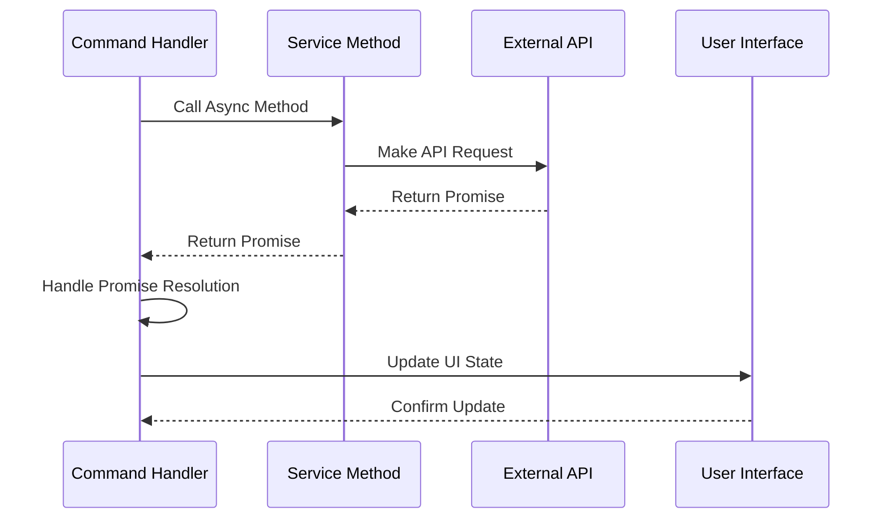
```mermaid
sequenceDiagram
participant Cmd as Command Handler
participant Service as Service Method
participant API as External API
participant UI as User Interface
Cmd->>Service : Call Async Method
Service->>API : Make API Request
API-->>Service : Return Promise
Service-->>Cmd : Return Promise
Cmd->>Cmd : Handle Promise Resolution
Cmd->>UI : Update UI State
UI-->>Cmd : Confirm Update
```

**Section sources**
- [extension.ts](file://src/extension.ts#L141-L152)
- [reviewManager.ts](file://src/services/review/reviewManager.ts#L372-L471)

## Concrete Command Examples

### codekarmic.startReview Command

The `startReview` command demonstrates comprehensive command execution with Git service initialization and UI component updates:

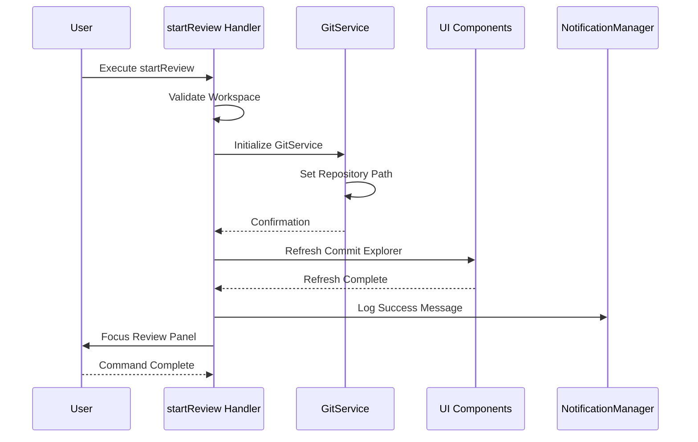
```mermaid
sequenceDiagram
participant User as User
participant Cmd as startReview Handler
participant Git as GitService
participant UI as UI Components
participant Notif as NotificationManager
User->>Cmd : Execute startReview
Cmd->>Cmd : Validate Workspace
Cmd->>Git : Initialize GitService
Git->>Git : Set Repository Path
Git-->>Cmd : Confirmation
Cmd->>UI : Refresh Commit Explorer
UI-->>Cmd : Refresh Complete
Cmd->>Notif : Log Success Message
Cmd->>User : Focus Review Panel
User-->>Cmd : Command Complete
```

**Diagram sources**
- [extension.ts](file://src/extension.ts#L102-L139)

Key characteristics of the `startReview` command:
- Validates workspace folder existence
- Initializes Git service with repository path
- Refreshes UI components automatically
- Provides immediate user feedback
- Handles error scenarios gracefully

### codekarmic.generateReport Command

The `generateReport` command showcases complex asynchronous coordination with progress reporting and file generation:

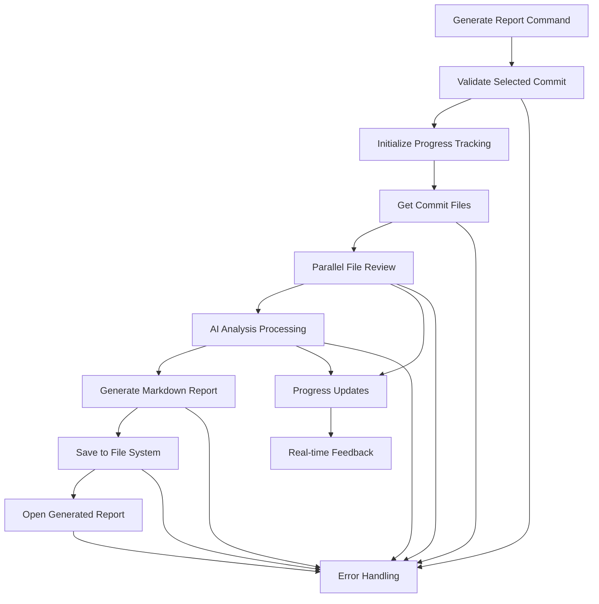
```mermaid
flowchart TD
A[Generate Report Command] --> B[Validate Selected Commit]
B --> C[Initialize Progress Tracking]
C --> D[Get Commit Files]
D --> E[Parallel File Review]
E --> F[AI Analysis Processing]
F --> G[Generate Markdown Report]
G --> H[Save to File System]
H --> I[Open Generated Report]
E --> J[Progress Updates]
F --> J
J --> K[Real-time Feedback]
B --> L[Error Handling]
D --> L
E --> L
F --> L
G --> L
H --> L
I --> L
```

**Diagram sources**
- [extension.ts](file://src/extension.ts#L187-L244)
- [reviewManager.ts](file://src/services/review/reviewManager.ts#L372-L661)

**Section sources**
- [extension.ts](file://src/extension.ts#L102-L139)
- [extension.ts](file://src/extension.ts#L187-L244)
- [reviewManager.ts](file://src/services/review/reviewManager.ts#L372-L661)

## Error Handling Patterns

### Multi-Level Error Handling

CodeKarmic implements a comprehensive error handling strategy with multiple layers:

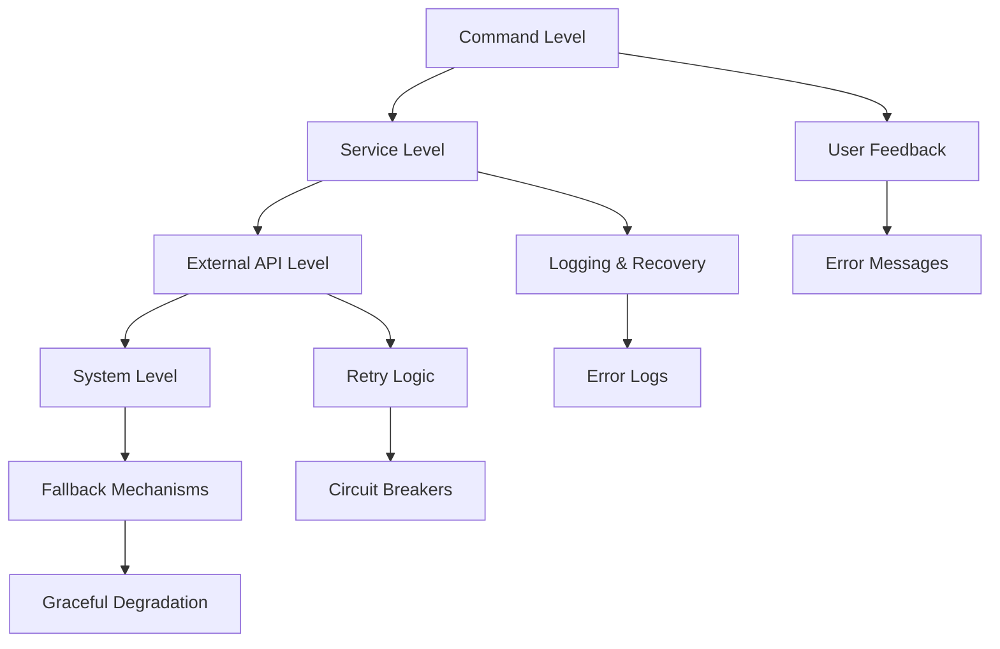
```mermaid
graph TB
A[Command Level] --> B[Service Level]
B --> C[External API Level]
C --> D[System Level]
A --> E[User Feedback]
B --> F[Logging & Recovery]
C --> G[Retry Logic]
D --> H[Fallback Mechanisms]
E --> I[Error Messages]
F --> J[Error Logs]
G --> K[Circuit Breakers]
H --> L[Graceful Degradation]
```

### Error Context Management

The system maintains detailed error context for debugging and user feedback:

| Error Context | Purpose | Usage Pattern |
|--------------|---------|---------------|
| **initialize** | Service initialization failures | Constructor validation |
| **selectCommit** | Commit selection errors | Git operations |
| **reviewFile** | File review failures | AI analysis |
| **generateReport** | Report generation errors | Batch processing |
| **viewFile** | File viewing issues | Editor operations |

### Error Recovery Strategies

The system implements various recovery strategies based on error severity:

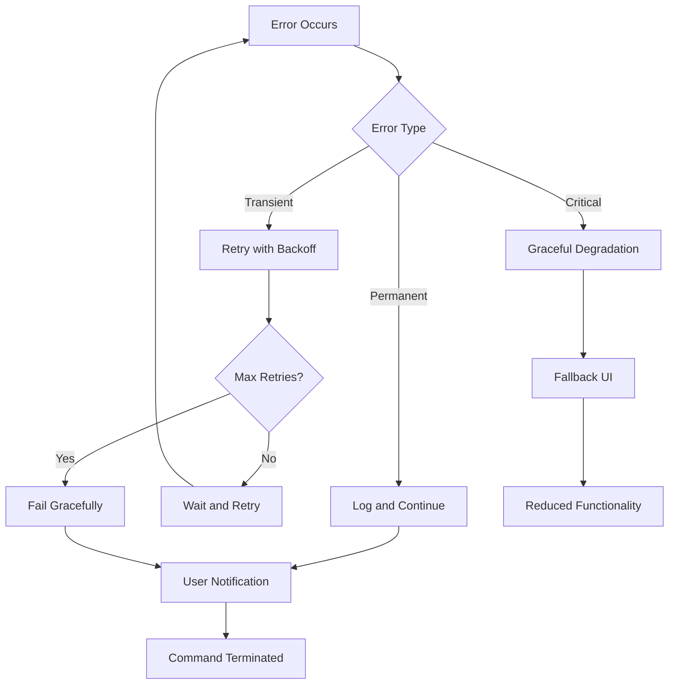
```mermaid
flowchart TD
A[Error Occurs] --> B{Error Type}
B --> |Transient| C[Retry with Backoff]
B --> |Permanent| D[Log and Continue]
B --> |Critical| E[Graceful Degradation]
C --> F{Max Retries?}
F --> |No| G[Wait and Retry]
F --> |Yes| H[Fail Gracefully]
D --> I[User Notification]
E --> J[Fallback UI]
G --> A
H --> I
I --> K[Command Terminated]
J --> L[Reduced Functionality]
```

**Section sources**
- [reviewManager.ts](file://src/services/review/reviewManager.ts#L101-L109)
- [extension.ts](file://src/extension.ts#L135-L138)
- [reviewManager.ts](file://src/services/review/reviewManager.ts#L461-L464)

## Progress Reporting Systems

### VS Code Progress API Integration

CodeKarmic extensively uses VS Code's progress reporting system for long-running operations:

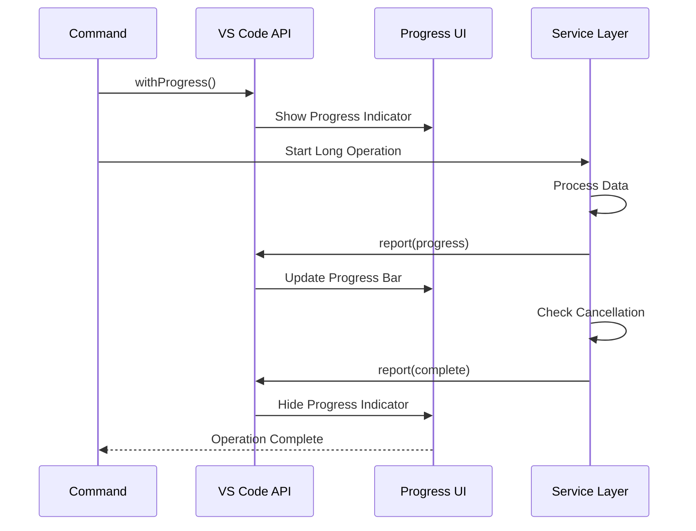
```mermaid
sequenceDiagram
participant Cmd as Command
participant VSCode as VS Code API
participant UI as Progress UI
participant Service as Service Layer
Cmd->>VSCode : withProgress()
VSCode->>UI : Show Progress Indicator
Cmd->>Service : Start Long Operation
Service->>Service : Process Data
Service->>VSCode : report(progress)
VSCode->>UI : Update Progress Bar
Service->>Service : Check Cancellation
Service->>VSCode : report(complete)
VSCode->>UI : Hide Progress Indicator
UI-->>Cmd : Operation Complete
```

### Progress Reporting Patterns

The system implements several progress reporting patterns:

| Pattern | Use Case | Implementation |
|---------|----------|----------------|
| **Linear Progress** | File processing | Incremental percentage |
| **Step-Based Progress** | Multi-stage operations | Named steps |
| **Indeterminate Progress** | Unknown duration | Spinning indicator |
| **Custom HTML** | Complex reporting | WebView integration |

### Cancellation Support

All long-running operations support cancellation with proper cleanup:

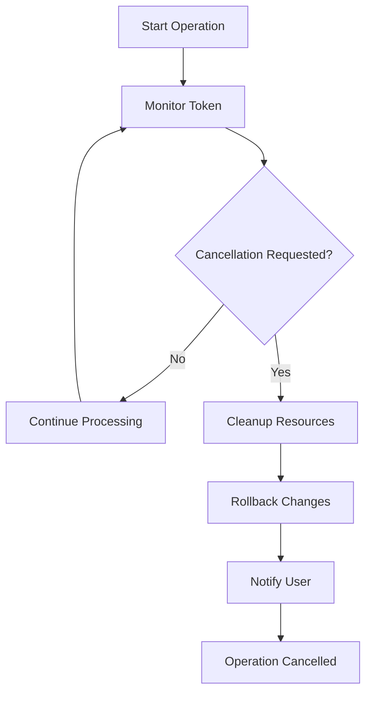
```mermaid
flowchart TD
A[Start Operation] --> B[Monitor Token]
B --> C{Cancellation Requested?}
C --> |No| D[Continue Processing]
C --> |Yes| E[Cleanup Resources]
D --> B
E --> F[Rollback Changes]
F --> G[Notify User]
G --> H[Operation Cancelled]
```

**Section sources**
- [reviewManager.ts](file://src/services/review/reviewManager.ts#L466-L471)
- [extension.ts](file://src/extension.ts#L678-L748)

## Asynchronous Operation Management

### Promise-Based Architecture

CodeKarmic relies heavily on promises for managing asynchronous operations:

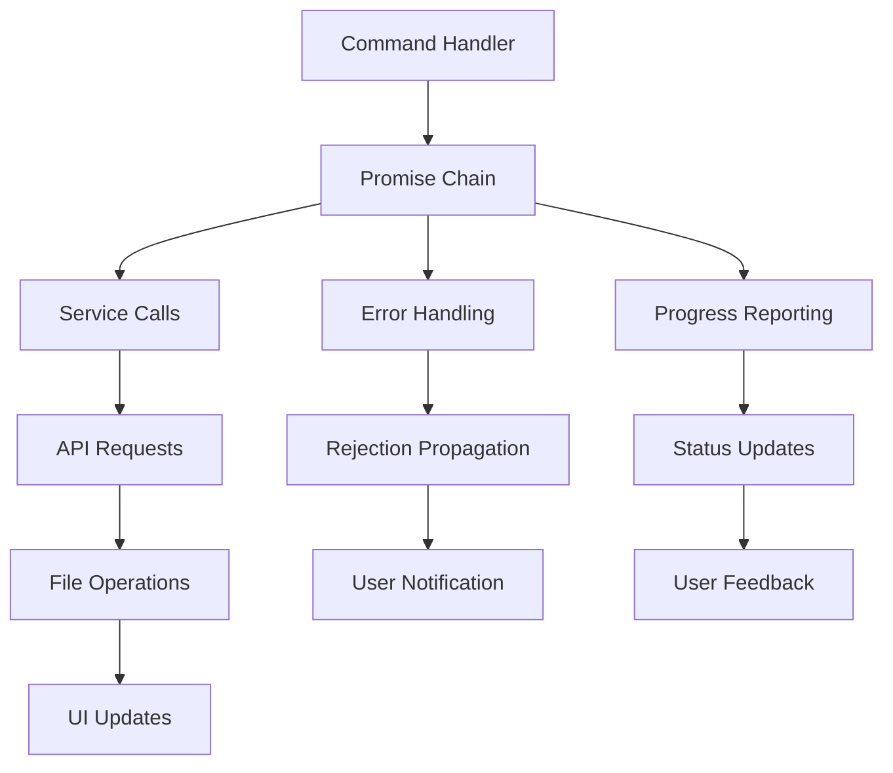
```mermaid
graph TB
A[Command Handler] --> B[Promise Chain]
B --> C[Service Calls]
C --> D[API Requests]
D --> E[File Operations]
E --> F[UI Updates]
B --> G[Error Handling]
G --> H[Rejection Propagation]
H --> I[User Notification]
B --> J[Progress Reporting]
J --> K[Status Updates]
K --> L[User Feedback]
```

### Concurrent Operation Management

The system manages concurrent operations efficiently using batching and parallel processing:

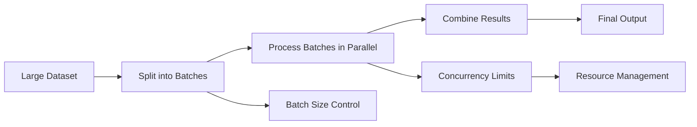
```mermaid
flowchart LR
A[Large Dataset] --> B[Split into Batches]
B --> C[Process Batches in Parallel]
C --> D[Combine Results]
D --> E[Final Output]
B --> F[Batch Size Control]
C --> G[Concurrency Limits]
G --> H[Resource Management]
```

### Resource Cleanup Patterns

Proper resource cleanup is ensured through various mechanisms:

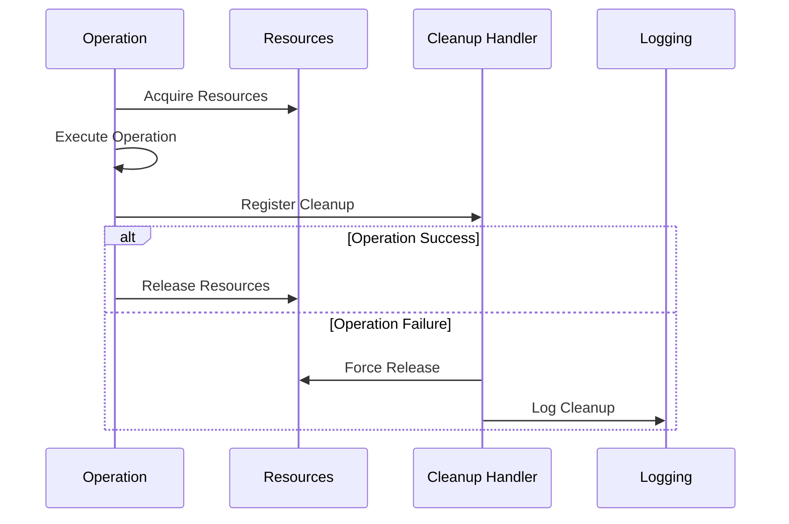
```mermaid
sequenceDiagram
participant Op as Operation
participant Res as Resources
participant Clean as Cleanup Handler
participant Log as Logging
Op->>Res : Acquire Resources
Op->>Op : Execute Operation
Op->>Clean : Register Cleanup
alt Operation Success
Op->>Res : Release Resources
else Operation Failure
Clean->>Res : Force Release
Clean->>Log : Log Cleanup
end
```

**Section sources**
- [reviewManager.ts](file://src/services/review/reviewManager.ts#L289-L371)
- [extension.ts](file://src/extension.ts#L678-L748)

## Common Execution Issues

### Parameter Validation Errors

Common parameter validation issues and their solutions:

| Issue | Cause | Solution |
|-------|-------|----------|
| **Missing Workspace** | No open workspace folder | Check `vscode.workspace.workspaceFolders` |
| **Invalid Commit Hash** | Malformed or nonexistent commit | Validate commit existence |
| **File Access Denied** | Permission or file system issues | Check file permissions and existence |
| **API Key Missing** | Unconfigured AI service | Prompt for API key configuration |

### Asynchronous Operation Handling

Typical asynchronous operation challenges and patterns:

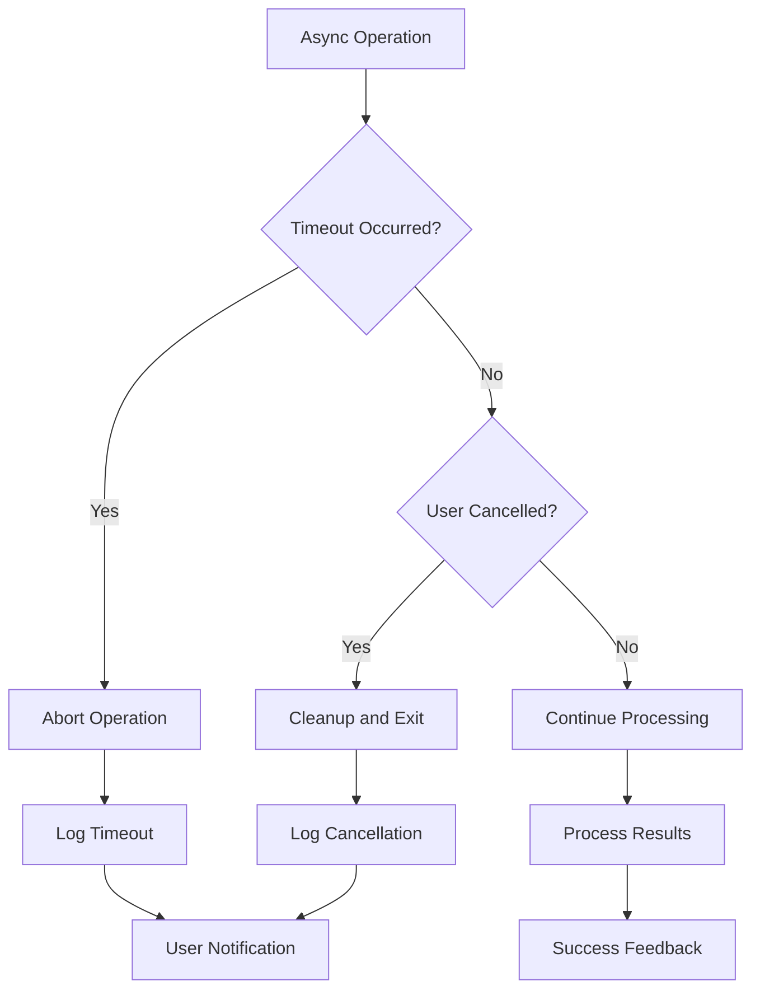
```mermaid
flowchart TD
A[Async Operation] --> B{Timeout Occurred?}
B --> |Yes| C[Abort Operation]
B --> |No| D{User Cancelled?}
D --> |Yes| E[Cleanup and Exit]
D --> |No| F[Continue Processing]
C --> G[Log Timeout]
E --> H[Log Cancellation]
F --> I[Process Results]
G --> J[User Notification]
H --> J
I --> K[Success Feedback]
```

### Proper User Feedback During Long-Running Commands

Effective user feedback strategies for long-running operations:

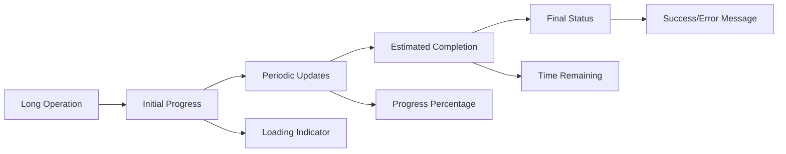
```mermaid
graph LR
A[Long Operation] --> B[Initial Progress]
B --> C[Periodic Updates]
C --> D[Estimated Completion]
D --> E[Final Status]
B --> F[Loading Indicator]
C --> G[Progress Percentage]
D --> H[Time Remaining]
E --> I[Success/Error Message]
```

**Section sources**
- [extension.ts](file://src/extension.ts#L135-L138)
- [extension.ts](file://src/extension.ts#L153-L183)

## Best Practices

### Command Design Principles

1. **Single Responsibility**: Each command should have a clear, focused purpose
2. **Consistent Error Handling**: Implement uniform error handling patterns across all commands
3. **Progress Reporting**: Always provide progress feedback for long-running operations
4. **Cancellation Support**: Enable user cancellation for operations that take significant time
5. **Resource Management**: Properly clean up resources and handle cleanup scenarios

### Performance Optimization

Key performance considerations for command execution:

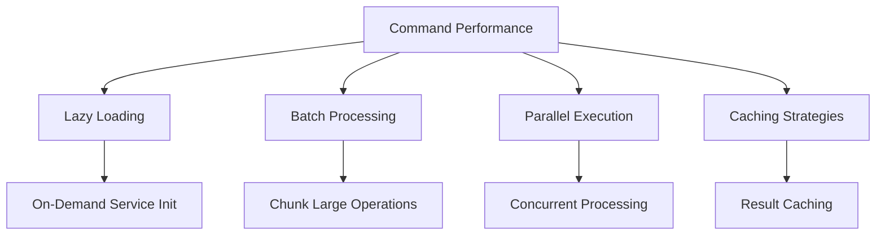
```mermaid
graph TB
A[Command Performance] --> B[Lazy Loading]
A --> C[Batch Processing]
A --> D[Parallel Execution]
A --> E[Caching Strategies]
B --> F[On-Demand Service Init]
C --> G[Chunk Large Operations]
D --> H[Concurrent Processing]
E --> I[Result Caching]
```

### Testing and Validation

Comprehensive testing strategies for command execution:

| Test Type | Coverage | Implementation |
|-----------|----------|----------------|
| **Unit Tests** | Individual command logic | Mock service dependencies |
| **Integration Tests** | End-to-end workflows | Real service interactions |
| **Performance Tests** | Long-running operations | Load and stress testing |
| **Error Scenario Tests** | Exception handling | Simulated failure conditions |

### Monitoring and Debugging

Effective monitoring and debugging approaches:

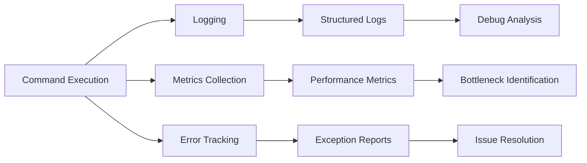
```mermaid
flowchart LR
A[Command Execution] --> B[Logging]
A --> C[Metrics Collection]
A --> D[Error Tracking]
B --> E[Structured Logs]
C --> F[Performance Metrics]
D --> G[Exception Reports]
E --> H[Debug Analysis]
F --> I[Bottleneck Identification]
G --> J[Issue Resolution]
```

**Section sources**
- [logger.ts](file://src/utils/logger.ts#L18-L88)
- [notificationManager.ts](file://src/services/notification/notificationManager.ts#L31-L212)