# Command Flow

<cite>
**Referenced Files in This Document**
- [extension.ts](file://src/extension.ts)
- [reviewManager.ts](file://src/services/review/reviewManager.ts)
- [reviewPanel.ts](file://src/ui/views/reviewPanel.ts)
- [gitService.ts](file://src/services/git/gitService.ts)
- [notificationManager.ts](file://src/services/notification/notificationManager.ts)
- [constants.ts](file://src/constants/constants.ts)
- [package.json](file://package.json)
- [index.ts](file://src/i18n/index.ts)
</cite>

## Table of Contents
1. [Introduction](#introduction)
2. [Command Registration Architecture](#command-registration-architecture)
3. [Core Commands Overview](#core-commands-overview)
4. [Command Invocation Flow](#command-invocation-flow)
5. [Service Initialization and Dependencies](#service-initialization-and-dependencies)
6. [Command Handler Implementation](#command-handler-implementation)
7. [Error Handling and Cancellation](#error-handling-and-cancellation)
8. [Common Command Issues](#common-command-issues)
9. [Sequence Diagrams](#sequence-diagrams)
10. [Best Practices](#best-practices)

## Introduction

The CodeKarmic extension implements a sophisticated command flow architecture that orchestrates Git-based code reviews through VS Code's command system. The architecture follows a layered approach where commands are registered in the extension entry point and routed through specialized service managers that handle the complex logic of Git operations, AI analysis, and user interface interactions.

The command system serves as the primary entry point for all user interactions, from starting a review session to generating comprehensive reports. Each command follows a consistent pattern of validation, service initialization, parameter processing, and result delivery while maintaining proper error handling and user feedback mechanisms.

## Command Registration Architecture

The command registration system in CodeKarmic is built around VS Code's `vscode.commands.registerCommand` API, which provides a clean separation between command definition and implementation. The extension registers all commands during activation and establishes the foundation for the entire command flow architecture.

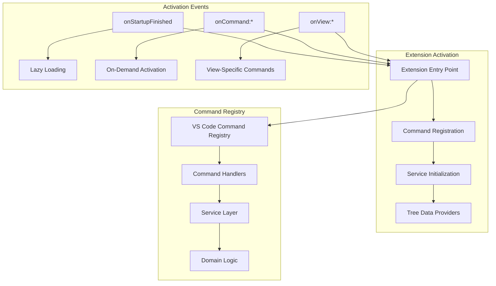

**Diagram sources**
- [extension.ts](file://src/extension.ts#L20-L520)
- [package.json](file://package.json#L26-L35)

The command registration follows VS Code's activation event model, where commands can be registered eagerly during extension activation or lazily when invoked. This approach optimizes startup performance while ensuring all functionality remains accessible when needed.

**Section sources**
- [extension.ts](file://src/extension.ts#L81-L520)
- [package.json](file://package.json#L26-L35)

## Core Commands Overview

CodeKarmic defines a comprehensive set of commands that cover the complete code review workflow. These commands are organized into functional groups and serve specific purposes within the review process.

| Command Category | Commands | Purpose | Trigger Conditions |
|------------------|----------|---------|-------------------|
| **Review Management** | `codekarmic.startReview` | Initialize review session | Workspace with Git repository |
| | `codekarmic.generateReport` | Generate comprehensive report | Selected commit with files |
| | `codekarmic.selectCommit` | Select specific commit | Commit hash parameter |
| **File Operations** | `codekarmic.reviewFile` | Review single file | Active editor or file selection |
| | `codekarmic.viewFile` | View file in editor | File path parameter |
| | `codekarmic.reviewSelectedItems` | Review multiple items | Selected files/folders |
| **Utility Functions** | `codekarmic.configureApiKey` | Configure AI service | User configuration |
| | `codekarmic.openSettings` | Open extension settings | User preference |
| | `codekarmic.refreshCommits` | Refresh commit list | Manual refresh trigger |
| | `codekarmic.togglePane` | Toggle review panel | Editor focus or command |

Each command follows a consistent pattern of parameter validation, service initialization, and result processing. The command system ensures that all operations are properly scoped to the current workspace and Git repository context.

**Section sources**
- [extension.ts](file://src/extension.ts#L81-L520)
- [package.json](file://package.json#L38-L116)

## Command Invocation Flow

The command invocation flow demonstrates how user actions trigger the underlying service logic through a well-defined pipeline. Each command follows a standardized execution pattern that ensures consistency and reliability across the application.

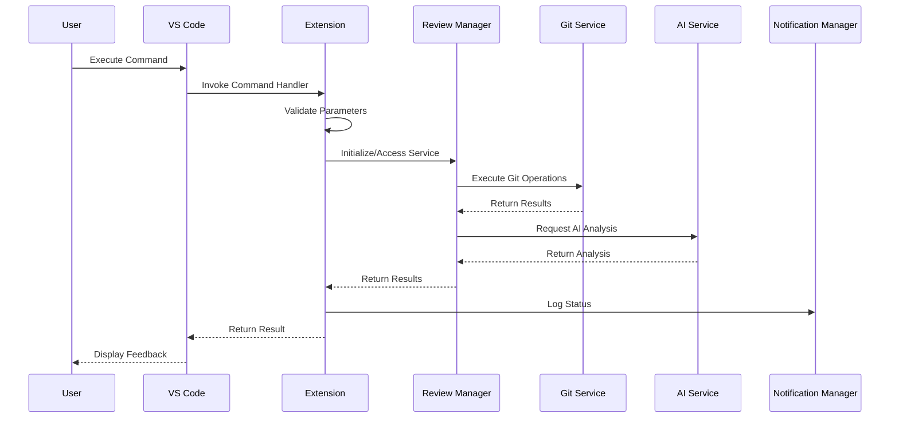

**Diagram sources**
- [extension.ts](file://src/extension.ts#L101-L244)
- [reviewManager.ts](file://src/services/review/reviewManager.ts#L111-L207)

The invocation flow ensures that each command maintains proper isolation while sharing common infrastructure services. The flow includes comprehensive error handling, logging, and user feedback mechanisms that provide transparency throughout the operation.

**Section sources**
- [extension.ts](file://src/extension.ts#L101-L244)
- [reviewManager.ts](file://src/services/review/reviewManager.ts#L111-L207)

## Service Initialization and Dependencies

The service initialization phase establishes the foundational infrastructure that supports all command operations. This phase involves creating and configuring service instances, establishing dependencies, and preparing the environment for subsequent operations.

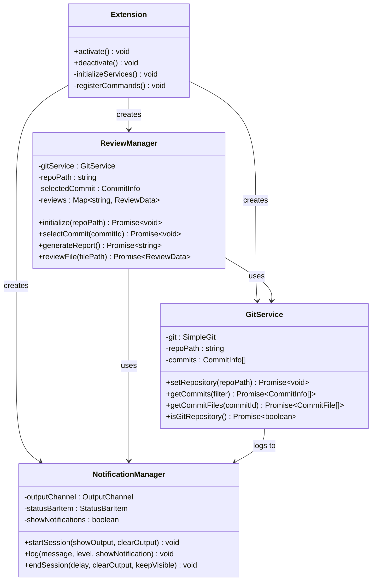

**Diagram sources**
- [extension.ts](file://src/extension.ts#L68-L77)
- [reviewManager.ts](file://src/services/review/reviewManager.ts#L89-L93)
- [gitService.ts](file://src/services/git/gitService.ts#L45-L53)
- [notificationManager.ts](file://src/services/notification/notificationManager.ts#L25-L30)

The initialization process follows a dependency injection pattern where services are created with their required dependencies and shared throughout the application lifecycle. This approach ensures consistent state management and efficient resource utilization.

**Section sources**
- [extension.ts](file://src/extension.ts#L68-L77)
- [reviewManager.ts](file://src/services/review/reviewManager.ts#L89-L93)

## Command Handler Implementation

Command handlers serve as the bridge between user interactions and the underlying service logic. Each handler implements specific validation, parameter processing, and result formatting logic while maintaining consistency with the overall command flow architecture.

### Start Review Command Handler

The `startReview` command handler exemplifies the command pattern implementation with comprehensive validation and initialization logic:

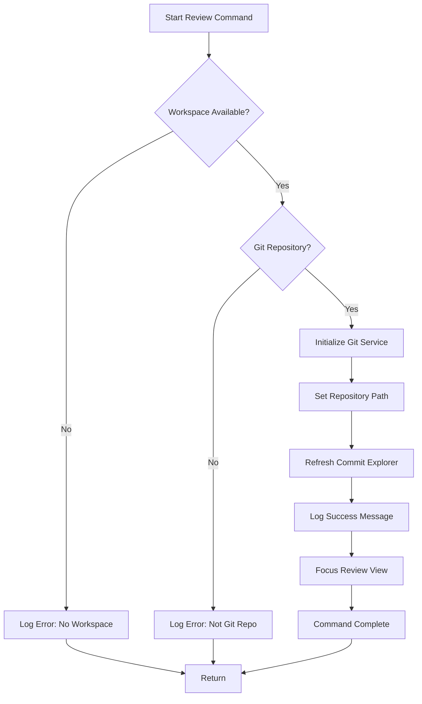

**Diagram sources**
- [extension.ts](file://src/extension.ts#L102-L139)

### Generate Report Command Handler

The `generateReport` command handler demonstrates complex orchestration involving multiple service interactions and progress reporting:

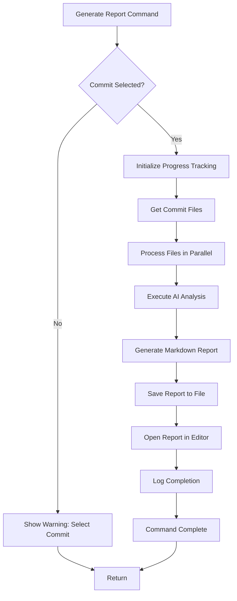

**Diagram sources**
- [extension.ts](file://src/extension.ts#L187-L244)
- [reviewManager.ts](file://src/services/review/reviewManager.ts#L372-L661)

### Review File Command Handler

The `reviewFile` command handler showcases the integration between file operations and AI analysis:

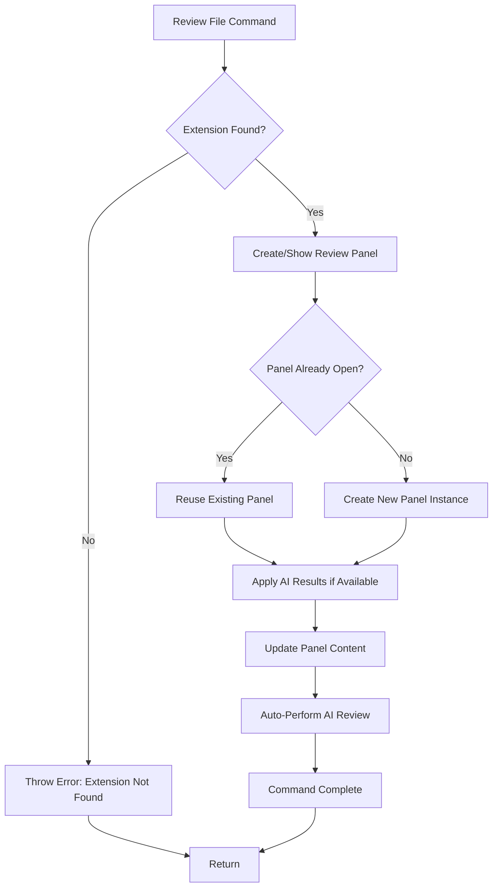

**Diagram sources**
- [extension.ts](file://src/extension.ts#L246-L258)
- [reviewPanel.ts](file://src/ui/views/reviewPanel.ts#L78-L124)

**Section sources**
- [extension.ts](file://src/extension.ts#L102-L258)
- [reviewPanel.ts](file://src/ui/views/reviewPanel.ts#L78-L124)

## Error Handling and Cancellation

The command flow architecture implements comprehensive error handling and cancellation mechanisms to ensure robust operation under various failure conditions. These mechanisms provide graceful degradation and meaningful user feedback when operations encounter issues.

### Error Handling Patterns

The error handling system follows a hierarchical approach where different levels of the architecture handle errors appropriately:

| Error Level | Handler | Responsibility | Recovery Strategy |
|-------------|---------|----------------|-------------------|
| **Command Level** | Command Handlers | Parameter validation, service availability | User-friendly error messages |
| **Service Level** | Service Managers | Business logic validation, external dependencies | Graceful degradation |
| **Infrastructure Level** | Service Implementations | API calls, file operations, network requests | Retry mechanisms, fallbacks |
| **System Level** | Global Exception Handler | Unhandled exceptions, memory issues | Application restart, data preservation |

### Cancellation Mechanisms

The command system supports cancellation through multiple mechanisms:

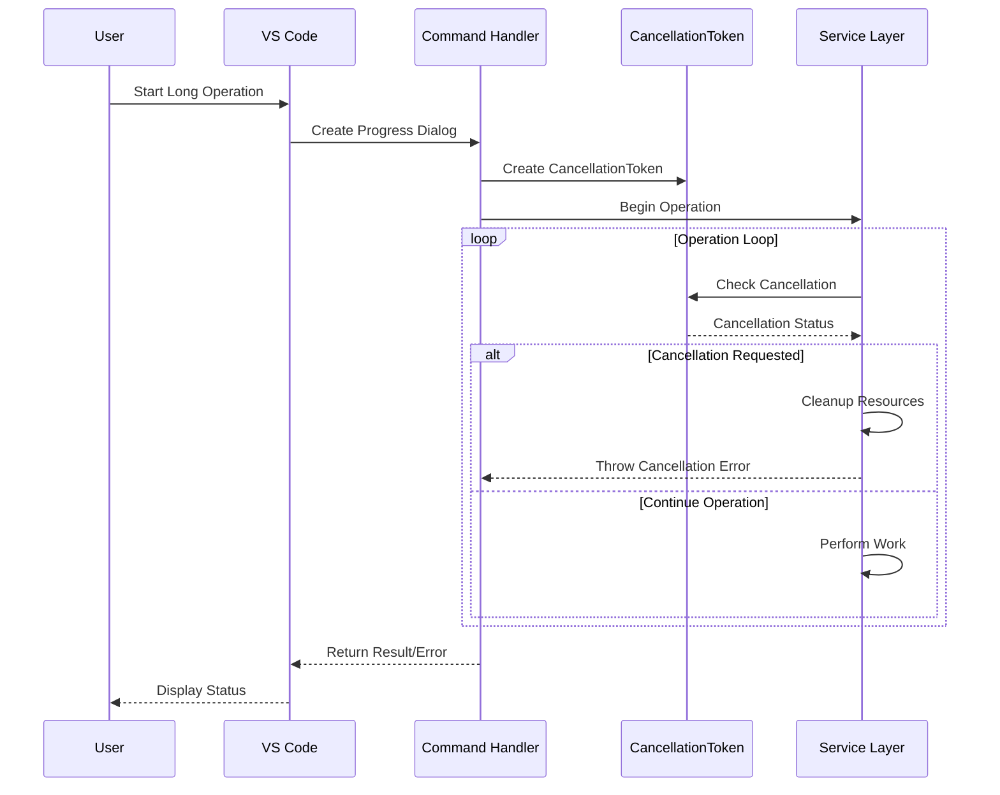

**Diagram sources**
- [extension.ts](file://src/extension.ts#L669-L758)
- [reviewManager.ts](file://src/services/review/reviewManager.ts#L372-L661)

**Section sources**
- [extension.ts](file://src/extension.ts#L141-L184)
- [reviewManager.ts](file://src/services/review/reviewManager.ts#L372-L661)

## Common Command Issues

Understanding common command issues helps in diagnosing problems and implementing effective solutions. The following sections outline typical issues and their resolution strategies.

### Command Registration Failures

Command registration failures often occur due to timing issues or incorrect configuration:

| Issue | Symptoms | Root Cause | Solution |
|-------|----------|------------|----------|
| **Timing Issues** | Commands not available immediately after activation | Services not ready when commands registered | Implement lazy initialization |
| **Duplicate Registrations** | Multiple handlers for same command | Repeated registration attempts | Use activation events properly |
| **Missing Dependencies** | Commands fail with dependency errors | Required services not initialized | Ensure proper dependency ordering |
| **Permission Issues** | Commands restricted in certain contexts | Insufficient permissions or context | Validate context before registration |

### Parameter Passing Errors

Parameter passing errors can lead to unexpected behavior or crashes:

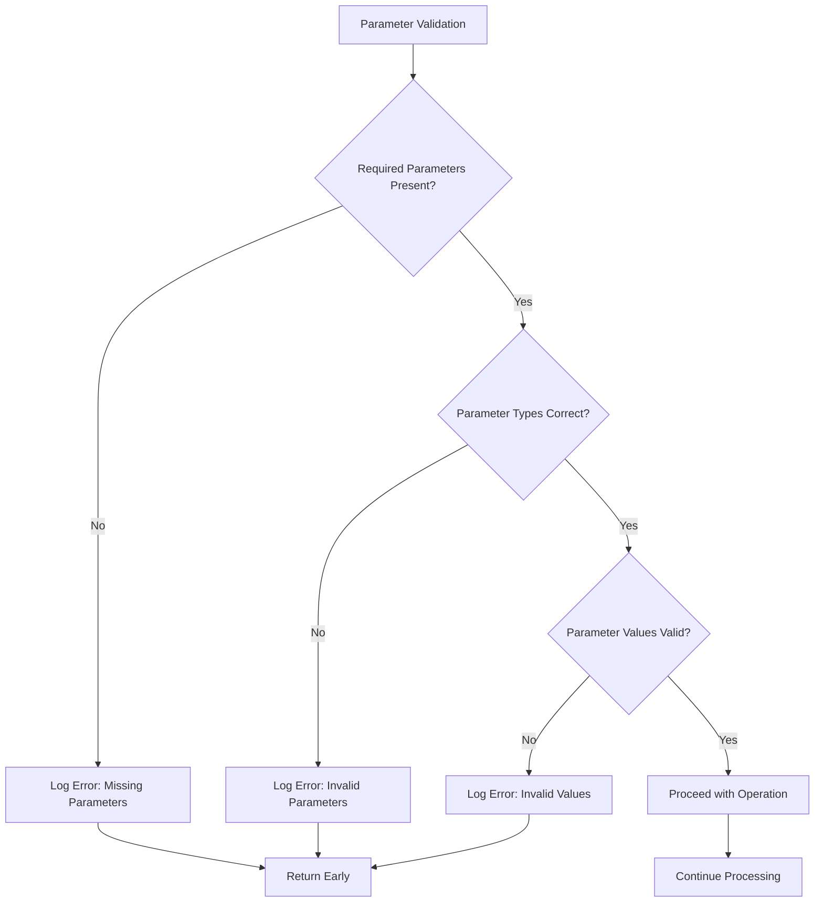

### Cancellation Handling Issues

Cancellation handling issues can cause resource leaks or incomplete operations:

| Issue | Symptoms | Root Cause | Solution |
|-------|----------|------------|----------|
| **Unclean Cancellation** | Resources not released, memory leaks | Missing cleanup in cancellation path | Implement proper finally blocks |
| **Multiple Cancellations** | Conflicting cancellation states | Race conditions in cancellation handling | Use atomic cancellation flags |
| **UI Stuck** | Progress indicators never complete | Cancellation not propagated to UI | Ensure cancellation token propagation |
| **Partial Results** | Incomplete operations reported as successful | Missing completion checks | Validate operation completion |

**Section sources**
- [extension.ts](file://src/extension.ts#L141-L184)
- [reviewManager.ts](file://src/services/review/reviewManager.ts#L111-L207)

## Sequence Diagrams

### Starting a Review Session

The following sequence diagram illustrates the complete flow when starting a review session:

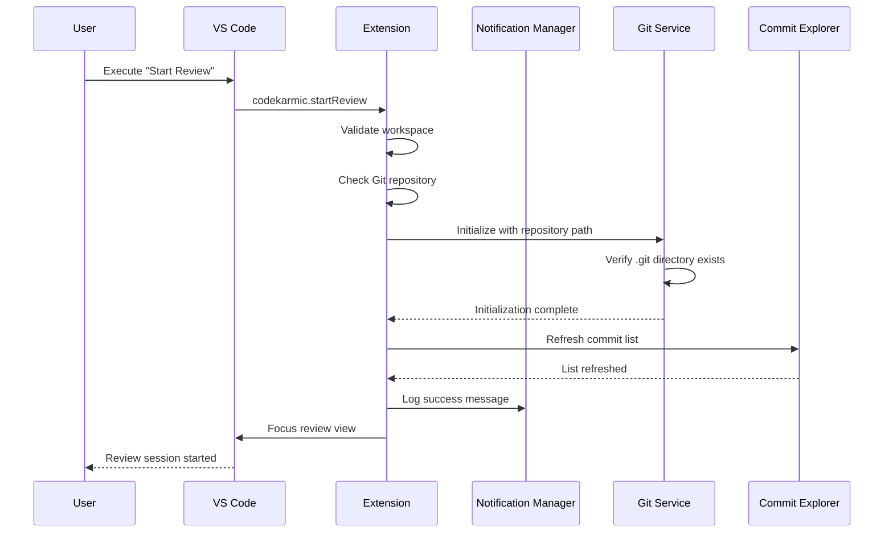

**Diagram sources**
- [extension.ts](file://src/extension.ts#L102-L139)

### Generating a Report

The report generation process involves multiple steps and service interactions:

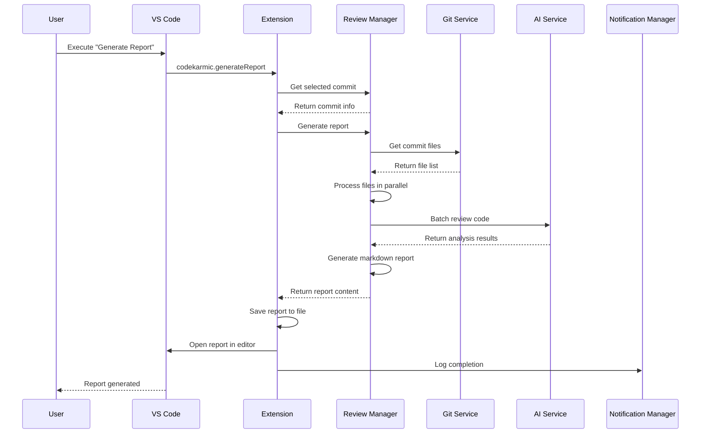

**Diagram sources**
- [extension.ts](file://src/extension.ts#L187-L244)
- [reviewManager.ts](file://src/services/review/reviewManager.ts#L372-L661)

### Reviewing a Single File

The file review process demonstrates the integration between UI and AI services:

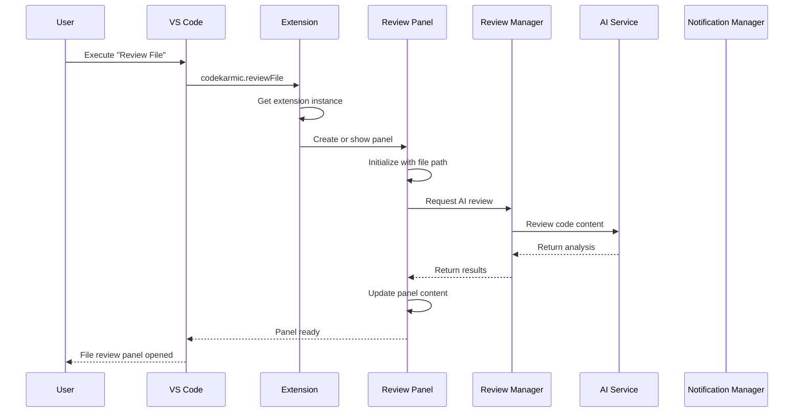

**Diagram sources**
- [extension.ts](file://src/extension.ts#L246-L258)
- [reviewPanel.ts](file://src/ui/views/reviewPanel.ts#L78-L124)

**Section sources**
- [extension.ts](file://src/extension.ts#L102-L258)
- [reviewManager.ts](file://src/services/review/reviewManager.ts#L372-L661)
- [reviewPanel.ts](file://src/ui/views/reviewPanel.ts#L78-L124)

## Best Practices

Implementing effective command flow architecture requires adherence to established patterns and practices that ensure maintainability, reliability, and user satisfaction.

### Command Design Principles

1. **Single Responsibility**: Each command should have a clear, focused purpose
2. **Consistent Naming**: Use descriptive, consistent command names following VS Code conventions
3. **Parameter Validation**: Validate all parameters before processing
4. **Error Handling**: Implement comprehensive error handling with meaningful messages
5. **Progress Reporting**: Provide feedback for long-running operations
6. **Cancellation Support**: Allow users to cancel long-running operations

### Service Integration Patterns

1. **Dependency Injection**: Pass required services through constructors
2. **Singleton Pattern**: Use singletons for stateful services
3. **Interface Segregation**: Define minimal, focused service interfaces
4. **Error Propagation**: Allow errors to propagate naturally through the stack
5. **Resource Management**: Properly manage resources and cleanup

### User Experience Guidelines

1. **Immediate Feedback**: Provide instant acknowledgment of command execution
2. **Progress Indication**: Show progress for operations that take time
3. **Clear Error Messages**: Use user-friendly error messages with actionable advice
4. **Graceful Degradation**: Maintain functionality even when some features are unavailable
5. **Context Awareness**: Adapt behavior based on current context and capabilities

### Testing Strategies

1. **Unit Testing**: Test individual command handlers in isolation
2. **Integration Testing**: Test command flows with real services
3. **Mock Services**: Use mocks for external dependencies in testing
4. **Error Scenario Testing**: Test error handling and recovery mechanisms
5. **Performance Testing**: Test command performance under various conditions

The CodeKarmic command flow architecture demonstrates how to build a robust, scalable system that provides excellent user experience while maintaining code quality and reliability. By following these patterns and practices, developers can create command systems that are both powerful and user-friendly.