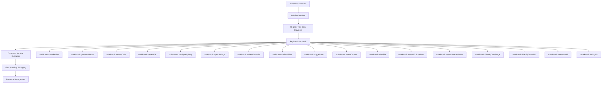
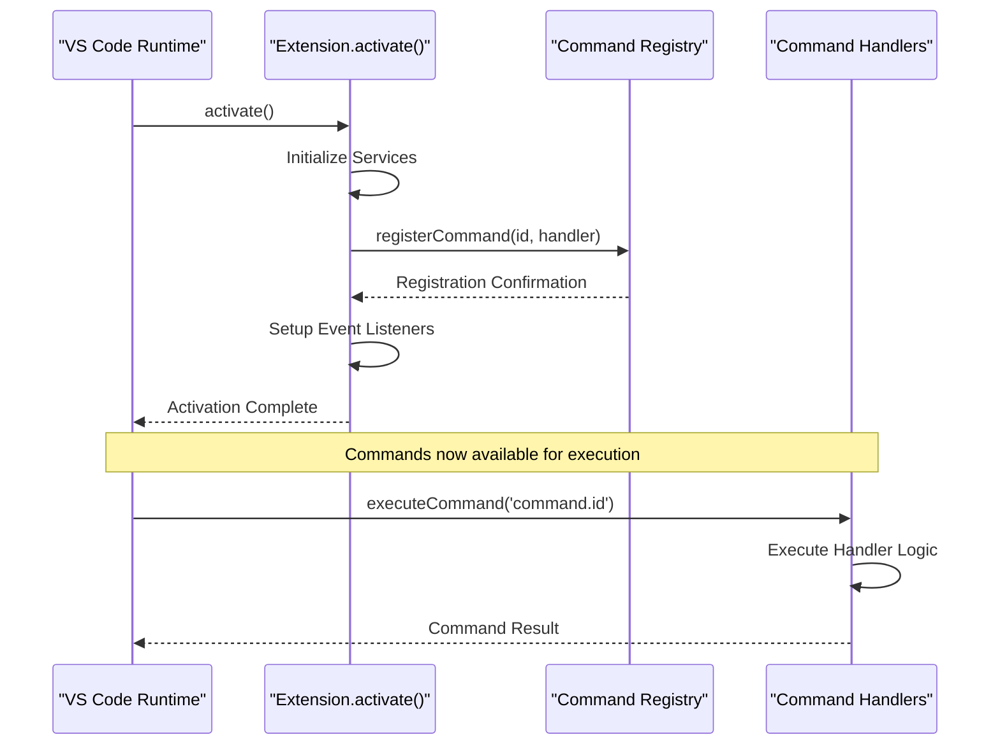
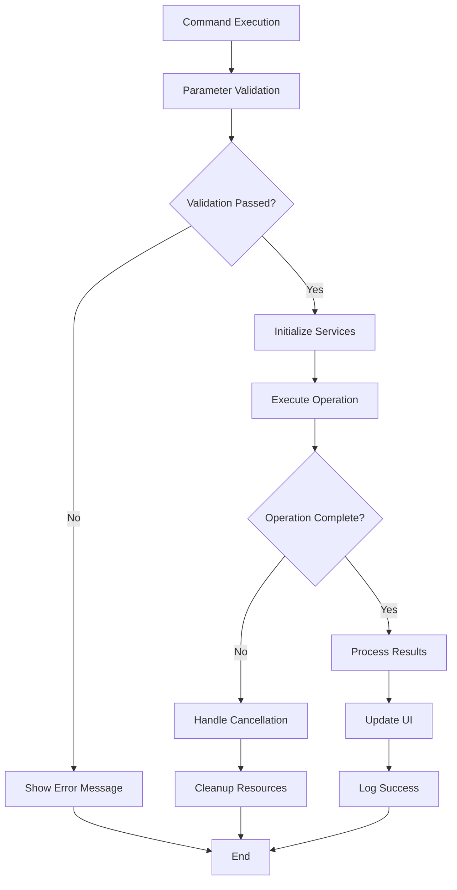

# Command Registration

<cite>
**Referenced Files in This Document**
- [extension.ts](file://src/extension.ts)
- [package.json](file://package.json)
- [reviewPanel.ts](file://src/ui/views/reviewPanel.ts)
- [notificationManager.ts](file://src/services/notification/notificationManager.ts)
- [commitExplorer.ts](file://src/ui/components/commitExplorer.ts)
- [fileExplorer.ts](file://src/ui/components/fileExplorer.ts)
</cite>

## Table of Contents
1. [Introduction](#introduction)
2. [Command Registration Architecture](#command-registration-architecture)
3. [Complete Command List](#complete-command-list)
4. [Registration Pattern Analysis](#registration-pattern-analysis)
5. [Handler Function Implementation](#handler-function-implementation)
6. [Common Registration Issues](#common-registration-issues)
7. [Best Practices](#best-practices)
8. [Disposal and Cleanup](#disposal-and-cleanup)
9. [Performance Considerations](#performance-considerations)
10. [Troubleshooting Guide](#troubleshooting-guide)

## Introduction

The CodeKarmic VS Code extension implements a comprehensive command registration system using VS Code's `vscode.commands.registerCommand()` API. This system enables seamless integration with VS Code's command palette, context menus, and keyboard shortcuts, providing users with powerful AI-powered code review capabilities.

The extension registers numerous commands that facilitate Git commit analysis, code review generation, and AI assistance throughout the development workflow. Each command follows VS Code's extension development patterns while incorporating robust error handling, progress reporting, and resource management.

## Command Registration Architecture

The CodeKarmic extension employs a centralized command registration approach within the `activate()` function in [`extension.ts`](file://src/extension.ts#L20-L519). This architecture ensures all commands are properly registered during extension activation and provides consistent error handling across the entire command ecosystem.



**Diagram sources**
- [extension.ts](file://src/extension.ts#L20-L519)

**Section sources**
- [extension.ts](file://src/extension.ts#L20-L519)

## Complete Command List

The CodeKarmic extension registers 17 distinct commands, each serving specific functionality within the code review workflow. These commands are categorized into several functional groups:

### Core Review Commands
| Command ID | Purpose | Handler Function |
|------------|---------|------------------|
| `codekarmic.startReview` | Initialize code review session | [`startReviewHandler`](file://src/extension.ts#L102-L138) |
| `codekarmic.generateReport` | Generate comprehensive review report | [`generateReportHandler`](file://src/extension.ts#L187-L239) |
| `codekarmic.reviewCode` | Perform AI code analysis | [`reviewCodeHandler`](file://src/extension.ts#L140-L184) |
| `codekarmic.reviewFile` | Open review panel for current file | [`reviewFileHandler`](file://src/extension.ts#L246-L257) |

### File and Workspace Operations
| Command ID | Purpose | Handler Function |
|------------|---------|------------------|
| `codekarmic.reviewWorkspaceFile` | Review individual workspace file | [`reviewWorkspaceFile`](file://src/extension.ts#L668-L758) |
| `codekarmic.reviewExplorerItem` | Review file/folder from explorer | [`reviewExplorerItemHandler`](file://src/extension.ts#L404-L432) |
| `codekarmic.reviewSelectedItems` | Review multiple selected items | [`reviewSelectedItemsHandler`](file://src/extension.ts#L434-L513) |

### Navigation and Interface Controls
| Command ID | Purpose | Handler Function |
|------------|---------|------------------|
| `codekarmic.togglePane` | Toggle AI review pane | [`togglePaneHandler`](file://src/extension.ts#L337-L370) |
| `codekarmic.viewFile` | View file in review panel | [`viewFileHandler`](file://src/extension.ts#L390-L402) |

### Git and Repository Management
| Command ID | Purpose | Handler Function |
|------------|---------|------------------|
| `codekarmic.selectCommit` | Select Git commit for review | [`selectCommitHandler`](file://src/extension.ts#L372-L388) |
| `codekarmic.refreshCommits` | Refresh commit history | [`refreshCommitsHandler`](file://src/extension.ts#L294-L324) |
| `codekarmic.refreshFiles` | Refresh file explorer | [`refreshFilesHandler`](file://src/extension.ts#L325-L335) |
| `codekarmic.filterByDateRange` | Filter commits by date range | [`filterByDateRange`](file://src/extension.ts#L537-L575) |
| `codekarmic.filterByCommitId` | Filter commits by commit ID | [`filterByCommitId`](file://src/extension.ts#L577-L606) |

### Configuration and Settings
| Command ID | Purpose | Handler Function |
|------------|---------|------------------|
| `codekarmic.configureApiKey` | Configure AI API key | [`configureApiKeyHandler`](file://src/extension.ts#L81-L96) |
| `codekarmic.openSettings` | Open extension settings | [`openSettingsHandler`](file://src/extension.ts#L98-L100) |
| `codekarmic.selectModel` | Select AI model | [`selectModel`](file://src/extension.ts#L522-L534) |

### Debug and Utility Commands
| Command ID | Purpose | Handler Function |
|------------|---------|------------------|
| `codekarmic.debugGit` | Debug Git functionality | [`debugGitFunctionality`](file://src/extension.ts#L608-L659) |

**Section sources**
- [extension.ts](file://src/extension.ts#L81-L519)
- [package.json](file://package.json#L38-L116)

## Registration Pattern Analysis

The CodeKarmic extension follows a consistent registration pattern that ensures reliability and maintainability across all commands. Each command registration follows this template structure:

```typescript
// Pattern: Basic Command Registration
vscode.commands.registerCommand('command.id', async (parameters) => {
    try {
        // Command logic implementation
        // Parameter validation
        // Service initialization
        // Business logic execution
        // Progress reporting
        // Result handling
    } catch (error) {
        // Error handling and logging
        // User notification
        // Resource cleanup
    }
});
```

### Registration Timing and Lifecycle

All commands are registered synchronously during the extension's activation phase, ensuring immediate availability upon extension startup. The registration occurs after essential services are initialized but before any potential command execution.



**Diagram sources**
- [extension.ts](file://src/extension.ts#L20-L519)

### Parameter Handling Patterns

Different commands employ various parameter handling approaches based on their specific requirements:

1. **Simple Commands**: No parameters required
2. **Context-Aware Commands**: Extract parameters from VS Code context
3. **Explicit Parameter Commands**: Receive structured parameters
4. **Event-Driven Commands**: Respond to VS Code events

**Section sources**
- [extension.ts](file://src/extension.ts#L81-L519)

## Handler Function Implementation

Each command handler implements robust error handling, progress reporting, and resource management. The implementation patterns vary based on the command's complexity and requirements.

### Error Handling Strategy

All command handlers implement a comprehensive error handling strategy that includes:

- **Try-Catch Blocks**: Centralized error catching for all command logic
- **User Notification**: Appropriate VS Code notification types (info, warning, error)
- **Logging**: Structured logging through NotificationManager
- **Graceful Degradation**: Fallback mechanisms for failed operations
- **Resource Cleanup**: Proper disposal of resources on failure

### Progress Reporting Implementation

Commands that perform long-running operations implement progress reporting using VS Code's progress API:

```typescript
await vscode.window.withProgress(
    {
        location: vscode.ProgressLocation.Notification,
        title: 'Operation Title',
        cancellable: true
    },
    async (progress, token) => {
        // Progress reporting logic
        progress.report({ increment: 25, message: 'Step 1 complete' });
        // Operation logic
        progress.report({ increment: 25, message: 'Step 2 complete' });
    }
);
```

### Asynchronous Operation Patterns

Most command handlers implement asynchronous patterns with proper promise handling and cancellation support:



**Diagram sources**
- [extension.ts](file://src/extension.ts#L140-L184)
- [extension.ts](file://src/extension.ts#L246-L257)

**Section sources**
- [extension.ts](file://src/extension.ts#L140-L184)
- [extension.ts](file://src/extension.ts#L246-L257)
- [extension.ts](file://src/extension.ts#L337-L370)

## Common Registration Issues

Understanding common command registration issues helps developers avoid pitfalls and implement robust command systems.

### Command ID Conflicts

**Issue**: Duplicate command IDs causing registration failures
**Solution**: Use unique, hierarchical naming conventions
**Example**: `codekarmic.startReview` vs `codekarmic.startReviewSession`

### Registration Timing Issues

**Issue**: Commands registered after activation completion
**Solution**: Register all commands synchronously during activation
**Pattern**: Place all `registerCommand` calls within the main activation function

### Parameter Type Mismatches

**Issue**: Incorrect parameter types passed to command handlers
**Solution**: Implement strict parameter validation and type checking
**Implementation**: Use TypeScript interfaces for parameter types

### Memory Leaks and Resource Management

**Issue**: Unreleased event listeners and subscriptions
**Solution**: Implement proper disposal patterns using VS Code's Disposable pattern

### Error Propagation Problems

**Issue**: Unhandled exceptions causing extension crashes
**Solution**: Implement comprehensive try-catch blocks with proper error logging

**Section sources**
- [extension.ts](file://src/extension.ts#L20-L519)

## Best Practices

### Naming Conventions

Follow VS Code's established naming conventions for command IDs:

- **Prefix**: Use `codekarmic.` as the namespace prefix
- **Verb-Noun Pattern**: Use imperative verbs followed by nouns
- **Hierarchical Structure**: Group related commands under logical categories
- **Consistency**: Maintain consistent naming patterns across all commands

### Error Handling Best Practices

1. **Structured Error Messages**: Provide clear, actionable error messages
2. **User-Friendly Notifications**: Use appropriate VS Code notification types
3. **Logging Integration**: Log errors through the NotificationManager
4. **Recovery Options**: Offer users clear paths to resolve issues
5. **Graceful Degradation**: Maintain functionality even when parts fail

### Performance Optimization

1. **Lazy Loading**: Load heavy dependencies only when needed
2. **Caching Strategies**: Cache expensive computations and API responses
3. **Progress Reporting**: Provide feedback for long-running operations
4. **Cancellation Support**: Allow users to cancel long-running operations
5. **Resource Management**: Properly dispose of resources and event listeners

### Testing and Validation

1. **Unit Testing**: Test command handlers independently
2. **Integration Testing**: Test command interactions with VS Code APIs
3. **Error Scenario Testing**: Test error conditions and edge cases
4. **Performance Testing**: Measure command execution times
5. **User Experience Testing**: Validate user interaction flows

**Section sources**
- [extension.ts](file://src/extension.ts#L20-L519)
- [notificationManager.ts](file://src/services/notification/notificationManager.ts#L31-L212)

## Disposal and Cleanup

The CodeKarmic extension implements comprehensive resource management and disposal patterns to prevent memory leaks and ensure clean shutdown.

### Review Panel Disposal

The ReviewPanel class demonstrates proper disposal implementation:

```typescript
public dispose() {
    ReviewPanel.currentPanel = undefined;
    
    // Clean up our resources
    this._panel.dispose();
    
    while (this._disposables.length) {
        const x = this._disposables.pop();
        if (x) {
            x.dispose();
        }
    }
}
```

### Event Listener Management

Commands that register event listeners implement proper cleanup:

```typescript
// Event listener with proper disposal
this._panel.onDidDispose(() => this.dispose(), null, this._disposables);
this._panel.onDidChangeViewState(
    () => {
        if (this._panel.visible) {
            this._update();
        }
    },
    null,
    this._disposables
);
```

### Resource Lifecycle Management

The extension manages various resources throughout its lifecycle:

1. **Webview Panels**: Proper disposal of ReviewPanel instances
2. **Event Listeners**: Cleanup of VS Code event subscriptions
3. **Service Instances**: Management of singleton service lifecycles
4. **File Handles**: Proper closing of file operations
5. **Network Connections**: Cleanup of API connections

**Section sources**
- [reviewPanel.ts](file://src/ui/views/reviewPanel.ts#L125-L138)
- [reviewPanel.ts](file://src/ui/views/reviewPanel.ts#L30-L75)

## Performance Considerations

### Command Initialization Performance

The extension optimizes command initialization through several strategies:

1. **Lazy Service Initialization**: Services are instantiated only when needed
2. **Conditional Registration**: Some commands are registered conditionally
3. **Minimal Dependencies**: Commands load minimal dependencies initially
4. **Parallel Initialization**: Independent services initialize concurrently

### Memory Management

Efficient memory usage is achieved through:

1. **Singleton Pattern**: Reuse service instances across commands
2. **Weak References**: Use weak references where appropriate
3. **Resource Pooling**: Pool expensive resources like API clients
4. **Garbage Collection**: Properly dispose of unused objects

### Network Request Optimization

API calls are optimized through:

1. **Request Batching**: Combine multiple small requests
2. **Response Caching**: Cache API responses appropriately
3. **Timeout Management**: Implement reasonable timeouts
4. **Retry Logic**: Implement exponential backoff for retries

### UI Responsiveness

Maintaining UI responsiveness involves:

1. **Asynchronous Operations**: Keep UI thread responsive
2. **Progress Indicators**: Show progress for long operations
3. **Cancellation Support**: Allow operation cancellation
4. **Debouncing**: Debounce rapid user actions

**Section sources**
- [extension.ts](file://src/extension.ts#L20-L519)
- [reviewPanel.ts](file://src/ui/views/reviewPanel.ts#L149-L200)

## Troubleshooting Guide

### Command Not Found Errors

**Symptoms**: "Command 'codekarmic.command' not found" errors
**Causes**: 
- Command not registered during activation
- Typographical errors in command IDs
- Extension not properly activated

**Solutions**:
1. Verify command registration in [`extension.ts`](file://src/extension.ts#L81-L519)
2. Check for typos in command ID declarations
3. Ensure extension activation completes successfully

### API Key Configuration Issues

**Symptoms**: "API key not configured" errors
**Causes**:
- Missing or invalid API key
- API key validation failures
- Network connectivity issues

**Solutions**:
1. Use `codekarmic.configureApiKey` command to set API key
2. Verify API key validity through validation endpoint
3. Check network connectivity and firewall settings

### Git Integration Problems

**Symptoms**: "Not a Git repository" or "Git command failed" errors
**Causes**:
- Working directory is not a Git repository
- Git executable not found
- Permission issues accessing Git files

**Solutions**:
1. Verify Git repository existence with `.git` directory
2. Check Git installation and PATH configuration
3. Run VS Code with appropriate permissions

### Performance Issues

**Symptoms**: Slow command execution or UI freezing
**Causes**:
- Large file processing
- Network timeouts
- Insufficient system resources

**Solutions**:
1. Implement progress reporting for long operations
2. Add cancellation support for user-initiated stops
3. Optimize file processing algorithms
4. Increase timeout values for slow networks

### Memory Leaks

**Symptoms**: Increasing memory usage over time
**Causes**:
- Unclosed event listeners
- Retained references to large objects
- Improper disposal of resources

**Solutions**:
1. Implement proper disposal patterns
2. Use weak references for temporary objects
3. Monitor memory usage with VS Code DevTools
4. Regularly dispose of unused resources

**Section sources**
- [extension.ts](file://src/extension.ts#L37-L66)
- [extension.ts](file://src/extension.ts#L140-L184)
- [extension.ts](file://src/extension.ts#L294-L324)