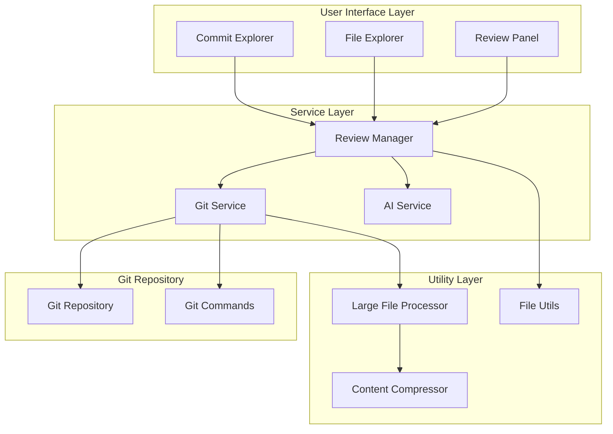
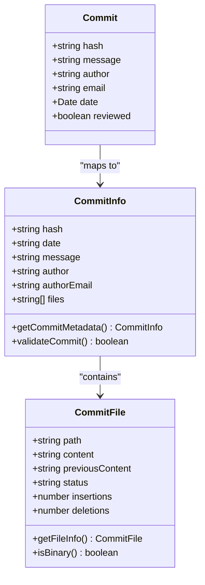
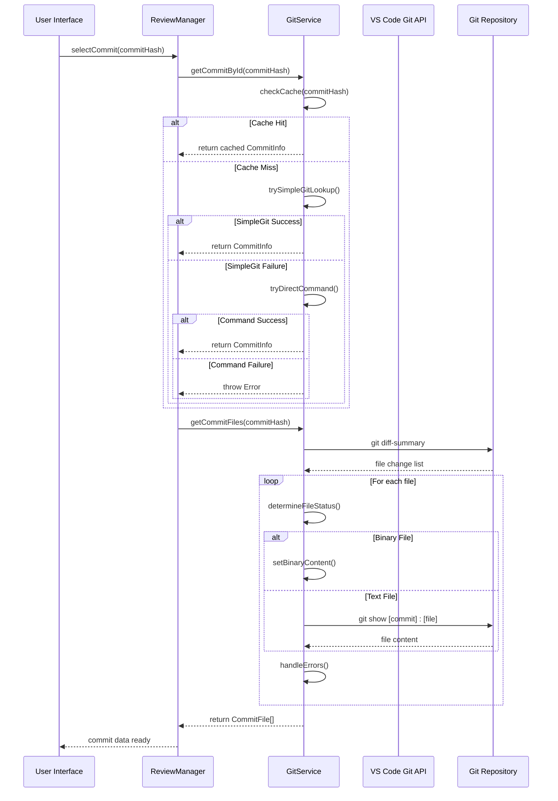
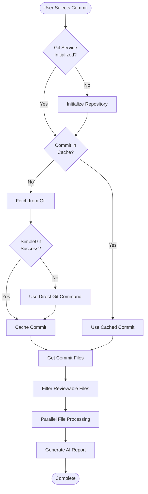
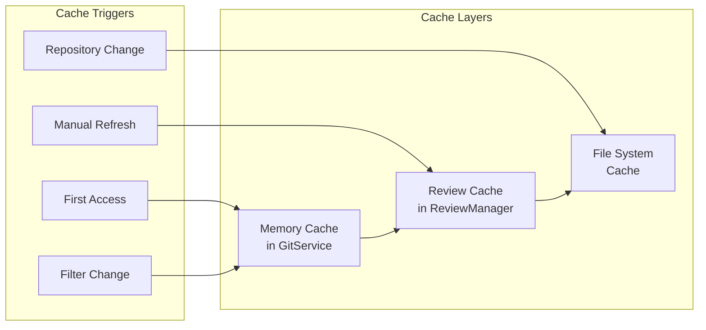
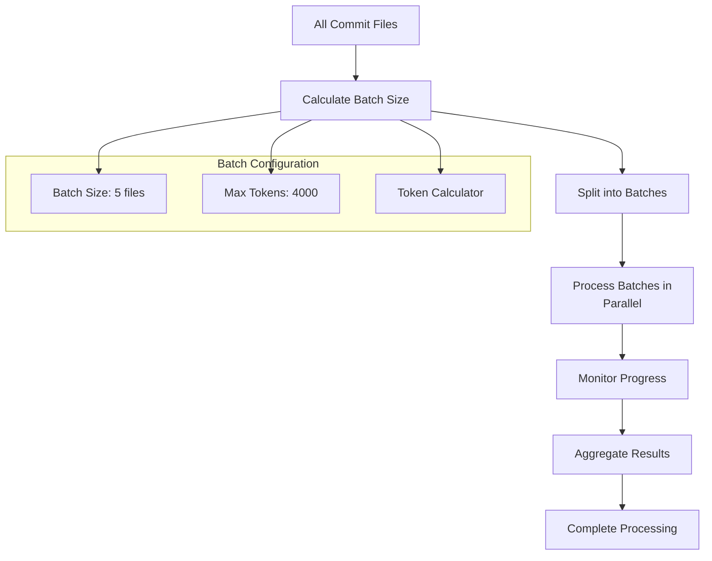
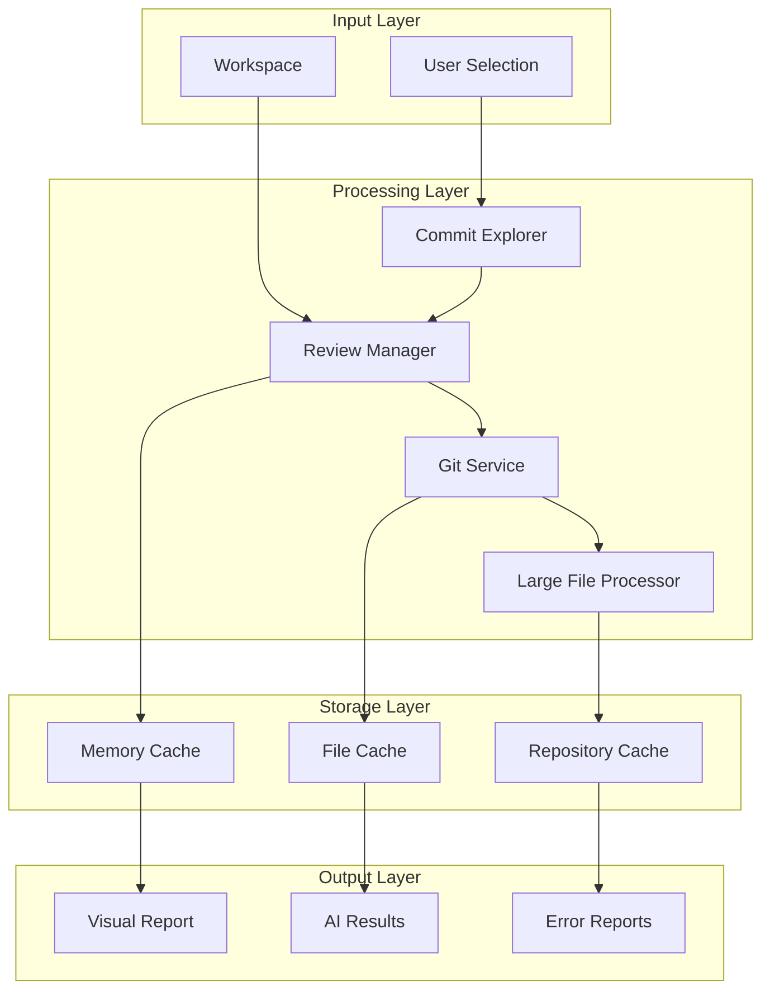
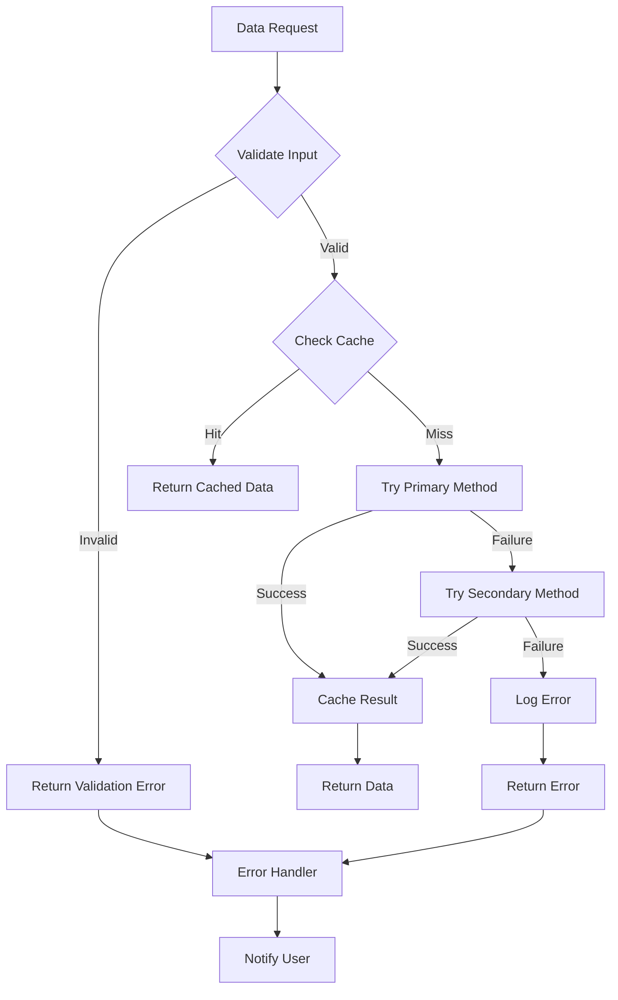

# Commit Data Flow

<cite>
**Referenced Files in This Document**
- [gitService.ts](file://src/services/git/gitService.ts)
- [reviewManager.ts](file://src/services/review/reviewManager.ts)
- [commitExplorer.ts](file://src/ui/components/commitExplorer.ts)
- [versionControlTypes.ts](file://src/services/git/versionControlTypes.ts)
- [fileUtils.ts](file://src/utils/fileUtils.ts)
- [baseModel.ts](file://src/models/baseModel.ts)
- [contentCompressor.ts](file://src/core/compression/contentCompressor.ts)
- [largeFileProcessor.ts](file://src/core/compression/largeFileProcessor.ts)
</cite>

## Table of Contents
1. [Introduction](#introduction)
2. [System Architecture Overview](#system-architecture-overview)
3. [Core Data Models](#core-data-models)
4. [Commit Data Retrieval Flow](#commit-data-retrieval-flow)
5. [ReviewManager Coordination](#reviewmanager-coordination)
6. [Error Handling and Caching Strategies](#error-handling-and-caching-strategies)
7. [Performance Optimization](#performance-optimization)
8. [Common Issues and Solutions](#common-issues-and-solutions)
9. [Data Flow Diagrams](#data-flow-diagrams)
10. [Best Practices](#best-practices)

## Introduction

CodeKarmic implements a sophisticated commit data flow system that efficiently retrieves, processes, and caches commit information from Git repositories. The system orchestrates between GitService for low-level Git operations, ReviewManager for high-level orchestration, and various utility services for specialized processing tasks like large file handling and content compression.

The commit data flow encompasses multiple stages: commit identification, file content extraction, caching mechanisms, error handling, and performance optimization strategies. This comprehensive system ensures reliable code review capabilities while maintaining optimal performance for large repositories and complex commit histories.

## System Architecture Overview

The commit data flow follows a layered architecture with clear separation of concerns:

**Diagram sources**
- [commitExplorer.ts](file://src/ui/components/commitExplorer.ts#L1-L172)
- [reviewManager.ts](file://src/services/review/reviewManager.ts#L1-L854)
- [gitService.ts](file://src/services/git/gitService.ts#L45-L1201)

## Core Data Models

### CommitInfo Model

The CommitInfo model serves as the primary data structure for representing Git commits within the CodeKarmic system:

**Diagram sources**
- [gitService.ts](file://src/services/git/gitService.ts#L28-L44)
- [versionControlTypes.ts](file://src/services/git/versionControlTypes.ts#L7-L23)

### Version Control Types

The system defines comprehensive type definitions for version control operations:

| Type | Purpose | Key Properties |
|------|---------|----------------|
| `Commit` | Core Git commit representation | `hash`, `message`, `author`, `email`, `date` |
| `FileChange` | Individual file modification tracking | `path`, `status`, `oldPath`, `reviewed` |
| `DiffOptions` | Difference generation configuration | `ignoreWhitespace`, `contextLines`, `includeStats` |
| `DiffStats` | Statistical information | `additions`, `deletions`, `changedFiles` |

**Section sources**
- [versionControlTypes.ts](file://src/services/git/versionControlTypes.ts#L1-L80)

## Commit Data Retrieval Flow

### Sequence of Operations

The commit data retrieval follows a structured sequence designed for reliability and performance:

**Diagram sources**
- [reviewManager.ts](file://src/services/review/reviewManager.ts#L149-L206)
- [gitService.ts](file://src/services/git/gitService.ts#L110-L177)

### getCommitById Implementation

The `getCommitById` method demonstrates robust error handling and multiple fallback strategies:

**Key Features:**
- **Caching Strategy**: Checks local cache before making Git calls
- **Multiple Methods**: Tries simple-git first, falls back to direct Git commands
- **Partial Hash Support**: Accepts shortened commit hashes
- **Error Resilience**: Continues operation even when individual commits fail

**Section sources**
- [gitService.ts](file://src/services/git/gitService.ts#L244-L276)

### getCommitFiles Implementation

The `getCommitFiles` method handles complex file status determination and content retrieval:

**Processing Logic:**
1. **File Status Detection**: Determines if files are added, modified, deleted, or binary
2. **Content Extraction**: Retrieves current and previous content for modified files
3. **Error Handling**: Gracefully handles missing files and binary content
4. **Performance Optimization**: Uses concurrent processing for multiple files

**Section sources**
- [gitService.ts](file://src/services/git/gitService.ts#L110-L177)

## ReviewManager Coordination

### Central Orchestration

The ReviewManager acts as the central coordinator, managing the interaction between GitService and other components:

**Diagram sources**
- [reviewManager.ts](file://src/services/review/reviewManager.ts#L149-L206)

### File Filtering and Validation

The system implements intelligent file filtering to ensure only reviewable files are processed:

**Reviewable File Criteria:**
- Supported programming languages (JavaScript, Python, Java, Go, etc.)
- Configuration files (.json, .yaml, .xml)
- Markup languages (.md, .html, .css)
- Special files (Dockerfile, Makefile, .gitignore)

**Section sources**
- [fileUtils.ts](file://src/utils/fileUtils.ts#L1-L109)
- [reviewManager.ts](file://src/services/review/reviewManager.ts#L235-L261)

## Error Handling and Caching Strategies

### Multi-Level Caching

CodeKarmic implements a sophisticated caching strategy to optimize performance:

**Cache Implementation Details:**
- **Memory Cache**: Stores recent commits and file metadata in memory
- **Persistent Cache**: Maintains file content and processed results
- **Invalidation Strategy**: Clears cache when filters change or repository updates

### Error Recovery Mechanisms

The system implements comprehensive error recovery:

**Error Categories:**
1. **Repository Errors**: Invalid paths, missing .git directories
2. **Network Errors**: Remote repository connectivity issues
3. **File System Errors**: Permission issues, disk space limitations
4. **Git Errors**: Corrupted repositories, unsupported operations

**Recovery Strategies:**
- **Fallback Methods**: Multiple Git command approaches
- **Graceful Degradation**: Continue with partial results
- **User Notification**: Clear error messages with suggested actions

**Section sources**
- [gitService.ts](file://src/services/git/gitService.ts#L64-L107)
- [reviewManager.ts](file://src/services/review/reviewManager.ts#L101-L109)

## Performance Optimization

### Batch Processing Strategy

The system employs intelligent batching to handle large numbers of files efficiently:

**Diagram sources**
- [reviewManager.ts](file://src/services/review/reviewManager.ts#L329-L369)

### Large File Handling

For files exceeding AI model limits, the system implements content compression:

**Compression Features:**
- **Intelligent Sampling**: Preserves important code sections
- **Language-Aware Processing**: Different strategies for different languages
- **Statistics Preservation**: Maintains file metrics for caching
- **Fallback Mechanisms**: Alternative processing when compression fails

**Section sources**
- [largeFileProcessor.ts](file://src/core/compression/largeFileProcessor.ts#L1-L242)
- [contentCompressor.ts](file://src/core/compression/contentCompressor.ts#L1-L414)

### Concurrent Processing

The system utilizes concurrent processing for optimal performance:

**Concurrency Patterns:**
- **Parallel File Processing**: Process multiple files simultaneously
- **Batch AI Analysis**: Group files for efficient AI processing
- **Progress Monitoring**: Real-time progress updates for long operations

**Section sources**
- [reviewManager.ts](file://src/services/review/reviewManager.ts#L329-L478)

## Common Issues and Solutions

### Repository Initialization Problems

**Issue**: Git repository not found or inaccessible
**Solution**: Comprehensive validation with clear error messages

**Diagnostic Steps:**
1. Verify repository path exists
2. Check for .git directory
3. Validate Git installation
4. Confirm repository accessibility

**Section sources**
- [gitService.ts](file://src/services/git/gitService.ts#L64-L107)

### Large Commit Handling

**Issue**: Performance degradation with large commits
**Solution**: Intelligent filtering and compression

**Optimization Techniques:**
- **File Size Thresholds**: Process only files above minimum size
- **Content Compression**: Reduce file sizes while preserving meaning
- **Selective Processing**: Skip binary and unreviewable files

**Section sources**
- [largeFileProcessor.ts](file://src/core/compression/largeFileProcessor.ts#L46-L58)

### Binary File Processing

**Issue**: Binary files causing processing failures
**Solution**: Special handling for binary content

**Handling Strategy:**
- **Binary Detection**: Identify binary files automatically
- **Placeholder Content**: Use "(Binary File)" marker
- **Skip Processing**: Exclude binary files from AI analysis

**Section sources**
- [gitService.ts](file://src/services/git/gitService.ts#L127-L131)

### Network and Connectivity Issues

**Issue**: Remote repository access problems
**Solution**: Local caching and offline mode support

**Resilience Features:**
- **Local Cache Utilization**: Use cached data when network unavailable
- **Incremental Updates**: Sync changes when connectivity resumes
- **Offline Processing**: Continue analysis with available data

## Data Flow Diagrams

### Complete Commit Processing Pipeline

**Diagram sources**
- [commitExplorer.ts](file://src/ui/components/commitExplorer.ts#L1-L172)
- [reviewManager.ts](file://src/services/review/reviewManager.ts#L1-L854)
- [gitService.ts](file://src/services/git/gitService.ts#L45-L1201)

### Error Handling Flow

**Diagram sources**
- [gitService.ts](file://src/services/git/gitService.ts#L244-L276)
- [reviewManager.ts](file://src/services/review/reviewManager.ts#L101-L109)

## Best Practices

### Development Guidelines

1. **Error Handling**: Always implement comprehensive error handling with fallback mechanisms
2. **Performance**: Use caching and batch processing for large datasets
3. **Validation**: Validate inputs early and provide clear error messages
4. **Logging**: Implement detailed logging for debugging and monitoring

### Operational Considerations

1. **Resource Management**: Monitor memory usage for large file processing
2. **Network Resilience**: Design for intermittent connectivity
3. **Scalability**: Test with repositories of varying sizes
4. **User Experience**: Provide progress feedback for long operations

### Maintenance Recommendations

1. **Regular Testing**: Test with various repository configurations
2. **Performance Monitoring**: Track processing times and resource usage
3. **Error Analysis**: Monitor error rates and patterns
4. **Feature Enhancement**: Continuously improve compression algorithms

The commit data flow in CodeKarmic represents a sophisticated balance between performance, reliability, and user experience. Through careful orchestration of multiple services and intelligent handling of edge cases, the system provides robust code review capabilities for modern development workflows.