# Data Exchange Patterns

<cite>
**Referenced Files in This Document**
- [src/models/types.ts](file://src/models/types.ts)
- [src/services/git/versionControlTypes.ts](file://src/services/git/versionControlTypes.ts)
- [src/services/git/gitService.ts](file://src/services/git/gitService.ts)
- [src/core/review/reviewTypes.ts](file://src/core/review/reviewTypes.ts)
- [src/services/review/reviewManager.ts](file://src/services/review/reviewManager.ts)
- [src/services/ai/aiService.ts](file://src/services/ai/aiService.ts)
- [src/core/compression/largeFileProcessor.ts](file://src/core/compression/largeFileProcessor.ts)
- [src/core/compression/compressionTypes.ts](file://src/core/compression/compressionTypes.ts)
- [src/core/compression/contentCompressor.ts](file://src/core/compression/contentCompressor.ts)
- [src/utils/fileUtils.ts](file://src/utils/fileUtils.ts)
- [src/ui/views/reviewPanel.ts](file://src/ui/views/reviewPanel.ts)
</cite>

## Table of Contents
1. [Introduction](#introduction)
2. [Core Data Models](#core-data-models)
3. [Service Layer Architecture](#service-layer-architecture)
4. [Data Flow Patterns](#data-flow-patterns)
5. [Data Transformation and Mapping](#data-transformation-and-mapping)
6. [Performance Optimization Strategies](#performance-optimization-strategies)
7. [Error Handling and Data Validation](#error-handling-and-data-validation)
8. [Common Data Exchange Issues](#common-data-exchange-issues)
9. [Best Practices](#best-practices)
10. [Conclusion](#conclusion)

## Introduction

The CodeKarmic architecture implements a sophisticated data exchange system that facilitates seamless communication between different service layers during the code review process. This system handles complex data transformations, manages performance implications of large data transfers, and ensures robust error handling across the entire application stack.

The data exchange patterns in CodeKarmic are designed around several key principles:
- **Type Safety**: Strong typing ensures data integrity throughout the system
- **Performance Optimization**: Intelligent caching and compression mechanisms prevent bottlenecks
- **Modularity**: Clear separation of concerns enables flexible service interactions
- **Resilience**: Comprehensive error handling and fallback mechanisms

## Core Data Models

### Version Control Data Models

The foundation of CodeKarmic's data exchange lies in its version control data models, which define how Git-related information flows through the system.

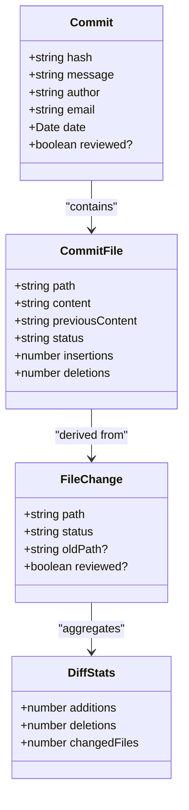

**Diagram sources**
- [src/services/git/versionControlTypes.ts](file://src/services/git/versionControlTypes.ts#L10-L80)

### Code Review Data Models

The code review system utilizes specialized data structures that encapsulate review requests, results, and analysis data.

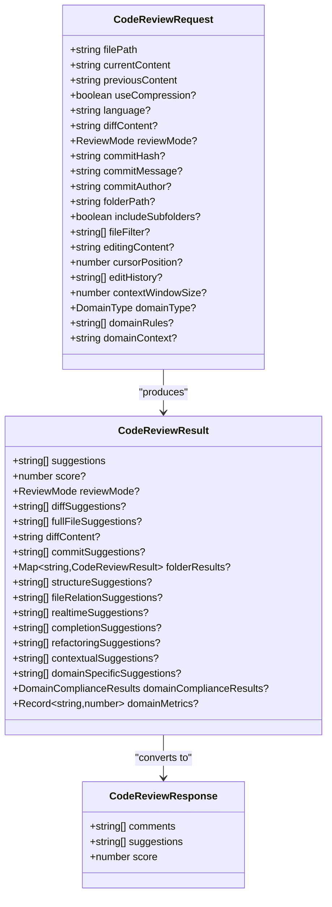

**Diagram sources**
- [src/core/review/reviewTypes.ts](file://src/core/review/reviewTypes.ts#L24-L206)

**Section sources**
- [src/services/git/versionControlTypes.ts](file://src/services/git/versionControlTypes.ts#L1-L80)
- [src/core/review/reviewTypes.ts](file://src/core/review/reviewTypes.ts#L1-L206)

## Service Layer Architecture

### Service Interaction Overview

The CodeKarmic architecture implements a layered service pattern where each layer has specific responsibilities and well-defined interfaces for data exchange.

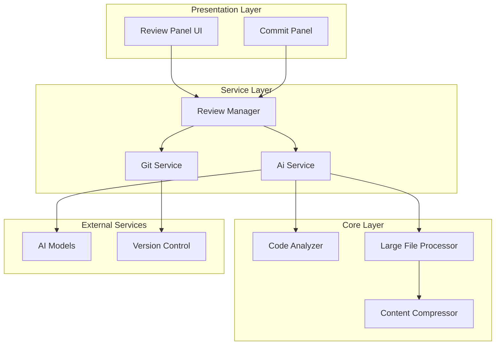

**Diagram sources**
- [src/services/review/reviewManager.ts](file://src/services/review/reviewManager.ts#L1-L50)
- [src/services/git/gitService.ts](file://src/services/git/gitService.ts#L1-L50)
- [src/services/ai/aiService.ts](file://src/services/ai/aiService.ts#L1-L50)

### Service Communication Patterns

Each service implements specific communication patterns optimized for its role in the data exchange pipeline:

#### Git Service Data Flow
The Git Service acts as the primary data provider, offering multiple strategies for retrieving commit and file information:

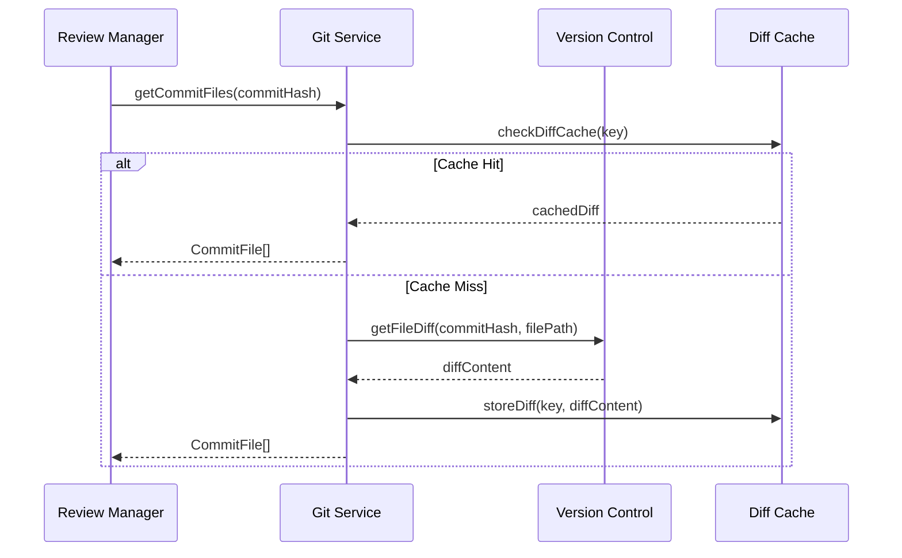

**Diagram sources**
- [src/services/git/gitService.ts](file://src/services/git/gitService.ts#L110-L177)

#### AI Service Data Processing
The AI Service implements sophisticated data processing with batch optimization and compression capabilities:

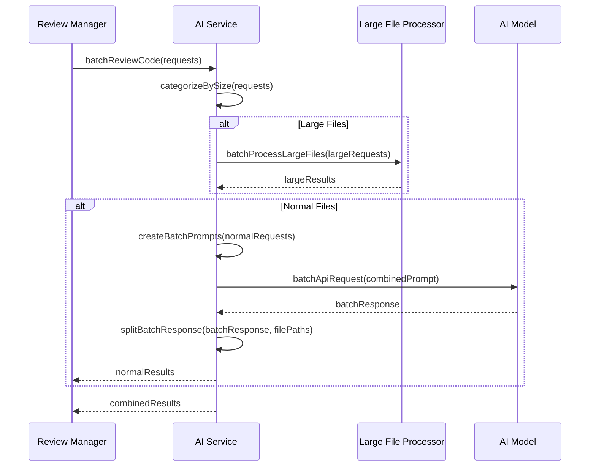

**Diagram sources**
- [src/services/ai/aiService.ts](file://src/services/ai/aiService.ts#L431-L552)

**Section sources**
- [src/services/git/gitService.ts](file://src/services/git/gitService.ts#L110-L800)
- [src/services/ai/aiService.ts](file://src/services/ai/aiService.ts#L431-L552)

## Data Flow Patterns

### Commit-Based Review Flow

The primary data flow pattern involves processing Git commits through the review pipeline:

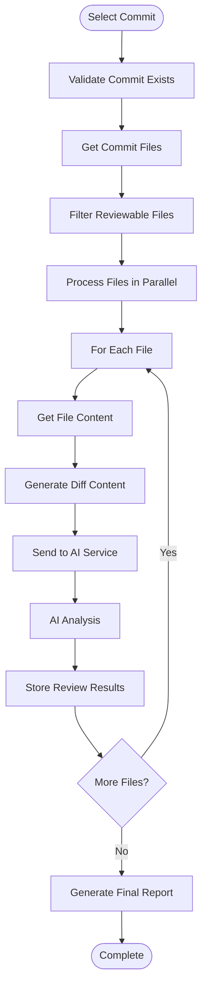

**Diagram sources**
- [src/services/review/reviewManager.ts](file://src/services/review/reviewManager.ts#L372-L647)

### Direct File Review Flow

For standalone file reviews, the system bypasses Git operations:

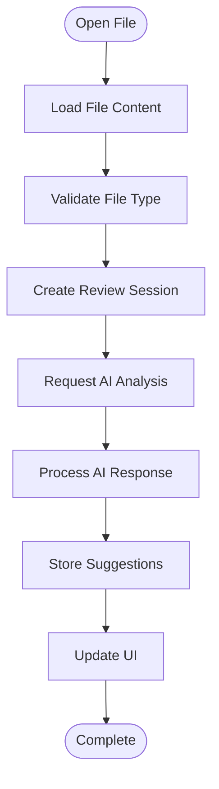

**Diagram sources**
- [src/ui/views/reviewPanel.ts](file://src/ui/views/reviewPanel.ts#L149-L239)

**Section sources**
- [src/services/review/reviewManager.ts](file://src/services/review/reviewManager.ts#L372-L647)
- [src/ui/views/reviewPanel.ts](file://src/ui/views/reviewPanel.ts#L149-L239)

## Data Transformation and Mapping

### Content Compression Pipeline

The system implements intelligent content compression for large files to optimize performance and reduce token usage:

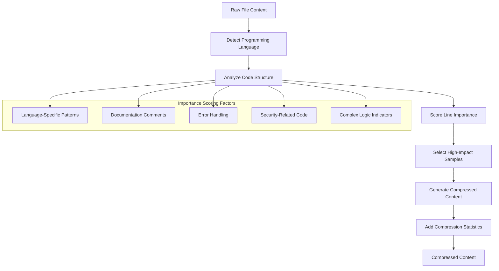

**Diagram sources**
- [src/core/compression/contentCompressor.ts](file://src/core/compression/contentCompressor.ts#L56-L174)

### Data Format Transformations

The system performs numerous data format transformations throughout the review process:

| Transformation Stage | Input Format | Output Format | Purpose |
|---------------------|--------------|---------------|---------|
| Git Service | Raw Git Output | Commit Objects | Standardize commit data |
| File Processing | File Paths | File Content | Retrieve readable content |
| Diff Generation | Previous/Current Content | Unified Diff Format | Standardize diff presentation |
| AI Processing | Structured Requests | Analysis Results | Normalize AI responses |
| UI Rendering | Review Data | HTML/JSON | Present to users |

**Section sources**
- [src/core/compression/contentCompressor.ts](file://src/core/compression/contentCompressor.ts#L1-L414)
- [src/core/compression/compressionTypes.ts](file://src/core/compression/compressionTypes.ts#L1-L87)

## Performance Optimization Strategies

### Caching Mechanisms

The system implements multiple levels of caching to optimize performance:

#### Diff Content Caching
The Git Service maintains a cache for generated diff content to avoid redundant computations:

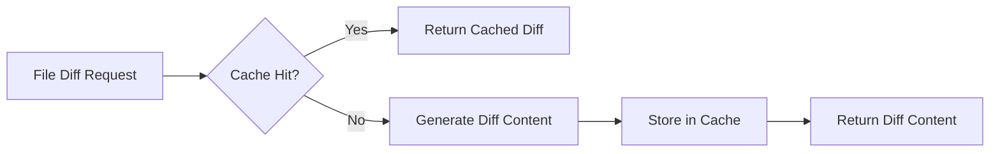

**Diagram sources**
- [src/services/git/gitService.ts](file://src/services/git/gitService.ts#L125-L140)

#### Large File Processing Optimization
The Large File Processor implements batch processing with intelligent token management:

| Optimization Strategy | Implementation | Performance Gain |
|----------------------|----------------|------------------|
| Content Fingerprinting | SHA-1 hashing for cache keys | Eliminates duplicate processing |
| Batch Token Management | Limits batch size to model constraints | Prevents API failures |
| Progressive Loading | Processes files in chunks | Reduces memory pressure |
| Compression Thresholds | Automatic compression for large files | Reduces processing time |

### Memory Management

The system employs several strategies to manage memory efficiently:

#### Streaming Processing
Large file processing uses streaming techniques to minimize memory footprint:

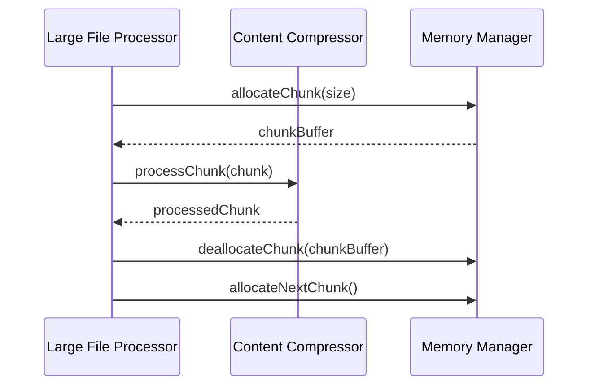

**Diagram sources**
- [src/core/compression/largeFileProcessor.ts](file://src/core/compression/largeFileProcessor.ts#L160-L224)

**Section sources**
- [src/services/git/gitService.ts](file://src/services/git/gitService.ts#L125-L140)
- [src/core/compression/largeFileProcessor.ts](file://src/core/compression/largeFileProcessor.ts#L160-L224)

## Error Handling and Data Validation

### Input Validation Patterns

The system implements comprehensive input validation at multiple layers:

#### File Type Validation
The fileUtils module ensures only reviewable files are processed:

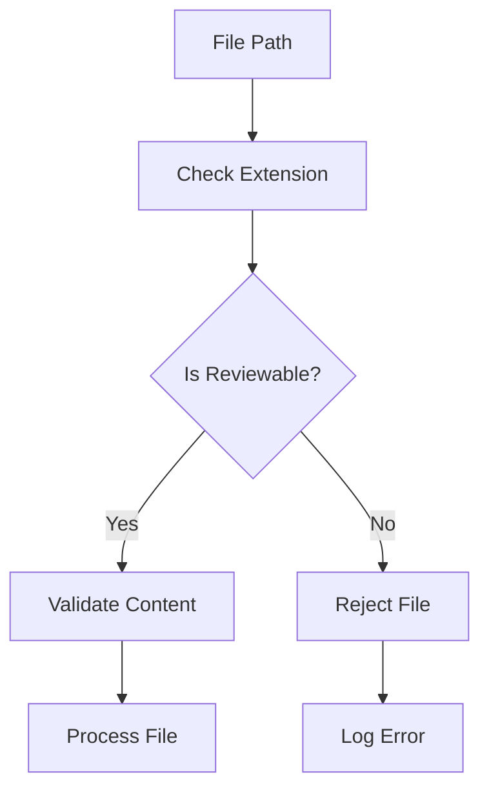

**Diagram sources**
- [src/utils/fileUtils.ts](file://src/utils/fileUtils.ts#L26-L36)

#### Data Integrity Checks
Each service layer implements specific validation logic:

| Service Layer | Validation Type | Error Handling Strategy |
|--------------|----------------|------------------------|
| Git Service | Repository existence, commit validity | Graceful degradation with fallbacks |
| AI Service | API key validation, request format | Retry mechanisms with exponential backoff |
| Review Manager | Review data consistency | Data sanitization and normalization |
| Large File Processor | Content size limits, compression ratios | Automatic compression or rejection |

### Error Recovery Mechanisms

The system implements multiple error recovery strategies:

#### Fallback Strategies
When primary methods fail, the system attempts alternative approaches:

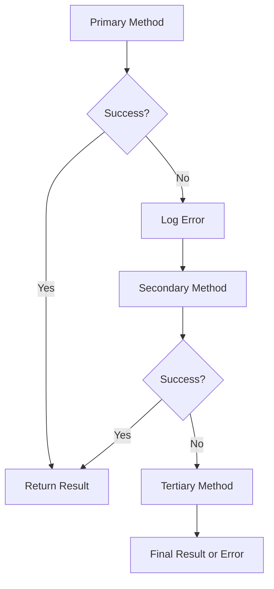

**Section sources**
- [src/utils/fileUtils.ts](file://src/utils/fileUtils.ts#L26-L36)
- [src/services/git/gitService.ts](file://src/services/git/gitService.ts#L367-L405)

## Common Data Exchange Issues

### Data Format Mismatches

The system addresses several common data format issues:

#### Encoding Problems
Different file types require specific encoding handling:

| File Type | Encoding Strategy | Common Issues |
|-----------|------------------|---------------|
| Text Files | UTF-8 with BOM detection | BOM presence causing parsing errors |
| Binary Files | Base64 encoding | Large size impacting performance |
| Mixed Content | Character set detection | Inconsistent encoding across files |

#### Content Structure Variations
The system handles various content structures:

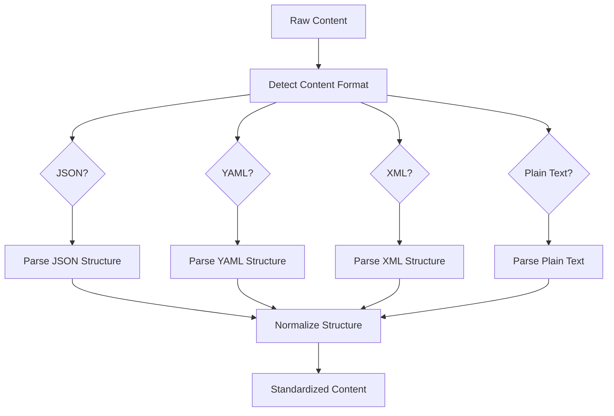

### Null Value Handling

The system implements robust null value handling strategies:

#### Optional Field Management
Many data fields are optional and require careful handling:

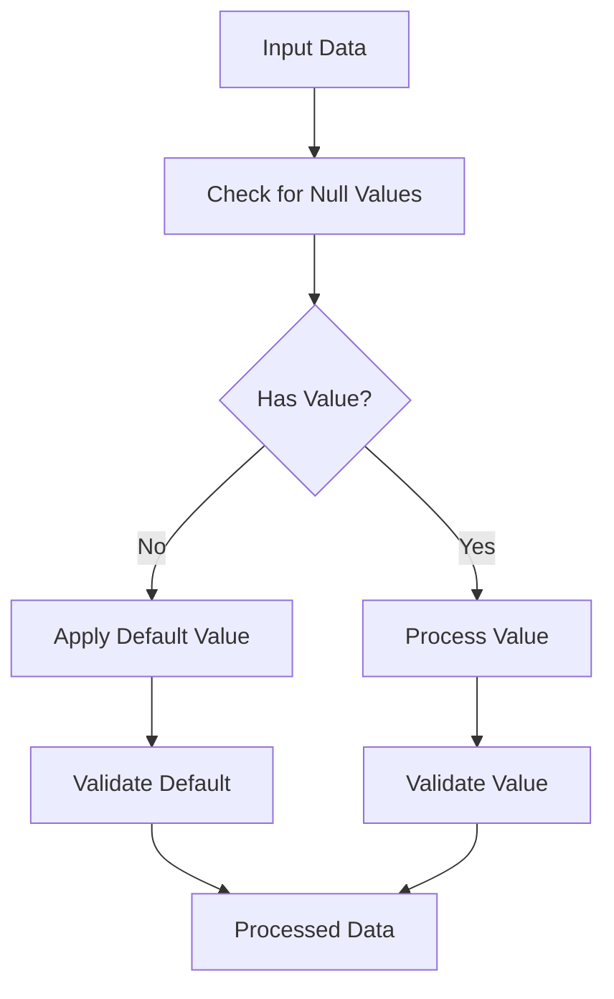

#### Missing Data Scenarios
The system gracefully handles missing data:

| Scenario | Handling Strategy | Impact |
|----------|------------------|---------|
| Missing Git Repository | Skip Git operations | Reduced functionality |
| Corrupted Commit Data | Use partial data | Incomplete analysis |
| Network Timeout | Retry with exponential backoff | Delayed processing |
| AI Service Unavailable | Use cached results | Stale but usable data |

### Performance Implications of Large Data Transfers

#### Bandwidth Optimization
The system implements several bandwidth optimization techniques:

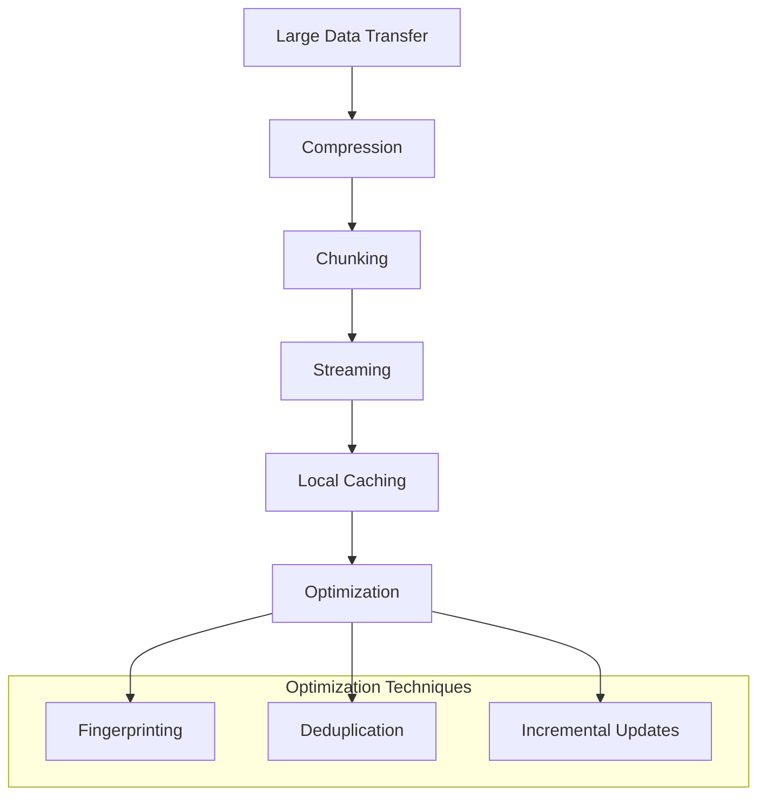

**Section sources**
- [src/core/compression/contentCompressor.ts](file://src/core/compression/contentCompressor.ts#L18-L231)
- [src/core/compression/compressionTypes.ts](file://src/core/compression/compressionTypes.ts#L1-L87)

## Best Practices

### Data Consistency Patterns

The system maintains data consistency through several established patterns:

#### Immutable Data Structures
Most data structures are treated as immutable to prevent unintended modifications:

```typescript
// Example pattern from the codebase
interface CodeReviewResult {
    readonly suggestions: readonly string[];
    readonly score?: number;
    readonly reviewMode?: ReviewMode;
}
```

#### Defensive Copying
Critical data undergoes defensive copying to prevent side effects:

```typescript
// Pattern used in service layers
const safeCopy = { ...originalObject };
const immutableArray = [...originalArray];
```

### Service Integration Guidelines

#### Interface Stability
Service interfaces maintain backward compatibility:

| Change Type | Compatibility Level | Implementation Strategy |
|-------------|-------------------|------------------------|
| New Fields | Backward Compatible | Optional with defaults |
| Removed Fields | Breaking Change | Deprecation period with warnings |
| Behavior Changes | Semantic Compatibility | Clear documentation |
| Performance Improvements | Transparent | Monitoring and testing |

#### Error Propagation
Errors are propagated consistently across service boundaries:

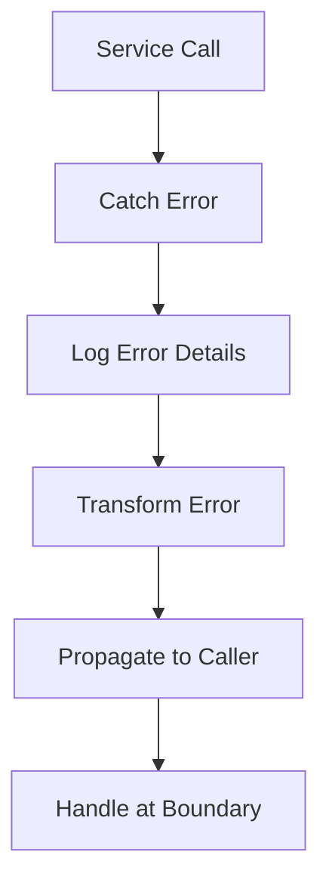

### Testing and Validation

#### Unit Testing Patterns
The system follows established testing patterns:

```typescript
// Example testing pattern
describe('GitService', () => {
    it('should handle missing repositories gracefully', async () => {
        const service = new GitService();
        await expect(service.getCommits()).rejects.toThrow();
    });
    
    it('should cache diff results for identical requests', async () => {
        const service = new GitService();
        const result1 = await service.getFileDiff(hash, path);
        const result2 = await service.getFileDiff(hash, path);
        expect(result1).toEqual(result2);
    });
});
```

**Section sources**
- [src/services/git/gitService.ts](file://src/services/git/gitService.ts#L110-L177)
- [src/services/ai/aiService.ts](file://src/services/ai/aiService.ts#L431-L552)

## Conclusion

The CodeKarmic data exchange patterns represent a sophisticated approach to managing complex data flows in a code review system. Through careful design of data models, intelligent caching mechanisms, and robust error handling, the system achieves both performance and reliability.

Key achievements of the data exchange architecture include:

- **Type Safety**: Comprehensive type definitions ensure data integrity across all service boundaries
- **Performance Optimization**: Multi-level caching and intelligent compression prevent performance bottlenecks
- **Resilience**: Multiple fallback strategies ensure system stability under adverse conditions
- **Scalability**: Modular design allows for easy extension and maintenance

The architecture successfully balances the competing demands of performance, reliability, and maintainability, providing a solid foundation for the CodeKarmic code review platform. Future enhancements can build upon these established patterns while maintaining the system's core strengths in data integrity and performance.