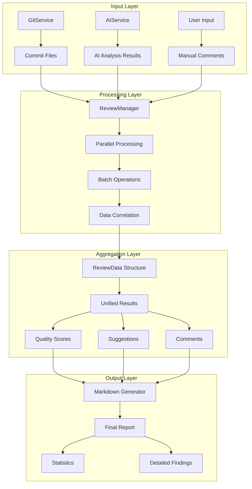
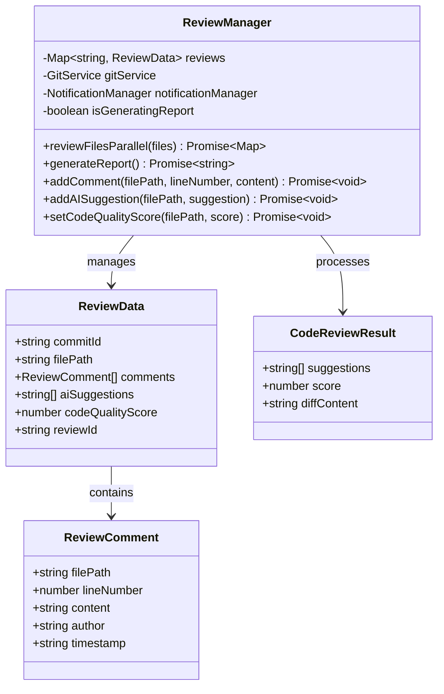
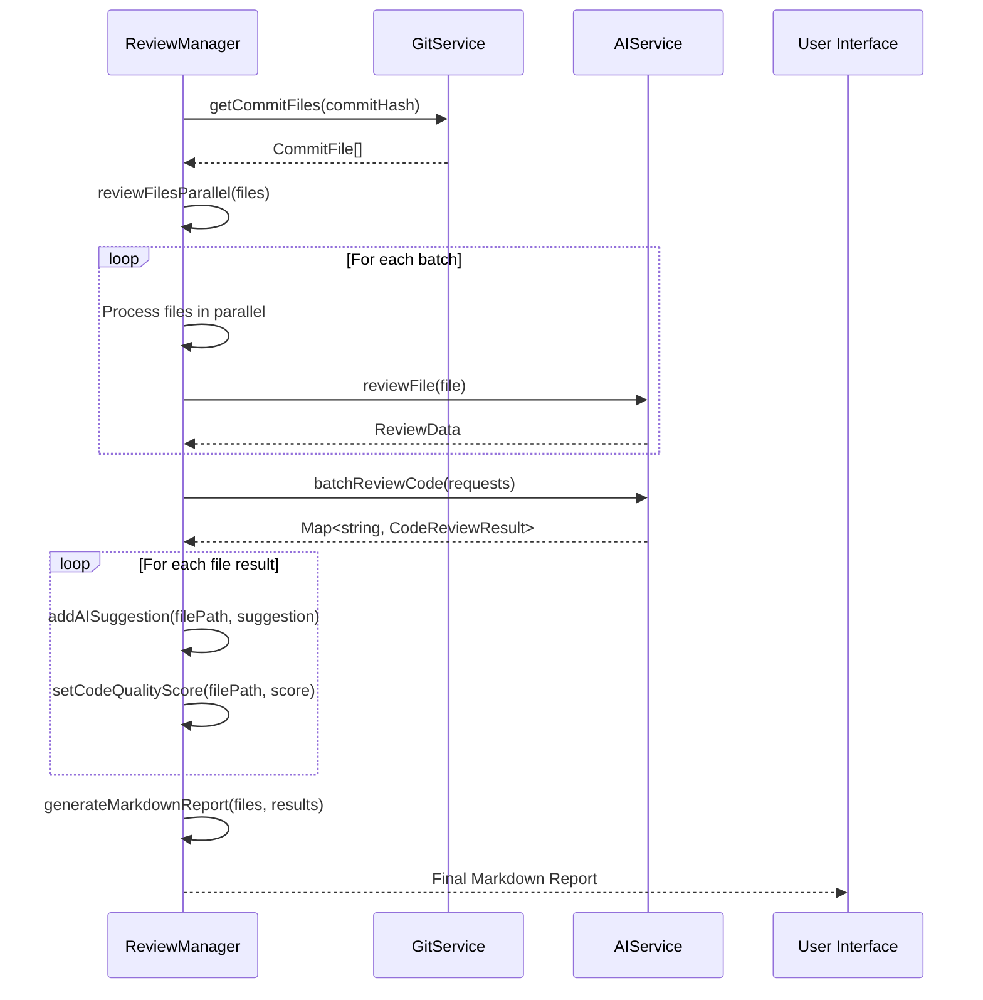
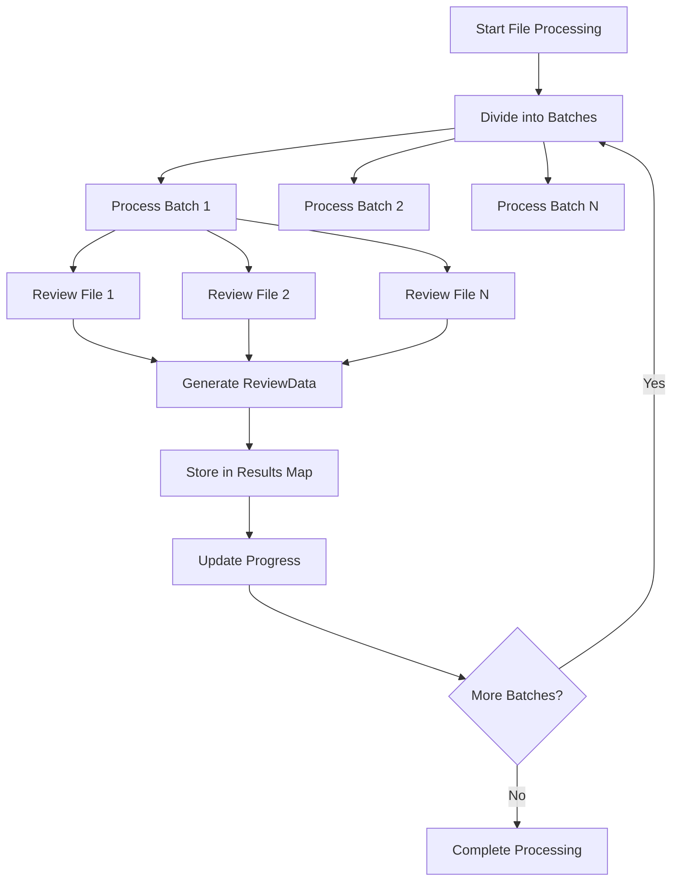
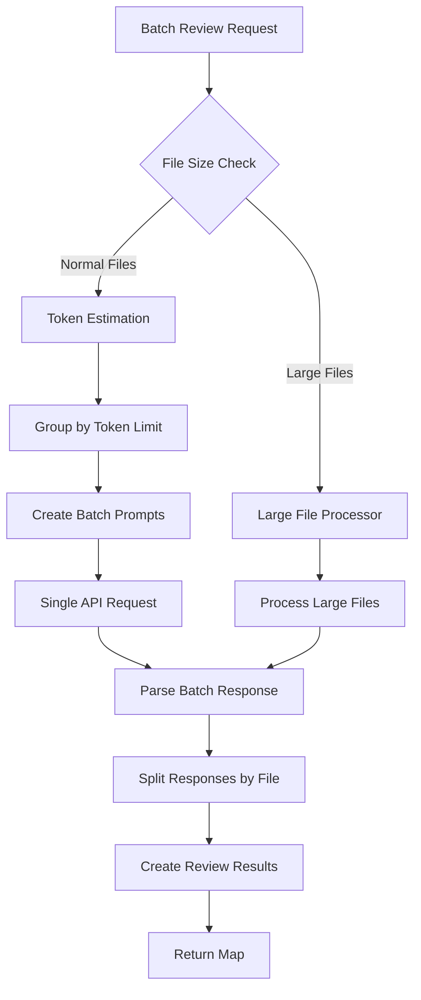
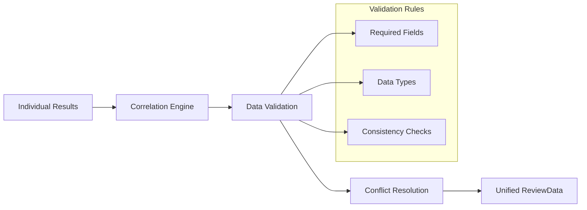
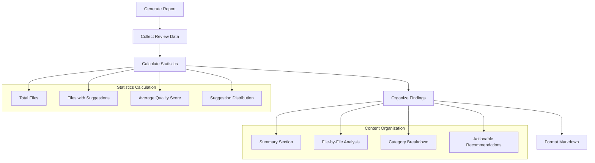
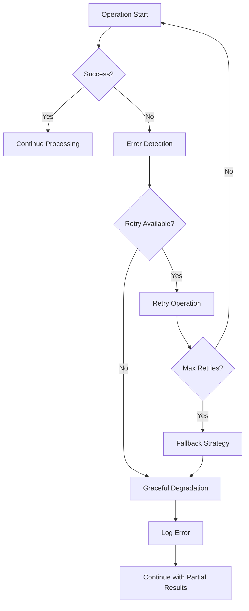
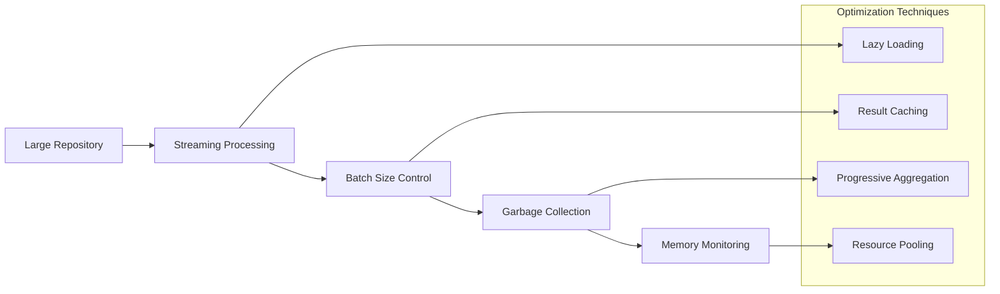

# Result Aggregation

<cite>
**Referenced Files in This Document**
- [reviewManager.ts](file://src/services/review/reviewManager.ts)
- [aiService.ts](file://src/services/ai/aiService.ts)
- [gitService.ts](file://src/services/git/gitService.ts)
- [reviewTypes.ts](file://src/core/review/reviewTypes.ts)
- [types.ts](file://src/models/types.ts)
- [fileUtils.ts](file://src/utils/fileUtils.ts)
- [suggestionGenerator.ts](file://src/core/review/suggestionGenerator.ts)
</cite>

## Table of Contents
1. [Introduction](#introduction)
2. [System Architecture Overview](#system-architecture-overview)
3. [ReviewManager Core Components](#reviewmanager-core-components)
4. [Data Flow Architecture](#data-flow-architecture)
5. [Result Collection Process](#result-collection-process)
6. [Aggregation and Transformation](#aggregation-and-transformation)
7. [Report Generation Pipeline](#report-generation-pipeline)
8. [Error Handling and Resilience](#error-handling-and-resilience)
9. [Performance Optimization](#performance-optimization)
10. [Common Issues and Solutions](#common-issues-and-solutions)
11. [Best Practices](#best-practices)

## Introduction

CodeKarmic's result aggregation system is a sophisticated pipeline that orchestrates the collection, correlation, and transformation of code review results from multiple sources into comprehensive reports. The system handles the complex task of merging individual file review results with AI analysis, user comments, and quality scores into a unified ReviewData structure, ultimately generating detailed Markdown reports with summary statistics and actionable insights.

The aggregation process involves multiple concurrent operations including parallel file processing, batch AI analysis, and real-time data correlation, all while maintaining data consistency and handling potential failures gracefully.

## System Architecture Overview

The result aggregation system follows a multi-layered architecture that separates concerns between data collection, processing, and presentation:

**Diagram sources**
- [reviewManager.ts](file://src/services/review/reviewManager.ts#L329-L478)
- [aiService.ts](file://src/services/ai/aiService.ts#L431-L552)
- [gitService.ts](file://src/services/git/gitService.ts#L110-L177)

## ReviewManager Core Components

The ReviewManager serves as the central orchestrator for result aggregation, managing the lifecycle of review data from collection to final report generation.

### Key Data Structures

The system utilizes several critical data structures for result aggregation:

**Diagram sources**
- [reviewManager.ts](file://src/services/review/reviewManager.ts#L19-L32)
- [reviewTypes.ts](file://src/core/review/reviewTypes.ts#L78-L125)

**Section sources**
- [reviewManager.ts](file://src/services/review/reviewManager.ts#L79-L110)
- [reviewTypes.ts](file://src/core/review/reviewTypes.ts#L19-L32)

## Data Flow Architecture

The result aggregation process follows a structured data flow that ensures proper correlation and transformation of review data:

**Diagram sources**
- [reviewManager.ts](file://src/services/review/reviewManager.ts#L329-L478)
- [aiService.ts](file://src/services/ai/aiService.ts#L431-L552)
- [gitService.ts](file://src/services/git/gitService.ts#L110-L177)

## Result Collection Process

### Parallel File Processing

The system employs sophisticated parallel processing to efficiently collect review results from multiple files:

**Diagram sources**
- [reviewManager.ts](file://src/services/review/reviewManager.ts#L329-L369)

The `reviewFilesParallel` method implements intelligent batching with configurable batch sizes and progress tracking:

**Section sources**
- [reviewManager.ts](file://src/services/review/reviewManager.ts#L329-L369)

### AI Analysis Integration

The AI analysis component provides batch processing capabilities for efficient handling of multiple files:

**Diagram sources**
- [aiService.ts](file://src/services/ai/aiService.ts#L431-L552)

**Section sources**
- [aiService.ts](file://src/services/ai/aiService.ts#L431-L552)

## Aggregation and Transformation

### Data Correlation Process

The system correlates review results with their respective CommitFile metadata through a sophisticated mapping mechanism:

| Data Source | Key Identifier | Transformation | Output Structure |
|-------------|----------------|----------------|------------------|
| GitService | `CommitFile.path` | Extract file metadata | `CommitFile[]` |
| AIService | `CodeReviewResult.filePath` | Merge with AI suggestions | `CodeReviewResult[]` |
| User Input | `ReviewComment.filePath` | Append manual comments | `ReviewComment[]` |
| Quality Scores | `filePath` | Associate with review data | `number` |

### Unified ReviewData Construction

The aggregation process transforms individual results into a unified ReviewData structure:

**Diagram sources**
- [reviewManager.ts](file://src/services/review/reviewManager.ts#L477-L550)

**Section sources**
- [reviewManager.ts](file://src/services/review/reviewManager.ts#L477-L550)

## Report Generation Pipeline

### Markdown Report Structure

The final report generation follows a structured approach to create comprehensive documentation:

**Diagram sources**
- [reviewManager.ts](file://src/services/review/reviewManager.ts#L787-L848)

### Summary Statistics Generation

The system automatically generates comprehensive summary statistics:

| Metric Category | Calculated Values | Purpose |
|-----------------|-------------------|---------|
| **File Analysis** | Total files, Reviewed files, Files with suggestions | Provide overview of scope |
| **Quality Metrics** | Average score, Score distribution, Improvement areas | Assess overall quality |
| **Suggestion Analysis** | Total suggestions, Category distribution, Severity breakdown | Prioritize improvements |
| **Performance Indicators** | Processing time, Memory usage, Success rate | Monitor system health |

**Section sources**
- [reviewManager.ts](file://src/services/review/reviewManager.ts#L787-L848)

## Error Handling and Resilience

### Failure Recovery Strategies

The system implements multiple layers of error handling to ensure robust operation:

**Diagram sources**
- [reviewManager.ts](file://src/services/review/reviewManager.ts#L649-L655)

### Concurrent Operation Safety

The system prevents race conditions and maintains data consistency during concurrent operations:

**Section sources**
- [reviewManager.ts](file://src/services/review/reviewManager.ts#L377-L381)
- [reviewManager.ts](file://src/services/review/reviewManager.ts#L649-L655)

## Performance Optimization

### Memory Management

The system employs several strategies to optimize memory usage during large-scale operations:

**Diagram sources**
- [reviewManager.ts](file://src/services/review/reviewManager.ts#L79-L80)
- [aiService.ts](file://src/services/ai/aiService.ts#L431-L447)

### Processing Efficiency

The system optimizes processing through intelligent batching and parallelization:

**Section sources**
- [reviewManager.ts](file://src/services/review/reviewManager.ts#L79-L80)
- [aiService.ts](file://src/services/ai/aiService.ts#L431-L447)

## Common Issues and Solutions

### Partial Failure Handling

When processing large repositories, partial failures are common. The system handles these scenarios through:

| Issue Type | Detection Method | Recovery Strategy | Prevention |
|------------|------------------|-------------------|------------|
| **Network Timeout** | Request timeout monitoring | Retry with exponential backoff | Connection pooling |
| **AI Service Unavailable** | Health check failures | Fallback to individual processing | Load balancing |
| **File Access Errors** | Permission and existence checks | Skip problematic files | Pre-validation |
| **Memory Exhaustion** | Memory usage monitoring | Reduce batch size | Streaming processing |

### Data Consistency Challenges

Maintaining data consistency across distributed operations requires careful coordination:

**Section sources**
- [reviewManager.ts](file://src/services/review/reviewManager.ts#L649-L655)
- [aiService.ts](file://src/services/ai/aiService.ts#L502-L552)

## Best Practices

### Development Guidelines

1. **Error Handling**: Always implement comprehensive error handling with fallback mechanisms
2. **Concurrency**: Use proper synchronization to prevent race conditions
3. **Memory Management**: Monitor and optimize memory usage for large repositories
4. **Progress Tracking**: Provide real-time feedback for long-running operations
5. **Data Validation**: Validate all inputs and outputs at each stage

### Operational Considerations

1. **Monitoring**: Implement comprehensive logging and metrics collection
2. **Testing**: Test with various repository sizes and configurations
3. **Scalability**: Design for horizontal scaling when processing multiple repositories
4. **User Experience**: Provide clear progress indicators and error messages
5. **Documentation**: Maintain up-to-date documentation for all aggregation processes

The result aggregation system in CodeKarmic demonstrates sophisticated engineering principles applied to code review automation, combining parallel processing, intelligent error handling, and comprehensive reporting in a robust, scalable solution.