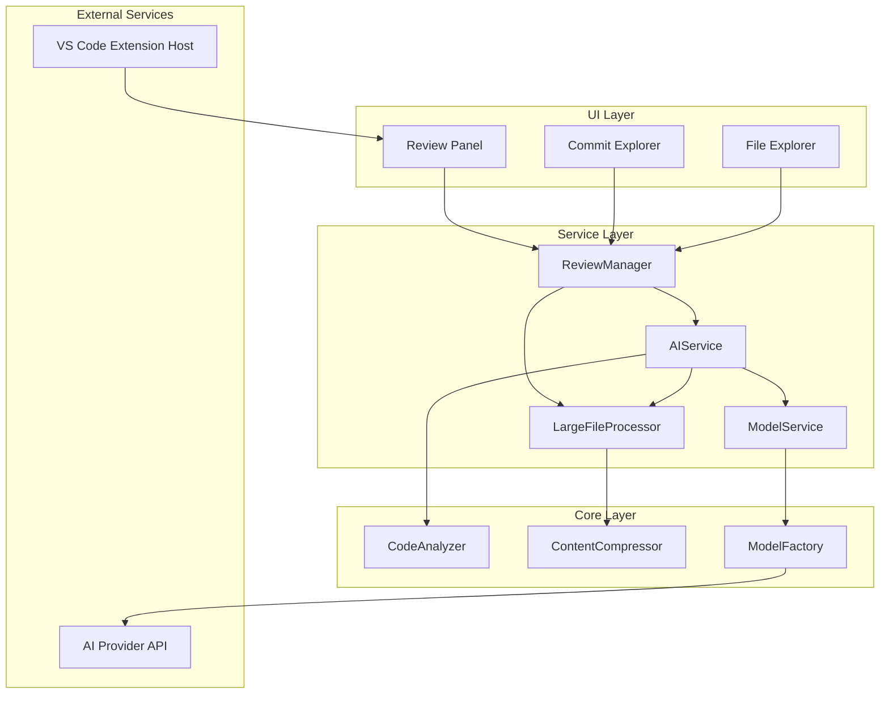
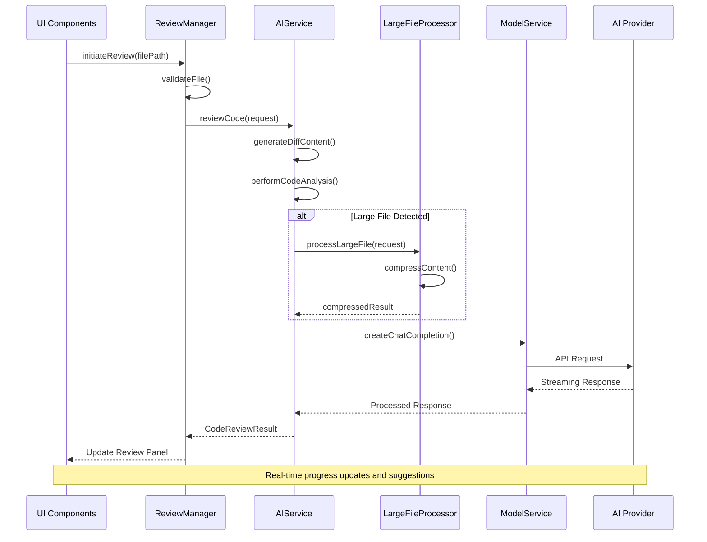
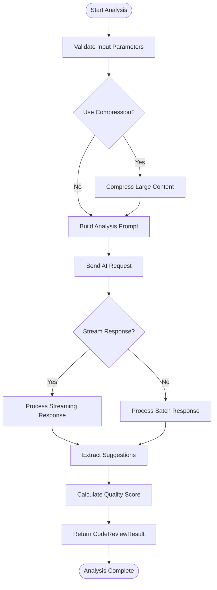
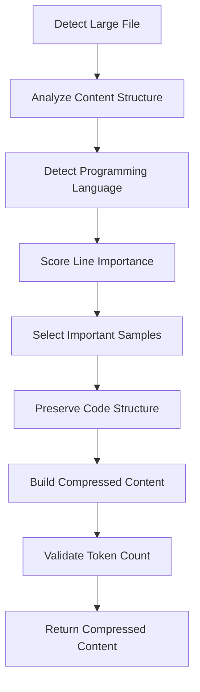
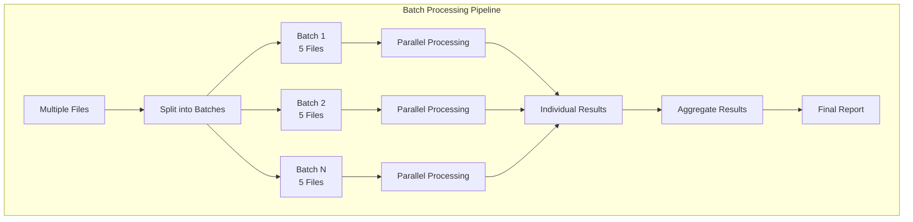
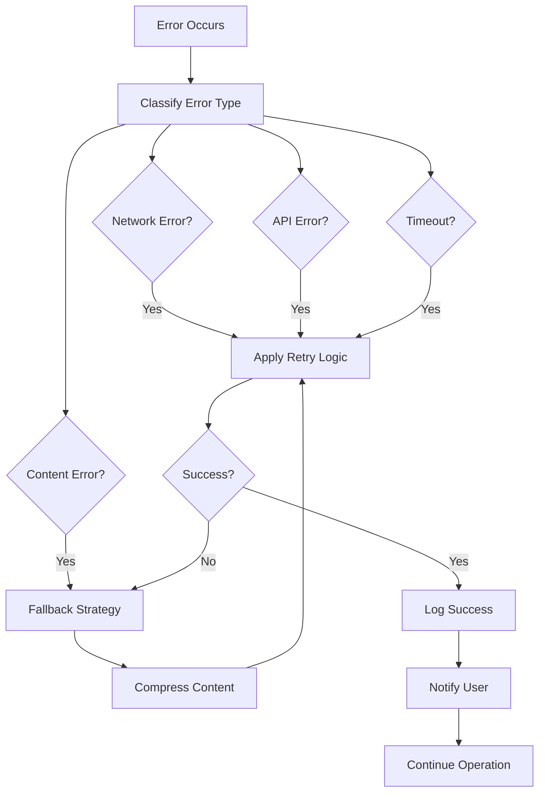

# Review Data Flow

<cite>
**Referenced Files in This Document**
- [reviewManager.ts](file://src/services/review/reviewManager.ts)
- [aiService.ts](file://src/services/ai/aiService.ts)
- [codeAnalyzer.ts](file://src/core/review/codeAnalyzer.ts)
- [modelFactory.ts](file://src/models/modelFactory.ts)
- [largeFileProcessor.ts](file://src/core/compression/largeFileProcessor.ts)
- [reviewTypes.ts](file://src/core/review/reviewTypes.ts)
- [modelInterface.ts](file://src/models/modelInterface.ts)
- [reviewPanel.ts](file://src/ui/views/reviewPanel.ts)
- [retryUtils.ts](file://src/utils/retryUtils.ts)
- [contentCompressor.ts](file://src/core/compression/contentCompressor.ts)
- [notificationManager.ts](file://src/services/notification/notificationManager.ts)
</cite>

## Table of Contents
1. [Introduction](#introduction)
2. [System Architecture Overview](#system-architecture-overview)
3. [Core Components](#core-components)
4. [Review Data Flow Process](#review-data-flow-process)
5. [Code Review Request Processing](#code-review-request-processing)
6. [AI Analysis Pipeline](#ai-analysis-pipeline)
7. [Large File Handling](#large-file-handling)
8. [Batch Processing and Parallel Execution](#batch-processing-and-parallel-execution)
9. [Error Handling and Recovery](#error-handling-and-recovery)
10. [Performance Optimization](#performance-optimization)
11. [Common Issues and Solutions](#common-issues-and-solutions)
12. [Conclusion](#conclusion)

## Introduction

CodeKarmic implements a sophisticated code review system that coordinates between multiple components to provide comprehensive AI-powered code analysis. The review data flow encompasses the entire journey from initiating code review requests through UI components to generating detailed reports with quality scores and actionable suggestions.

The system follows a layered architecture where the ReviewManager acts as the central coordinator, delegating specific tasks to specialized services like AIService for AI-powered analysis, LargeFileProcessor for handling oversized files, and ModelFactory for managing AI model interactions.

## System Architecture Overview

The review data flow in CodeKarmic follows a coordinated multi-layered architecture:

**Diagram sources**
- [reviewManager.ts](file://src/services/review/reviewManager.ts#L80-L120)
- [aiService.ts](file://src/services/ai/aiService.ts#L40-L80)
- [modelFactory.ts](file://src/models/modelFactory.ts#L19-L50)

## Core Components

### ReviewManager - Central Coordinator

The ReviewManager serves as the primary orchestrator for the entire review process, managing review sessions, coordinating between different services, and maintaining review state.

**Key Responsibilities:**
- Coordinate review requests from UI components
- Manage review sessions and state persistence
- Delegate tasks to specialized services
- Handle batch processing of multiple files
- Manage progress reporting and user feedback

### AIService - AI-Powered Analysis Engine

The AIService provides the core AI analysis capabilities, handling code review requests and generating intelligent suggestions and quality assessments.

**Key Features:**
- Single-file and batch code analysis
- Streaming response support for real-time feedback
- Intelligent content compression for large files
- Rate limiting and timeout handling
- Error recovery and retry mechanisms

### LargeFileProcessor - Content Compression Specialist

Handles files that exceed AI model token limits through intelligent compression techniques.

**Compression Strategies:**
- Semantic content preservation
- Language-aware extraction
- Header/footer retention
- Strategic sampling of important sections

**Section sources**
- [reviewManager.ts](file://src/services/review/reviewManager.ts#L79-L120)
- [aiService.ts](file://src/services/ai/aiService.ts#L40-L120)
- [largeFileProcessor.ts](file://src/core/compression/largeFileProcessor.ts#L23-L80)

## Review Data Flow Process

The review data flow follows a structured pipeline from initiation to completion:

**Diagram sources**
- [reviewManager.ts](file://src/services/review/reviewManager.ts#L229-L260)
- [aiService.ts](file://src/services/ai/aiService.ts#L75-L120)
- [largeFileProcessor.ts](file://src/core/compression/largeFileProcessor.ts#L55-L80)

## Code Review Request Processing

### CodeReviewRequest Object Structure

The system uses a standardized CodeReviewRequest object to encapsulate all necessary information for code analysis:

| Field | Type | Description | Usage |
|-------|------|-------------|-------|
| filePath | string | Absolute file path | Identifies target file |
| currentContent | string | Current file content | Primary analysis target |
| previousContent | string | Previous version content | For diff analysis |
| useCompression | boolean | Enable content compression | For large files |
| language | string | Programming language | Optimizes analysis |
| includeDiffAnalysis | boolean | Enable difference analysis | Git commit mode |
| useStreamingOutput | boolean | Enable streaming responses | Real-time feedback |

### Request Validation and Preparation

The ReviewManager performs comprehensive validation before processing:

1. **File Type Validation**: Ensures the file is reviewable using `isReviewableFile()` checks
2. **Content Verification**: Validates file existence and accessibility
3. **Review Mode Detection**: Determines whether processing is standalone or Git-based
4. **Resource Allocation**: Prepares necessary resources for analysis

**Section sources**
- [reviewManager.ts](file://src/services/review/reviewManager.ts#L229-L260)
- [reviewTypes.ts](file://src/core/review/reviewTypes.ts#L24-L75)

## AI Analysis Pipeline

### performCodeAnalysis Function

The core analysis function orchestrates the AI review process:

**Diagram sources**
- [aiService.ts](file://src/services/ai/aiService.ts#L260-L410)

### Analysis Options and Configuration

The system supports various analysis configurations:

| Option | Purpose | Impact |
|--------|---------|--------|
| includeDiffAnalysis | Compare with previous version | Enhanced context awareness |
| useCompression | Handle large files | Prevents token limits |
| maxTokens | Control response length | Balances quality vs. cost |
| temperature | Adjust creativity level | Controls suggestion variety |

### Suggestion Extraction and Scoring

The AI analysis pipeline extracts actionable suggestions and calculates quality scores:

1. **Natural Language Processing**: Parses AI responses for structured suggestions
2. **Scoring Algorithm**: Evaluates code quality based on suggestion density and content
3. **Format Standardization**: Normalizes suggestion format for UI presentation

**Section sources**
- [aiService.ts](file://src/services/ai/aiService.ts#L260-L410)
- [codeAnalyzer.ts](file://src/core/review/codeAnalyzer.ts#L167-L230)

## Large File Handling

### Intelligent Compression Strategy

For files exceeding token limits, the LargeFileProcessor employs sophisticated compression:

**Diagram sources**
- [largeFileProcessor.ts](file://src/core/compression/largeFileProcessor.ts#L55-L80)
- [contentCompressor.ts](file://src/core/compression/contentCompressor.ts#L18-L100)

### Compression Algorithms

The content compressor uses multiple strategies:

1. **Header/Footer Preservation**: Maintains important metadata
2. **Intelligent Sampling**: Prioritizes code structure and logic
3. **Language-Aware Processing**: Adapts strategies based on programming language
4. **Statistical Analysis**: Tracks compression effectiveness

### Threshold Configuration

| Parameter | Default Value | Purpose |
|-----------|---------------|---------|
| sizeThreshold | 100,000 chars | Trigger compression |
| sampleRate | 0.3 | Percentage of content to preserve |
| headerLines | 10 | Lines to preserve from top |
| footerLines | 10 | Lines to preserve from bottom |

**Section sources**
- [largeFileProcessor.ts](file://src/core/compression/largeFileProcessor.ts#L23-L80)
- [contentCompressor.ts](file://src/core/compression/contentCompressor.ts#L18-L230)

## Batch Processing and Parallel Execution

### Parallel File Processing

The ReviewManager implements efficient batch processing for multiple files:

**Diagram sources**
- [reviewManager.ts](file://src/services/review/reviewManager.ts#L329-L370)

### Batch Size Optimization

The system uses configurable batch sizes for optimal performance:

| Scenario | Recommended Batch Size | Rationale |
|----------|----------------------|-----------|
| Small files (< 10KB) | 10-20 files | Minimal overhead |
| Medium files (10-100KB) | 5-10 files | Balanced performance |
| Large files (> 100KB) | 2-5 files | Memory constraints |
| Mixed content | 3-5 files | Variable processing time |

### Streaming Response Management

For batch processing, the system supports streaming responses:

1. **Progress Tracking**: Real-time progress updates for each file
2. **Resource Management**: Efficient memory usage during processing
3. **Error Isolation**: Individual file failures don't affect others
4. **User Feedback**: Continuous status updates during long operations

**Section sources**
- [reviewManager.ts](file://src/services/review/reviewManager.ts#L329-L370)
- [aiService.ts](file://src/services/ai/aiService.ts#L431-L552)

## Error Handling and Recovery

### Comprehensive Error Management

The system implements multi-layered error handling:

**Diagram sources**
- [aiService.ts](file://src/services/ai/aiService.ts#L388-L410)
- [retryUtils.ts](file://src/utils/retryUtils.ts#L33-L70)

### Error Classification and Recovery

| Error Type | Recovery Strategy | User Impact |
|------------|------------------|-------------|
| Network Timeout | Exponential backoff retry | Brief delay |
| API Rate Limit | Queue and retry later | Automatic handling |
| Content Too Large | Automatic compression | Transparent processing |
| Invalid API Key | Configuration prompt | Requires user action |
| Unsupported File Type | Skip with warning | Selective processing |

### Retry Mechanisms

The system implements sophisticated retry logic:

1. **Exponential Backoff**: Gradually increasing delays between retries
2. **Circuit Breaker**: Prevents cascading failures
3. **Error Pattern Matching**: Different strategies for different error types
4. **Maximum Retry Limits**: Prevents infinite loops

**Section sources**
- [retryUtils.ts](file://src/utils/retryUtils.ts#L33-L117)
- [aiService.ts](file://src/services/ai/aiService.ts#L388-L410)

## Performance Optimization

### Token Management and Cost Control

The system optimizes AI model usage through several strategies:

| Optimization | Implementation | Benefit |
|--------------|----------------|---------|
| Content Compression | Intelligent sampling | Reduces token usage by 60-80% |
| Batch Processing | Parallel requests | Improves throughput by 3-5x |
| Caching | Diff content caching | Eliminates redundant processing |
| Streaming | Real-time responses | Better user experience |

### Memory Management

Efficient memory usage is achieved through:

1. **Streaming Processing**: Processes content without loading entire files
2. **Garbage Collection**: Explicit cleanup of temporary data
3. **Resource Pooling**: Reuses expensive objects
4. **Lazy Loading**: Loads components only when needed

### Performance Monitoring

The system tracks key performance metrics:

- **Processing Time**: Per-file and per-batch timing
- **Token Usage**: Cost tracking and optimization
- **Success Rates**: Error and retry monitoring
- **User Experience**: Response time and throughput

**Section sources**
- [aiService.ts](file://src/services/ai/aiService.ts#L260-L410)
- [largeFileProcessor.ts](file://src/core/compression/largeFileProcessor.ts#L55-L80)

## Common Issues and Solutions

### API Rate Limiting

**Problem**: AI provider imposes rate limits on API requests.

**Solution**: 
- Implement exponential backoff retry logic
- Use request queuing for batch operations
- Monitor API usage and provide user feedback
- Cache frequently accessed content

### Timeout Handling

**Problem**: Long-running analysis causes timeouts.

**Solution**:
- Configure appropriate timeout values (30-180 seconds)
- Implement streaming responses for real-time updates
- Use progress indicators to manage user expectations
- Provide cancellation options for long operations

### Large File Processing

**Problem**: Files exceed AI model token limits.

**Solution**:
- Automatic compression using intelligent sampling
- Language-aware content extraction
- Progressive enhancement for critical sections
- Fallback to simplified analysis when necessary

### Memory Constraints

**Problem**: Processing large codebases consumes excessive memory.

**Solution**:
- Streaming processing for large files
- Batch processing with controlled concurrency
- Garbage collection optimization
- Resource pooling for expensive operations

### Error Recovery

**Problem**: System failures during review process.

**Solution**:
- Comprehensive error logging and monitoring
- Graceful degradation for partial failures
- User-friendly error messages with suggested actions
- Automatic recovery mechanisms where possible

**Section sources**
- [aiService.ts](file://src/services/ai/aiService.ts#L388-L410)
- [retryUtils.ts](file://src/utils/retryUtils.ts#L33-L117)
- [largeFileProcessor.ts](file://src/core/compression/largeFileProcessor.ts#L55-L80)

## Conclusion

CodeKarmic's review data flow represents a sophisticated approach to automated code analysis, combining multiple specialized components to deliver comprehensive AI-powered code review capabilities. The system's strength lies in its modular architecture, robust error handling, and performance optimizations that enable efficient processing of both small and large codebases.

Key architectural benefits include:

- **Scalability**: Parallel processing and batch optimization handle large codebases efficiently
- **Reliability**: Comprehensive error handling and retry mechanisms ensure robust operation
- **Performance**: Intelligent compression and streaming responses optimize resource usage
- **Flexibility**: Modular design allows easy extension and customization

The review data flow demonstrates how modern development tools can leverage AI technologies while maintaining usability, reliability, and performance standards essential for professional development environments.