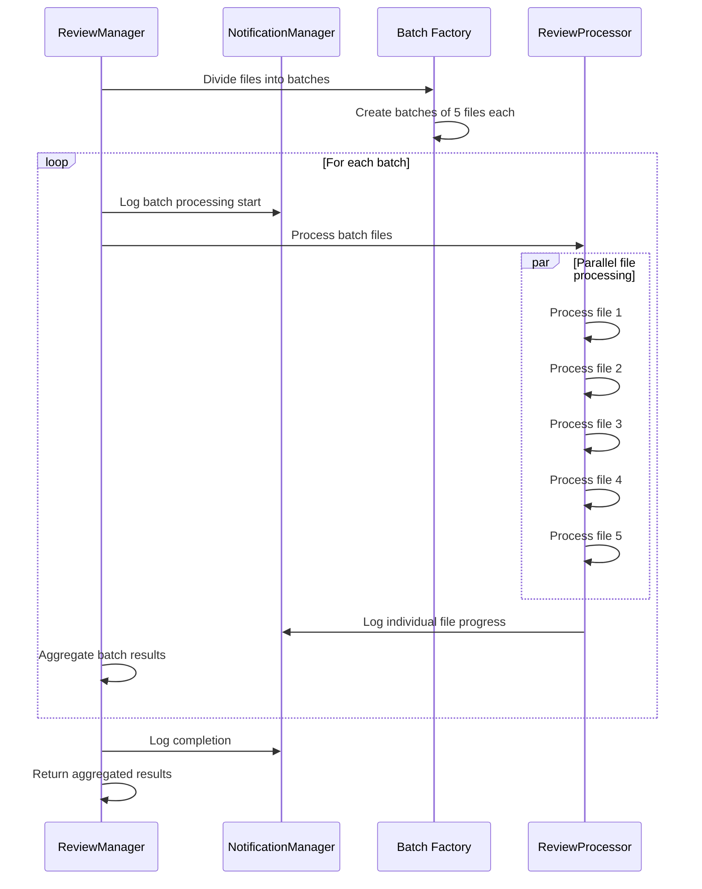

# Batch Processing

<cite>
**Referenced Files in This Document**
- [reviewManager.ts](file://src/services/review/reviewManager.ts)
- [aiService.ts](file://src/services/ai/aiService.ts)
- [reviewTypes.ts](file://src/core/review/reviewTypes.ts)
- [largeFileProcessor.ts](file://src/core/compression/largeFileProcessor.ts)
- [compressionTypes.ts](file://src/core/compression/compressionTypes.ts)
- [logger.ts](file://src/utils/logger.ts)
</cite>

## Table of Contents
1. [Introduction](#introduction)
2. [Architecture Overview](#architecture-overview)
3. [Batch Processing Components](#batch-processing-components)
4. [ReviewFilesParallel Method](#reviewfilesparallel-method)
5. [AI Service Batch Processing](#ai-service-batch-processing)
6. [Progress Reporting System](#progress-reporting-system)
7. [Error Handling and Fallback Mechanisms](#error-handling-and-fallback-mechanisms)
8. [Memory Management](#memory-management)
9. [Performance Optimization](#performance-optimization)
10. [Common Issues and Solutions](#common-issues-and-solutions)
11. [Best Practices](#best-practices)

## Introduction

CodeKarmic implements a sophisticated batch processing system for code review operations that efficiently handles large numbers of files through intelligent batching, parallel processing, and progressive reporting. The system is designed to optimize performance while maintaining accuracy and providing comprehensive feedback throughout the review process.

The batch processing functionality centers around dividing commit files into manageable chunks, processing them sequentially with progress tracking, and managing the interaction between the ReviewManager and AIService for AI-powered code analysis.

## Architecture Overview

The batch processing system follows a layered architecture with clear separation of concerns:


**Diagram sources**
- [reviewManager.ts](file://src/services/review/reviewManager.ts#L80-L81)
- [aiService.ts](file://src/services/ai/aiService.ts#L431-L552)
- [largeFileProcessor.ts](file://src/core/compression/largeFileProcessor.ts#L160-L224)

## Batch Processing Components

### Core Batch Size Configuration

The system uses a fixed batch size of 5 files per batch, balancing processing efficiency with resource management:

```typescript
private static readonly BATCH_SIZE = 5;
```

This constant defines the maximum number of files processed concurrently in each batch operation, ensuring optimal memory usage while maintaining processing speed.

### File Categorization System

The batch processing system categorizes files into different processing groups:

1. **Normal Files**: Standard files processed through conventional AI analysis
2. **Large Files**: Files exceeding size thresholds requiring compression and specialized processing
3. **Batch Groups**: Files grouped based on token estimation for optimal API usage

**Section sources**
- [reviewManager.ts](file://src/services/review/reviewManager.ts#L80-L81)
- [aiService.ts](file://src/services/ai/aiService.ts#L439-L455)

## ReviewFilesParallel Method

The `reviewFilesParallel` method serves as the primary orchestrator for batch file processing in the review workflow:



**Diagram sources**
- [reviewManager.ts](file://src/services/review/reviewManager.ts#L329-L369)

### Batch Division Algorithm

The method implements a sliding window approach for dividing files into batches:

```typescript
// Divide files into batches
for (let i = 0; i < files.length; i += ReviewManager.BATCH_SIZE) {
    batches.push(files.slice(i, i + ReviewManager.BATCH_SIZE));
}
```

This ensures optimal distribution of files across batches while maintaining processing order.

### Progress Tracking Implementation

Each batch processing iteration updates progress indicators:

```typescript
const currentBatch = Math.floor(processedFiles / ReviewManager.BATCH_SIZE) + 1;
const totalBatches = Math.ceil(totalFiles / ReviewManager.BATCH_SIZE);
notificationManager.log(OUTPUT.PROCESS.PROC_BATCH(currentBatch, totalBatches), 'info', false);
```

**Section sources**
- [reviewManager.ts](file://src/services/review/reviewManager.ts#L338-L341)
- [reviewManager.ts](file://src/services/review/reviewManager.ts#L347-L351)

## AI Service Batch Processing

The AIService implements sophisticated batch processing capabilities with intelligent token management and fallback mechanisms:


**Diagram sources**
- [aiService.ts](file://src/services/ai/aiService.ts#L431-L552)

### Token-Based Batch Sizing

The system uses token estimation for optimal batch sizing:

```typescript
const MAX_BATCH_TOKENS = 8000;
const TOKENS_PER_CHAR = 0.25;

// Estimate tokens for each file
const estimatedTokens = fileSize * TOKENS_PER_CHAR;
```

This approach ensures that batch requests remain within API token limits while maximizing throughput.

### Large File Processing

For files exceeding size thresholds, the system employs specialized compression and processing:

```typescript
// Large file detection
if (request.useCompression || request.currentContent.length > 100000) {
    largeFiles.push(request);
}
```

**Section sources**
- [aiService.ts](file://src/services/ai/aiService.ts#L443-L455)
- [compressionTypes.ts](file://src/core/compression/compressionTypes.ts#L85-L86)

## Progress Reporting System

The progress reporting system provides comprehensive feedback throughout the batch processing workflow:

### Multi-Level Progress Tracking

1. **Batch Progress**: Current batch number and total batches
2. **File Progress**: Current file number and total files
3. **AI Analysis Progress**: Processing status for AI operations
4. **Visual Progress Indicators**: HTML-based progress bars for web views

### Progress Calculation Logic

```typescript
// Batch progress calculation
const currentBatch = Math.floor(processedFiles / ReviewManager.BATCH_SIZE) + 1;
const totalBatches = Math.ceil(totalFiles / ReviewManager.BATCH_SIZE);

// File progress calculation
const percentage = (processedAIFiles / totalFiles) * 100;
const estimatedTimeRemaining = (elapsedTime / processedAIFiles) * (totalFiles - processedAIFiles);
```

### Visual Progress Updates

The system maintains real-time visual progress updates through WebView integration:

```typescript
// Update WebView progress
if (reportWebView) {
    reportWebView.webview.html = this.getReportProgressHtml(processedAIFiles, totalFiles);
}
```

**Section sources**
- [reviewManager.ts](file://src/services/review/reviewManager.ts#L347-L351)
- [reviewManager.ts](file://src/services/review/reviewManager.ts#L515-L519)
- [reviewManager.ts](file://src/services/review/reviewManager.ts#L495-L497)

## Error Handling and Fallback Mechanisms

The batch processing system implements robust error handling with automatic fallback mechanisms:

### Batch Failure Recovery

When batch operations fail, the system automatically falls back to individual file processing:


**Diagram sources**
- [reviewManager.ts](file://src/services/review/reviewManager.ts#L567-L646)

### Error Recovery Strategies

1. **Partial Failure Handling**: Individual file failures don't halt the entire process
2. **Retry Logic**: Automatic retry for transient failures
3. **Graceful Degradation**: Reduced functionality when full batch processing fails
4. **Error Aggregation**: Comprehensive error reporting for debugging

### Large File Error Handling

The LargeFileProcessor includes specialized error handling for compressed content:

```typescript
try {
    const response = await this.makeSpecificApiRequest(prompt);
    return this.processResponse(response);
} catch (error) {
    this.logger.error('大文件处理错误:', error);
    return {
        suggestions: [`处理大文件时出错: ${error}`],
        score: 0
    };
}
```

**Section sources**
- [reviewManager.ts](file://src/services/review/reviewManager.ts#L567-L568)
- [largeFileProcessor.ts](file://src/core/compression/largeFileProcessor.ts#L71-L80)

## Memory Management

The batch processing system implements several memory management strategies to handle large-scale operations efficiently:

### Streaming Processing

For large files and batch operations, the system uses streaming approaches:

```typescript
// Enable streaming for large batches
const requestParams = {
    messages,
    temperature: 0.1,
    max_tokens: 8192,
    stream: useStreaming // Enable stream processing
};
```

### Memory-Efficient Batch Processing

The LargeFileProcessor implements memory-efficient batch creation:

```typescript
// Dynamic batch sizing based on token limits
if (currentBatchSize + estimatedTokens > MAX_BATCH_TOKENS) {
    currentBatchIndex++;
    batches[currentBatchIndex] = [];
    currentBatchSize = 0;
}
```

### Garbage Collection Optimization

The system minimizes memory footprint through:

1. **Progressive Result Aggregation**: Results are collected progressively rather than stored in memory
2. **Temporary Object Cleanup**: Temporary objects are cleaned up after processing
3. **Lazy Loading**: Resources are loaded only when needed

**Section sources**
- [aiService.ts](file://src/services/ai/aiService.ts#L758-L762)
- [largeFileProcessor.ts](file://src/core/compression/largeFileProcessor.ts#L182-L185)

## Performance Optimization

### Batch Size Tuning

The system provides configurable batch sizes for different scenarios:

```typescript
// Default batch size for standard processing
private static readonly BATCH_SIZE = 5;

// Token-based batch sizing for AI processing
const MAX_BATCH_TOKENS = 8000;
const TOKENS_PER_CHAR = 0.25;
```

### Concurrent Processing Limits

The system balances concurrency with resource management:

1. **Fixed Batch Size**: Prevents excessive concurrent operations
2. **Sequential Batch Processing**: Ensures orderly progress tracking
3. **Resource Monitoring**: Tracks memory and CPU usage during processing

### Caching Strategies

Multiple caching layers improve performance:

1. **Diff Content Caching**: Reuses generated diff content
2. **Large File Caching**: Caches processed large files
3. **API Response Caching**: Stores AI analysis results

**Section sources**
- [reviewManager.ts](file://src/services/review/reviewManager.ts#L80-L81)
- [compressionTypes.ts](file://src/core/compression/compressionTypes.ts#L85-L86)

## Common Issues and Solutions

### Partial Failures

**Issue**: Some files fail during batch processing while others succeed.

**Solution**: The system implements partial failure recovery by processing failed files individually:

```typescript
// Individual fallback for failed files
const aiPromises = files.map(async file => {
    try {
        const result = await aiService.reviewCode({
            filePath: file.path,
            currentContent: file.content,
            previousContent: file.previousContent
        });
        return result;
    } catch (error) {
        // Handle individual file failure gracefully
        return null;
    }
});
```

### Progress Reporting Accuracy

**Issue**: Progress indicators may not accurately reflect processing state.

**Solution**: The system uses atomic progress updates and maintains separate counters for different processing stages:

```typescript
// Atomic progress updates
processedAIFiles++;
const percentage = (processedAIFiles / totalFiles) * 100;
```

### Memory Issues During Large Batch Operations

**Issue**: Out-of-memory errors when processing large numbers of files.

**Solution**: The system implements several mitigation strategies:

1. **Dynamic Batch Sizing**: Adjusts batch size based on available memory
2. **Streaming Processing**: Processes data in streams rather than loading everything into memory
3. **Progressive Cleanup**: Cleans up intermediate results regularly

### API Rate Limiting

**Issue**: AI API rate limits during batch processing.

**Solution**: The system implements exponential backoff and retry logic:

```typescript
// Enhanced error handling with retry
if (errorMessage.includes('timeout') || errorMessage.includes('rate limit')) {
    notificationManager.log(`分析请求超时或达到速率限制，请稍后再试`, 'warning', true);
}
```

**Section sources**
- [reviewManager.ts](file://src/services/review/reviewManager.ts#L569-L607)
- [reviewManager.ts](file://src/services/review/reviewManager.ts#L355-L356)

## Best Practices

### Batch Size Optimization

1. **Default Batch Size**: Use 5 files per batch for optimal balance
2. **Token-Based Sizing**: Adjust batch size based on content length and token limits
3. **Monitor Performance**: Track processing time and adjust batch size accordingly

### Error Handling Guidelines

1. **Implement Fallbacks**: Always provide individual processing fallbacks
2. **Log Comprehensive Errors**: Include detailed error information for debugging
3. **Graceful Degradation**: Maintain functionality even when batch processing fails

### Progress Reporting Best Practices

1. **Multi-Level Updates**: Provide progress at batch, file, and operation levels
2. **Real-Time Updates**: Update progress indicators frequently during long operations
3. **Visual Feedback**: Use HTML progress bars for web-based interfaces

### Memory Management

1. **Stream Processing**: Use streaming for large datasets
2. **Regular Cleanup**: Clean up temporary objects and results
3. **Monitor Resource Usage**: Track memory consumption during processing

### Testing and Validation

1. **Test Edge Cases**: Validate behavior with empty batches, single files, and large files
2. **Error Simulation**: Test error handling with simulated failures
3. **Performance Testing**: Validate performance with various batch sizes and file counts

The batch processing system in CodeKarmic demonstrates sophisticated engineering principles applied to code review automation, providing a robust foundation for scalable code analysis operations.