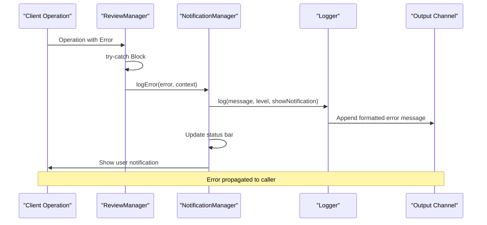
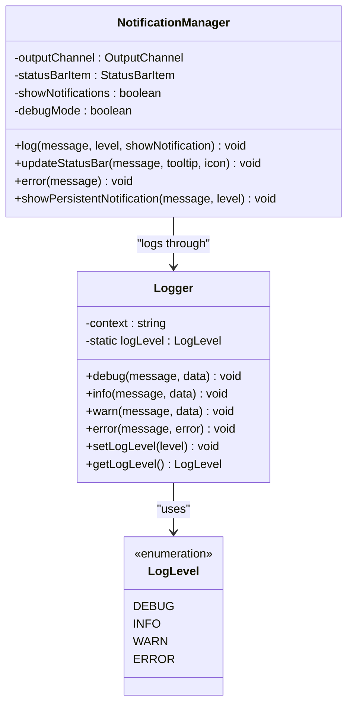
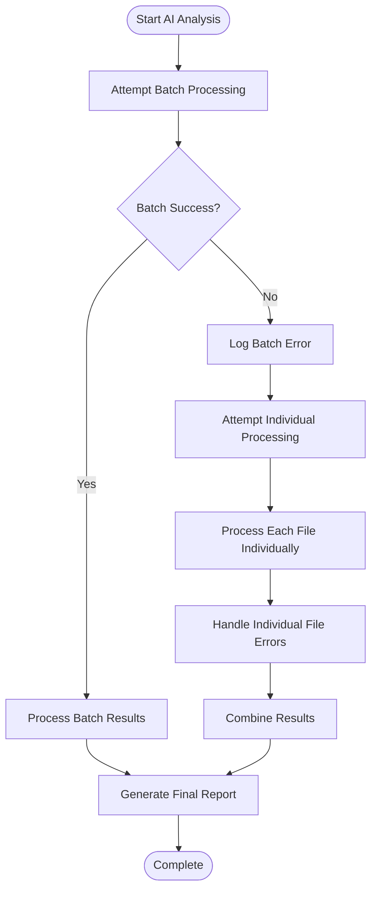
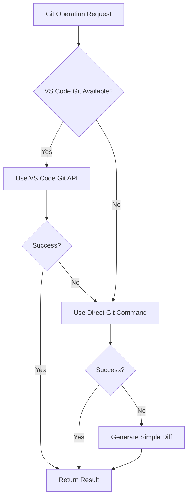
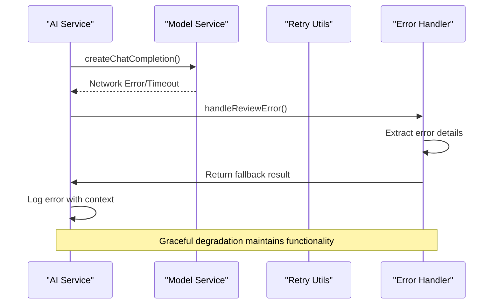

# Error Handling

<cite>
**Referenced Files in This Document**
- [reviewManager.ts](file://src/services/review/reviewManager.ts)
- [logger.ts](file://src/utils/logger.ts)
- [notificationManager.ts](file://src/services/notification/notificationManager.ts)
- [gitService.ts](file://src/services/git/gitService.ts)
- [aiService.ts](file://src/services/ai/aiService.ts)
- [retryUtils.ts](file://src/utils/retryUtils.ts)
- [baseModel.ts](file://src/models/baseModel.ts)
- [constants.ts](file://src/constants/constants.ts)
- [index.ts](file://src/i18n/index.ts)
</cite>

## Table of Contents
1. [Introduction](#introduction)
2. [Error Context Classification](#error-context-classification)
3. [Centralized Error Management](#centralized-error-management)
4. [Try-Catch Patterns](#try-catch-patterns)
5. [Fallback Mechanisms](#fallback-mechanisms)
6. [Concurrency Control](#concurrency-control)
7. [Network and Service Failures](#network-and-service-failures)
8. [Error Recovery Strategies](#error-recovery-strategies)
9. [Best Practices](#best-practices)
10. [Common Error Scenarios](#common-error-scenarios)

## Introduction

CodeKarmic implements a comprehensive error handling framework designed to manage the complexities of code review orchestration involving multiple services including Git repositories, AI analysis engines, and VS Code extensions. The system employs a multi-layered approach to error detection, classification, and recovery, ensuring robust operation even when individual components fail.

The error handling system is built around several key principles:
- **Centralized Error Reporting**: Consistent error logging and notification through a unified interface
- **Context-Aware Error Classification**: Granular categorization of errors by functional context
- **Graceful Degradation**: Fallback mechanisms to maintain partial functionality when primary operations fail
- **User Feedback**: Clear communication of errors and recovery actions to users
- **Developer Debugging**: Comprehensive logging for troubleshooting and development

## Error Context Classification

The system uses the `ErrorContext` enum to categorize errors by their origin and functional context, enabling targeted error handling and improved debugging.

```mermaid
classDiagram
class ErrorContext {
<<enumeration>>
+initialize
+setSelectedCommit
+selectCommit
+viewFile
+reviewFile
+addComment
+addAISuggestion
+setCodeQualityScore
+generateReport
}
class ErrorContextLabels {
+initialize : {en : string, zh : string}
+setSelectedCommit : {en : string, zh : string}
+selectCommit : {en : string, zh : string}
+viewFile : {en : string, zh : string}
+reviewFile : {en : string, zh : string}
+addComment : {en : string, zh : string}
+addAISuggestion : {en : string, zh : string}
+setCodeQualityScore : {en : string, zh : string}
+generateReport : {en : string, zh : string}
}
ErrorContext --> ErrorContextLabels : "maps to"
```

**Diagram sources**
- [reviewManager.ts](file://src/services/review/reviewManager.ts#L28-L77)

### Context Categories

| Context | Purpose | Error Handling Strategy |
|---------|---------|------------------------|
| `initialize` | Repository initialization failures | Immediate termination with detailed error reporting |
| `setSelectedCommit` | Commit selection validation | Validation error with user feedback |
| `selectCommit` | Git commit retrieval and caching | Multiple fallback strategies with caching |
| `viewFile` | File opening operations | Graceful degradation with alternative approaches |
| `reviewFile` | Code review preparation | Stateless operations with local caching |
| `addComment` | Comment addition operations | Transaction-like operations with rollback capability |
| `addAISuggestion` | AI suggestion integration | Append-only operations with error isolation |
| `setCodeQualityScore` | Quality metric assignment | Numeric validation with default values |
| `generateReport` | Report generation orchestration | Complex workflow with multiple fallback points |

**Section sources**
- [reviewManager.ts](file://src/services/review/reviewManager.ts#L28-L77)

## Centralized Error Management

The error handling system employs a centralized approach through the `logError` method in the `ReviewManager` class, ensuring consistent error reporting across all operations.



**Diagram sources**
- [reviewManager.ts](file://src/services/review/reviewManager.ts#L101-L105)
- [notificationManager.ts](file://src/services/notification/notificationManager.ts#L79-L117)

### Logging Infrastructure

The system uses a sophisticated logging infrastructure with multiple layers:



**Diagram sources**
- [logger.ts](file://src/utils/logger.ts#L8-L88)
- [notificationManager.ts](file://src/services/notification/notificationManager.ts#L8-L213)

**Section sources**
- [logger.ts](file://src/utils/logger.ts#L1-L88)
- [notificationManager.ts](file://src/services/notification/notificationManager.ts#L1-L213)

## Try-Catch Patterns

CodeKarmic implements consistent try-catch patterns throughout the codebase, ensuring that all operations are wrapped in error-handling blocks that maintain system stability and provide meaningful feedback.

### Standard Error Handling Pattern

The typical error handling pattern follows this structure:

```typescript
// Example from reviewManager.ts
public async selectCommit(commitId: string): Promise<void> {
    try {
        // Business logic that may throw errors
        if (!commitId) {
            throw new Error('Commit ID is required');
        }
        
        // Service operations with error handling
        const commit = await this.gitService.getCommitById(commitId);
        if (!commit) {
            throw new Error(`Commit with ID ${commitId} not found`);
        }
        
        this.selectedCommit = commit;
    } catch (error) {
        // Centralized error logging
        this.logError(error, ErrorContext.selectCommit);
        throw error; // Re-throw for upstream handling
    }
}
```

### Error Propagation Strategy

The system employs a hierarchical error propagation strategy:

1. **Local Error Handling**: Operations handle errors locally when recovery is possible
2. **Centralized Logging**: All errors are logged through the centralized system
3. **User Notification**: Appropriate notifications are shown based on error severity
4. **Upstream Propagation**: Errors are re-thrown when they cannot be recovered locally

**Section sources**
- [reviewManager.ts](file://src/services/review/reviewManager.ts#L149-L206)

## Fallback Mechanisms

CodeKarmic implements sophisticated fallback mechanisms to ensure continued operation when primary services fail. The most notable example is the dual-path approach for AI analysis.

### Batch vs Individual Processing Fallback

The `generateReport` method demonstrates a comprehensive fallback strategy:



**Diagram sources**
- [reviewManager.ts](file://src/services/review/reviewManager.ts#L499-L646)

### Git Service Fallback Strategies

The Git service implements multiple fallback strategies for different operations:



**Diagram sources**
- [gitService.ts](file://src/services/git/gitService.ts#L720-L793)

**Section sources**
- [reviewManager.ts](file://src/services/review/reviewManager.ts#L499-L646)
- [gitService.ts](file://src/services/git/gitService.ts#L720-L793)

## Concurrency Control

The system implements strict concurrency control to prevent race conditions and ensure data consistency during report generation.

### Report Generation Lock

The `isGeneratingReport` flag prevents concurrent report generation operations:

```typescript
// Prevent concurrent report generation
if (this.isGeneratingReport) {
    notificationManager.log(OUTPUT.REPOSITORY.REPORT_IN_PROGRESS, 'warning', true);
    return '';
}

this.isGeneratingReport = true;

try {
    // Report generation logic
} finally {
    // Reset flag regardless of success/failure
    this.isGeneratingReport = false;
}
```

### Progress Tracking and Cancellation

The system supports cancellation through VS Code's progress tracking API:

```typescript
return await vscode.window.withProgress({
    location: vscode.ProgressLocation.Window,
    title: 'Generating Code Review Report',
    cancellable: true
}, async (progress, token) => {
    // Monitor cancellation requests
    if (token.isCancellationRequested) {
        break;
    }
});
```

**Section sources**
- [reviewManager.ts](file://src/services/review/reviewManager.ts#L377-L381)
- [reviewManager.ts](file://src/services/review/reviewManager.ts#L467-L471)

## Network and Service Failures

The system handles various network and service failure scenarios through comprehensive error handling and retry mechanisms.

### AI Service Error Handling

The AI service implements robust error handling for network failures and API limitations:



**Diagram sources**
- [aiService.ts](file://src/services/ai/aiService.ts#L120-L122)
- [aiService.ts](file://src/services/ai/aiService.ts#L691-L710)

### Retry Mechanisms

The system includes sophisticated retry utilities for transient failures:

```typescript
// Retry configuration for network operations
const DEFAULT_RETRY_OPTIONS: RetryOptions = {
    maxRetries: 2,
    initialDelay: 500,
    backoffFactor: 1.5,
};

// Network-specific retry patterns
const NETWORK_RETRYABLE_ERRORS = [
    'ECONNRESET', 'ETIMEDOUT', 'ESOCKETTIMEDOUT',
    'socket hang up', 'network error', 'timeout',
    /^5\d\d$/, 'rate limit', 'too many requests',
    'Service Unavailable'
];
```

**Section sources**
- [aiService.ts](file://src/services/ai/aiService.ts#L120-L122)
- [aiService.ts](file://src/services/ai/aiService.ts#L691-L710)
- [retryUtils.ts](file://src/utils/retryUtils.ts#L16-L116)

## Error Recovery Strategies

CodeKarmic implements multiple error recovery strategies depending on the nature and severity of the error.

### Graceful Degradation

When primary operations fail, the system falls back to simpler alternatives:

```typescript
// Git service fallback for file content retrieval
const content = await this.git.show([`${commitId}:${file.file}`])
    .catch(() => '(Empty File)');

// AI service fallback for diff generation
const diffContent = await this.gitService?.getFileDiff(currentCommit, params.filePath)
    .catch(() => this.generateSimpleDiff(params));
```

### State Recovery

The system maintains state recovery mechanisms for partial failures:

```typescript
// Individual file processing with error isolation
const aiPromises = files.map(async file => {
    try {
        const result = await aiService.reviewCode({
            filePath: file.path,
            currentContent: file.content,
            previousContent: file.previousContent
        });
        return result;
    } catch (error) {
        // Log error but continue with other files
        notificationManager.log(`[Error] AI analysis of file ${file.path} failed: ${error}`, 'error', true);
        return null;
    }
});
```

### Resource Cleanup

The system ensures proper resource cleanup in error conditions:

```typescript
try {
    // Resource-intensive operations
} catch (error) {
    // Cleanup resources
    if (reportWebView) {
        reportWebView.dispose();
    }
    throw error;
} finally {
    // Always clean up
    this.isGeneratingReport = false;
    notificationManager.endSession(5000, false, true);
}
```

**Section sources**
- [gitService.ts](file://src/services/git/gitService.ts#L120-L170)
- [reviewManager.ts](file://src/services/review/reviewManager.ts#L569-L607)
- [reviewManager.ts](file://src/services/review/reviewManager.ts#L647-L660)

## Best Practices

### Error Context Preservation

Always preserve error context through the `ErrorContext` enum:

```typescript
// Correct: Preserves context
this.logError(error, ErrorContext.selectCommit);

// Incorrect: Generic error handling
console.error('Error:', error);
```

### User-Friendly Error Messages

Provide actionable error messages with clear next steps:

```typescript
// Good: Actionable error message
throw new Error('Commit ID is required. Please select a valid commit.');

// Better: With context and guidance
throw new Error(`Failed to select commit ${commitId}. Ensure the commit exists and you have access permissions.`);
```

### Logging Levels Appropriately

Use appropriate logging levels for different scenarios:

```typescript
// Debug information for development
this.logDebug('Processing file:', { filePath, fileSize });

// Information for operational monitoring
this.logInfo('Successfully processed file:', filePath);

// Warning for recoverable issues
this.logWarn('Unable to process file, using fallback:', filePath);

// Error for critical failures
this.logError(error, ErrorContext.reviewFile);
```

### Resource Management

Ensure proper resource cleanup in all code paths:

```typescript
try {
    // Acquire resources
    const resource = await acquireResource();
    
    // Perform operations
    await process(resource);
} catch (error) {
    // Handle error
    this.logError(error, ErrorContext.reviewFile);
    throw error;
} finally {
    // Always release resources
    if (resource) {
        await releaseResource(resource);
    }
}
```

## Common Error Scenarios

### Network Failures During AI Analysis

**Scenario**: AI API becomes unavailable or times out

**Handling Strategy**:
- Implement exponential backoff retry
- Fall back to cached results when available
- Provide immediate feedback to users
- Generate partial reports with available data

**Example Implementation**:
```typescript
try {
    const result = await aiService.batchReviewCode(reviewRequests);
    return result;
} catch (error) {
    // Fallback to individual processing
    const individualResults = await Promise.all(
        reviewRequests.map(req => 
            aiService.reviewCode(req).catch(() => null)
        )
    );
    return new Map(individualResults
        .filter(Boolean)
        .map((result, i) => [reviewRequests[i].filePath, result!])
    );
}
```

### Git Repository Access Issues

**Scenario**: Git repository becomes inaccessible or corrupted

**Handling Strategy**:
- Implement multiple Git access methods (VS Code API, direct commands)
- Cache frequently accessed data
- Provide clear error messages with resolution steps
- Offer offline mode capabilities

**Example Implementation**:
```typescript
private async getVSCodeGitDiff(filePath: string): Promise<string | null> {
    try {
        const gitExtension = vscode.extensions.getExtension('vscode.git')?.exports;
        if (!gitExtension) return null;
        
        const api = gitExtension.getAPI(1);
        if (!api || !api.repositories || api.repositories.length === 0) return null;
        
        const repo = api.repositories[0];
        const uri = vscode.Uri.file(path.resolve(this.repoPath, filePath));
        const diffResult = await repo.diffWithHEAD(uri);
        
        return typeof diffResult === 'string' && diffResult.trim().length > 10 
            ? diffResult 
            : null;
    } catch (error) {
        // Fall back to custom implementation
        return this.getDirectCommandDiff(filePath);
    }
}
```

### Memory and Performance Issues

**Scenario**: Large files or many files cause memory pressure

**Handling Strategy**:
- Implement streaming processing for large files
- Use pagination for large result sets
- Set appropriate timeouts and limits
- Provide progress feedback to users

**Example Implementation**:
```typescript
// Large file processing with streaming
private async processLargeFile(params: CodeReviewRequest): Promise<CodeReviewResult> {
    const processor = LargeFileProcessor.getInstance();
    return await processor.processLargeFile(params);
}

// Batch processing with size limits
const MAX_BATCH_SIZE = 8000;
const estimatedTokens = fileSize * TOKENS_PER_CHAR;
if (estimatedTokens > MAX_BATCH_SIZE) {
    // Process in smaller chunks
    const chunks = this.chunkFileContent(params.currentContent, MAX_CHUNK_SIZE);
    const chunkResults = await Promise.all(
        chunks.map(chunk => this.analyzeChunk(chunk))
    );
    return this.mergeChunkResults(chunkResults);
}
```

### Cancellation Handling

**Scenario**: User cancels long-running operations

**Handling Strategy**:
- Monitor cancellation tokens
- Clean up partial results
- Provide immediate feedback
- Allow safe interruption points

**Example Implementation**:
```typescript
return await vscode.window.withProgress({
    location: vscode.ProgressLocation.Notification,
    title: 'Processing files...',
    cancellable: true
}, async (progress, token) => {
    for (const file of files) {
        if (token.isCancellationRequested) {
            // Clean up and exit gracefully
            await this.cleanupPartialResults();
            throw new Error('Operation cancelled by user');
        }
        
        // Process file
        await this.processFile(file);
        progress.report({ increment: 100 / totalFiles });
    }
});
```

**Section sources**
- [reviewManager.ts](file://src/services/review/reviewManager.ts#L499-L646)
- [gitService.ts](file://src/services/git/gitService.ts#L367-L406)
- [aiService.ts](file://src/services/ai/aiService.ts#L387-L410)