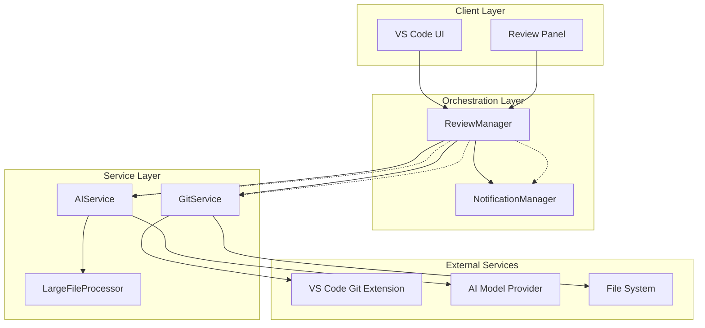
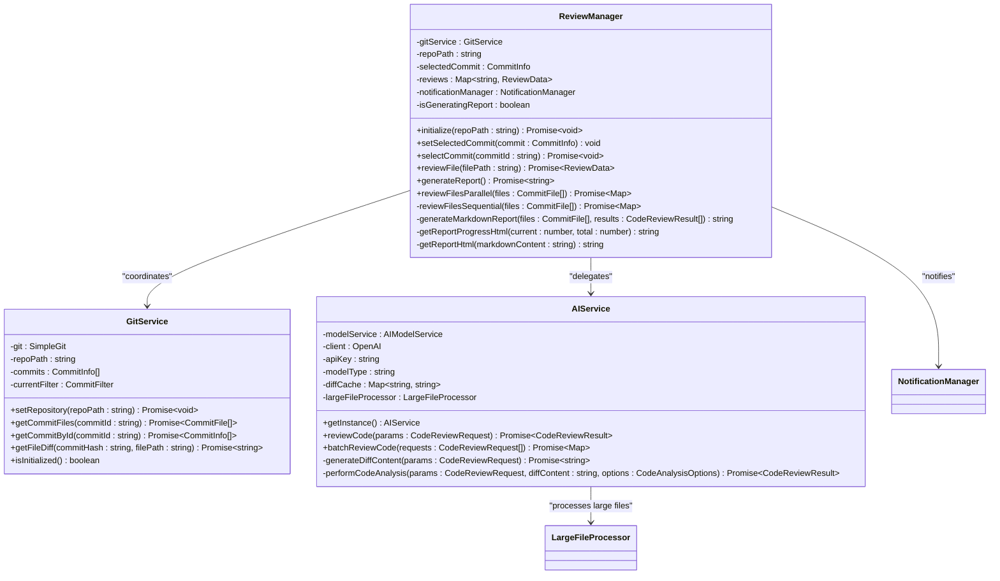
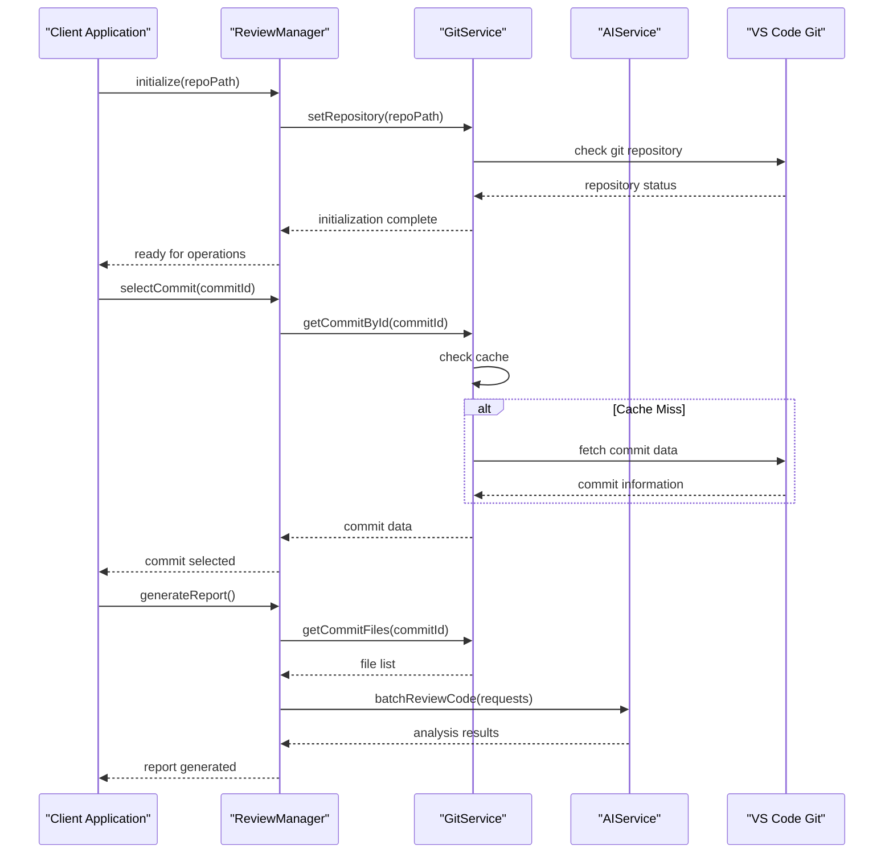
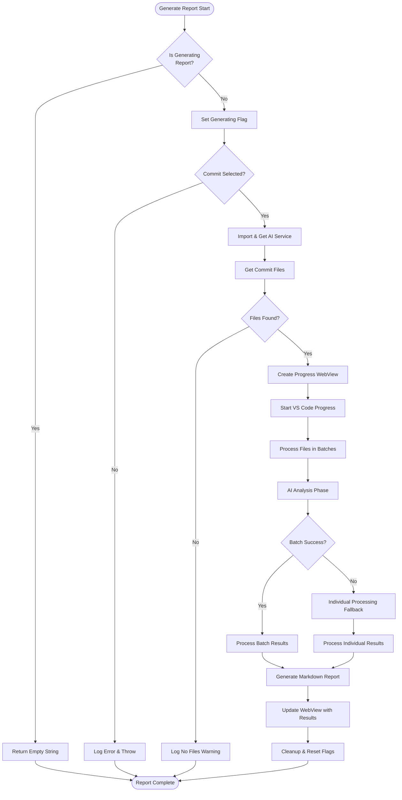
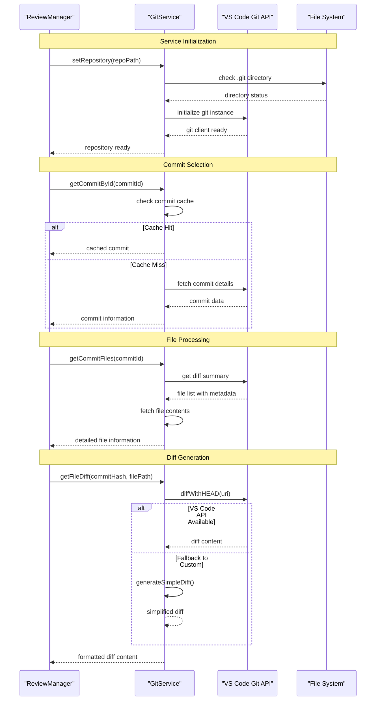
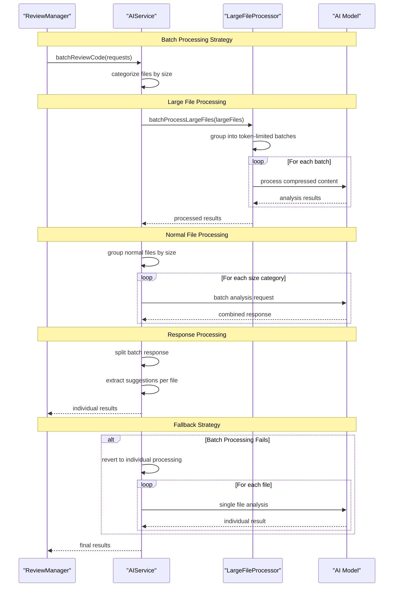
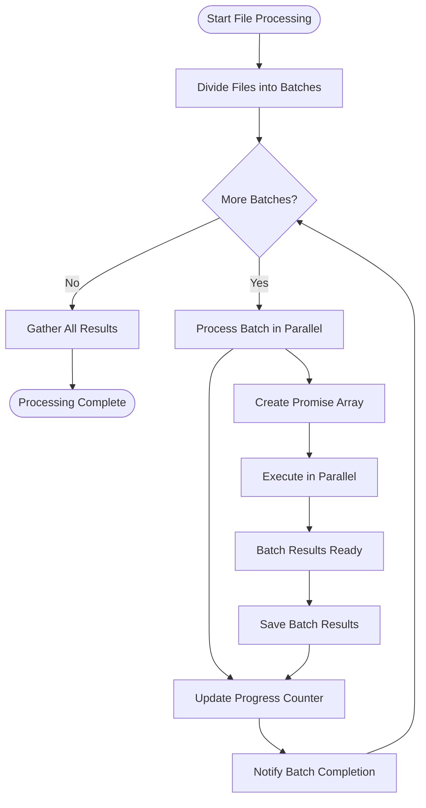
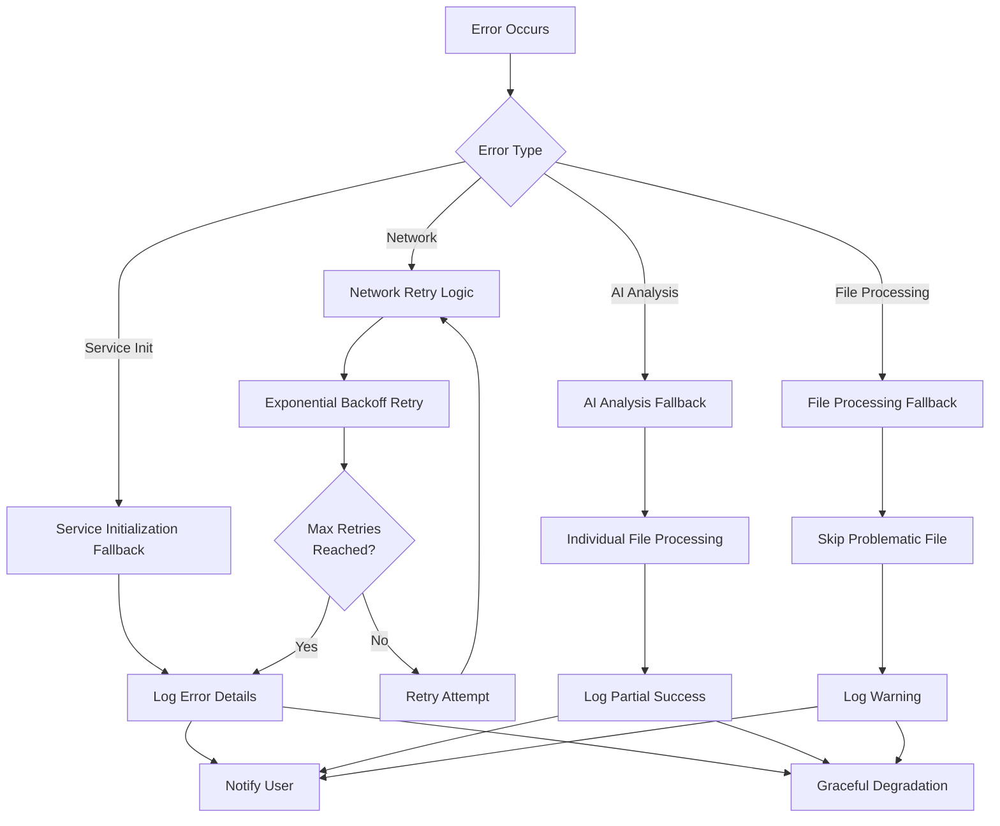
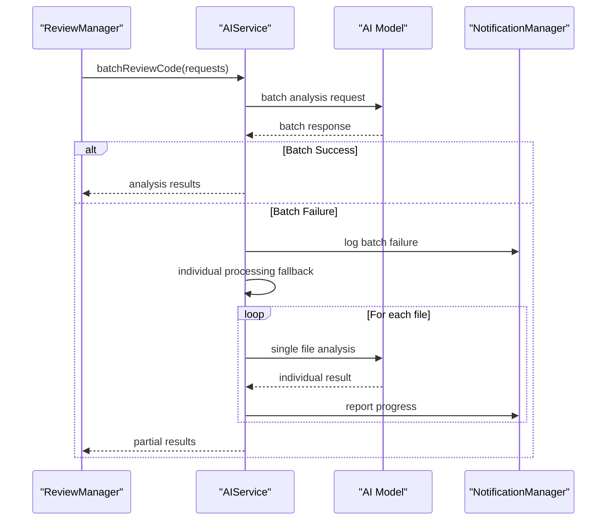
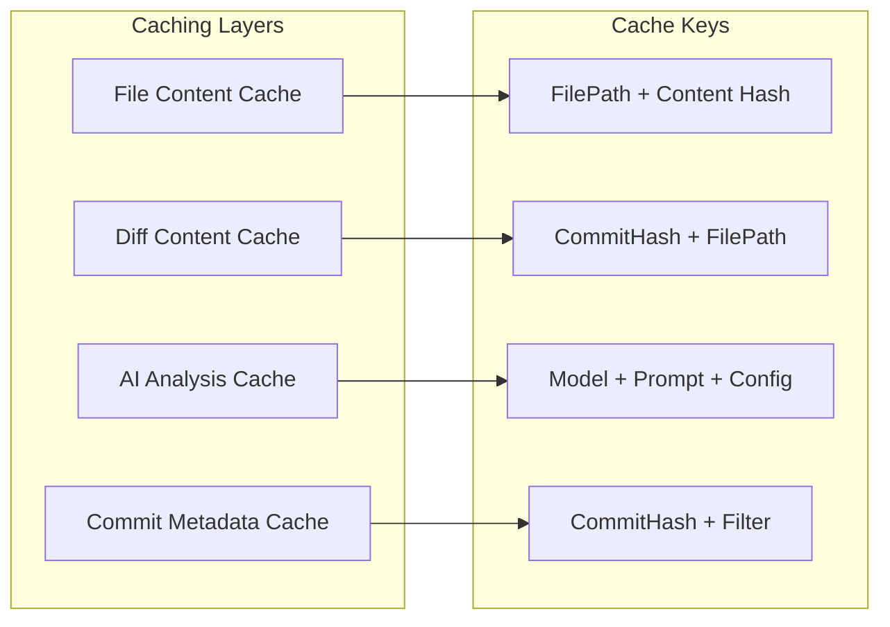

# Review Orchestration

<cite>
**Referenced Files in This Document**
- [reviewManager.ts](file://src/services/review/reviewManager.ts)
- [gitService.ts](file://src/services/git/gitService.ts)
- [aiService.ts](file://src/services/ai/aiService.ts)
- [reviewTypes.ts](file://src/core/review/reviewTypes.ts)
- [notificationManager.ts](file://src/services/notification/notificationManager.ts)
- [retryUtils.ts](file://src/utils/retryUtils.ts)
- [largeFileProcessor.ts](file://src/core/compression/largeFileProcessor.ts)
</cite>

## Table of Contents
1. [Introduction](#introduction)
2. [System Architecture Overview](#system-architecture-overview)
3. [Core Components](#core-components)
4. [Review Orchestration Workflow](#review-orchestration-workflow)
5. [Service Coordination Patterns](#service-coordination-patterns)
6. [Batch Processing and Parallel Execution](#batch-processing-and-parallel-execution)
7. [Error Handling and Fallback Mechanisms](#error-handling-and-fallback-mechanisms)
8. [Performance Optimization Strategies](#performance-optimization-strategies)
9. [Common Orchestration Issues](#common-orchestration-issues)
10. [Troubleshooting Guide](#troubleshooting-guide)

## Introduction

The CodeKarmic review orchestration system represents a sophisticated coordination framework that seamlessly integrates Git operations with AI-powered code analysis. At its core, the ReviewManager serves as the central orchestrator, managing the complex workflow of retrieving commit data, processing files in batches, and delegating AI analysis tasks to specialized services.

This system demonstrates advanced orchestration patterns including parallel processing, error recovery, and adaptive fallback strategies. The architecture emphasizes reliability, performance, and user experience through intelligent service coordination and comprehensive error handling mechanisms.

## System Architecture Overview

The review orchestration system follows a layered architecture with clear separation of concerns:



**Diagram sources**
- [reviewManager.ts](file://src/services/review/reviewManager.ts#L79-L93)
- [gitService.ts](file://src/services/git/gitService.ts#L45-L62)
- [aiService.ts](file://src/services/ai/aiService.ts#L40-L72)

**Section sources**
- [reviewManager.ts](file://src/services/review/reviewManager.ts#L79-L93)
- [gitService.ts](file://src/services/git/gitService.ts#L45-L62)
- [aiService.ts](file://src/services/ai/aiService.ts#L40-L72)

## Core Components

### ReviewManager - Central Orchestration Hub

The ReviewManager acts as the primary coordinator, managing the entire review lifecycle:



**Diagram sources**
- [reviewManager.ts](file://src/services/review/reviewManager.ts#L79-L93)
- [gitService.ts](file://src/services/git/gitService.ts#L45-L62)
- [aiService.ts](file://src/services/ai/aiService.ts#L40-L72)

### Service Initialization and Lifecycle Management

The orchestration system implements robust service initialization patterns:



**Diagram sources**
- [reviewManager.ts](file://src/services/review/reviewManager.ts#L111-L128)
- [gitService.ts](file://src/services/git/gitService.ts#L64-L107)
- [aiService.ts](file://src/services/ai/aiService.ts#L40-L72)

**Section sources**
- [reviewManager.ts](file://src/services/review/reviewManager.ts#L111-L128)
- [gitService.ts](file://src/services/git/gitService.ts#L64-L107)
- [aiService.ts](file://src/services/ai/aiService.ts#L40-L72)

## Review Orchestration Workflow

### The GenerateReport Method - Central Workflow Coordinator

The `generateReport` method exemplifies sophisticated orchestration patterns, implementing a multi-stage workflow with comprehensive error handling and progress reporting:



**Diagram sources**
- [reviewManager.ts](file://src/services/review/reviewManager.ts#L372-L660)

### Key Orchestration Features

The generateReport method implements several advanced orchestration features:

1. **Concurrency Control**: Prevents concurrent report generation through atomic flag management
2. **Progress Tracking**: Provides real-time progress updates through VS Code progress API
3. **WebView Integration**: Creates interactive progress displays with HTML rendering
4. **Resource Management**: Proper cleanup and resource disposal in finally blocks
5. **Error Isolation**: Comprehensive error handling with context preservation

**Section sources**
- [reviewManager.ts](file://src/services/review/reviewManager.ts#L372-L660)

## Service Coordination Patterns

### GitService Coordination

The ReviewManager coordinates with GitService through multiple interaction patterns:



**Diagram sources**
- [reviewManager.ts](file://src/services/review/reviewManager.ts#L149-L206)
- [gitService.ts](file://src/services/git/gitService.ts#L110-L177)
- [gitService.ts](file://src/services/git/gitService.ts#L707-L793)

### AIService Coordination

The AI service coordination demonstrates sophisticated batch processing and fallback mechanisms:



**Diagram sources**
- [reviewManager.ts](file://src/services/review/reviewManager.ts#L487-L646)
- [aiService.ts](file://src/services/ai/aiService.ts#L431-L552)
- [largeFileProcessor.ts](file://src/core/compression/largeFileProcessor.ts#L161-L225)

**Section sources**
- [reviewManager.ts](file://src/services/review/reviewManager.ts#L149-L206)
- [gitService.ts](file://src/services/git/gitService.ts#L110-L177)
- [aiService.ts](file://src/services/ai/aiService.ts#L431-L552)

## Batch Processing and Parallel Execution

### Parallel File Processing Strategy

The ReviewManager implements sophisticated parallel processing with intelligent batching:



**Diagram sources**
- [reviewManager.ts](file://src/services/review/reviewManager.ts#L329-L369)

### Batch Size Optimization

The system uses configurable batch sizes for optimal performance:

| Component | Batch Size | Purpose | Rationale |
|-----------|------------|---------|-----------|
| File Processing | 5 files | Memory efficiency | Balances memory usage with throughput |
| AI Analysis | Variable | Token limits | Respects AI model constraints |
| Large Files | 1 file | Content preservation | Maintains analysis quality |
| Normal Files | 10-20 files | Cost optimization | Reduces API calls while respecting limits |

**Section sources**
- [reviewManager.ts](file://src/services/review/reviewManager.ts#L329-L369)

## Error Handling and Fallback Mechanisms

### Multi-Level Error Recovery

The orchestration system implements comprehensive error handling across multiple layers:



**Diagram sources**
- [reviewManager.ts](file://src/services/review/reviewManager.ts#L101-L108)
- [retryUtils.ts](file://src/utils/retryUtils.ts#L33-L69)

### Specific Fallback Strategies

#### AI Analysis Failure Fallback

When batch AI processing fails, the system automatically falls back to individual processing:



**Diagram sources**
- [reviewManager.ts](file://src/services/review/reviewManager.ts#L567-L646)

#### Service Initialization Failure Handling

The system provides robust service initialization error handling:

| Error Scenario | Detection Method | Fallback Action | Recovery Strategy |
|----------------|------------------|-----------------|-------------------|
| Git Repository Not Found | Directory existence check | Prompt for valid path | User intervention required |
| AI Service Unavailable | API connectivity test | Local processing fallback | Retry with exponential backoff |
| Network Timeout | Request timeout detection | Retry with backoff | Alternative service endpoints |
| Authentication Failure | API error response | Credential refresh | User re-authentication |

**Section sources**
- [reviewManager.ts](file://src/services/review/reviewManager.ts#L111-L128)
- [gitService.ts](file://src/services/git/gitService.ts#L64-L107)
- [aiService.ts](file://src/services/ai/aiService.ts#L712-L723)

## Performance Optimization Strategies

### Caching and Memoization

The orchestration system implements multiple caching layers:



**Diagram sources**
- [aiService.ts](file://src/services/ai/aiService.ts#L129-L142)
- [gitService.ts](file://src/services/git/gitService.ts#L110-L177)

### Resource Management

The system implements intelligent resource management:

1. **Memory Management**: Batching prevents memory exhaustion with large commits
2. **Network Optimization**: Connection pooling and request deduplication
3. **CPU Utilization**: Parallel processing with controlled concurrency
4. **Storage Efficiency**: Compressed storage for large file analysis

**Section sources**
- [reviewManager.ts](file://src/services/review/reviewManager.ts#L329-L369)
- [largeFileProcessor.ts](file://src/core/compression/largeFileProcessor.ts#L161-L225)

## Common Orchestration Issues

### Service Initialization Failures

Common initialization issues and their solutions:

#### Git Service Initialization Problems

**Issue**: Git repository not found or inaccessible
**Symptoms**: 
- "Repository path does not exist" errors
- "Not a git repository" messages
- Authentication failures

**Solution**: 
- Verify repository path exists and is accessible
- Check .git directory presence
- Validate git credentials and permissions

#### AI Service Initialization Problems

**Issue**: AI model provider unavailable or misconfigured
**Symptoms**:
- API key validation failures
- Rate limiting errors
- Model provider timeouts

**Solution**:
- Verify API key configuration
- Check network connectivity
- Validate model provider settings

### Batch Processing Errors

#### Large File Handling Issues

**Issue**: Large files causing memory or timeout problems
**Symptoms**:
- Out of memory errors
- API request timeouts
- Excessive processing times

**Solution**:
- Automatic file size detection
- Compression-based processing
- Progressive loading strategies

#### Concurrent Processing Conflicts

**Issue**: Race conditions or resource contention
**Symptoms**:
- Inconsistent results
- Deadlocks
- Resource exhaustion

**Solution**:
- Atomic flag management
- Resource pooling
- Controlled concurrency limits

**Section sources**
- [reviewManager.ts](file://src/services/review/reviewManager.ts#L111-L128)
- [aiService.ts](file://src/services/ai/aiService.ts#L712-L723)
- [largeFileProcessor.ts](file://src/core/compression/largeFileProcessor.ts#L161-L225)

## Troubleshooting Guide

### Diagnostic Commands and Logs

#### Enable Debug Logging

To enable comprehensive debugging:

1. Set log level to DEBUG in VS Code settings
2. Monitor Output panel for detailed execution traces
3. Check status bar for real-time progress indicators

#### Common Error Patterns

**Git Service Errors**:
```typescript
// Example error patterns to monitor
const gitErrorPatterns = [
    'Repository path does not exist',
    'Not a git repository',
    'Permission denied',
    'Authentication failed'
];
```

**AI Service Errors**:
```typescript
// Example AI service error patterns
const aiErrorPatterns = [
    'API key validation failed',
    'Rate limit exceeded',
    'Model not found',
    'Request timeout'
];
```

### Performance Monitoring

#### Key Performance Indicators

| Metric | Threshold | Action |
|--------|-----------|---------|
| File Processing Time | > 30 seconds | Enable compression |
| AI Analysis Time | > 2 minutes | Reduce batch size |
| Memory Usage | > 1GB | Implement pagination |
| Network Latency | > 5 seconds | Enable caching |

#### Optimization Recommendations

1. **For Large Repositories**: Enable file filtering and reduce batch sizes
2. **For Slow Networks**: Increase timeout values and enable aggressive caching
3. **For Memory Constraints**: Reduce concurrent processing limits
4. **For API Rate Limits**: Implement request queuing and exponential backoff

**Section sources**
- [notificationManager.ts](file://src/services/notification/notificationManager.ts#L79-L121)
- [retryUtils.ts](file://src/utils/retryUtils.ts#L33-L69)