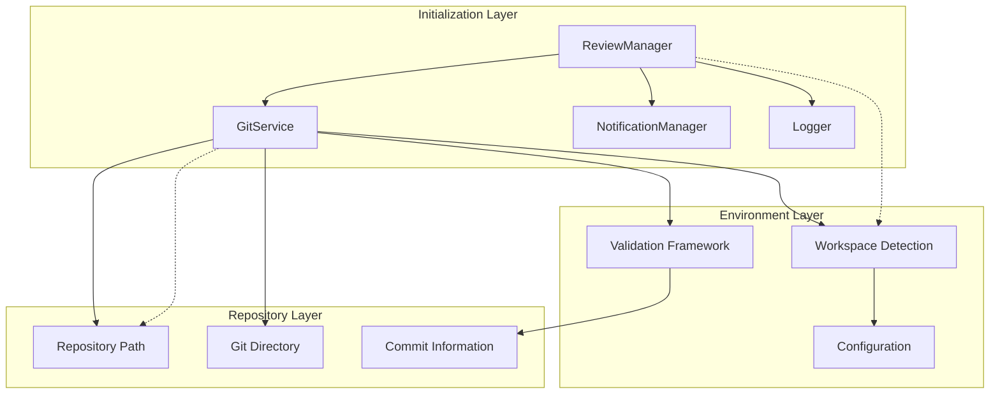
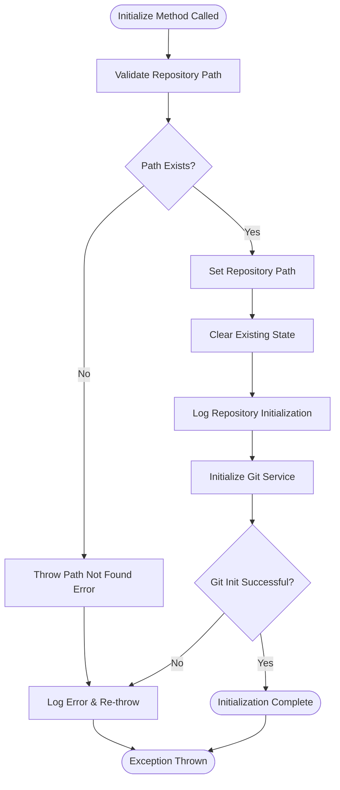
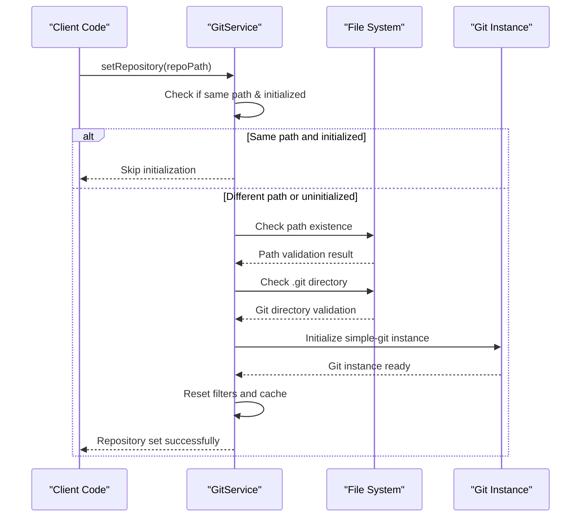
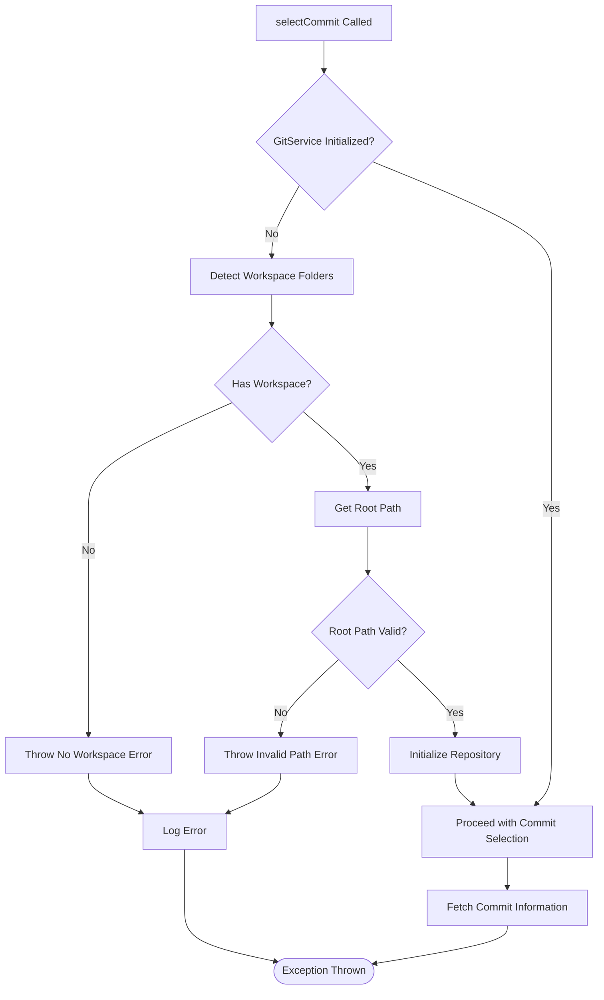
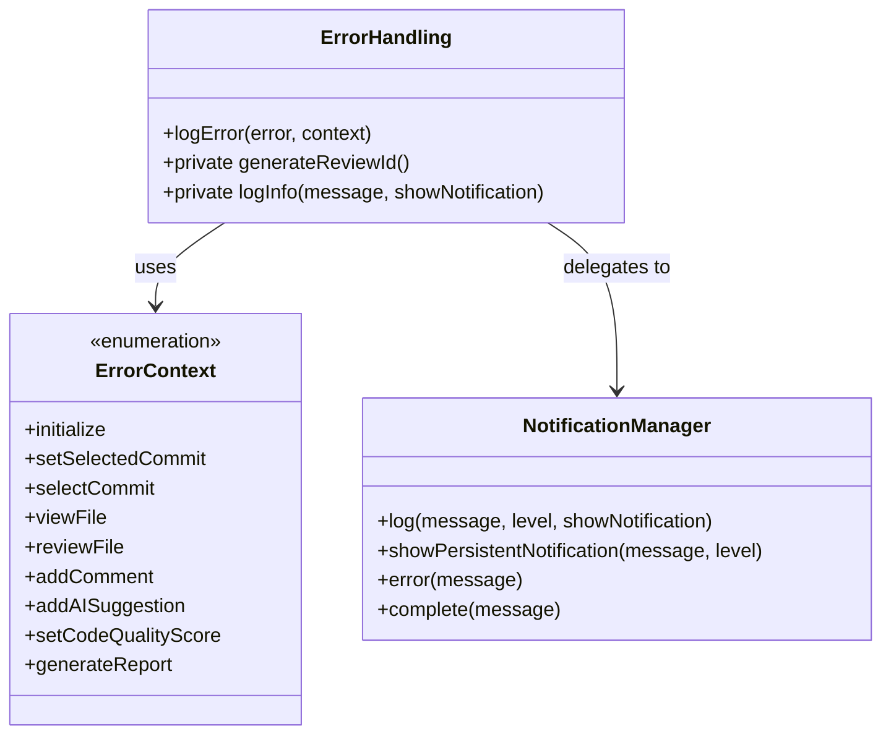
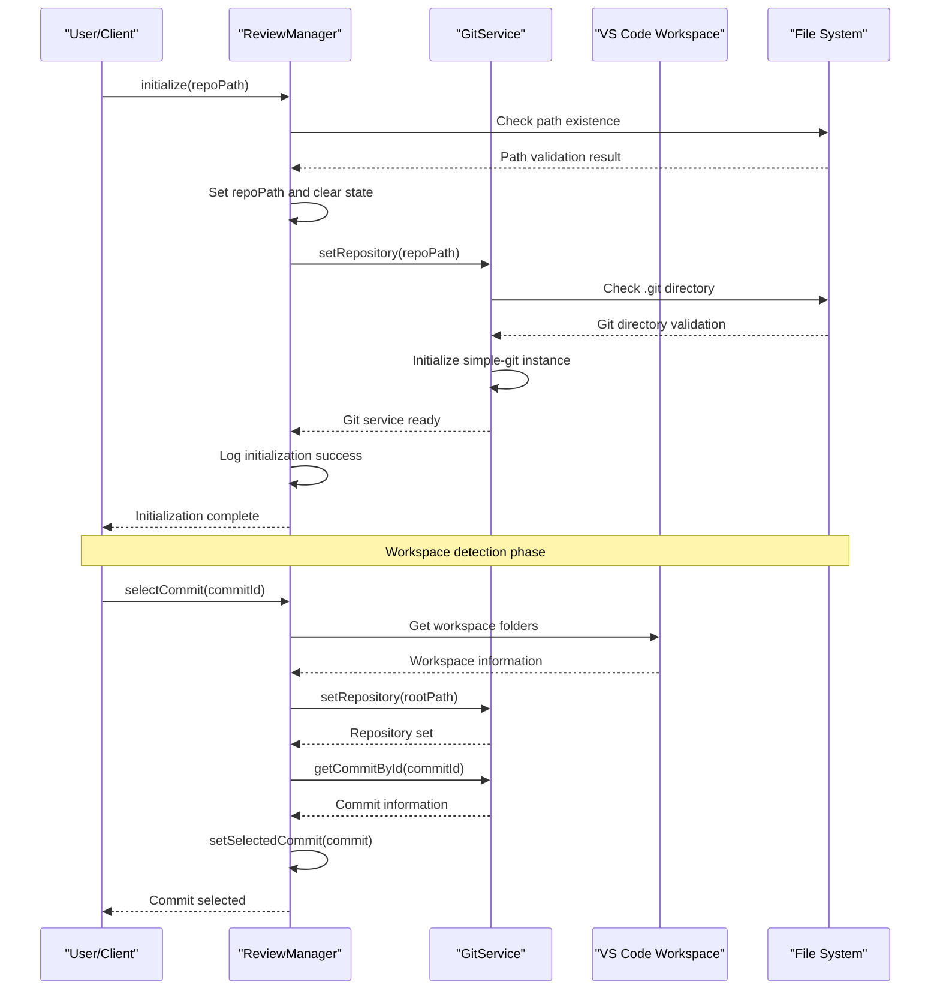
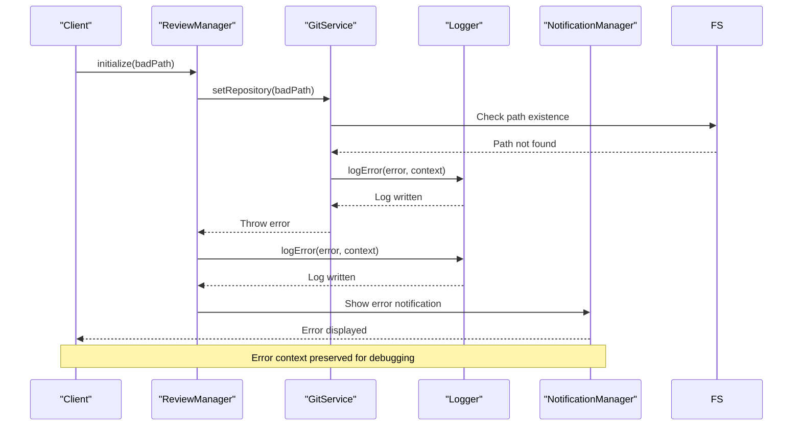

# Service Initialization

<cite>
**Referenced Files in This Document**
- [reviewManager.ts](file://src/services/review/reviewManager.ts)
- [gitService.ts](file://src/services/git/gitService.ts)
- [commitExplorer.ts](file://src/ui/components/commitExplorer.ts)
- [logger.ts](file://src/utils/logger.ts)
- [notificationManager.ts](file://src/services/notification/notificationManager.ts)
- [appConfig.ts](file://src/config/appConfig.ts)
- [index.ts](file://src/i18n/index.ts)
</cite>

## Table of Contents
1. [Introduction](#introduction)
2. [Initialization Architecture Overview](#initialization-architecture-overview)
3. [ReviewManager Initialization Phase](#reviewmanager-initialization-phase)
4. [GitService Repository Setup](#gitservice-repository-setup)
5. [Workspace Detection and Validation](#workspace-detection-and-validation)
6. [Error Handling and Logging](#error-handling-and-logging)
7. [Common Initialization Issues](#common-initialization-issues)
8. [Sequence Diagrams](#sequence-diagrams)
9. [Best Practices](#best-practices)
10. [Troubleshooting Guide](#troubleshooting-guide)

## Introduction

The CodeKarmic review orchestration system employs a sophisticated service initialization framework that ensures reliable setup of the Git repository environment before code review operations can commence. This initialization process involves multiple interconnected services working together to establish a robust foundation for subsequent code analysis tasks.

The initialization phase encompasses several critical components: the ReviewManager orchestrates the overall initialization workflow, the GitService handles repository-specific operations, and various utility services manage logging, notifications, and configuration. Together, these components form a comprehensive initialization pipeline that validates repository integrity, detects workspace environments, and prepares the system for code review operations.

## Initialization Architecture Overview

The service initialization follows a hierarchical architecture where the ReviewManager acts as the primary orchestrator, coordinating with specialized services to establish a complete operational environment.

**Diagram sources**
- [reviewManager.ts](file://src/services/review/reviewManager.ts#L90-L130)
- [gitService.ts](file://src/services/git/gitService.ts#L64-L108)

The initialization process operates through a series of well-defined phases, each with specific responsibilities and validation checkpoints. The system maintains strict error boundaries to prevent partial initialization states from compromising system stability.

**Section sources**
- [reviewManager.ts](file://src/services/review/reviewManager.ts#L90-L130)
- [gitService.ts](file://src/services/git/gitService.ts#L45-L108)

## ReviewManager Initialization Phase

The ReviewManager serves as the central coordinator for the initialization process, implementing a comprehensive setup routine that validates prerequisites and establishes the foundational infrastructure.

### Core Initialization Workflow

The initialization process begins with the [`initialize()`](file://src/services/review/reviewManager.ts#L111-L129) method, which performs essential validation and setup operations:

**Diagram sources**
- [reviewManager.ts](file://src/services/review/reviewManager.ts#L111-L129)

### State Management During Initialization

The ReviewManager maintains careful state management throughout the initialization process, ensuring clean separation between different operational phases:

| State Component | Purpose | Reset Behavior |
|----------------|---------|----------------|
| `repoPath` | Stores validated repository location | Set during initialization |
| `selectedCommit` | Tracks currently selected commit | Cleared on initialization |
| `reviews` | Contains review data mappings | Emptied on initialization |
| `gitService` | References initialized Git service | Preserved across sessions |

**Section sources**
- [reviewManager.ts](file://src/services/review/reviewManager.ts#L82-L92)
- [reviewManager.ts](file://src/services/review/reviewManager.ts#L111-L129)

## GitService Repository Setup

The GitService implements a robust repository setup mechanism that validates Git repository integrity and establishes the necessary infrastructure for Git operations.

### Repository Validation Process

The [`setRepository()`](file://src/services/git/gitService.ts#L64-L108) method implements a multi-stage validation process:

**Diagram sources**
- [gitService.ts](file://src/services/git/gitService.ts#L64-L108)

### Validation Stages

The repository setup process implements three critical validation stages:

1. **Path Existence Validation**: Ensures the specified repository path exists and is accessible
2. **Git Directory Verification**: Confirms the presence of the `.git` directory indicating a valid Git repository
3. **Git Instance Initialization**: Establishes the underlying Git operations infrastructure

Each stage includes comprehensive error handling with detailed diagnostic information for troubleshooting purposes.

**Section sources**
- [gitService.ts](file://src/services/git/gitService.ts#L75-L107)

## Workspace Detection and Validation

The system implements sophisticated workspace detection capabilities that integrate with Visual Studio Code's workspace management to ensure proper repository context establishment.

### Workspace Detection Logic

The [`selectCommit()`](file://src/services/review/reviewManager.ts#L149-L206) method demonstrates intelligent workspace detection:

**Diagram sources**
- [reviewManager.ts](file://src/services/review/reviewManager.ts#L149-L206)

### Workspace Validation Criteria

The system validates workspace conditions through multiple criteria:

| Validation Criterion | Purpose | Error Handling |
|---------------------|---------|----------------|
| Workspace Folder Presence | Ensures VS Code workspace is open | Throws "No workspace folder open" |
| Root Path Accessibility | Validates workspace root accessibility | Throws "Root path is undefined" |
| Repository Consistency | Maintains repository path consistency | Automatic re-initialization when needed |

**Section sources**
- [reviewManager.ts](file://src/services/review/reviewManager.ts#L158-L169)
- [commitExplorer.ts](file://src/ui/components/commitExplorer.ts#L58-L82)

## Error Handling and Logging

The initialization system implements comprehensive error handling and logging mechanisms that provide detailed diagnostic information and maintain operational transparency.

### Error Context Classification

The system categorizes initialization errors into specific contexts using the [`ErrorContext`](file://src/services/review/reviewManager.ts#L28-L38) enumeration:

**Diagram sources**
- [reviewManager.ts](file://src/services/review/reviewManager.ts#L28-L105)
- [notificationManager.ts](file://src/services/notification/notificationManager.ts#L80-L117)

### Logging and Notification Strategy

The initialization process employs a multi-tiered logging strategy:

1. **Debug-Level Logging**: Detailed operational information for development and troubleshooting
2. **Info-Level Logging**: General operational status updates and progress indicators
3. **Warning-Level Logging**: Non-critical issues that don't prevent operation
4. **Error-Level Logging**: Critical failures requiring immediate attention

**Section sources**
- [reviewManager.ts](file://src/services/review/reviewManager.ts#L101-L109)
- [notificationManager.ts](file://src/services/notification/notificationManager.ts#L80-L117)

## Common Initialization Issues

Understanding common initialization problems helps developers diagnose and resolve issues efficiently. The system provides specific error messages and diagnostic information for typical failure scenarios.

### Repository Path Validation Failures

| Issue Category | Symptoms | Resolution Strategy |
|---------------|----------|-------------------|
| Non-existent Paths | "Repository path does not exist" | Verify path accuracy and accessibility |
| Permission Issues | Access denied errors | Check file system permissions |
| Network Drives | Remote path access failures | Use local repository copies |

### Git Service Initialization Errors

Common Git service initialization problems include:

- **Missing .git Directory**: Indicates non-Git repository path
- **Corrupted Repository**: Git operations failing with cryptic errors
- **Version Compatibility**: Incompatible Git client versions

### Workspace Environment Problems

Workspace-related initialization issues often stem from:

- **Multiple Workspaces**: Conflicting workspace configurations
- **Remote Repositories**: Network connectivity issues affecting repository access
- **Large Repositories**: Performance degradation with extensive commit histories

**Section sources**
- [gitService.ts](file://src/services/git/gitService.ts#L76-L87)
- [reviewManager.ts](file://src/services/review/reviewManager.ts#L113-L115)

## Sequence Diagrams

### Complete Initialization Workflow

**Diagram sources**
- [reviewManager.ts](file://src/services/review/reviewManager.ts#L111-L206)
- [gitService.ts](file://src/services/git/gitService.ts#L64-L108)

### Error Recovery Flow

**Diagram sources**
- [reviewManager.ts](file://src/services/review/reviewManager.ts#L101-L109)
- [gitService.ts](file://src/services/git/gitService.ts#L75-L87)

## Best Practices

### Initialization Timing

Proper initialization timing ensures optimal system performance and reliability:

- **Early Initialization**: Perform repository setup as early as possible in the application lifecycle
- **Lazy Loading**: Defer expensive operations until actually needed
- **State Validation**: Always validate initialization state before proceeding with operations

### Resource Management

Effective resource management during initialization prevents memory leaks and performance degradation:

- **Cleanup Procedures**: Implement proper cleanup for failed initialization attempts
- **Resource Pooling**: Reuse Git instances and other expensive resources
- **Memory Monitoring**: Track resource usage during initialization phases

### Configuration Management

Proper configuration handling ensures consistent behavior across different environments:

- **Default Values**: Provide sensible defaults for all configuration options
- **Validation**: Validate configuration values before applying them
- **Fallback Mechanisms**: Implement graceful fallbacks for missing or invalid configurations

## Troubleshooting Guide

### Diagnostic Steps

When encountering initialization issues, follow this systematic diagnostic approach:

1. **Verify Repository Path**: Confirm the repository path exists and is accessible
2. **Check Git Installation**: Ensure Git is properly installed and accessible
3. **Validate Workspace Configuration**: Verify VS Code workspace settings
4. **Review Logs**: Examine detailed logs for specific error information
5. **Test Connectivity**: Verify network connectivity for remote repositories

### Common Solutions

| Problem | Solution | Prevention |
|---------|----------|------------|
| Path Not Found | Verify repository location and permissions | Use absolute paths |
| Git Not Found | Install Git and update PATH | Configure Git installation |
| Workspace Issues | Open repository in VS Code | Use proper workspace setup |
| Permission Denied | Check file system permissions | Run with appropriate privileges |

### Advanced Debugging

For complex initialization issues, enable detailed debugging:

- **Enable Debug Logging**: Set log level to DEBUG for comprehensive diagnostic information
- **Monitor Resource Usage**: Track memory and CPU usage during initialization
- **Network Diagnostics**: Test network connectivity for remote repositories
- **File System Monitoring**: Monitor file system access patterns

**Section sources**
- [logger.ts](file://src/utils/logger.ts#L18-L88)
- [notificationManager.ts](file://src/services/notification/notificationManager.ts#L123-L142)