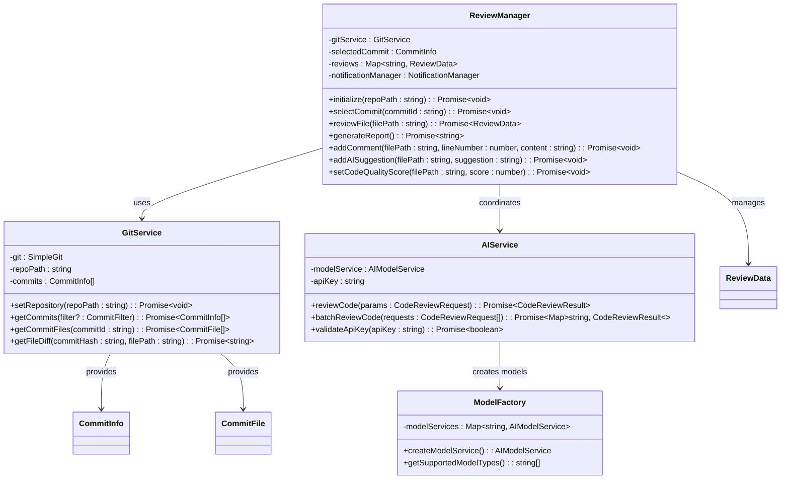

# System Relationships

<cite>
**Referenced Files in This Document**
- [extension.ts](file://src/extension.ts)
- [reviewManager.ts](file://src/services/review/reviewManager.ts)
- [aiService.ts](file://src/services/ai/aiService.ts)
- [gitService.ts](file://src/services/git/gitService.ts)
- [modelFactory.ts](file://src/models/modelFactory.ts)
- [commitExplorer.ts](file://src/ui/components/commitExplorer.ts)
- [fileExplorer.ts](file://src/ui/components/fileExplorer.ts)
- [reviewTypes.ts](file://src/core/review/reviewTypes.ts)
- [versionControlTypes.ts](file://src/services/git/versionControlTypes.ts)
- [types.ts](file://src/models/types.ts)
- [modelInterface.ts](file://src/models/modelInterface.ts)
- [baseModel.ts](file://src/models/baseModel.ts)
</cite>

## Table of Contents
1. [Introduction](#introduction)
2. [Architecture Overview](#architecture-overview)
3. [Extension Entry Point](#extension-entry-point)
4. [Core Component Relationships](#core-component-relationships)
5. [Domain Models](#domain-models)
6. [Invocation Workflows](#invocation-workflows)
7. [Integration Patterns](#integration-patterns)
8. [Common Issues and Solutions](#common-issues-and-solutions)
9. [Performance Considerations](#performance-considerations)
10. [Conclusion](#conclusion)

## Introduction

The CodeKarmic architecture demonstrates a sophisticated integration of multiple specialized services to provide comprehensive code review capabilities within Visual Studio Code. The system follows a modular design pattern where the extension entry point serves as the orchestrator, coordinating between the ReviewManager, AIService, GitService, and UI components through well-defined interfaces and domain models.

This architecture emphasizes loose coupling between components while maintaining strong cohesion within each module. The system supports multiple review modes including Git commit-based reviews, file/folder exploration, real-time editing, and domain-specific analysis, all unified under a common framework.

## Architecture Overview

The CodeKarmic system follows a layered architecture with clear separation of concerns:

**Diagram sources**
- [extension.ts](file://src/extension.ts#L1-L50)
- [reviewManager.ts](file://src/services/review/reviewManager.ts#L80-L120)
- [aiService.ts](file://src/services/ai/aiService.ts#L40-L80)
- [gitService.ts](file://src/services/git/gitService.ts#L45-L85)

## Extension Entry Point

The extension entry point serves as the central coordination hub, initializing and wiring up all core components during activation. The initialization process follows a specific sequence to ensure proper dependency resolution and service availability.

**Diagram sources**
- [extension.ts](file://src/extension.ts#L20-L70)

The extension initialization ensures that:
- Notification management is established for user feedback
- Model configuration is validated before proceeding
- Shared Git service instances are created for consistency
- Review manager coordinates between Git and AI services
- UI components are registered for user interaction

**Section sources**
- [extension.ts](file://src/extension.ts#L20-L70)

## Core Component Relationships

### ReviewManager Orchestration

The ReviewManager acts as the primary orchestrator, managing the review workflow and coordinating between GitService and AIService. It maintains state for selected commits, review data, and manages the overall review lifecycle.

**Diagram sources**
- [reviewManager.ts](file://src/services/review/reviewManager.ts#L79-L120)
- [gitService.ts](file://src/services/git/gitService.ts#L45-L85)
- [aiService.ts](file://src/services/ai/aiService.ts#L40-L80)
- [modelFactory.ts](file://src/models/modelFactory.ts#L19-L50)

### AIService Coordination

The AIService serves as a facade for AI model interactions, delegating to dynamically created model instances via the ModelFactory. It handles API key validation, request batching, and response processing.

**Diagram sources**
- [aiService.ts](file://src/services/ai/aiService.ts#L74-L120)
- [modelFactory.ts](file://src/models/modelFactory.ts#L58-L95)

**Section sources**
- [reviewManager.ts](file://src/services/review/reviewManager.ts#L79-L120)
- [aiService.ts](file://src/services/ai/aiService.ts#L40-L80)
- [modelFactory.ts](file://src/models/modelFactory.ts#L19-L50)

## Domain Models

### Core Data Structures

The system relies on several key domain models that flow between components, ensuring type safety and clear data contracts.

| Model | Purpose | Key Properties | Flow Direction |
|-------|---------|----------------|----------------|
| **CommitInfo** | Git commit metadata | hash, date, message, author | GitService → ReviewManager |
| **CommitFile** | File changes in commit | path, content, status, diffs | GitService → ReviewManager |
| **CodeReviewRequest** | AI analysis input | filePath, currentContent, diffContent | ReviewManager → AIService |
| **CodeReviewResult** | AI analysis output | suggestions, score, diffContent | AIService → ReviewManager |
| **ReviewData** | Complete review state | commitId, filePath, comments, suggestions | ReviewManager internal |

### Model Relationships

**Diagram sources**
- [versionControlTypes.ts](file://src/services/git/versionControlTypes.ts#L8-L25)
- [reviewTypes.ts](file://src/core/review/reviewTypes.ts#L24-L75)
- [reviewManager.ts](file://src/services/review/reviewManager.ts#L11-L27)

**Section sources**
- [versionControlTypes.ts](file://src/services/git/versionControlTypes.ts#L8-L25)
- [reviewTypes.ts](file://src/core/review/reviewTypes.ts#L24-L75)
- [reviewManager.ts](file://src/services/review/reviewManager.ts#L11-L27)

## Invocation Workflows

### Starting a Code Review

The workflow for initiating a code review demonstrates the coordinated interaction between multiple components:

**Diagram sources**
- [extension.ts](file://src/extension.ts#L102-L139)
- [reviewManager.ts](file://src/services/review/reviewManager.ts#L149-L207)
- [commitExplorer.ts](file://src/ui/components/commitExplorer.ts#L36-L115)

### Processing a Commit

When processing a specific commit, the system follows a structured workflow:

**Diagram sources**
- [reviewManager.ts](file://src/services/review/reviewManager.ts#L289-L370)
- [aiService.ts](file://src/services/ai/aiService.ts#L74-L120)

### Generating a Report

The report generation workflow showcases batch processing and result aggregation:

**Diagram sources**
- [reviewManager.ts](file://src/services/review/reviewManager.ts#L372-L648)
- [aiService.ts](file://src/services/ai/aiService.ts#L431-L552)

**Section sources**
- [extension.ts](file://src/extension.ts#L102-L139)
- [reviewManager.ts](file://src/services/review/reviewManager.ts#L289-L370)
- [reviewManager.ts](file://src/services/review/reviewManager.ts#L372-L648)

## Integration Patterns

### Command Pattern Implementation

The extension uses VS Code's command pattern extensively for user interactions:

**Diagram sources**
- [extension.ts](file://src/extension.ts#L82-L244)

### Observer Pattern for UI Updates

The UI components utilize the observer pattern for reactive updates:

**Diagram sources**
- [commitExplorer.ts](file://src/ui/components/commitExplorer.ts#L5-L15)
- [fileExplorer.ts](file://src/ui/components/fileExplorer.ts#L6-L15)

**Section sources**
- [extension.ts](file://src/extension.ts#L82-L244)
- [commitExplorer.ts](file://src/ui/components/commitExplorer.ts#L5-L15)
- [fileExplorer.ts](file://src/ui/components/fileExplorer.ts#L6-L15)

## Common Issues and Solutions

### API Key Configuration Issues

**Problem**: AI service fails due to missing or invalid API key.

**Solution**: The system implements a cascading validation approach:

**Diagram sources**
- [extension.ts](file://src/extension.ts#L141-L184)
- [aiService.ts](file://src/services/ai/aiService.ts#L712-L732)

### Git Repository Detection Issues

**Problem**: Extension fails to detect Git repositories or encounters permission issues.

**Solution**: Multi-layered detection with fallback mechanisms:

| Detection Method | Priority | Fallback |
|------------------|----------|----------|
| VS Code Git Extension API | Highest | Direct Git commands |
| SimpleGit library | Medium | Manual git CLI |
| File system checks | Lowest | Error reporting |

### Memory Management for Large Files

**Problem**: Processing large files causes memory exhaustion.

**Solution**: Intelligent compression and streaming:

**Diagram sources**
- [baseModel.ts](file://src/models/baseModel.ts#L20-L60)
- [aiService.ts](file://src/services/ai/aiService.ts#L413-L424)

**Section sources**
- [extension.ts](file://src/extension.ts#L141-L184)
- [gitService.ts](file://src/services/git/gitService.ts#L67-L108)
- [baseModel.ts](file://src/models/baseModel.ts#L20-L60)

## Performance Considerations

### Concurrent Processing Strategy

The system implements several strategies for optimal performance:

1. **Batch Processing**: Files are processed in configurable batches (default: 5 files)
2. **Parallel Execution**: Multiple AI requests can be processed concurrently
3. **Caching**: Git diffs and AI responses are cached to avoid redundant operations
4. **Lazy Loading**: UI components load data on-demand rather than pre-loading

### Resource Management

| Resource Type | Management Strategy | Benefits |
|---------------|-------------------|----------|
| **Memory** | Content compression, streaming | Reduces memory footprint |
| **Network** | Request batching, caching | Minimizes API calls |
| **CPU** | Parallel processing, lazy loading | Optimizes computation |
| **Storage** | Report generation, temporary files | Efficient data persistence |

### Scalability Patterns

The architecture supports horizontal scaling through:
- Stateless service design
- Configurable batch sizes
- Pluggable model providers
- Asynchronous processing patterns

## Conclusion

The CodeKarmic architecture demonstrates a well-designed system that successfully integrates multiple specialized services while maintaining clear separation of concerns. The extension entry point effectively coordinates between ReviewManager, AIService, GitService, and UI components through well-defined interfaces and domain models.

Key architectural strengths include:
- **Modular Design**: Clear separation between UI, business logic, and external services
- **Flexible Workflow**: Support for multiple review modes and integration patterns
- **Robust Error Handling**: Comprehensive error handling and recovery mechanisms
- **Performance Optimization**: Intelligent caching, batching, and resource management
- **Extensibility**: Plugin architecture for AI models and review modes

The system's design enables easy maintenance, testing, and future enhancements while providing a seamless user experience for code review workflows. The use of domain models ensures type safety and clear data contracts between components, while the command and observer patterns provide responsive UI interactions.

This architecture serves as an excellent example of how to build complex integrated systems within the VS Code extension ecosystem, balancing functionality, performance, and maintainability.