# Technical Architecture

<cite>
**Referenced Files in This Document**
- [extension.ts](file://src/extension.ts)
- [appConfig.ts](file://src/config/appConfig.ts)
- [reviewManager.ts](file://src/services/review/reviewManager.ts)
- [gitService.ts](file://src/services/git/gitService.ts)
- [aiService.ts](file://src/services/ai/aiService.ts)
- [modelFactory.ts](file://src/models/modelFactory.ts)
- [baseModel.ts](file://src/models/baseModel.ts)
- [reviewPanel.ts](file://src/ui/views/reviewPanel.ts)
- [modelInterface.ts](file://src/models/modelInterface.ts)
- [logger.ts](file://src/utils/logger.ts)
- [notificationManager.ts](file://src/services/notification/notificationManager.ts)
- [package.json](file://package.json)
- [tsconfig.json](file://tsconfig.json)
</cite>

## Table of Contents
1. [Introduction](#introduction)
2. [System Overview](#system-overview)
3. [Architectural Patterns](#architectural-patterns)
4. [Component Architecture](#component-architecture)
5. [Data Flow Architecture](#data-flow-architecture)
6. [Technology Stack](#technology-stack)
7. [Cross-Cutting Concerns](#cross-cutting-concerns)
8. [Scalability Considerations](#scalability-considerations)
9. [Performance Analysis](#performance-analysis)
10. [Integration Points](#integration-points)
11. [Conclusion](#conclusion)

## Introduction

CodeKarmic is a sophisticated VS Code extension that provides AI-powered code review capabilities for Git repositories. Built as a hybrid architecture combining MVC principles with service-oriented design, it offers seamless integration between UI presentation, business logic, and external AI services while maintaining clean separation of concerns.

The system leverages TypeScript for type-safe development, employs modern design patterns including Singleton, Factory, and Observer patterns, and integrates with multiple AI providers through a flexible model abstraction layer. Its architecture emphasizes modularity, extensibility, and performance optimization for handling large repositories and extensive codebases.

## System Overview

CodeKarmic operates as a VS Code extension with a layered architecture that separates presentation, business logic, and service concerns. The system provides comprehensive code review capabilities through Git integration, AI analysis, and interactive UI components.

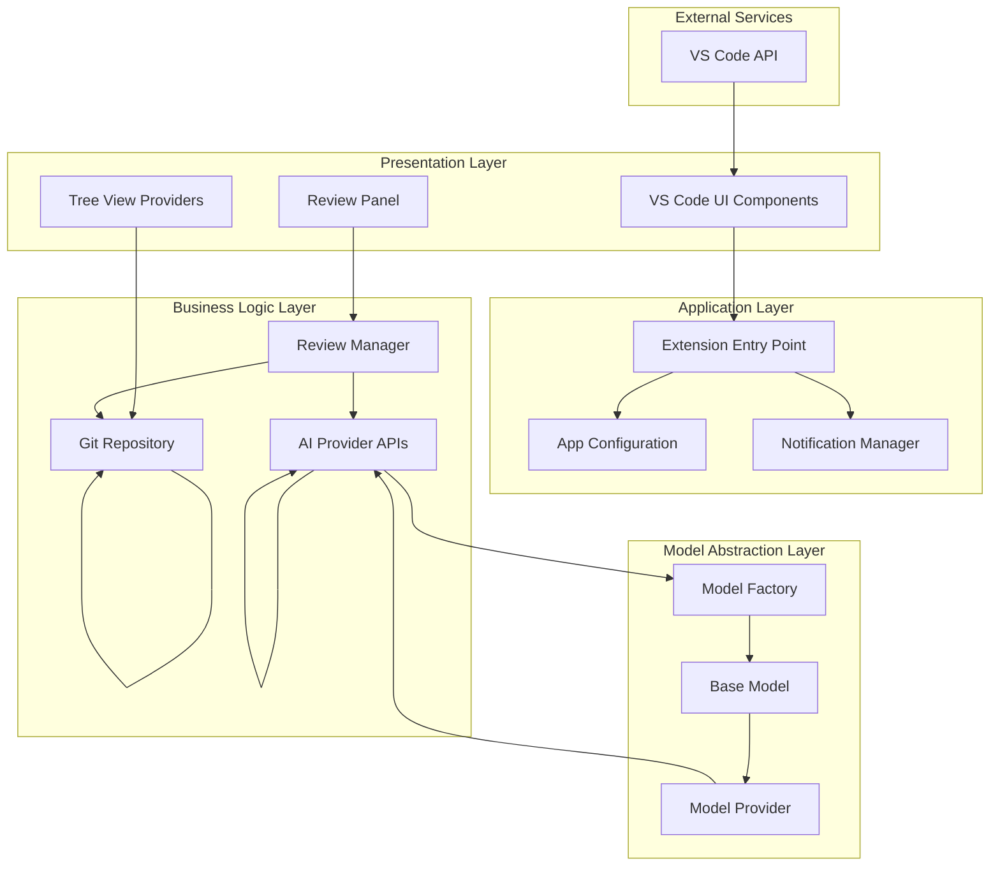
```mermaid
graph TB
subgraph "Presentation Layer"
UI[VS Code UI Components]
Panel[Review Panel]
Tree[Tree View Providers]
end
subgraph "Application Layer"
Ext[Extension Entry Point]
Config[App Configuration]
Notif[Notification Manager]
end
subgraph "Business Logic Layer"
RM[Review Manager]
Git[Git Service]
AI[Ai Service]
end
subgraph "Model Abstraction Layer"
MF[Model Factory]
BM[Base Model]
MP[Model Provider]
end
subgraph "External Services"
VS[VS Code API]
Git[Git Repository]
AI[AI Provider APIs]
end
UI --> Ext
Panel --> RM
Tree --> Git
Ext --> Config
Ext --> Notif
RM --> Git
RM --> AI
AI --> MF
MF --> BM
BM --> MP
MP --> AI
VS --> UI
Git --> Git
AI --> AI
```

**Diagram sources**
- [extension.ts](file://src/extension.ts#L20-L920)
- [reviewManager.ts](file://src/services/review/reviewManager.ts#L79-L854)
- [gitService.ts](file://src/services/git/gitService.ts#L45-L1201)
- [aiService.ts](file://src/services/ai/aiService.ts#L40-L787)

**Section sources**
- [extension.ts](file://src/extension.ts#L20-L920)
- [package.json](file://package.json#L1-L311)

## Architectural Patterns

### Singleton Pattern - AppConfig

The application configuration follows the Singleton pattern to ensure centralized access to settings throughout the application lifecycle.

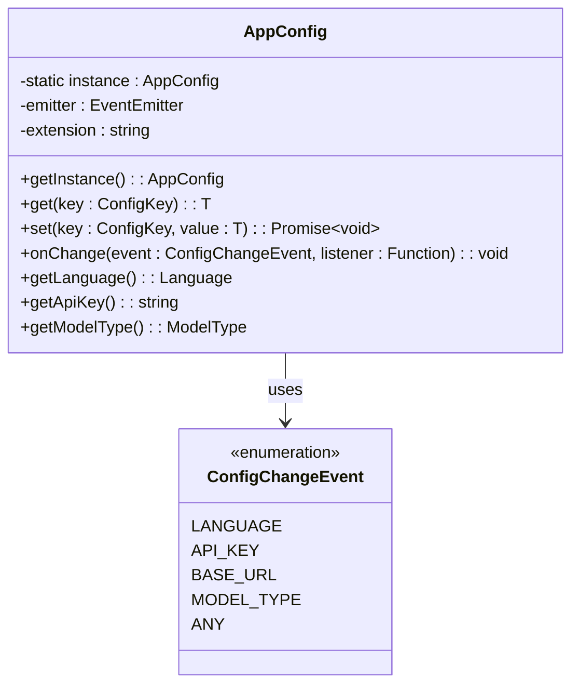
```mermaid
classDiagram
class AppConfig {
-static instance : AppConfig
-emitter : EventEmitter
-extension : string
+getInstance() : AppConfig
+get(key : ConfigKey) : T
+set(key : ConfigKey, value : T) : Promise~void~
+onChange(event : ConfigChangeEvent, listener : Function) : void
+getLanguage() : Language
+getApiKey() : string
+getModelType() : ModelType
}
class ConfigChangeEvent {
<<enumeration>>
LANGUAGE
API_KEY
BASE_URL
MODEL_TYPE
ANY
}
AppConfig --> ConfigChangeEvent : uses
```

**Diagram sources**
- [appConfig.ts](file://src/config/appConfig.ts#L49-L189)

### Factory Pattern - ModelFactory

The ModelFactory implements the Factory pattern to create and manage AI model service instances dynamically based on configuration.

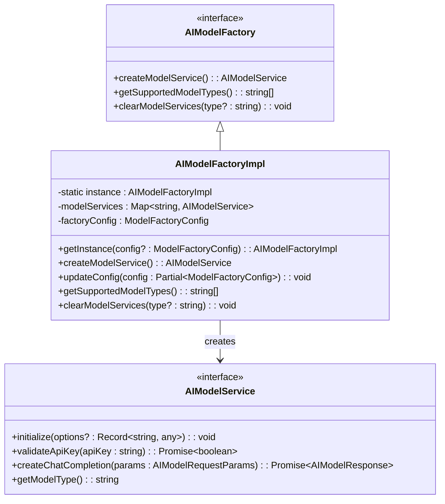
```mermaid
classDiagram
class AIModelFactory {
<<interface>>
+createModelService() : AIModelService
+getSupportedModelTypes() : string[]
+clearModelServices(type? : string) : void
}
class AIModelFactoryImpl {
-static instance : AIModelFactoryImpl
-modelServices : Map~string, AIModelService~
-factoryConfig : ModelFactoryConfig
+getInstance(config? : ModelFactoryConfig) : AIModelFactoryImpl
+createModelService() : AIModelService
+updateConfig(config : Partial~ModelFactoryConfig~) : void
+getSupportedModelTypes() : string[]
+clearModelServices(type? : string) : void
}
class AIModelService {
<<interface>>
+initialize(options? : Record~string, any~) : void
+validateApiKey(apiKey : string) : Promise~boolean~
+createChatCompletion(params : AIModelRequestParams) : Promise~AIModelResponse~
+getModelType() : string
}
AIModelFactory <|-- AIModelFactoryImpl
AIModelFactoryImpl --> AIModelService : creates
```

**Diagram sources**
- [modelFactory.ts](file://src/models/modelFactory.ts#L19-L140)
- [modelInterface.ts](file://src/models/modelInterface.ts#L123-L139)

### Observer Pattern - Event Emission

The system employs the Observer pattern through EventEmitter for configuration change notifications and service communication.

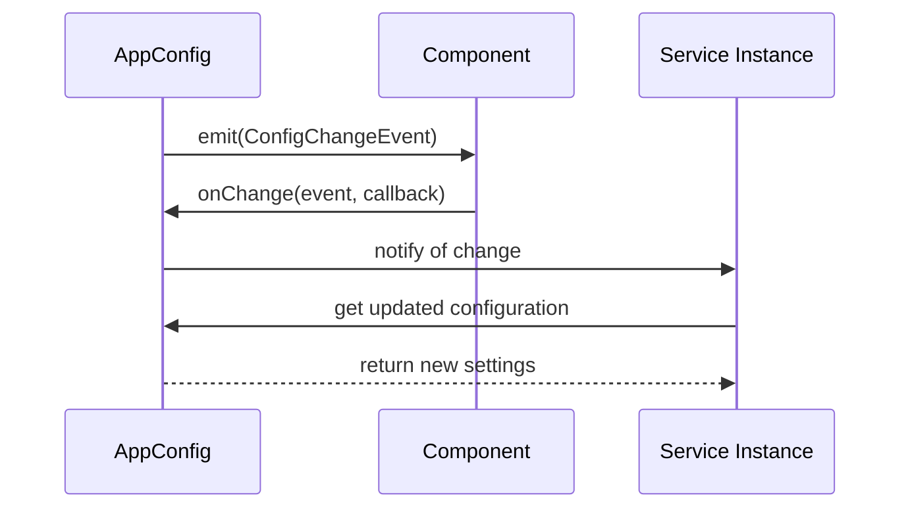
```mermaid
sequenceDiagram
participant Config as AppConfig
participant Listener as Component
participant Service as Service Instance
Config->>Listener : emit(ConfigChangeEvent)
Listener->>Config : onChange(event, callback)
Config->>Service : notify of change
Service->>Config : get updated configuration
Config-->>Service : return new settings
```

**Diagram sources**
- [appConfig.ts](file://src/config/appConfig.ts#L56-L77)

### Dependency Injection

Services are injected through constructor parameters and factory creation, enabling loose coupling and testability.

**Section sources**
- [appConfig.ts](file://src/config/appConfig.ts#L49-L189)
- [modelFactory.ts](file://src/models/modelFactory.ts#L19-L140)
- [reviewManager.ts](file://src/services/review/reviewManager.ts#L89-L93)

## Component Architecture

### Extension Entry Point

The extension initialization orchestrates service creation and command registration, establishing the foundation for all subsequent operations.

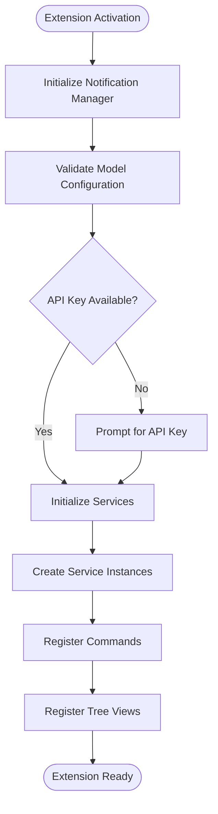
```mermaid
flowchart TD
Start([Extension Activation]) --> InitNotif["Initialize Notification Manager"]
InitNotif --> ValidateModel["Validate Model Configuration"]
ValidateModel --> CheckAPI{"API Key Available?"}
CheckAPI --> |No| PromptAPI["Prompt for API Key"]
CheckAPI --> |Yes| InitServices["Initialize Services"]
PromptAPI --> InitServices
InitServices --> CreateInstances["Create Service Instances"]
CreateInstances --> RegisterCommands["Register Commands"]
RegisterCommands --> RegisterViews["Register Tree Views"]
RegisterViews --> Ready([Extension Ready])
```

**Diagram sources**
- [extension.ts](file://src/extension.ts#L20-L920)

### Review Manager Orchestration

The ReviewManager serves as the central orchestrator, coordinating between Git operations, AI analysis, and UI updates.

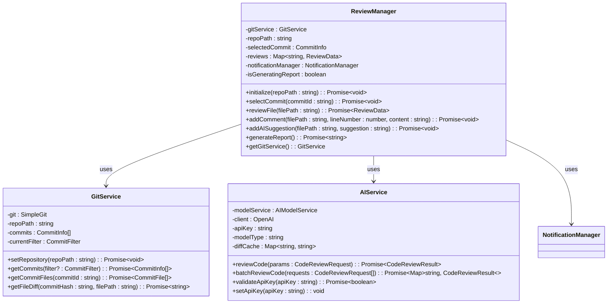
```mermaid
classDiagram
class ReviewManager {
-gitService : GitService
-repoPath : string
-selectedCommit : CommitInfo
-reviews : Map~string, ReviewData~
-notificationManager : NotificationManager
-isGeneratingReport : boolean
+initialize(repoPath : string) : Promise~void~
+selectCommit(commitId : string) : Promise~void~
+reviewFile(filePath : string) : Promise~ReviewData~
+addComment(filePath : string, lineNumber : number, content : string) : Promise~void~
+addAISuggestion(filePath : string, suggestion : string) : Promise~void~
+generateReport() : Promise~string~
+getGitService() : GitService
}
class GitService {
-git : SimpleGit
-repoPath : string
-commits : CommitInfo[]
-currentFilter : CommitFilter
+setRepository(repoPath : string) : Promise~void~
+getCommits(filter? : CommitFilter) : Promise~CommitInfo[]~
+getCommitFiles(commitId : string) : Promise~CommitFile[]~
+getFileDiff(commitHash : string, filePath : string) : Promise~string~
}
class AIService {
-modelService : AIModelService
-client : OpenAI
-apiKey : string
-modelType : string
-diffCache : Map~string, string~
+reviewCode(params : CodeReviewRequest) : Promise~CodeReviewResult~
+batchReviewCode(requests : CodeReviewRequest[]) : Promise~Map~string, CodeReviewResult~~
+validateApiKey(apiKey : string) : Promise~boolean~
+setApiKey(apiKey : string) : void
}
ReviewManager --> GitService : uses
ReviewManager --> AIService : uses
ReviewManager --> NotificationManager : uses
```

**Diagram sources**
- [reviewManager.ts](file://src/services/review/reviewManager.ts#L79-L854)
- [gitService.ts](file://src/services/git/gitService.ts#L45-L1201)
- [aiService.ts](file://src/services/ai/aiService.ts#L40-L787)

### AI Service Architecture

The AI service provides intelligent code analysis through multiple analysis strategies and batch processing capabilities.

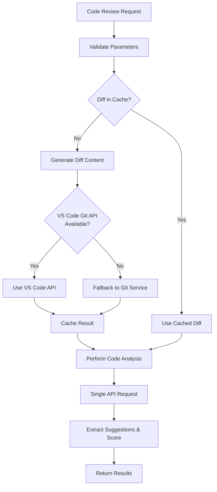
```mermaid
flowchart TD
Request[Code Review Request] --> Validate["Validate Parameters"]
Validate --> CheckCache{"Diff in Cache?"}
CheckCache --> |Yes| UseCache["Use Cached Diff"]
CheckCache --> |No| GenDiff["Generate Diff Content"]
GenDiff --> VSCodeAPI{"VS Code Git API<br/>Available?"}
VSCodeAPI --> |Yes| UseVSCode["Use VS Code API"]
VSCodeAPI --> |No| FallbackGit["Fallback to Git Service"]
UseVSCode --> CacheResult["Cache Result"]
FallbackGit --> CacheResult
CacheResult --> Analyze["Perform Code Analysis"]
Analyze --> SingleRequest["Single API Request"]
SingleRequest --> Extract["Extract Suggestions & Score"]
Extract --> Return["Return Results"]
UseCache --> Analyze
```

**Diagram sources**
- [aiService.ts](file://src/services/ai/aiService.ts#L74-L787)

### UI Component Architecture

The review panel provides an interactive webview interface for displaying code reviews and managing feedback.

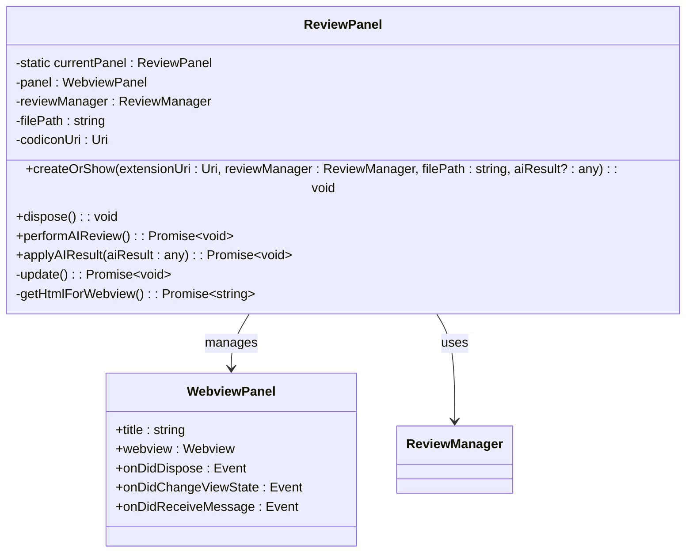
```mermaid
classDiagram
class ReviewPanel {
-static currentPanel : ReviewPanel
-panel : WebviewPanel
-reviewManager : ReviewManager
-filePath : string
-codiconUri : Uri
+createOrShow(extensionUri : Uri, reviewManager : ReviewManager, filePath : string, aiResult? : any) : void
+dispose() : void
+performAIReview() : Promise~void~
+applyAIResult(aiResult : any) : Promise~void~
-update() : Promise~void~
-getHtmlForWebview() : Promise~string~
}
class WebviewPanel {
+title : string
+webview : Webview
+onDidDispose : Event
+onDidChangeViewState : Event
+onDidReceiveMessage : Event
}
ReviewPanel --> WebviewPanel : manages
ReviewPanel --> ReviewManager : uses
```

**Diagram sources**
- [reviewPanel.ts](file://src/ui/views/reviewPanel.ts#L5-L621)

**Section sources**
- [extension.ts](file://src/extension.ts#L20-L920)
- [reviewManager.ts](file://src/services/review/reviewManager.ts#L79-L854)
- [aiService.ts](file://src/services/ai/aiService.ts#L40-L787)
- [reviewPanel.ts](file://src/ui/views/reviewPanel.ts#L5-L621)

## Data Flow Architecture

### Command Processing Pipeline

The system processes user commands through a structured pipeline that handles validation, service orchestration, and result presentation.

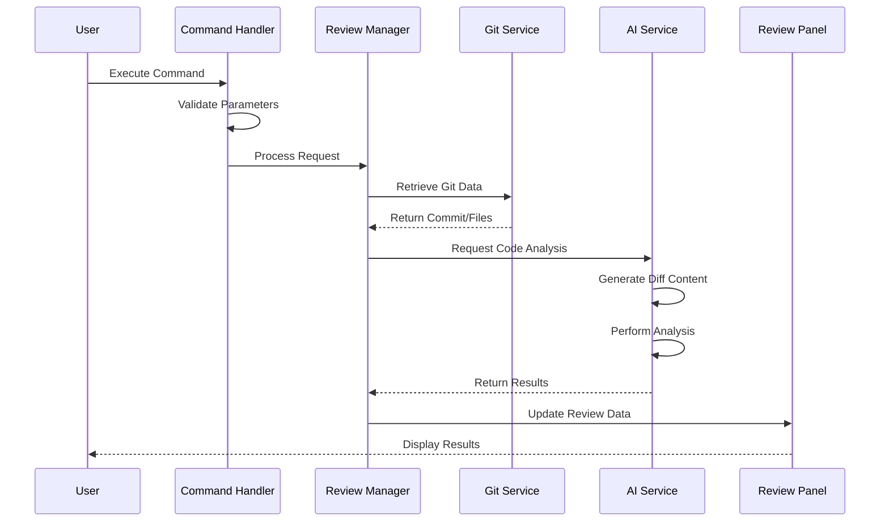
```mermaid
sequenceDiagram
participant User as User
participant Cmd as Command Handler
participant RM as Review Manager
participant Git as Git Service
participant AI as AI Service
participant UI as Review Panel
User->>Cmd : Execute Command
Cmd->>Cmd : Validate Parameters
Cmd->>RM : Process Request
RM->>Git : Retrieve Git Data
Git-->>RM : Return Commit/Files
RM->>AI : Request Code Analysis
AI->>AI : Generate Diff Content
AI->>AI : Perform Analysis
AI-->>RM : Return Results
RM->>UI : Update Review Data
UI-->>User : Display Results
```

**Diagram sources**
- [extension.ts](file://src/extension.ts#L102-L185)
- [reviewManager.ts](file://src/services/review/reviewManager.ts#L229-L262)
- [aiService.ts](file://src/services/ai/aiService.ts#L74-L119)

### Git Retrieval and AI Processing Flow

The core workflow demonstrates how Git data flows through the system for AI analysis.

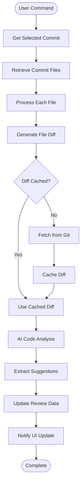
```mermaid
flowchart TD
Start([User Command]) --> GetCommit["Get Selected Commit"]
GetCommit --> GetFiles["Retrieve Commit Files"]
GetFiles --> ProcessFiles["Process Each File"]
ProcessFiles --> GenDiff["Generate File Diff"]
GenDiff --> CheckCache{"Diff Cached?"}
CheckCache --> |Yes| UseCached["Use Cached Diff"]
CheckCache --> |No| FetchDiff["Fetch from Git"]
FetchDiff --> CacheDiff["Cache Diff"]
CacheDiff --> UseCached
UseCached --> AIAnalysis["AI Code Analysis"]
AIAnalysis --> ExtractSuggestions["Extract Suggestions"]
ExtractSuggestions --> UpdateReviews["Update Review Data"]
UpdateReviews --> NotifyUI["Notify UI Update"]
NotifyUI --> End([Complete])
```

**Diagram sources**
- [reviewManager.ts](file://src/services/review/reviewManager.ts#L372-L661)
- [aiService.ts](file://src/services/ai/aiService.ts#L125-L239)

### Batch Processing Architecture

For large repositories, the system implements efficient batch processing to optimize performance and reduce API calls.

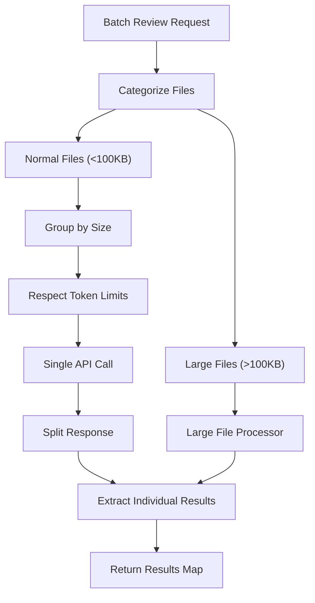
```mermaid
flowchart TD
BatchReq[Batch Review Request] --> Categorize["Categorize Files"]
Categorize --> LargeFiles["Large Files (>100KB)"]
Categorize --> NormalFiles["Normal Files (<100KB)"]
LargeFiles --> LargeProcessor["Large File Processor"]
NormalFiles --> BatchGroup["Group by Size"]
BatchGroup --> MaxTokens["Respect Token Limits"]
MaxTokens --> APICall["Single API Call"]
APICall --> SplitResponse["Split Response"]
SplitResponse --> ExtractResults["Extract Individual Results"]
LargeProcessor --> ExtractResults
ExtractResults --> ReturnResults["Return Results Map"]
```

**Diagram sources**
- [aiService.ts](file://src/services/ai/aiService.ts#L431-L552)

**Section sources**
- [extension.ts](file://src/extension.ts#L102-L185)
- [reviewManager.ts](file://src/services/review/reviewManager.ts#L372-L661)
- [aiService.ts](file://src/services/ai/aiService.ts#L431-L552)

## Technology Stack

### Core Technologies

The CodeKarmic system is built on a robust technology foundation that ensures reliability, performance, and maintainability.

| Technology | Version | Purpose | Integration |
|------------|---------|---------|-------------|
| TypeScript | ESNext | Programming language | Full stack implementation |
| VS Code API | ^1.85.0 | Extension framework | UI components, commands |
| OpenAI SDK | ^4.20.0 | AI integration | Code analysis |
| simple-git | Latest | Git operations | Repository interaction |
| Webpack | ^5.89.0 | Build pipeline | Module bundling |
| Node.js | 16.x+ | Runtime environment | Extension execution |

### Development Tools

| Tool | Purpose | Configuration |
|------|---------|---------------|
| ESLint | Code quality | @typescript-eslint plugin |
| Prettier | Code formatting | Standard configuration |
| TypeScript Compiler | Type checking | Strict mode enabled |
| Webpack | Module bundling | Production/development builds |

### Architecture Dependencies

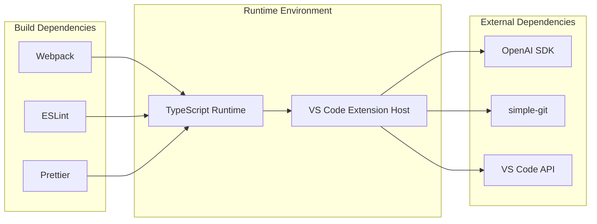
```mermaid
graph LR
subgraph "Runtime Environment"
TS[TypeScript Runtime]
VS[VS Code Extension Host]
end
subgraph "External Dependencies"
OpenAI[OpenAI SDK]
SimpleGit[simple-git]
VSCodeAPI[VS Code API]
end
subgraph "Build Dependencies"
Webpack[Webpack]
ESLint[ESLint]
Prettier[Prettier]
end
TS --> VS
VS --> VSCodeAPI
VS --> OpenAI
VS --> SimpleGit
Webpack --> TS
ESLint --> TS
Prettier --> TS
```

**Diagram sources**
- [package.json](file://package.json#L293-L310)
- [tsconfig.json](file://tsconfig.json#L1-L19)

**Section sources**
- [package.json](file://package.json#L293-L310)
- [tsconfig.json](file://tsconfig.json#L1-L19)

## Cross-Cutting Concerns

### Configuration Management

The AppConfig singleton provides centralized configuration management with real-time change notifications and type safety.

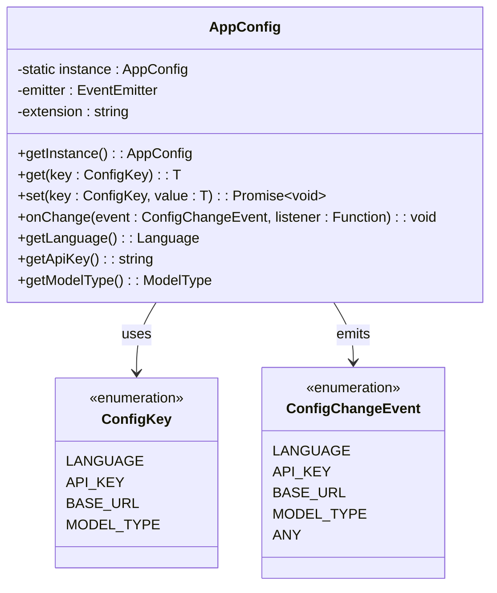
```mermaid
classDiagram
class AppConfig {
-static instance : AppConfig
-emitter : EventEmitter
-extension : string
+getInstance() : AppConfig
+get(key : ConfigKey) : T
+set(key : ConfigKey, value : T) : Promise~void~
+onChange(event : ConfigChangeEvent, listener : Function) : void
+getLanguage() : Language
+getApiKey() : string
+getModelType() : ModelType
}
class ConfigKey {
<<enumeration>>
LANGUAGE
API_KEY
BASE_URL
MODEL_TYPE
}
class ConfigChangeEvent {
<<enumeration>>
LANGUAGE
API_KEY
BASE_URL
MODEL_TYPE
ANY
}
AppConfig --> ConfigKey : uses
AppConfig --> ConfigChangeEvent : emits
```

**Diagram sources**
- [appConfig.ts](file://src/config/appConfig.ts#L22-L189)

### Error Handling Strategy

The system implements comprehensive error handling with graceful degradation and user-friendly error reporting.

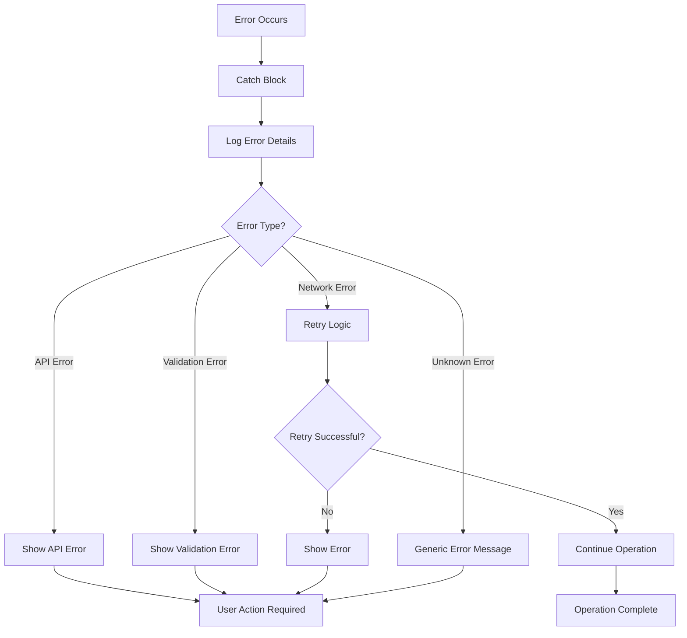
```mermaid
flowchart TD
Error[Error Occurs] --> Catch["Catch Block"]
Catch --> LogError["Log Error Details"]
LogError --> CheckType{"Error Type?"}
CheckType --> |API Error| ShowAPIError["Show API Error"]
CheckType --> |Validation Error| ShowValidationError["Show Validation Error"]
CheckType --> |Network Error| RetryLogic["Retry Logic"]
CheckType --> |Unknown Error| GenericError["Generic Error Message"]
RetryLogic --> RetrySuccess{"Retry Successful?"}
RetrySuccess --> |Yes| Continue["Continue Operation"]
RetrySuccess --> |No| ShowError["Show Error"]
ShowAPIError --> UserAction["User Action Required"]
ShowValidationError --> UserAction
ShowError --> UserAction
GenericError --> UserAction
Continue --> Success["Operation Complete"]
```

### Logging and Monitoring

The Logger utility provides structured logging with configurable levels and contextual information.

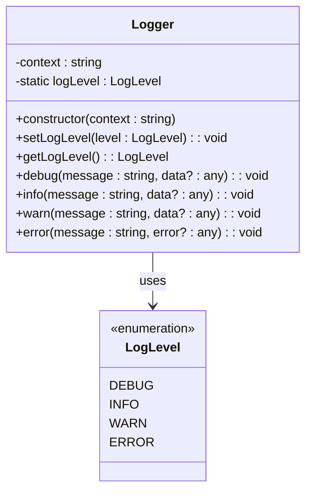
```mermaid
classDiagram
class Logger {
-context : string
-static logLevel : LogLevel
+constructor(context : string)
+setLogLevel(level : LogLevel) : void
+getLogLevel() : LogLevel
+debug(message : string, data? : any) : void
+info(message : string, data? : any) : void
+warn(message : string, data? : any) : void
+error(message : string, error? : any) : void
}
class LogLevel {
<<enumeration>>
DEBUG
INFO
WARN
ERROR
}
Logger --> LogLevel : uses
```

**Diagram sources**
- [logger.ts](file://src/utils/logger.ts#L8-L88)

### Notification Management

The NotificationManager coordinates user notifications, status bar updates, and output channel management.

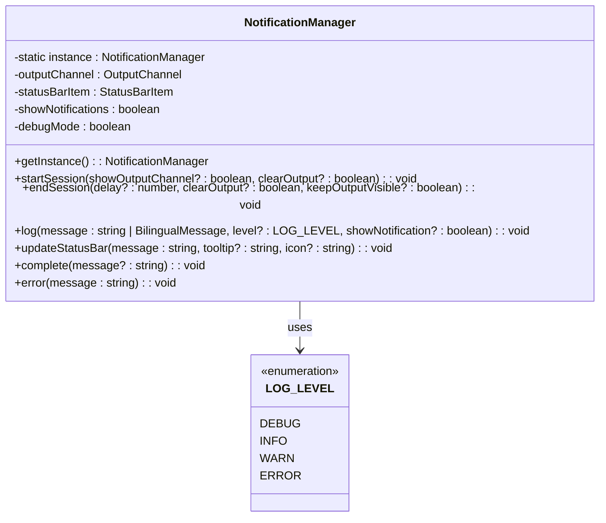
```mermaid
classDiagram
class NotificationManager {
-static instance : NotificationManager
-outputChannel : OutputChannel
-statusBarItem : StatusBarItem
-showNotifications : boolean
-debugMode : boolean
+getInstance() : NotificationManager
+startSession(showOutputChannel? : boolean, clearOutput? : boolean) : void
+endSession(delay? : number, clearOutput? : boolean, keepOutputVisible? : boolean) : void
+log(message : string | BilingualMessage, level? : LOG_LEVEL, showNotification? : boolean) : void
+updateStatusBar(message : string, tooltip? : string, icon? : string) : void
+complete(message? : string) : void
+error(message : string) : void
}
class LOG_LEVEL {
<<enumeration>>
DEBUG
INFO
WARN
ERROR
}
NotificationManager --> LOG_LEVEL : uses
```

**Diagram sources**
- [notificationManager.ts](file://src/services/notification/notificationManager.ts#L8-L213)

**Section sources**
- [appConfig.ts](file://src/config/appConfig.ts#L49-L189)
- [logger.ts](file://src/utils/logger.ts#L8-L88)
- [notificationManager.ts](file://src/services/notification/notificationManager.ts#L8-L213)

## Scalability Considerations

### Large Repository Handling

The system implements several strategies to handle large repositories efficiently:

#### File Size Management
- **Compression Threshold**: Files larger than 50KB automatically trigger compression
- **Batch Processing**: Large files processed separately from normal files
- **Token Limiting**: API requests limited to prevent exceeding model token limits

#### Memory Optimization
- **Lazy Loading**: Git data loaded on-demand rather than pre-loaded
- **Caching Strategy**: Intelligent caching of frequently accessed data
- **Disposable Resources**: Proper cleanup of unused resources and listeners

#### Concurrent Processing
- **Parallel File Analysis**: Multiple files analyzed concurrently within batch limits
- **Async Operations**: Non-blocking operations for Git and AI service calls
- **Progress Tracking**: Real-time progress updates for long-running operations

### Performance Optimization Strategies

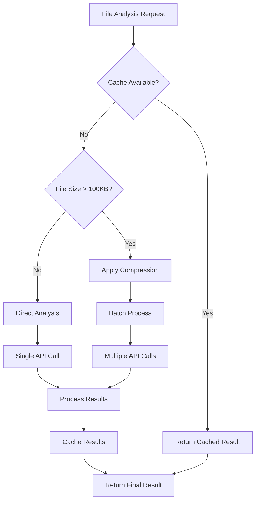
```mermaid
flowchart TD
Request[File Analysis Request] --> CheckCache{"Cache Available?"}
CheckCache --> |Yes| ReturnCached["Return Cached Result"]
CheckCache --> |No| CheckSize{"File Size > 100KB?"}
CheckSize --> |Yes| Compress["Apply Compression"]
CheckSize --> |No| DirectAnalysis["Direct Analysis"]
Compress --> BatchProcess["Batch Process"]
DirectAnalysis --> SingleCall["Single API Call"]
BatchProcess --> MultiCall["Multiple API Calls"]
SingleCall --> ProcessResult["Process Results"]
MultiCall --> ProcessResult
ProcessResult --> CacheResult["Cache Results"]
CacheResult --> Return["Return Final Result"]
ReturnCached --> Return
```

### AI Service Scaling

The AI service architecture supports scaling through:

- **Model Abstraction**: Easy switching between different AI providers
- **Request Batching**: Multiple files processed in single API calls when possible
- **Intelligent Retry**: Exponential backoff for failed requests
- **Rate Limiting**: Respectful API usage with configurable limits

**Section sources**
- [aiService.ts](file://src/services/ai/aiService.ts#L431-L552)
- [baseModel.ts](file://src/models/baseModel.ts#L17-L61)

## Performance Analysis

### Latency Optimization

The system implements several latency reduction strategies:

#### Git Operation Optimization
- **VS Code Git API Priority**: Prefer VS Code's native Git API for speed
- **Fallback Mechanisms**: Graceful fallback to simple-git when needed
- **Caching**: Diff content cached to avoid repeated Git operations

#### AI Response Optimization
- **Stream Processing**: Real-time streaming for long responses
- **Compression**: Content compression reduces API payload sizes
- **Batch Requests**: Multiple files processed in single API calls

### Resource Utilization

| Resource | Optimization Strategy | Impact |
|----------|----------------------|---------|
| Network Calls | Request batching, compression | Reduced API costs, faster responses |
| Memory Usage | Lazy loading, caching, cleanup | Lower memory footprint |
| CPU Usage | Parallel processing, async operations | Better responsiveness |
| Storage | Efficient caching, minimal persistence | Reduced disk usage |

### Performance Monitoring

The system includes built-in performance monitoring:

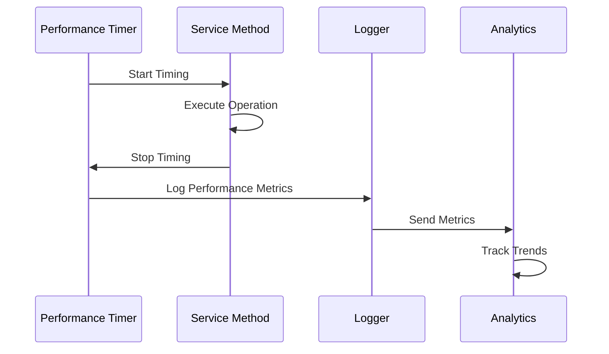
```mermaid
sequenceDiagram
participant Timer as Performance Timer
participant Service as Service Method
participant Logger as Logger
participant Analytics as Analytics
Timer->>Service : Start Timing
Service->>Service : Execute Operation
Service->>Timer : Stop Timing
Timer->>Logger : Log Performance Metrics
Logger->>Analytics : Send Metrics
Analytics->>Analytics : Track Trends
```

**Section sources**
- [aiService.ts](file://src/services/ai/aiService.ts#L125-L239)
- [gitService.ts](file://src/services/git/gitService.ts#L720-L794)

## Integration Points

### VS Code Extension API Integration

The system deeply integrates with VS Code's extension ecosystem:

#### Command Registration
- **Dynamic Commands**: Commands registered based on activation events
- **Context-Sensitive**: Commands appear based on current context
- **Keyboard Shortcuts**: Full keyboard navigation support

#### UI Integration
- **Tree Views**: Commit and file explorer views
- **Webview Panels**: Interactive review panels
- **Status Bar**: Progress indicators and notifications

#### Workspace Integration
- **Git Repository Detection**: Automatic repository detection
- **File Watching**: Changes detected in real-time
- **Settings Management**: Integrated configuration UI

### External Service Integration

#### AI Provider Integration
- **Model Abstraction**: Pluggable AI provider architecture
- **API Compatibility**: Standardized interface across providers
- **Fallback Support**: Automatic fallback to alternative providers

#### Git Integration
- **Native Git API**: Leverage VS Code's Git extension
- **Command Line Fallback**: Direct Git CLI usage when needed
- **Repository Management**: Automatic repository initialization

### Extension Lifecycle Management

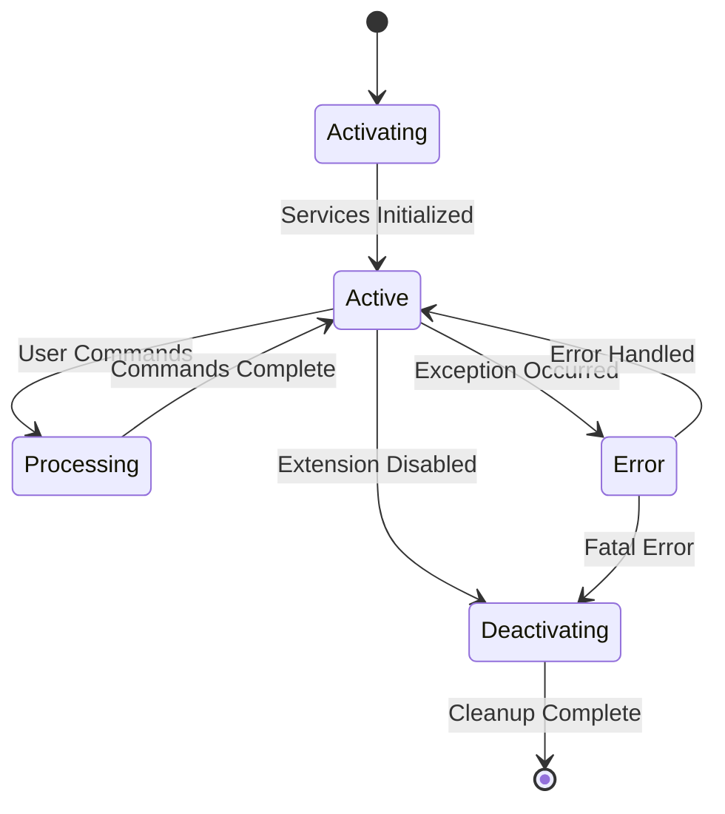
```mermaid
stateDiagram-v2
[*] --> Activating
Activating --> Active : Services Initialized
Active --> Processing : User Commands
Processing --> Active : Commands Complete
Active --> Deactivating : Extension Disabled
Deactivating --> [*] : Cleanup Complete
Active --> Error : Exception Occurred
Error --> Active : Error Handled
Error --> Deactivating : Fatal Error
```

**Section sources**
- [extension.ts](file://src/extension.ts#L20-L920)
- [reviewManager.ts](file://src/services/review/reviewManager.ts#L111-L129)

## Conclusion

CodeKarmic represents a sophisticated example of modern software architecture, successfully blending traditional MVC principles with contemporary service-oriented design. The system's hybrid architecture enables:

### Key Architectural Strengths

1. **Clean Separation of Concerns**: Clear boundaries between UI, business logic, and service layers
2. **Modular Design**: Independent components that can evolve independently
3. **Extensible Architecture**: Easy addition of new AI providers and functionality
4. **Performance Optimization**: Intelligent caching, batching, and resource management
5. **Developer Experience**: Comprehensive logging, error handling, and debugging tools

### Technical Excellence

The implementation demonstrates advanced TypeScript patterns, effective use of design patterns, and thoughtful consideration of cross-cutting concerns. The system's ability to handle large repositories efficiently while maintaining responsive user interactions showcases excellent performance engineering.

### Future Scalability

The architecture provides a solid foundation for future enhancements, including:
- Additional AI providers and models
- Enhanced caching strategies
- Distributed processing capabilities
- Advanced analytics and reporting features

CodeKarmic stands as an exemplary implementation of enterprise-grade software architecture, demonstrating how modern web technologies can be effectively applied to create powerful developer tools that enhance productivity while maintaining code quality standards.