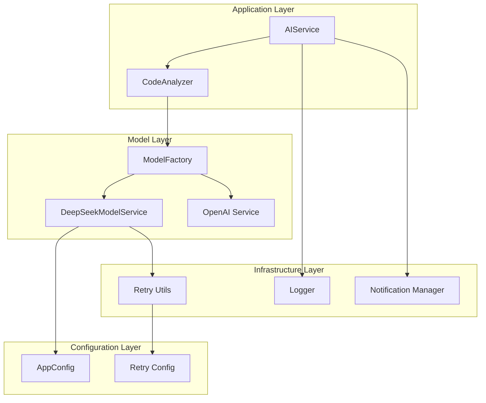
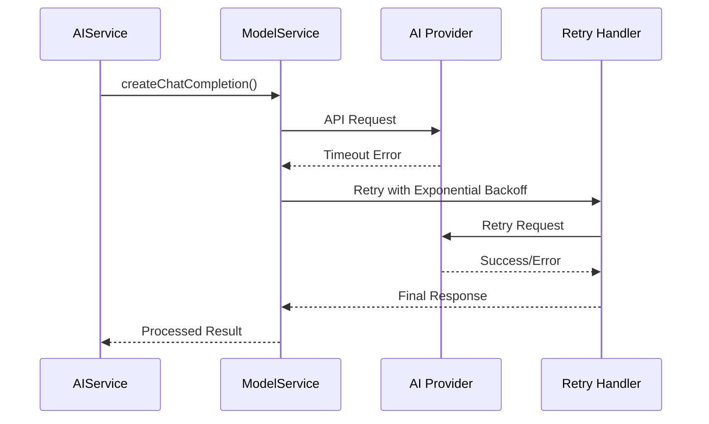
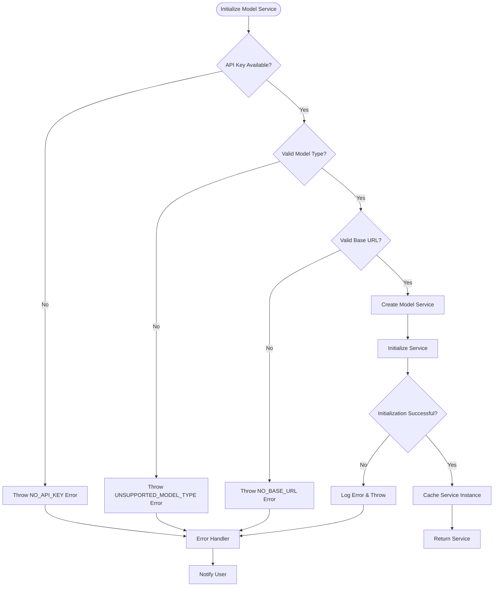
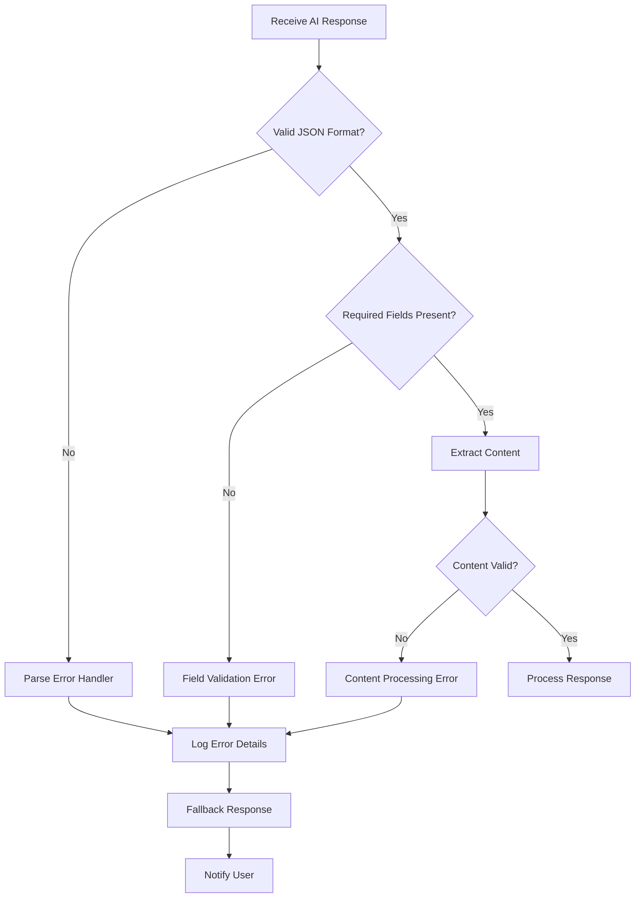
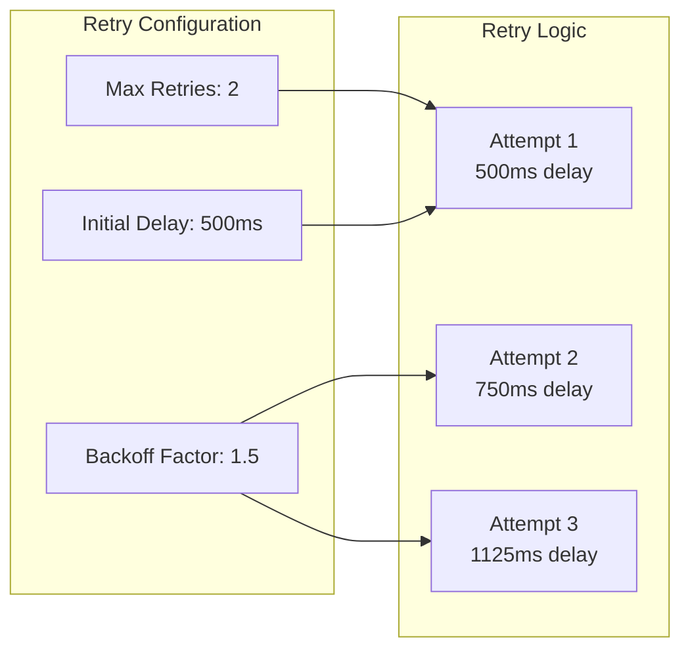

# AI Processing Errors

<cite>
**Referenced Files in This Document**
- [aiService.ts](file://src/services/ai/aiService.ts)
- [codeAnalyzer.ts](file://src/core/review/codeAnalyzer.ts)
- [deepseek.ts](file://src/models/providers/deepseek.ts)
- [modelFactory.ts](file://src/models/modelFactory.ts)
- [retryUtils.ts](file://src/utils/retryUtils.ts)
- [logger.ts](file://src/utils/logger.ts)
- [appConfig.ts](file://src/config/appConfig.ts)
- [notificationManager.ts](file://src/services/notification/notificationManager.ts)
- [output.ts](file://src/i18n/en/output.ts)
- [reviewTypes.ts](file://src/core/review/reviewTypes.ts)
- [types.ts](file://src/models/types.ts)
- [chatTypes.ts](file://src/models/chatTypes.ts)
</cite>

## Table of Contents
1. [Introduction](#introduction)
2. [Error Handling Architecture](#error-handling-architecture)
3. [Common AI Processing Errors](#common-ai-processing-errors)
4. [Error Scenarios and Solutions](#error-scenarios-and-solutions)
5. [Timeout and Rate Limiting](#timeout-and-rate-limiting)
6. [Model Initialization Failures](#model-initialization-failures)
7. [Response Parsing Errors](#response-parsing-errors)
8. [Troubleshooting Guide](#troubleshooting-guide)
9. [Performance Optimization](#performance-optimization)
10. [Best Practices](#best-practices)

## Introduction

CodeKarmic implements a comprehensive AI processing error handling system designed to gracefully manage various failure scenarios during code review operations. The system provides robust error detection, recovery mechanisms, and user feedback for AI-related issues including model service initialization failures, API timeouts, rate limiting, and response parsing errors.

The error handling architecture follows a layered approach with specialized handlers for different types of failures, comprehensive logging, and intelligent retry mechanisms to ensure reliable code review operations.

## Error Handling Architecture

CodeKarmic's AI error handling system consists of multiple layers that work together to provide comprehensive error management:



**Diagram sources**
- [aiService.ts](file://src/services/ai/aiService.ts#L40-L787)
- [codeAnalyzer.ts](file://src/core/review/codeAnalyzer.ts#L17-L230)
- [modelFactory.ts](file://src/models/modelFactory.ts#L19-L140)

**Section sources**
- [aiService.ts](file://src/services/ai/aiService.ts#L40-L122)
- [codeAnalyzer.ts](file://src/core/review/codeAnalyzer.ts#L17-L90)

## Common AI Processing Errors

### Model Service Initialization Failures

The system handles several types of initialization failures:

| Error Type | Cause | Detection Method | Recovery Action |
|------------|-------|------------------|-----------------|
| **API Key Not Configured** | Missing or empty API key | `OUTPUT.MODEL.NO_API_KEY` | Prompt user to configure API key |
| **Invalid Model Type** | Unsupported model specification | `OUTPUT.MODEL.UNSUPPORTED_MODEL_TYPE` | Suggest supported models |
| **Base URL Not Set** | Missing API endpoint configuration | `OUTPUT.MODEL.NO_BASE_URL` | Configure valid base URL |
| **Network Connectivity** | Unable to connect to AI service | Network timeout errors | Check internet connection |
| **Authentication Failure** | Invalid API credentials | Authentication errors | Verify API key validity |

### API Timeout Errors

The system implements sophisticated timeout handling with configurable thresholds:



**Diagram sources**
- [deepseek.ts](file://src/models/providers/deepseek.ts#L87-L146)
- [retryUtils.ts](file://src/utils/retryUtils.ts#L33-L70)

**Section sources**
- [deepseek.ts](file://src/models/providers/deepseek.ts#L12-L14)
- [retryUtils.ts](file://src/utils/retryUtils.ts#L19-L23)

## Error Scenarios and Solutions

### Scenario 1: AI Service Not Initialized

**Error Message**: "AI model service not initialized"

**Detection**: Checked in `AIService.reviewCode()` (line 76) and `AIService.performCodeAnalysis()` (line 287)

**Root Causes**:
- API key not configured
- Model type not specified
- Base URL not set
- Network connectivity issues

**Resolution Steps**:
1. Verify API key configuration in settings
2. Check model type selection
3. Test network connectivity
4. Restart the extension

**Prevention**:
```typescript
// Implementation pattern from aiService.ts lines 59-62
if (apiKey) {
    this.modelService = modelFactory.createModelService();
}
```

### Scenario 2: Model Unreachable

**Error Message**: Various network and connectivity errors

**Detection**: Caught in `DeepSeekModelService.createChatCompletion()` (line 98)

**Root Causes**:
- Provider service downtime
- Network interruptions
- DNS resolution failures
- Firewall restrictions

**Resolution Actions**:
1. **Immediate Retry**: Automatic exponential backoff retry
2. **Fallback Mechanism**: Switch to alternative model if available
3. **User Notification**: Inform user of temporary service issues

**Implementation Details**:
```typescript
// Retry mechanism from deepseek.ts lines 198-210
protected override async retryOperation(operation: () => Promise<any>): Promise<any> {
    try {
        return await withRetry(operation, {
            retryableErrors: API_RETRYABLE_ERRORS,
            onRetry: (error, attempt) => {
                console.log(`API request retry attempt ${attempt}:`, error);
            }
        });
    } catch (error) {
        console.error('API request failed:', error);
        throw new Error(`API request failed: ${error instanceof Error ? error.message : String(error)}`);
    }
}
```

### Scenario 3: Invalid Responses from AI Providers

**Error Patterns**:
- Empty or malformed responses
- Unexpected response formats
- Missing required fields
- Content filtering errors

**Detection Methods**:
```typescript
// Response validation from deepseek.ts lines 130-146
return {
    content: response.choices[0].message.content || '',
    text: response.choices[0].message.content || '',
    model: response.model,
    usage: {
        promptTokens: response.usage?.prompt_tokens,
        completionTokens: response.usage?.completion_tokens,
        totalTokens: response.usage?.total_tokens
    }
}
```

**Section sources**
- [deepseek.ts](file://src/models/providers/deepseek.ts#L87-L146)
- [aiService.ts](file://src/services/ai/aiService.ts#L120-L122)

## Timeout and Rate Limiting

### Timeout Configuration

CodeKarmic implements multiple layers of timeout protection:

| Component | Timeout Value | Purpose |
|-----------|---------------|---------|
| **DeepSeek Model Service** | 30 seconds | Prevent hanging requests |
| **API Requests** | 180 seconds | Allow for large file processing |
| **Retry Delays** | Exponential backoff | Reduce load on failing services |
| **Stream Processing** | Configurable | Real-time response handling |

### Rate Limiting Handling

**Detection Patterns**:
- HTTP 429 status codes
- "Rate limit exceeded" messages
- "Too many requests" responses
- Service unavailable indicators

**Implementation Strategy**:
```typescript
// Rate limit detection from retryUtils.ts lines 95-107
export const NETWORK_RETRYABLE_ERRORS = [
    'ECONNRESET',
    'ETIMEDOUT',
    'ESOCKETTIMEDOUT',
    'socket hang up',
    'network error',
    'timeout',
    'request timed out',
    /^5\d\d$/, // 500-level status codes
    'rate limit',
    'too many requests',
    'Service Unavailable',
];
```

**Section sources**
- [deepseek.ts](file://src/models/providers/deepseek.ts#L12-L14)
- [retryUtils.ts](file://src/utils/retryUtils.ts#L95-L107)

## Model Initialization Failures

### Factory Pattern Error Handling

The model factory implements comprehensive error handling during service creation:



**Diagram sources**
- [modelFactory.ts](file://src/models/modelFactory.ts#L58-L113)

### Error Recovery Strategies

**Immediate Recovery**:
- Automatic retry with exponential backoff
- Service caching to avoid repeated initialization
- Graceful degradation to simpler analysis modes

**User-Facing Recovery**:
- Clear error messages with actionable steps
- Progress indicators during retry attempts
- Alternative solution suggestions

**Section sources**
- [modelFactory.ts](file://src/models/modelFactory.ts#L58-L113)
- [appConfig.ts](file://src/config/appConfig.ts#L43-L52)

## Response Parsing Errors

### Content Validation

The system implements robust content validation to handle various response formats:



**Diagram sources**
- [deepseek.ts](file://src/models/providers/deepseek.ts#L130-L146)

### Error Recovery Mechanisms

**Fallback Strategies**:
1. **Simple Diff Generation**: When Git diff fails, generate basic diff
2. **Reduced Analysis**: Lower token limits for smaller responses
3. **Cached Results**: Use previously processed results when available
4. **Graceful Degradation**: Provide partial results when full analysis fails

**Implementation Example**:
```typescript
// Fallback mechanism from aiService.ts lines 227-239
} catch (error) {
    console.log('DEBUG: Error in generateDiffContent:', error);
    notificationManager.log(OUTPUT.FILE.FILE_DIFF_ERROR, 'warning', true);
    
    // Generate simple diff as fallback
    const simpleDiff = this.generateSimpleDiff(params);
    
    // Cache even the simple diff
    this.diffCache.set(cacheKey, simpleDiff);
    return simpleDiff;
}
```

**Section sources**
- [aiService.ts](file://src/services/ai/aiService.ts#L227-239)
- [deepseek.ts](file://src/models/providers/deepseek.ts#L130-146)

## Troubleshooting Guide

### Common Issues and Solutions

#### Issue 1: Slow Processing Times

**Symptoms**:
- Long delays during code analysis
- Timeout errors in large files
- Unresponsive UI during processing

**Diagnostic Steps**:
1. Check network connectivity
2. Verify API key validity
3. Monitor system resources
4. Review file sizes being processed

**Solutions**:
- Enable compression for large files
- Increase timeout values
- Use streaming output for real-time feedback
- Optimize prompt complexity

#### Issue 2: Incomplete Suggestions

**Symptoms**:
- Missing suggestions in code reviews
- Truncated responses
- Inconsistent analysis results

**Diagnostic Approach**:
```typescript
// Analysis monitoring from aiService.ts lines 338-362
console.time('singleApiRequest');
notificationManager.log(`(3/5) 发送AI分析请求，长度: ${combinedPrompt.length}字符...`, 'info', true);
console.log(`[${new Date().toISOString()}] 开始发送单一综合分析请求，提示长度: ${combinedPrompt.length}字符`);

// Response validation
const suggestions = this.extractSuggestions(response.content);
console.log(`[${new Date().toISOString()}] 已提取 ${suggestions.length} 条建议`);
```

#### Issue 3: Model-Specific Errors

**Model-Specific Troubleshooting**:

| Model | Common Issues | Solutions |
|-------|---------------|-----------|
| **DeepSeek V3** | Token limits, content filtering | Reduce prompt size, modify content |
| **DeepSeek R1** | Rate limiting, authentication | Check API key, reduce request frequency |
| **OpenAI** | Model availability, quota limits | Verify model access, monitor usage |

### Diagnostic Commands

**Enable Debug Logging**:
```typescript
// From logger.ts
Logger.setLogLevel(LogLevel.DEBUG);
```

**Test API Connectivity**:
```typescript
// From aiService.ts
await this.validateApiKey(apiKey);
```

**Monitor Performance**:
```typescript
// Performance timing from aiService.ts
console.time('performCodeAnalysis:total');
// ... processing ...
console.timeEnd('performCodeAnalysis:total');
```

**Section sources**
- [aiService.ts](file://src/services/ai/aiService.ts#L338-362)
- [logger.ts](file://src/utils/logger.ts#L30-43)

## Performance Optimization

### Retry Strategy Optimization

CodeKarmic implements an intelligent retry system with exponential backoff:



**Diagram sources**
- [retryUtils.ts](file://src/utils/retryUtils.ts#L19-L23)

### Memory Management

**Large File Processing**:
- Automatic compression for files > 50KB
- Streaming processing for real-time feedback
- Cache management for diff content
- Garbage collection optimization

**Resource Optimization**:
```typescript
// Compression threshold from deepseek.ts
const compressionThreshold = params.compressionThreshold || 50000; // 50K characters
if (params.compressLargeContent === true && 
    params.messages && 
    params.messages.some(msg => msg.content && msg.content.length > compressionThreshold)) {
    // Apply compression logic
}
```

### Network Optimization

**Connection Pooling**:
- Reuse HTTP connections
- Implement connection keep-alive
- Optimize request batching

**Caching Strategies**:
- Diff content caching
- Model service caching
- API response caching

**Section sources**
- [retryUtils.ts](file://src/utils/retryUtils.ts#L19-23)
- [deepseek.ts](file://src/models/providers/deepseek.ts#L109-121)

## Best Practices

### Error Handling Guidelines

1. **Always Wrap AI Calls in Try-Catch Blocks**
   ```typescript
   try {
       const result = await this.modelService.createChatCompletion(params);
       return result;
   } catch (error) {
       return this.handleReviewError(error, filePath);
   }
   ```

2. **Provide Meaningful Error Messages**
   - Include error context
   - Suggest corrective actions
   - Log detailed error information

3. **Implement Graceful Degradation**
   - Fallback to simpler analysis
   - Provide partial results
   - Maintain user experience

4. **Monitor and Log Errors**
   - Track error frequencies
   - Monitor performance metrics
   - Implement alerting for critical failures

### Configuration Best Practices

1. **Environment-Specific Settings**
   - Different timeouts for development vs production
   - Adjustable retry counts based on reliability
   - Model-specific configurations

2. **Security Considerations**
   - Secure API key storage
   - Rate limiting implementation
   - Error message sanitization

3. **Monitoring and Alerting**
   - Error rate tracking
   - Performance metric collection
   - Automated recovery triggers

### User Experience Guidelines

1. **Progress Indication**
   - Show processing status
   - Provide estimated completion times
   - Display error details clearly

2. **Recovery Assistance**
   - Offer immediate solutions
   - Guide users through troubleshooting
   - Provide contact information for persistent issues

3. **Feedback Collection**
   - Collect error reports
   - Monitor user satisfaction
   - Continuously improve error handling

**Section sources**
- [aiService.ts](file://src/services/ai/aiService.ts#L120-122)
- [notificationManager.ts](file://src/services/notification/notificationManager.ts#L79-121)