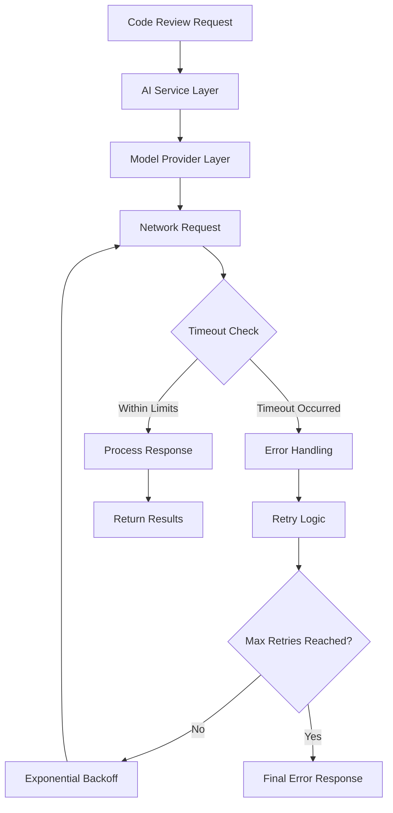
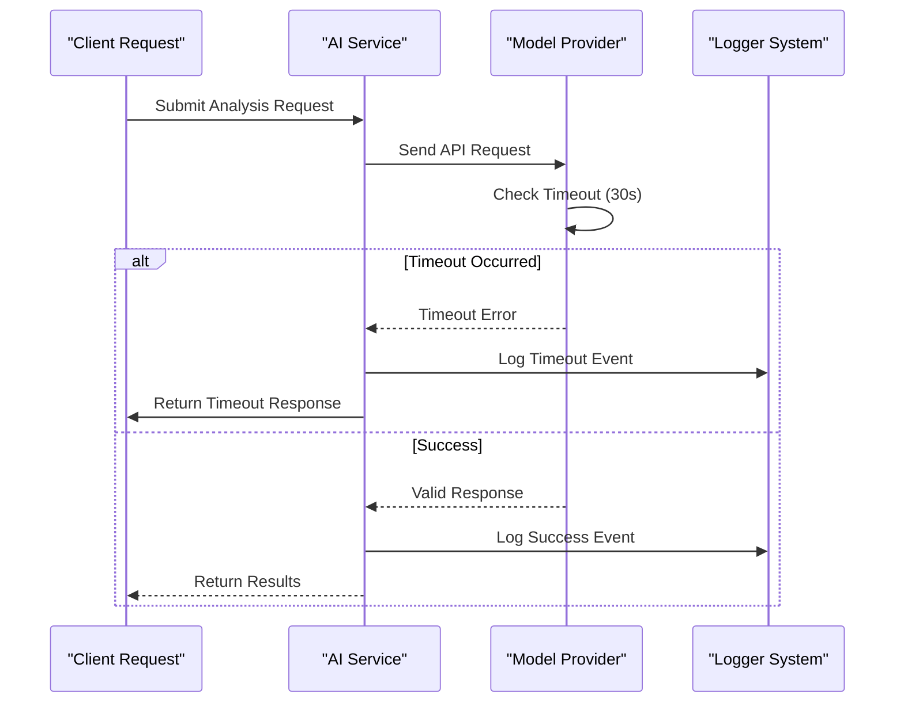
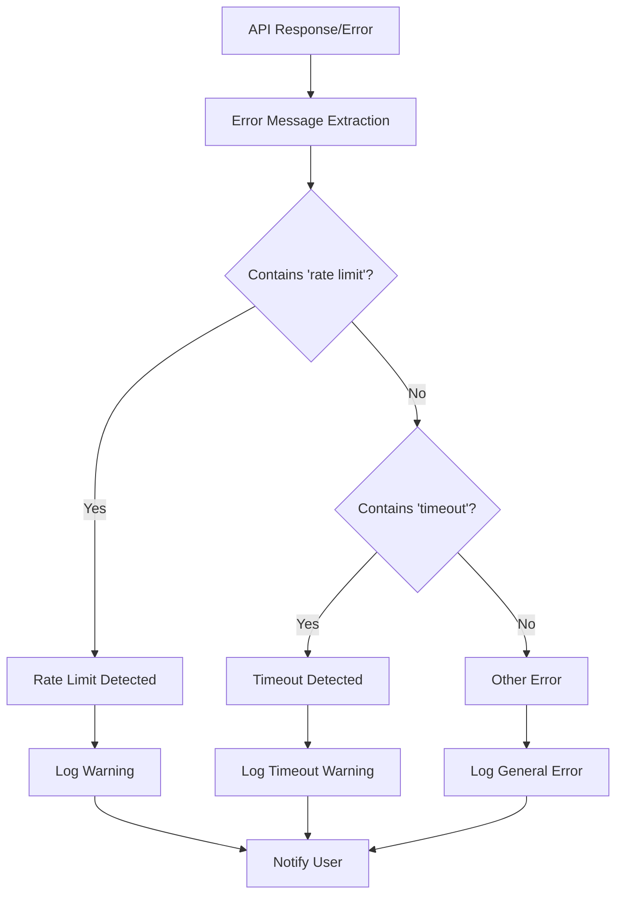
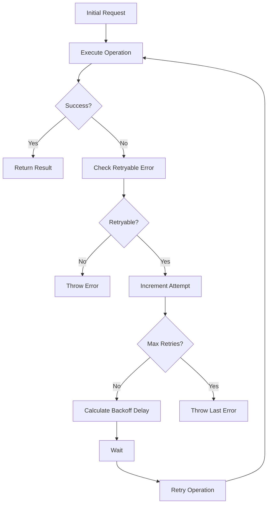
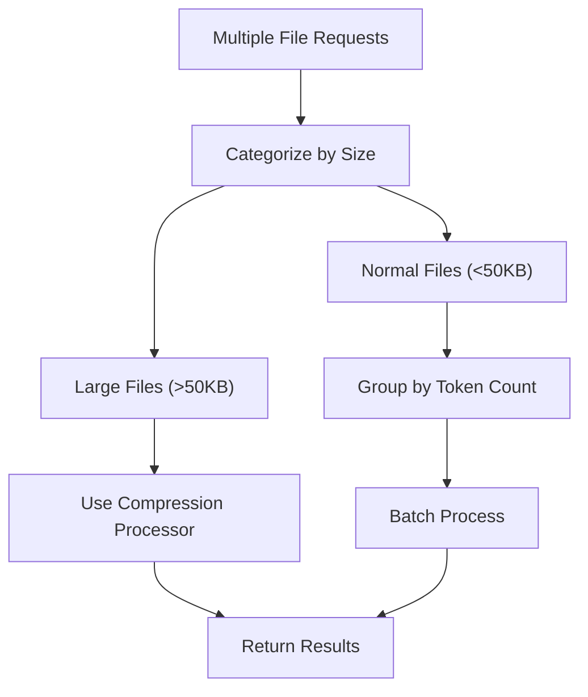

# API Timeout and Rate Limiting

<cite>
**Referenced Files in This Document**
- [aiService.ts](file://src/services/ai/aiService.ts)
- [codeAnalyzer.ts](file://src/core/review/codeAnalyzer.ts)
- [retryUtils.ts](file://src/utils/retryUtils.ts)
- [logger.ts](file://src/utils/logger.ts)
- [appConfig.ts](file://src/config/appConfig.ts)
- [baseModel.ts](file://src/models/baseModel.ts)
- [types.ts](file://src/models/types.ts)
- [deepseek.ts](file://src/models/providers/deepseek.ts)
- [notificationManager.ts](file://src/services/notification/notificationManager.ts)
- [constants.ts](file://src/constants/constants.ts)
</cite>

## Table of Contents
1. [Introduction](#introduction)
2. [Timeout Handling Architecture](#timeout-handling-architecture)
3. [Rate Limiting Detection and Management](#rate-limiting-detection-and-management)
4. [Error Scenarios and Responses](#error-scenarios-and-responses)
5. [Retry Mechanisms and Exponential Backoff](#retry-mechanisms-and-exponential-backoff)
6. [Configuration and Tuning](#configuration-and-tuning)
7. [Performance Optimization Strategies](#performance-optimization-strategies)
8. [Troubleshooting Guide](#troubleshooting-guide)
9. [Best Practices](#best-practices)
10. [Conclusion](#conclusion)

## Introduction

CodeKarmic implements a comprehensive API timeout and rate limiting system designed to handle various network and provider-specific challenges. The system employs multiple layers of protection including configurable timeouts, intelligent retry mechanisms, and sophisticated error detection to ensure reliable code analysis operations even under adverse network conditions.

The timeout and rate limiting infrastructure is built around several key components: the AI service layer that orchestrates analysis requests, the retry utility framework that provides exponential backoff capabilities, and the notification system that keeps users informed of processing status and potential issues.

## Timeout Handling Architecture

### Core Timeout Configuration

The system implements a multi-tiered timeout strategy with different levels of granularity:

**Diagram sources**
- [aiService.ts](file://src/services/ai/aiService.ts#L264-L410)
- [deepseek.ts](file://src/models/providers/deepseek.ts#L12-L40)

The primary timeout mechanism is implemented in the `performCodeAnalysis` method where a 3-minute (180,000ms) timeout is set for AI model interactions. This timeout is specifically configured in the model request options:

**Section sources**
- [aiService.ts](file://src/services/ai/aiService.ts#L274-L274)

### Provider-Specific Timeouts

Different AI providers implement their own timeout mechanisms:

- **DeepSeek Provider**: Uses a 30-second timeout with built-in retry capabilities
- **OpenAI Compatibility**: Inherits timeout settings from the OpenAI client configuration
- **Custom Providers**: Implement timeout handling through the base model abstraction

**Section sources**
- [deepseek.ts](file://src/models/providers/deepseek.ts#L12-L13)
- [baseModel.ts](file://src/models/baseModel.ts#L11-L12)

### Timeout Detection and Logging

The system provides comprehensive timeout detection through multiple channels:

**Diagram sources**
- [aiService.ts](file://src/services/ai/aiService.ts#L387-L410)
- [deepseek.ts](file://src/models/providers/deepseek.ts#L98-L146)

**Section sources**
- [aiService.ts](file://src/services/ai/aiService.ts#L387-L410)
- [deepseek.ts](file://src/models/providers/deepseek.ts#L98-L146)

## Rate Limiting Detection and Management

### Rate Limit Error Detection

The system implements sophisticated rate limit detection through string pattern matching:

**Diagram sources**
- [aiService.ts](file://src/services/ai/aiService.ts#L396-L401)

The rate limit detection logic specifically checks for the presence of the string "rate limit" in error messages:

**Section sources**
- [aiService.ts](file://src/services/ai/aiService.ts#L396-L398)

### Rate Limit Error Patterns

The system recognizes multiple rate limit indicators:

| Pattern | Description | Detection Method |
|---------|-------------|------------------|
| `'rate limit'` | Generic rate limit indication | String inclusion check |
| `'too many requests'` | HTTP 429 status equivalent | String inclusion check |
| `'Service Unavailable'` | Provider-specific rate limiting | String inclusion check |
| `5xx status codes` | Server-side rate limiting | Regex pattern matching |
| Network timeouts | Indirect rate limit indication | String inclusion check |

**Section sources**
- [retryUtils.ts](file://src/utils/retryUtils.ts#L95-L106)

### User Notification System

When rate limits are detected, the system provides immediate user feedback through multiple channels:

**Section sources**
- [aiService.ts](file://src/services/ai/aiService.ts#L396-L401)
- [notificationManager.ts](file://src/services/notification/notificationManager.ts#L106-L116)

## Error Scenarios and Responses

### Network Latency Issues

Network latency can manifest in several ways:

1. **Slow Response Times**: Requests taking longer than expected
2. **Intermittent Connectivity**: Periodic connection failures
3. **High Round-Trip Times**: Consistently high network delays

### AI Provider Timeouts

Provider-specific timeout scenarios include:

1. **Request Timeout**: Individual request exceeding configured limits
2. **Connection Timeout**: Unable to establish connection to provider
3. **Read Timeout**: Connection established but no response received

### Rate Limit Exceeded Responses

Rate limit violations produce specific error patterns:

1. **HTTP 429**: Too many requests response
2. **Provider-Specific Messages**: Custom rate limit error messages
3. **Temporary Unavailability**: Service temporarily unavailable indications

**Section sources**
- [aiService.ts](file://src/services/ai/aiService.ts#L387-L410)

## Retry Mechanisms and Exponential Backoff

### Built-in Retry Framework

CodeKarmic implements a robust retry system with exponential backoff:

**Diagram sources**
- [retryUtils.ts](file://src/utils/retryUtils.ts#L33-L69)

### Retry Configuration

The default retry configuration provides balanced reliability:

| Parameter | Value | Purpose |
|-----------|-------|---------|
| `maxRetries` | 2 | Maximum retry attempts |
| `initialDelay` | 500ms | Initial wait time |
| `backoffFactor` | 1.5 | Exponential backoff multiplier |

**Section sources**
- [retryUtils.ts](file://src/utils/retryUtils.ts#L19-L23)

### Retryable Error Patterns

The system recognizes various error patterns suitable for retry:

**Section sources**
- [retryUtils.ts](file://src/utils/retryUtils.ts#L95-L116)

### DeepSeek Provider Specifics

The DeepSeek provider implements enhanced retry logic:

**Section sources**
- [deepseek.ts](file://src/models/providers/deepseek.ts#L198-L210)

## Configuration and Tuning

### Timeout Configuration Options

Several timeout parameters can be configured:

1. **Model Request Timeout**: Controlled through `ModelRequestOptions.timeoutMs`
2. **Provider Timeout**: Set in provider-specific implementations
3. **Network Timeout**: Managed by underlying HTTP clients

### Rate Limit Thresholds

Rate limit handling is configured through error pattern matching rather than numerical thresholds.

### Performance Tuning Parameters

| Setting | Default | Range | Impact |
|---------|---------|-------|--------|
| Max Retries | 2 | 0-5 | Retry aggressiveness |
| Initial Delay | 500ms | 100-2000ms | Startup delay |
| Backoff Factor | 1.5 | 1.2-2.0 | Growth rate |
| Timeout Duration | 180000ms | 30000-600000ms | Request timeout |

**Section sources**
- [types.ts](file://src/models/types.ts#L73-L74)
- [retryUtils.ts](file://src/utils/retryUtils.ts#L19-L23)

## Performance Optimization Strategies

### Batch Request Optimization

The system implements intelligent batching to reduce API overhead:

**Diagram sources**
- [aiService.ts](file://src/services/ai/aiService.ts#L426-L552)

### Content Compression

For large files, the system implements content compression:

**Section sources**
- [deepseek.ts](file://src/models/providers/deepseek.ts#L154-L185)

### Streaming Output Support

The system supports streaming responses to improve perceived performance:

**Section sources**
- [aiService.ts](file://src/services/ai/aiService.ts#L273-L273)

## Troubleshooting Guide

### Slow Processing Issues

**Symptoms**: Analysis requests taking excessive time
**Diagnosis Steps**:
1. Check network connectivity and latency
2. Verify API key validity
3. Monitor provider response times
4. Review file sizes and complexity

**Resolution Actions**:
1. Increase timeout values if appropriate
2. Enable compression for large files
3. Reduce concurrent request load
4. Switch to faster provider if available

### Connection Timeouts

**Symptoms**: Frequent timeout errors during analysis
**Diagnosis Steps**:
1. Test network stability
2. Check firewall and proxy settings
3. Verify provider availability
4. Monitor request patterns

**Resolution Actions**:
1. Adjust timeout configurations
2. Implement retry with longer delays
3. Configure fallback providers
4. Enable offline caching where possible

### Provider-Specific Rate Limits

**Symptoms**: Rate limit errors despite normal usage
**Diagnosis Steps**:
1. Check provider-specific rate limit documentation
2. Monitor request frequency
3. Review account tier limitations
4. Analyze request patterns

**Resolution Actions**:
1. Implement request throttling
2. Upgrade provider account tier
3. Distribute requests over time
4. Use multiple API keys if supported

### Error Message Interpretation

Common error messages and their meanings:

| Error Message | Meaning | Action |
|---------------|---------|--------|
| `'Request timed out'` | Network timeout occurred | Increase timeout, check connectivity |
| `'Rate limit exceeded'` | Provider rate limit reached | Implement backoff, upgrade account |
| `'Service Unavailable'` | Provider temporary issue | Retry with backoff |
| `'Too many requests'` | HTTP 429 response | Implement exponential backoff |

**Section sources**
- [aiService.ts](file://src/services/ai/aiService.ts#L396-L401)

## Best Practices

### Implementation Guidelines

1. **Always implement timeout handling** for external API calls
2. **Use exponential backoff** for retry mechanisms
3. **Monitor error patterns** to optimize retry strategies
4. **Provide user feedback** for long-running operations
5. **Implement graceful degradation** when providers are unavailable

### Configuration Recommendations

1. **Set appropriate timeouts** based on expected response times
2. **Configure reasonable retry limits** to balance reliability and performance
3. **Enable compression** for large files to reduce bandwidth usage
4. **Use streaming** for real-time feedback during processing

### Monitoring and Logging

1. **Log all timeout and rate limit events** for analysis
2. **Track success rates** across different providers
3. **Monitor response times** to detect performance degradation
4. **Alert on sustained failures** to enable rapid response

## Conclusion

CodeKarmic's timeout and rate limiting system provides a robust foundation for handling API communication challenges in code review operations. Through multi-layered timeout management, intelligent retry mechanisms, and comprehensive error detection, the system ensures reliable operation even under adverse network conditions and provider limitations.

The modular architecture allows for easy configuration tuning and provider-specific optimizations while maintaining consistent error handling patterns. By following the documented best practices and utilizing the provided troubleshooting guidelines, developers can effectively manage API communication challenges and maintain optimal system performance.

The system's emphasis on user feedback and transparent error reporting ensures that users remain informed of processing status and can take appropriate action when encountering timeout or rate limiting issues.