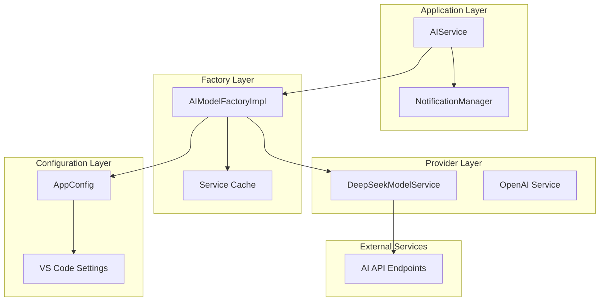
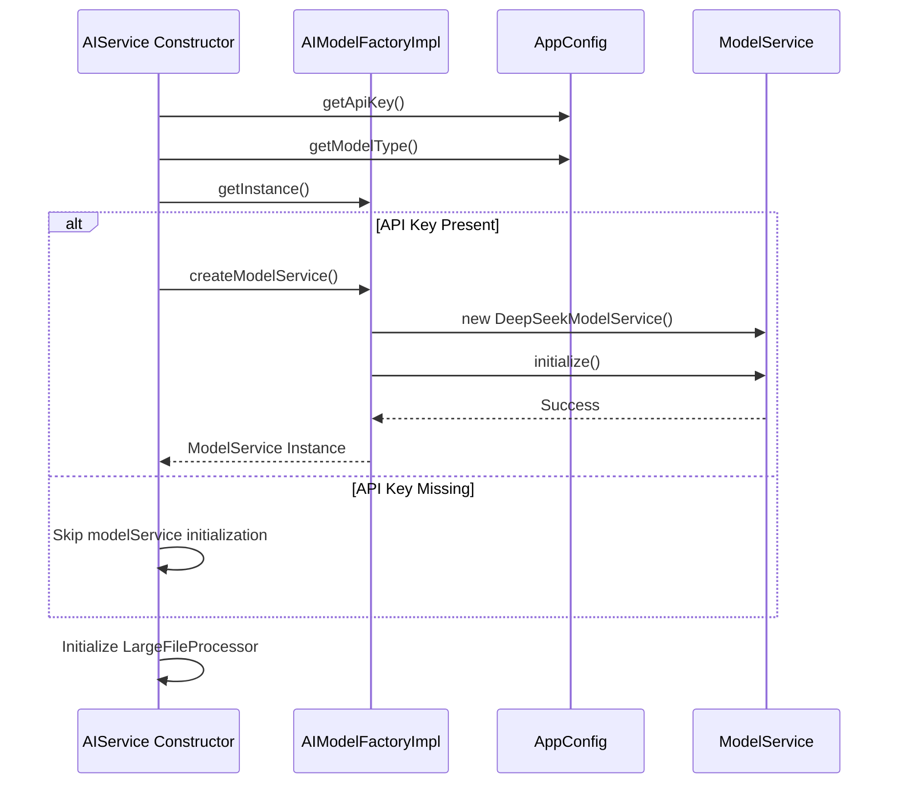
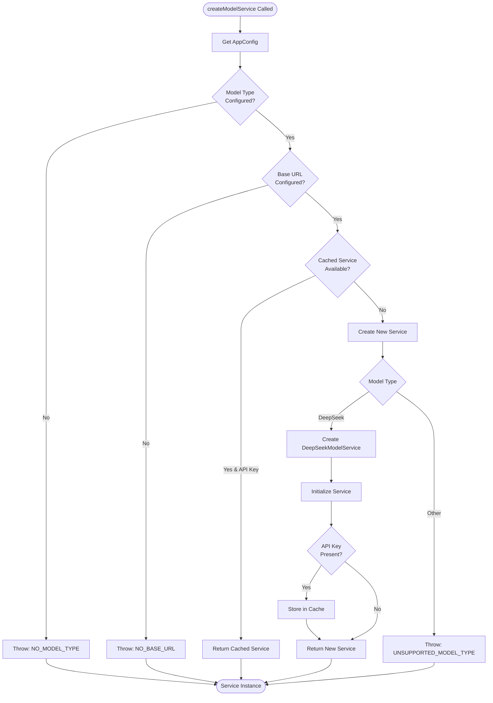
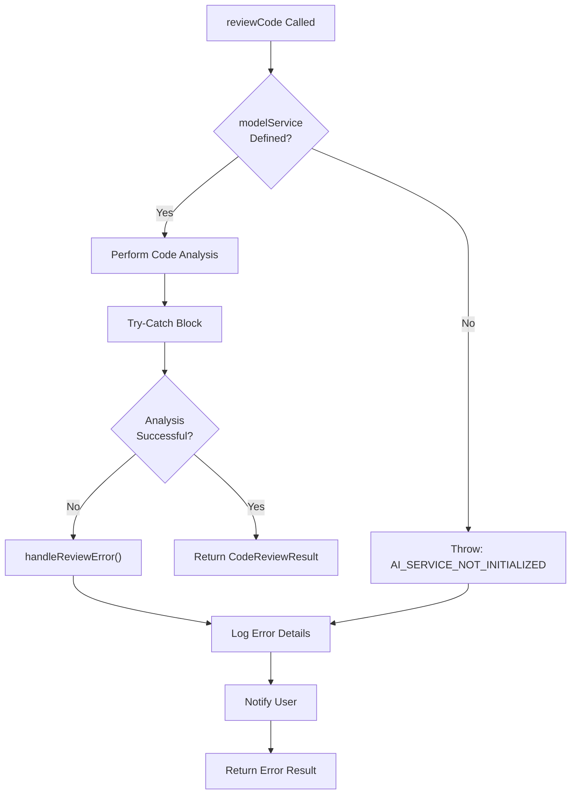
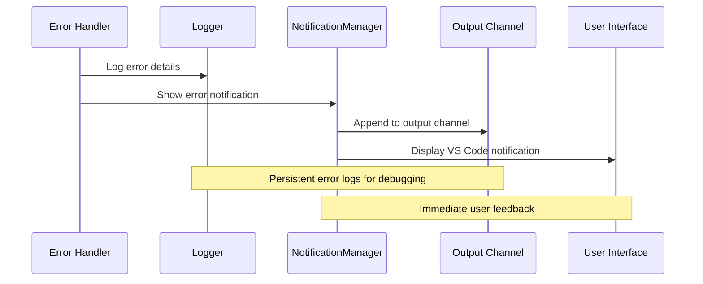

# Model Initialization Failures

<cite>
**Referenced Files in This Document**
- [aiService.ts](file://src/services/ai/aiService.ts)
- [modelFactory.ts](file://src/models/modelFactory.ts)
- [appConfig.ts](file://src/config/appConfig.ts)
- [modelInterface.ts](file://src/models/modelInterface.ts)
- [baseModel.ts](file://src/models/baseModel.ts)
- [deepseek.ts](file://src/models/providers/deepseek.ts)
- [notificationManager.ts](file://src/services/notification/notificationManager.ts)
- [logger.ts](file://src/utils/logger.ts)
- [output.ts](file://src/i18n/en/output.ts)
- [output.ts](file://src/i18n/zh/output.ts)
- [types.ts](file://src/models/types.ts)
</cite>

## Table of Contents
1. [Introduction](#introduction)
2. [System Architecture Overview](#system-architecture-overview)
3. [Model Initialization Process](#model-initialization-process)
4. [Common Failure Scenarios](#common-failure-scenarios)
5. [Error Handling Mechanisms](#error-handling-mechanisms)
6. [Troubleshooting Guide](#troubleshooting-guide)
7. [Configuration Best Practices](#configuration-best-practices)
8. [Performance Optimization](#performance-optimization)
9. [Recovery Strategies](#recovery-strategies)
10. [Monitoring and Diagnostics](#monitoring-and-diagnostics)

## Introduction

Model initialization failures in CodeKarmic represent one of the most critical failure modes that can prevent the AI-powered code review functionality from operating correctly. These failures occur when the system fails to establish a connection with the configured AI model service, resulting in the inability to perform code analysis tasks.

The CodeKarmic extension relies heavily on external AI services for code review capabilities. When model initialization fails, users receive the "AI service not initialized" error, which prevents any code analysis operations from proceeding. Understanding these failure modes and their resolution is crucial for maintaining optimal development productivity.

## System Architecture Overview

The CodeKarmic AI service architecture follows a layered approach with clear separation of concerns:



**Diagram sources**
- [aiService.ts](file://src/services/ai/aiService.ts#L40-L70)
- [modelFactory.ts](file://src/models/modelFactory.ts#L19-L44)
- [appConfig.ts](file://src/config/appConfig.ts#L49-L88)

**Section sources**
- [aiService.ts](file://src/services/ai/aiService.ts#L40-L70)
- [modelFactory.ts](file://src/models/modelFactory.ts#L19-L44)

## Model Initialization Process

### Constructor Initialization Flow

The AIService constructor implements a sophisticated initialization pattern that ensures proper model service setup:



**Diagram sources**
- [aiService.ts](file://src/services/ai/aiService.ts#L50-L65)
- [modelFactory.ts](file://src/models/modelFactory.ts#L58-L113)

### Factory Pattern Implementation

The AIModelFactoryImpl follows the Singleton pattern with intelligent caching:



**Diagram sources**
- [modelFactory.ts](file://src/models/modelFactory.ts#L58-L113)

**Section sources**
- [aiService.ts](file://src/services/ai/aiService.ts#L50-L65)
- [modelFactory.ts](file://src/models/modelFactory.ts#L58-L113)

## Common Failure Scenarios

### Scenario 1: Missing API Key Configuration

**Symptoms:**
- "AI service not initialized" error when performing code reviews
- Model service remains undefined in AIService instance
- API key validation fails silently

**Root Cause:**
The AIService constructor conditionally initializes modelService only when an API key is present. Without a configured API key, the factory skips service creation.

**Impact:**
All code review operations fail immediately with the "AI service not initialized" error.

### Scenario 2: Invalid Model Configuration

**Symptoms:**
- Factory throws "NO_MODEL_TYPE" or "NO_BASE_URL" errors
- Service creation fails during initialization
- Provider-specific errors during model instantiation

**Root Cause:**
Incomplete or incorrect configuration in VS Code settings:
- Missing model type selection
- Invalid base URL format
- Unsupported model type specification

### Scenario 3: Provider-Specific Initialization Failures

**Symptoms:**
- DeepSeekModelService throws "NO_API_KEY" error
- OpenAI client initialization failures
- Network connectivity issues with AI endpoints

**Root Cause:**
- Authentication failures with AI providers
- Network timeouts or connectivity issues
- Rate limiting or quota exceeded

### Scenario 4: Factory Pattern Failures

**Symptoms:**
- Service caching mechanism fails
- Memory leaks in cached services
- Inconsistent service states

**Root Cause:**
- Improper cache management
- Race conditions in service creation
- Resource cleanup failures

**Section sources**
- [modelFactory.ts](file://src/models/modelFactory.ts#L64-L70)
- [deepseek.ts](file://src/models/providers/deepseek.ts#L27-L41)
- [aiService.ts](file://src/services/ai/aiService.ts#L58-L61)

## Error Handling Mechanisms

### AIService Error Propagation

The AIService implements comprehensive error handling with multiple layers:



**Diagram sources**
- [aiService.ts](file://src/services/ai/aiService.ts#L74-L123)
- [aiService.ts](file://src/services/ai/aiService.ts#L260-L289)

### Error Message Localization

The system provides localized error messages for international users:

| Error Type | English Message | Chinese Message | Recovery Action |
|------------|----------------|-----------------|-----------------|
| AI_SERVICE_NOT_INITIALIZED | "AI model service not initialized" | "AI 模型服务未初始化" | Configure API key and restart |
| NO_MODEL_TYPE | "No model type configured" | "未配置模型类型" | Select supported model type |
| NO_BASE_URL | "No base URL configured" | "未配置基础URL" | Set valid API endpoint |
| NO_API_KEY | "API key not configured" | "API密钥未配置" | Enter valid API key |
| UNSUPPORTED_MODEL_TYPE | "Unsupported model type: {type}" | "不支持的模型类型: {type}" | Choose supported model |

### Notification and Logging System

The notification system provides comprehensive error reporting:



**Diagram sources**
- [notificationManager.ts](file://src/services/notification/notificationManager.ts#L79-L121)
- [logger.ts](file://src/utils/logger.ts#L18-L88)

**Section sources**
- [aiService.ts](file://src/services/ai/aiService.ts#L74-L123)
- [aiService.ts](file://src/services/ai/aiService.ts#L260-L289)
- [notificationManager.ts](file://src/services/notification/notificationManager.ts#L79-L121)

## Troubleshooting Guide

### Step 1: Verify API Key Configuration

**Check Current Configuration:**
1. Open VS Code settings
2. Navigate to CodeKarmic configuration
3. Verify API key field contains valid credentials

**Validation Steps:**
```typescript
// Programmatic validation example
const isValid = await AIService.getInstance().validateApiKey(apiKey);
console.log(`API Key Validation: ${isValid ? 'PASS' : 'FAIL'}`);
```

**Common Issues:**
- Expired or revoked API keys
- Incorrect API key format
- Account suspension or quota exceeded

### Step 2: Confirm Model Type Selection

**Supported Models:**
- DeepSeek V3 (`deepseek-chat`)
- DeepSeek R1 (`deepseek-reasoner`)
- OpenAI (future support)

**Verification Process:**
1. Check model type in settings
2. Ensure model type matches available providers
3. Verify model type is not empty or null

### Step 3: Test Network Connectivity

**Network Diagnostics:**
```typescript
// Test API endpoint connectivity
async function testEndpoint(url: string): Promise<boolean> {
    try {
        const response = await fetch(url, { method: 'GET' });
        return response.ok;
    } catch (error) {
        return false;
    }
}
```

**Common Network Issues:**
- Firewall blocking API requests
- Proxy server interference
- DNS resolution problems
- SSL certificate validation failures

### Step 4: Examine Service Cache State

**Cache Inspection:**
```typescript
// Check factory cache state
const factory = AIModelFactoryImpl.getInstance();
const cacheKeys = Array.from(factory.modelServices.keys());
console.log('Cached services:', cacheKeys);
```

**Cache Problems:**
- Memory leaks in cached services
- Stale service instances
- Inconsistent cache state

**Section sources**
- [aiService.ts](file://src/services/ai/aiService.ts#L712-L736)
- [modelFactory.ts](file://src/models/modelFactory.ts#L116-L140)

## Configuration Best Practices

### API Key Management

**Secure Storage:**
- Store API keys securely in VS Code settings
- Use environment variables for sensitive deployments
- Rotate API keys regularly

**Validation Strategy:**
```typescript
// Recommended validation approach
public async validateApiKey(apiKey: string): Promise<boolean> {
    try {
        const modelFactory = AIModelFactoryImpl.getInstance();
        const modelService = modelFactory.createModelService();
        return await modelService.validateApiKey(apiKey);
    } catch (error) {
        return false;
    }
}
```

### Model Configuration Guidelines

**Base URL Configuration:**
- Use HTTPS endpoints for security
- Verify endpoint availability before configuration
- Consider regional endpoints for latency optimization

**Model Type Selection:**
- Choose models based on use case requirements
- Consider cost and rate limiting implications
- Test model performance with representative workloads

### Environment-Specific Settings

**Development Environment:**
- Use lower rate limits for testing
- Enable detailed logging
- Configure mock endpoints for offline testing

**Production Environment:**
- Implement proper error handling
- Monitor API usage and costs
- Set up alerting for service failures

**Section sources**
- [appConfig.ts](file://src/config/appConfig.ts#L145-L156)
- [aiService.ts](file://src/services/ai/aiService.ts#L726-L732)

## Performance Optimization

### Cold Start Mitigation

**Pre-initialization Strategy:**
```typescript
// Initialize service during extension activation
export function activate(context: vscode.ExtensionContext) {
    // Pre-warm the AI service
    const aiService = AIService.getInstance();
    
    // Warm up the model factory
    const factory = AIModelFactoryImpl.getInstance();
    factory.createModelService(); // Force initialization
    
    // Cache frequently used services
    factory.getSupportedModelTypes();
}
```

**Lazy Loading Benefits:**
- Reduced startup time for extension activation
- Improved user experience during initial code review
- Better resource utilization

### Service Caching Optimization

**Cache Management Strategy:**
```typescript
// Intelligent cache clearing
public clearModelServices(type?: string): void {
    if (type) {
        // Clear specific model type
        for (const [key, _] of this.modelServices.entries()) {
            if (key.startsWith(type)) {
                this.modelServices.delete(key);
            }
        }
    } else {
        // Clear all cached services
        this.modelServices.clear();
    }
}
```

**Memory Management:**
- Implement LRU cache eviction policies
- Monitor cache size and memory usage
- Periodically clean stale service instances

### Connection Pooling

**Optimized Client Configuration:**
```typescript
// Efficient client initialization
private initializeClient() {
    this.client = new OpenAI({
        baseURL: this.baseURL,
        apiKey: this.apiKey,
        maxRetries: 3,
        timeout: 30000,
        defaultHeaders: {
            'Content-Type': 'application/json'
        }
    });
}
```

**Connection Optimization:**
- Reuse HTTP connections when possible
- Implement connection pooling for high-frequency requests
- Configure appropriate timeout values

**Section sources**
- [deepseek.ts](file://src/models/providers/deepseek.ts#L31-L41)
- [modelFactory.ts](file://src/models/modelFactory.ts#L116-L140)

## Recovery Strategies

### Automatic Recovery Mechanisms

**Retry Logic Implementation:**
```typescript
// Enhanced retry with exponential backoff
protected async retryOperation<T>(
    operation: () => Promise<T>,
    retries = 3,
    delay = 1000
): Promise<T> {
    try {
        return await operation();
    } catch (error) {
        if (retries > 0) {
            await new Promise(resolve => setTimeout(resolve, delay));
            return this.retryOperation(operation, retries - 1, delay * 2);
        }
        throw error;
    }
}
```

**Recovery Triggers:**
- API rate limiting detection
- Network connectivity loss
- Authentication failures
- Service unavailability

### Manual Recovery Procedures

**Step-by-Step Recovery:**
1. **Clear Service Cache:** Remove cached model services
2. **Reconfigure Settings:** Verify and update configuration
3. **Test Connectivity:** Validate network and API access
4. **Restart Service:** Recreate model service instance
5. **Verify Functionality:** Test with simple API call

**Recovery Commands:**
```typescript
// Manual recovery procedure
async function recoverModelService(): Promise<void> {
    // Step 1: Clear cache
    const factory = AIModelFactoryImpl.getInstance();
    factory.clearModelServices();
    
    // Step 2: Recreate service
    const aiService = AIService.getInstance();
    const freshService = factory.createModelService();
    
    // Step 3: Test connection
    const isValid = await freshService.validateApiKey(aiService.apiKey);
    if (!isValid) {
        throw new Error('Recovery failed: Invalid API key');
    }
}
```

### Fallback Strategies

**Multi-Provider Support:**
```typescript
// Fallback to alternative providers
async function createFallbackModelService(): Promise<AIModelService> {
    const providers = ['deepseek-chat', 'openai'];
    
    for (const provider of providers) {
        try {
            const factory = AIModelFactoryImpl.getInstance();
            const service = factory.createModelService(provider);
            await service.validateApiKey();
            return service;
        } catch (error) {
            console.warn(`Provider ${provider} failed:`, error);
            continue;
        }
    }
    
    throw new Error('All providers failed');
}
```

**Graceful Degradation:**
- Reduce functionality scope during failures
- Provide offline analysis capabilities
- Offer simplified code review features

**Section sources**
- [modelInterface.ts](file://src/models/modelInterface.ts#L98-L116)
- [deepseek.ts](file://src/models/providers/deepseek.ts#L198-L210)

## Monitoring and Diagnostics

### Error Tracking System

**Comprehensive Logging:**
```typescript
// Enhanced error logging with context
public handleReviewError(error: any, filePath: string): CodeReviewResult {
    const errorDetails = error instanceof Error ? error.stack || error.message : String(error);
    
    console.error('[CodeKarmic] Code review error details:', {
        error: errorDetails,
        filePath,
        modelUsed: this.modelType,
        apiKeyConfigured: !!this.apiKey,
        clientInitialized: !!this.client
    });
    
    return {
        suggestions: [`Error: Failed to complete code review. Details: ${errorDetails}`],
        score: 0,
        diffContent: ''
    };
}
```

**Diagnostic Information Collection:**
- Model type and configuration
- API endpoint status
- Network connectivity metrics
- Error frequency and patterns

### Health Monitoring

**Service Health Checks:**
```typescript
// Regular health monitoring
class HealthMonitor {
    async checkServiceHealth(): Promise<ServiceHealth> {
        const checks = {
            apiKey: await this.validateApiKey(),
            network: await this.checkNetworkConnectivity(),
            model: await this.validateModelConfiguration(),
            cache: await this.checkCacheStatus()
        };
        
        return {
            healthy: Object.values(checks).every(result => result),
            details: checks
        };
    }
}
```

**Performance Metrics:**
- Response time measurements
- Error rate tracking
- Resource utilization monitoring
- Availability statistics

### Alerting and Notifications

**Proactive Alerts:**
```typescript
// Intelligent alerting system
class AlertManager {
    private alerts: Map<string, Alert> = new Map();
    
    triggerAlert(type: AlertType, message: string): void {
        const alert = new Alert(type, message);
        this.alerts.set(type, alert);
        
        // Send notification to user
        this.notificationManager.showPersistentNotification(
            `CodeKarmic: ${message}`,
            'error'
        );
    }
}
```

**Alert Categories:**
- Configuration errors
- Network connectivity issues
- API quota warnings
- Service degradation notices

**Section sources**
- [aiService.ts](file://src/services/ai/aiService.ts#L691-L710)
- [notificationManager.ts](file://src/services/notification/notificationManager.ts#L183-L210)

## Conclusion

Model initialization failures in CodeKarmic represent a critical aspect of the system's reliability and user experience. By understanding the various failure scenarios, implementing robust error handling mechanisms, and following established troubleshooting procedures, developers can maintain optimal system performance and user satisfaction.

The layered architecture with comprehensive error handling, intelligent caching, and automatic recovery mechanisms provides a solid foundation for handling initialization failures gracefully. Regular monitoring, proactive alerting, and continuous improvement of diagnostic capabilities ensure that these failures are detected early and resolved efficiently.

For teams using CodeKarmic, implementing the recommended configuration best practices, performance optimizations, and recovery strategies will minimize the impact of model initialization failures and maintain the productivity benefits of AI-powered code review capabilities.