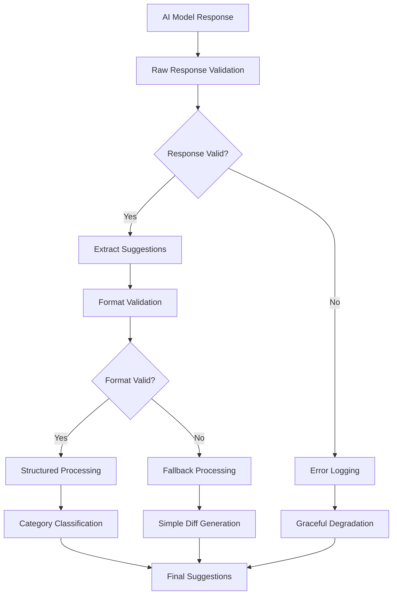
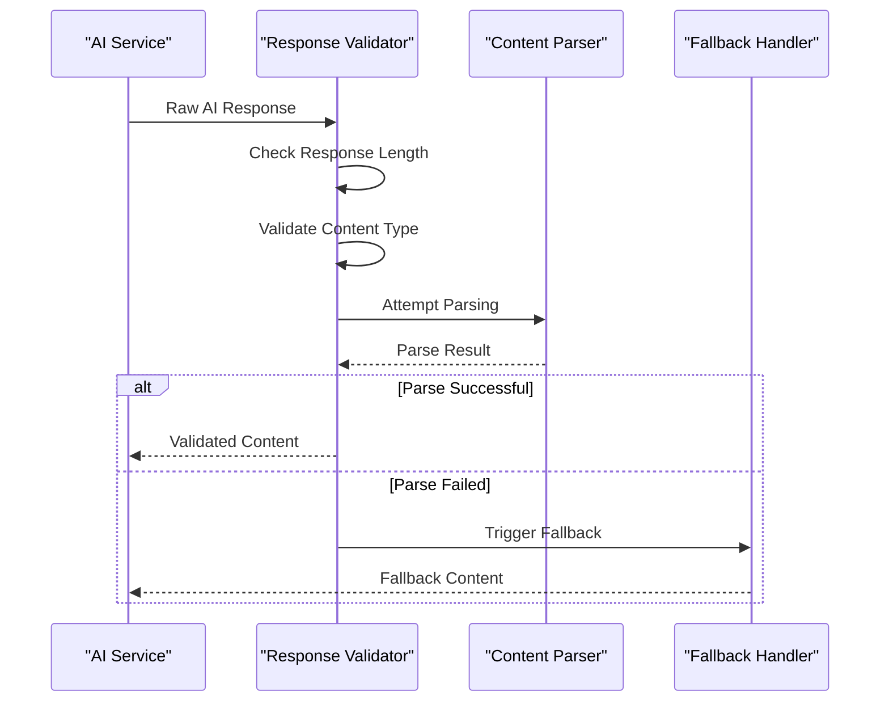
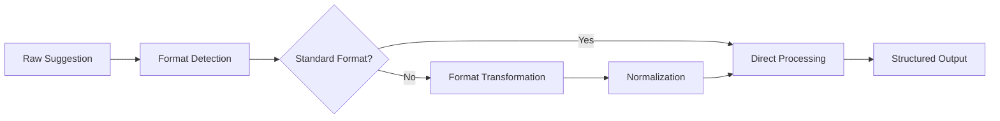
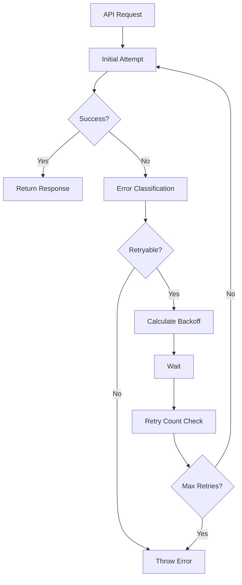

# Response Processing Errors

<cite>
**Referenced Files in This Document**
- [aiService.ts](file://src/services/ai/aiService.ts)
- [codeAnalyzer.ts](file://src/core/review/codeAnalyzer.ts)
- [suggestionGenerator.ts](file://src/core/review/suggestionGenerator.ts)
- [modelInterface.ts](file://src/models/modelInterface.ts)
- [retryUtils.ts](file://src/utils/retryUtils.ts)
- [deepseek.ts](file://src/models/providers/deepseek.ts)
- [notificationManager.ts](file://src/services/notification/notificationManager.ts)
- [reviewTypes.ts](file://src/core/review/reviewTypes.ts)
- [prompts.ts](file://src/i18n/en/prompts.ts)
- [output.ts](file://src/i18n/en/output.ts)
- [constants.ts](file://src/constants/constants.ts)
</cite>

## Table of Contents
1. [Introduction](#introduction)
2. [Response Processing Architecture](#response-processing-architecture)
3. [Malformed AI Responses](#malformed-ai-responses)
4. [Parsing Failures](#parsing-failures)
5. [Invalid Suggestion Formats](#invalid-suggestion-formats)
6. [Fallback Mechanisms](#fallback-mechanisms)
7. [Error Handling Patterns](#error-handling-patterns)
8. [Troubleshooting Guide](#troubleshooting-guide)
9. [Performance Optimization](#performance-optimization)
10. [Best Practices](#best-practices)

## Introduction

CodeKarmic implements a robust response processing system designed to handle various error scenarios that can occur during AI model interactions. The system provides multiple layers of error handling, fallback mechanisms, and recovery strategies to ensure reliable code review functionality even when AI responses are malformed, incomplete, or contain invalid content.

The response processing pipeline involves several key components working together to transform raw AI responses into structured, actionable code review suggestions while gracefully handling various failure modes.

## Response Processing Architecture

The response processing system follows a multi-stage architecture that processes AI responses through several validation and transformation stages:



**Diagram sources**
- [aiService.ts](file://src/services/ai/aiService.ts#L338-L387)
- [codeAnalyzer.ts](file://src/core/review/codeAnalyzer.ts#L172-L187)
- [suggestionGenerator.ts](file://src/core/review/suggestionGenerator.ts#L124-L151)

**Section sources**
- [aiService.ts](file://src/services/ai/aiService.ts#L260-L387)
- [codeAnalyzer.ts](file://src/core/review/codeAnalyzer.ts#L354-L365)

## Malformed AI Responses

### Common Malformed Response Scenarios

CodeKarmic encounters several types of malformed AI responses that require specialized handling:

#### Truncated Responses
- **Cause**: API timeouts, network interruptions, or model limitations
- **Detection**: Length validation, content completeness checks
- **Impact**: Incomplete suggestions, missing scoring information

#### JSON Format Violations
- **Cause**: Model generating plain text instead of structured JSON
- **Detection**: Parsing attempts with exception handling
- **Impact**: Structured data extraction failures

#### Unexpected Content Types
- **Cause**: Model returning HTML, markdown, or other non-standard formats
- **Detection**: Content-type validation and format recognition
- **Impact**: Parsing errors and data corruption

#### Empty or Null Responses
- **Cause**: API errors, authentication failures, or rate limiting
- **Detection**: Response length and content validation
- **Impact**: Complete analysis failure

### Response Validation Strategies

The system implements comprehensive validation at multiple levels:



**Diagram sources**
- [aiService.ts](file://src/services/ai/aiService.ts#L338-L387)
- [modelInterface.ts](file://src/models/modelInterface.ts#L103-L116)

**Section sources**
- [aiService.ts](file://src/services/ai/aiService.ts#L338-L387)
- [modelInterface.ts](file://src/models/modelInterface.ts#L103-L116)

## Parsing Failures

### Exception Handling Mechanisms

The system employs robust exception handling to manage parsing failures:

#### Try-Catch Wrappers
Multiple layers of try-catch blocks prevent cascading failures:

```typescript
// Example from codeAnalyzer.ts
private async analyzeDiff(request: CodeReviewRequest): Promise<string[]> {
    try {
        // AI response processing
        const response = await this.modelService.generateContent({...});
        return this.parseSuggestions(response.text);
    } catch (error) {
        this.logger.error(`差异分析错误: ${error}`);
        return [`差异分析时出错: ${error}`];
    }
}
```

#### Graceful Degradation
When parsing fails, the system provides meaningful fallback content rather than crashing.

#### Error Context Preservation
Original error details are preserved and logged for debugging while providing user-friendly error messages.

### Schema Validation

The system validates response schemas to ensure data integrity:

| Validation Type | Purpose | Implementation |
|----------------|---------|----------------|
| Content Length | Detect truncation | Minimum length thresholds |
| Format Consistency | Verify structure | Regular expression patterns |
| Semantic Validity | Check logical coherence | Content analysis |
| Completeness | Ensure required fields | Presence validation |

**Section sources**
- [codeAnalyzer.ts](file://src/core/review/codeAnalyzer.ts#L92-L127)
- [suggestionGenerator.ts](file://src/core/review/suggestionGenerator.ts#L117-L123)

## Invalid Suggestion Formats

### Suggestion Format Detection

CodeKarmic recognizes multiple suggestion formats and applies appropriate parsing strategies:

#### Standard Format Recognition
- **Pattern**: `[line] suggestion content`
- **Variants**: Line ranges, bullet points, numbered lists
- **Detection**: Regular expression matching

#### Alternative Format Support
- **Markdown Lists**: `- suggestion` or `* suggestion`
- **Numbered Lists**: `1. suggestion`, `2. suggestion`
- **Descriptive Text**: Free-form suggestions with context

### Format Transformation

The system transforms various formats into a standardized internal representation:



**Diagram sources**
- [suggestionGenerator.ts](file://src/core/review/suggestionGenerator.ts#L183-L214)

### Category and Severity Classification

Invalid or ambiguous suggestions receive automatic classification:

| Category | Priority | Processing Method |
|----------|----------|-------------------|
| Structure | High | Architectural impact assessment |
| Performance | Medium | Efficiency evaluation |
| Security | Critical | Vulnerability analysis |
| Readability | Low | Style guideline enforcement |
| Best Practice | Medium | Convention adherence |

**Section sources**
- [suggestionGenerator.ts](file://src/core/review/suggestionGenerator.ts#L183-L248)

## Fallback Mechanisms

### Simple Diff Generation

When AI-generated diffs fail, CodeKarmic falls back to simple diff generation:

#### Manual Diff Creation
The system creates basic diffs by comparing file versions:

```typescript
private generateSimpleDiff(params: CodeReviewRequest): string {
    const diffContent = `--- a/${params.filePath}\n+++ b/${params.filePath}\n`;
    const previousLines = params.previousContent.split('\n');
    const currentLines = params.currentContent.split('\n');
    
    // Line-by-line comparison and diff generation
    for (let i = 0; i < Math.max(previousLines.length, currentLines.length); i++) {
        if (i >= previousLines.length) {
            result += `+${currentLines[i]}\n`;
        } else if (i >= currentLines.length) {
            result += `-${previousLines[i]}\n`;
        } else if (previousLines[i] !== currentLines[i]) {
            result += `-${previousLines[i]}\n+${currentLines[i]}\n`;
        }
    }
    return result;
}
```

#### Fallback Triggers
- AI diff generation failures
- Empty or invalid diff content
- Performance timeout conditions
- Network connectivity issues

### Compressed Analysis

For large files or complex responses, the system employs compression strategies:

#### Content Summarization
- Extract key sections and patterns
- Remove redundant information
- Preserve essential structural elements

#### Token Optimization
- Reduce response size while maintaining quality
- Apply intelligent truncation strategies
- Maintain contextual coherence

**Section sources**
- [aiService.ts](file://src/services/ai/aiService.ts#L242-L258)
- [aiService.ts](file://src/services/ai/aiService.ts#L338-L387)

## Error Handling Patterns

### Retry Mechanisms

CodeKarmic implements sophisticated retry logic for transient failures:



**Diagram sources**
- [retryUtils.ts](file://src/utils/retryUtils.ts#L33-L70)
- [deepseek.ts](file://src/models/providers/deepseek.ts#L198-L210)

### Error Classification

The system categorizes errors for appropriate handling:

#### Network Errors
- Connection timeouts
- DNS resolution failures
- SSL/TLS issues

#### API Errors
- Rate limiting
- Authentication failures
- Service unavailability

#### Content Errors
- Malformed responses
- Invalid schemas
- Unexpected formats

### Notification Management

Error states trigger appropriate notifications:

| Error Level | Notification Type | User Action |
|-------------|------------------|-------------|
| ERROR | Modal dialog | Immediate attention required |
| WARNING | Status bar message | Review suggested |
| INFO | Progress indicator | Background processing |

**Section sources**
- [retryUtils.ts](file://src/utils/retryUtils.ts#L33-L116)
- [notificationManager.ts](file://src/services/notification/notificationManager.ts#L79-L121)

## Troubleshooting Guide

### Common Error Scenarios

#### Incomplete Suggestions
**Symptoms**: Missing suggestions, partial responses
**Causes**: 
- API timeouts
- Network interruptions
- Model processing limits

**Resolution Steps**:
1. Check network connectivity
2. Verify API key validity
3. Adjust timeout settings
4. Enable retry mechanisms

#### Parsing Exceptions
**Symptoms**: "Parse error" messages, corrupted data
**Causes**:
- Malformed JSON responses
- Unexpected content types
- Encoding issues

**Resolution Steps**:
1. Enable debug logging
2. Validate response format
3. Check model configuration
4. Implement fallback parsing

#### Schema Validation Failures
**Symptoms**: "Invalid schema" errors, missing fields
**Causes**:
- Model output variations
- Version mismatches
- Configuration errors

**Resolution Steps**:
1. Update schema definitions
2. Validate model compatibility
3. Check response format consistency
4. Implement flexible parsing

### Diagnostic Tools

#### Logging Configuration
Enable detailed logging for troubleshooting:

```typescript
// Enable debug mode
const debugMode = process.env.NODE_ENV === 'development';

// Configure log levels
const configuredLogLevel = vscode.workspace.getConfiguration('codekarmic').get<string>('logLevel', 'INFO');
```

#### Performance Monitoring
Track response processing metrics:

- Response time analysis
- Success/failure rates
- Error frequency patterns
- Resource utilization

#### Health Checks
Implement system health monitoring:

- API endpoint availability
- Model service status
- Resource constraints
- Performance thresholds

**Section sources**
- [constants.ts](file://src/constants/constants.ts#L1-L33)
- [notificationManager.ts](file://src/services/notification/notificationManager.ts#L79-L121)

## Performance Optimization

### Response Size Management

#### Token Limit Handling
- Monitor token usage
- Implement intelligent truncation
- Optimize prompt engineering
- Use compression techniques

#### Streaming Processing
- Enable real-time response processing
- Implement progressive loading
- Provide immediate feedback
- Reduce perceived latency

### Caching Strategies

#### Response Caching
- Cache successful responses
- Implement TTL-based expiration
- Use content fingerprinting
- Manage cache size limits

#### Diff Content Caching
- Store generated diffs
- Use file content fingerprints
- Implement cache invalidation
- Optimize storage efficiency

### Concurrent Processing

#### Batch Operations
- Group similar requests
- Parallel processing where safe
- Resource pooling
- Load balancing

#### Resource Management
- Connection pooling
- Memory optimization
- CPU utilization
- I/O efficiency

**Section sources**
- [aiService.ts](file://src/services/ai/aiService.ts#L260-L387)
- [aiService.ts](file://src/services/ai/aiService.ts#L426-L552)

## Best Practices

### Error Prevention

#### Input Validation
- Validate all inputs before processing
- Implement early exit conditions
- Use defensive programming
- Provide meaningful error messages

#### Robust Design Patterns
- Implement circuit breaker patterns
- Use timeout mechanisms
- Apply retry strategies judiciously
- Design for failure scenarios

### Monitoring and Alerting

#### Key Metrics
- Response success rates
- Processing times
- Error frequencies
- Resource utilization

#### Alert Configuration
- Set up automated alerts
- Define escalation procedures
- Monitor system health
- Track performance trends

### Testing Strategies

#### Unit Testing
- Test error handling paths
- Mock external dependencies
- Validate fallback mechanisms
- Verify recovery scenarios

#### Integration Testing
- Test end-to-end workflows
- Validate error propagation
- Test system resilience
- Verify user experience

#### Performance Testing
- Load testing under stress
- Stress testing failure modes
- Benchmark response times
- Validate resource limits

### Documentation Standards

#### Error Code Reference
- Maintain comprehensive error codes
- Document recovery procedures
- Provide troubleshooting guides
- Update regularly

#### User Communication
- Use clear, actionable messages
- Provide context for errors
- Offer solution suggestions
- Maintain consistency

**Section sources**
- [aiService.ts](file://src/services/ai/aiService.ts#L691-L709)
- [codeAnalyzer.ts](file://src/core/review/codeAnalyzer.ts#L83-L90)