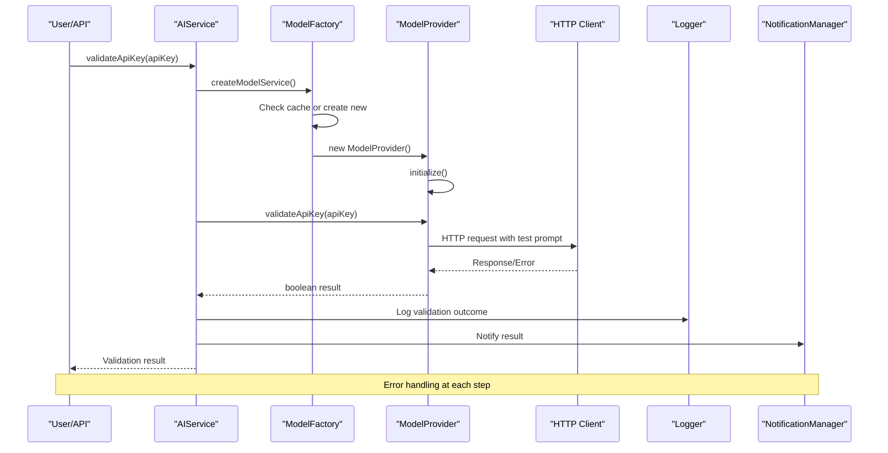
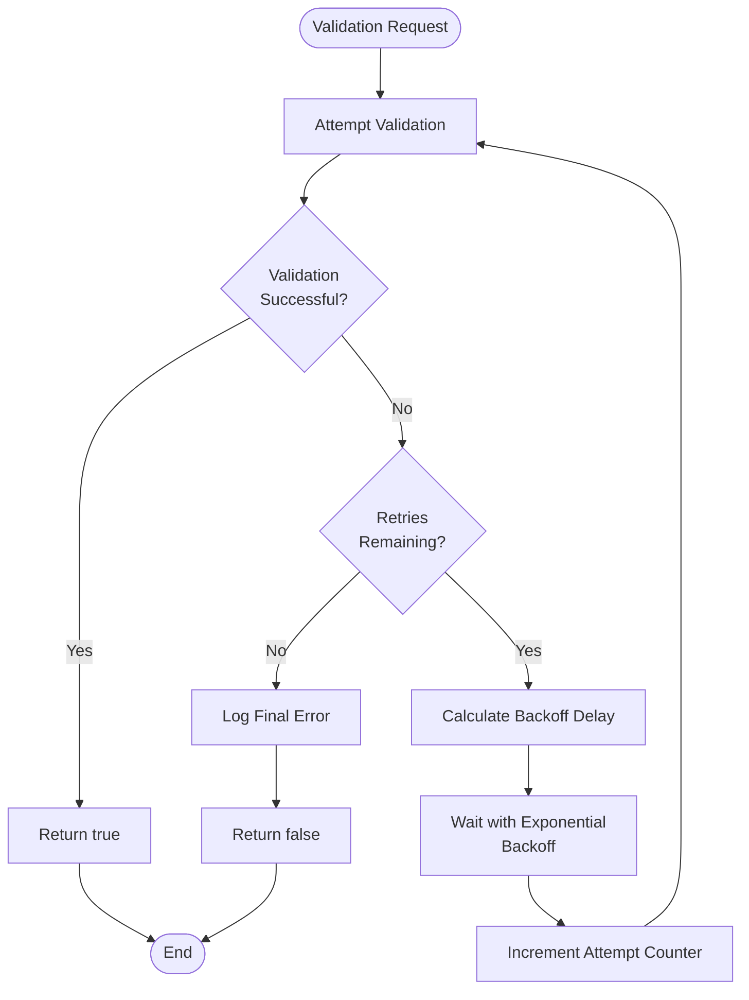
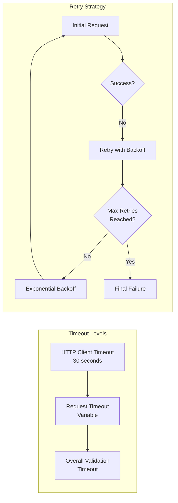
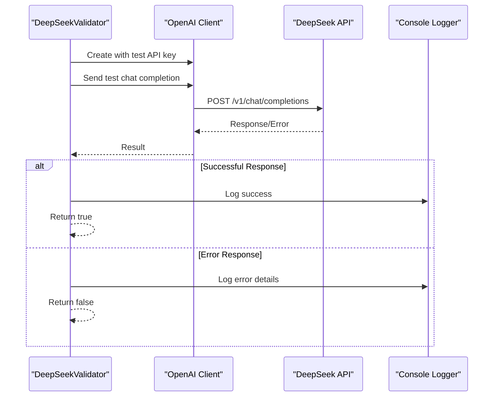
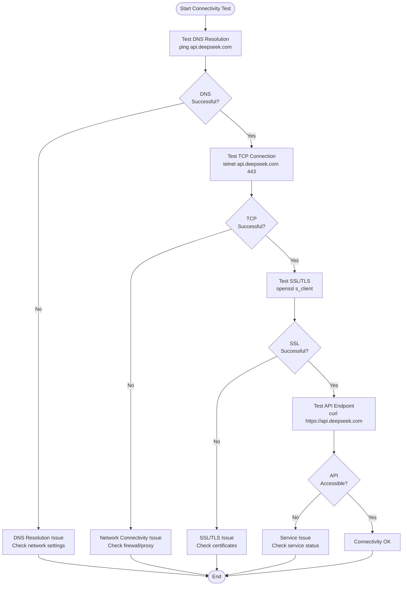
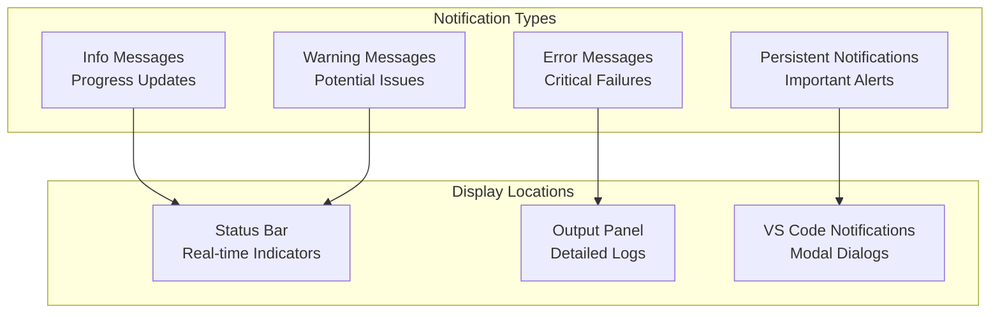
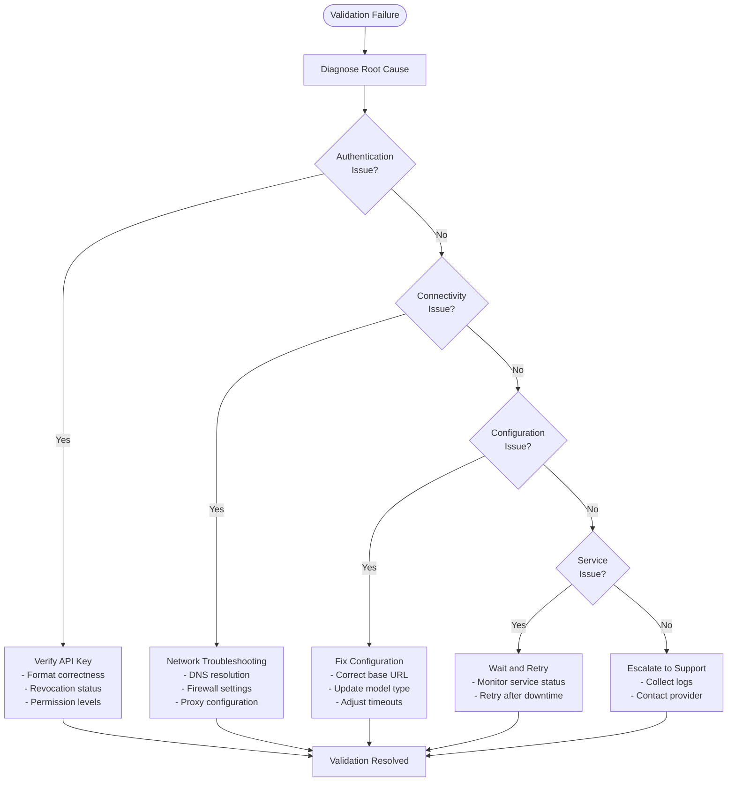

# API Key Validation Failures

<cite>
**Referenced Files in This Document**
- [aiService.ts](file://src/services/ai/aiService.ts)
- [modelFactory.ts](file://src/models/modelFactory.ts)
- [deepseek.ts](file://src/models/providers/deepseek.ts)
- [modelInterface.ts](file://src/models/modelInterface.ts)
- [retryUtils.ts](file://src/utils/retryUtils.ts)
- [appConfig.ts](file://src/config/appConfig.ts)
- [logger.ts](file://src/utils/logger.ts)
- [notificationManager.ts](file://src/services/notification/notificationManager.ts)
- [output.ts](file://src/i18n/en/output.ts)
</cite>

## Table of Contents
1. [Introduction](#introduction)
2. [Validation Workflow Architecture](#validation-workflow-architecture)
3. [Core Validation Method](#core-validation-method)
4. [Error Handling Mechanisms](#error-handling-mechanisms)
5. [Common Failure Scenarios](#common-failure-scenarios)
6. [Network Connectivity Issues](#network-connectivity-issues)
7. [Key Validation Process](#key-validation-process)
8. [Troubleshooting Guide](#troubleshooting-guide)
9. [Diagnostic Tools](#diagnostic-tools)
10. [Recovery Actions](#recovery-actions)

## Introduction

API key validation is a critical component of CodeKarmic's AI service integration, ensuring that user-provided API keys are valid and functional before attempting to make AI model requests. The validation system employs a multi-layered approach with sophisticated error handling, retry mechanisms, and comprehensive logging to provide robust validation capabilities while maintaining excellent user experience during failure scenarios.

The validation process involves several key components working together: the AIService orchestrates the validation workflow, the ModelFactory creates appropriate model service instances, and the specific model providers (like DeepSeek) implement the actual validation logic. This architecture ensures flexibility while maintaining consistent error handling across different AI providers.

## Validation Workflow Architecture

The API key validation follows a structured workflow that begins with the AIService's validateApiKey method and progresses through multiple layers of abstraction and error handling.



**Diagram sources**
- [aiService.ts](file://src/services/ai/aiService.ts#L712-L724)
- [modelFactory.ts](file://src/models/modelFactory.ts#L58-L109)
- [deepseek.ts](file://src/models/providers/deepseek.ts#L47-L80)

**Section sources**
- [aiService.ts](file://src/services/ai/aiService.ts#L712-L724)
- [modelFactory.ts](file://src/models/modelFactory.ts#L58-L109)

## Core Validation Method

The primary validation method resides in the AIService class, specifically at lines 712-724. This method serves as the central entry point for API key validation and implements comprehensive error handling throughout the validation process.

### Method Signature and Implementation

The validateApiKey method follows a straightforward yet robust pattern:

```typescript
public async validateApiKey(apiKey: string): Promise<boolean>
```

The implementation demonstrates several key validation principles:

1. **Factory Pattern Usage**: Creates a model service instance through the ModelFactory
2. **Service Delegation**: Delegates actual validation to the model service's validateApiKey method
3. **Comprehensive Error Handling**: Catches and handles all potential exceptions
4. **Logging Integration**: Provides detailed logging for debugging and monitoring
5. **User Feedback**: Communicates validation results through the notification system

### Validation Flow Analysis

The validation process executes through several critical steps:

1. **Factory Initialization**: Retrieves the singleton ModelFactory instance
2. **Service Creation**: Creates a model service instance for the configured AI provider
3. **Provider Validation**: Calls the model-specific validation method
4. **Result Processing**: Handles successful validation or failure scenarios
5. **Error Reporting**: Logs errors and notifies users appropriately

**Section sources**
- [aiService.ts](file://src/services/ai/aiService.ts#L712-L724)

## Error Handling Mechanisms

CodeKarmic implements a multi-tiered error handling system designed to gracefully manage various failure scenarios while providing meaningful feedback to users.

### Retry Infrastructure

The system employs sophisticated retry mechanisms through the `withRetry` utility function, which provides configurable exponential backoff retry logic.



**Diagram sources**
- [retryUtils.ts](file://src/utils/retryUtils.ts#L33-L69)

### Network Error Classification

The system categorizes errors into retryable and non-retryable categories using predefined error patterns:

| Error Category | Patterns | Retry Behavior |
|----------------|----------|----------------|
| **Network Timeouts** | ETIMEDOUT, ESOCKETTIMEDOUT, timeout | Automatic retry with backoff |
| **Connection Issues** | ECONNRESET, socket hang up | Automatic retry with backoff |
| **Rate Limiting** | rate limit, too many requests | Automatic retry with backoff |
| **Server Errors** | 5xx status codes, internal server error | Automatic retry with backoff |
| **Authentication** | Invalid API key, unauthorized | Immediate failure |
| **Configuration** | Missing API key, invalid model | Immediate failure |

### Error Propagation Strategy

The error handling follows a hierarchical approach:

1. **Provider Level**: Model-specific providers handle provider-specific errors
2. **Factory Level**: ModelFactory manages creation and caching errors
3. **Service Level**: AIService coordinates validation and handles service-level errors
4. **UI Level**: NotificationManager presents errors to users in appropriate formats

**Section sources**
- [retryUtils.ts](file://src/utils/retryUtils.ts#L95-L116)
- [deepseek.ts](file://src/models/providers/deepseek.ts#L47-L80)

## Common Failure Scenarios

Understanding the most frequent API key validation failure scenarios helps users diagnose and resolve issues effectively.

### Validly Formatted but Rejected Keys

One of the most common scenarios involves API keys that appear valid but are rejected by the AI service provider. This can occur due to:

- **Revoked Keys**: Keys that were previously valid but have been revoked by the provider
- **Insufficient Permissions**: Keys lacking necessary permissions for the requested operations
- **Quota Exceeded**: Keys that have reached their usage limits
- **Geographic Restrictions**: Keys restricted to specific geographic regions
- **Account Suspension**: Accounts associated with the key being suspended

### Configuration Issues

Many validation failures stem from configuration problems:

- **Incorrect Base URL**: Misconfigured endpoint URLs
- **Wrong Model Type**: Unsupported or incorrect model specifications
- **Missing Environment Variables**: Required environment configurations
- **Proxy Settings**: Incorrect proxy configurations affecting connectivity

### Service Availability Problems

Temporary service unavailability can cause validation failures:

- **Provider Downtime**: Scheduled maintenance or unexpected outages
- **Regional Issues**: Geographic service disruptions
- **Overload Conditions**: High traffic causing temporary unavailability

**Section sources**
- [deepseek.ts](file://src/models/providers/deepseek.ts#L47-L80)
- [modelFactory.ts](file://src/models/modelFactory.ts#L84-L113)

## Network Connectivity Issues

Network-related failures represent a significant portion of API key validation problems. The system implements comprehensive network error detection and handling.

### Timeout Management

The validation system uses multiple timeout strategies:



**Diagram sources**
- [deepseek.ts](file://src/models/providers/deepseek.ts#L12-L13)
- [retryUtils.ts](file://src/utils/retryUtils.ts#L19-L23)

### Connectivity Detection

The system implements several connectivity verification mechanisms:

1. **DNS Resolution**: Validates domain name resolution
2. **TCP Connection**: Tests basic TCP connectivity
3. **SSL/TLS Handshake**: Verifies secure connection establishment
4. **HTTP Protocol**: Confirms HTTP protocol compliance
5. **Authentication Endpoint**: Tests authentication endpoint accessibility

### Proxy and Firewall Considerations

Network validation accounts for various network environments:

- **Corporate Networks**: Proxy server configurations
- **Firewall Restrictions**: Port blocking and protocol restrictions
- **VPN Connections**: Virtual private network interference
- **Network Policies**: Organization-specific network policies

**Section sources**
- [deepseek.ts](file://src/models/providers/deepseek.ts#L26-L41)
- [retryUtils.ts](file://src/utils/retryUtils.ts#L33-L69)

## Key Validation Process

The actual key validation process varies by provider but follows a consistent pattern across all supported AI services.

### DeepSeek Provider Validation

The DeepSeek model provider implements a specific validation approach:



**Diagram sources**
- [deepseek.ts](file://src/models/providers/deepseek.ts#L47-L80)

### Validation Test Implementation

Each provider implements validation using a standardized test approach:

1. **Test Prompt**: Sends a simple "Hello" message to establish connectivity
2. **Minimal Response**: Requests minimal response length (5 tokens)
3. **System Message**: Includes a basic system prompt for context
4. **Error Detection**: Captures and analyzes error responses
5. **Success Criteria**: Validates successful response structure

### Provider-Specific Validation

Different providers may implement specialized validation:

- **DeepSeek**: Validates authentication and basic chat completion
- **OpenAI**: Extends validation to include specific OpenAI features
- **Custom Providers**: Supports provider-specific validation requirements

**Section sources**
- [deepseek.ts](file://src/models/providers/deepseek.ts#L47-L80)
- [modelInterface.ts](file://src/models/modelInterface.ts#L46-L51)

## Troubleshooting Guide

This comprehensive troubleshooting guide addresses common API key validation issues and provides step-by-step resolution procedures.

### Initial Diagnosis Steps

When encountering API key validation failures, follow this diagnostic sequence:

1. **Verify Key Format**: Ensure the API key follows the expected format
2. **Check Configuration**: Confirm the key is properly configured in settings
3. **Test Connectivity**: Verify network connectivity to the AI service
4. **Review Logs**: Examine extension logs for detailed error information
5. **Validate Service Status**: Check if the AI service is operational

### Network Connectivity Testing



### Configuration Verification

Critical configuration checks for API key validation:

| Configuration Item | Expected Value | Validation Method |
|-------------------|----------------|-------------------|
| **API Key Format** | Starts with "sk-" | Regex pattern validation |
| **Base URL** | HTTPS endpoint | URL parsing and connectivity |
| **Model Type** | Supported type | Enum validation |
| **Timeout Settings** | Reasonable values | Numeric range validation |
| **Retry Configuration** | Positive integers | Integer validation |

### Service Availability Checks

Monitor service health through multiple channels:

1. **Provider Status Pages**: Check official service status
2. **API Health Endpoints**: Test specific health check endpoints
3. **Community Reports**: Monitor community forums and social media
4. **Alternative Endpoints**: Test with backup endpoints if available

**Section sources**
- [appConfig.ts](file://src/config/appConfig.ts#L145-L156)
- [notificationManager.ts](file://src/services/notification/notificationManager.ts#L79-L121)

## Diagnostic Tools

CodeKarmic provides comprehensive diagnostic capabilities to help identify and resolve API key validation issues.

### Extension Output Logging

The extension maintains detailed logs in the VS Code Output panel:

```typescript
// Example log entry format
console.log(`[${new Date().toISOString()}] API key validation attempt for model: ${modelType}`);
console.error('API key validation error:', error);
```

### Log Level Configuration

Configure logging verbosity through the extension settings:

- **ERROR**: Critical failures only
- **WARN**: Warnings and errors
- **INFO**: General information and warnings
- **DEBUG**: Detailed debugging information

### Real-time Monitoring

The notification system provides real-time feedback during validation:



**Diagram sources**
- [notificationManager.ts](file://src/services/notification/notificationManager.ts#L130-L142)
- [logger.ts](file://src/utils/logger.ts#L8-L13)

### Performance Metrics

Track validation performance metrics:

- **Response Time**: Time taken for validation requests
- **Success Rate**: Percentage of successful validations
- **Error Distribution**: Types and frequencies of errors
- **Retry Statistics**: Number of retries attempted

**Section sources**
- [logger.ts](file://src/utils/logger.ts#L50-L88)
- [notificationManager.ts](file://src/services/notification/notificationManager.ts#L79-L121)

## Recovery Actions

When API key validation fails, users can take several recovery actions depending on the specific failure scenario.

### Immediate Recovery Steps

For most validation failures, follow these immediate steps:

1. **Refresh Configuration**: Reload the extension configuration
2. **Clear Cache**: Clear any cached validation results
3. **Retry Validation**: Attempt validation again immediately
4. **Check Network**: Verify network connectivity
5. **Review Settings**: Double-check all configuration settings

### Advanced Recovery Procedures

For persistent validation issues:



### Preventive Measures

Implement preventive measures to reduce future validation failures:

1. **Regular Testing**: Periodically test API key validity
2. **Monitoring Setup**: Implement automated monitoring
3. **Backup Keys**: Maintain backup API keys
4. **Documentation**: Keep validation procedures documented
5. **Training**: Train users on proper configuration

### Escalation Procedures

For unresolved issues requiring external assistance:

1. **Gather Information**: Collect all relevant logs and error messages
2. **Contact Support**: Reach out to AI service provider support
3. **Provide Details**: Share comprehensive diagnostic information
4. **Follow Up**: Track resolution progress
5. **Verify Fix**: Confirm the issue is resolved

**Section sources**
- [aiService.ts](file://src/services/ai/aiService.ts#L712-L724)
- [notificationManager.ts](file://src/services/notification/notificationManager.ts#L183-L210)