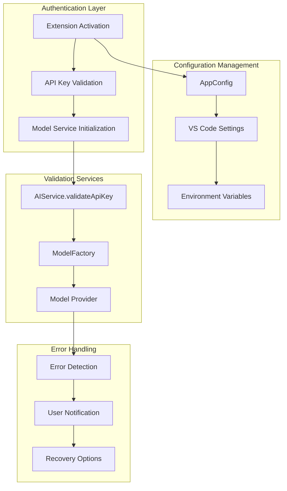
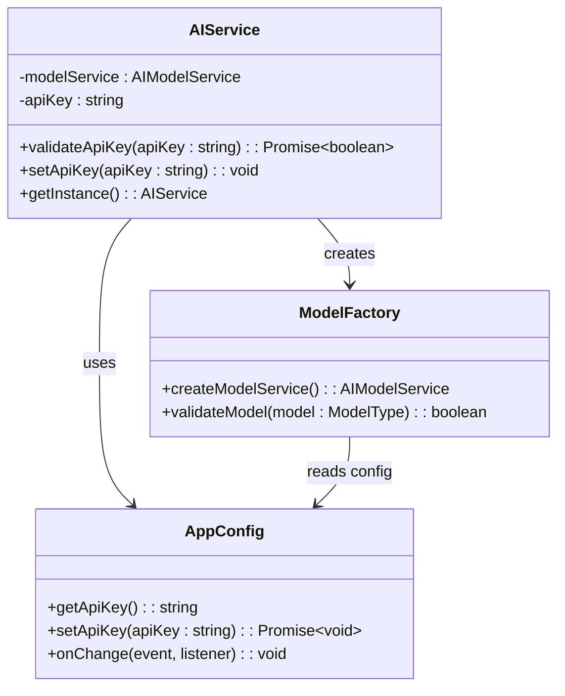
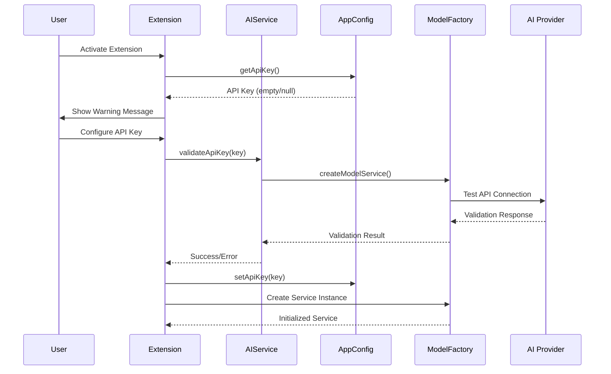
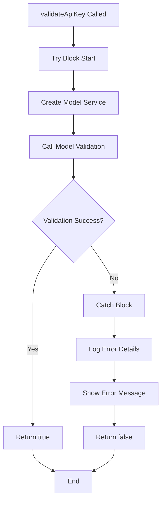
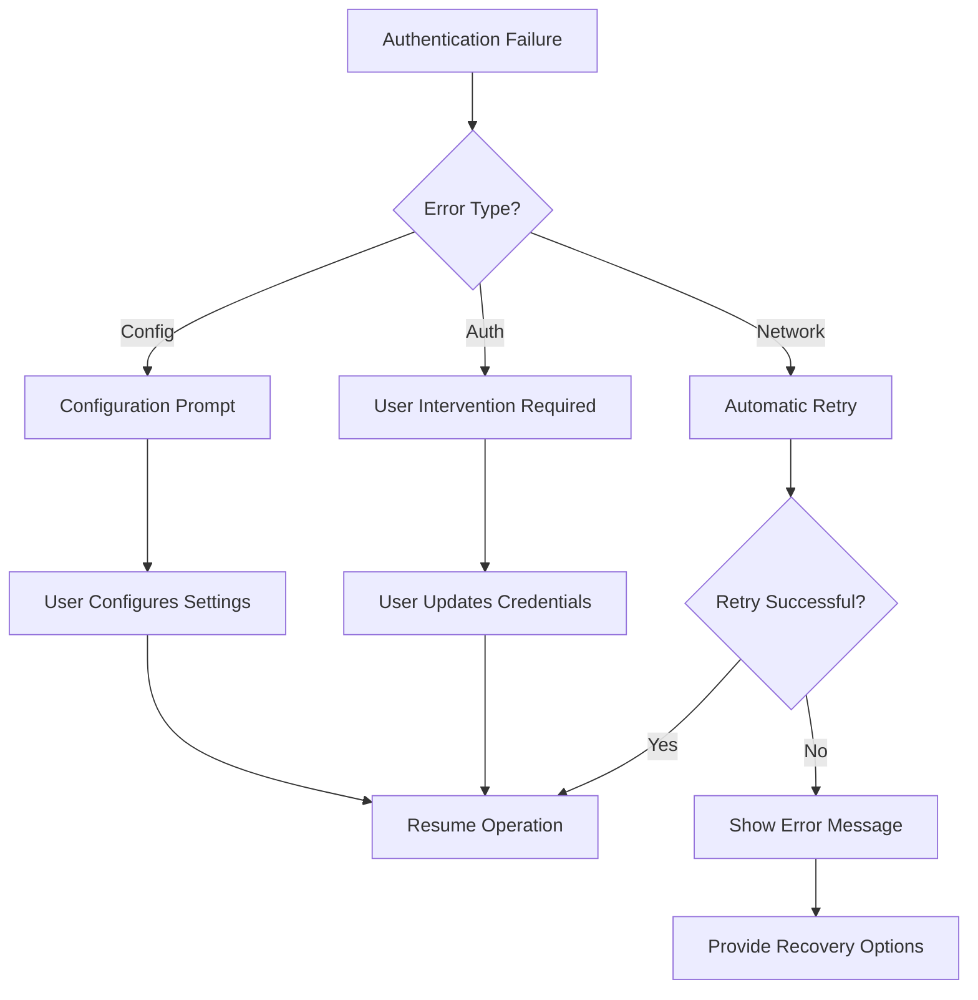

# Authentication Problems

<cite>
**Referenced Files in This Document**
- [src/services/ai/aiService.ts](file://src/services/ai/aiService.ts)
- [src/extension.ts](file://src/extension.ts)
- [src/config/appConfig.ts](file://src/config/appConfig.ts)
- [src/models/modelValidator.ts](file://src/models/modelValidator.ts)
- [src/models/types.ts](file://src/models/types.ts)
- [src/models/modelFactory.ts](file://src/models/modelFactory.ts)
- [src/models/baseModelAdapter.ts](file://src/models/baseModelAdapter.ts)
- [src/models/providers/deepseek.ts](file://src/models/providers/deepseek.ts)
- [src/i18n/index.ts](file://src/i18n/index.ts)
- [src/i18n/en/ui.ts](file://src/i18n/en/ui.ts)
- [src/i18n/zh/ui.ts](file://src/i18n/zh/ui.ts)
- [src/i18n/en/output.ts](file://src/i18n/en/output.ts)
- [src/i18n/zh/output.ts](file://src/i18n/zh/output.ts)
- [src/utils/retryUtils.ts](file://src/utils/retryUtils.ts)
- [package.json](file://package.json)
</cite>

## Table of Contents
1. [Introduction](#introduction)
2. [Authentication Architecture](#authentication-architecture)
3. [Key Components](#key-components)
4. [Authentication Workflow](#authentication-workflow)
5. [Common Authentication Issues](#common-authentication-issues)
6. [Error Handling and Validation](#error-handling-and-validation)
7. [Troubleshooting Guide](#troubleshooting-guide)
8. [Configuration Management](#configuration-management)
9. [Recovery Procedures](#recovery-procedures)
10. [Best Practices](#best-practices)

## Introduction

CodeKarmic implements a robust authentication system for AI-powered code review functionality. The authentication mechanism ensures secure access to external AI services while providing comprehensive error handling and user-friendly recovery procedures. This document covers authentication scenarios, error handling patterns, and troubleshooting procedures for common authentication issues.

## Authentication Architecture

The authentication system in CodeKarmic follows a layered architecture with multiple validation points and error handling mechanisms:



**Diagram sources**
- [src/extension.ts](file://src/extension.ts#L20-L66)
- [src/services/ai/aiService.ts](file://src/services/ai/aiService.ts#L40-L70)
- [src/config/appConfig.ts](file://src/config/appConfig.ts#L49-L88)

## Key Components

### AIService Authentication Methods

The `AIService` class provides the primary interface for authentication operations:



**Diagram sources**
- [src/services/ai/aiService.ts](file://src/services/ai/aiService.ts#L40-L70)
- [src/config/appConfig.ts](file://src/config/appConfig.ts#L49-L88)
- [src/models/modelFactory.ts](file://src/models/modelFactory.ts#L58-L110)

### Configuration Management

The `AppConfig` class manages all configuration aspects including API keys:

| Configuration Key | Type | Default Value | Description |
|------------------|------|---------------|-------------|
| `apiKey` | string | "" | AI service API key |
| `modelType` | string | "deepseek-reasoner" | Selected AI model |
| `baseUrl` | string | "https://api.deepseek.com/v1" | API endpoint URL |
| `language` | string | "ENGLISH" | User interface language |

**Section sources**
- [src/config/appConfig.ts](file://src/config/appConfig.ts#L37-L42)
- [package.json](file://package.json#L121-L126)

## Authentication Workflow

The authentication process follows a structured workflow with multiple validation checkpoints:



**Diagram sources**
- [src/extension.ts](file://src/extension.ts#L37-L66)
- [src/services/ai/aiService.ts](file://src/services/ai/aiService.ts#L712-L724)
- [src/config/appConfig.ts](file://src/config/appConfig.ts#L145-L156)

**Section sources**
- [src/extension.ts](file://src/extension.ts#L20-L66)
- [src/services/ai/aiService.ts](file://src/services/ai/aiService.ts#L40-L70)

## Common Authentication Issues

### Invalid API Keys

**Symptoms:**
- Error message: "API key validation failed"
- Extension fails to initialize AI services
- Code review commands unavailable

**Causes:**
- Incorrect API key format
- Expired or revoked API key
- Insufficient permissions on the API key
- Network connectivity issues during validation

**Section sources**
- [src/services/ai/aiService.ts](file://src/services/ai/aiService.ts#L712-L724)
- [src/models/providers/deepseek.ts](file://src/models/providers/deepseek.ts#L54-L93)

### Unconfigured Authentication Credentials

**Symptoms:**
- Warning message: "API key not configured"
- Extension prompts for API key configuration
- Limited functionality until configuration is complete

**Causes:**
- Fresh installation without API key setup
- API key removed or cleared from settings
- Configuration file corruption

**Section sources**
- [src/extension.ts](file://src/extension.ts#L37-L66)
- [src/i18n/en/ui.ts](file://src/i18n/en/ui.ts#L42)

### Model Validation Failures

**Symptoms:**
- Error message: "Unsupported model type"
- Extension fails to start
- Model selection unavailable

**Causes:**
- Invalid model type configuration
- Unsupported model specification
- Model type mismatch

**Section sources**
- [src/models/modelValidator.ts](file://src/models/modelValidator.ts#L7-L14)
- [src/models/types.ts](file://src/models/types.ts#L10-L14)

## Error Handling and Validation

### AIService.validateApiKey Implementation

The `validateApiKey` method provides comprehensive error handling:



**Diagram sources**
- [src/services/ai/aiService.ts](file://src/services/ai/aiService.ts#L712-L724)

### Network-Related Validation Failures

The system implements robust retry mechanisms for network-related issues:

| Error Pattern | Retry Behavior | Recovery Action |
|---------------|----------------|-----------------|
| Connection timeouts | 2 attempts with exponential backoff | Manual retry or check network |
| Rate limiting | Automatic retry with delay | Wait and retry |
| Service unavailability | 2 attempts | Verify service status |
| Authentication errors | Immediate failure | User intervention required |

**Section sources**
- [src/utils/retryUtils.ts](file://src/utils/retryUtils.ts#L33-L70)
- [src/models/providers/deepseek.ts](file://src/models/providers/deepseek.ts#L198-L211)

### Error Message Localization

The system provides localized error messages for better user experience:

**English Messages:**
- `API key validation failed`
- `API key not configured`
- `API key validation error`

**Chinese Messages:**
- `API 密钥验证失败`
- `API 密钥未配置`
- `API 密钥验证错误`

**Section sources**
- [src/i18n/en/output.ts](file://src/i18n/en/output.ts#L188-L190)
- [src/i18n/zh/output.ts](file://src/i18n/zh/output.ts#L188-L190)

## Troubleshooting Guide

### Step 1: Verify API Key Configuration

**Check Current Configuration:**
1. Open VS Code settings
2. Navigate to CodeKarmic configuration
3. Verify API key field contains value

**Manual Verification:**
```typescript
// Check API key in development console
const config = AppConfig.getInstance();
console.log('Current API Key:', config.getApiKey());
```

### Step 2: Validate API Key Format

**Correct Formats:**
- OpenAI: `sk-*` (starts with "sk-")
- DeepSeek: `dsk-*` (starts with "dsk-")
- Custom APIs: Provider-specific format

**Incorrect Formats:**
- Truncated keys
- Keys with extra spaces
- Keys containing special characters

### Step 3: Test Network Connectivity

**Network Diagnostics:**
1. Check internet connection
2. Verify firewall settings
3. Test API endpoint accessibility
4. Check for proxy configurations

### Step 4: Review Error Logs

**Access Logs:**
1. Open VS Code Output panel
2. Select CodeKarmic channel
3. Review authentication-related logs

**Common Log Patterns:**
- `API key validation error:`
- `Failed to initialize model service:`
- `Network timeout`

**Section sources**
- [src/services/ai/aiService.ts](file://src/services/ai/aiService.ts#L712-L724)
- [src/models/providers/deepseek.ts](file://src/models/providers/deepseek.ts#L54-L93)

## Configuration Management

### Command Palette Configuration

Users can configure API keys through the command palette:

**Steps:**
1. Press `Ctrl+Shift+P` (Windows/Linux) or `Cmd+Shift+P` (Mac)
2. Type "Configure API Key"
3. Enter API key when prompted
4. Extension validates and saves configuration

**Section sources**
- [src/extension.ts](file://src/extension.ts#L81-L97)

### Settings UI Configuration

**Direct Settings Access:**
1. Open VS Code Settings
2. Search for "codekarmic.apiKey"
3. Paste API key value
4. Extension automatically validates and applies

**Section sources**
- [src/extension.ts](file://src/extension.ts#L62-L64)

### Programmatic Configuration

**API Configuration Methods:**
```typescript
// Set API key programmatically
const config = AppConfig.getInstance();
await config.setApiKey('your-api-key');

// Get current API key
const apiKey = config.getApiKey();
```

**Section sources**
- [src/config/appConfig.ts](file://src/config/appConfig.ts#L145-L156)

## Recovery Procedures

### Automatic Recovery

The system implements automatic recovery for transient issues:



**Diagram sources**
- [src/utils/retryUtils.ts](file://src/utils/retryUtils.ts#L33-L70)
- [src/extension.ts](file://src/extension.ts#L37-L66)

### Manual Recovery Steps

**For Invalid API Keys:**
1. Obtain new API key from provider
2. Clear existing configuration
3. Reconfigure with new key
4. Restart VS Code

**For Network Issues:**
1. Check internet connection
2. Verify firewall settings
3. Test API endpoint manually
4. Retry operation

**For Configuration Errors:**
1. Reset to default settings
2. Reconfigure step by step
3. Validate each setting
4. Test functionality

### Recovery Options

**Immediate Actions:**
- Configure API key via command palette
- Open settings UI
- Restart extension

**Advanced Recovery:**
- Clear cached model services
- Reset configuration to defaults
- Reinstall extension

**Section sources**
- [src/extension.ts](file://src/extension.ts#L37-L66)
- [src/models/modelFactory.ts](file://src/models/modelFactory.ts#L127-L139)

## Best Practices

### Security Considerations

**API Key Protection:**
- Store keys securely in VS Code settings
- Avoid sharing configuration files
- Use environment variables for sensitive deployments
- Regularly rotate API keys

**Access Control:**
- Limit API key permissions
- Monitor usage patterns
- Implement rate limiting
- Use separate keys for different environments

### Performance Optimization

**Connection Management:**
- Enable connection pooling
- Implement keep-alive connections
- Use appropriate timeout values
- Cache validated credentials

**Error Handling:**
- Implement exponential backoff
- Provide meaningful error messages
- Log diagnostic information
- Offer recovery suggestions

### Monitoring and Maintenance

**Regular Checks:**
- Validate API key periodically
- Monitor service availability
- Track error rates
- Review performance metrics

**Maintenance Tasks:**
- Update API endpoints
- Refresh certificates
- Review permission scopes
- Audit access logs

**Section sources**
- [src/utils/retryUtils.ts](file://src/utils/retryUtils.ts#L1-L116)
- [src/models/providers/deepseek.ts](file://src/models/providers/deepseek.ts#L54-L93)