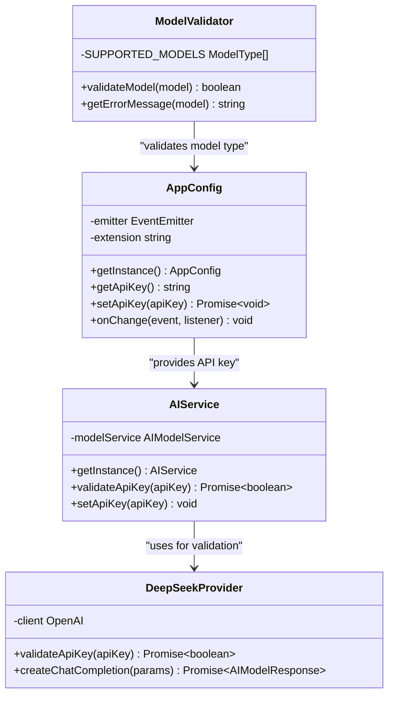
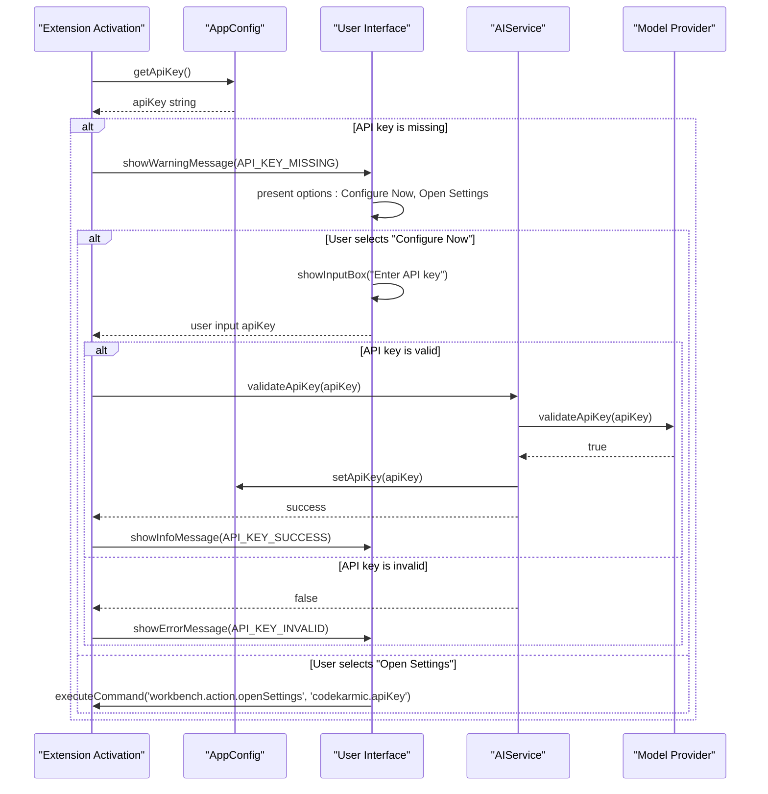
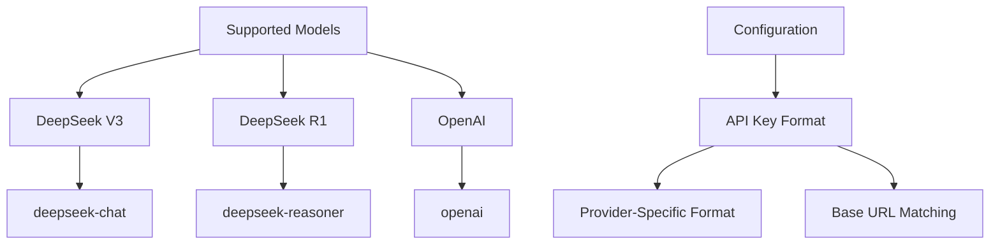
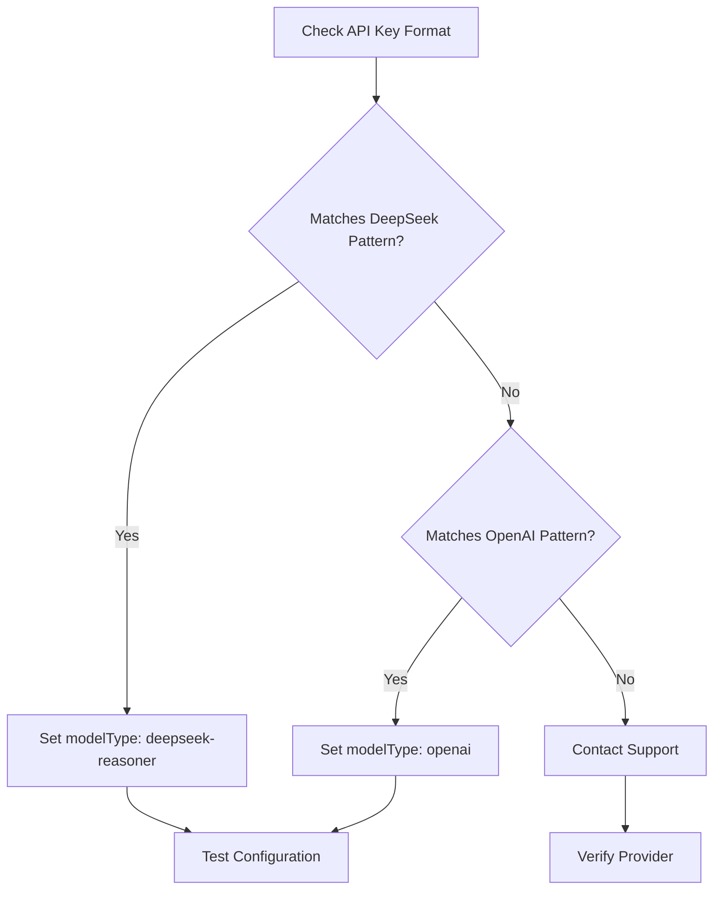

# Invalid API Key Configuration

<cite>
**Referenced Files in This Document**
- [extension.ts](file://src/extension.ts)
- [appConfig.ts](file://src/config/appConfig.ts)
- [modelValidator.ts](file://src/models/modelValidator.ts)
- [types.ts](file://src/models/types.ts)
- [aiService.ts](file://src/services/ai/aiService.ts)
- [deepseek.ts](file://src/models/providers/deepseek.ts)
- [index.ts](file://src/i18n/index.ts)
- [ui.ts](file://src/i18n/en/ui.ts)
- [output.ts](file://src/i18n/en/output.ts)
- [package.json](file://package.json)
</cite>

## Table of Contents
1. [Introduction](#introduction)
2. [API Key Configuration Architecture](#api-key-configuration-architecture)
3. [Extension Activation and Validation](#extension-activation-and-validation)
4. [Configuration Scenarios and Error Messages](#configuration-scenarios-and-error-messages)
5. [Expected Configuration Format](#expected-configuration-format)
6. [Troubleshooting Steps](#troubleshooting-steps)
7. [Recovery Actions](#recovery-actions)
8. [Best Practices](#best-practices)
9. [Common Issues and Solutions](#common-issues-and-solutions)

## Introduction

The CodeKarmic extension relies on a valid API key to function properly for AI-powered code review capabilities. When users encounter invalid API key configuration issues, they receive specific error messages and guided recovery actions. This document covers all aspects of API key configuration problems, from detection to resolution.

## API Key Configuration Architecture

The extension implements a centralized configuration management system that handles API key validation and error reporting.



**Diagram sources**
- [appConfig.ts](file://src/config/appConfig.ts#L49-L188)
- [aiService.ts](file://src/services/ai/aiService.ts#L712-L736)
- [modelValidator.ts](file://src/models/modelValidator.ts#L4-L14)
- [deepseek.ts](file://src/models/providers/deepseek.ts#L54-L80)

**Section sources**
- [appConfig.ts](file://src/config/appConfig.ts#L49-L188)
- [aiService.ts](file://src/services/ai/aiService.ts#L712-L736)

## Extension Activation and Validation

The extension performs API key validation during activation through a sophisticated check mechanism.



**Diagram sources**
- [extension.ts](file://src/extension.ts#L37-L66)
- [appConfig.ts](file://src/config/appConfig.ts#L146-L156)
- [aiService.ts](file://src/services/ai/aiService.ts#L712-L736)

**Section sources**
- [extension.ts](file://src/extension.ts#L37-L66)
- [appConfig.ts](file://src/config/appConfig.ts#L146-L156)

## Configuration Scenarios and Error Messages

### Scenario 1: API Key Not Configured

**Condition**: The API key is empty or not set in VS Code settings.

**Detection**: The extension checks `AppConfig.getInstance().getApiKey()` during activation.

**Error Message**: "API key not configured. Please configure your API key to use code review features."

**User Experience**:
- Warning dialog appears with two options
- Immediate configuration prompt or settings navigation

### Scenario 2: Invalid API Key Format

**Condition**: The API key exists but fails validation against the model provider.

**Detection**: The extension attempts to validate the key using the model provider's API.

**Error Message**: "Invalid API key. Please check your key and try again."

**Validation Process**:
1. User enters API key through input box
2. Extension calls `AIService.validateApiKey()`
3. Model provider attempts a test API call
4. Validation returns success/failure

### Scenario 3: Wrong Model Provider Configuration

**Condition**: The configured model type doesn't match the API key format or provider.

**Detection**: Model validator checks supported model types.

**Error Message**: "Unsupported model type: [model_type]"

**Section sources**
- [extension.ts](file://src/extension.ts#L37-L66)
- [ui.ts](file://src/i18n/en/ui.ts#L40-L42)
- [output.ts](file://src/i18n/en/output.ts#L189-L190)

## Expected Configuration Format

### VS Code Settings Structure

The extension expects the following configuration structure in VS Code settings:

| Setting | Type | Default | Description |
|---------|------|---------|-------------|
| `codekarmic.apiKey` | string | "" | API key for AI service |
| `codekarmic.modelType` | string | "deepseek-reasoner" | AI model to use for code review |
| `codekarmic.baseUrl` | string | "https://api.deepseek.com/v1" | Base URL for API requests |
| `codekarmic.debugMode` | boolean | false | Enable debug mode |

### Supported Model Types



**Diagram sources**
- [types.ts](file://src/models/types.ts#L10-L13)
- [appConfig.ts](file://src/config/appConfig.ts#L37-L41)

### Correct Configuration Examples

**Example 1: DeepSeek API Key**
```json
{
  "codekarmic.apiKey": "sk-deepseek-your-api-key-here",
  "codekarmic.modelType": "deepseek-reasoner",
  "codekarmic.baseUrl": "https://api.deepseek.com/v1"
}
```

**Example 2: OpenAI API Key**
```json
{
  "codekarmic.apiKey": "sk-xxx-your-openai-key-here",
  "codekarmic.modelType": "openai",
  "codekarmic.baseUrl": "https://api.openai.com/v1"
}
```

**Section sources**
- [types.ts](file://src/models/types.ts#L10-L13)
- [appConfig.ts](file://src/config/appConfig.ts#L37-L41)
- [package.json](file://package.json#L121-L136)

## Troubleshooting Steps

### Step 1: Verify Configuration Path

**Action**: Check the correct settings path in VS Code.

**Procedure**:
1. Open VS Code Settings (Ctrl+, or Cmd+,)
2. Navigate to Extensions → CodeKarmic
3. Verify the `codekarmic.apiKey` field

**Alternative Method**:
```javascript
// Open settings directly to CodeKarmic section
vscode.commands.executeCommand('workbench.action.openSettings', 'codekarmic');
```

### Step 2: Check for Whitespace Characters

**Issue**: Hidden whitespace characters in API key.

**Solution**:
1. Copy the API key from your provider's dashboard
2. Paste into a plain text editor first
3. Copy again and paste into VS Code settings
4. Verify the key length matches expected format

### Step 3: Validate Model Provider Selection

**Action**: Ensure the model type matches your API key provider.

**Verification**:


**Diagram sources**
- [types.ts](file://src/models/types.ts#L10-L13)
- [deepseek.ts](file://src/models/providers/deepseek.ts#L54-L80)

**Section sources**
- [extension.ts](file://src/extension.ts#L37-L66)
- [appConfig.ts](file://src/config/appConfig.ts#L146-L156)

## Recovery Actions

### Method 1: Command Palette Recovery

**Step 1**: Access the Configure API Key command
- Press Ctrl+Shift+P (Windows/Linux) or Cmd+Shift+P (Mac)
- Type "Configure API Key" and select it

**Step 2**: Enter API Key
- A secure input box appears
- Paste your API key (password field hides input)
- Press Enter to submit

**Step 3**: Validation Process
- Extension validates the key with the model provider
- Success: Key stored and extension activated
- Failure: Error message displayed with retry option

### Method 2: Settings UI Recovery

**Step 1**: Open Settings
```javascript
vscode.commands.executeCommand('workbench.action.openSettings', 'codekarmic');
```

**Step 2**: Locate API Key Field
- Navigate to CodeKarmic section
- Find "API Key" setting field

**Step 3**: Manual Entry
- Click pencil icon to edit
- Enter your API key
- Save changes (automatically triggers validation)

### Method 3: Programmatic Recovery

**Direct API Key Setting**:
```javascript
// Example code for programmatic API key setting
const config = AppConfig.getInstance();
await config.setApiKey('your-api-key-here');
```

**Section sources**
- [extension.ts](file://src/extension.ts#L82-L96)
- [extension.ts](file://src/extension.ts#L160-L178)
- [appConfig.ts](file://src/config/appConfig.ts#L146-L156)

## Best Practices

### API Key Security

1. **Never Share Keys**: Keep API keys confidential
2. **Environment Variables**: Consider using environment variables for sensitive configurations
3. **Key Rotation**: Regularly rotate API keys
4. **Scope Limitation**: Use keys with minimal required permissions

### Configuration Management

1. **Version Control**: Exclude sensitive settings from version control
2. **Backup**: Maintain backups of valid configurations
3. **Testing**: Test configurations in development environments first
4. **Documentation**: Document provider-specific requirements

### Error Prevention

1. **Format Validation**: Verify key format before saving
2. **Provider Compatibility**: Match model types with providers
3. **Network Connectivity**: Ensure stable internet connection
4. **Rate Limits**: Respect API rate limits and quotas

## Common Issues and Solutions

### Issue 1: "API key not configured" Repeatedly

**Symptoms**: Error persists after entering key
**Causes**:
- Incorrect model provider selection
- Network connectivity issues
- Key format mismatch

**Solutions**:
1. Verify model type matches API key provider
2. Check network connectivity
3. Re-enter key carefully (avoid copying from formatted text)

### Issue 2: "Invalid API key" Error

**Symptoms**: Key accepted but validation fails
**Causes**:
- Expired or revoked key
- Incorrect key format
- Provider-specific restrictions

**Solutions**:
1. Regenerate API key from provider dashboard
2. Verify key format matches provider requirements
3. Contact provider support for restrictions

### Issue 3: Model Type Conflicts

**Symptoms**: "Unsupported model type" error
**Causes**:
- Incorrect model type selection
- Deprecated model types
- Provider-specific limitations

**Solutions**:
1. Check supported model types for your provider
2. Update to current model types
3. Verify provider documentation

### Issue 4: Configuration Not Persisting

**Symptoms**: Settings reset after restart
**Causes**:
- Workspace-specific settings
- Permission issues
- Corrupted settings file

**Solutions**:
1. Set configuration globally (not just workspace)
2. Check VS Code settings file permissions
3. Reset VS Code settings if corrupted

**Section sources**
- [extension.ts](file://src/extension.ts#L153-L178)
- [aiService.ts](file://src/services/ai/aiService.ts#L712-L736)
- [deepseek.ts](file://src/models/providers/deepseek.ts#L54-L80)