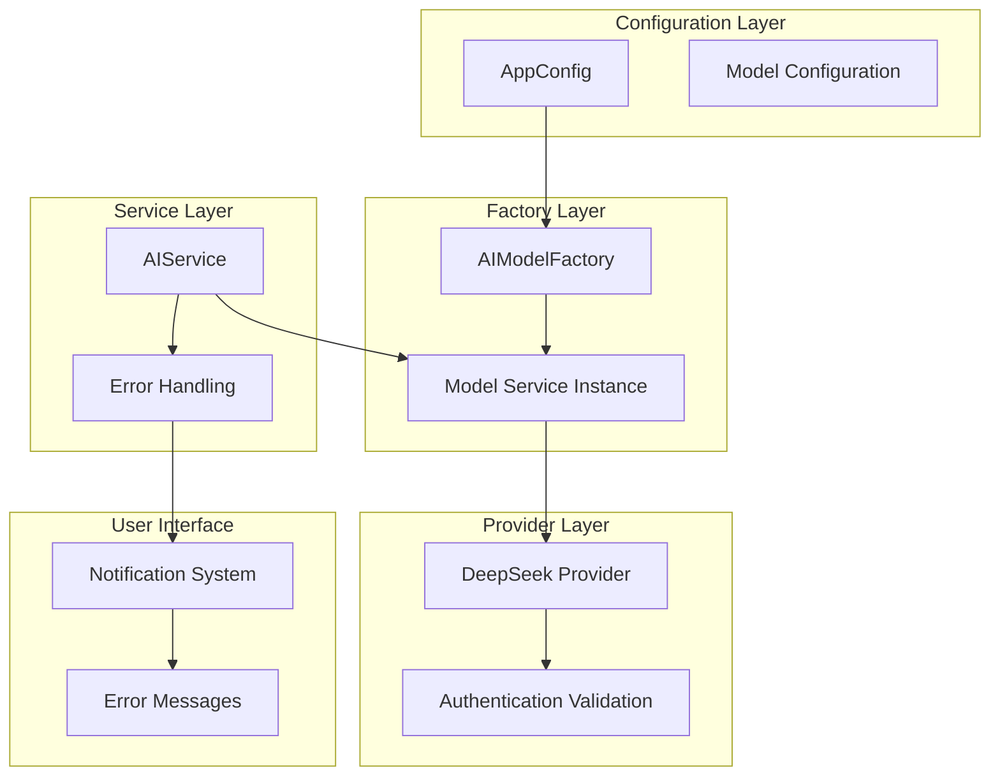
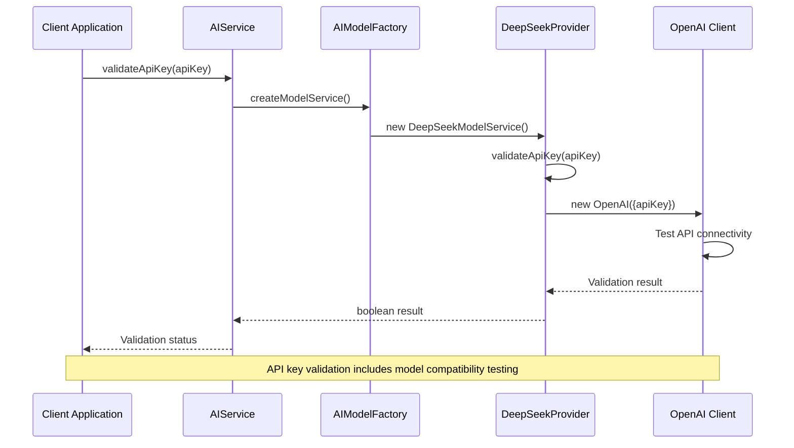
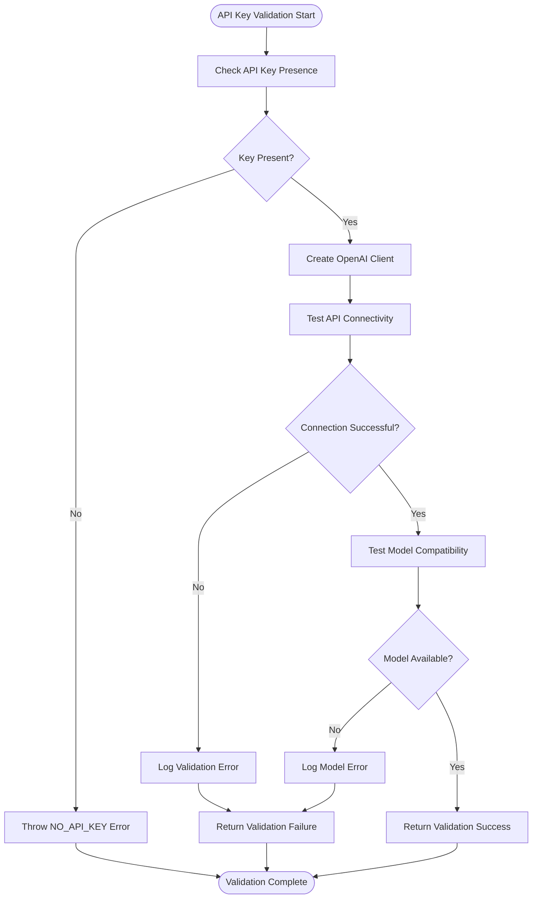
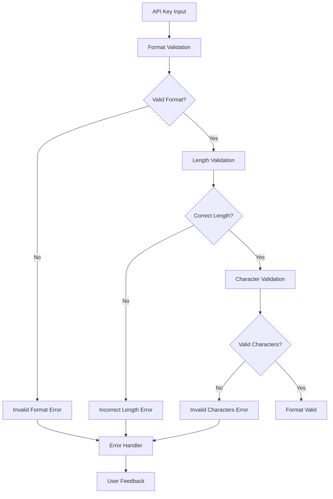
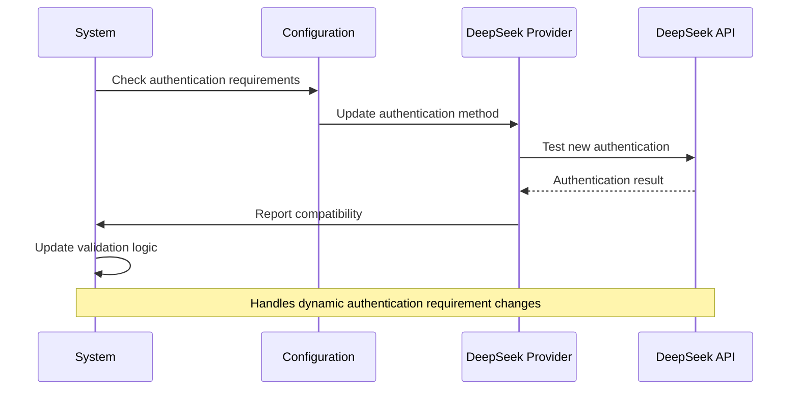
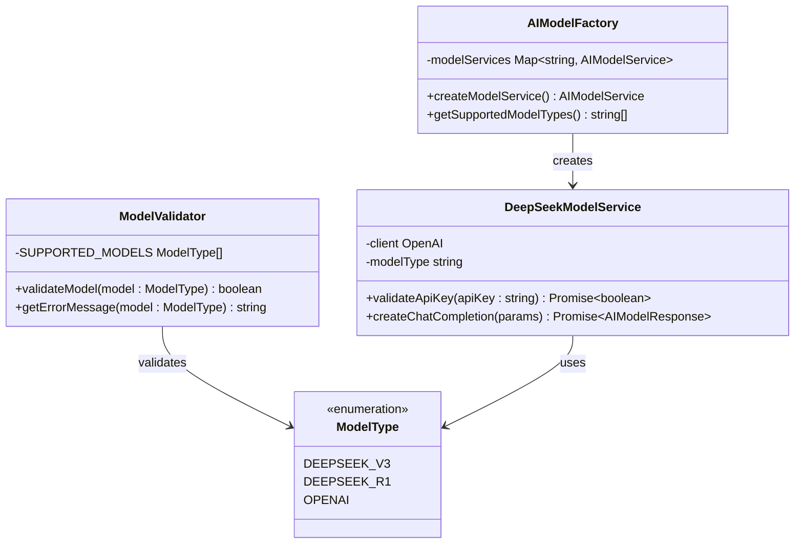
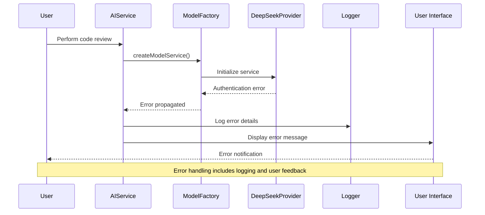
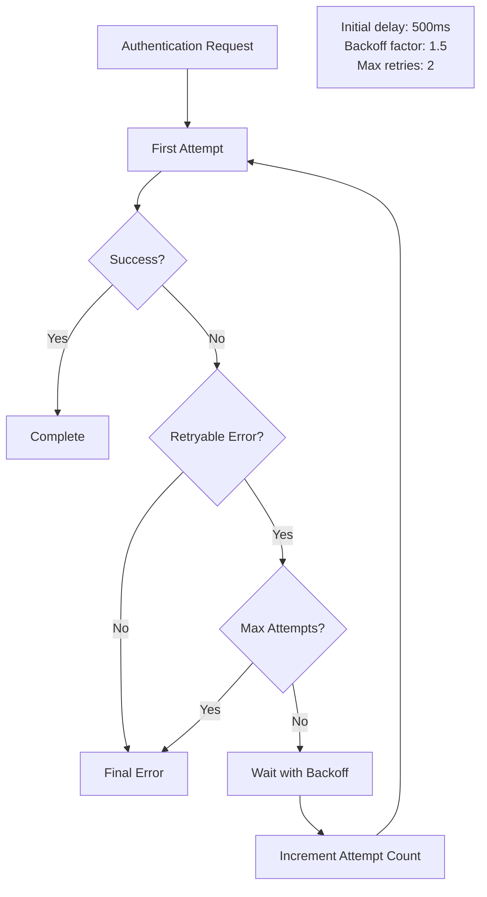
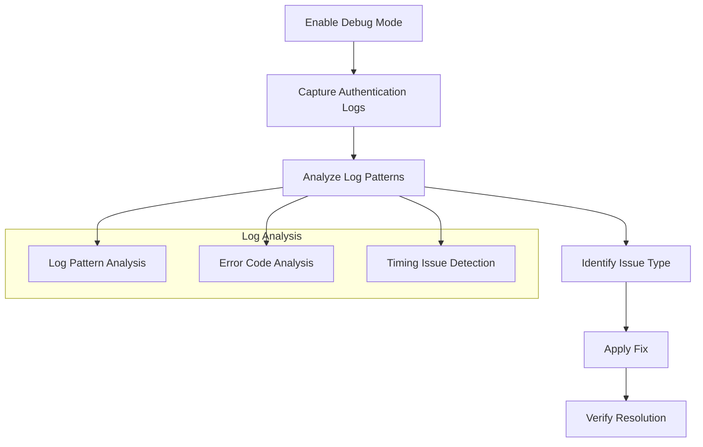

# Model Authentication Errors

<cite>
**Referenced Files in This Document**
- [modelFactory.ts](file://src/models/modelFactory.ts)
- [deepseek.ts](file://src/models/providers/deepseek.ts)
- [aiService.ts](file://src/services/ai/aiService.ts)
- [baseModel.ts](file://src/models/baseModel.ts)
- [modelValidator.ts](file://src/models/modelValidator.ts)
- [modelInterface.ts](file://src/models/modelInterface.ts)
- [types.ts](file://src/models/types.ts)
- [appConfig.ts](file://src/config/appConfig.ts)
- [chatTypes.ts](file://src/models/chatTypes.ts)
- [retryUtils.ts](file://src/utils/retryUtils.ts)
- [output.ts](file://src/i18n/en/output.ts)
</cite>

## Table of Contents
1. [Introduction](#introduction)
2. [Authentication Architecture Overview](#authentication-architecture-overview)
3. [DeepSeek Provider Authentication](#deepseek-provider-authentication)
4. [Error Scenarios and Validation](#error-scenarios-and-validation)
5. [Error Propagation Through Service Layers](#error-propagation-through-service-layers)
6. [Troubleshooting Guide](#troubleshooting-guide)
7. [Best Practices](#best-practices)
8. [Conclusion](#conclusion)

## Introduction

CodeKarmic implements a sophisticated authentication system for AI model providers, with particular emphasis on the DeepSeek provider. This system handles various authentication scenarios, including API key validation, provider-specific authentication requirements, and error propagation through multiple service layers. The authentication framework is designed to provide clear error messages and robust fallback mechanisms while maintaining security and reliability.

The authentication system operates across several layers: configuration management, model factory instantiation, provider-specific validation, and service layer communication. Each layer implements specific error handling patterns to ensure that authentication failures are properly communicated to users while maintaining system stability.

## Authentication Architecture Overview

The CodeKarmic authentication system follows a layered architecture that separates concerns between configuration, validation, and service delivery. This design enables flexible provider support while maintaining consistent error handling patterns.

**Diagram sources**
- [modelFactory.ts](file://src/models/modelFactory.ts#L19-L140)
- [aiService.ts](file://src/services/ai/aiService.ts#L40-L787)
- [appConfig.ts](file://src/config/appConfig.ts#L49-L189)

The architecture ensures that authentication errors are properly captured and communicated through each layer, with appropriate error context and user-friendly messaging.

**Section sources**
- [modelFactory.ts](file://src/models/modelFactory.ts#L19-L140)
- [aiService.ts](file://src/services/ai/aiService.ts#L40-L787)
- [appConfig.ts](file://src/config/appConfig.ts#L49-L189)

## DeepSeek Provider Authentication

The DeepSeek provider implements comprehensive authentication validation that goes beyond simple API key verification. The authentication system handles multiple scenarios including API key validity, model compatibility, and provider-specific requirements.

### API Key Validation Process

The DeepSeek provider implements a sophisticated API key validation mechanism that tests key functionality before accepting it for use:

**Diagram sources**
- [deepseek.ts](file://src/models/providers/deepseek.ts#L47-L81)
- [aiService.ts](file://src/services/ai/aiService.ts#L712-L723)

### Authentication Configuration

The DeepSeek provider requires specific configuration parameters that are validated during service initialization:

| Configuration Parameter | Purpose | Validation Rules |
|------------------------|---------|------------------|
| `apiKey` | Authentication credential | Required, non-empty string |
| `baseURL` | API endpoint URL | Must be valid HTTPS URL |
| `modelType` | Specific model identifier | Must match supported models |
| `timeout` | Request timeout | Must be positive integer |
| `maxRetries` | Retry attempts | Must be non-negative integer |

**Section sources**
- [deepseek.ts](file://src/models/providers/deepseek.ts#L11-L211)
- [modelFactory.ts](file://src/models/modelFactory.ts#L58-L113)

### Provider-Specific Authentication Logic

The DeepSeek provider implements specialized authentication logic that accounts for provider-specific requirements:

**Diagram sources**
- [deepseek.ts](file://src/models/providers/deepseek.ts#L47-L81)

**Section sources**
- [deepseek.ts](file://src/models/providers/deepseek.ts#L47-L81)

## Error Scenarios and Validation

CodeKarmic handles multiple authentication error scenarios with specific error types and recovery mechanisms. Each scenario is designed to provide clear feedback to users while maintaining system stability.

### Common Authentication Error Scenarios

#### 1. Invalid API Key Format

When an API key is provided in an incorrect format, the system performs validation and returns specific error messages:

**Diagram sources**
- [deepseek.ts](file://src/models/providers/deepseek.ts#L47-L81)

#### 2. API Key Valid but Incompatible Model

When an API key is valid but incompatible with the selected model provider, the system detects this mismatch and provides appropriate feedback:

| Error Condition | Detection Method | Error Message | Recovery Action |
|----------------|------------------|---------------|-----------------|
| Wrong model type | API response validation | "Unsupported model type" | Select compatible model |
| Provider mismatch | Endpoint validation | "Provider authentication failed" | Verify provider settings |
| Scope limitations | Permission validation | "Insufficient permissions" | Request expanded access |
| Rate limiting | Response headers | "Rate limit exceeded" | Wait and retry |

#### 3. Provider Authentication Changes

When provider authentication requirements change, the system adapts through configuration updates and validation:

**Diagram sources**
- [deepseek.ts](file://src/models/providers/deepseek.ts#L47-L81)
- [appConfig.ts](file://src/config/appConfig.ts#L58-L77)

**Section sources**
- [deepseek.ts](file://src/models/providers/deepseek.ts#L47-L81)
- [modelFactory.ts](file://src/models/modelFactory.ts#L64-L92)

### Model Type Validation

The system implements comprehensive model type validation to ensure compatibility between selected models and provider capabilities:

**Diagram sources**
- [modelValidator.ts](file://src/models/modelValidator.ts#L4-L14)
- [types.ts](file://src/models/types.ts#L10-L13)
- [modelFactory.ts](file://src/models/modelFactory.ts#L84-L93)

**Section sources**
- [modelValidator.ts](file://src/models/modelValidator.ts#L4-L14)
- [types.ts](file://src/models/types.ts#L10-L41)

## Error Propagation Through Service Layers

The authentication error handling system implements a multi-layered approach to error propagation, ensuring that errors are properly captured, transformed, and communicated to users at each level of the system.

### Service Layer Error Handling

The AIService implements comprehensive error handling that captures authentication failures and transforms them into user-friendly messages:

**Diagram sources**
- [aiService.ts](file://src/services/ai/aiService.ts#L691-L710)
- [modelFactory.ts](file://src/models/modelFactory.ts#L110-L113)

### Error Transformation and Messaging

The system transforms low-level authentication errors into meaningful user messages while preserving diagnostic information:

| Error Type | Internal Error | User-Facing Message | Logging Level |
|------------|---------------|-------------------|---------------|
| API Key Missing | `NO_API_KEY` | "API key not configured" | ERROR |
| Invalid Model | `UNSUPPORTED_MODEL_TYPE` | "Unsupported model type" | WARNING |
| Authentication Failed | `VALIDATION_FAILED` | "API key validation failed" | ERROR |
| Network Timeout | `TIMEOUT_ERROR` | "Request timeout" | WARN |
| Rate Limiting | `RATE_LIMIT` | "Rate limit exceeded" | INFO |

### Retry Logic for Authentication

The system implements intelligent retry logic for authentication operations, particularly for transient failures:

**Diagram sources**
- [retryUtils.ts](file://src/utils/retryUtils.ts#L33-L69)

**Section sources**
- [aiService.ts](file://src/services/ai/aiService.ts#L691-L710)
- [retryUtils.ts](file://src/utils/retryUtils.ts#L33-L69)

## Troubleshooting Guide

This section provides comprehensive troubleshooting steps for common authentication issues, organized by problem type and severity.

### Immediate Troubleshooting Steps

#### Step 1: Verify API Key Configuration

1. **Check Configuration**: Verify that the API key is properly configured in the application settings
2. **Format Validation**: Ensure the API key follows the expected format for DeepSeek
3. **Environment Variables**: Confirm that environment variables are correctly set if used

#### Step 2: Test API Connectivity

1. **Network Connectivity**: Verify internet connectivity and firewall settings
2. **Endpoint Accessibility**: Test access to the DeepSeek API endpoint
3. **SSL/TLS Configuration**: Ensure proper SSL certificate handling

#### Step 3: Validate Model Compatibility

1. **Model Selection**: Confirm that the selected model is supported by the provider
2. **Version Compatibility**: Verify model version compatibility
3. **Feature Availability**: Check if required features are available in the selected model

### Advanced Troubleshooting

#### Debug Mode Operations

Enable debug mode to capture detailed authentication logs:

#### Provider-Specific Diagnostics

For DeepSeek-specific issues, implement these diagnostic checks:

| Diagnostic Test | Purpose | Expected Result |
|----------------|---------|-----------------|
| API Endpoint Test | Verify service availability | HTTP 200 response |
| Authentication Header | Check header format | Valid Authorization header |
| Rate Limit Check | Verify rate limit compliance | Within limits |
| Model Availability | Confirm model access | Model accessible |
| Token Validation | Verify token format | Valid token structure |

### Recovery Procedures

#### Automatic Recovery Mechanisms

The system implements several automatic recovery mechanisms:

1. **Automatic Retry**: Transient authentication failures are automatically retried
2. **Circuit Breaker**: Persistent failures trigger circuit breaker protection
3. **Fallback Services**: Alternative authentication methods are available
4. **Graceful Degradation**: Reduced functionality when authentication fails

#### Manual Recovery Steps

For persistent authentication issues:

1. **Clear Cache**: Clear authentication cache and re-authenticate
2. **Reset Configuration**: Reset configuration to defaults and reconfigure
3. **Update Credentials**: Refresh API credentials if expired
4. **Contact Support**: Contact provider support with error details

**Section sources**
- [deepseek.ts](file://src/models/providers/deepseek.ts#L47-L81)
- [aiService.ts](file://src/services/ai/aiService.ts#L712-L723)

## Best Practices

### Authentication Security

1. **Secure Storage**: Store API keys securely using encrypted configuration
2. **Access Control**: Implement proper access controls for authentication data
3. **Audit Logging**: Maintain comprehensive audit logs for authentication events
4. **Regular Rotation**: Implement regular API key rotation policies

### Error Handling Excellence

1. **Meaningful Messages**: Provide clear, actionable error messages to users
2. **Context Preservation**: Maintain error context through the service stack
3. **Progressive Disclosure**: Offer detailed diagnostics only when needed
4. **User Guidance**: Include recovery guidance in error messages

### Performance Optimization

1. **Connection Pooling**: Implement connection pooling for API requests
2. **Caching Strategies**: Cache authentication results appropriately
3. **Timeout Management**: Configure reasonable timeouts for authentication operations
4. **Resource Cleanup**: Properly clean up authentication resources

### Monitoring and Alerting

1. **Health Checks**: Implement regular health checks for authentication services
2. **Error Rates**: Monitor authentication error rates and patterns
3. **Performance Metrics**: Track authentication performance metrics
4. **Alert Configuration**: Set up alerts for authentication failures

## Conclusion

CodeKarmic's model authentication system provides a robust, multi-layered approach to handling authentication errors across different AI model providers. The DeepSeek provider implementation demonstrates sophisticated error handling with comprehensive validation, clear error messaging, and effective recovery mechanisms.

The system's architecture ensures that authentication failures are properly captured, transformed, and communicated to users while maintaining system stability and security. Through careful error propagation, comprehensive validation, and user-friendly error messages, the system provides a reliable foundation for AI model interactions.

Key strengths of the authentication system include:

- **Comprehensive Validation**: Multi-stage validation covering API keys, models, and provider compatibility
- **Intelligent Error Handling**: Clear error messages with actionable recovery guidance
- **Robust Retry Logic**: Intelligent retry mechanisms for transient failures
- **Flexible Architecture**: Modular design supporting multiple providers and authentication methods
- **User Experience Focus**: Clear communication of authentication status and issues

The authentication system serves as a model for building secure, reliable, and user-friendly authentication mechanisms in AI-powered applications, demonstrating best practices in error handling, validation, and user communication.