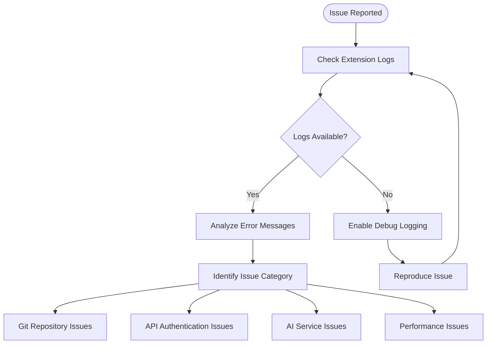

# Common Issues

<cite>
**Referenced Files in This Document**
- [gitService.ts](file://src/services/git/gitService.ts)
- [aiService.ts](file://src/services/ai/aiService.ts)
- [appConfig.ts](file://src/config/appConfig.ts)
- [modelValidator.ts](file://src/models/modelValidator.ts)
- [logger.ts](file://src/utils/logger.ts)
- [largeFileProcessor.ts](file://src/core/compression/largeFileProcessor.ts)
- [notificationManager.ts](file://src/services/notification/notificationManager.ts)
- [retryUtils.ts](file://src/utils/retryUtils.ts)
- [ui.ts](file://src/i18n/en/ui.ts)
- [output.ts](file://src/i18n/en/output.ts)
- [constants.ts](file://src/constants/constants.ts)
</cite>

## Table of Contents
1. [Introduction](#introduction)
2. [Git Repository Access Issues](#git-repository-access-issues)
3. [API Authentication Problems](#api-authentication-problems)
4. [AI Service and Model Issues](#ai-service-and-model-issues)
5. [Timeout and Performance Issues](#timeout-and-performance-issues)
6. [Webview Rendering Failures](#webview-rendering-failures)
7. [Large File Processing Issues](#large-file-processing-issues)
8. [Configuration-Related Problems](#configuration-related-problems)
9. [Rate Limiting and Provider Issues](#rate-limiting-and-provider-issues)
10. [Troubleshooting Workflows](#troubleshooting-workflows)

## Introduction

CodeKarmic is a comprehensive code review extension for Visual Studio Code that integrates Git repository analysis with AI-powered code review capabilities. This document covers common issues users encounter when using CodeKarmic, along with detailed troubleshooting steps and resolution strategies.

The extension operates through several interconnected services:
- **Git Service**: Handles Git repository operations and commit analysis
- **AI Service**: Manages API communication with AI models for code review
- **Configuration Management**: Centralizes settings and API key management
- **Notification System**: Provides user feedback and error reporting
- **Large File Processor**: Handles files exceeding AI model token limits

## Git Repository Access Issues

### Invalid Repository Paths

**Problem**: The extension fails to recognize or access the Git repository.

**Symptoms**:
- "Not a Git repository" error messages
- "Repository path does not exist" warnings
- Git operations failing silently

**Root Cause**: The specified repository path is either incorrect, doesn't contain a `.git` directory, or the path doesn't exist.

**Code Reference**: [gitService.ts lines 75-88](file://src/services/git/gitService.ts#L75-L88)

**Resolution Steps**:

1. **Verify Repository Path**
   ```typescript
   // Check if path exists
   if (!fs.existsSync(repoPath)) {
       throw new Error(`Repository path does not exist: ${repoPath}`);
   }
   
   // Check for .git directory
   const gitDir = path.join(repoPath, '.git');
   if (!fs.existsSync(gitDir)) {
       throw new Error(`Not a git repository - .git directory not found in ${repoPath}`);
   }
   ```

2. **Common Solutions**:
   - Ensure you've opened the correct workspace folder in VS Code
   - Verify the repository is properly cloned and initialized
   - Check file permissions for the repository directory
   - Confirm the repository hasn't been moved or deleted

3. **Verification Commands**:
   ```bash
   # Navigate to repository directory
   cd /path/to/repository
   
   # Verify Git status
   git status
   
   # Check for .git directory
   ls -la .git
   ```

**Prevention Tips**:
- Always open the root directory of your Git repository in VS Code
- Use the "Open Folder" option rather than individual files
- Ensure proper Git credentials are configured

### Branch Not Found Errors

**Problem**: The extension cannot locate specific Git branches.

**Symptoms**:
- "Branch not found" error messages
- Empty branch lists in the UI
- Git operations failing with branch-related errors

**Root Cause**: The branch doesn't exist in the remote repository, or there are network connectivity issues preventing branch enumeration.

**Resolution Workflow**:

1. **Check Local Branches**:
   ```bash
   git branch -a
   ```

2. **Fetch Remote Branches**:
   ```bash
   git fetch --all
   ```

3. **Verify Network Connectivity**:
   ```bash
   git ls-remote origin
   ```

4. **Manual Branch Selection**: If automatic detection fails, manually select branches through the UI.

### Git Initialization Failures

**Problem**: Git service fails to initialize properly.

**Symptoms**:
- "Git not initialized" errors
- Commit history not loading
- File diff operations failing

**Code Reference**: [gitService.ts lines 201-204](file://src/services/git/gitService.ts#L201-L204)

**Resolution Steps**:

1. **Reinitialize Repository**:
   - Close and reopen VS Code
   - Ensure the workspace folder contains a valid Git repository
   - Check for Git installation and PATH configuration

2. **Check Git Installation**:
   ```bash
   git --version
   ```

3. **Verify SimpleGit Configuration**:
   ```typescript
   this.git = simpleGit({
       baseDir: repoPath,
       binary: 'git',
       maxConcurrentProcesses: 6,
       trimmed: true
   });
   ```

**Section sources**
- [gitService.ts](file://src/services/git/gitService.ts#L64-L118)
- [output.ts](file://src/i18n/en/output.ts#L84-L89)

## API Authentication Problems

### Missing or Invalid API Keys

**Problem**: AI service fails to authenticate with the configured API provider.

**Symptoms**:
- "API key not configured" error messages
- "API key validation failed" warnings
- AI analysis requests returning authentication errors

**Root Cause**: Incorrect API key configuration, expired keys, or unsupported API key formats.

**Code Reference**: [aiService.ts lines 712-724](file://src/services/ai/aiService.ts#L712-L724)

**Resolution Steps**:

1. **Verify API Key Configuration**:
   ```typescript
   public async validateApiKey(apiKey: string): Promise<boolean> {
       try {
           const modelFactory = AIModelFactoryImpl.getInstance();
           const modelService = modelFactory.createModelService();
           return await modelService.validateApiKey(apiKey);
       } catch (error) {
           const errorDetails = error instanceof Error ? error.message : String(error);
           console.error('API key validation error:', error);
           return false;
       }
   }
   ```

2. **Check API Key Format**:
   - Ensure the key starts with appropriate prefix (e.g., `sk-` for OpenAI)
   - Verify no extra spaces or characters
   - Confirm the key hasn't been truncated

3. **Test API Key Validity**:
   ```typescript
   // Manual validation test
   const isValid = await aiService.validateApiKey('your-api-key');
   console.log('API key validity:', isValid);
   ```

4. **Configuration Verification**:
   - Check VS Code settings under `codekarmic.apiKey`
   - Verify the key is stored securely and not exposed in logs

### API Key Validation Failures

**Problem**: The extension cannot verify the API key with the provider.

**Symptoms**:
- Persistent "API key validation failed" errors
- Intermittent authentication success/failure
- Rate limiting errors despite valid keys

**Root Cause**: Network issues, provider API changes, or temporary service unavailability.

**Resolution Workflow**:

1. **Network Diagnostics**:
   - Test internet connectivity
   - Check firewall/proxy settings
   - Verify DNS resolution

2. **Provider Status Check**:
   - Visit the AI provider's status page
   - Check for service outages or maintenance windows
   - Verify API endpoint accessibility

3. **Alternative Authentication Methods**:
   - Try different API endpoints
   - Use API key rotation if supported
   - Implement custom authentication headers

**Section sources**
- [aiService.ts](file://src/services/ai/aiService.ts#L712-L736)
- [appConfig.ts](file://src/config/appConfig.ts#L145-L156)

## AI Service and Model Issues

### Model Unreachable Exceptions

**Problem**: The AI model service becomes unavailable or unreachable.

**Symptoms**:
- "AI model service not initialized" errors
- Timeout errors during AI analysis
- Empty or incomplete AI suggestions

**Root Cause**: Network connectivity issues, provider downtime, or model configuration problems.

**Code Reference**: [aiService.ts lines 75-L81](file://src/services/ai/aiService.ts#L75-L81)

**Resolution Steps**:

1. **Service Health Check**:
   ```typescript
   public async reviewCode(params: CodeReviewRequest): Promise<CodeReviewResult> {
       try {
           if (!this.modelService) {
               throw new Error(OUTPUT.REVIEW.AI_SERVICE_NOT_INITIALIZED);
           }
           // Proceed with analysis...
       } catch (error) {
           return this.handleReviewError(error, params.filePath);
       }
   }
   ```

2. **Retry Mechanism**:
   - Implement exponential backoff for transient failures
   - Monitor service availability metrics
   - Provide fallback model options

3. **Configuration Validation**:
   - Verify model type selection
   - Check base URL configuration
   - Ensure proper model parameters

### Unsupported Model Types

**Problem**: Attempting to use unsupported AI models.

**Symptoms**:
- "Unsupported model type" error messages
- Model-specific functionality not working
- Unexpected behavior with model selection

**Code Reference**: [modelValidator.ts lines 7-14](file://src/models/modelValidator.ts#L7-L14)

**Resolution Workflow**:

1. **Model Validation**:
   ```typescript
   export class ModelValidator {
       private static readonly SUPPORTED_MODELS = getAllModelTypes();
       
       public static validateModel(model: ModelType): boolean {
           return this.SUPPORTED_MODELS.includes(model);
       }
   }
   ```

2. **Supported Models List**:
   - Check the current list of supported models
   - Verify model availability from the provider
   - Consider model capability requirements

3. **Fallback Strategy**:
   - Automatically fall back to default models
   - Provide user-friendly error messages
   - Suggest alternative configurations

**Section sources**
- [aiService.ts](file://src/services/ai/aiService.ts#L75-L81)
- [modelValidator.ts](file://src/models/modelValidator.ts#L7-L14)

## Timeout and Performance Issues

### AI Processing Timeouts

**Problem**: AI analysis requests exceed timeout limits.

**Symptoms**:
- "Request timeout" errors
- Long delays during code review
- Partial or incomplete analysis results

**Root Cause**: Large files, complex analysis requests, or network latency.

**Code Reference**: [aiService.ts lines 274-L275](file://src/services/ai/aiService.ts#L274-L275)

**Resolution Strategies**:

1. **Timeout Configuration**:
   ```typescript
   const modelRequestOptions: ModelRequestOptions = {
       maxTokens: options.maxTokens || 4000,
       temperature: 0.1,
       stream: true,
       timeoutMs: 180000, // 3 minutes
   };
   ```

2. **Performance Optimization**:
   - Enable compression for large files
   - Reduce analysis scope for complex files
   - Implement batch processing for multiple files

3. **Progress Monitoring**:
   ```typescript
   notificationManager.log(`(3/5) 发送AI分析请求，长度: ${combinedPrompt.length}字符...`, 'info', true);
   ```

### Large File Processing Delays

**Problem**: Processing large files causes significant delays or failures.

**Symptoms**:
- Extended processing times
- Memory exhaustion errors
- Partial analysis results

**Code Reference**: [largeFileProcessor.ts lines 47-L50](file://src/core/compression/largeFileProcessor.ts#L47-L50)

**Resolution Approach**:

1. **File Size Detection**:
   ```typescript
   public isLargeFile(request: CodeReviewRequest): boolean {
       if (!this.options.enabled) return false;
       return request.currentContent.length > this.options.sizeThreshold;
   }
   ```

2. **Compression Strategy**:
   - Use content compression algorithms
   - Implement sampling for extremely large files
   - Provide progress indicators for long-running operations

3. **Batch Processing**:
   - Process files in smaller batches
   - Implement parallel processing where safe
   - Use streaming for continuous data processing

**Section sources**
- [aiService.ts](file://src/services/ai/aiService.ts#L260-L280)
- [largeFileProcessor.ts](file://src/core/compression/largeFileProcessor.ts#L47-L50)

## Webview Rendering Failures

### WebView Loading Issues

**Problem**: The code review panel fails to render properly.

**Symptoms**:
- Blank or empty review panels
- JavaScript errors in the webview
- Slow loading times for the review interface

**Root Cause**: Resource loading failures, script execution errors, or security policy violations.

**Resolution Steps**:

1. **Resource Verification**:
   - Check local resource roots configuration
   - Verify media and resources are accessible
   - Ensure proper MIME type handling

2. **Security Policy Review**:
   ```typescript
   const panel = vscode.window.createWebviewPanel(
       'codekarmic',
       'Code Review',
       column || vscode.ViewColumn.Two,
       {
           enableScripts: true,
           localResourceRoots: [
               vscode.Uri.joinPath(extensionUri, 'media'),
               vscode.Uri.joinPath(extensionUri, 'resources')
           ]
       }
   );
   ```

3. **Error Handling**:
   - Implement graceful degradation for missing resources
   - Provide fallback UI elements
   - Log detailed error information for debugging

### Script Execution Errors

**Problem**: JavaScript code in the webview fails to execute properly.

**Symptoms**:
- Console errors in the webview developer tools
- Interactive elements not functioning
- Data binding failures

**Resolution Workflow**:

1. **Script Security**:
   - Verify script execution permissions
   - Check Content Security Policy (CSP) settings
   - Ensure scripts are properly bundled and minified

2. **Error Isolation**:
   - Separate concerns between main thread and webview
   - Implement proper error boundaries
   - Provide user-friendly error messages

3. **Development Tools**:
   - Enable webview developer tools
   - Use browser debugging techniques
   - Monitor network requests and responses

**Section sources**
- [reviewPanel.ts](file://src/ui/views/reviewPanel.ts#L78-L116)

## Large File Processing Issues

### Compression Failures

**Problem**: Large file compression fails or produces poor results.

**Symptoms**:
- Compression errors during analysis
- Lossy compression affecting code quality
- Inefficient compression ratios

**Code Reference**: [largeFileProcessor.ts lines 62-L79](file://src/core/compression/largeFileProcessor.ts#L62-L79)

**Resolution Strategies**:

1. **Compression Algorithm Selection**:
   ```typescript
   const { compressed, stats } = compressContent(
       request.currentContent, 
       this.options.compressionOptions
   );
   ```

2. **Quality Assurance**:
   - Validate compressed content integrity
   - Implement checksum verification
   - Provide compression ratio monitoring

3. **Fallback Mechanisms**:
   - Use alternative compression algorithms
   - Implement chunked processing
   - Provide uncompressed processing options

### Token Limit Exceedances

**Problem**: AI model token limits exceeded for large files.

**Symptoms**:
- "Token limit exceeded" errors
- Truncated analysis results
- Incomplete code review coverage

**Resolution Approaches**:

1. **Intelligent Sampling**:
   - Implement adaptive sampling strategies
   - Focus on critical code sections
   - Maintain contextual coherence

2. **Hierarchical Analysis**:
   - Perform coarse-grained analysis first
   - Drill down into problematic areas
   - Combine results intelligently

3. **Batch Processing Optimization**:
   ```typescript
   const estimatedTokens = compressed.length * TOKENS_PER_CHAR;
   if (currentBatchSize + estimatedTokens > MAX_BATCH_TOKENS) {
       // Create new batch
   }
   ```

**Section sources**
- [largeFileProcessor.ts](file://src/core/compression/largeFileProcessor.ts#L62-L79)
- [largeFileProcessor.ts](file://src/core/compression/largeFileProcessor.ts#L178-L186)

## Configuration-Related Problems

### Incorrect API Endpoint Configuration

**Problem**: Misconfigured API endpoints prevent proper service communication.

**Symptoms**:
- "API endpoint unreachable" errors
- Authentication failures with valid keys
- Unexpected API responses

**Root Cause**: Incorrect base URLs, proxy configurations, or SSL certificate issues.

**Resolution Steps**:

1. **Endpoint Verification**:
   ```typescript
   public getBaseURL(): string {
       return this.get<string>(ConfigKey.BASE_URL);
   }
   ```

2. **Network Diagnostics**:
   - Test endpoint accessibility
   - Verify SSL/TLS configuration
   - Check proxy settings

3. **Configuration Validation**:
   - Implement endpoint health checks
   - Provide configuration templates
   - Offer automatic endpoint discovery

### Model Selection Issues

**Problem**: Incorrect model selection affects analysis quality.

**Symptoms**:
- Poor analysis quality
- Unexpected model behavior
- Performance inconsistencies

**Code Reference**: [appConfig.ts lines 176-L187](file://src/config/appConfig.ts#L176-L187)

**Resolution Workflow**:

1. **Model Configuration**:
   ```typescript
   public getModelType(): ModelType {
       const displayName = this.get<string>(ConfigKey.MODEL_TYPE);
       return getModelTypeFromDisplayName(displayName);
   }
   ```

2. **Capability Matching**:
   - Match model capabilities to use cases
   - Consider performance requirements
   - Evaluate cost-effectiveness

3. **Dynamic Selection**:
   - Implement model switching mechanisms
   - Provide performance benchmarks
   - Offer user preference storage

**Section sources**
- [appConfig.ts](file://src/config/appConfig.ts#L145-L187)

## Rate Limiting and Provider Issues

### Rate Limit Exceeded

**Problem**: API rate limits prevent normal operation.

**Symptoms**:
- "Rate limit exceeded" errors
- Intermittent service availability
- Gradual throttling of requests

**Code Reference**: [retryUtils.ts lines 95-L107](file://src/utils/retryUtils.ts#L95-L107)

**Resolution Strategies**:

1. **Retry Logic Implementation**:
   ```typescript
   export const NETWORK_RETRYABLE_ERRORS = [
       'ECONNRESET',
       'ETIMEDOUT',
       'ESOCKETTIMEDOUT',
       'socket hang up',
       'network error',
       'timeout',
       'request timed out',
       /^5\d\d$/,
       'rate limit',
       'too many requests',
       'Service Unavailable',
   ];
   ```

2. **Exponential Backoff**:
   - Implement jittered delays
   - Track rate limit headers
   - Provide user feedback during throttling

3. **Request Optimization**:
   - Batch related requests
   - Cache frequently accessed data
   - Implement request queuing

### Provider Service Outages

**Problem**: AI provider experiences downtime or degraded service.

**Symptoms**:
- Consistent timeouts and failures
- Service unavailability messages
- Extended periods of non-functionality

**Resolution Approach**:

1. **Health Monitoring**:
   - Implement service health checks
   - Monitor response times and error rates
   - Track service availability metrics

2. **Fallback Strategies**:
   - Automatic failover to alternative providers
   - Offline analysis capabilities
   - Cached analysis results

3. **User Communication**:
   - Provide clear outage notifications
   - Offer estimated recovery times
   - Suggest alternative actions during downtime

**Section sources**
- [retryUtils.ts](file://src/utils/retryUtils.ts#L95-L107)

## Troubleshooting Workflows

### Comprehensive Issue Diagnosis

**Step 1: Initial Assessment**


**Step 2: Category-Specific Diagnostics**

1. **Git Repository Issues**:
   ```typescript
   // Diagnostic checks
   const isGitRepo = await gitService.isGitRepository();
   const commits = await gitService.getCommits();
   const branches = await gitService.getBranches();
   ```

2. **API Authentication Issues**:
   ```typescript
   // Authentication validation
   const apiKeyValid = await aiService.validateApiKey(config.getApiKey());
   const modelService = modelFactory.createModelService();
   const serviceAvailable = await modelService.validateApiKey(apiKey);
   ```

3. **AI Service Issues**:
   ```typescript
   // Service health check
   if (!aiService.modelService) {
       throw new Error(OUTPUT.REVIEW.AI_SERVICE_NOT_INITIALIZED);
   }
   ```

### Resolution Priority Matrix

| Issue Type | Priority | Resolution Time | Complexity |
|------------|----------|-----------------|------------|
| Authentication Failures | High | Minutes | Low |
| Repository Access | High | Minutes | Medium |
| API Rate Limits | Medium | Hours/Days | Medium |
| Performance Issues | Medium | Hours | High |
| Webview Rendering | Low | Minutes | Medium |
| Large File Processing | Low | Hours | High |

### Recovery Procedures

**Immediate Recovery Actions**:
1. Restart VS Code and reload the extension
2. Clear caches and temporary files
3. Verify network connectivity
4. Check API key configuration

**Medium-Term Solutions**:
1. Update to latest extension version
2. Optimize configuration settings
3. Implement monitoring and alerting
4. Establish backup procedures

**Long-Term Improvements**:
1. Enhance error handling and recovery
2. Implement automated diagnostics
3. Provide comprehensive documentation
4. Develop community support channels

### Prevention Strategies

**Proactive Monitoring**:
- Implement automated health checks
- Monitor error rates and trends
- Track performance metrics
- Alert on configuration drift

**Best Practices**:
- Regular configuration backups
- Version control for settings
- Documentation updates
- User training and support

**Section sources**
- [logger.ts](file://src/utils/logger.ts#L18-L88)
- [notificationManager.ts](file://src/services/notification/notificationManager.ts#L79-L121)