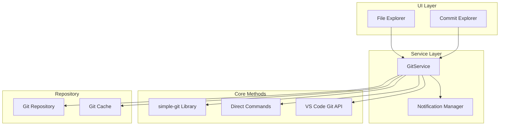
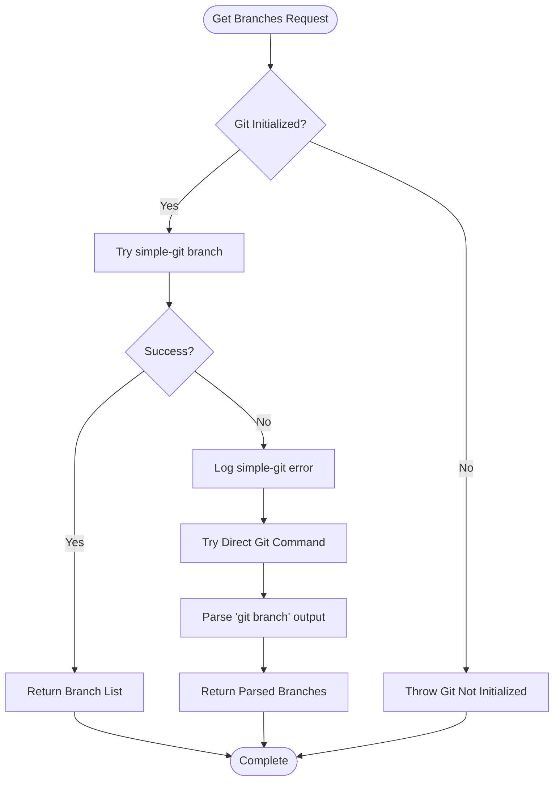
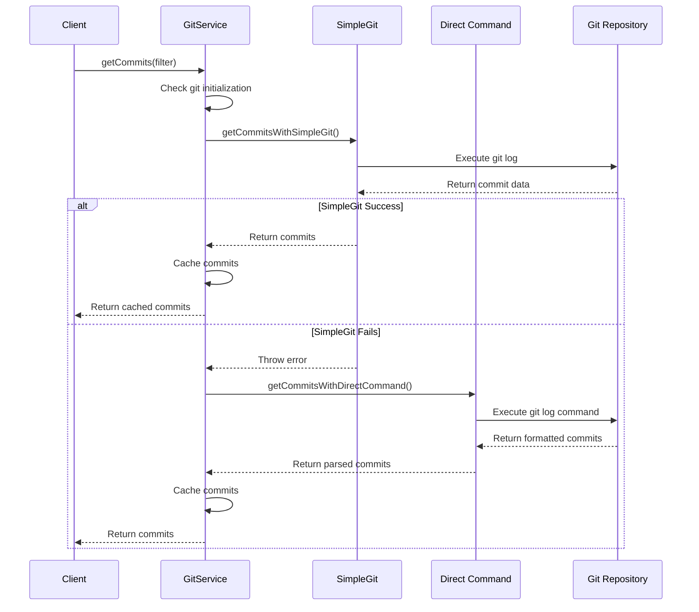
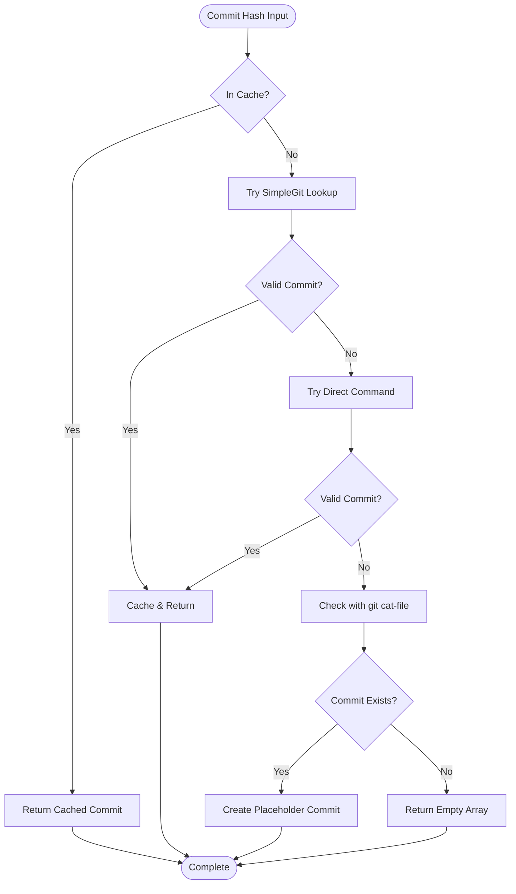
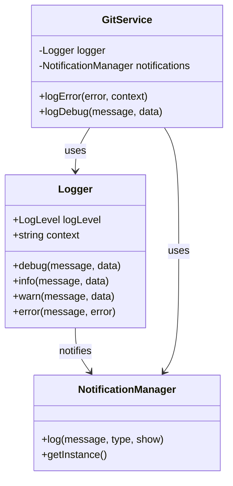
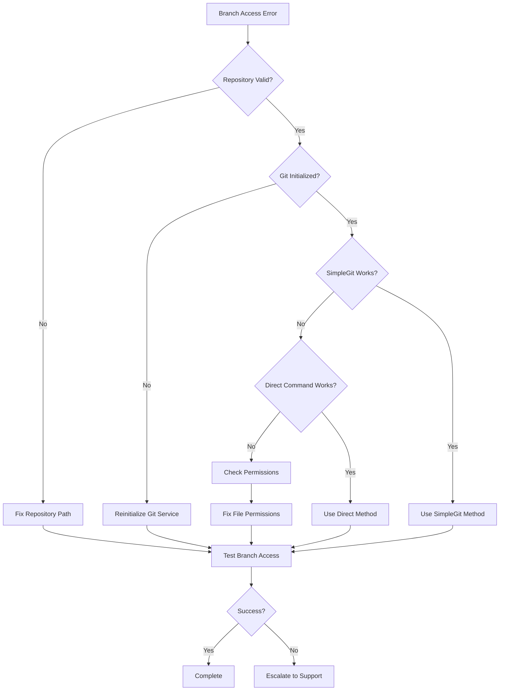
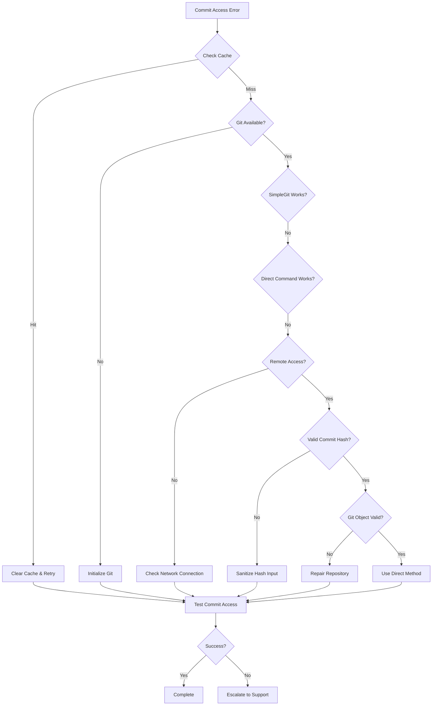
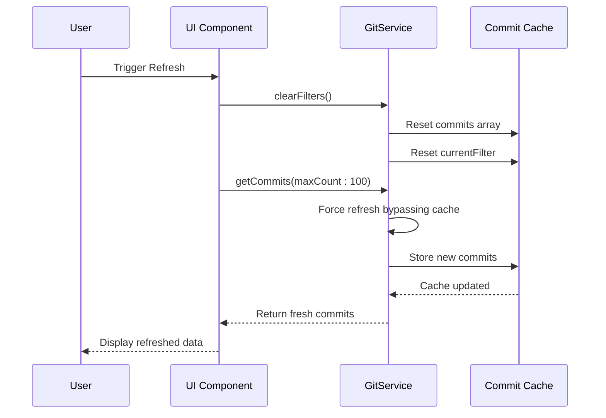
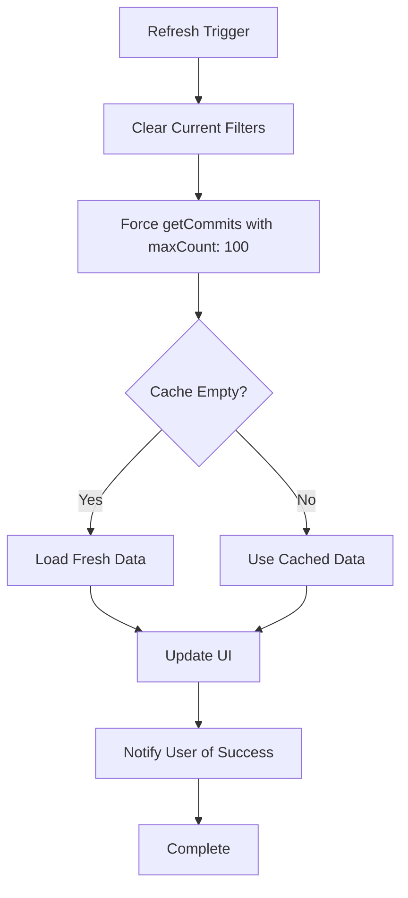
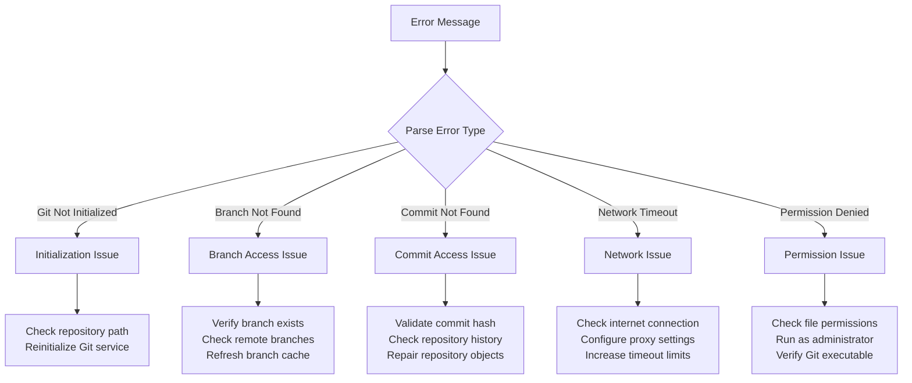

# Branch and Commit Access Problems

<cite>
**Referenced Files in This Document**
- [gitService.ts](file://src/services/git/gitService.ts)
- [versionControlTypes.ts](file://src/services/git/versionControlTypes.ts)
- [commitExplorer.ts](file://src/ui/components/commitExplorer.ts)
- [logger.ts](file://src/utils/logger.ts)
- [output.ts](file://src/i18n/en/output.ts)
- [extension.ts](file://src/extension.ts)
</cite>

## Table of Contents
1. [Introduction](#introduction)
2. [Architecture Overview](#architecture-overview)
3. [Branch Access Issues](#branch-access-issues)
4. [Commit Access Issues](#commit-access-issues)
5. [Error Handling Mechanisms](#error-handling-mechanisms)
6. [Troubleshooting Workflows](#troubleshooting-workflows)
7. [Common Problem Resolution](#common-problem-resolution)
8. [Cache Management and Refresh Operations](#cache-management-and-refresh-operations)
9. [Diagnostic Procedures](#diagnostic-procedures)
10. [Best Practices](#best-practices)

## Introduction

CodeKarmic's Git integration provides robust mechanisms for accessing branches and commits through a dual-method approach that ensures reliability even when individual methods fail. This document covers the comprehensive error handling strategies, troubleshooting workflows, and resolution procedures for common branch and commit access issues.

The system implements sophisticated fallback mechanisms using both the simple-git library and direct Git command execution, along with intelligent caching and error recovery strategies to handle various repository states and network conditions.

## Architecture Overview

CodeKarmic's Git service architecture follows a layered approach with multiple fallback strategies:



**Diagram sources**
- [gitService.ts](file://src/services/git/gitService.ts#L45-L1201)
- [commitExplorer.ts](file://src/ui/components/commitExplorer.ts#L1-L172)

**Section sources**
- [gitService.ts](file://src/services/git/gitService.ts#L45-L1201)
- [commitExplorer.ts](file://src/ui/components/commitExplorer.ts#L1-L172)

## Branch Access Issues

### Branch Not Found Errors

The `getBranches()` method implements a comprehensive fallback strategy for branch access:



**Diagram sources**
- [gitService.ts](file://src/services/git/gitService.ts#L278-L309)

### Common Branch Access Problems

| Problem | Symptoms | Error Messages | Root Causes |
|---------|----------|----------------|-------------|
| **Detached HEAD State** | Branch list shows commit hash instead of branch names | "Detached HEAD state detected" | Manual checkout to specific commit |
| **Corrupted Git Objects** | Partial branch list or empty results | "Corrupted Git objects" | Disk corruption or interrupted operations |
| **Network Issues** | Timeout errors during remote branch access | "Network timeout accessing remote" | Unstable internet connection |
| **Permission Denied** | Access denied errors | "Permission denied" | Insufficient file system permissions |
| **Large Repositories** | Slow branch enumeration | "Repository too large" | Performance limitations |

**Section sources**
- [gitService.ts](file://src/services/git/gitService.ts#L278-L309)
- [output.ts](file://src/i18n/en/output.ts#L106-L110)

## Commit Access Issues

### Failed Commit Retrieval

The `getCommits()` method implements a sophisticated dual-method approach:



**Diagram sources**
- [gitService.ts](file://src/services/git/gitService.ts#L197-L241)
- [gitService.ts](file://src/services/git/gitService.ts#L848-L951)

### Invalid Commit Hashes

The system handles invalid commit hashes through multiple validation strategies:



**Diagram sources**
- [gitService.ts](file://src/services/git/gitService.ts#L244-L275)
- [gitService.ts](file://src/services/git/gitService.ts#L801-L810)

**Section sources**
- [gitService.ts](file://src/services/git/gitService.ts#L197-L241)
- [gitService.ts](file://src/services/git/gitService.ts#L244-L275)

## Error Handling Mechanisms

### Logging and Notification System

CodeKarmic implements comprehensive error logging with multiple severity levels:



**Diagram sources**
- [logger.ts](file://src/utils/logger.ts#L8-L88)
- [gitService.ts](file://src/services/git/gitService.ts#L1195-L1199)

### Error Categories and Handling

| Error Category | Severity | Handling Strategy | Recovery Action |
|----------------|----------|-------------------|-----------------|
| **Initialization Errors** | ERROR | Immediate notification | Repository re-initialization |
| **Network Errors** | WARN | Retry with exponential backoff | Manual refresh trigger |
| **Permission Errors** | ERROR | Log and notify user | Check file permissions |
| **Timeout Errors** | WARN | Fallback to alternative method | Increase timeout limits |
| **Validation Errors** | INFO | Graceful degradation | Input sanitization |

**Section sources**
- [logger.ts](file://src/utils/logger.ts#L8-L88)
- [gitService.ts](file://src/services/git/gitService.ts#L1195-L1199)

## Troubleshooting Workflows

### Branch Access Troubleshooting



### Commit Access Troubleshooting



**Section sources**
- [gitService.ts](file://src/services/git/gitService.ts#L278-L309)
- [gitService.ts](file://src/services/git/gitService.ts#L197-L241)

## Common Problem Resolution

### Detached HEAD State

**Symptoms:**
- Branch list shows commit hash instead of branch names
- Cannot switch branches
- "Detached HEAD" warnings in terminal

**Resolution Steps:**
1. **Detect Detached State:**
   ```bash
   git status
   ```
   Look for "HEAD detached at" message

2. **Create New Branch:**
   ```bash
   git checkout -b new-branch-name
   ```

3. **Switch to Existing Branch:**
   ```bash
   git checkout branch-name
   ```

4. **Verify Resolution:**
   ```bash
   git branch --list
   ```

### Corrupted Git Objects

**Symptoms:**
- "corrupt loose object" errors
- Incomplete commit history
- "pack file corrupt" messages

**Resolution Steps:**
1. **Check Repository Integrity:**
   ```bash
   git fsck
   ```

2. **Recover from Pack Files:**
   ```bash
   git repack -a -d
   ```

3. **Clone Fresh Copy:**
   ```bash
   cd ..
   mv repository repository-backup
   git clone <repository-url>
   ```

4. **Restore from Backup:**
   ```bash
   cp -r repository-backup/.git repository/
   ```

### Network Issues with Remote Repositories

**Symptoms:**
- "Connection timed out" errors
- Slow branch listing
- Authentication failures

**Resolution Steps:**
1. **Check Network Connectivity:**
   ```bash
   ping github.com
   ```

2. **Configure Proxy Settings:**
   ```bash
   git config --global http.proxy http://proxy-server:port
   ```

3. **Increase Timeout Limits:**
   ```bash
   git config --global http.lowSpeedTime 300
   git config --global http.lowSpeedLimit 1000
   ```

4. **Use SSH Instead of HTTPS:**
   ```bash
   git remote set-url origin git@github.com:user/repo.git
   ```

**Section sources**
- [gitService.ts](file://src/services/git/gitService.ts#L64-L107)
- [output.ts](file://src/i18n/en/output.ts#L89-L90)

## Cache Management and Refresh Operations

### Commit Cache Invalidation

CodeKarmic implements intelligent cache management with automatic invalidation triggers:



**Diagram sources**
- [gitService.ts](file://src/services/git/gitService.ts#L829-L846)
- [extension.ts](file://src/extension.ts#L299-L323)

### Refresh Operation Implementation

The refresh mechanism ensures data consistency through forced cache invalidation:



**Diagram sources**
- [extension.ts](file://src/extension.ts#L299-L323)

**Section sources**
- [gitService.ts](file://src/services/git/gitService.ts#L829-L846)
- [extension.ts](file://src/extension.ts#L299-L323)

## Diagnostic Procedures

### Comprehensive Error Diagnosis

CodeKarmic provides structured diagnostic procedures for systematic problem identification:

| Diagnostic Phase | Checks Performed | Tools Used | Expected Results |
|------------------|------------------|------------|------------------|
| **Repository Validation** | Path existence, .git directory, Git initialization | File system checks, Git commands | Valid repository structure |
| **Network Connectivity** | Internet access, proxy configuration, timeout settings | Network utilities, Git configuration | Stable network connection |
| **Permission Verification** | File system permissions, Git executable access | Permission checks, executable verification | Full read/write access |
| **Git Integrity** | Repository consistency, object validity, branch integrity | Git fsck, git verify-pack | Clean repository state |
| **Service Health** | GitService initialization, method availability, cache status | Internal health checks | Fully operational service |

### Error Message Analysis

The system provides detailed error categorization and resolution guidance:



**Section sources**
- [gitService.ts](file://src/services/git/gitService.ts#L1195-L1199)
- [output.ts](file://src/i18n/en/output.ts#L84-L110)

## Best Practices

### Preventive Measures

1. **Regular Repository Maintenance:**
   - Schedule periodic `git gc` operations
   - Monitor repository size and optimize large files
   - Implement automated backup strategies

2. **Network Stability:**
   - Configure appropriate timeout values
   - Use reliable internet connections
   - Implement retry mechanisms for transient failures

3. **Permission Management:**
   - Use dedicated Git user accounts
   - Implement proper file system permissions
   - Regular permission audits

4. **Monitoring and Alerting:**
   - Enable comprehensive logging
   - Set up error monitoring systems
   - Implement automated health checks

### Performance Optimization

1. **Caching Strategies:**
   - Implement intelligent cache invalidation
   - Use TTL-based cache expiration
   - Optimize cache storage mechanisms

2. **Resource Management:**
   - Limit concurrent Git operations
   - Implement connection pooling
   - Monitor memory usage patterns

3. **Fallback Mechanisms:**
   - Maintain multiple access methods
   - Implement graceful degradation
   - Provide user feedback during failures

**Section sources**
- [gitService.ts](file://src/services/git/gitService.ts#L45-L1201)
- [logger.ts](file://src/utils/logger.ts#L8-L88)