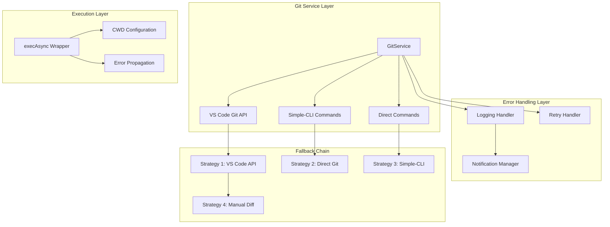
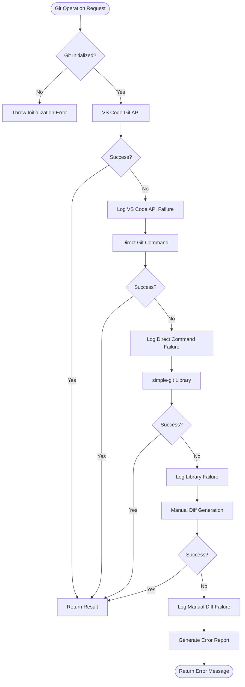
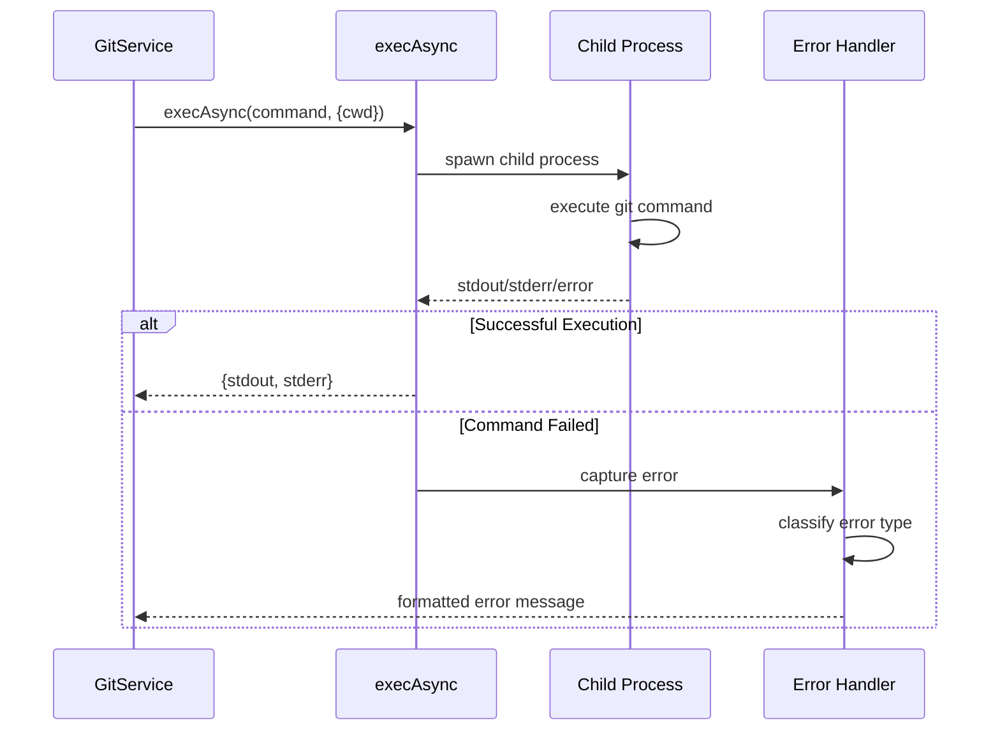
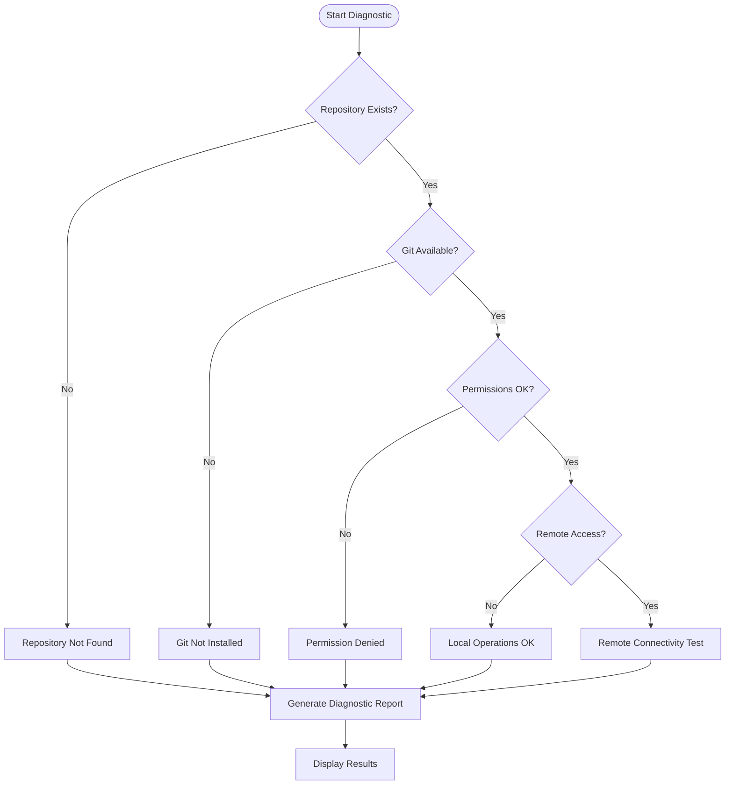
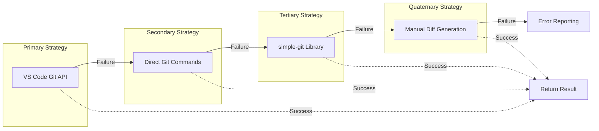
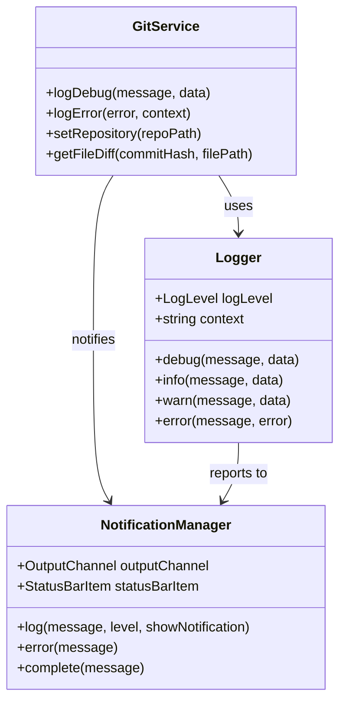

# Git Command Execution Failures

<cite>
**Referenced Files in This Document**
- [gitService.ts](file://src/services/git/gitService.ts)
- [logger.ts](file://src/utils/logger.ts)
- [retryUtils.ts](file://src/utils/retryUtils.ts)
- [notificationManager.ts](file://src/services/notification/notificationManager.ts)
- [output.ts](file://src/i18n/en/output.ts)
- [extension.ts](file://src/extension.ts)
- [package.json](file://package.json)
</cite>

## Table of Contents
1. [Introduction](#introduction)
2. [Architecture Overview](#architecture-overview)
3. [Error Handling Strategies](#error-handling-strategies)
4. [Git Command Execution Patterns](#git-command-execution-patterns)
5. [Common Failure Scenarios](#common-failure-scenarios)
6. [Troubleshooting Workflows](#troubleshooting-workflows)
7. [Fallback Mechanisms](#fallback-mechanisms)
8. [Diagnostic Tools](#diagnostic-tools)
9. [Resolution Procedures](#resolution-procedures)
10. [Best Practices](#best-practices)

## Introduction

CodeKarmic implements a sophisticated Git command execution system designed to handle various failure scenarios gracefully. The extension employs multiple strategies and fallback mechanisms to ensure reliable Git operations even in challenging environments. This document covers the comprehensive error handling framework used in Git command execution failures, providing detailed insights into diagnosis, troubleshooting, and resolution procedures.

The system handles critical Git operations including commit retrieval, file difference generation, repository validation, and branch management. When Git subprocess execution fails, the extension automatically switches between alternative methods to maintain functionality and provide meaningful error feedback to users.

## Architecture Overview

CodeKarmic's Git service architecture implements a multi-layered approach to command execution with built-in resilience mechanisms:



**Diagram sources**
- [gitService.ts](file://src/services/git/gitService.ts#L45-L1200)
- [logger.ts](file://src/utils/logger.ts#L1-L88)
- [notificationManager.ts](file://src/services/notification/notificationManager.ts#L1-L213)

**Section sources**
- [gitService.ts](file://src/services/git/gitService.ts#L45-L1200)

## Error Handling Strategies

### Multi-Strategy Approach

The Git service implements a comprehensive strategy pattern for command execution, ensuring that failures in one method trigger immediate fallback to alternative approaches:



**Diagram sources**
- [gitService.ts](file://src/services/git/gitService.ts#L707-L793)

### Error Classification and Handling

The system categorizes errors into specific types with appropriate handling strategies:

| Error Category | Detection Method | Handling Strategy | Recovery Action |
|----------------|------------------|-------------------|-----------------|
| **Initialization Errors** | Path validation failures | Immediate throw with detailed message | User intervention required |
| **Permission Denied** | Access control violations | Graceful degradation with fallback | Check file/directory permissions |
| **Command Timeout** | Process execution timeouts | Retry with exponential backoff | Increase timeout limits |
| **Subprocess Failures** | Child process exit codes | Multi-strategy fallback | Alternative Git methods |
| **Network Issues** | Connection failures | Retry with backoff | Verify network connectivity |
| **Repository Corruption** | Git integrity checks | Fallback to direct parsing | Repository repair suggestions |

**Section sources**
- [gitService.ts](file://src/services/git/gitService.ts#L64-L1200)
- [logger.ts](file://src/utils/logger.ts#L1-L88)

## Git Command Execution Patterns

### execAsync Implementation

The extension uses a robust wrapper around Node.js `exec` with proper CWD configuration and error propagation:



**Diagram sources**
- [gitService.ts](file://src/services/git/gitService.ts#L10-L11)
- [gitService.ts](file://src/services/git/gitService.ts#L355-L364)

### CWD Configuration Strategy

The system maintains proper working directory context for all Git operations:

```typescript
// CWD configuration pattern used throughout the codebase
const { stdout } = await execAsync(
    `git show ${commitHash}:${filePath}`,
    { 
        cwd: this.repoPath,           // Repository root directory
        maxBuffer: 10 * 1024 * 1024  // Large buffer for big files
    }
);
```

**Section sources**
- [gitService.ts](file://src/services/git/gitService.ts#L10-L11)
- [gitService.ts](file://src/services/git/gitService.ts#L355-L364)

## Common Failure Scenarios

### Failed Git Subprocess Execution

**Symptoms:**
- "Command failed" error messages
- Process termination with non-zero exit codes
- Hanging subprocesses

**Root Causes:**
- Missing Git installation
- Incorrect PATH configuration
- Permission restrictions
- Antivirus interference

**Detection Pattern:**
```typescript
try {
    const { stdout } = await execAsync('git --version', { cwd: repoPath });
    // Process successful execution
} catch (error) {
    // Handle subprocess failure
    this.logError(error as Error, OUTPUT.GIT.ERROR_GETTING_COMMIT_FILES);
}
```

### Command Timeout Errors

**Symptoms:**
- Long-running Git operations timing out
- Memory exhaustion during large repository operations
- Network timeouts for remote repositories

**Timeout Configuration:**
```typescript
// Default timeout handling with configurable buffer sizes
const { stdout } = await execAsync(command, {
    cwd: this.repoPath,
    maxBuffer: 10 * 1024 * 1024,  // 10MB buffer limit
    timeout: 30000                 // 30-second timeout
});
```

### Permission Denied Responses

**Symptoms:**
- Access denied errors for Git operations
- File system permission violations
- Insufficient privileges for repository access

**Permission Validation:**
```typescript
// Early permission checking before Git operations
if (!fs.existsSync(repoPath)) {
    const errorMsg = `Repository path does not exist: ${repoPath}`;
    this.logError(new Error(errorMsg), OUTPUT.GIT.FAILED_TO_SET_REPOSITORY);
    throw new Error(errorMsg);
}
```

**Section sources**
- [gitService.ts](file://src/services/git/gitService.ts#L64-L1200)

## Troubleshooting Workflows

### Diagnostic Information Collection

The extension provides comprehensive diagnostic capabilities for troubleshooting Git failures:



**Diagram sources**
- [extension.ts](file://src/extension.ts#L609-L659)

### Debug Mode Activation

The extension includes a dedicated debug mode for comprehensive Git troubleshooting:

```typescript
// Debug functionality for Git operations
async function debugGitFunctionality(gitService: GitService) {
    try {
        const rootPath = vscode.workspace.workspaceFolders?.[0]?.uri.fsPath;
        if (!rootPath) {
            NotificationManager.getInstance().log(OUTPUT.REPOSITORY.NO_WORKSPACE_FOLDER, 'error', true);
            return;
        }
        
        // Initialize Git service
        gitService.setRepository(rootPath);
        
        // Collect comprehensive debug information
        const branches = await gitService.getBranches();
        const commits = await gitService.getCommits({ maxCount: 5 });
        
        // Generate debug output
        let debugOutput = `
Git Debug Information:
---------------------
Repository Path: ${rootPath}
Current Branch: ${currentBranch}
Branches: ${branches.join('\n')}
Recent Commits: ${commits.map(commit => `${commit.hash.substring(0, 7)} - ${commit.message}`).join('\n')}
`;
        
        // Display debug information
        const outputChannel = vscode.window.createOutputChannel('Git Debug');
        outputChannel.appendLine(debugOutput);
        outputChannel.show();
    } catch (error) {
        console.error(`Error in Git debugging: ${error}`);
        vscode.window.showErrorMessage(`Error in Git debugging: ${error}`);
    }
}
```

**Section sources**
- [extension.ts](file://src/extension.ts#L609-L659)

## Fallback Mechanisms

### Strategy-Based Command Execution

The Git service implements a sophisticated fallback chain that automatically progresses through alternative methods when primary strategies fail:



**Diagram sources**
- [gitService.ts](file://src/services/git/gitService.ts#L707-L793)

### Intelligent Fallback Logic

The fallback mechanism includes intelligent decision-making based on error characteristics:

```typescript
// Example fallback implementation for file diff generation
public async getFileDiff(commitHash: string, filePath: string): Promise<string> {
    try {
        // Strategy 1: VS Code Git API (fastest)
        const vscodeDiff = await this.getVSCodeGitDiff(filePath);
        if (vscodeDiff) return vscodeDiff;
        
        // Strategy 2: Optimized Git commands
        const directDiff = await this.getDirectCommandDiff(commitHash, filePath);
        if (directDiff) return directDiff;
        
        // Strategy 3: simple-git library
        try {
            const diffContent = await this.git.diff([...]);
            if (diffContent) return diffContent;
        } catch (error) {
            // Log library failure and continue
        }
        
        // Strategy 4: Manual diff generation
        // ... implementation details
        
        // All strategies failed - return detailed error report
        return this.generateErrorReport(commitHash, filePath, diagnostics);
    } catch (error) {
        // Unexpected error handling
        return this.generateUnexpectedErrorReport(error, commitHash, filePath);
    }
}
```

**Section sources**
- [gitService.ts](file://src/services/git/gitService.ts#L707-L793)

## Diagnostic Tools

### Comprehensive Logging System

The extension implements a multi-level logging system for effective troubleshooting:



**Diagram sources**
- [logger.ts](file://src/utils/logger.ts#L1-L88)
- [notificationManager.ts](file://src/services/notification/notificationManager.ts#L1-L213)

### Error Message Localization

The system provides localized error messages for better user experience:

```typescript
// Error message patterns with localization support
export const OUTPUT = {
    GIT: {
        ERROR_GETTING_FILE_DIFF: (error: string): string => 
            `Error getting file diff: ${error}`,
        ERROR_GETTING_FILE_CONTENT: (error: string): string => 
            `Error getting file content: ${error}`,
        ERROR_GETTING_FILES_FOR_COMMIT: (error: string): string => 
            `Error getting files for commit: ${error}`,
        FALLBACK_METHOD_FAILED: (error: string): string => 
            `Fallback method also failed: ${error}`,
        GIT_NOT_INITIALIZED: 'Git not initialized',
        FAILED_TO_SET_REPOSITORY: 'Failed to set repository'
    }
};
```

**Section sources**
- [output.ts](file://src/i18n/en/output.ts#L74-L89)

## Resolution Procedures

### Missing Git Installation

**Problem:** Git executable not found in PATH

**Diagnosis Steps:**
1. Check system PATH environment variable
2. Verify Git installation location
3. Test Git availability in terminal

**Resolution Steps:**
1. Install Git from official distribution
2. Add Git to system PATH
3. Restart VS Code
4. Verify installation with `git --version`

**Prevention:**
```typescript
// Pre-flight validation for Git installation
private async validateGitInstallation(): Promise<boolean> {
    try {
        await execAsync('git --version', { timeout: 5000 });
        return true;
    } catch (error) {
        this.logError(error as Error, 'Git installation validation failed');
        return false;
    }
}
```

### SSH Key Configuration Issues

**Problem:** Authentication failures with remote repositories

**Diagnosis Steps:**
1. Test SSH connectivity: `ssh -T git@hostname`
2. Check SSH agent status: `ssh-add -l`
3. Verify SSH key permissions: `ls -la ~/.ssh/`

**Resolution Steps:**
1. Add SSH key to agent: `ssh-add ~/.ssh/id_rsa`
2. Configure SSH agent forwarding
3. Update Git credential helpers
4. Verify repository URL format

### File Locking Conflicts

**Problem:** Concurrent access to Git repository causing lock conflicts

**Diagnosis Steps:**
1. Check for .git/index.lock files
2. Identify processes holding locks
3. Monitor file system activity

**Resolution Steps:**
1. Remove stale lock files
2. Restart VS Code
3. Close other Git clients
4. Use safe file operations

**Section sources**
- [gitService.ts](file://src/services/git/gitService.ts#L64-L1200)

## Best Practices

### Error Handling Guidelines

1. **Always wrap Git operations in try-catch blocks**
2. **Provide meaningful error messages with context**
3. **Implement graceful degradation for non-critical operations**
4. **Maintain comprehensive logging for troubleshooting**
5. **Use appropriate error levels for different scenarios**

### Performance Optimization

1. **Implement caching for frequently accessed data**
2. **Use concurrent processing where safe**
3. **Set reasonable timeout limits**
4. **Monitor memory usage during large operations**
5. **Implement exponential backoff for retries**

### Security Considerations

1. **Validate all user inputs before Git operations**
2. **Sanitize file paths and commit hashes**
3. **Limit buffer sizes for subprocess output**
4. **Use secure temporary file handling**
5. **Implement proper error sanitization**

### Monitoring and Maintenance

1. **Regularly test fallback mechanisms**
2. **Monitor error rates and patterns**
3. **Update error handling as new scenarios emerge**
4. **Maintain comprehensive test coverage**
5. **Document known limitations and workarounds**

**Section sources**
- [gitService.ts](file://src/services/git/gitService.ts#L1185-L1200)
- [retryUtils.ts](file://src/utils/retryUtils.ts#L1-L117)