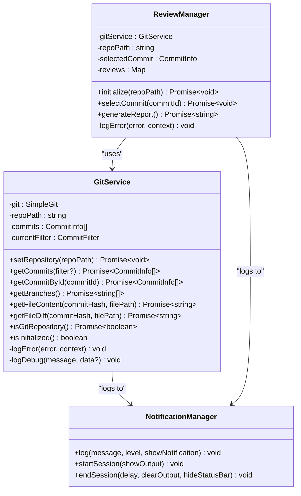
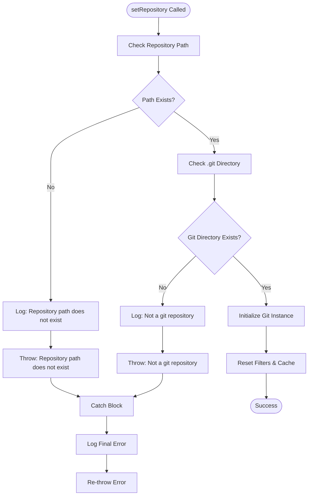
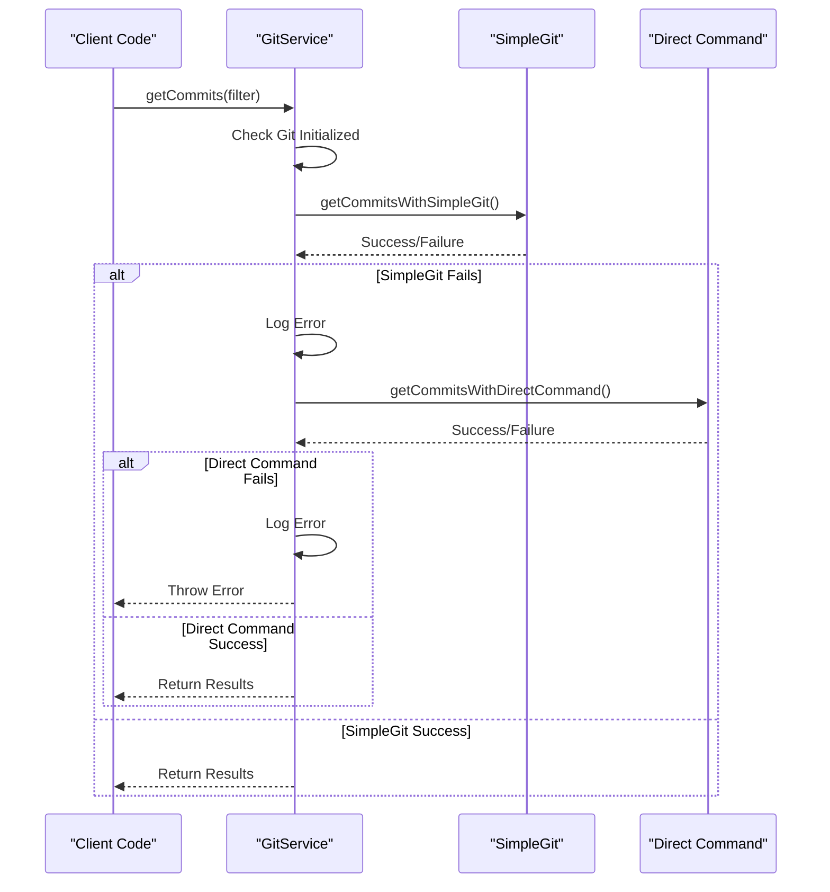
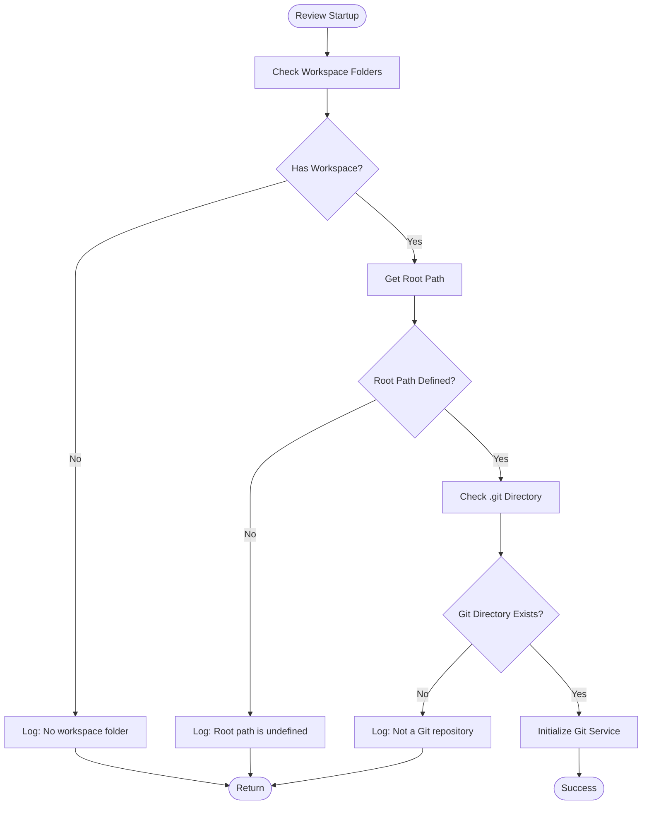
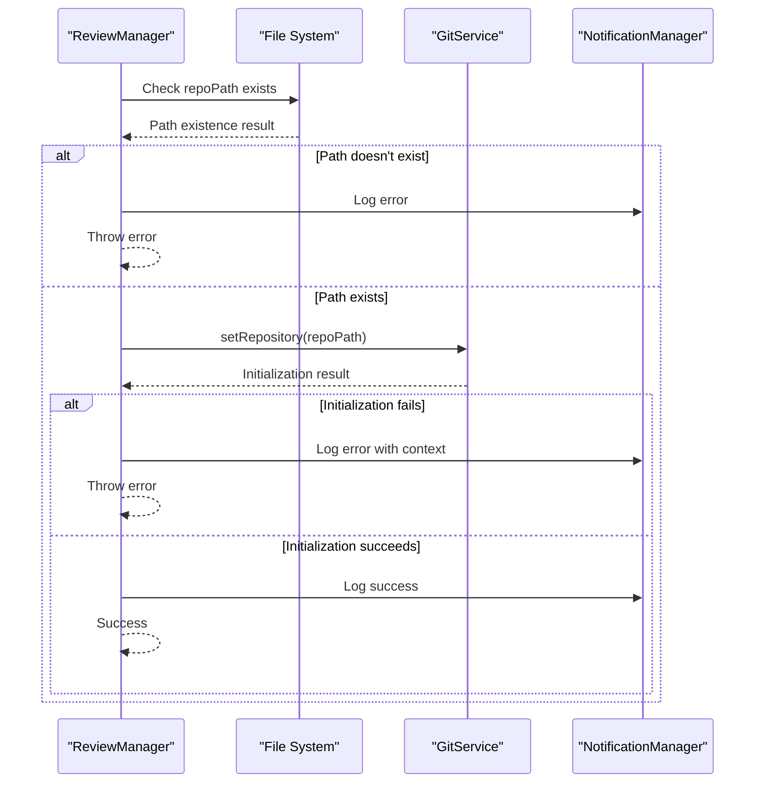
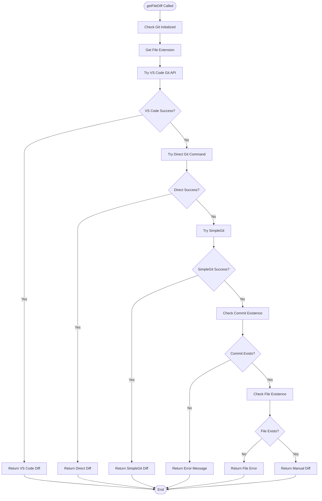
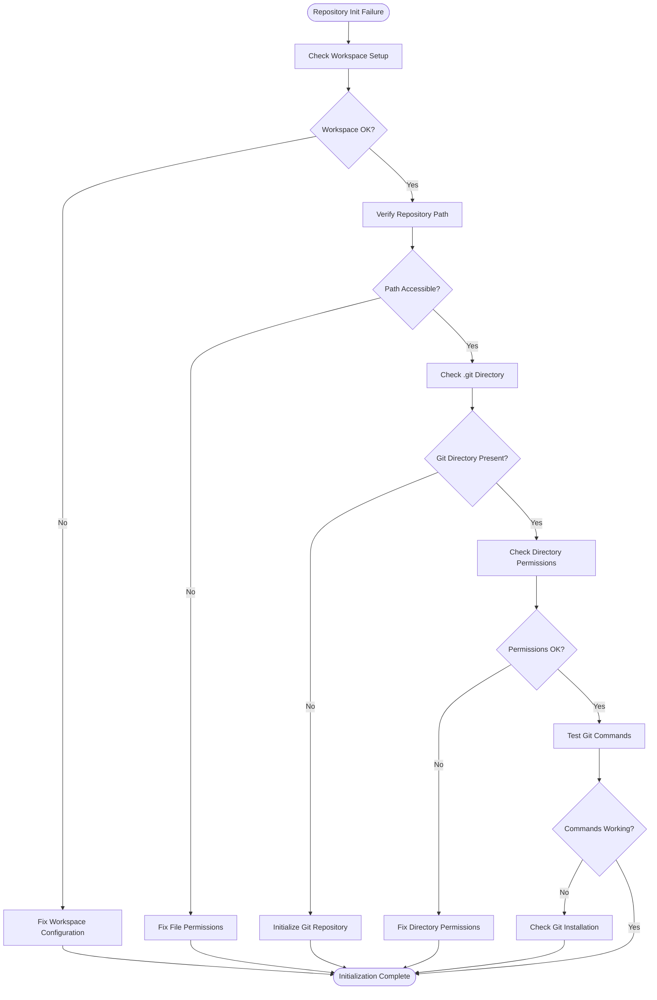
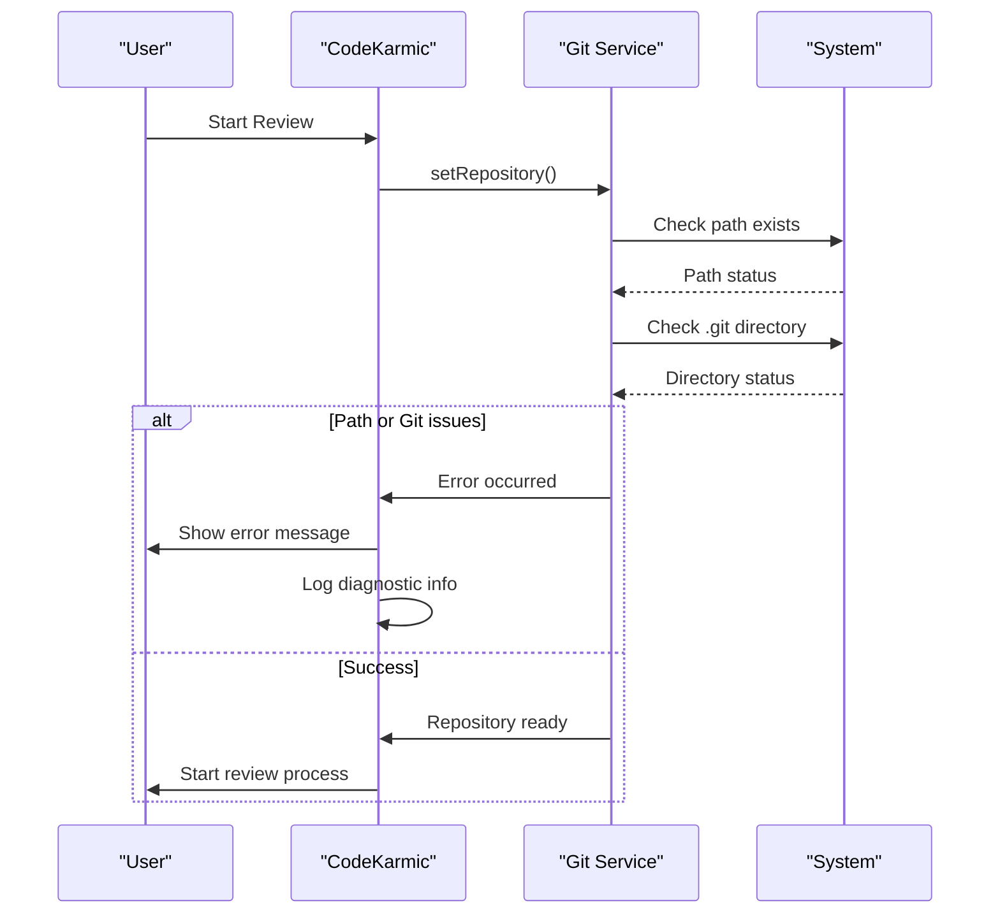
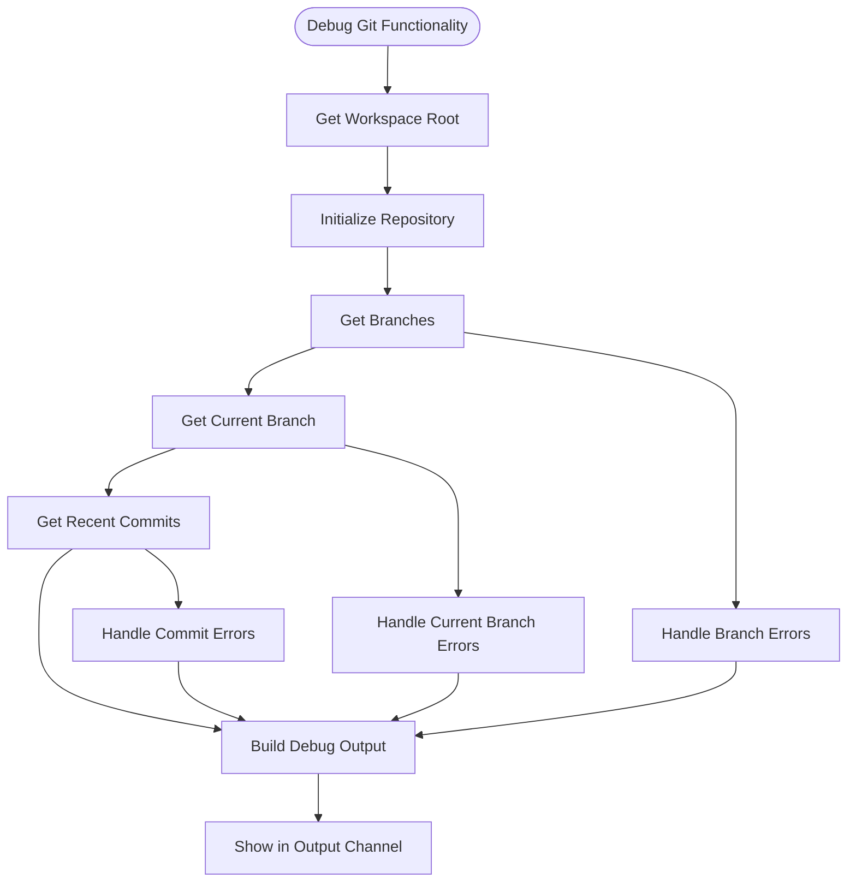

# Git Integration Issues

<cite>
**Referenced Files in This Document**
- [gitService.ts](file://src/services/git/gitService.ts)
- [extension.ts](file://src/extension.ts)
- [logger.ts](file://src/utils/logger.ts)
- [constants.ts](file://src/constants/constants.ts)
- [appConfig.ts](file://src/config/appConfig.ts)
- [reviewManager.ts](file://src/services/review/reviewManager.ts)
- [ui.ts](file://src/i18n/en/ui.ts)
- [output.ts](file://src/i18n/en/output.ts)
</cite>

## Table of Contents
1. [Introduction](#introduction)
2. [Core Git Service Architecture](#core-git-service-architecture)
3. [Common Git Integration Problems](#common-git-integration-problems)
4. [Error Handling Mechanisms](#error-handling-mechanisms)
5. [Repository Initialization Issues](#repository-initialization-issues)
6. [Git Command Execution Failures](#git-command-execution-failures)
7. [Troubleshooting Workflows](#troubleshooting-workflows)
8. [Resolution Procedures](#resolution-procedures)
9. [Diagnostic Tools](#diagnostic-tools)
10. [Best Practices](#best-practices)

## Introduction

CodeKarmic's Git integration is built around a robust GitService class that manages repository operations, commit analysis, and file tracking. The system handles various Git-related scenarios including repository initialization, commit retrieval, branch operations, and file content analysis. This document covers common Git integration problems, their symptoms, diagnostic approaches, and resolution procedures.

## Core Git Service Architecture

The Git integration is centered around the `GitService` class, which provides a comprehensive interface for Git operations with multiple fallback mechanisms and extensive error handling.



**Diagram sources**
- [gitService.ts](file://src/services/git/gitService.ts#L45-L1201)
- [reviewManager.ts](file://src/services/review/reviewManager.ts#L79-L854)

**Section sources**
- [gitService.ts](file://src/services/git/gitService.ts#L45-L1201)
- [reviewManager.ts](file://src/services/review/reviewManager.ts#L79-L854)

## Common Git Integration Problems

### Missing .git Directory Issues

The most common Git integration problem occurs when the `.git` directory is missing or inaccessible. This prevents CodeKarmic from recognizing the workspace as a Git repository.

**Symptoms:**
- Error message: "Not a git repository - .git directory not found in [path]"
- Repository validation fails during startup
- Git operations return empty results or throw exceptions

**Root Causes:**
- Workspace opened without a Git repository
- Repository initialized but `.git` directory moved or deleted
- Permission issues preventing access to `.git` directory
- Incorrect workspace configuration

### Invalid Repository Paths

Repository path validation failures occur when the specified path doesn't exist or isn't a valid Git repository.

**Symptoms:**
- Error message: "Repository path does not exist: [path]"
- Git service fails to initialize
- Operations requiring repository access fail

### Branch Not Found Errors

Issues accessing specific branches or determining the current branch.

**Symptoms:**
- Branch-specific operations fail
- Current branch detection returns "Unknown"
- Branch filtering produces empty results

### Failed Git Commands

Various Git command execution failures that prevent proper repository operations.

**Symptoms:**
- Timeout errors during Git operations
- Command execution failures
- Partial or corrupted data retrieval

**Section sources**
- [gitService.ts](file://src/services/git/gitService.ts#L64-L118)
- [extension.ts](file://src/extension.ts#L119-L122)

## Error Handling Mechanisms

CodeKarmic implements a comprehensive error handling system across multiple layers of the Git integration.

### GitService Error Handling (Lines 84-87)

The `setRepository` method contains critical error handling for repository initialization:



**Diagram sources**
- [gitService.ts](file://src/services/git/gitService.ts#L64-L107)

### getCommits Failure Handling (Lines 226-237)

The `getCommits` method implements a sophisticated fallback mechanism:



**Diagram sources**
- [gitService.ts](file://src/services/git/gitService.ts#L197-L241)

### Error Logging and Notification System

The system uses a centralized logging mechanism with multiple severity levels:

| Error Level | Purpose | Usage Pattern |
|-------------|---------|---------------|
| DEBUG | Development debugging | Internal operation details |
| INFO | General information | Successful operations |
| WARN | Warning conditions | Recoverable issues |
| ERROR | Error conditions | Unrecoverable failures |

**Section sources**
- [gitService.ts](file://src/services/git/gitService.ts#L1195-L1199)
- [reviewManager.ts](file://src/services/review/reviewManager.ts#L101-L105)

## Repository Initialization Issues

### Extension.ts Repository Validation (Lines 119-122)

During review startup, the extension performs early repository validation:



**Diagram sources**
- [extension.ts](file://src/extension.ts#L104-L122)

### ReviewManager Initialization (Lines 111-128)

The ReviewManager provides additional repository validation and initialization:



**Diagram sources**
- [reviewManager.ts](file://src/services/review/reviewManager.ts#L111-L128)

**Section sources**
- [extension.ts](file://src/extension.ts#L104-L122)
- [reviewManager.ts](file://src/services/review/reviewManager.ts#L111-L128)

## Git Command Execution Failures

### Multi-Level Command Execution Strategy

CodeKarmic implements a three-tier fallback strategy for Git command execution:

| Tier | Method | Description | Fallback Trigger |
|------|--------|-------------|------------------|
| 1 | VS Code Git API | Fastest, uses VS Code's Git extension | API unavailable or fails |
| 2 | Direct Git Command | Standard git CLI execution | CLI unavailable or fails |
| 3 | Manual Diff Generation | Custom diff calculation | All other methods fail |

### getFileDiff Implementation Strategy

The `getFileDiff` method demonstrates the comprehensive fallback approach:



**Diagram sources**
- [gitService.ts](file://src/services/git/gitService.ts#L707-L793)

### Command Execution Error Patterns

Common Git command execution failures and their handling:

| Error Pattern | Cause | Recovery Strategy |
|---------------|-------|-------------------|
| `git not found` | Git not installed | Suggest installation, fallback to manual |
| `Permission denied` | Insufficient permissions | Check file permissions, suggest fixes |
| `Timeout exceeded` | Large repository or network issues | Increase timeout, retry with smaller batches |
| `Bad revision` | Invalid commit hash | Validate commit hash, suggest alternatives |

**Section sources**
- [gitService.ts](file://src/services/git/gitService.ts#L707-L793)

## Troubleshooting Workflows

### Repository Initialization Failure Workflow



### Workspace Configuration Issues

Common workspace configuration problems and diagnostic steps:

1. **No Workspace Folder Open**
   - Verify workspace is properly opened
   - Check if folder contains Git repository
   - Ensure proper workspace configuration

2. **Incorrect Workspace Setup**
   - Confirm workspace folder contains `.git` directory
   - Check workspace permissions
   - Verify workspace path accessibility

3. **Multi-Repository Workspaces**
   - Handle multiple Git repositories
   - Select appropriate repository
   - Manage repository switching

### Git Command Execution Errors

Systematic approach to diagnosing Git command failures:



**Diagram sources**
- [extension.ts](file://src/extension.ts#L104-L122)

**Section sources**
- [extension.ts](file://src/extension.ts#L104-L122)
- [gitService.ts](file://src/services/git/gitService.ts#L64-L118)

## Resolution Procedures

### Uninitialized Repository Resolution

**Problem:** Repository not initialized or `.git` directory missing

**Resolution Steps:**
1. **Verify Repository Status**
   ```bash
   cd [repository-path]
   git status
   ```

2. **Initialize Repository if Needed**
   ```bash
   git init
   ```

3. **Check Repository Integrity**
   ```bash
   git fsck
   ```

4. **Restore Missing Files**
   - Check if `.git` directory was accidentally deleted
   - Restore from backup if available
   - Reinitialize repository if necessary

### Incorrect Workspace Setup Resolution

**Problem:** Workspace configured incorrectly for Git repository

**Resolution Steps:**
1. **Close Current Workspace**
   - File → Close Workspace

2. **Open Correct Workspace**
   - File → Open Folder
   - Select the correct Git repository folder

3. **Verify Workspace Configuration**
   - Check workspace settings
   - Ensure proper folder permissions
   - Validate workspace.json configuration

### Permission Issues Resolution

**Problem:** Insufficient permissions for Git operations

**Resolution Steps:**
1. **Check Directory Permissions**
   ```bash
   ls -la [repository-path]
   ```

2. **Fix Ownership Issues**
   ```bash
   sudo chown -R $USER:$USER [repository-path]
   ```

3. **Fix Permission Issues**
   ```bash
   chmod -R 755 [repository-path]
   ```

4. **Check .git Directory Permissions**
   ```bash
   chmod -R 700 [repository-path]/.git
   ```

### Git Command Execution Failures Resolution

**Problem:** Git commands failing during operations

**Resolution Steps:**
1. **Verify Git Installation**
   ```bash
   git --version
   ```

2. **Check Git Configuration**
   ```bash
   git config --list
   ```

3. **Test Basic Git Operations**
   ```bash
   git status
   git log --oneline -5
   ```

4. **Check Environment Variables**
   - Verify PATH includes Git executable
   - Check GIT_* environment variables
   - Validate shell configuration

**Section sources**
- [gitService.ts](file://src/services/git/gitService.ts#L64-L118)
- [reviewManager.ts](file://src/services/review/reviewManager.ts#L111-L128)

## Diagnostic Tools

### Built-in Debug Functionality

CodeKarmic includes comprehensive debugging capabilities:



**Diagram sources**
- [extension.ts](file://src/extension.ts#L609-L659)

### Error Message Reference

| Error Message | Meaning | Resolution |
|---------------|---------|------------|
| "Repository path does not exist" | Specified path doesn't exist | Verify path and permissions |
| "Not a git repository" | Missing .git directory | Initialize repository or check path |
| "Git not initialized" | Git service not ready | Wait for initialization completion |
| "Failed to set repository" | Repository setup failed | Check error details and resolve underlying issue |
| "Failed to get commits" | Commit retrieval failed | Check network connectivity and repository status |

### Logging and Monitoring

The system provides comprehensive logging for troubleshooting:

1. **Debug Logging**: Detailed operation traces for development
2. **Info Logging**: Successful operation confirmations
3. **Warning Logging**: Recoverable issues and degraded functionality
4. **Error Logging**: Critical failures requiring user intervention

**Section sources**
- [extension.ts](file://src/extension.ts#L609-L659)
- [gitService.ts](file://src/services/git/gitService.ts#L1185-L1199)

## Best Practices

### Repository Management

1. **Always Verify Repository Status**
   - Check `.git` directory presence before operations
   - Validate repository integrity regularly
   - Monitor repository health metrics

2. **Handle Edge Cases Gracefully**
   - Empty repositories
   - Repositories with large files
   - Network-connected repositories
   - Multi-user environments

3. **Implement Proper Error Recovery**
   - Provide meaningful error messages
   - Offer automatic recovery options
   - Maintain operation state consistency

### Performance Optimization

1. **Use Efficient Git Operations**
   - Leverage VS Code Git API when available
   - Implement caching for frequently accessed data
   - Use batch operations for multiple files

2. **Handle Large Repositories**
   - Implement pagination for commit lists
   - Use incremental loading for large diffs
   - Optimize memory usage for big files

3. **Network Resilience**
   - Implement retry mechanisms for network operations
   - Handle timeouts gracefully
   - Provide offline operation capabilities

### Security Considerations

1. **Access Control**
   - Validate repository access permissions
   - Handle authentication requirements
   - Secure sensitive repository data

2. **Data Protection**
   - Encrypt sensitive repository information
   - Protect temporary files and caches
   - Handle file content securely

3. **Audit and Monitoring**
   - Log all Git operations
   - Monitor for suspicious activity
   - Maintain operation history

**Section sources**
- [gitService.ts](file://src/services/git/gitService.ts#L45-L1201)
- [reviewManager.ts](file://src/services/review/reviewManager.ts#L79-L854)