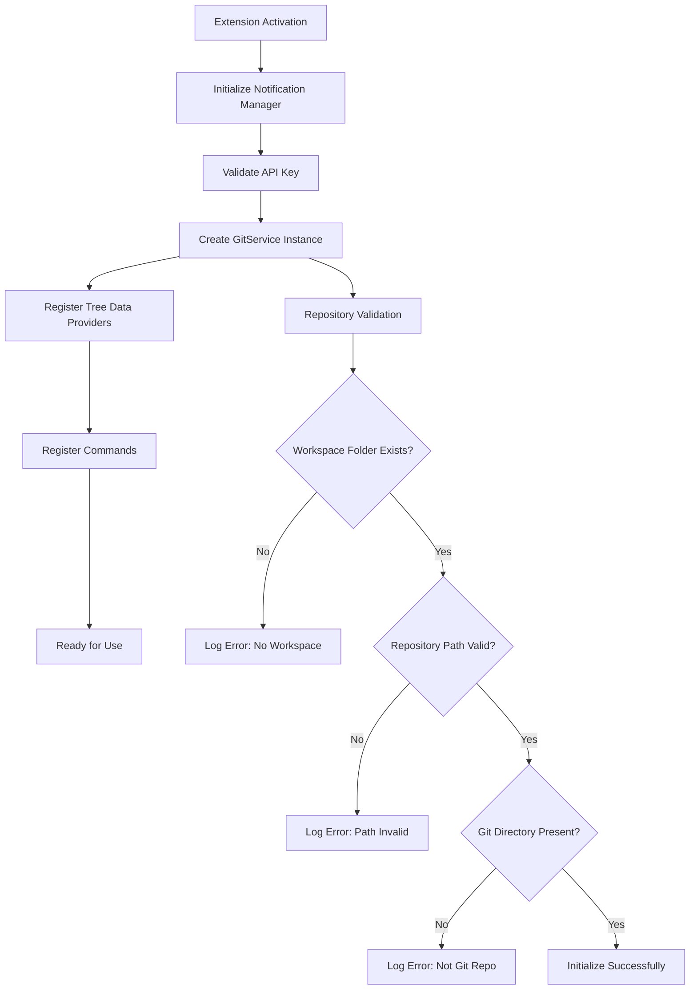
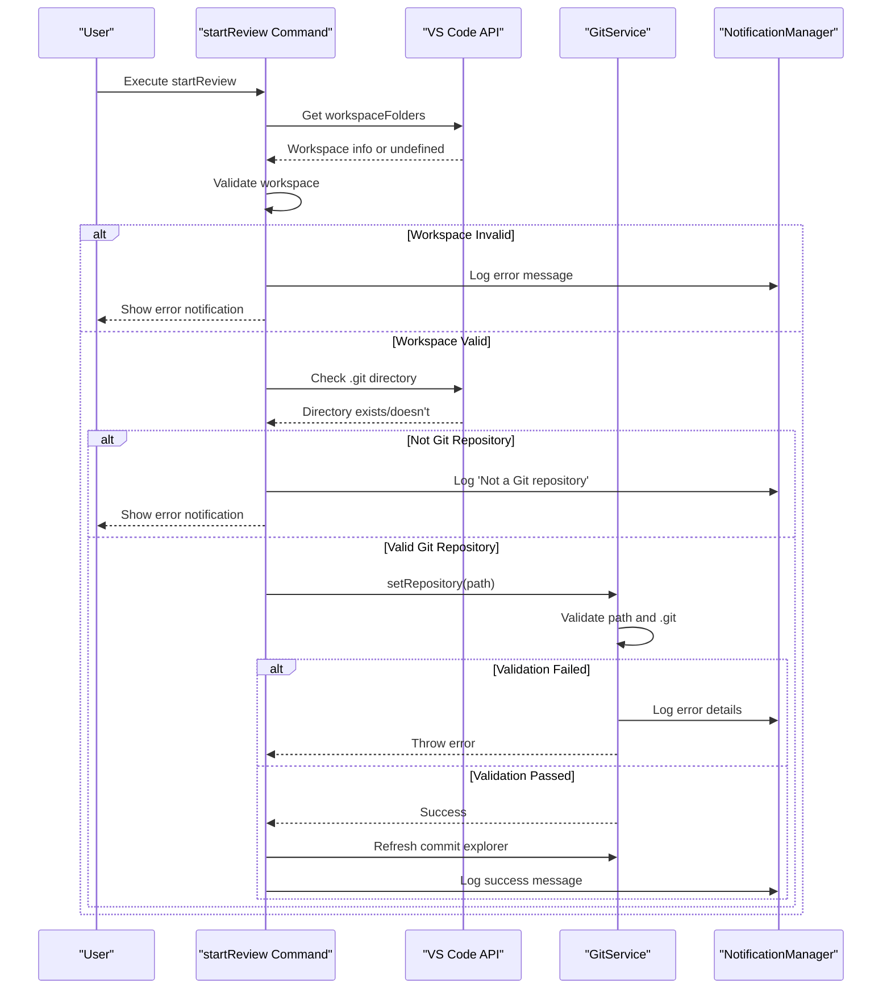
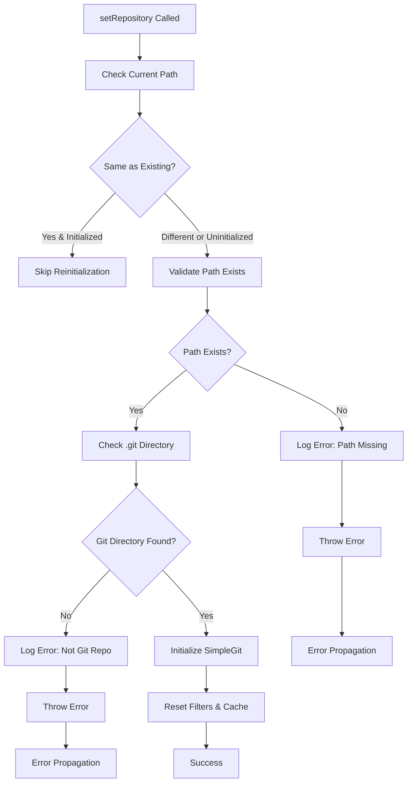
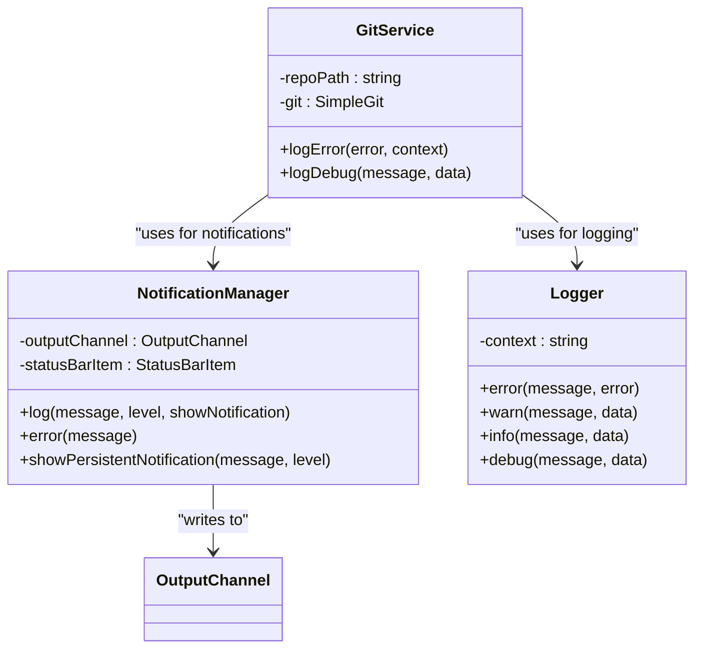
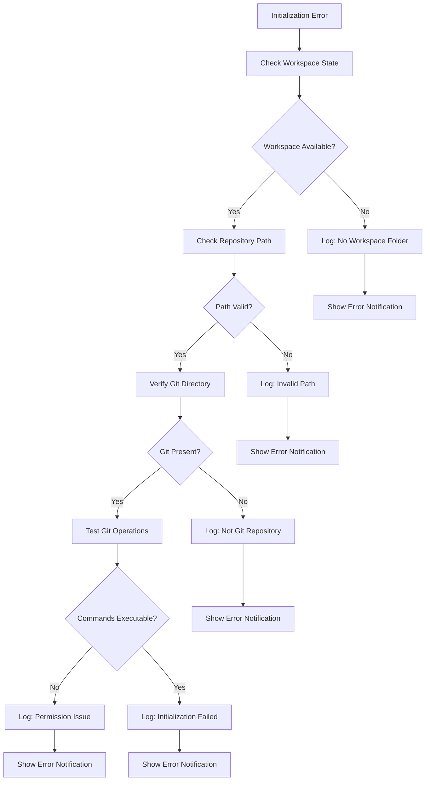

# Repository Initialization Errors

<cite>
**Referenced Files in This Document**
- [gitService.ts](file://src/services/git/gitService.ts)
- [extension.ts](file://src/extension.ts)
- [notificationManager.ts](file://src/services/notification/notificationManager.ts)
- [logger.ts](file://src/utils/logger.ts)
- [constants.ts](file://src/constants/constants.ts)
- [ui.ts](file://src/i18n/en/ui.ts)
- [index.ts](file://src/i18n/index.ts)
</cite>

## Table of Contents
1. [Introduction](#introduction)
2. [Repository Initialization Architecture](#repository-initialization-architecture)
3. [Core Error Scenarios](#core-error-scenarios)
4. [Error Handling Implementation](#error-handling-implementation)
5. [Diagnostic Workflows](#diagnostic-workflows)
6. [Resolution Procedures](#resolution-procedures)
7. [Best Practices](#best-practices)
8. [Troubleshooting Guide](#troubleshooting-guide)

## Introduction

CodeKarmic's repository initialization system is designed to handle various scenarios where Git repositories may be improperly configured or unavailable. The extension employs a multi-layered error handling approach that validates repository existence, checks Git integrity, and provides meaningful feedback to users when initialization fails.

The system operates through two primary entry points: extension activation and manual review startup, each with distinct validation requirements and error handling strategies. Understanding these patterns is crucial for diagnosing and resolving repository initialization issues.

## Repository Initialization Architecture

### Extension Activation Flow

The extension activation process establishes a foundational Git service instance that persists throughout the extension lifecycle:



**Diagram sources**
- [extension.ts](file://src/extension.ts#L20-L80)

### Manual Review Startup Flow

Manual review initiation involves dynamic repository validation with immediate user feedback:



**Diagram sources**
- [extension.ts](file://src/extension.ts#L102-L138)

**Section sources**
- [extension.ts](file://src/extension.ts#L102-L138)

## Core Error Scenarios

### Missing Workspace Folder

**Error Condition**: No workspace folder is currently open in Visual Studio Code.

**Detection Logic**: The system checks `vscode.workspace.workspaceFolders` for existence and validity.

**Error Messages**:
- English: "No workspace folder open"
- Chinese: "未打开工作区文件夹"

**Impact**: All Git operations fail as there's no root path to operate on.

### Invalid Repository Path

**Error Condition**: The specified repository path does not exist or is inaccessible.

**Detection Logic**: Synchronous file system check using `fs.existsSync()`.

**Error Messages**:
- "Repository path does not exist: [path]"
- "Root path is undefined"

**Impact**: Git service cannot initialize as the target directory is unavailable.

### Missing .git Directory

**Error Condition**: The repository lacks a `.git` directory indicating it's not a valid Git repository.

**Detection Logic**: Checks for the presence of `.git` directory within the repository root.

**Error Messages**:
- "Not a git repository - .git directory not found in [path]"

**Impact**: Git operations cannot proceed as the repository lacks version control metadata.

### Permission Issues

**Error Condition**: Insufficient permissions to access repository files or directories.

**Detection Logic**: Caught during file system operations or Git command execution.

**Common Scenarios**:
- Read permission denied on repository files
- Write permission issues with temporary files
- Access restrictions on `.git` directory

**Section sources**
- [gitService.ts](file://src/services/git/gitService.ts#L64-L107)
- [extension.ts](file://src/extension.ts#L104-L122)

## Error Handling Implementation

### GitService.setRepository Error Handling

The `setRepository` method implements comprehensive validation with immediate error reporting:



**Diagram sources**
- [gitService.ts](file://src/services/git/gitService.ts#L64-L107)

### Error Logging and Notification System

The error handling system integrates multiple layers for comprehensive error reporting:



**Diagram sources**
- [gitService.ts](file://src/services/git/gitService.ts#L1195-L1199)
- [notificationManager.ts](file://src/services/notification/notificationManager.ts#L79-L117)
- [logger.ts](file://src/utils/logger.ts#L83-L87)

### Error Recovery Strategies

The system implements multiple recovery strategies depending on the nature of the error:

| Error Type | Recovery Strategy | Implementation |
|------------|------------------|----------------|
| Path Not Found | Immediate Failure | Throws error with descriptive message |
| Invalid Git Repo | Immediate Failure | Validates .git directory presence |
| Permission Denied | Graceful Degradation | Falls back to alternative methods |
| Network Issues | Retry Logic | Implements exponential backoff |
| API Key Missing | Interactive Prompt | Requests API key configuration |

**Section sources**
- [gitService.ts](file://src/services/git/gitService.ts#L1195-L1199)
- [notificationManager.ts](file://src/services/notification/notificationManager.ts#L79-L117)

## Diagnostic Workflows

### Repository Validation Workflow

When repository initialization fails, the system follows a structured diagnostic approach:



### Debug Information Collection

The system provides comprehensive debug information for troubleshooting:

**Available Debug Data**:
- Repository path validation results
- Git executable availability
- Permission status
- Environment configuration
- Command execution logs

**Section sources**
- [extension.ts](file://src/extension.ts#L609-L659)

## Resolution Procedures

### Uninitialized Git Repository

**Symptoms**: Repository path exists but lacks `.git` directory.

**Resolution Steps**:
1. **Initialize Repository**: Run `git init` in the repository root
2. **Verify Initialization**: Confirm `.git` directory creation
3. **Reload Extension**: Restart CodeKarmic to reinitialize
4. **Test Functionality**: Verify commit history access

**Prevention**:
- Always initialize Git repositories before use
- Use proper repository setup scripts
- Implement pre-commit hooks for validation

### Incorrect Workspace Setup

**Symptoms**: Workspace folder exists but contains no Git repository.

**Resolution Steps**:
1. **Change Workspace**: Open the correct repository folder
2. **Verify Structure**: Ensure proper project organization
3. **Reopen Extension**: Reload Visual Studio Code
4. **Validate Setup**: Test repository access

**Prevention**:
- Use consistent workspace organization
- Implement workspace validation scripts
- Document proper setup procedures

### Permission Issues

**Symptoms**: Access denied errors during repository operations.

**Resolution Steps**:
1. **Check Permissions**: Verify read/write access to repository
2. **Fix Ownership**: Correct file/directory ownership
3. **Adjust Permissions**: Set appropriate access rights
4. **Test Access**: Verify permission fixes

**Common Solutions**:
- `chmod -R 755 repository-path`
- `chown -R user:group repository-path`
- Check antivirus exclusions

### API Key Configuration

**Symptoms**: API key validation failures affecting repository operations.

**Resolution Steps**:
1. **Access Settings**: Open CodeKarmic settings
2. **Enter API Key**: Provide valid API credentials
3. **Validate Key**: Test API key functionality
4. **Retry Operations**: Attempt repository operations again

**Section sources**
- [extension.ts](file://src/extension.ts#L37-L66)

## Best Practices

### Error Prevention

**Repository Setup Checklist**:
- [ ] Repository initialized with `git init`
- [ ] Proper file permissions configured
- [ ] Workspace folder contains valid Git repository
- [ ] API keys properly configured
- [ ] Dependencies installed and accessible

**Development Environment**:
- Use consistent development environments
- Implement automated setup validation
- Document troubleshooting procedures
- Maintain error monitoring systems

### User Experience Guidelines

**Error Messaging Standards**:
- Use clear, actionable language
- Provide specific error context
- Offer suggested solutions
- Include relevant technical details for debugging

**Notification Management**:
- Use appropriate notification levels
- Avoid overwhelming users with too many messages
- Provide helpful context for each error
- Enable easy access to detailed logs

## Troubleshooting Guide

### Common Error Scenarios and Solutions

| Error Message | Likely Cause | Solution |
|---------------|--------------|----------|
| "Repository path does not exist" | Invalid or deleted repository path | Verify path correctness and recreate repository |
| "Not a git repository" | Missing .git directory | Run `git init` in repository root |
| "No workspace folder open" | No active workspace | Open repository folder in VS Code |
| "Permission denied" | Insufficient file permissions | Fix file/directory permissions |
| "API key not configured" | Missing AI service credentials | Configure API key in settings |

### Diagnostic Commands

**Repository Validation**:
```bash
# Check repository status
cd /path/to/repository
git status

# Verify .git directory
ls -la .git

# Test Git operations
git log --oneline -5
```

**Permission Testing**:
```bash
# Check file permissions
ls -la /path/to/repository

# Test write access
touch /path/to/repository/test-file
rm /path/to/repository/test-file
```

### Log Analysis

**Enable Debug Logging**:
- Set `NODE_ENV=development` environment variable
- Check VS Code output panel for debug information
- Review extension logs for detailed error traces

**Log Location**: VS Code Output Panel → CodeKarmic

**Section sources**
- [logger.ts](file://src/utils/logger.ts#L83-L87)
- [constants.ts](file://src/constants/constants.ts#L1-33)

### Recovery Procedures

**Complete Repository Reset**:
1. Close Visual Studio Code
2. Backup important files
3. Delete `.git` directory (if corrupted)
4. Recreate repository with `git init`
5. Restore tracked files
6. Reload extension

**Configuration Reset**:
1. Clear extension settings
2. Reset API keys
3. Reconfigure preferences
4. Restart extension

**Emergency Recovery**:
1. Disable CodeKarmic temporarily
2. Use VS Code's built-in Git features
3. Contact support with detailed error logs
4. Monitor for updates with bug fixes

This comprehensive error handling system ensures that CodeKarmic can gracefully handle repository initialization failures while providing users with clear guidance for resolution. The multi-layered approach combines immediate validation, comprehensive logging, and user-friendly error messaging to create a robust development experience.