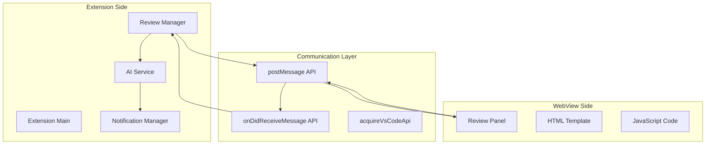
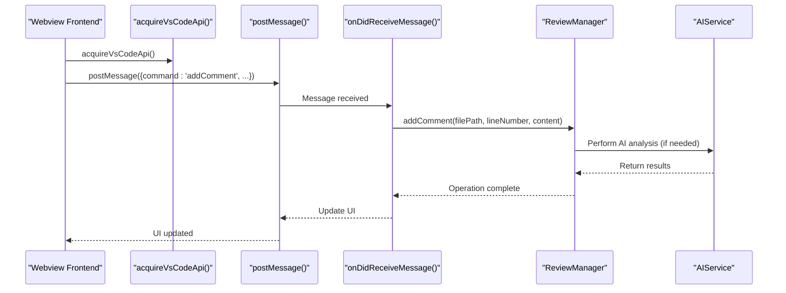
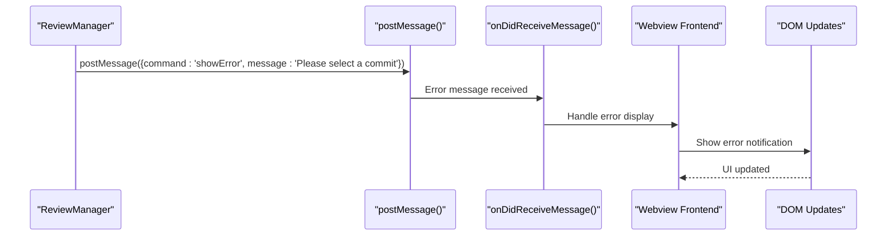
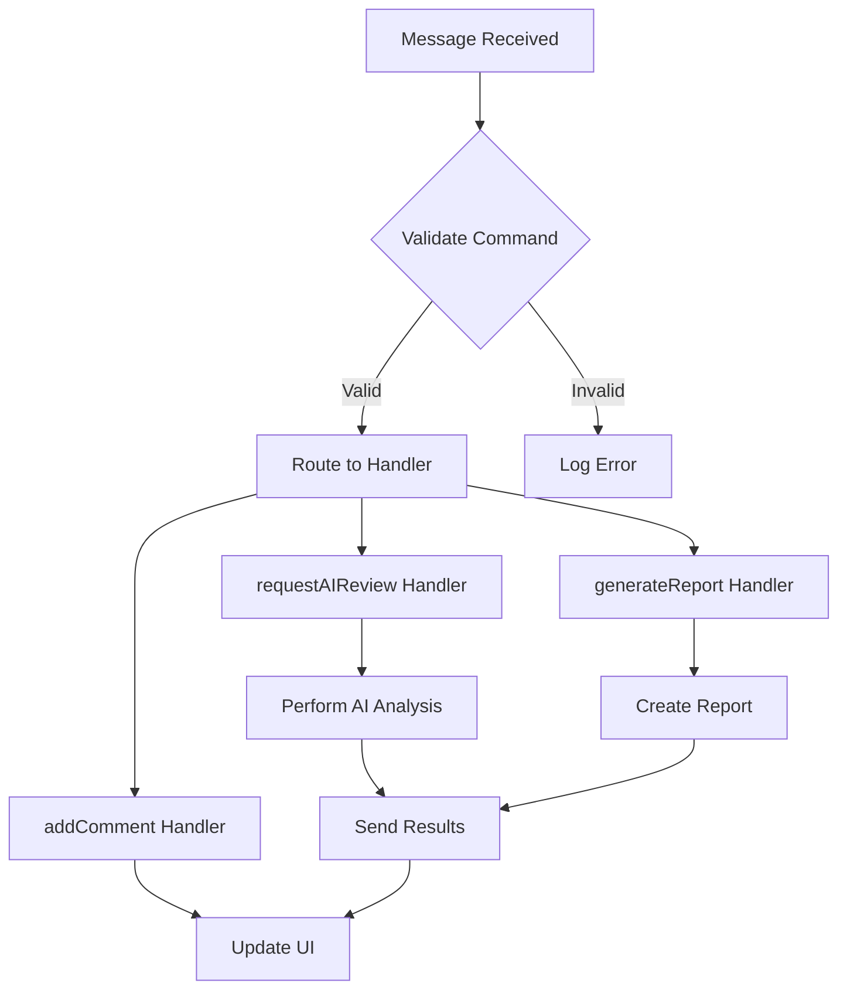
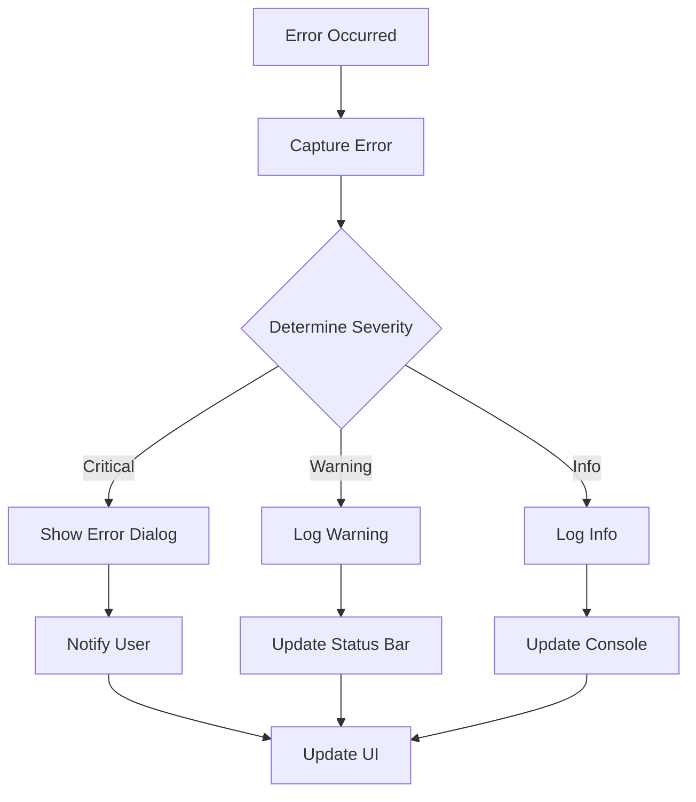

# Message Communication Issues in CodeKarmic

<cite>
**Referenced Files in This Document**
- [reviewPanel.ts](file://src/ui/views/reviewPanel.ts)
- [extension.ts](file://src/extension.ts)
- [reviewManager.ts](file://src/services/review/reviewManager.ts)
- [aiService.ts](file://src/services/ai/aiService.ts)
- [notificationManager.ts](file://src/services/notification/notificationManager.ts)
</cite>

## Table of Contents
1. [Introduction](#introduction)
2. [Message Communication Architecture](#message-communication-architecture)
3. [Bidirectional Communication Pattern](#bidirectional-communication-pattern)
4. [Common Message Communication Issues](#common-message-communication-issues)
5. [Message Serialization and Command Routing](#message-serialization-and-command-routing)
6. [Error Propagation and Handling](#error-propagation-and-handling)
7. [Troubleshooting Workflows](#troubleshooting-workflows)
8. [Resolution Steps](#resolution-steps)
9. [Best Practices](#best-practices)
10. [Debugging Tools](#debugging-tools)

## Introduction

CodeKarmic implements a sophisticated bidirectional message communication system between its VS Code extension and webview panels. This system enables seamless interaction between the extension's backend services and the frontend webview interface, facilitating features like AI code review, comment submission, and report generation.

The communication follows VS Code's WebView messaging pattern using `postMessage` for sending messages from webview to extension, and `onDidReceiveMessage` for receiving messages in the extension. Understanding this communication system is crucial for diagnosing and resolving various issues that may arise during development and usage.

## Message Communication Architecture

The message communication system in CodeKarmic is built around several key components that work together to enable seamless interaction:



**Diagram sources**
- [reviewPanel.ts](file://src/ui/views/reviewPanel.ts#L47-L75)
- [extension.ts](file://src/extension.ts#L141-L151)

**Section sources**
- [reviewPanel.ts](file://src/ui/views/reviewPanel.ts#L1-L621)
- [extension.ts](file://src/extension.ts#L1-L920)

## Bidirectional Communication Pattern

### Webview to Extension Messages

The webview sends messages to the extension using the `postMessage` API, which is acquired through `acquireVsCodeApi()`:



**Diagram sources**
- [reviewPanel.ts](file://src/ui/views/reviewPanel.ts#L547-L556)
- [reviewPanel.ts](file://src/ui/views/reviewPanel.ts#L47-L75)

### Extension to Webview Messages

Messages flow back from the extension to the webview through the same mechanism, enabling real-time updates:



**Diagram sources**
- [reviewPanel.ts](file://src/ui/views/reviewPanel.ts#L65-L67)
- [reviewPanel.ts](file://src/ui/views/reviewPanel.ts#L47-L75)

**Section sources**
- [reviewPanel.ts](file://src/ui/views/reviewPanel.ts#L514-L574)

## Common Message Communication Issues

### Failed Message Posting

**Symptoms:**
- Buttons appear unresponsive
- No action occurs when clicking UI elements
- Console errors about missing `vscode` object

**Causes:**
1. WebView not properly initialized
2. `acquireVsCodeApi()` not called
3. WebView context lost during navigation
4. Script execution disabled in WebView

**Diagnosis:**
```javascript
// Check if acquireVsCodeApi is available
if (typeof acquireVsCodeApi === 'undefined') {
    console.error('acquireVsCodeApi is not available');
}
```

### Unhandled Message Commands

**Symptoms:**
- Specific features not working (e.g., AI review, comment submission)
- Silent failures with no error messages
- Partial functionality working

**Causes:**
1. Missing command handlers in `onDidReceiveMessage`
2. Incorrect command names in message payloads
3. Missing or malformed message structure
4. Exception thrown in command handler

**Diagnosis:**
```javascript
// Add logging to message handlers
console.log('Received message:', message);
switch (message.command) {
    case 'addComment':
        console.log('Processing addComment command');
        // Handler logic...
        break;
    default:
        console.warn('Unhandled command:', message.command);
}
```

### Broken Event Listeners

**Symptoms:**
- Click events not firing
- Form submissions not working
- Tab switching not functioning

**Causes:**
1. Event listeners not attached properly
2. DOM elements not available when attaching listeners
3. Event bubbling issues
4. Memory leaks causing listeners to fail

**Diagnosis:**
```javascript
// Verify element availability
const submitButton = document.getElementById('submit-comment');
if (!submitButton) {
    console.error('Submit button not found');
}
```

**Section sources**
- [reviewPanel.ts](file://src/ui/views/reviewPanel.ts#L532-L574)

## Message Serialization and Command Routing

### Message Payload Structure

CodeKarmic uses a standardized message format for all communications:

| Field | Type | Required | Description |
|-------|------|----------|-------------|
| `command` | string | Yes | Specifies the action to perform |
| Additional fields | varies | No | Depends on the specific command |

**Supported Commands:**

| Command | Purpose | Payload Fields | Response |
|---------|---------|----------------|----------|
| `addComment` | Add code review comment | `content`, `lineNumber` | Updates review data |
| `requestAIReview` | Trigger AI analysis | None | Returns AI suggestions |
| `generateReport` | Generate code review report | None | Creates markdown report |
| `showError` | Display error message | `message` | Shows error notification |

### Command Routing Implementation

The extension routes messages through a centralized switch statement:



**Diagram sources**
- [reviewPanel.ts](file://src/ui/views/reviewPanel.ts#L48-L71)

### Error Handling in Command Routing

Each command handler includes comprehensive error handling:

```typescript
// Example error handling pattern
case 'addComment':
    try {
        await this._reviewManager.addComment(
            this._filePath,
            message.lineNumber,
            message.content
        );
        this._update();
    } catch (error) {
        this._panel.webview.postMessage({
            command: 'showError',
            message: `Failed to add comment: ${error.message}`
        });
    }
    return;
```

**Section sources**
- [reviewPanel.ts](file://src/ui/views/reviewPanel.ts#L48-L71)

## Error Propagation and Handling

### Error Types and Categories

CodeKarmic categorizes errors into several types for effective handling:

| Error Category | Description | Handling Strategy |
|----------------|-------------|-------------------|
| **Communication Errors** | Message posting failures | Retry mechanism, fallback UI |
| **Validation Errors** | Invalid message payloads | User feedback, input sanitization |
| **Service Errors** | AI service failures | Graceful degradation, error reporting |
| **State Errors** | Invalid application state | State recovery, user guidance |

### Error Propagation Mechanism



**Diagram sources**
- [reviewManager.ts](file://src/services/review/reviewManager.ts#L101-L105)
- [notificationManager.ts](file://src/services/notification/notificationManager.ts#L73-L99)

### Error Recovery Strategies

The system implements several recovery strategies:

1. **Automatic Retry**: For transient network issues
2. **Graceful Degradation**: Fallback to simpler functionality
3. **State Reset**: Reinitialize components when necessary
4. **User Guidance**: Provide clear instructions for manual recovery

**Section sources**
- [reviewManager.ts](file://src/services/review/reviewManager.ts#L101-L105)
- [notificationManager.ts](file://src/services/notification/notificationManager.ts#L73-L99)

## Troubleshooting Workflows

### Unresponsive Buttons Workflow

**Problem:** AI review button or comment submission appears unresponsive

**Diagnostic Steps:**

1. **Check WebView Initialization**
   ```javascript
   // Verify acquireVsCodeApi is available
   if (typeof acquireVsCodeApi === 'undefined') {
       console.error('WebView not properly initialized');
       // Reload the panel
   }
   ```

2. **Verify Event Listener Attachment**
   ```javascript
   // Check if event listeners are attached
   const button = document.getElementById('request-ai-review');
   if (!button) {
       console.error('Button element not found');
   } else {
       console.log('Button found, checking event listeners...');
       // Inspect button properties
   }
   ```

3. **Test Message Sending**
   ```javascript
   // Test immediate message sending
   try {
       vscode.postMessage({ command: 'test', data: 'ping' });
       console.log('Message sent successfully');
   } catch (error) {
       console.error('Failed to send message:', error);
   }
   ```

### Failed AI Review Requests

**Problem:** AI review requests fail silently or return errors

**Diagnostic Steps:**

1. **Check API Key Configuration**
   ```javascript
   // Verify AI service initialization
   const aiService = AIService.getInstance();
   if (!aiService) {
       console.error('AI service not initialized');
   }
   ```

2. **Validate Message Payload**
   ```javascript
   // Log message payload before sending
   const message = { command: 'requestAIReview' };
   console.log('Sending AI review request:', message);
   vscode.postMessage(message);
   ```

3. **Monitor Network Activity**
   ```javascript
   // Add network monitoring
   window.addEventListener('error', (event) => {
       console.error('Network error:', event.error);
   });
   ```

### Broken Comment Submission

**Problem:** Comment submission fails or doesn't update UI

**Diagnostic Steps:**

1. **Validate Input Fields**
   ```javascript
   // Check form field values
   const content = document.getElementById('comment-content').value.trim();
   const lineNumber = parseInt(document.getElementById('line-number').value, 10);
   
   console.log('Form values:', { content, lineNumber });
   ```

2. **Verify Message Structure**
   ```javascript
   // Log message structure
   const message = {
       command: 'addComment',
       content: content,
       lineNumber: lineNumber
   };
   console.log('Comment submission message:', message);
   ```

3. **Check Review Manager State**
   ```javascript
   // Verify review manager state
   const reviewData = await this._reviewManager.reviewFile(this._filePath);
   console.log('Current review data:', reviewData);
   ```

**Section sources**
- [reviewPanel.ts](file://src/ui/views/reviewPanel.ts#L532-L556)
- [reviewManager.ts](file://src/services/review/reviewManager.ts#L264-L287)

## Resolution Steps

### Message Payload Structure Issues

**Problem:** Malformed message payloads cause communication failures

**Resolution Steps:**

1. **Validate Command Names**
   ```typescript
   // Ensure command names match exactly
   const validCommands = ['addComment', 'requestAIReview', 'generateReport'];
   if (!validCommands.includes(message.command)) {
       throw new Error(`Invalid command: ${message.command}`);
   }
   ```

2. **Sanitize Input Data**
   ```typescript
   // Sanitize message payload
   const sanitizedMessage = {
       command: message.command,
       content: message.content?.toString().trim(),
       lineNumber: parseInt(message.lineNumber?.toString() || '0', 10)
   };
   ```

3. **Add Type Checking**
   ```typescript
   // Implement runtime type checking
   function validateMessage(message: any): boolean {
       if (typeof message !== 'object' || !message.command) {
           return false;
       }
       
       switch (message.command) {
           case 'addComment':
               return typeof message.content === 'string' && 
                      typeof message.lineNumber === 'number';
           case 'requestAIReview':
               return true;
           case 'generateReport':
               return true;
           default:
               return false;
       }
   }
   ```

### Command Name Mismatches

**Problem:** Typographical errors in command names prevent message handling

**Resolution Steps:**

1. **Centralize Command Definitions**
   ```typescript
   // Define commands in a central location
   export const COMMANDS = {
       ADD_COMMENT: 'addComment',
       REQUEST_AI_REVIEW: 'requestAIReview',
       GENERATE_REPORT: 'generateReport',
       SHOW_ERROR: 'showError'
   };
   ```

2. **Implement Command Validation**
   ```typescript
   // Validate commands before processing
   const VALID_COMMANDS = Object.values(COMMANDS);
   if (!VALID_COMMANDS.includes(message.command)) {
       console.error(`Unknown command: ${message.command}`);
       return;
   }
   ```

3. **Add Fallback Handlers**
   ```typescript
   // Implement fallback for unknown commands
   switch (message.command) {
       case COMMANDS.ADD_COMMENT:
           // Handle add comment
           break;
       case COMMANDS.REQUEST_AI_REVIEW:
           // Handle AI review
           break;
       default:
           console.warn('Unknown command received:', message.command);
           // Optionally send error message back to webview
           this._panel.webview.postMessage({
               command: COMMANDS.SHOW_ERROR,
               message: `Unknown command: ${message.command}`
           });
   }
   ```

### Webview Lifecycle Timing Issues

**Problem:** Messages sent before WebView is ready or after disposal

**Resolution Steps:**

1. **Implement Ready State Tracking**
   ```typescript
   class ReviewPanel {
       private webViewReady: boolean = false;
       
       constructor() {
           // Track WebView readiness
           this._panel.webview.onDidReceiveMessage(() => {
               this.webViewReady = true;
           });
       }
       
       sendMessageSafe(message: any) {
           if (!this.webViewReady) {
               console.warn('WebView not ready, queuing message:', message);
               // Queue message for later delivery
               return;
           }
           
           this._panel.webview.postMessage(message);
       }
   }
   ```

2. **Handle WebView Disposal**
   ```typescript
   // Check WebView state before sending messages
   dispose() {
       if (this._panel && !this._panel.disposed) {
           this._panel.webview.postMessage({
               command: 'dispose',
               message: 'WebView is being disposed'
           });
       }
       
       // Clean up resources
       this.webViewReady = false;
   }
   ```

3. **Implement Retry Logic**
   ```typescript
   // Implement exponential backoff for retry
   async sendMessageWithRetry(message: any, maxRetries: number = 3) {
       let retries = 0;
       while (retries < maxRetries) {
           try {
               if (this.webViewReady) {
                   this._panel.webview.postMessage(message);
                   return;
               }
               
               await new Promise(resolve => setTimeout(resolve, 100 * Math.pow(2, retries)));
               retries++;
           } catch (error) {
               console.error('Failed to send message:', error);
               retries++;
           }
       }
       
       console.error('Max retries reached, giving up on message:', message);
   }
   ```

**Section sources**
- [reviewPanel.ts](file://src/ui/views/reviewPanel.ts#L47-L75)
- [reviewPanel.ts](file://src/ui/views/reviewPanel.ts#L126-L137)

## Best Practices

### Message Design Guidelines

1. **Use Descriptive Command Names**
   ```typescript
   // Good: Descriptive and specific
   const message = { command: 'addCodeReviewComment' };
   
   // Bad: Generic and unclear
   const message = { command: 'add' };
   ```

2. **Implement Consistent Payload Structure**
   ```typescript
   // Standardize payload structure
   interface MessagePayload {
       command: string;
       data?: any;
       metadata?: {
           timestamp: number;
           requestId?: string;
       };
   }
   ```

3. **Add Versioning for Backward Compatibility**
   ```typescript
   // Include version information
   const message = {
       command: 'addComment',
       version: '1.0',
       data: { content, lineNumber }
   };
   ```

### Error Handling Best Practices

1. **Always Wrap Message Handlers in Try-Catch**
   ```typescript
   this._panel.webview.onDidReceiveMessage(
       async (message) => {
           try {
               await this.handleMessage(message);
           } catch (error) {
               console.error('Message handler error:', error);
               this.sendErrorMessage(error.message);
           }
       }
   );
   ```

2. **Provide Meaningful Error Messages**
   ```typescript
   // Include context in error messages
   throw new Error(`Failed to add comment at line ${lineNumber}: ${error.message}`);
   ```

3. **Implement Graceful Degradation**
   ```typescript
   // Fallback to basic functionality if advanced features fail
   try {
       await advancedFeature();
   } catch (error) {
       console.warn('Advanced feature failed, falling back:', error);
       await basicFeature();
   }
   ```

### Performance Optimization

1. **Batch Related Messages**
   ```typescript
   // Batch multiple updates into single message
   const updates = [
       { type: 'commentAdded', data: comment },
       { type: 'suggestionAdded', data: suggestion },
       { type: 'scoreUpdated', data: score }
   ];
   
   vscode.postMessage({ command: 'batchUpdate', data: updates });
   ```

2. **Implement Message Throttling**
   ```typescript
   // Throttle rapid message sending
   let messageQueue: any[] = [];
   let isProcessing = false;
   
   function enqueueMessage(message: any) {
       messageQueue.push(message);
       processQueue();
   }
   
   async function processQueue() {
       if (isProcessing || messageQueue.length === 0) return;
       
       isProcessing = true;
       while (messageQueue.length > 0) {
           const message = messageQueue.shift();
           vscode.postMessage(message);
           await new Promise(resolve => setTimeout(resolve, 100)); // 100ms delay
       }
       
       isProcessing = false;
   }
   ```

## Debugging Tools

### Built-in Debugging Features

CodeKarmic includes several debugging tools for message communication issues:

1. **Console Logging**
   ```typescript
   // Enable detailed logging
   console.log('Message sent:', message);
   console.log('Message received:', receivedMessage);
   ```

2. **State Inspection**
   ```typescript
   // Log current state for debugging
   console.log('Current WebView state:', {
       ready: this.webViewReady,
       disposed: this._panel.disposed,
       visible: this._panel.visible
   });
   ```

3. **Message Tracing**
   ```typescript
   // Trace message flow
   function traceMessage(message: any, direction: 'sent' | 'received') {
       console.group(`Message ${direction}: ${message.command}`);
       console.log('Payload:', message);
       console.log('Timestamp:', new Date().toISOString());
       console.groupEnd();
   }
   ```

### External Debugging Tools

1. **VS Code Developer Tools**
   ```javascript
   // Open developer tools for WebView debugging
   vscode.commands.executeCommand('workbench.action.webview.openDeveloperTools');
   ```

2. **Network Monitoring**
   ```javascript
   // Monitor network activity
   window.addEventListener('fetch', (event) => {
       console.log('Network request:', event.request.url);
   });
   ```

3. **Message Replay Tool**
   ```typescript
   // Implement message replay for testing
   class MessageReplayTool {
       private recordedMessages: any[] = [];
       
       recordMessage(message: any) {
           this.recordedMessages.push({
               message,
               timestamp: Date.now()
           });
       }
       
       replayMessages() {
           this.recordedMessages.forEach(({ message }) => {
               vscode.postMessage(message);
           });
       }
   }
   ```

**Section sources**
- [reviewPanel.ts](file://src/ui/views/reviewPanel.ts#L514-L574)
- [reviewManager.ts](file://src/services/review/reviewManager.ts#L101-L105)