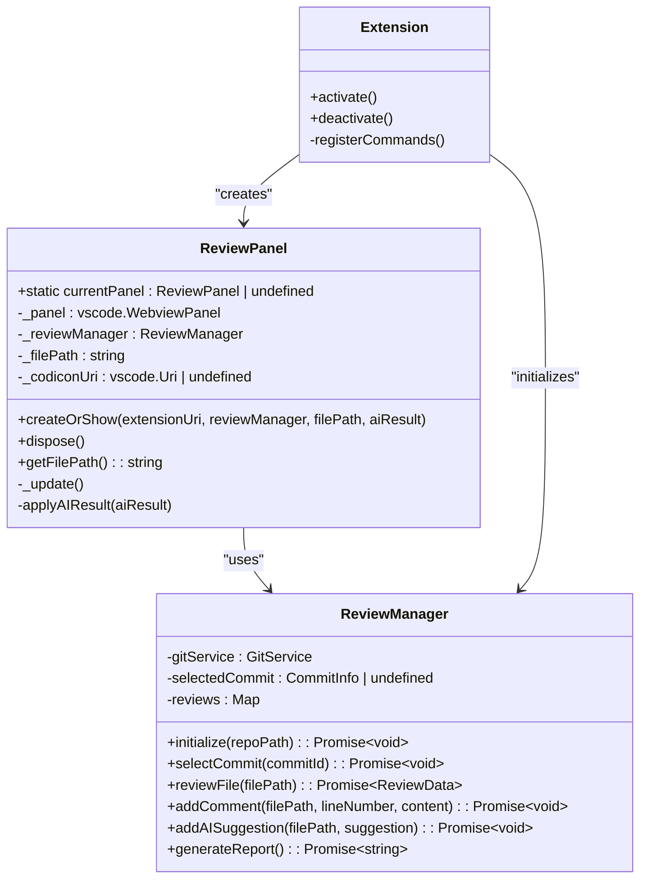
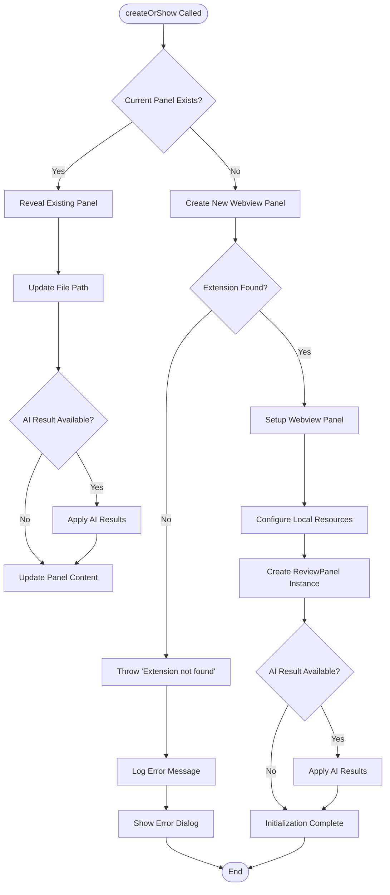
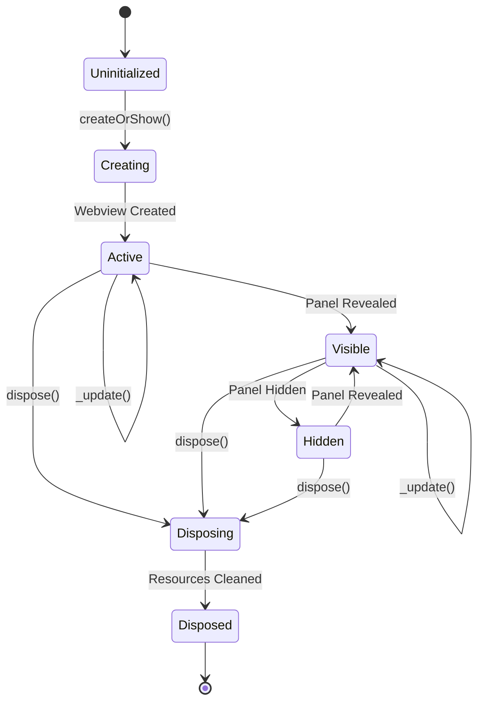

# Panel Initialization Errors

<cite>
**Referenced Files in This Document**
- [reviewPanel.ts](file://src/ui/views/reviewPanel.ts)
- [extension.ts](file://src/extension.ts)
- [package.json](file://package.json)
- [reviewManager.ts](file://src/services/review/reviewManager.ts)
</cite>

## Table of Contents
1. [Introduction](#introduction)
2. [Panel Initialization Architecture](#panel-initialization-architecture)
3. [Common Panel Initialization Issues](#common-panel-initialization-issues)
4. [Error Handling in ReviewPanel.createOrShow](#error-handling-in-reviewpanelcreateorshow)
5. [ExtensionUri Misconfiguration](#extensionuri-misconfiguration)
6. [Command Registration Issues](#command-registration-issues)
7. [Panel Lifecycle Management](#panel-lifecycle-management)
8. [Troubleshooting Workflows](#troubleshooting-workflows)
9. [Resolution Strategies](#resolution-strategies)
10. [Best Practices](#best-practices)

## Introduction

The CodeKarmic extension utilizes a sophisticated webview-based panel system for code review functionality. The panel initialization process involves multiple components working together, including the ReviewPanel class, extension activation, and command registration. Understanding the initialization patterns and error handling mechanisms is crucial for diagnosing and resolving panel-related issues.

This document covers the most common panel initialization problems, their root causes, and systematic approaches to troubleshooting and resolution.

## Panel Initialization Architecture

The CodeKarmic panel system follows a singleton pattern with static management of the current panel instance. The architecture consists of several key components working in coordination:



**Diagram sources**
- [reviewPanel.ts](file://src/ui/views/reviewPanel.ts#L5-L12)
- [reviewManager.ts](file://src/services/review/reviewManager.ts#L79-L93)
- [extension.ts](file://src/extension.ts#L20-L520)

**Section sources**
- [reviewPanel.ts](file://src/ui/views/reviewPanel.ts#L5-L12)
- [reviewManager.ts](file://src/services/review/reviewManager.ts#L79-L93)

## Common Panel Initialization Issues

### Webview Creation Failures

Webview creation failures are among the most frequent panel initialization issues. These can occur due to various reasons:

1. **Resource Loading Problems**: The webview fails to load required resources from the extension directory
2. **Security Restrictions**: Local resource roots configuration prevents access to necessary files
3. **Memory Constraints**: Insufficient memory allocation for webview creation
4. **Concurrent Access**: Multiple panels attempting to create webviews simultaneously

### ExtensionUri Misconfiguration

The extensionUri parameter is critical for webview resource loading. Common misconfigurations include:

1. **Incorrect URI Format**: Passing malformed or improperly constructed URIs
2. **Missing Resource Paths**: Failing to include required resource directories in localResourceRoots
3. **Path Resolution Issues**: Incorrect relative path resolution for codicon CSS files
4. **Extension Not Found**: Attempting to access extensionUri before extension activation

### Improper Command Registration

Command registration issues can prevent panel creation from being triggered:

1. **Missing Activation Events**: Commands not registered in package.json activationEvents
2. **Incorrect Command Names**: Mismatch between command registration and invocation
3. **Scope Issues**: Commands registered with incorrect scope or category
4. **Dependency Conflicts**: Conflicting command registrations from other extensions

**Section sources**
- [reviewPanel.ts](file://src/ui/views/reviewPanel.ts#L102-L118)
- [extension.ts](file://src/extension.ts#L26-L35)

## Error Handling in ReviewPanel.createOrShow

The `createOrShow` method implements comprehensive error handling for panel initialization. Understanding its error handling patterns is essential for troubleshooting:



**Diagram sources**
- [reviewPanel.ts](file://src/ui/views/reviewPanel.ts#L78-L124)

### Line-by-Line Error Analysis

#### Line 250: Standalone Mode Detection
The system determines whether to operate in standalone mode (direct file review) or Git commit mode. This affects resource loading and functionality availability.

#### Line 297: View Column Configuration
The view column determination falls back to `vscode.ViewColumn.Two` if no active text editor is present. This ensures panels always appear in a predictable location.

#### Line 357: Constructor Initialization
The constructor performs critical initialization including codicon URI creation and webview content setup. Any failure here results in an unusable panel.

**Section sources**
- [reviewPanel.ts](file://src/ui/views/reviewPanel.ts#L78-L124)

## ExtensionUri Misconfiguration

ExtensionUri misconfiguration is a common source of panel initialization failures. The extensionUri parameter must be correctly passed from extension.ts to reviewPanel.ts:

### Proper ExtensionUri Usage

The extensionUri should be obtained during extension activation and passed to panel creation:

```typescript
// Correct approach from extension.ts
const extension = vscode.extensions.getExtension('nesnilnehc.codekarmic');
if (extension) {
    await ReviewPanel.createOrShow(extension.extensionUri, reviewManager, filePath);
}
```

### Common Misconfiguration Patterns

1. **Null Extension Reference**: Attempting to access extensionUri before extension is fully activated
2. **Incorrect Extension ID**: Using the wrong extension identifier
3. **Timing Issues**: Accessing extensionUri during deactivation phase
4. **Relative Path Errors**: Incorrect relative path construction for resource loading

### Resource Loading Validation

The system validates resource loading through localResourceRoots configuration:

```typescript
localResourceRoots: [
    vscode.Uri.joinPath(extensionUri, 'media'),
    vscode.Uri.joinPath(extensionUri, 'resources')
]
```

**Section sources**
- [reviewPanel.ts](file://src/ui/views/reviewPanel.ts#L111-L114)
- [extension.ts](file://src/extension.ts#L248-L253)

## Command Registration Issues

Command registration in extension.ts must be carefully managed to ensure proper panel initialization:

### Command Registration Pattern

The extension registers commands using VS Code's command registration API:

```typescript
vscode.commands.registerCommand('codekarmic.reviewFile', async () => {
    try {
        const extension = vscode.extensions.getExtension('nesnilnehc.codekarmic');
        if (extension) {
            await ReviewPanel.createOrShow(extension.extensionUri, reviewManager, '');
        } else {
            throw new Error('Extension not found');
        }
    } catch (error) {
        console.error(`Error opening review panel: ${error}`);
        vscode.window.showErrorMessage(`Error opening review panel: ${error}`);
    }
});
```

### Common Registration Problems

1. **Activation Event Mismatches**: Commands not included in package.json activationEvents
2. **Parameter Type Issues**: Incorrect parameter types in command registration
3. **Scope Conflicts**: Commands conflicting with built-in VS Code commands
4. **Error Handling Gaps**: Missing error handling in command implementations

**Section sources**
- [extension.ts](file://src/extension.ts#L246-L258)

## Panel Lifecycle Management

Understanding the panel lifecycle is crucial for proper initialization and disposal:



**Diagram sources**
- [reviewPanel.ts](file://src/ui/views/reviewPanel.ts#L126-L138)

### Static CurrentPanel Pattern

The ReviewPanel uses a static currentPanel pattern for managing singleton instances:

1. **Singleton Management**: Only one ReviewPanel instance exists at a time
2. **Automatic Cleanup**: Dispose method resets currentPanel to undefined
3. **Resource Tracking**: All disposables are tracked for proper cleanup
4. **State Persistence**: File path and AI results are preserved across panel reuse

### Disposal Lifecycle

Proper disposal ensures clean resource management:

```typescript
public dispose() {
    ReviewPanel.currentPanel = undefined;
    this._panel.dispose();
    while (this._disposables.length) {
        const x = this._disposables.pop();
        if (x) {
            x.dispose();
        }
    }
}
```

**Section sources**
- [reviewPanel.ts](file://src/ui/views/reviewPanel.ts#L126-L138)

## Troubleshooting Workflows

### Diagnostic Workflow for Panel Initialization

1. **Verify Extension Activation**
   - Check extension status in VS Code Extensions view
   - Confirm activation events in package.json
   - Verify extension logs in Output panel

2. **Validate ExtensionUri**
   - Test extensionUri accessibility
   - Verify resource paths exist
   - Check localResourceRoots configuration

3. **Test Command Execution**
   - Execute commands manually from Command Palette
   - Verify command registration in package.json
   - Check for command conflicts

4. **Inspect Webview Creation**
   - Monitor webview creation attempts
   - Check for resource loading errors
   - Validate security restrictions

### Error Message Analysis

Common error messages and their meanings:

| Error Message | Cause | Solution |
|---------------|-------|----------|
| "Extension not found" | ExtensionUri unavailable | Wait for extension activation |
| "ExtensionUri is undefined" | Incorrect extension reference | Use vscode.extensions.getExtension() |
| "Webview creation failed" | Security or resource issues | Check localResourceRoots |
| "Panel reveal failed" | View column conflicts | Use fallback view column |

### Logging and Monitoring

Enable debug logging for detailed troubleshooting:

```typescript
console.log(`Extension URI: ${extension.extensionUri.toString()}`);
console.log(`Local resources: ${localResourceRoots.map(r => r.toString()).join(', ')}`);
```

**Section sources**
- [extension.ts](file://src/extension.ts#L246-L258)
- [reviewPanel.ts](file://src/ui/views/reviewPanel.ts#L102-L118)

## Resolution Strategies

### Immediate Fixes

1. **Restart Extension Host**: Close and reopen VS Code
2. **Clear Extension Cache**: Delete extension cache directories
3. **Reload Window**: Use Command Palette → "Developer: Reload Window"
4. **Check Dependencies**: Verify all required packages are installed

### Configuration Fixes

1. **Update Package.json**: Ensure proper activationEvents
2. **Validate Resource Paths**: Verify media and resources directories exist
3. **Check Security Settings**: Review VS Code security policies
4. **Update Extension**: Install latest version from marketplace

### Code-Level Fixes

1. **Add Error Boundaries**: Wrap panel creation in try-catch blocks
2. **Implement Fallback Logic**: Provide alternative initialization paths
3. **Enhance Logging**: Add detailed diagnostic information
4. **Validate Inputs**: Ensure proper parameter validation

### Recovery Mechanisms

Implement robust recovery strategies:

```typescript
try {
    await ReviewPanel.createOrShow(extensionUri, reviewManager, filePath);
} catch (error) {
    // Fallback to basic panel creation
    const panel = vscode.window.createWebviewPanel('codekarmic', 'Code Review', 
        vscode.ViewColumn.Two, { enableScripts: true });
    // Basic initialization without full features
}
```

**Section sources**
- [reviewPanel.ts](file://src/ui/views/reviewPanel.ts#L78-L124)
- [extension.ts](file://src/extension.ts#L246-L258)

## Best Practices

### Initialization Patterns

1. **Lazy Loading**: Initialize panels only when needed
2. **Resource Validation**: Verify resources before panel creation
3. **Graceful Degradation**: Provide fallback functionality
4. **Error Propagation**: Properly handle and propagate errors

### Security Considerations

1. **Resource Isolation**: Use localResourceRoots to restrict access
2. **Input Validation**: Sanitize all user inputs
3. **Permission Checks**: Verify necessary permissions
4. **Content Security**: Implement CSP headers

### Performance Optimization

1. **Resource Caching**: Cache frequently accessed resources
2. **Lazy Initialization**: Defer expensive operations
3. **Memory Management**: Properly dispose of resources
4. **Concurrency Control**: Limit concurrent panel creations

### Testing Strategies

1. **Unit Testing**: Test individual components
2. **Integration Testing**: Test component interactions
3. **End-to-End Testing**: Test complete workflows
4. **Error Scenario Testing**: Test failure conditions

### Monitoring and Maintenance

1. **Logging Standards**: Implement consistent logging
2. **Metrics Collection**: Track performance metrics
3. **Health Checks**: Implement automated health monitoring
4. **Maintenance Procedures**: Establish regular maintenance routines

**Section sources**
- [reviewPanel.ts](file://src/ui/views/reviewPanel.ts#L13-L44)
- [reviewManager.ts](file://src/services/review/reviewManager.ts#L101-L105)