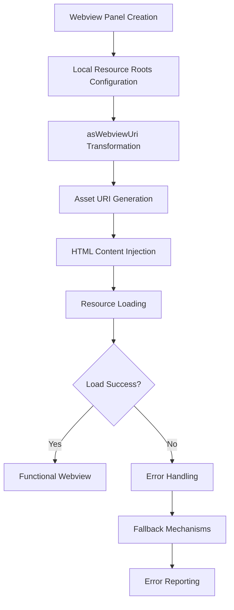
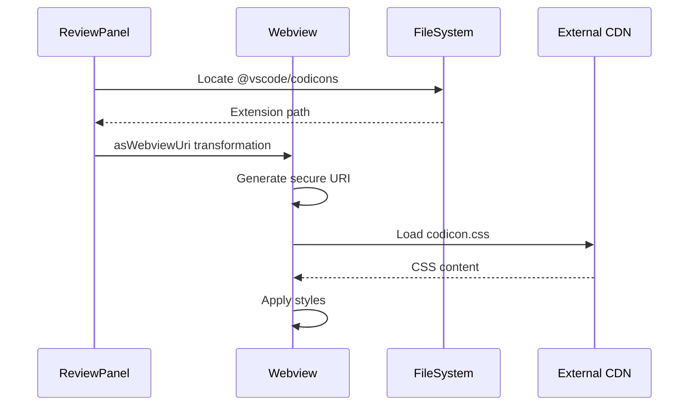
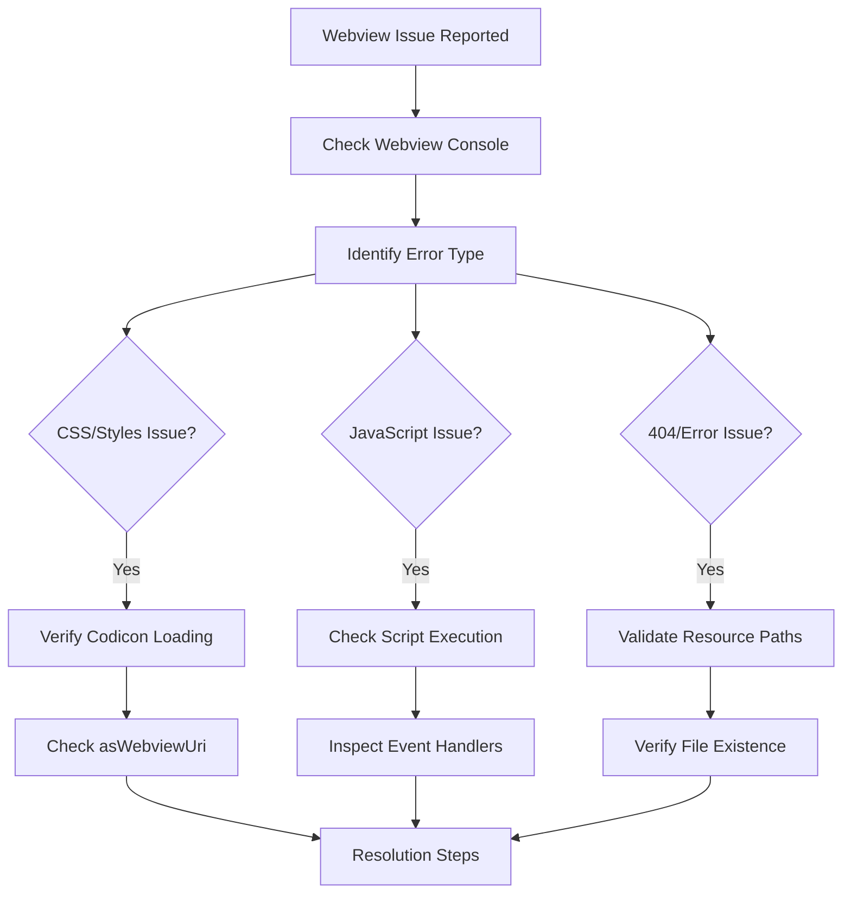
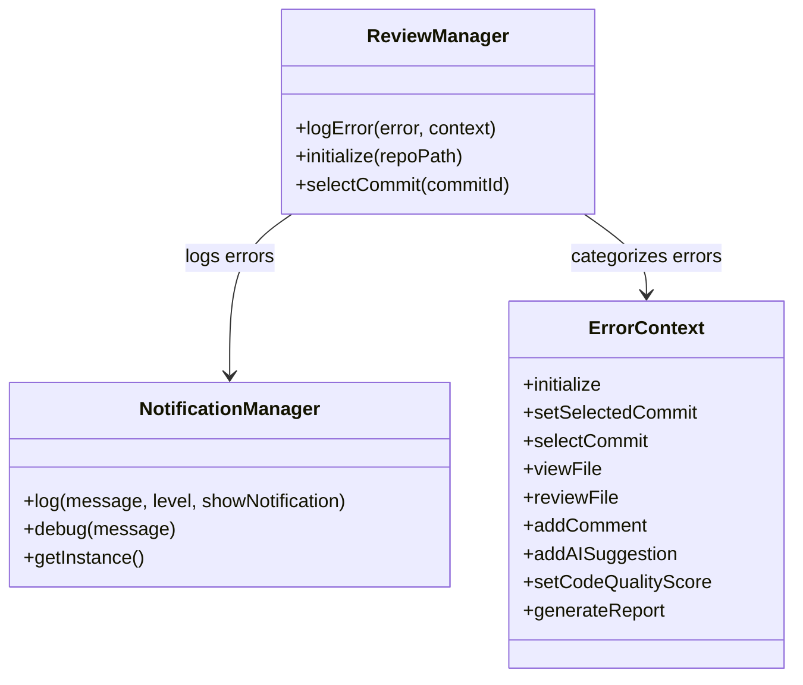

# Resource Loading Failures

<cite>
**Referenced Files in This Document**
- [reviewPanel.ts](file://src/ui/views/reviewPanel.ts)
- [extension.ts](file://src/extension.ts)
- [package.json](file://package.json)
- [webpack.config.js](file://webpack.config.js)
- [notificationManager.ts](file://src/services/notification/notificationManager.ts)
- [reviewManager.ts](file://src/services/review/reviewManager.ts)
- [retryUtils.ts](file://src/utils/retryUtils.ts)
- [fileExplorer.ts](file://src/ui/components/fileExplorer.ts)
</cite>

## Table of Contents
1. [Introduction](#introduction)
2. [Webview Resource Loading Architecture](#webview-resource-loading-architecture)
3. [Critical Resource Loading Components](#critical-resource-loading-components)
4. [Common Resource Loading Issues](#common-resource-loading-issues)
5. [Troubleshooting Workflows](#troubleshooting-workflows)
6. [Error Handling and Logging](#error-handling-and-logging)
7. [Resolution Strategies](#resolution-strategies)
8. [Best Practices](#best-practices)
9. [Advanced Diagnostics](#advanced-diagnostics)

## Introduction

CodeKarmic's webview components rely heavily on proper resource loading to deliver a seamless code review experience. The extension utilizes VS Code's webview API to render interactive code review panels, which depend on various CSS assets, JavaScript files, and icon resources. Resource loading failures can manifest as blank panels, missing styles, broken functionality, or 404 errors for static assets.

This document provides comprehensive coverage of resource loading issues, focusing on the specific implementation patterns in CodeKarmic's reviewPanel.ts and the underlying mechanisms that handle asset delivery to webview contexts.

## Webview Resource Loading Architecture

### Webview Panel Creation and Configuration

The foundation of resource loading in CodeKarmic lies in the webview panel creation process. The system employs strict resource restrictions to ensure security and proper asset isolation.

**Diagram sources**
- [reviewPanel.ts](file://src/ui/views/reviewPanel.ts#L103-L116)

### Local Resource Roots Configuration

The webview panel restricts asset loading to specific directories within the extension bundle, preventing access to arbitrary filesystem locations and ensuring predictable asset availability.

**Section sources**
- [reviewPanel.ts](file://src/ui/views/reviewPanel.ts#L111-L114)

### URI Transformation with asWebviewUri

The `asWebviewUri` method serves as the primary mechanism for transforming extension-relative paths into webview-accessible URIs. This transformation is crucial for accessing bundled assets within the secure webview sandbox.

**Section sources**
- [reviewPanel.ts](file://src/ui/views/reviewPanel.ts#L24-L26)

## Critical Resource Loading Components

### Codicon CSS Asset Loading

The system specifically loads VS Code's Codicon CSS framework to provide consistent iconography across the webview interface. This demonstrates the pattern for loading third-party CSS assets within the webview context.

**Diagram sources**
- [reviewPanel.ts](file://src/ui/views/reviewPanel.ts#L24-L26)

### HTML Template Generation

The webview content generation process dynamically incorporates resource URIs into the HTML template, ensuring proper asset linking during runtime.

**Section sources**
- [reviewPanel.ts](file://src/ui/views/reviewPanel.ts#L259)

### Asset Bundling Strategy

The webpack configuration ensures that all necessary assets are bundled and available within the extension distribution, maintaining consistency across different deployment scenarios.

**Section sources**
- [webpack.config.js](file://webpack.config.js#L1-L47)

## Common Resource Loading Issues

### Missing CSS Assets

**Symptoms:**
- Blank or unstyled webview panels
- Missing iconography and visual elements
- Broken layout and formatting

**Causes:**
- Incorrect path resolution for CSS assets
- Missing node_modules dependencies
- Webpack bundling issues
- asWebviewUri transformation failures

**Section sources**
- [reviewPanel.ts](file://src/ui/views/reviewPanel.ts#L24-L26)

### Failed JavaScript Loading

**Symptoms:**
- Interactive elements not functioning
- Event handlers not responding
- JavaScript errors in webview console

**Causes:**
- Script tag inclusion errors
- Cross-origin restrictions
- Security policy violations
- Network connectivity issues

### Broken Resource Paths

**Symptoms:**
- 404 errors for static assets
- Mixed content warnings
- Resource blocking in browser console

**Causes:**
- Incorrect URI transformation
- Path resolution mismatches
- Deployment configuration errors
- File system permission issues

### Content Security Policy Violations

**Symptoms:**
- Console security warnings
- Blocked script execution
- Disabled functionality

**Causes:**
- Unsafe inline scripts
- External resource access attempts
- Script injection prevention
- CSP header conflicts

## Troubleshooting Workflows

### Initial Diagnosis Workflow

### Step-by-Step Diagnostic Process

1. **Console Inspection**: Examine the webview developer console for specific error messages
2. **Network Analysis**: Monitor network requests for failed resource loads
3. **Path Validation**: Verify asset paths and URI transformations
4. **Permission Checking**: Ensure proper file system access permissions
5. **Deployment Verification**: Confirm asset bundling and packaging

### Error Pattern Recognition

| Error Type | Symptoms | Common Causes | Resolution Approach |
|------------|----------|---------------|-------------------|
| CSS Loading Failure | Blank/unstyled panels | Missing codicon.css, path errors | Verify asWebviewUri, check node_modules |
| JavaScript Errors | Non-functional interactivity | Script load failures, syntax errors | Validate script inclusion, check console |
| 404 Errors | Missing assets | Incorrect paths, missing files | Verify file existence, fix paths |
| CSP Violations | Security warnings | Unsafe scripts, blocked resources | Update CSP policies, fix resource access |

## Error Handling and Logging

### Comprehensive Error Management

The system implements robust error handling throughout the resource loading pipeline, utilizing centralized logging mechanisms for effective troubleshooting.

**Diagram sources**
- [notificationManager.ts](file://src/services/notification/notificationManager.ts#L1-L128)
- [reviewManager.ts](file://src/services/review/reviewManager.ts#L28-L76)

### Error Context Classification

The system categorizes errors by their operational context, enabling targeted troubleshooting and resolution strategies.

**Section sources**
- [reviewManager.ts](file://src/services/review/reviewManager.ts#L28-L76)

### Logging and Monitoring

Centralized logging provides comprehensive visibility into resource loading issues, enabling proactive monitoring and rapid issue resolution.

**Section sources**
- [notificationManager.ts](file://src/services/notification/notificationManager.ts#L73-L128)

## Resolution Strategies

### Missing Node Modules Dependencies

**Problem:** The @vscode/codicons package is essential for icon rendering but may be missing from the development environment.

**Resolution Steps:**
1. Verify node_modules installation: `npm install`
2. Check package.json dependencies
3. Ensure proper webpack bundling
4. Validate deployment packaging

**Prevention Measures:**
- Include node_modules in build artifacts
- Implement dependency validation
- Add automated testing for asset availability

### Incorrect Resource Paths

**Problem:** Path resolution errors prevent assets from loading correctly.

**Resolution Steps:**
1. Validate asset file existence
2. Verify path construction logic
3. Test URI transformation
4. Check webpack configuration

**Prevention Measures:**
- Implement path validation utilities
- Add automated path testing
- Use consistent path resolution patterns

### Improper URI Transformation

**Problem:** asWebviewUri transformation fails to produce valid URIs.

**Resolution Steps:**
1. Verify extension URI validity
2. Check resource root configurations
3. Test URI generation logic
4. Validate webview context

**Prevention Measures:**
- Add URI transformation validation
- Implement fallback URI generation
- Test across different VS Code versions

### Cross-Origin Resource Sharing Issues

**Problem:** Webview security restrictions prevent asset loading.

**Resolution Steps:**
1. Verify localResourceRoots configuration
2. Check CORS policy compliance
3. Validate asset serving mechanisms
4. Test in different environments

**Prevention Measures:**
- Implement CORS policy validation
- Add security policy testing
- Document security requirements

## Best Practices

### Resource Loading Implementation

1. **Always use asWebviewUri** for transforming extension-relative paths
2. **Validate asset existence** before attempting to load
3. **Implement fallback mechanisms** for critical assets
4. **Monitor resource loading performance** and implement caching strategies

### Development and Testing

1. **Test asset loading** in different VS Code environments
2. **Validate URI transformations** across various scenarios
3. **Implement automated testing** for resource availability
4. **Monitor error rates** and implement alerting systems

### Deployment Considerations

1. **Ensure proper asset bundling** during build processes
2. **Validate deployment artifacts** contain all required assets
3. **Test resource loading** in production-like environments
4. **Implement rollback mechanisms** for failed deployments

## Advanced Diagnostics

### Webview Console Analysis

Modern webview debugging involves analyzing the integrated browser console within VS Code's webview environment. This provides insights into:

- Network request failures
- JavaScript execution errors
- CSS loading issues
- Security policy violations

### Network Request Monitoring

Monitoring network requests helps identify:
- Failed resource loads
- Timing issues
- Security policy violations
- Cross-origin access attempts

### Asset Bundle Analysis

Analyzing the webpack bundle reveals:
- Missing assets in the build
- Incorrect asset paths
- Compression and optimization issues
- Dependency resolution problems

### Performance Profiling

Resource loading performance can be profiled to identify:
- Slow asset loads
- Bottlenecks in the loading pipeline
- Memory usage patterns
- Rendering performance impacts

**Section sources**
- [retryUtils.ts](file://src/utils/retryUtils.ts#L57-L116)