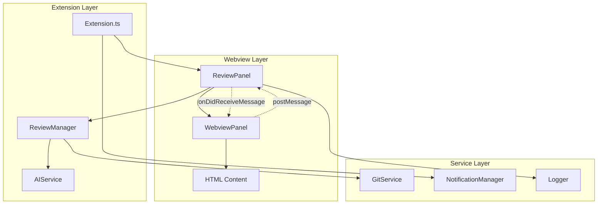
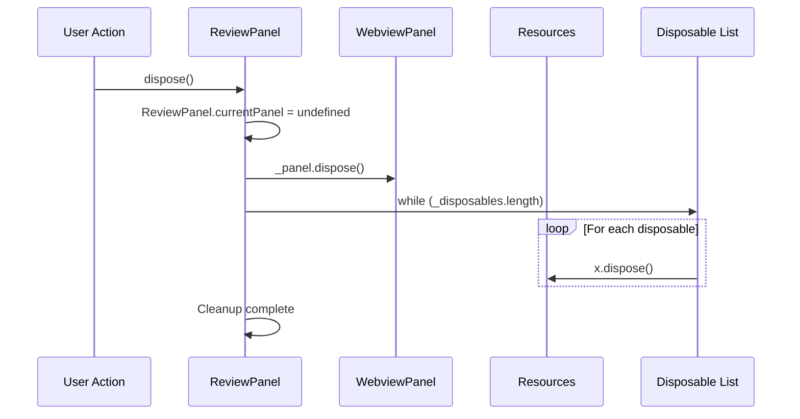
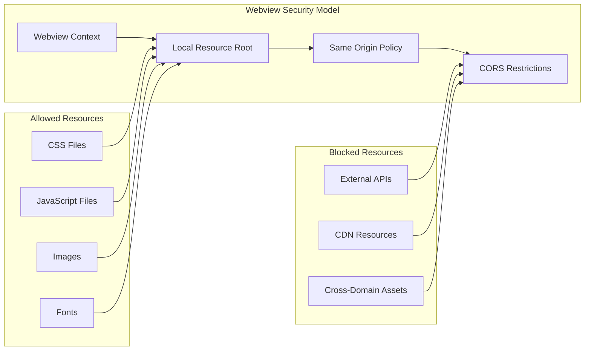
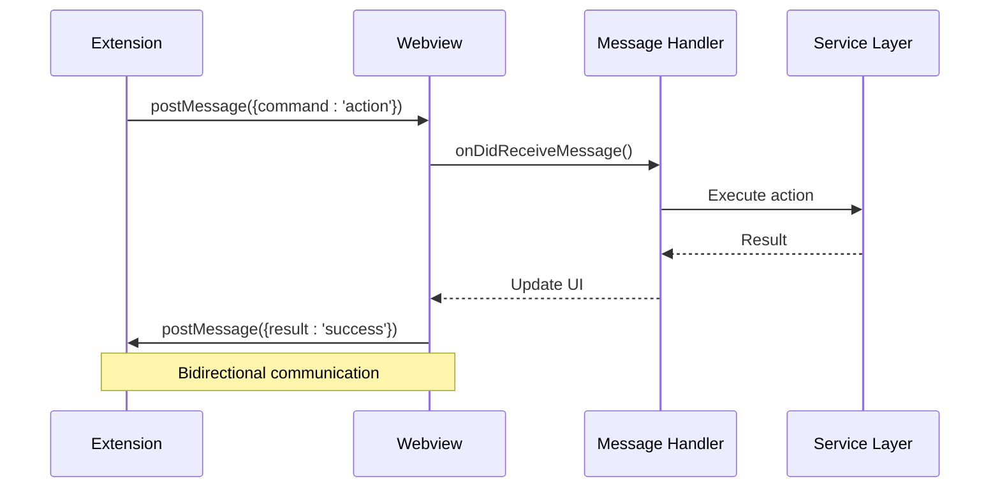
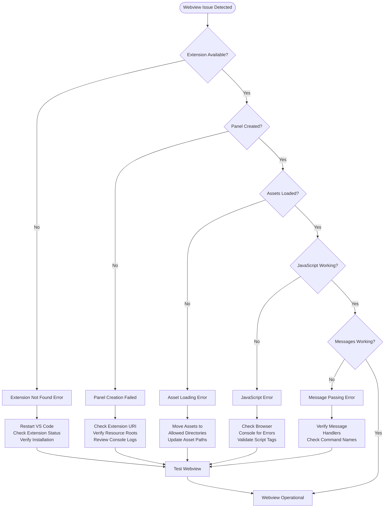

# Webview Display Failures

<cite>
**Referenced Files in This Document**
- [reviewPanel.ts](file://src/ui/views/reviewPanel.ts)
- [extension.ts](file://src/extension.ts)
- [logger.ts](file://src/utils/logger.ts)
- [notificationManager.ts](file://src/services/notification/notificationManager.ts)
- [reviewManager.ts](file://src/services/review/reviewManager.ts)
- [aiService.ts](file://src/services/ai/aiService.ts)
- [package.json](file://package.json)
- [webpack.config.js](file://webpack.config.js)
</cite>

## Table of Contents
1. [Introduction](#introduction)
2. [Webview Architecture Overview](#webview-architecture-overview)
3. [Common Webview Display Issues](#common-webview-display-issues)
4. [Error Handling in ReviewPanel.createOrShow](#error-handling-in-reviewpanelcreateorshow)
5. [Extension Command Registration Issues](#extension-command-registration-issues)
6. [Webview Disposal and Resource Management](#webview-disposal-and-resource-management)
7. [Asset Loading and ExtensionUri Configuration](#asset-loading-and-extensionuri-configuration)
8. [Cross-Origin Resource Sharing (CORS) Issues](#cross-origin-resource-sharing-cors-issues)
9. [Message Passing Failures](#message-passing-failures)
10. [Troubleshooting Workflows](#troubleshooting-workflows)
11. [Diagnostic Procedures](#diagnostic-procedures)
12. [Recovery Procedures](#recovery-procedures)
13. [Best Practices](#best-practices)

## Introduction

CodeKarmic's webview system enables seamless integration between VS Code extension functionality and web-based UI components. The webview architecture consists of multiple layers including the ReviewPanel for code review interfaces, extension command handlers, and various service layers. Understanding and resolving webview display issues requires comprehensive knowledge of these interconnected systems.

This documentation covers the most common webview display problems, their root causes, and systematic approaches to diagnosis and resolution. The issues primarily manifest during panel creation, content loading, asset delivery, and communication between extension and webview contexts.

## Webview Architecture Overview

The CodeKarmic webview system follows VS Code's webview panel architecture with specialized components for code review functionality.



**Diagram sources**
- [reviewPanel.ts](file://src/ui/views/reviewPanel.ts#L1-L621)
- [extension.ts](file://src/extension.ts#L1-L920)
- [reviewManager.ts](file://src/services/review/reviewManager.ts#L1-L854)

**Section sources**
- [reviewPanel.ts](file://src/ui/views/reviewPanel.ts#L1-L100)
- [extension.ts](file://src/extension.ts#L1-L100)

## Common Webview Display Issues

### Panel Loading Failures

**Symptoms:**
- Blank webview panels
- "Extension not found" errors
- "Webview failed to load" messages
- Panels that appear but show no content

**Root Causes:**
1. **ExtensionUri Configuration Issues**: Incorrect or missing extension URI for asset loading
2. **Local Resource Roots Misconfiguration**: Assets not properly included in allowed resource roots
3. **JavaScript Enablement Problems**: Scripts disabled in webview configuration
4. **Panel Creation Failures**: VS Code API limitations or resource constraints

### Rendering Errors

**Symptoms:**
- JavaScript errors in webview console
- Broken UI layouts
- Missing CSS styles
- Malformed HTML content

**Root Causes:**
1. **Asset Loading Failures**: CSS/JS files not accessible
2. **Content Security Policy Violations**: Blocked resources
3. **Template Generation Errors**: Malformed HTML in `_getHtmlForWebview()` method
4. **Resource Path Resolution**: Incorrect asset paths

### Communication Breakdowns

**Symptoms:**
- Commands not executing
- Messages not received
- State synchronization failures
- Event handlers not responding

**Root Causes:**
1. **Message Channel Interruptions**: Lost or corrupted message passing
2. **Event Listener Issues**: Missing or improperly registered event handlers
3. **State Management Problems**: Inconsistent state between extension and webview
4. **Timing Issues**: Race conditions in initialization sequences

**Section sources**
- [reviewPanel.ts](file://src/ui/views/reviewPanel.ts#L242-L577)
- [extension.ts](file://src/extension.ts#L246-L258)

## Error Handling in ReviewPanel.createOrShow

The `createOrShow` method contains critical error handling for webview creation and display issues.

### Line 250: Extension Not Found Error

```typescript
// Error handling at line 250 in extension.ts
if (extension) {
    await ReviewPanel.createOrShow(extension.extensionUri, reviewManager, '');
} else {
    throw new Error('Extension not found');
}
```

**Problem:** Extension instance cannot be located during panel creation.

**Diagnosis Steps:**
1. Verify extension activation events in package.json
2. Check if extension is properly installed and enabled
3. Validate extension context availability

**Resolution:**
- Restart VS Code to reinitialize extension context
- Verify extension installation integrity
- Check for conflicting extensions

### Line 297: Panel Creation Failure

```typescript
// Error handling at line 297 in extension.ts
try {
    await ReviewPanel.createOrShow(extension.extensionUri, reviewManager, filePath);
} catch (error) {
    console.error(`Error opening review panel: ${error}`);
    vscode.window.showErrorMessage(`Error opening review panel: ${error}`);
}
```

**Problem:** Webview panel creation fails silently or with generic errors.

**Diagnosis Steps:**
1. Examine VS Code output panel for detailed error messages
2. Check webview development tools accessibility
3. Verify resource loading permissions

**Resolution:**
- Implement comprehensive error logging
- Add fallback UI for failed panel creation
- Provide user-friendly error messages

### Line 357: Panel Toggle Issues

```typescript
// Error handling at line 357 in extension.ts
await ReviewPanel.createOrShow(extension.extensionUri, reviewManager, filePath);
```

**Problem:** Panel toggle functionality fails to create new panels.

**Diagnosis Steps:**
1. Verify extension context availability
2. Check if ReviewPanel.currentPanel is properly managed
3. Validate file path accessibility

**Resolution:**
- Implement proper panel lifecycle management
- Add null checks for extension instances
- Ensure proper disposal before recreation

**Section sources**
- [extension.ts](file://src/extension.ts#L246-L258)
- [extension.ts](file://src/extension.ts#L357-L362)

## Extension Command Registration Issues

### Command Handler Registration

The extension registers multiple commands that can fail during webview operations.

```typescript
// Command registration pattern
vscode.commands.registerCommand('codekarmic.reviewFile', async () => {
    try {
        const extension = vscode.extensions.getExtension('nesnilnehc.codekarmic');
        if (extension) {
            await ReviewPanel.createOrShow(extension.extensionUri, reviewManager, '');
        } else {
            throw new Error('Extension not found');
        }
    } catch (error) {
        console.error(`Error opening review panel: ${error}`);
        vscode.window.showErrorMessage(`Error opening review panel: ${error}`);
    }
});
```

### Common Registration Problems

**Activation Event Issues:**
- Commands not available until extension activates
- Missing activation events in package.json
- Timing issues between activation and command execution

**Context Availability Problems:**
- Extension context lost during development
- Insufficient permissions for command registration
- Conflicting command names

**Resolution Strategies:**
1. **Implement Command Availability Checks:**
   ```typescript
   const extension = vscode.extensions.getExtension('nesnilnehc.codekarmic');
   if (!extension) {
       vscode.window.showErrorMessage('Extension not available');
       return;
   }
   ```

2. **Add Fallback Mechanisms:**
   ```typescript
   try {
       await ReviewPanel.createOrShow(...);
   } catch (error) {
       // Fallback to basic UI or error notification
       vscode.window.showInformationMessage('Webview unavailable, using basic interface');
   }
   ```

3. **Enhance Error Reporting:**
   - Log detailed error context
   - Provide actionable error messages
   - Include troubleshooting suggestions

**Section sources**
- [extension.ts](file://src/extension.ts#L246-L258)
- [extension.ts](file://src/extension.ts#L394-L398)

## Webview Disposal and Resource Management

### Proper Disposal Implementation

The ReviewPanel implements comprehensive disposal mechanisms to prevent memory leaks and resource conflicts.



**Diagram sources**
- [reviewPanel.ts](file://src/ui/views/reviewPanel.ts#L125-L138)

### Disposal Issues and Solutions

**Problem: Memory Leaks During Panel Recreation**
- Event listeners not properly removed
- Webview resources not released
- State not properly reset

**Solution Implementation:**
```typescript
public dispose() {
    ReviewPanel.currentPanel = undefined;
    
    // Clean up webview resources
    this._panel.dispose();
    
    // Dispose all registered disposables
    while (this._disposables.length) {
        const x = this._disposables.pop();
        if (x) {
            x.dispose();
        }
    }
}
```

**Problem: Event Listener Persistence**
- Multiple event listeners accumulating
- Memory consumption growth
- Performance degradation

**Prevention Strategies:**
1. **Register Events with Disposable Tracking:**
   ```typescript
   this._panel.onDidDispose(() => this.dispose(), null, this._disposables);
   ```

2. **Implement Proper Cleanup in Lifecycle Methods:**
   ```typescript
   private _update() {
       // Ensure previous updates are cleaned up
       this._panel.title = `Review: ${path.basename(this._filePath)}`;
       this._panel.webview.html = await this._getHtmlForWebview();
   }
   ```

**Problem: Resource Access After Disposal**
- Attempting to access disposed resources
- Null reference exceptions
- Inconsistent state

**Mitigation Approaches:**
1. **Null Checks Before Resource Access:**
   ```typescript
   if (this._panel && !this._panel.disposed) {
       // Safe resource access
   }
   ```

2. **State Validation:**
   ```typescript
   public getFilePath(): string {
       if (!this._panel || this._panel.disposed) {
           throw new Error('Panel disposed');
       }
       return this._filePath;
   }
   ```

**Section sources**
- [reviewPanel.ts](file://src/ui/views/reviewPanel.ts#L125-L138)
- [reviewPanel.ts](file://src/ui/views/reviewPanel.ts#L32-L44)

## Asset Loading and ExtensionUri Configuration

### ExtensionUri Configuration Issues

The extension URI determines the base path for loading webview assets and is crucial for proper resource resolution.

```typescript
// Correct extensionUri usage in ReviewPanel
private constructor(panel: vscode.WebviewPanel, _extensionUri: vscode.Uri, ...) {
    // Configure codicon CSS URI
    this._codiconUri = panel.webview.asWebviewUri(
        vscode.Uri.joinPath(_extensionUri, 'node_modules', '@vscode/codicons', 'dist', 'codicon.css')
    );
}
```

### Common Asset Loading Problems

**Problem: Missing or Incorrect ExtensionUri**
- Assets not loading due to wrong base path
- JavaScript errors from missing scripts
- CSS styles not applying

**Diagnosis Steps:**
1. **Verify Extension Context:**
   ```typescript
   const extension = vscode.extensions.getExtension('nesnilnehc.codekarmic');
   if (!extension) {
       console.error('Extension not found');
       return;
   }
   ```

2. **Check Asset Path Construction:**
   ```typescript
   const assetPath = vscode.Uri.joinPath(extension.extensionUri, 'media', 'styles.css');
   const webviewUri = panel.webview.asWebviewUri(assetPath);
   console.log('Asset URI:', webviewUri.toString());
   ```

3. **Validate Resource Accessibility:**
   ```typescript
   try {
       const stat = await vscode.workspace.fs.stat(assetPath);
       console.log('Asset exists:', stat.type);
   } catch (error) {
       console.error('Asset not found:', error);
   }
   ```

**Solution Implementation:**
```typescript
private async _getHtmlForWebview() {
    const extension = vscode.extensions.getExtension('nesnilnehc.codekarmic');
    if (!extension) {
        return this.getErrorHtml('Extension not available');
    }
    
    // Construct asset URIs safely
    const codiconUri = this._codiconUri ? 
        `<link href="${this._codiconUri}" rel="stylesheet" />` : '';
    
    // Build HTML with proper asset references
    return `<!DOCTYPE html>
    <html lang="en">
    <head>
        <meta charset="UTF-8">
        ${codiconUri}
        <!-- Other head elements -->
    </head>
    <body>
        <!-- Content -->
    </body>
    </html>`;
}
```

### Local Resource Roots Configuration

The webview configuration restricts asset loading to specific directories for security.

```typescript
// Webview configuration with local resource roots
const panel = vscode.window.createWebviewPanel(
    'codekarmic',
    'Code Review',
    column || vscode.ViewColumn.Two,
    {
        enableScripts: true,
        localResourceRoots: [
            vscode.Uri.joinPath(extensionUri, 'media'),
            vscode.Uri.joinPath(extensionUri, 'resources')
        ]
    }
);
```

**Problem: Asset Paths Outside Allowed Roots**
- Cross-origin resource errors
- Security policy violations
- Blocked asset loading

**Resolution Strategies:**
1. **Organize Assets Within Allowed Directories:**
   ```
   extension-root/
   ├── media/
   │   ├── css/
   │   ├── js/
   │   └── images/
   ├── resources/
   │   └── templates/
   └── dist/ (compiled assets)
   ```

2. **Use Webview URI Transformation:**
   ```typescript
   const webviewUri = panel.webview.asWebviewUri(
       vscode.Uri.joinPath(extensionUri, 'media', 'script.js')
   );
   ```

3. **Implement Asset Preloading:**
   ```typescript
   private async preloadAssets() {
       const assets = ['styles.css', 'script.js', 'icons.svg'];
       for (const asset of assets) {
           const assetPath = vscode.Uri.joinPath(this._extensionUri, 'media', asset);
           try {
               await vscode.workspace.fs.stat(assetPath);
               console.log(`Asset loaded: ${asset}`);
           } catch (error) {
               console.warn(`Missing asset: ${asset}`);
           }
       }
   }
   ```

**Section sources**
- [reviewPanel.ts](file://src/ui/views/reviewPanel.ts#L19-L26)
- [reviewPanel.ts](file://src/ui/views/reviewPanel.ts#L103-L116)

## Cross-Origin Resource Sharing (CORS) Issues

### Webview Security Model

VS Code webviews operate under strict security policies that can cause CORS-related issues.



### Common CORS Problems

**Problem: External Resource Loading**
- Attempting to load resources from external domains
- API calls blocked by CORS policy
- Third-party libraries failing to load

**Solution Implementation:**
1. **Use Local Resources Only:**
   ```typescript
   // Instead of external CDN
   // <script src="https://unpkg.com/some-library"></script>
   
   // Use local copy
   const scriptUri = panel.webview.asWebviewUri(
       vscode.Uri.joinPath(extensionUri, 'media', 'library.js')
   );
   ```

2. **Implement Proxy Patterns:**
   ```typescript
   // Load external content through extension backend
   const proxyUrl = `${panel.webview.asWebviewUri(
       vscode.Uri.joinPath(extensionUri, 'proxy')
   )}?url=${encodeURIComponent(externalUrl)}`;
   ```

**Problem: API Access Limitations**
- GitHub/GitLab API calls blocked
- Authentication credentials not available
- Rate limiting issues

**Resolution Strategies:**
1. **Use VS Code Git Extension APIs:**
   ```typescript
   const gitExtension = vscode.extensions.getExtension('vscode.git')?.exports;
   if (gitExtension) {
       const api = gitExtension.getAPI(1);
       // Use VS Code's Git API instead of external calls
   }
   ```

2. **Implement Extension Backend Services:**
   ```typescript
   // Extension-side API proxy
   vscode.commands.registerCommand('codekarmic.proxyApiCall', async (endpoint) => {
       // Perform API call through extension context
       const response = await fetch(endpoint, {
           headers: {
               'Authorization': `Bearer ${this.apiKey}`
           }
       });
       return response.json();
   });
   ```

### Content Security Policy (CSP) Issues

**Problem: Script Execution Blocked**
- Inline scripts prohibited
- Unsafe eval() calls rejected
- Dynamic script injection prevented

**Solution Implementation:**
```typescript
// Safe CSP-compliant HTML generation
return `<!DOCTYPE html>
<html lang="en">
<head>
    <meta charset="UTF-8">
    <meta http-equiv="Content-Security-Policy" 
          content="default-src 'none'; 
                   script-src 'self' vscode-resource:;
                   style-src 'self' 'unsafe-inline' vscode-resource:;
                   img-src 'self' data: vscode-resource:;">
    <!-- Other elements -->
</head>
<body>
    <!-- Content -->
</body>
</html>`;
```

**Section sources**
- [reviewPanel.ts](file://src/ui/views/reviewPanel.ts#L108-L116)
- [reviewPanel.ts](file://src/ui/views/reviewPanel.ts#L242-L577)

## Message Passing Failures

### Webview Communication Architecture

The extension and webview communicate through VS Code's postMessage/onDidReceiveMessage API.



**Diagram sources**
- [reviewPanel.ts](file://src/ui/views/reviewPanel.ts#L46-L75)

### Common Message Passing Issues

**Problem: Message Handlers Not Registered**
- Commands not recognized by webview
- No response to user actions
- Silent failures in command execution

**Diagnosis Steps:**
1. **Verify Handler Registration:**
   ```typescript
   this._panel.webview.onDidReceiveMessage(
       async message => {
           console.log('Received message:', message);
           // Handler implementation
       },
       null,
       this._disposables
   );
   ```

2. **Check Message Format:**
   ```typescript
   // Ensure proper message structure
   vscode.postMessage({
       command: 'addComment',
       content: 'Comment text',
       lineNumber: 42
   });
   ```

**Solution Implementation:**
```typescript
private registerMessageHandlers() {
    this._panel.webview.onDidReceiveMessage(
        async message => {
            try {
                switch (message.command) {
                    case 'addComment':
                        await this.handleAddComment(message);
                        break;
                    case 'requestAIReview':
                        await this.handleAIReview();
                        break;
                    default:
                        console.warn('Unknown command:', message.command);
                }
            } catch (error) {
                console.error('Message handler error:', error);
                this.showErrorToWebview('Operation failed: ' + error.message);
            }
        },
        null,
        this._disposables
    );
}

private showErrorToWebview(message: string) {
    this._panel.webview.postMessage({
        command: 'showError',
        message: message
    });
}
```

**Problem: Asynchronous Operation Handling**
- Long-running operations blocking UI
- Timeout issues with message responses
- Race conditions in state updates

**Resolution Strategies:**
1. **Implement Progress Indicators:**
   ```typescript
   // Show progress before long operations
   this._panel.webview.postMessage({
       command: 'showProgress',
       message: 'Processing...'
   });
   
   // Complete operation
   this._panel.webview.postMessage({
       command: 'hideProgress',
       result: 'success'
   });
   ```

2. **Use Promises for Async Operations:**
   ```typescript
   case 'generateReport':
       const promise = this._reviewManager.generateReport();
       this._panel.webview.postMessage({
           command: 'operationStarted',
           operationId: 'reportGeneration'
       });
       
       promise.then(result => {
           this._panel.webview.postMessage({
               command: 'operationComplete',
               operationId: 'reportGeneration',
               result: result
           });
       }).catch(error => {
           this._panel.webview.postMessage({
               command: 'operationFailed',
               operationId: 'reportGeneration',
               error: error.message
           });
       });
       return;
   ```

**Problem: State Synchronization Issues**
- Outdated data in webview
- Inconsistent state between extension and webview
- Stale UI elements

**Mitigation Approaches:**
1. **Force UI Updates:**
   ```typescript
   private async updateWebviewContent() {
       // Refresh data from service layer
       const reviewData = await this._reviewManager.reviewFile(this._filePath);
       
       // Send complete data update
       this._panel.webview.postMessage({
           command: 'updateReviewData',
           data: reviewData
       });
   }
   ```

2. **Implement Change Detection:**
   ```typescript
   private lastUpdateTime: number = 0;
   
   private shouldUpdateContent(): boolean {
       const now = Date.now();
       return now - this.lastUpdateTime > 1000; // 1 second threshold
   }
   ```

**Section sources**
- [reviewPanel.ts](file://src/ui/views/reviewPanel.ts#L46-L75)
- [reviewPanel.ts](file://src/ui/views/reviewPanel.ts#L242-L577)

## Troubleshooting Workflows

### Diagnostic Workflow for Webview Issues



### Step-by-Step Troubleshooting

**Phase 1: Extension Context Verification**
1. **Check Extension Activation:**
   ```typescript
   const extension = vscode.extensions.getExtension('nesnilnehc.codekarmic');
   if (!extension) {
       console.error('Extension not found in VS Code');
       return false;
   }
   ```

2. **Verify Extension State:**
   ```typescript
   console.log('Extension state:', extension.isActive);
   console.log('Extension path:', extension.extensionPath);
   ```

**Phase 2: Panel Creation Diagnostics**
1. **Test Basic Panel Creation:**
   ```typescript
   try {
       const panel = vscode.window.createWebviewPanel('test', 'Test', 
           vscode.ViewColumn.One, {enableScripts: true});
       console.log('Panel created successfully');
       panel.dispose();
   } catch (error) {
       console.error('Panel creation failed:', error);
   }
   ```

2. **Verify Resource Roots:**
   ```typescript
   const resourceRoots = [
       vscode.Uri.joinPath(extension.extensionUri, 'media'),
       vscode.Uri.joinPath(extension.extensionUri, 'resources')
   ];
   console.log('Resource roots:', resourceRoots.map(r => r.toString()));
   ```

**Phase 3: Asset Loading Verification**
1. **Check Asset Accessibility:**
   ```typescript
   const testAsset = vscode.Uri.joinPath(extension.extensionUri, 'media', 'styles.css');
   try {
       const stat = await vscode.workspace.fs.stat(testAsset);
       console.log('Asset exists:', stat.type);
   } catch (error) {
       console.error('Asset not found:', error);
   }
   ```

2. **Validate Webview URI Transformation:**
   ```typescript
   const webviewUri = panel.webview.asWebviewUri(testAsset);
   console.log('Webview URI:', webviewUri.toString());
   ```

**Phase 4: Message Communication Testing**
1. **Test Basic Messaging:**
   ```typescript
   panel.webview.onDidReceiveMessage(message => {
       console.log('Received:', message);
   });
   
   // Send test message
   panel.webview.postMessage({test: 'message'});
   ```

2. **Verify Handler Registration:**
   ```typescript
   console.log('Message handlers registered:', 
       this._disposables.some(d => d.toString().includes('onDidReceiveMessage')));
   ```

**Section sources**
- [reviewPanel.ts](file://src/ui/views/reviewPanel.ts#L19-L26)
- [extension.ts](file://src/extension.ts#L246-L258)

## Diagnostic Procedures

### Comprehensive Error Logging System

The CodeKarmic extension implements a sophisticated logging system for webview diagnostics.

```typescript
// Logger implementation for webview issues
export class Logger {
    private context: string;
    private static logLevel: LogLevel = LogLevel.INFO;
    
    public error(message: string, error?: any): void {
        if (Logger.logLevel <= LogLevel.ERROR) {
            console.error(`[${this.context}] ${message}`, error !== undefined ? error : '');
        }
    }
    
    public info(message: string, data?: any): void {
        if (Logger.logLevel <= LogLevel.INFO) {
            console.log(`[${this.context}] ${message}`, data !== undefined ? data : '');
        }
    }
}
```

### Webview-Specific Diagnostic Tools

**Problem: Panel Creation Failures**
- **Diagnostic Code:**
  ```typescript
  private async diagnosePanelCreation() {
      const extension = vscode.extensions.getExtension('nesnilnehc.codekarmic');
      if (!extension) {
          this.logger.error('Extension not found', {context: 'panel_creation'});
          return false;
      }
      
      try {
          const panel = vscode.window.createWebviewPanel(
              'diagnostic', 'Diagnostic', vscode.ViewColumn.One, {
                  enableScripts: true,
                  localResourceRoots: [
                      vscode.Uri.joinPath(extension.extensionUri, 'media'),
                      vscode.Uri.joinPath(extension.extensionUri, 'resources')
                  ]
              }
          );
          
          // Test asset loading
          const testAsset = vscode.Uri.joinPath(extension.extensionUri, 'media', 'styles.css');
          const webviewUri = panel.webview.asWebviewUri(testAsset);
          
          panel.webview.html = `
              <!DOCTYPE html>
              <html>
              <head>
                  <link href="${webviewUri}" rel="stylesheet">
              </head>
              <body>
                  <h1>Diagnostic Test</h1>
                  <p>Asset URI: ${webviewUri.toString()}</p>
              </body>
              </html>`;
              
          // Wait for load completion
          await new Promise(resolve => setTimeout(resolve, 1000));
          panel.dispose();
          
          this.logger.info('Panel creation successful', {context: 'panel_creation'});
          return true;
          
      } catch (error) {
          this.logger.error('Panel creation failed', {error, context: 'panel_creation'});
          return false;
      }
  }
  ```

**Problem: Asset Loading Issues**
- **Diagnostic Approach:**
  ```typescript
  private async diagnoseAssetLoading() {
      const extension = vscode.extensions.getExtension('nesnilnehc.codekarmic');
      if (!extension) return;
      
      const assets = ['styles.css', 'script.js', 'icons.svg'];
      const results = {};
      
      for (const asset of assets) {
          try {
              const assetPath = vscode.Uri.joinPath(extension.extensionUri, 'media', asset);
              const stat = await vscode.workspace.fs.stat(assetPath);
              results[asset] = {exists: true, size: stat.size};
          } catch (error) {
              results[asset] = {exists: false, error: error.message};
          }
      }
      
      this.logger.info('Asset diagnostic results', {results});
      return results;
  }
  ```

**Problem: Message Communication Failures**
- **Diagnostic Implementation:**
  ```typescript
  private async diagnoseMessageCommunication() {
      const testPanel = vscode.window.createWebviewPanel(
          'communication-test', 'Communication Test', 
          vscode.ViewColumn.One, {enableScripts: true}
      );
      
      return new Promise((resolve) => {
          let messageCount = 0;
          const timeout = setTimeout(() => {
              testPanel.dispose();
              resolve({messagesSent: messageCount, success: messageCount > 0});
          }, 5000);
          
          testPanel.webview.onDidReceiveMessage(message => {
              messageCount++;
              clearTimeout(timeout);
              testPanel.dispose();
              resolve({messagesSent: messageCount, success: true});
          });
          
          // Send test messages
          for (let i = 0; i < 5; i++) {
              testPanel.webview.postMessage({test: `message-${i}`});
          }
      });
  }
  ```

### Automated Diagnostic Scripts

**Problem: Repetitive Issue Diagnosis**
- **Automated Diagnostic Tool:**
  ```typescript
  export class WebviewDiagnostics {
      static async runComprehensiveDiagnostics() {
          const diagnostics = {
              extensionContext: await this.checkExtensionContext(),
              panelCreation: await this.checkPanelCreation(),
              assetLoading: await this.checkAssetLoading(),
              messageCommunication: await this.checkMessageCommunication(),
              resourceSecurity: await this.checkResourceSecurity()
          };
          
          return diagnostics;
      }
      
      private static async checkExtensionContext() {
          const extension = vscode.extensions.getExtension('nesnilnehc.codekarmic');
          return {
              available: !!extension,
              active: extension?.isActive || false,
              path: extension?.extensionPath || 'not found'
          };
      }
      
      private static async checkPanelCreation() {
          try {
              const panel = vscode.window.createWebviewPanel(
                  'diagnostic', 'Test', vscode.ViewColumn.One, 
                  {enableScripts: true}
              );
              panel.dispose();
              return {success: true, message: 'Panel created successfully'};
          } catch (error) {
              return {success: false, message: error.message};
          }
      }
  }
  ```

**Section sources**
- [logger.ts](file://src/utils/logger.ts#L1-L88)
- [notificationManager.ts](file://src/services/notification/notificationManager.ts#L1-L213)

## Recovery Procedures

### Automatic Recovery Mechanisms

**Problem: Temporary Webview Failures**
- **Recovery Implementation:**
  ```typescript
  export class WebviewRecoveryManager {
      private static recoveryAttempts = 0;
      private static maxRecoveryAttempts = 3;
      
      static async attemptRecovery(error: Error, context: string): Promise<boolean> {
          this.recoveryAttempts++;
          
          if (this.recoveryAttempts > this.maxRecoveryAttempts) {
              console.error('Max recovery attempts exceeded');
              return false;
          }
          
          console.log(`Attempting recovery (${this.recoveryAttempts}/${this.maxRecoveryAttempts}):`, context);
          
          switch (context) {
              case 'panel_creation':
                  return await this.recoverPanelCreation();
              case 'asset_loading':
                  return await this.recoverAssetLoading();
              case 'message_communication':
                  return await this.recoverMessageCommunication();
              default:
                  return false;
          }
      }
      
      private static async recoverPanelCreation(): Promise<boolean> {
          // Clear cached panel references
          ReviewPanel.currentPanel = undefined;
          
          // Wait for system stability
          await new Promise(resolve => setTimeout(resolve, 1000));
          
          // Try fresh panel creation
          try {
              const extension = vscode.extensions.getExtension('nesnilnehc.codekarmic');
              if (extension) {
                  await ReviewPanel.createOrShow(extension.extensionUri, this.reviewManager, '');
                  return true;
              }
          } catch (error) {
              console.error('Panel recovery failed:', error);
              return false;
          }
          
          return false;
      }
      
      private static async recoverAssetLoading(): Promise<boolean> {
          // Reload extension context
          const extension = vscode.extensions.getExtension('nesnilnehc.codekarmic');
          if (!extension) return false;
          
          // Force asset reload
          this.assetCache.clear();
          
          // Recreate webview with fresh assets
          if (ReviewPanel.currentPanel) {
              ReviewPanel.currentPanel.dispose();
              await ReviewPanel.createOrShow(extension.extensionUri, this.reviewManager, '');
              return true;
          }
          
          return false;
      }
  }
  ```

### Manual Recovery Procedures

**Problem: Persistent Webview Issues**
- **Manual Recovery Steps:**

1. **Clear Extension Cache:**
   ```bash
   # Stop VS Code
   # Delete extension cache directory
   rm -rf ~/.vscode/extensions/nesnilnehc.codekarmic-*
   # Restart VS Code
   ```

2. **Reset Webview State:**
   ```typescript
   // Reset all webview panels
   if (ReviewPanel.currentPanel) {
       ReviewPanel.currentPanel.dispose();
   }
   
   // Clear any lingering webview references
   vscode.window.visibleTextEditors.forEach(editor => {
       if (editor.viewColumn) {
           // Force refresh
       }
   });
   ```

3. **Reinstall Extension:**
   ```typescript
   // Uninstall and reinstall extension
   await vscode.commands.executeCommand('workbench.extensions.uninstallExtension', 'nesnilnehc.codekarmic');
   await vscode.commands.executeCommand('workbench.extensions.installExtension', 'nesnilnehc.codekarmic');
   ```

**Problem: Corrupted Webview State**
- **State Recovery Implementation:**
  ```typescript
  export class WebviewStateManager {
      static async restoreDefaultState() {
          // Clear all stored state
          this.clearStoredState();
          
          // Reset panel configuration
          ReviewPanel.currentPanel = undefined;
          
          // Clear asset cache
          this.assetCache.clear();
          
          // Reset message handlers
          this.resetMessageHandlers();
          
          // Notify user of recovery
          vscode.window.showInformationMessage(
              'Webview state restored to default configuration'
          );
      }
      
      private static clearStoredState() {
          // Clear any persisted webview data
          const storageKeys = ['webview-state', 'panel-config', 'asset-cache'];
          storageKeys.forEach(key => {
              localStorage.removeItem(key);
          });
      }
  }
  ```

### Emergency Fallback Systems

**Problem: Complete Webview Failure**
- **Emergency Fallback Implementation:**
  ```typescript
  export class WebviewFallbackManager {
      static async showBasicInterface() {
          // Create simple text-based interface
          const panel = vscode.window.createWebviewPanel(
              'fallback', 'CodeKarmic Fallback', 
              vscode.ViewColumn.One, {enableScripts: false}
          );
          
          panel.webview.html = `
              <!DOCTYPE html>
              <html>
              <body>
                  <h2>CodeKarmic Fallback Interface</h2>
                  <p>Webview functionality temporarily unavailable.</p>
                  <p>Please try restarting VS Code or check the Output panel for error details.</p>
                  <p><a href="https://github.com/nesnilnehc/codekarmic/issues">Report issue</a></p>
              </body>
              </html>`;
      }
      
      static async showMinimalUI() {
          // Show minimal UI with essential controls
          const panel = vscode.window.createWebviewPanel(
              'minimal', 'CodeKarmic Minimal', 
              vscode.ViewColumn.One, {enableScripts: true}
          );
          
          panel.webview.html = `
              <!DOCTYPE html>
              <html>
              <head>
                  <style>
                      body { font-family: Arial, sans-serif; padding: 20px; }
                      button { margin: 5px; padding: 8px; }
                  </style>
              </head>
              <body>
                  <h2>Minimal CodeKarmic Interface</h2>
                  <button onclick="window.parent.postMessage({command: 'refresh'}, '*')">Refresh</button>
                  <button onclick="window.parent.postMessage({command: 'toggle'}, '*')">Toggle</button>
              </body>
              </html>`;
      }
  }
  ```

**Section sources**
- [reviewPanel.ts](file://src/ui/views/reviewPanel.ts#L125-L138)
- [reviewManager.ts](file://src/services/review/reviewManager.ts#L1-L854)

## Best Practices

### Webview Development Guidelines

**Resource Management Best Practices:**
1. **Always Dispose Resources Properly:**
   ```typescript
   public dispose() {
       // Remove all event listeners
       this._disposables.forEach(disposable => disposable.dispose());
       this._disposables = [];
       
       // Dispose webview panel
       this._panel.dispose();
       
       // Clear references
       ReviewPanel.currentPanel = undefined;
   }
   ```

2. **Implement Resource Caching Wisely:**
   ```typescript
   private assetCache = new Map<string, vscode.Uri>();
   
   private getCachedAssetPath(assetName: string): vscode.Uri | undefined {
       return this.assetCache.get(assetName);
   }
   
   private cacheAssetPath(assetName: string, path: vscode.Uri) {
       this.assetCache.set(assetName, path);
   }
   ```

**Error Handling Best Practices:**
1. **Comprehensive Error Boundaries:**
   ```typescript
   private async safeExecute<T>(operation: () => Promise<T>, fallback: T): Promise<T> {
       try {
           return await operation();
       } catch (error) {
           console.error('Operation failed:', error);
           return fallback;
       }
   }
   ```

2. **Graceful Degradation:**
   ```typescript
   private async createSafeWebview(): Promise<vscode.WebviewPanel | null> {
       try {
           return vscode.window.createWebviewPanel('safe', 'Safe', 
               vscode.ViewColumn.One, {enableScripts: true});
       } catch (error) {
           // Fallback to basic interface
           await this.showFallbackInterface();
           return null;
       }
   }
   ```

**Performance Optimization Best Practices:**
1. **Lazy Loading of Resources:**
   ```typescript
   private async loadHeavyAssets() {
       if (!this.heavyAssetsLoaded) {
           // Load only when needed
           await this.loadChartsLibrary();
           await this.loadAdvancedFeatures();
           this.heavyAssetsLoaded = true;
       }
   }
   ```

2. **Efficient State Updates:**
   ```typescript
   private updateDebounced = debounce((updates: any[]) => {
       this._panel.webview.postMessage({updates});
   }, 100);
   
   private queueUpdate(update: any) {
       this.updateQueue.push(update);
       this.updateDebounced(this.updateQueue);
   }
   ```

### Security Best Practices

**Content Security Policy Implementation:**
```typescript
private getSecureHtmlContent(): string {
    return `<!DOCTYPE html>
    <html lang="en">
    <head>
        <meta charset="UTF-8">
        <meta http-equiv="Content-Security-Policy" 
              content="default-src 'none'; 
                       script-src 'self' vscode-resource:;
                       style-src 'self' 'unsafe-inline' vscode-resource:;
                       img-src 'self' data: vscode-resource:;">
        <!-- Secure content -->
    </head>
    <body>
        <!-- Secure body content -->
    </body>
    </html>`;
}
```

**Input Validation and Sanitization:**
```typescript
private sanitizeMessage(message: any): any {
    if (typeof message !== 'object' || message === null) {
        return {};
    }
    
    const sanitized: any = {};
    const allowedKeys = ['command', 'data', 'options'];
    
    for (const key of allowedKeys) {
        if (message[key] !== undefined) {
            sanitized[key] = this.sanitizeValue(message[key]);
        }
    }
    
    return sanitized;
}

private sanitizeValue(value: any): any {
    if (typeof value === 'string') {
        // Remove potentially dangerous characters
        return value.replace(/[<>"']/g, '');
    }
    return value;
}
```

### Monitoring and Observability

**Webview Health Monitoring:**
```typescript
export class WebviewHealthMonitor {
    private healthMetrics = {
        panelCreationTime: [] as number[],
        assetLoadSuccessRate: 0,
        messageLatency: 0,
        errorRate: 0
    };
    
    recordPanelCreationTime(startTime: number) {
        const duration = Date.now() - startTime;
        this.healthMetrics.panelCreationTime.push(duration);
        
        // Keep only last 100 measurements
        if (this.healthMetrics.panelCreationTime.length > 100) {
            this.healthMetrics.panelCreationTime.shift();
        }
    }
    
    calculateHealthScore(): number {
        const metrics = this.healthMetrics;
        
        // Calculate average panel creation time (lower is better)
        const avgCreationTime = metrics.panelCreationTime.reduce((a, b) => a + b, 0) / 
                               Math.max(metrics.panelCreationTime.length, 1);
        
        // Convert to score (0-100)
        const creationScore = Math.max(0, 100 - (avgCreationTime / 100));
        
        return creationScore;
    }
}
```

**Section sources**
- [reviewPanel.ts](file://src/ui/views/reviewPanel.ts#L125-L138)
- [reviewManager.ts](file://src/services/review/reviewManager.ts#L1-L854)
- [notificationManager.ts](file://src/services/notification/notificationManager.ts#L1-L213)