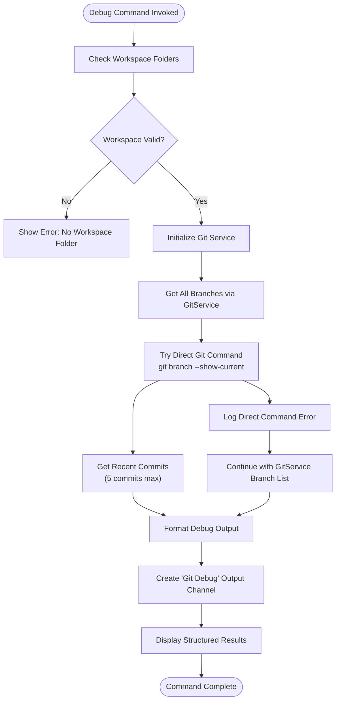
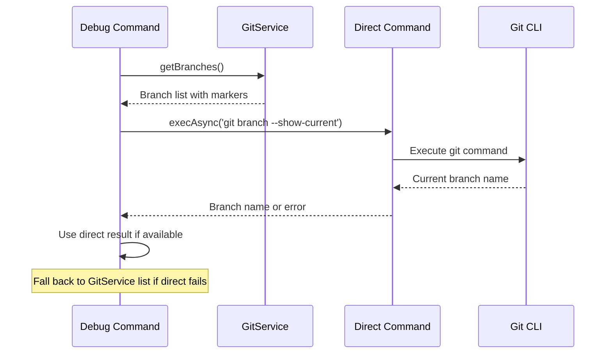
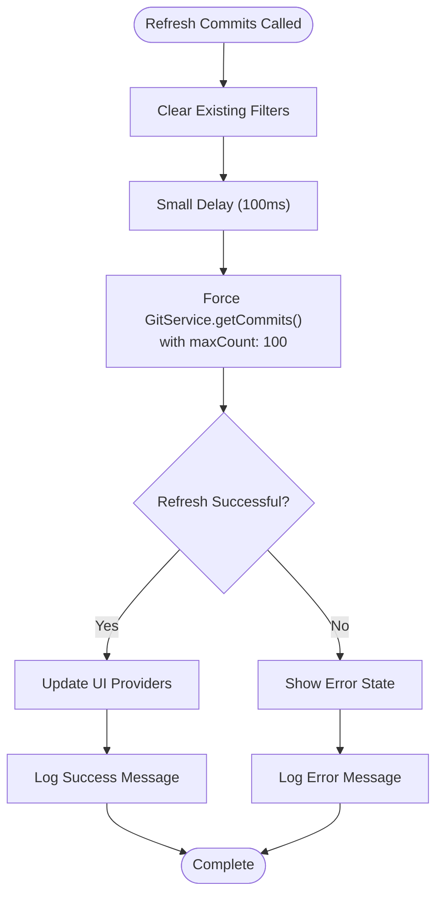
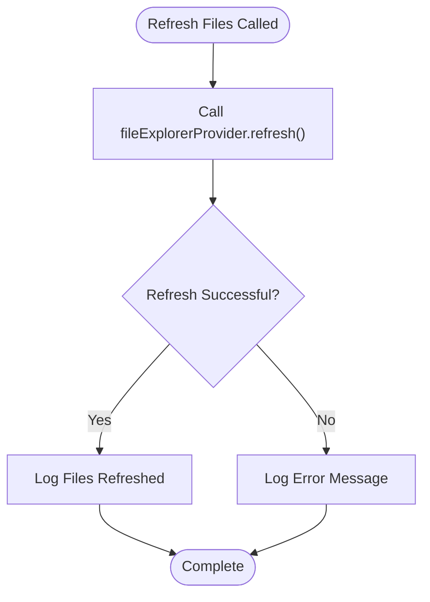
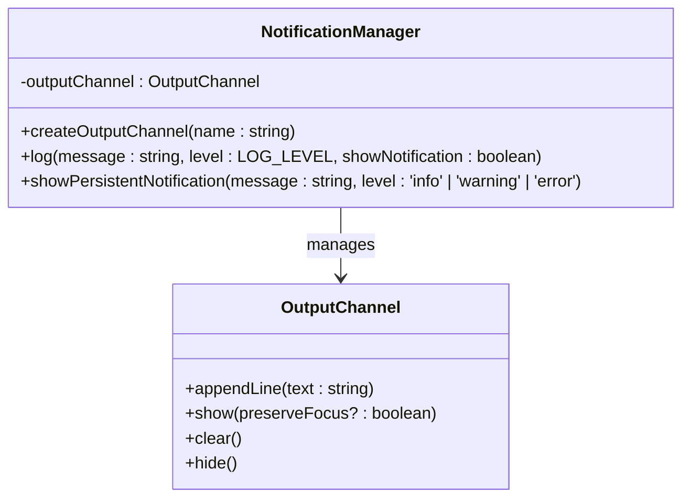
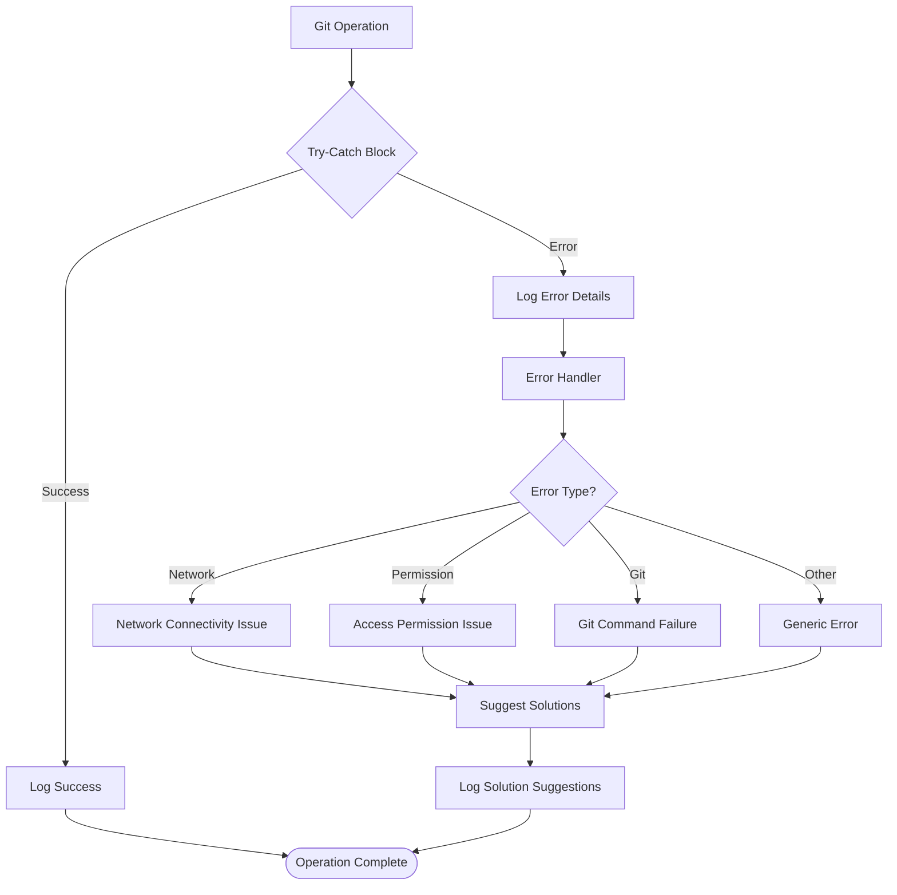

# Debug Commands

<cite>
**Referenced Files in This Document**
- [extension.ts](file://src/extension.ts)
- [gitService.ts](file://src/services/git/gitService.ts)
- [notificationManager.ts](file://src/services/notification/notificationManager.ts)
- [logger.ts](file://src/utils/logger.ts)
- [constants.ts](file://src/constants/constants.ts)
- [package.json](file://package.json)
</cite>

## Table of Contents
1. [Introduction](#introduction)
2. [Available Debug Commands](#available-debug-commands)
3. [CodeKarmic.DebugGit Command](#codekarmicdebuggit-command)
4. [Related Debug Commands](#related-debug-commands)
5. [Debug Output Channel](#debug-output-channel)
6. [Error Handling and Diagnostics](#error-handling-and-diagnostics)
7. [Troubleshooting Scenarios](#troubleshooting-scenarios)
8. [Best Practices](#best-practices)
9. [Conclusion](#conclusion)

## Introduction

CodeKarmic provides a comprehensive suite of debug commands designed to help developers diagnose and troubleshoot Git-related issues within Visual Studio Code. These commands offer detailed insights into repository state, Git connectivity, and UI synchronization problems, making them invaluable tools for development teams working with Git repositories.

The debug functionality is built around three primary commands: `codekarmic.debugGit`, `codekarmic.refreshCommits`, and `codekarmic.refreshFiles`, each serving specific diagnostic purposes and providing structured output for problem identification.

## Available Debug Commands

CodeKarmic offers several debug commands that can be accessed through the VS Code Command Palette (`Ctrl+Shift+P` or `Cmd+Shift+P`):

| Command | Purpose | Access Method |
|---------|---------|---------------|
| `codekarmic.debugGit` | Comprehensive Git repository diagnostics | Command Palette → Type "Debug Git" |
| `codekarmic.refreshCommits` | Force refresh commit history | Right-click → Refresh Commits |
| `codekarmic.refreshFiles` | Refresh file explorer view | Right-click → Refresh Files |

These commands are registered in the extension manifest and activated through various triggers including startup events and manual invocation.

**Section sources**
- [package.json](file://package.json#L111-L116)
- [extension.ts](file://src/extension.ts#L291-L336)

## CodeKarmic.DebugGit Command

The `codekarmic.debugGit` command is the primary diagnostic tool for Git repository issues. It implements sophisticated functionality to gather comprehensive Git repository information and present it in a structured, readable format.

### Implementation Architecture

The debug command follows a multi-layered approach combining GitService methods with direct Git command execution for maximum reliability:



**Diagram sources**
- [extension.ts](file://src/extension.ts#L609-L660)

### Core Functionality

The [`debugGitFunctionality`](file://src/extension.ts#L609-L660) function orchestrates the diagnostic process:

1. **Workspace Validation**: Ensures a valid workspace folder is available
2. **Git Service Initialization**: Sets up the Git service with the repository path
3. **Branch Detection**: Retrieves all branches using GitService methods
4. **Current Branch Identification**: Attempts direct Git command execution for accurate current branch detection
5. **Commit History**: Fetches recent commits for repository state verification
6. **Structured Output**: Formats comprehensive debug information

### Branch Detection Strategy

The command employs a dual approach for current branch detection:



**Diagram sources**
- [extension.ts](file://src/extension.ts#L624-L629)

This strategy ensures robust branch detection even when Git CLI accessibility varies across environments.

**Section sources**
- [extension.ts](file://src/extension.ts#L609-L660)
- [gitService.ts](file://src/services/git/gitService.ts#L278-L308)

## Related Debug Commands

### CodeKarmic.RefreshCommits Command

The [`codekarmic.refreshCommits`](file://src/extension.ts#L295-L324) command addresses UI synchronization issues by forcing a refresh of commit data:



**Diagram sources**
- [extension.ts](file://src/extension.ts#L295-L324)

### CodeKarmic.RefreshFiles Command

The [`codekarmic.refreshFiles`](file://src/extension.ts#L326-L336) command handles file explorer synchronization issues:



**Diagram sources**
- [extension.ts](file://src/extension.ts#L326-L336)

**Section sources**
- [extension.ts](file://src/extension.ts#L295-L336)

## Debug Output Channel

CodeKarmic creates a dedicated output channel named "Git Debug" to display structured debug information. This channel serves as the primary interface for debug command output.

### Channel Management

The output channel is managed through the NotificationManager system:



**Diagram sources**
- [notificationManager.ts](file://src/services/notification/notificationManager.ts#L8-L21)

### Output Format Structure

The debug output follows a consistent, hierarchical format:

```
Git Debug Information:
---------------------
Repository Path: /path/to/repository
Current Branch: main

Branches:
* main
  develop
  feature/new-ui
  hotfix/security-patch

Recent Commits:
abc1234 - 2024-01-15 14:30:22 - Fix bug in authentication
def5678 - 2024-01-15 13:45:10 - Add user profile page
ghi9012 - 2024-01-15 12:15:30 - Update dependencies
jkl3456 - 2024-01-14 16:20:45 - Refactor payment processing
mno7890 - 2024-01-14 10:30:15 - Add analytics tracking
```

### Logging Levels and Error Reporting

The debug system supports multiple logging levels with appropriate error reporting mechanisms:

| Level | Purpose | Error Handling |
|-------|---------|----------------|
| DEBUG | Development debugging | Console output only |
| INFO | General information | Output channel + notification |
| WARNING | Non-critical issues | Output channel + warning notification |
| ERROR | Critical failures | Output channel + error notification |

**Section sources**
- [extension.ts](file://src/extension.ts#L650-L655)
- [notificationManager.ts](file://src/services/notification/notificationManager.ts#L79-L121)

## Error Handling and Diagnostics

CodeKarmic implements comprehensive error handling across all debug commands to ensure reliable operation and meaningful error reporting.

### Multi-Level Error Handling



### Specific Error Scenarios

The debug system handles various error conditions:

1. **Missing Workspace Folders**: Gracefully reports when no workspace is open
2. **Invalid Repository Paths**: Detects and reports non-existent or invalid paths
3. **Missing .git Directories**: Identifies repositories without Git initialization
4. **Git Command Failures**: Provides fallback methods and detailed error messages
5. **Permission Issues**: Handles access restrictions and suggests solutions

### Diagnostic Information Collection

Each debug command collects specific diagnostic information:

| Command | Collected Data | Error Indicators |
|---------|----------------|------------------|
| debugGit | Repository path, branches, commits | Path validity, Git presence, branch detection |
| refreshCommits | Commit cache state, filter status | Cache corruption, network issues |
| refreshFiles | File explorer state, provider status | Provider errors, file system issues |

**Section sources**
- [extension.ts](file://src/extension.ts#L656-L659)
- [gitService.ts](file://src/services/git/gitService.ts#L64-L195)

## Troubleshooting Scenarios

### Scenario 1: Incorrect Repository Path

**Symptoms:**
- Debug output shows unexpected repository path
- Git commands fail with path errors
- Branch detection returns "Unknown"

**Diagnosis Steps:**
1. Run `codekarmic.debugGit` to verify repository path
2. Check workspace folder selection in VS Code
3. Verify `.git` directory existence

**Resolution:**
- Close current workspace and reopen correct repository
- Use VS Code's "Open Folder" command to select proper directory
- Verify Git installation and PATH configuration

### Scenario 2: Missing .git Directory

**Symptoms:**
- "Not a git repository" error messages
- Branch detection fails
- Commit history unavailable

**Diagnosis Steps:**
1. Examine debug output for repository path
2. Verify `.git` directory presence
3. Check Git installation

**Resolution:**
- Initialize Git repository: `git init`
- Clone repository from remote source
- Verify Git installation and PATH

### Scenario 3: Git Command Execution Failures

**Symptoms:**
- Direct Git command errors in debug output
- Branch detection falls back to GitService list
- Commit fetching timeouts

**Diagnosis Steps:**
1. Test Git CLI availability: `git --version`
2. Check Git executable permissions
3. Verify repository accessibility

**Resolution:**
- Reinstall Git with proper PATH configuration
- Check file system permissions
- Verify repository integrity with `git fsck`

### Scenario 4: UI Synchronization Issues

**Symptoms:**
- Outdated commit lists
- Stale file explorer state
- Missing recent changes

**Diagnosis Steps:**
1. Run `codekarmic.refreshCommits` and observe results
2. Run `codekarmic.refreshFiles` and check for errors
3. Monitor output channel for error messages

**Resolution:**
- Use refresh commands to force updates
- Restart VS Code if issues persist
- Check for extension conflicts

### Scenario 5: Network Connectivity Issues

**Symptoms:**
- Remote repository operations fail
- Authentication prompts appear unexpectedly
- Slow response times

**Diagnosis Steps:**
1. Test internet connectivity
2. Verify proxy settings
3. Check SSH keys and credentials

**Resolution:**
- Configure proxy settings if behind firewall
- Update SSH keys and authentication
- Use HTTPS instead of SSH if needed

## Best Practices

### Effective Debug Command Usage

1. **Start with Basic Diagnosis**: Always begin with `codekarmic.debugGit` to establish baseline information
2. **Systematic Approach**: Use refresh commands systematically when UI appears out of sync
3. **Output Channel Monitoring**: Regularly check the "Git Debug" output channel for error messages
4. **Workspace Verification**: Ensure correct workspace folder is open before running diagnostics

### Preventive Measures

1. **Regular Refreshes**: Periodically use refresh commands to maintain UI synchronization
2. **Error Monitoring**: Pay attention to error messages in the output channel
3. **Environment Consistency**: Maintain consistent Git and VS Code configurations across development machines
4. **Backup Strategies**: Regularly backup repository state and configuration

### Integration with Development Workflow

1. **Pre-Commit Diagnostics**: Run debug commands before major Git operations
2. **Issue Investigation**: Use debug output as first step in troubleshooting Git-related issues
3. **Team Collaboration**: Share debug output when reporting Git-related problems
4. **Automated Testing**: Incorporate debug command usage in CI/CD pipeline diagnostics

## Conclusion

CodeKarmic's debug commands provide a comprehensive toolkit for diagnosing and resolving Git-related issues in Visual Studio Code. The `codekarmic.debugGit` command offers detailed repository diagnostics, while `codekarmic.refreshCommits` and `codekarmic.refreshFiles` address UI synchronization challenges.

The debug system's multi-layered approach, combining GitService methods with direct Git command execution, ensures robust operation across diverse development environments. The structured output format and comprehensive error handling make these commands invaluable tools for both individual developers and development teams.

By leveraging these debug commands effectively, developers can quickly identify and resolve Git connectivity issues, maintain UI synchronization, and ensure smooth development workflows. The integrated output channel system provides clear, actionable diagnostic information that facilitates efficient problem resolution.