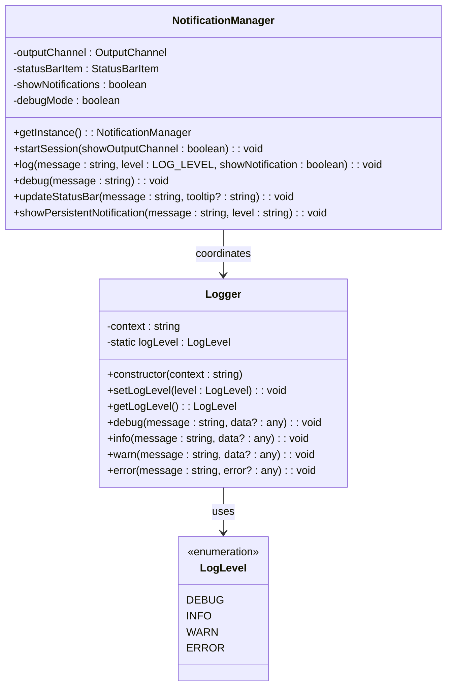
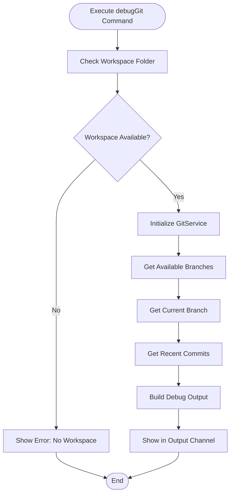

# Debugging Tools

<cite>
**Referenced Files in This Document**
- [logger.ts](file://src/utils/logger.ts)
- [notificationManager.ts](file://src/services/notification/notificationManager.ts)
- [gitService.ts](file://src/services/git/gitService.ts)
- [aiService.ts](file://src/services/ai/aiService.ts)
- [extension.ts](file://src/extension.ts)
- [appConfig.ts](file://src/config/appConfig.ts)
- [constants.ts](file://src/constants/constants.ts)
- [package.json](file://package.json)
</cite>

## Table of Contents
1. [Introduction](#introduction)
2. [Logger System Architecture](#logger-system-architecture)
3. [LogLevel Enum and Severity Levels](#loglevel-enum-and-severity-levels)
4. [Diagnostic Logging System](#diagnostic-logging-system)
5. [Debug Commands](#debug-commands)
6. [Log Configuration and Filtering](#log-configuration-and-filtering)
7. [Custom Logging Implementation](#custom-logging-implementation)
8. [Interpreting Log Messages](#interpreting-log-messages)
9. [Debug Mode and Development Tools](#debug-mode-and-development-tools)
10. [Troubleshooting Guide](#troubleshooting-guide)

## Introduction

CodeKarmic provides a comprehensive debugging and logging framework designed to help developers diagnose issues, monitor application behavior, and troubleshoot problems during Git code reviews. The debugging system consists of multiple layers including a centralized logger, notification manager, debug commands, and development tools that work together to provide detailed insights into the extension's operation.

The debugging infrastructure supports multiple log levels, contextual logging, real-time notifications, and specialized debugging commands that aid in diagnosing Git integration issues, AI service problems, and general extension functionality.

## Logger System Architecture

CodeKarmic implements a sophisticated logging system built around the `Logger` class and `NotificationManager`, providing consistent logging across the entire application with support for different contexts and severity levels.



**Diagram sources**
- [logger.ts](file://src/utils/logger.ts#L8-L88)
- [notificationManager.ts](file://src/services/notification/notificationManager.ts#L8-L213)

**Section sources**
- [logger.ts](file://src/utils/logger.ts#L1-L88)
- [notificationManager.ts](file://src/services/notification/notificationManager.ts#L1-L213)

## LogLevel Enum and Severity Levels

The logging system uses a hierarchical LogLevel enum that controls which messages are displayed based on their severity:

| Level | Value | Purpose | Usage Pattern |
|-------|-------|---------|---------------|
| DEBUG | 0 | Detailed diagnostic information | Development and troubleshooting |
| INFO | 1 | General informational messages | Normal operation tracking |
| WARN | 2 | Warning conditions | Potential issues that don't prevent operation |
| ERROR | 3 | Error conditions | Failures and exceptions |

### Log Level Configuration

The global log level can be controlled programmatically using static methods:

```typescript
// Set global log level to DEBUG (shows all messages)
Logger.setLogLevel(LogLevel.DEBUG);

// Get current log level
const currentLevel = Logger.getLogLevel();

// Context-specific logging with automatic filtering
const logger = new Logger('GitService');
logger.debug('Initializing Git repository'); // Only shown if log level ≤ DEBUG
logger.info('Repository initialized successfully'); // Only shown if log level ≤ INFO
logger.warn('Slow operation detected'); // Only shown if log level ≤ WARN
logger.error('Operation failed', errorObject); // Only shown if log level ≤ ERROR
```

**Section sources**
- [logger.ts](file://src/utils/logger.ts#L8-L43)
- [constants.ts](file://src/constants/constants.ts#L8-L28)

## Diagnostic Logging System

CodeKarmic implements a multi-layered diagnostic logging system that provides comprehensive visibility into application behavior across different components.

### Component-Specific Logging

Different services implement specialized logging patterns:

#### GitService Diagnostic Logging

The GitService uses internal logging methods for debugging Git operations:

```typescript
// Internal debug logging with timestamps
private logDebug(message: string, data?: any): void {
    if (process.env['NODE_ENV'] === 'development') {
        const timestamp = new Date().toISOString();
        console.debug(`[CodeKarmic][${timestamp}] DEBUG: ${message}`, 
                     data ? JSON.stringify(data, null, 2) : '');
    }
}

// Error logging with context
private logError(error: Error, context: string): void {
    const notificationManager = NotificationManager.getInstance();
    notificationManager.log(`${context}: ${error.message}`, 'error', true);
    notificationManager.log(`${OUTPUT.COMMON.MSG_DETAILS} ${error.stack || 'No stack trace'}`, 'error', false);
}
```

#### AIService Performance Logging

The AI service implements detailed performance monitoring:

```typescript
// Performance timing for critical operations
console.time('PERF: generateDiffContent - Total');
console.time('PERF: generateDiffContent - VS Code Git API');
console.time('PERF: generateDiffContent - getFileDiff');

// Progress tracking for long-running operations
notificationManager.log(`(1/5) Preparing file analysis...`, 'info', false);
notificationManager.log(`(2/5) Building analysis prompt...`, 'info', false);
notificationManager.log(`(3/5) Sending AI analysis request...`, 'info', true);
```

**Section sources**
- [gitService.ts](file://src/services/git/gitService.ts#L1186-L1199)
- [aiService.ts](file://src/services/ai/aiService.ts#L125-L140)
- [aiService.ts](file://src/services/ai/aiService.ts#L282-L300)

## Debug Commands

CodeKarmic provides several specialized debug commands that help diagnose and troubleshoot extension functionality.

### codekarmic.debugGit Command

The primary debugging command for Git-related issues:



**Diagram sources**
- [extension.ts](file://src/extension.ts#L609-L660)

#### Debug Output Format

The `codekarmic.debugGit` command generates structured debug information:

```
Git Debug Information:
---------------------
Repository Path: /path/to/repository
Current Branch: main

Branches:
* main
  develop
  feature/new-ui

Recent Commits:
abc1234 - 2024-01-15 10:30:25 - Fix bug in authentication
def5678 - 2024-01-14 14:22:10 - Add user profile page
ghi9012 - 2024-01-13 09:45:30 - Initial commit
```

### Command Registration and Activation

Debug commands are registered in the extension's activation events:

```typescript
// Package.json command registration
{
  "command": "codekarmic.debugGit",
  "title": "Debug Git Functionality",
  "category": "CodeKarmic",
  "icon": "$(debug)"
}
```

**Section sources**
- [extension.ts](file://src/extension.ts#L609-L660)
- [package.json](file://package.json#L112-L116)

## Log Configuration and Filtering

CodeKarmic provides flexible log configuration through VS Code settings and programmatic control.

### VS Code Configuration

Users can configure logging behavior through the extension settings:

| Setting | Type | Default | Description |
|---------|------|---------|-------------|
| `codekarmic.logLevel` | string | "INFO" | Minimum log level to display |
| `codekarmic.debugMode` | boolean | false | Enable debug mode for additional output |

### Programmatic Configuration

The `AppConfig` class manages configuration changes and provides event-driven updates:

```typescript
// Get current log level configuration
const logLevel = vscode.workspace.getConfiguration('codekarmic').get<string>('logLevel', 'INFO');

// Set log level programmatically
Logger.setLogLevel(LogLevel.DEBUG);

// Monitor configuration changes
appConfig.onChange(ConfigChangeEvent.LOG_LEVEL, () => {
    const newLogLevel = appConfig.getLogLevel();
    Logger.setLogLevel(newLogLevel);
});
```

### Log Level Comparison

The system uses numeric comparison for efficient log filtering:

```typescript
// Log level comparison logic
if (Logger.logLevel <= LogLevel.DEBUG) {
    console.debug(`[${this.context}] ${message}`, data !== undefined ? data : '');
}

// Configuration-based filtering
const configuredLogLevel = vscode.workspace.getConfiguration('codekarmic')
    .get<string>('logLevel', DEFAULT_LOG_LEVEL);

if (LOG_LEVEL[level] >= LOG_LEVEL[configuredLogLevel as keyof typeof LOG_LEVEL]) {
    // Show notification
}
```

**Section sources**
- [appConfig.ts](file://src/config/appConfig.ts#L1-L189)
- [constants.ts](file://src/constants/constants.ts#L1-L33)

## Custom Logging Implementation

Developers can implement custom logging in extensions by leveraging CodeKarmic's logging infrastructure.

### Creating Context-Specific Loggers

```typescript
// Create a logger with specific context
const myLogger = new Logger('MyCustomService');

// Use different log levels
myLogger.debug('Detailed operation information');
myLogger.info('Operation completed successfully');
myLogger.warn('Potential performance issue detected');
myLogger.error('Operation failed', errorObject);
```

### Integrating with NotificationManager

```typescript
// Access the notification manager for unified logging
const notificationManager = NotificationManager.getInstance();

// Log with notification display
notificationManager.log('Processing completed', 'info', true);

// Debug logging for development
notificationManager.debug('Debug information for development');
```

### Best Practices for Custom Logging

1. **Use appropriate log levels**: DEBUG for development details, INFO for operational events, WARN for potential issues, ERROR for failures
2. **Include context**: Use meaningful logger contexts that identify the source of the log
3. **Structure error messages**: Include error objects and stack traces for debugging
4. **Avoid excessive logging**: Balance verbosity with performance impact

**Section sources**
- [logger.ts](file://src/utils/logger.ts#L18-L88)
- [notificationManager.ts](file://src/services/notification/notificationManager.ts#L79-L121)

## Interpreting Log Messages

Understanding CodeKarmic log messages helps in diagnosing issues effectively.

### Log Message Format

Standard log messages follow this format:
```
[HH:MM:SS] [LEVEL] [Context] Message [Optional Data]
```

### Common Log Patterns

#### Git Service Logs
```
[10:30:25] [INFO] [GitService] Repository initialized successfully
[10:30:26] [DEBUG] [GitService] Getting branches...
[10:30:27] [WARN] [GitService] Slow operation detected: branch listing took 2.3s
[10:30:28] [ERROR] [GitService] Failed to get commits: Network timeout
```

#### AI Service Logs
```
[10:30:30] [INFO] [AIService] Starting code review for /src/main.ts
[10:30:31] [DEBUG] [AIService] Generating diff content...
[10:30:35] [INFO] [AIService] AI analysis completed in 4.2s
[10:30:36] [ERROR] [AIService] API request failed: Rate limit exceeded
```

#### Extension Logs
```
[10:30:40] [INFO] [Extension] CodeKarmic activated
[10:30:41] [DEBUG] [Extension] Loading configuration...
[10:30:42] [INFO] [Extension] API key validated successfully
```

### Performance Monitoring

The system tracks performance metrics for critical operations:

```
PERF: generateDiffContent - Total: 1500ms
PERF: generateDiffContent - VS Code Git API: 800ms
PERF: generateDiffContent - getFileDiff: 700ms
```

**Section sources**
- [gitService.ts](file://src/services/git/gitService.ts#L1186-L1199)
- [aiService.ts](file://src/services/ai/aiService.ts#L125-L140)

## Debug Mode and Development Tools

CodeKarmic includes several development-focused tools and debug modes for troubleshooting.

### Development Environment Detection

```typescript
// Debug mode detection
private debugMode: boolean = process.env['NODE_ENV'] === 'development';

// Conditional logging for development
public debug(message: string): void {
    if (this.debugMode) {
        const timestamp = new Date().toISOString();
        console.log(`[CodeKarmic Debug][${timestamp}] ${message}`);
    }
}
```

### Console Debug Output

The system provides structured console output for development:

```typescript
// Git service debug output
if (process.env['NODE_ENV'] === 'development') {
    const timestamp = new Date().toISOString();
    console.debug(`[CodeKarmic][${timestamp}] DEBUG: ${message}`, data);
}

// Performance timing
console.time('operation-name');
// ... operation code ...
console.timeEnd('operation-name');
```

### Output Channel Management

The `NotificationManager` creates and manages output channels:

```typescript
// Create output channel
this.outputChannel = vscode.window.createOutputChannel('CodeKarmic');

// Show output channel
this.outputChannel.show(true);

// Clear output channel
this.outputChannel.clear();
```

**Section sources**
- [notificationManager.ts](file://src/services/notification/notificationManager.ts#L12-L18)
- [notificationManager.ts](file://src/services/notification/notificationManager.ts#L123-L128)

## Troubleshooting Guide

Common debugging scenarios and solutions for CodeKarmic issues.

### Git Integration Issues

**Problem**: Git commands fail or return unexpected results
**Solution**: Use the debugGit command to diagnose:

1. Execute `codekarmic.debugGit` command
2. Check repository path and branch information
3. Verify Git installation and permissions
4. Review recent commit history and branch status

### AI Service Problems

**Problem**: Code review fails or returns incorrect results
**Solution**: Check AI service logs:

1. Verify API key configuration
2. Check network connectivity
3. Review AI model selection
4. Monitor performance metrics

### Performance Issues

**Problem**: Slow operation or timeouts
**Solution**: Enable debug mode and monitor:

1. Enable debug mode in settings
2. Check performance timing logs
3. Monitor memory usage
4. Review concurrent operation limits

### Configuration Problems

**Problem**: Extension doesn't start or behaves unexpectedly
**Solution**: Verify configuration:

1. Check API key validity
2. Verify model type selection
3. Review file exclusion patterns
4. Check workspace folder access

### Log Analysis Checklist

When analyzing logs for issues:

1. **Check log levels**: Ensure appropriate log level is set
2. **Look for errors**: Scan for ERROR level messages
3. **Monitor warnings**: Pay attention to WARN level messages
4. **Track performance**: Look for slow operation indicators
5. **Verify context**: Ensure logs come from expected components

**Section sources**
- [extension.ts](file://src/extension.ts#L609-L660)
- [notificationManager.ts](file://src/services/notification/notificationManager.ts#L79-L121)