# Diagnostic Workflows

<cite>
**Referenced Files in This Document**   
- [logger.ts](file://src/utils/logger.ts)
- [notificationManager.ts](file://src/services/notification/notificationManager.ts)
- [appConfig.ts](file://src/config/appConfig.ts)
- [extension.ts](file://src/extension.ts)
- [aiService.ts](file://src/services/ai/aiService.ts)
- [gitService.ts](file://src/services/git/gitService.ts)
- [reviewManager.ts](file://src/services/review/reviewManager.ts)
- [constants.ts](file://src/constants/constants.ts)
</cite>

## Table of Contents
1. [Introduction](#introduction)
2. [Diagnostic Architecture](#diagnostic-architecture)
3. [Core Diagnostic Components](#core-diagnostic-components)
4. [End-to-End Diagnostic Process](#end-to-end-diagnostic-process)
5. [Error Handling and User Communication](#error-handling-and-user-communication)
6. [Troubleshooting Common Issues](#troubleshooting-common-issues)
7. [Diagnostic Workflow Examples](#diagnostic-workflow-examples)
8. [Conclusion](#conclusion)

## Introduction

CodeKarmic provides a comprehensive diagnostic system that combines logging, notifications, and debugging tools to help users identify and resolve issues efficiently. The diagnostic workflow is designed to provide actionable information to users while preserving detailed technical context for developers. This document explains the end-to-end diagnostic process, from enabling debug mode to analyzing logs and resolving common issues.

The system uses a multi-layered approach to diagnostics, with user-friendly notifications in the VS Code interface and detailed technical logs in the console. This dual approach ensures that users can quickly understand and resolve issues without needing to interpret complex technical information, while developers have access to comprehensive debugging data when needed.

**Section sources**
- [notificationManager.ts](file://src/services/notification/notificationManager.ts#L1-L213)
- [logger.ts](file://src/utils/logger.ts#L1-L88)

## Diagnostic Architecture

The diagnostic architecture in CodeKarmic consists of three main components: the Logger, NotificationManager, and configuration system. These components work together to provide a cohesive diagnostic experience that balances user-friendliness with technical depth.

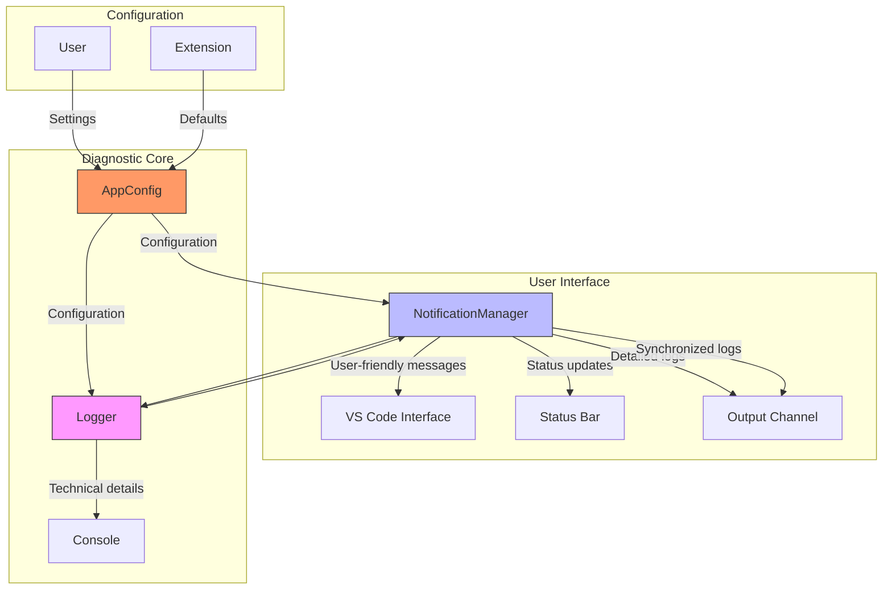

**Diagram sources **
- [logger.ts](file://src/utils/logger.ts#L8-L88)
- [notificationManager.ts](file://src/services/notification/notificationManager.ts#L8-L213)
- [appConfig.ts](file://src/config/appConfig.ts#L49-L188)

**Section sources**
- [logger.ts](file://src/utils/logger.ts#L1-L88)
- [notificationManager.ts](file://src/services/notification/notificationManager.ts#L1-L213)
- [appConfig.ts](file://src/config/appConfig.ts#L1-L188)

## Core Diagnostic Components

### Logger System

The Logger system provides consistent logging functionality throughout the application with support for different log levels and contexts. It uses a static log level that controls which messages are displayed, allowing users to filter the amount of information shown.

The Logger class supports four log levels: DEBUG, INFO, WARN, and ERROR, with corresponding methods for each level. Each logger instance is created with a context parameter that identifies the source of the log message, making it easier to trace issues to specific components.

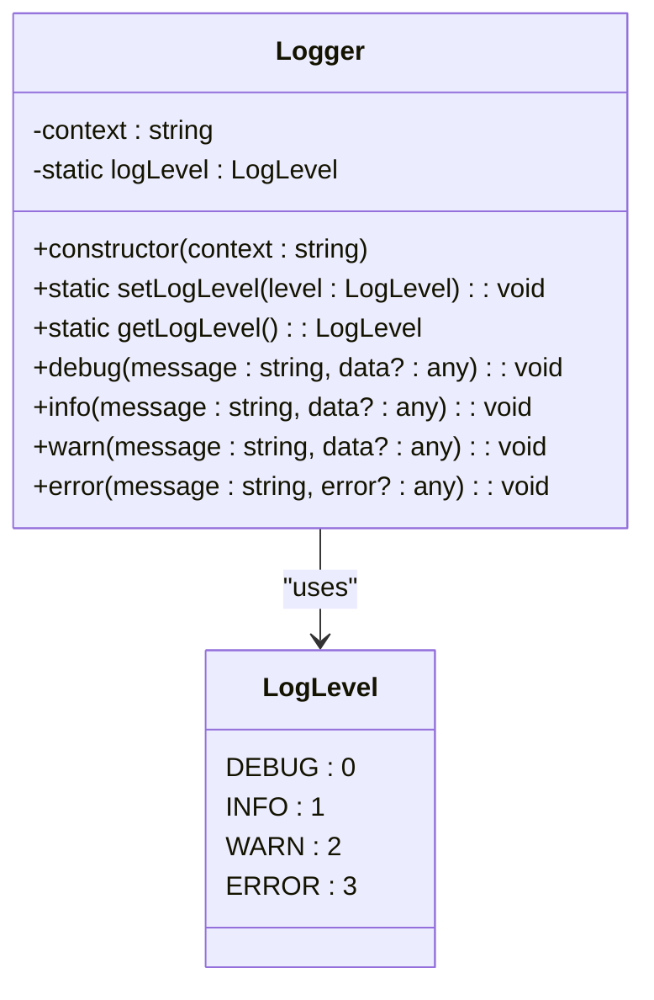

**Diagram sources **
- [logger.ts](file://src/utils/logger.ts#L8-L88)

**Section sources**
- [logger.ts](file://src/utils/logger.ts#L1-L88)

### Notification Manager

The NotificationManager is responsible for managing notifications, the status bar, and the output panel in VS Code. It serves as the primary interface between the extension and the user, providing both real-time feedback through notifications and detailed information in the output channel.

The NotificationManager synchronizes its logs with the console logs, ensuring that all diagnostic information is available in multiple locations. It supports different message types (info, warning, error) and can display bilingual messages to accommodate users of different languages.

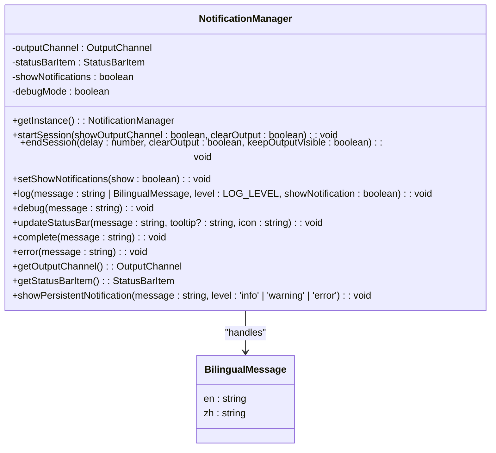

**Diagram sources **
- [notificationManager.ts](file://src/services/notification/notificationManager.ts#L8-L213)

**Section sources**
- [notificationManager.ts](file://src/services/notification/notificationManager.ts#L1-L213)

### Configuration System

The configuration system in CodeKarmic is managed by the AppConfig class, which provides centralized access to all application settings. It supports event-based notification for configuration changes, allowing components to react immediately to changes in settings.

The configuration system stores key diagnostic settings such as the log level, API key, base URL, and model type. These settings can be modified by users through the VS Code settings interface or programmatically by the extension itself.

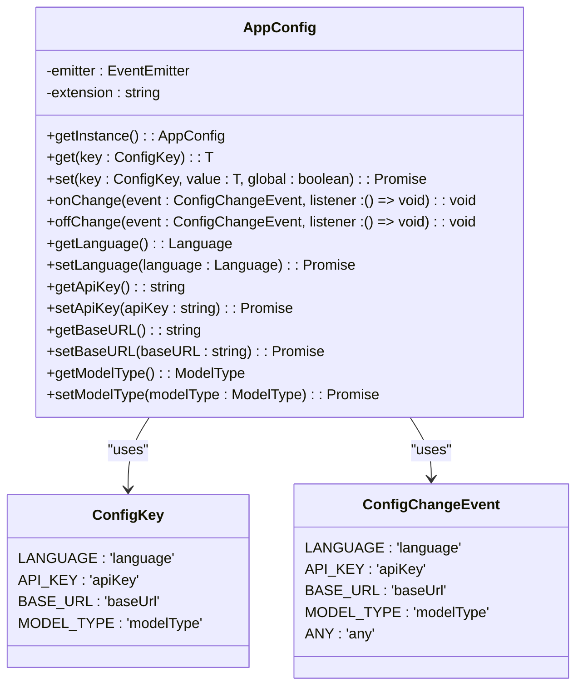

**Diagram sources **
- [appConfig.ts](file://src/config/appConfig.ts#L49-L188)

**Section sources**
- [appConfig.ts](file://src/config/appConfig.ts#L1-L188)

## End-to-End Diagnostic Process

### Enabling Debug Mode

The diagnostic process begins with enabling debug mode through the logger configuration. Users can adjust the log level in the extension settings to control the verbosity of the diagnostic output. The default log level is INFO, but users can set it to DEBUG to see more detailed information.

When debug mode is enabled, the NotificationManager sets its debugMode flag based on the NODE_ENV environment variable, allowing developers to see additional debug messages in the console during development.

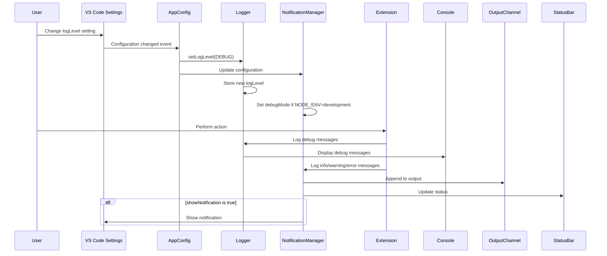

**Diagram sources **
- [appConfig.ts](file://src/config/appConfig.ts#L58-L77)
- [logger.ts](file://src/utils/logger.ts#L34-L36)
- [notificationManager.ts](file://src/services/notification/notificationManager.ts#L18-L19)

**Section sources**
- [appConfig.ts](file://src/config/appConfig.ts#L1-L188)
- [logger.ts](file://src/utils/logger.ts#L1-L88)
- [notificationManager.ts](file://src/services/notification/notificationManager.ts#L1-L213)

### Diagnostic Commands

CodeKarmic provides several diagnostic commands that users can run to gather system information and troubleshoot issues. These commands are accessible through the VS Code command palette and provide targeted diagnostic capabilities.

The `codekarmic.debugGit` command is particularly useful for diagnosing Git-related issues. It collects information about the repository path, current branch, available branches, and recent commits, displaying this information in a dedicated output channel.

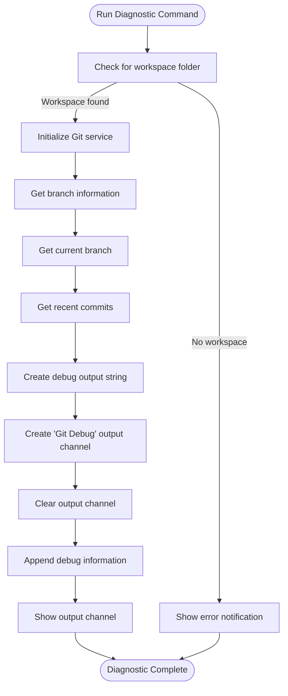

**Diagram sources **
- [extension.ts](file://src/extension.ts#L609-L659)

**Section sources**
- [extension.ts](file://src/extension.ts#L20-L664)

## Error Handling and User Communication

### Synchronized Logging

CodeKarmic implements a synchronized logging system where NotificationManager logs are coordinated with console logs. When a message is logged through the NotificationManager, it appears in the output channel with a timestamp and log level, while the same information (or a user-friendly version) appears in the console.

The logging system handles bilingual messages by storing both English and Chinese versions, displaying the appropriate version based on the user's language settings while including both in the logs for clarity.

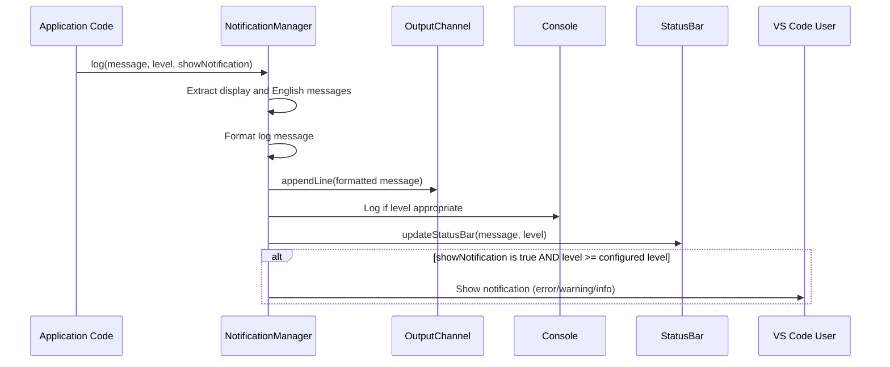

**Diagram sources **
- [notificationManager.ts](file://src/services/notification/notificationManager.ts#L79-L121)

**Section sources**
- [notificationManager.ts](file://src/services/notification/notificationManager.ts#L1-L213)

### User-Friendly Error Messages

The diagnostic system is designed to provide user-friendly error messages in notifications while preserving detailed technical information in the console. When an error occurs, the NotificationManager displays a concise, actionable message to the user, while the console contains the full error details including stack traces.

For example, when an API key is not configured, users see a notification suggesting they configure the API key, while the console contains detailed information about the error context and stack trace.

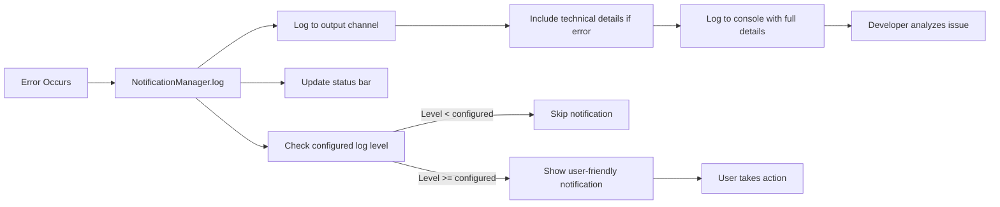

**Diagram sources **
- [notificationManager.ts](file://src/services/notification/notificationManager.ts#L104-L117)

**Section sources**
- [notificationManager.ts](file://src/services/notification/notificationManager.ts#L1-L213)

## Troubleshooting Common Issues

### API Key Configuration Problems

One of the most common issues users encounter is API key configuration problems. The diagnostic workflow for this issue follows a clear pattern:

1. Check notification messages for API key warnings
2. Enable debug logging to see detailed initialization information
3. Run diagnostic commands to verify configuration
4. Analyze logs to identify the root cause

When the extension activates, it checks for the API key configuration and displays a warning notification if the key is missing. Users can then configure the key through the notification or settings.

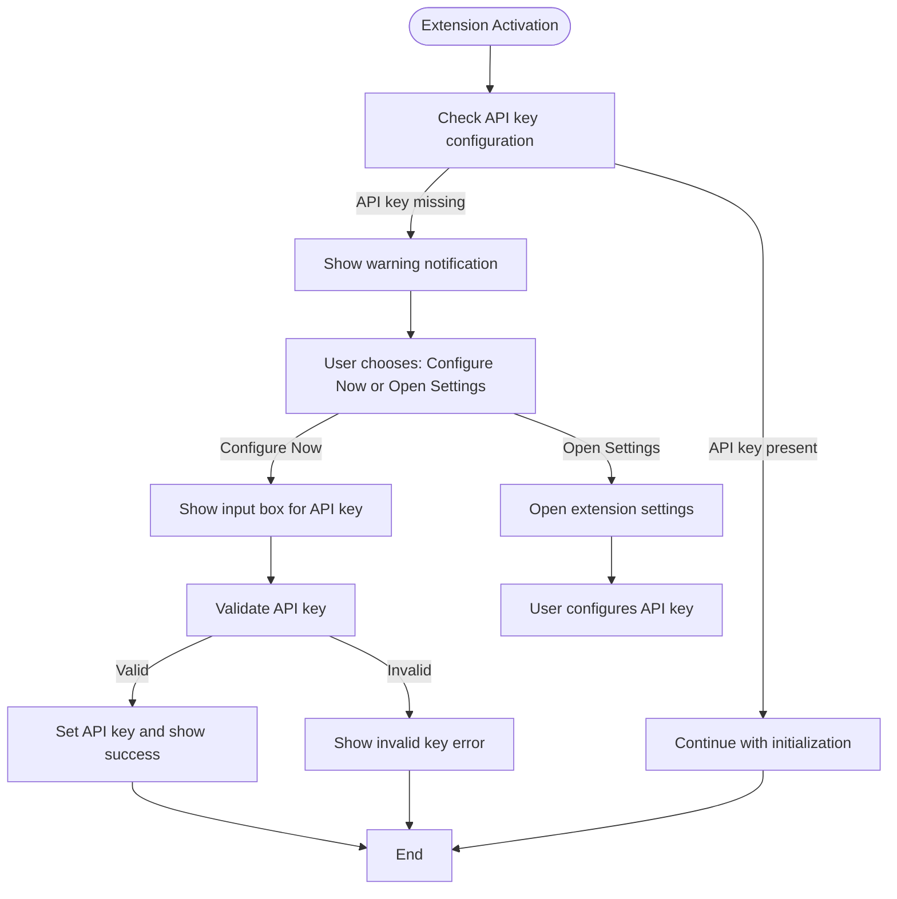

**Diagram sources **
- [extension.ts](file://src/extension.ts#L37-L65)

**Section sources**
- [extension.ts](file://src/extension.ts#L1-L920)

### Git Repository Detection Failures

Git repository detection failures occur when the extension cannot find a .git directory in the workspace. The diagnostic workflow for this issue includes:

1. Check notification messages for "Not a Git repository" error
2. Verify workspace folder is open
3. Confirm .git directory exists in project root
4. Use debugGit command to gather repository information

The system checks for the presence of a .git directory and displays an appropriate error message if it's not found, guiding users to initialize a Git repository or open the correct folder.

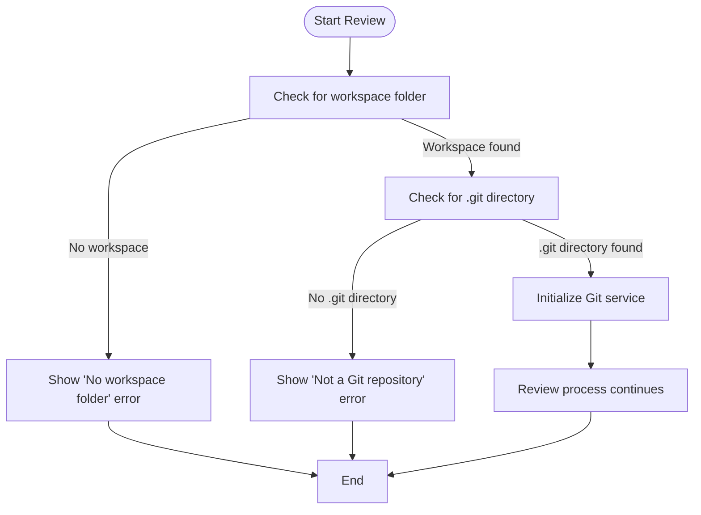

**Diagram sources **
- [extension.ts](file://src/extension.ts#L119-L121)

**Section sources**
- [extension.ts](file://src/extension.ts#L102-L139)

### AI Service Connectivity Issues

AI service connectivity issues can occur due to network problems, invalid API keys, or service outages. The diagnostic workflow for these issues includes:

1. Check notification messages for AI service errors
2. Verify API key is correctly configured
3. Check network connectivity
4. Enable debug logging to see request details
5. Analyze console logs for error patterns

The system implements retry logic for network requests and provides specific error messages to help users identify the cause of connectivity problems.

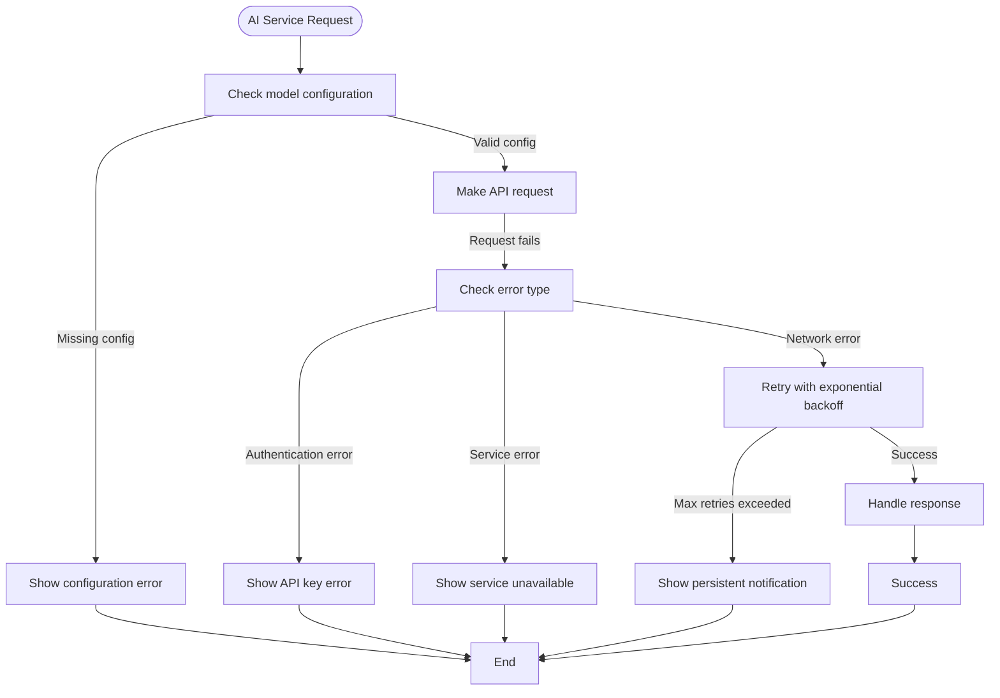

**Diagram sources **
- [aiService.ts](file://src/services/ai/aiService.ts#L74-L117)
- [modelInterface.ts](file://src/models/modelInterface.ts#L103-L116)

**Section sources**
- [aiService.ts](file://src/services/ai/aiService.ts#L1-L787)
- [modelInterface.ts](file://src/models/modelInterface.ts#L1-L117)

## Diagnostic Workflow Examples

### API Key Not Configured Error

One specific error scenario in the codebase is the 'API key not configured' error in the reviewCode command. When a user attempts to review code without configuring an API key, the system handles this through a multi-step process:

1. The reviewCode command catches the error indicating the API key is not configured
2. A user-friendly notification is displayed with options to configure the key
3. If the user chooses to configure the key, an input box appears for entering the API key
4. The entered key is validated before being saved
5. After successful configuration, the review process is retried automatically

This workflow ensures that users can resolve the issue without leaving the current context, providing a seamless experience.

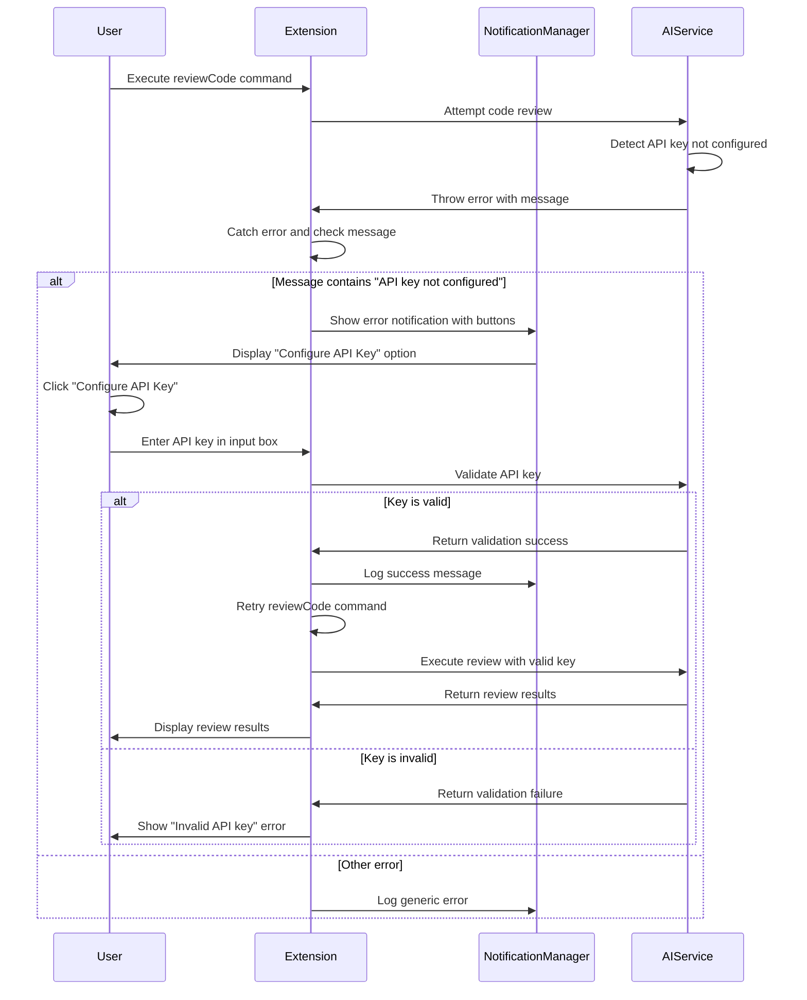

**Diagram sources **
- [extension.ts](file://src/extension.ts#L153-L179)

**Section sources**
- [extension.ts](file://src/extension.ts#L141-L184)

### Error Handling Information Flow

The extension's error handling system is designed to surface actionable information to users while preserving detailed context for developers. When an error occurs, the system follows a specific flow:

1. The error is caught at the component level
2. A user-friendly message is generated and displayed through notifications
3. Detailed technical information, including stack traces, is logged to the console
4. The status bar is updated to reflect the error state
5. Persistent notifications may be shown for critical errors with options to view details

This approach ensures that users understand what went wrong and what they can do to fix it, while developers have access to the full context needed to diagnose and resolve the issue.

```mermaid
flowchart LR
Error[Error Occurs] --> Component["Component catches error"]
Component --> Extract["Extract error message and context"]
Extract --> UserMessage["Create user-friendly message"]
UserMessage --> ShowNotification["Show notification to user"]
Component --> TechnicalDetails["Preserve technical details"]
TechnicalDetails --> LogConsole["Log to console with stack trace"]
TechnicalDetails --> LogOutput["Log to output channel"]
Component --> UpdateStatus["Update status bar to error state"]
UpdateStatus --> ShowErrorIcon["Show error icon in status bar"]
alt Critical error
Component --> Persistent["Show persistent notification"]
Persistent --> ViewDetails["Include 'View Details' option"]
ViewDetails --> ShowOutput["Show output channel when clicked"]
end
```

**Diagram sources **
- [aiService.ts](file://src/services/ai/aiService.ts#L691-L710)
- [gitService.ts](file://src/services/git/gitService.ts#L1195-L1199)
- [reviewManager.ts](file://src/services/review/reviewManager.ts#L101-L105)

**Section sources**
- [aiService.ts](file://src/services/ai/aiService.ts#L1-L787)
- [gitService.ts](file://src/services/git/gitService.ts#L1-L1200)
- [reviewManager.ts](file://src/services/review/reviewManager.ts#L1-L854)

## Conclusion

CodeKarmic's diagnostic workflows provide a comprehensive system for troubleshooting issues that combines logging, notifications, and debugging tools. The system is designed to balance user-friendliness with technical depth, providing actionable information to users while preserving detailed context for developers.

By following the end-to-end diagnostic process—starting with enabling debug mode, using diagnostic commands, and analyzing the combined output from console logs, notification messages, and dedicated debug channels—users can effectively identify and resolve issues. The synchronized logging system ensures that NotificationManager logs are coordinated with console logs, providing both user-friendly error messages and detailed technical information.

The troubleshooting workflows for common issues like API key configuration problems, Git repository detection failures, and AI service connectivity issues demonstrate the system's effectiveness in guiding users to solutions. Through specific error scenarios like the 'API key not configured' error in the reviewCode command, the extension shows how diagnostic tools help identify root causes and enable users to take corrective action.

This diagnostic approach ensures that CodeKarmic is not only a powerful code review tool but also a self-diagnosing system that can help users overcome obstacles and make the most of its capabilities.