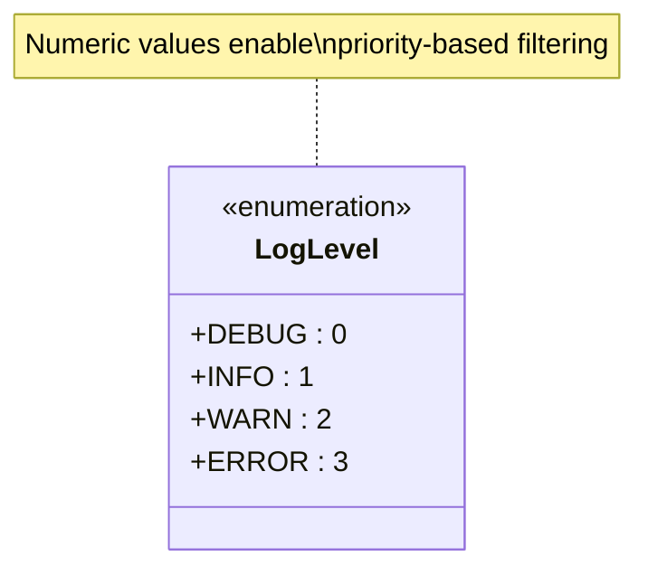
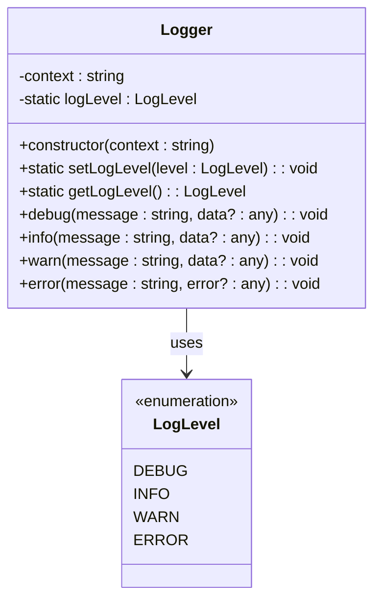
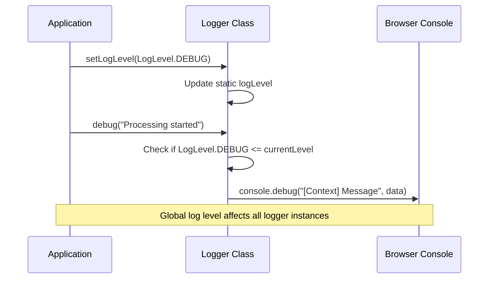
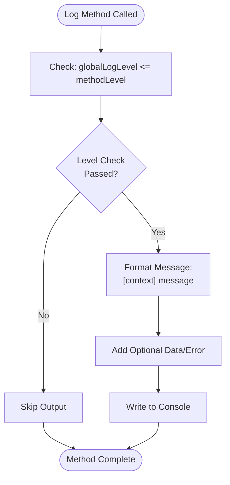
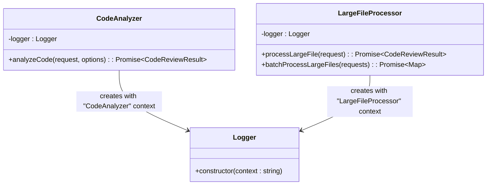

# Logging System

<cite>
**Referenced Files in This Document**
- [logger.ts](file://src/utils/logger.ts)
- [constants.ts](file://src/constants/constants.ts)
- [codeAnalyzer.ts](file://src/core/review/codeAnalyzer.ts)
- [largeFileProcessor.ts](file://src/core/compression/largeFileProcessor.ts)
- [notificationManager.ts](file://src/services/notification/notificationManager.ts)
- [extension.ts](file://src/extension.ts)
- [compressionTypes.ts](file://src/core/compression/compressionTypes.ts)
- [reviewTypes.ts](file://src/core/review/reviewTypes.ts)
</cite>

## Table of Contents
1. [Introduction](#introduction)
2. [LogLevel Enum Definition](#loglevel-enum-definition)
3. [Logger Class Architecture](#logger-class-architecture)
4. [Global Log Level Management](#global-log-level-management)
5. [Instance Methods Implementation](#instance-methods-implementation)
6. [Integration with Console Methods](#integration-with-console-methods)
7. [Context-Based Logging](#context-based-logging)
8. [Logger Instantiation Patterns](#logger-instantiation-patterns)
9. [Debug Mode Configuration](#debug-mode-configuration)
10. [Log Message Formatting](#log-message-formatting)
11. [Best Practices](#best-practices)
12. [Common Issues and Solutions](#common-issues-and-solutions)
13. [Performance Considerations](#performance-considerations)

## Introduction

CodeKarmic implements a sophisticated logging system built around the `Logger` class, providing structured, context-aware logging throughout the application. The system supports multiple log levels, global configuration, and seamless integration with browser console methods. This logging framework enables developers to track application behavior, debug issues, and monitor system performance across different components.

The logging system is designed with modularity and consistency in mind, ensuring that all parts of the CodeKarmic extension maintain uniform logging patterns while providing flexibility for different use cases and environments.

## LogLevel Enum Definition

The `LogLevel` enum serves as the foundation for controlling log message visibility and filtering. It defines four distinct severity levels with numeric values that enable efficient comparison operations.

**Diagram sources**
- [logger.ts](file://src/utils/logger.ts#L8-L13)

### Log Level Hierarchy

| Level | Numeric Value | Purpose | Visibility Filter |
|-------|---------------|---------|-------------------|
| DEBUG | 0 | Detailed diagnostic information | Shows all messages |
| INFO | 1 | General informational messages | Shows INFO, WARN, ERROR |
| WARN | 2 | Warning conditions | Shows WARN, ERROR |
| ERROR | 3 | Error conditions | Shows only ERROR |

**Section sources**
- [logger.ts](file://src/utils/logger.ts#L8-L13)

## Logger Class Architecture

The `Logger` class follows a hybrid design pattern combining static and instance methods to provide both global configuration and component-specific logging capabilities.

**Diagram sources**
- [logger.ts](file://src/utils/logger.ts#L18-L88)

### Class Structure Analysis

The Logger class maintains several key characteristics:

- **Static State Management**: The `logLevel` property is static, enabling global log level configuration across all logger instances
- **Instance Context**: Each logger instance maintains a specific context for identifying the source of log messages
- **Method Consistency**: All logging methods follow the same pattern of checking the global log level before output
- **Flexible Data Handling**: Methods accept optional data parameters for rich logging scenarios

**Section sources**
- [logger.ts](file://src/utils/logger.ts#L18-L88)

## Global Log Level Management

The logging system provides centralized control over log message visibility through static methods that manage the global log level state.

**Diagram sources**
- [logger.ts](file://src/utils/logger.ts#L34-L43)

### Static Method Implementation

The global log level management consists of two primary methods:

#### setLogLevel Method
Sets the global minimum log level threshold, affecting all logger instances throughout the application. When called, this method immediately updates the static `logLevel` property, ensuring immediate propagation of the new setting.

#### getLogLevel Method  
Returns the current global log level setting, allowing applications to query the active logging configuration for conditional logic or monitoring purposes.

**Section sources**
- [logger.ts](file://src/utils/logger.ts#L34-L43)

## Instance Methods Implementation

Each logging method in the Logger class follows a consistent implementation pattern that ensures reliable filtering and output formatting.

**Diagram sources**
- [logger.ts](file://src/utils/logger.ts#L50-L86)

### Method-Specific Behavior

#### debug() Method
Logs messages at the DEBUG level, intended for detailed diagnostic information during development and troubleshooting. Messages are only output when the global log level is set to DEBUG (0) or lower.

#### info() Method  
Provides general informational messages about normal application operation. These messages are shown when the global log level is INFO (1) or lower.

#### warn() Method  
Logs warning conditions that indicate potential issues but do not prevent normal operation. Warnings are displayed when the global log level is WARN (2) or lower.

#### error() Method  
Handles error conditions and exceptions, ensuring critical problems receive appropriate attention. Error messages appear when the global log level is ERROR (3) or lower.

**Section sources**
- [logger.ts](file://src/utils/logger.ts#L50-L86)

## Integration with Console Methods

The logging system seamlessly integrates with browser console methods, providing familiar APIs while maintaining consistent formatting and filtering.

### Console Method Mapping

| Logger Method | Console Method | Use Case |
|---------------|----------------|----------|
| debug() | console.debug() | Diagnostic information |
| info() | console.log() | General information |
| warn() | console.warn() | Warning conditions |
| error() | console.error() | Error conditions |

### Automatic Filtering

The system automatically applies filtering based on the global log level, preventing unnecessary console output and improving performance in production environments. This filtering occurs before any console method invocation, ensuring optimal resource utilization.

**Section sources**
- [logger.ts](file://src/utils/logger.ts#L51-L86)

## Context-Based Logging

Context identification is a core feature of the CodeKarmic logging system, enabling precise tracking of log message origins and facilitating targeted debugging and monitoring.

### Context Naming Conventions

The system employs consistent context naming patterns across different components:

- **Class-Based Contexts**: Use the class name as the context identifier (e.g., "CodeAnalyzer", "LargeFileProcessor")
- **Module-Based Contexts**: Reflect the module or functional area (e.g., "GitService", "ReviewManager")
- **Feature-Based Contexts**: Identify specific features or capabilities (e.g., "AIService", "NotificationManager")

### Context Prefix Format

All log messages include a standardized context prefix: `[ContextName] Message`. This format enables easy identification of message sources and facilitates filtering in developer consoles.

**Section sources**
- [codeAnalyzer.ts](file://src/core/review/codeAnalyzer.ts#L18)
- [largeFileProcessor.ts](file://src/core/compression/largeFileProcessor.ts#L26)

## Logger Instantiation Patterns

CodeKarmic employs consistent patterns for logger instantiation across different components, ensuring uniform logging behavior throughout the application.

**Diagram sources**
- [codeAnalyzer.ts](file://src/core/review/codeAnalyzer.ts#L18)
- [largeFileProcessor.ts](file://src/core/compression/largeFileProcessor.ts#L26)

### Component-Level Logger Creation

#### CodeAnalyzer Implementation
The CodeAnalyzer class demonstrates typical logger instantiation with a context reflecting its class name. This approach provides clear identification of log message sources and supports effective debugging workflows.

#### LargeFileProcessor Implementation  
The LargeFileProcessor class showcases logger usage in a singleton pattern, ensuring consistent logging across all processing operations while maintaining the appropriate context identification.

**Section sources**
- [codeAnalyzer.ts](file://src/core/review/codeAnalyzer.ts#L18)
- [largeFileProcessor.ts](file://src/core/compression/largeFileProcessor.ts#L26)

## Debug Mode Configuration

While the primary logging system uses the `LogLevel` enum for fine-grained control, CodeKarmic also implements a separate debug mode mechanism for development scenarios.

### Environment-Based Debug Mode

The system automatically enables debug mode based on the NODE_ENV environment variable, activating enhanced logging for development builds while maintaining production-ready logging in deployed environments.

### Manual Debug Mode Control

Developers can manually enable debug mode through configuration settings, providing flexibility for testing and troubleshooting specific scenarios without requiring environment changes.

**Section sources**
- [notificationManager.ts](file://src/services/notification/notificationManager.ts#L12-L17)

## Log Message Formatting

The logging system implements consistent formatting patterns that enhance readability and facilitate effective log analysis.

### Standard Message Format

All log messages follow a standardized format: `[ContextName] Human-readable message`. This structure provides immediate context identification and maintains consistency across all log outputs.

### Data Parameter Handling

Methods support optional data parameters that enable rich logging scenarios:

- **Info/Warn Methods**: Accept `data` parameter for additional context information
- **Error Methods**: Accept `error` parameter specifically for exception details
- **Conditional Output**: Data is only included when explicitly provided, preventing unnecessary console clutter

### Timestamp Integration

While the core Logger class doesn't include timestamps, the NotificationManager provides timestamped logging for persistent log channels, enabling temporal analysis of application events.

**Section sources**
- [logger.ts](file://src/utils/logger.ts#L52-L86)
- [notificationManager.ts](file://src/services/notification/notificationManager.ts#L101)

## Best Practices

### Log Level Selection Guidelines

Choose appropriate log levels based on message importance and intended audience:

- **DEBUG**: Use for detailed diagnostic information, internal state, and development troubleshooting
- **INFO**: Reserve for significant operational events, state changes, and progress indicators
- **WARN**: Log potential issues, degraded performance, or unexpected conditions
- **ERROR**: Report failures, exceptions, and critical system errors

### Context Naming Best Practices

Maintain consistent context naming conventions:

- Use PascalCase for class-based contexts (e.g., "CodeAnalyzer")
- Employ descriptive module names for functional contexts
- Avoid overly generic context names that could lead to confusion

### Data Parameter Usage

Leverage data parameters effectively:

- Include relevant contextual information for debugging
- Use structured data objects for complex information
- Avoid logging sensitive information in production environments

### Performance Considerations

Minimize logging overhead:

- Check log levels before expensive operations
- Use string interpolation for complex message construction
- Avoid logging large data structures unnecessarily

## Common Issues and Solutions

### Missing Context Identification

**Problem**: Log messages lack clear context identification, making it difficult to trace message origins.

**Solution**: Ensure all logger instances are created with appropriate context names matching their source components. Verify context naming consistency across related components.

### Incorrect Log Level Configuration

**Problem**: Log messages appear unexpectedly or are filtered incorrectly based on log level settings.

**Solution**: Verify global log level configuration and ensure it aligns with the desired verbosity. Check that log level comparisons use the correct numeric values from the LogLevel enum.

### Performance Impact from Excessive Logging

**Problem**: Heavy logging causes performance degradation, particularly in production environments.

**Solution**: Implement conditional logging checks, reduce log frequency for high-volume operations, and use appropriate log levels to minimize unnecessary output.

### Data Parameter Handling Issues

**Problem**: Optional data parameters are not handled consistently across different log methods.

**Solution**: Follow established patterns for data parameter usage, ensuring consistent behavior across all logging methods. Test data parameter inclusion and exclusion scenarios.

## Performance Considerations

### Efficient Log Level Checking

The logging system implements early filtering to prevent unnecessary message construction and console output. Each method performs a single comparison operation against the global log level before proceeding with message formatting.

### Memory Usage Optimization

- **Static Log Level**: The global log level is stored as a static property, minimizing memory overhead across multiple logger instances
- **Lazy Message Construction**: Message formatting occurs only when the log level check passes, reducing computational overhead
- **Optional Data Handling**: Data parameters are conditionally included, preventing unnecessary object creation

### Console Method Efficiency

The system leverages native browser console methods, which are optimized for performance. By using the appropriate console method for each log level, the system ensures efficient output handling across different browsers and environments.

### Scalability Considerations

The logging system scales efficiently with application growth:

- **Singleton Pattern Compatibility**: Logger instances can be used in singleton patterns without performance impact
- **Global Configuration**: Single global log level setting affects all instances uniformly
- **Minimal Dependencies**: The Logger class has minimal external dependencies, reducing maintenance overhead

**Section sources**
- [logger.ts](file://src/utils/logger.ts#L51-L86)