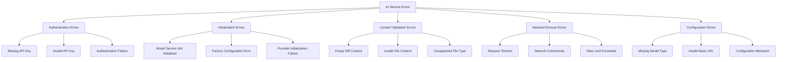
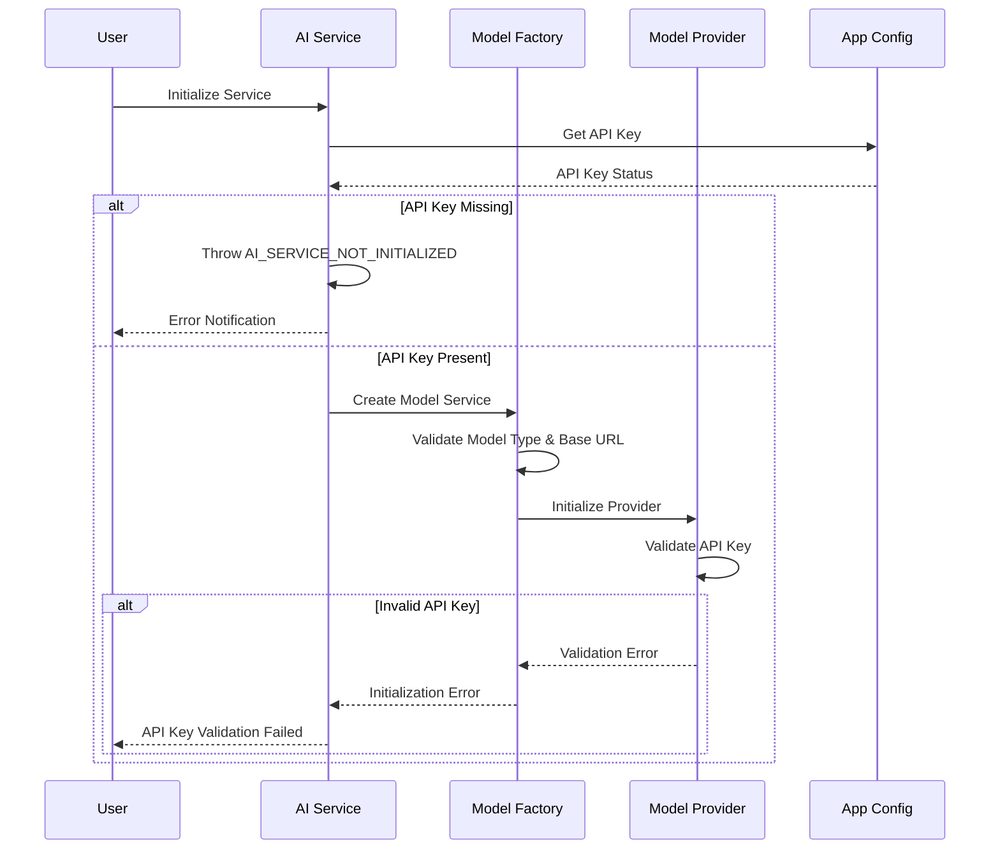
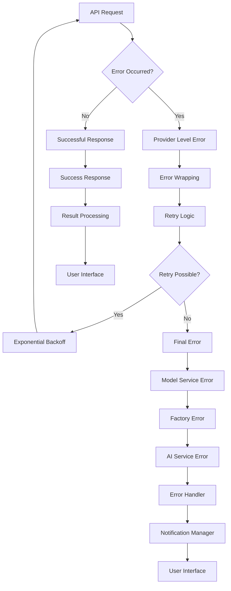
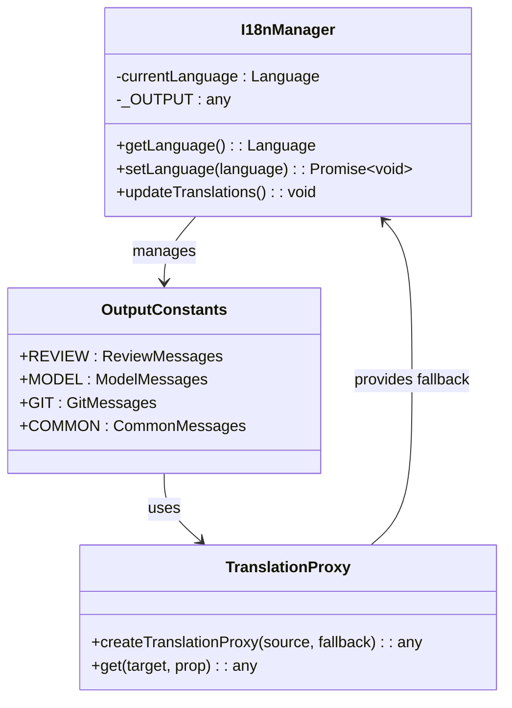
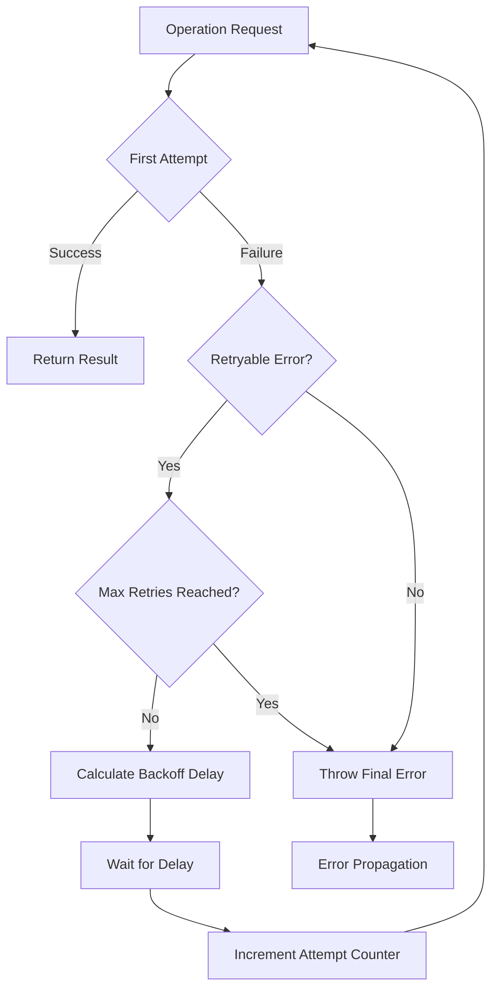

# AI Service Errors

<cite>
**Referenced Files in This Document**
- [aiService.ts](file://src/services/ai/aiService.ts)
- [modelFactory.ts](file://src/models/modelFactory.ts)
- [modelInterface.ts](file://src/models/modelInterface.ts)
- [deepseek.ts](file://src/models/providers/deepseek.ts)
- [appConfig.ts](file://src/config/appConfig.ts)
- [constants.ts](file://src/constants/constants.ts)
- [retryUtils.ts](file://src/utils/retryUtils.ts)
- [index.ts](file://src/i18n/index.ts)
- [output.ts](file://src/i18n/en/output.ts)
- [types.ts](file://src/models/types.ts)
</cite>

## Table of Contents
1. [Introduction](#introduction)
2. [Error Classification System](#error-classification-system)
3. [Core Error Conditions](#core-error-conditions)
4. [Error Message Structure](#error-message-structure)
5. [Error Propagation Chain](#error-propagation-chain)
6. [Localization System](#localization-system)
7. [Error Handling Patterns](#error-handling-patterns)
8. [Troubleshooting Guide](#troubleshooting-guide)
9. [Code Examples](#code-examples)
10. [Best Practices](#best-practices)

## Introduction

CodeKarmic's AI service error handling system provides comprehensive error management across multiple layers of the application architecture. The system handles various error conditions including API authentication failures, model service initialization errors, empty or invalid diff content, and request timeout exceptions. This documentation covers the complete error propagation chain from low-level API calls to user interface notifications.

## Error Classification System

The AI service error system categorizes errors into several distinct types based on their origin and severity:



**Section sources**
- [aiService.ts](file://src/services/ai/aiService.ts#L77-L94)
- [modelFactory.ts](file://src/models/modelFactory.ts#L64-L69)
- [deepseek.ts](file://src/models/providers/deepseek.ts#L27-L41)

## Core Error Conditions

### API Authentication Failures

The system handles API authentication errors at multiple levels, with specific error conditions for missing or invalid credentials.

**Key Error Locations:**
- Line 89-94: AI service initialization failure when API key is missing
- Line 111: Model service initialization error during factory creation
- Lines 228-230: Diff content generation error with notification logging

**Authentication Error Flow:**



**Diagram sources**
- [aiService.ts](file://src/services/ai/aiService.ts#L59-L61)
- [modelFactory.ts](file://src/models/modelFactory.ts#L64-L69)
- [deepseek.ts](file://src/models/providers/deepseek.ts#L47-L80)

### Model Service Initialization Errors

Model service initialization encompasses multiple validation steps that can fail at different stages.

**Initialization Error Conditions:**
- Missing model type configuration (lines 64-65)
- Missing base URL configuration (lines 68-69)
- Provider-specific initialization failures
- API key validation during service creation

**Section sources**
- [modelFactory.ts](file://src/models/modelFactory.ts#L64-L69)
- [modelFactory.ts](file://src/models/modelFactory.ts#L110-L112)

### Empty or Invalid Diff Content

The system validates diff content before proceeding with code analysis, throwing specific errors for empty or malformed content.

**Diff Content Validation:**
- Line 218-219: Throws error when diff content is empty or invalid
- Line 227-230: Handles diff generation errors with fallback mechanisms
- Line 231-239: Generates simple diff when primary method fails

**Section sources**
- [aiService.ts](file://src/services/ai/aiService.ts#L218-L219)
- [aiService.ts](file://src/services/ai/aiService.ts#L227-L239)

### Request Timeout Exceptions

The system implements comprehensive timeout handling with configurable retry mechanisms.

**Timeout Configuration:**
- Default timeout: 30 seconds for DeepSeek provider
- 3-minute timeout for code analysis requests
- Exponential backoff retry strategy

**Section sources**
- [deepseek.ts](file://src/models/providers/deepseek.ts#L12-L13)
- [aiService.ts](file://src/services/ai/aiService.ts#L274)

## Error Message Structure

The AI service uses a structured error message system built around OUTPUT constants and localization support.

### OUTPUT Constants Structure

The OUTPUT constants provide standardized error messages with parameterized templates:

```typescript
// Example error message patterns from output.ts
export const OUTPUT = {
    REVIEW: {
        AI_SERVICE_NOT_INITIALIZED: 'AI model service not initialized',
        EMPTY_DIFF_CONTENT: 'Empty or invalid diff content',
        CODE_ANALYSIS_FAILED: 'Code analysis failed:',
        FULL_FILE_ANALYSIS_START: 'Starting full file analysis...'
    },
    MODEL: {
        UNSUPPORTED_MODEL_TYPE: (type: string) => `Unsupported model type: ${type}`,
        API_ERROR: (message: string) => `API Error: ${message}`,
        VALIDATION_FAILED: 'API key validation failed',
        MISSING_API_KEY: 'API key not configured'
    }
};
```

### Error Message Categories

**Review-related Errors:**
- `AI_SERVICE_NOT_INITIALIZED`: AI service not ready for requests
- `EMPTY_DIFF_CONTENT`: Generated diff content is invalid
- `CODE_ANALYSIS_FAILED`: General code analysis failure
- `FILE_TYPE_NOT_SUPPORTED`: Unsupported file type for review

**Model-related Errors:**
- `UNSUPPORTED_MODEL_TYPE`: Model type not recognized
- `API_ERROR`: Generic API communication error
- `VALIDATION_FAILED`: API key validation unsuccessful
- `MISSING_API_KEY`: No API key configured

**Section sources**
- [output.ts](file://src/i18n/en/output.ts#L19-L26)
- [output.ts](file://src/i18n/en/output.ts#L186-L189)

## Error Propagation Chain

The error handling system follows a well-defined propagation pattern from low-level providers to user interface notifications.



**Diagram sources**
- [deepseek.ts](file://src/models/providers/deepseek.ts#L143-L146)
- [modelFactory.ts](file://src/models/modelFactory.ts#L110-L112)
- [aiService.ts](file://src/services/ai/aiService.ts#L691-L709)

### Error Handling Layers

**Provider Layer:**
- Low-level API communication errors
- Network connectivity issues
- Rate limiting and quota exceeded

**Service Layer:**
- Model service initialization failures
- Configuration validation errors
- Request preprocessing errors

**Application Layer:**
- Business logic validation errors
- User input validation
- Workflow orchestration errors

**Section sources**
- [deepseek.ts](file://src/models/providers/deepseek.ts#L143-L146)
- [modelFactory.ts](file://src/models/modelFactory.ts#L110-L112)
- [aiService.ts](file://src/services/ai/aiService.ts#L691-L709)

## Localization System

The AI service error handling integrates with CodeKarmic's internationalization system for multi-language support.

### I18n Integration

The system uses the I18nManager to provide localized error messages:



**Diagram sources**
- [index.ts](file://src/i18n/index.ts#L72-L131)
- [output.ts](file://src/i18n/en/output.ts#L1-L201)

### Language Fallback Mechanism

The system implements automatic fallback to English for missing translations:

**Fallback Process:**
1. Attempt to retrieve translation in current language
2. If missing, fall back to English translation
3. Use proxy object to handle missing properties transparently

**Section sources**
- [index.ts](file://src/i18n/index.ts#L52-L68)
- [index.ts](file://src/i18n/index.ts#L120-L130)

## Error Handling Patterns

### Retry Mechanisms

The system implements sophisticated retry logic with exponential backoff:



**Retry Configuration:**
- Max retries: 2 attempts
- Initial delay: 500ms
- Backoff factor: 1.5x
- Retryable error patterns: Network timeouts, rate limits, 5xx errors

**Section sources**
- [retryUtils.ts](file://src/utils/retryUtils.ts#L33-L69)
- [deepseek.ts](file://src/models/providers/deepseek.ts#L198-L209)

### Error Recovery Strategies

**Graceful Degradation:**
- Fallback to simple diff generation when VS Code Git API fails
- Alternative Git implementation when primary method fails
- Reduced functionality mode for large files

**Circuit Breaker Pattern:**
- Automatic service caching with API key validation
- Service recreation when configuration changes
- Error threshold monitoring

**Section sources**
- [aiService.ts](file://src/services/ai/aiService.ts#L227-L239)
- [modelFactory.ts](file://src/models/modelFactory.ts#L75-L81)

## Troubleshooting Guide

### API Key Validation Issues

**Common Symptoms:**
- "AI model service not initialized" error
- "API key validation failed" notification
- Authentication failures during requests

**Diagnostic Steps:**
1. Verify API key configuration in settings
2. Test API key validity using built-in validation
3. Check network connectivity to model provider
4. Validate base URL configuration

**Resolution Actions:**
- Update API key in extension settings
- Restart VS Code after configuration changes
- Verify model provider availability
- Check firewall and proxy settings

### Network Connectivity Problems

**Error Patterns:**
- Request timeout errors
- Connection reset errors
- Rate limit exceeded messages

**Troubleshooting Checklist:**
- Verify internet connectivity
- Check model provider status page
- Review rate limiting policies
- Test with different network connections

### Model Configuration Issues

**Common Configuration Errors:**
- Missing model type selection
- Invalid base URL format
- Unsupported model type specification

**Configuration Validation:**
- Verify model type from supported list
- Validate base URL accessibility
- Check model-specific requirements

**Section sources**
- [appConfig.ts](file://src/config/appConfig.ts#L145-L156)
- [modelFactory.ts](file://src/models/modelFactory.ts#L90-L93)

## Code Examples

### Error Handling in makeSpecificApiRequest

The `makeSpecificApiRequest` method demonstrates comprehensive error handling with logging and notification:

**Key Features:**
- Request timing and logging
- Stream processing support
- Error wrapping and propagation
- Notification integration

**Section sources**
- [aiService.ts](file://src/services/ai/aiService.ts#L738-L785)

### API Key Validation Method

The `validateApiKey` method shows robust validation with error handling:

**Validation Process:**
1. Factory instantiation
2. Service creation
3. API key testing
4. Error handling and reporting

**Section sources**
- [aiService.ts](file://src/services/ai/aiService.ts#L712-L724)

### Model Factory Error Handling

The model factory implements comprehensive error handling for service creation:

**Factory Error Scenarios:**
- Missing model type configuration
- Invalid base URL specification
- Provider initialization failures
- API key validation errors

**Section sources**
- [modelFactory.ts](file://src/models/modelFactory.ts#L64-L69)
- [modelFactory.ts](file://src/models/modelFactory.ts#L110-L112)

## Best Practices

### Error Message Design

**Guidelines for Effective Error Messages:**
- Use clear, actionable language
- Provide context about the failure
- Include suggested solutions when applicable
- Maintain consistent terminology

**Error Message Categories:**
- Technical errors: For developers and advanced users
- User-facing errors: For general users
- Debug information: For troubleshooting

### Logging and Monitoring

**Logging Best Practices:**
- Include timestamps for all error logs
- Capture stack traces for debugging
- Log error frequency and patterns
- Monitor error rates and trends

**Monitoring Integration:**
- Error rate tracking
- Performance metrics collection
- User impact assessment
- Automated alerting systems

### User Experience Considerations

**Error Communication:**
- Progressive disclosure of technical details
- Clear error categories and descriptions
- Helpful suggestions for resolution
- Consistent error presentation

**Recovery Assistance:**
- Automatic retry mechanisms
- Graceful degradation options
- Alternative workflow paths
- User guidance and support links

**Section sources**
- [aiService.ts](file://src/services/ai/aiService.ts#L691-L709)
- [aiService.ts](file://src/services/ai/aiService.ts#L778-L784)