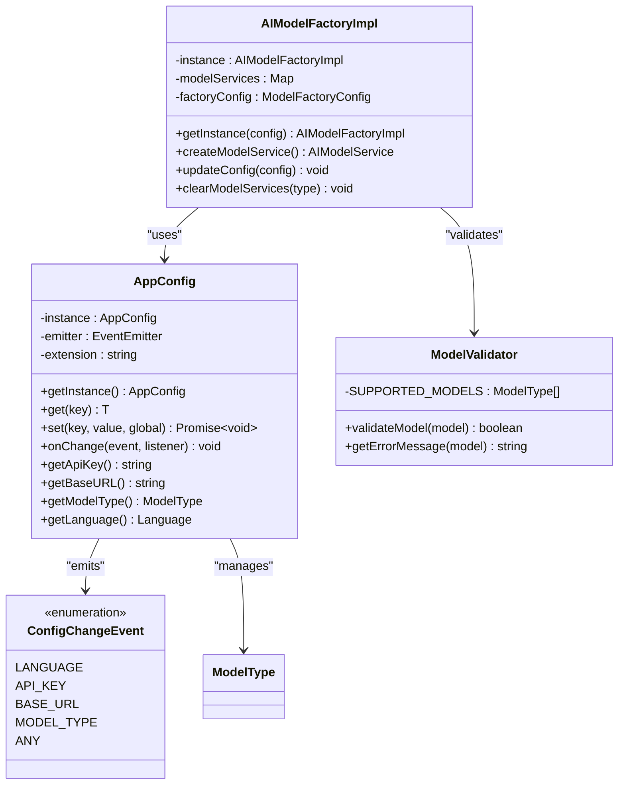
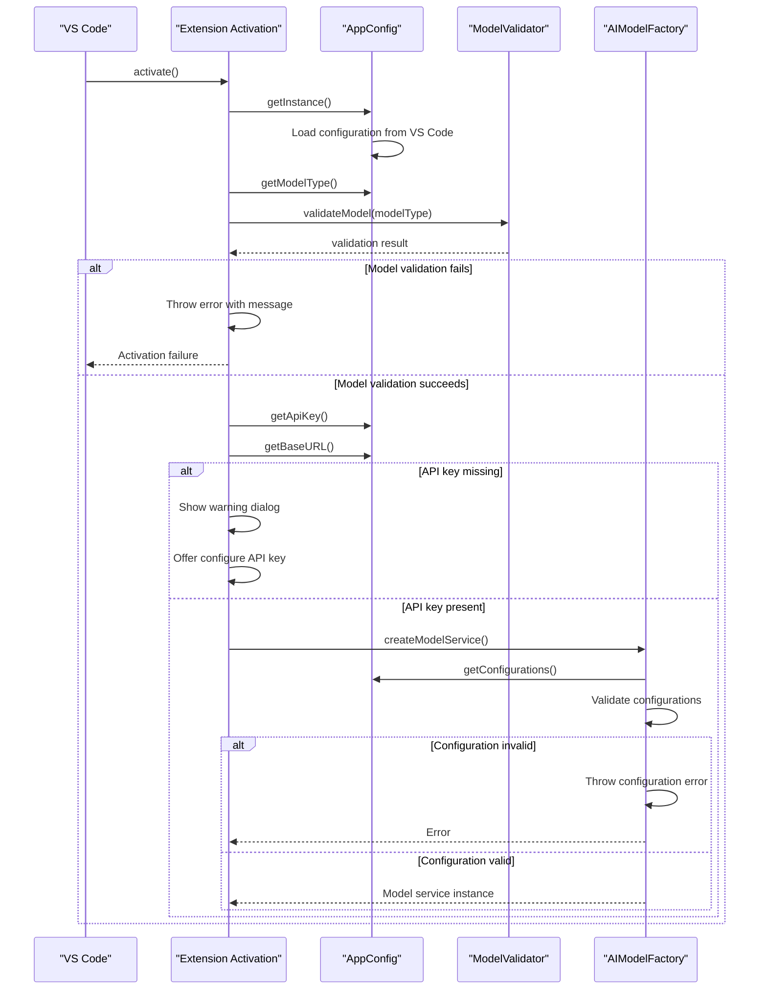
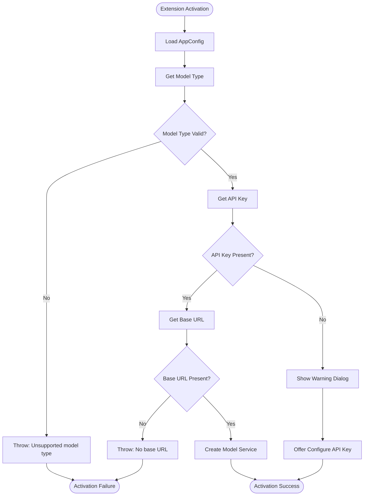
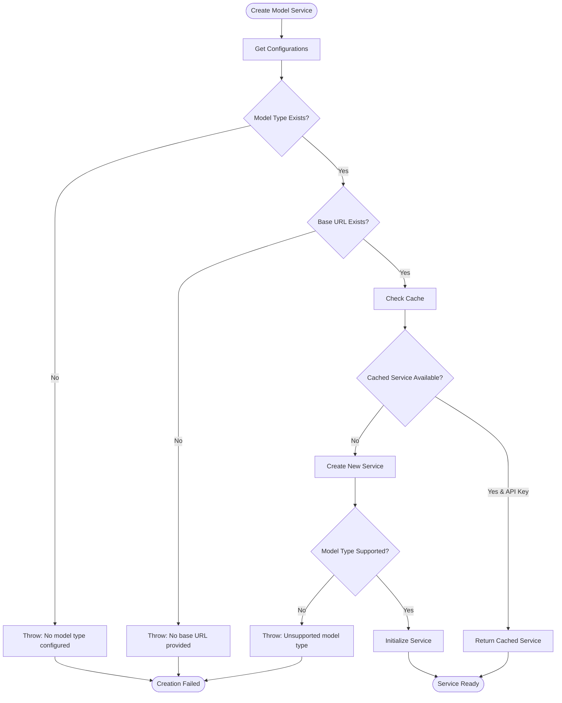
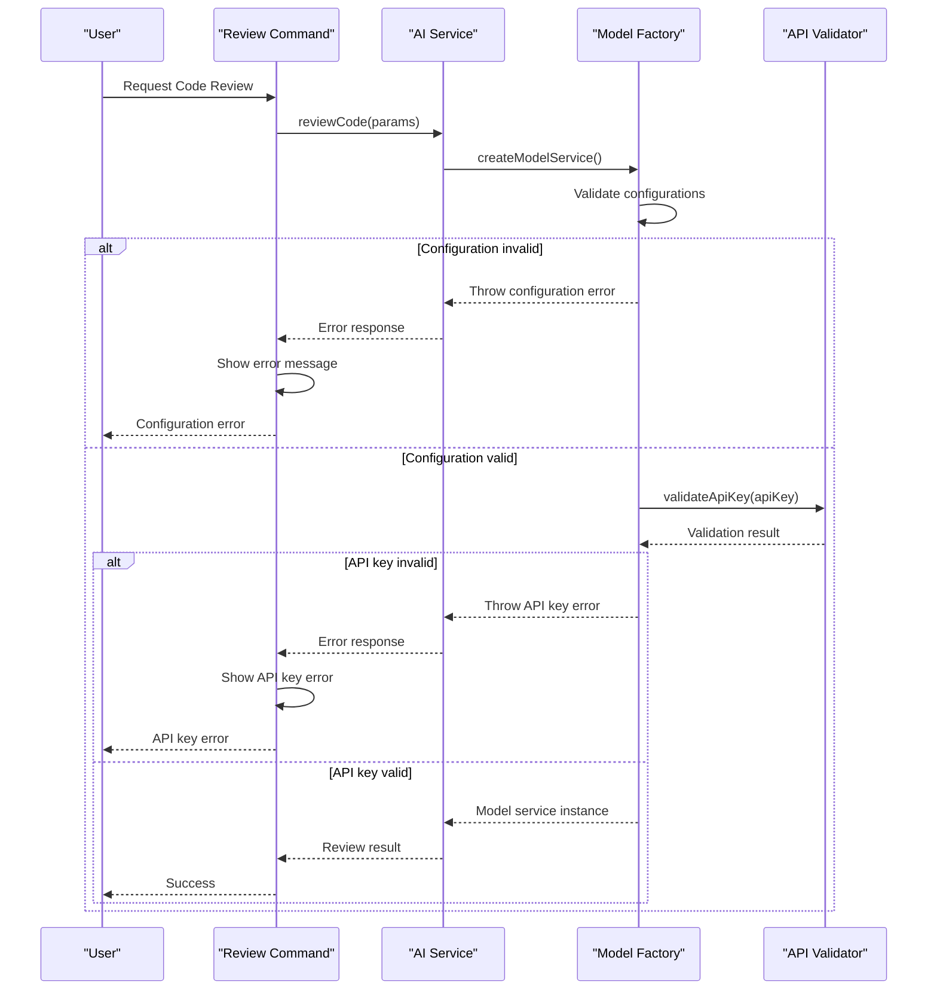
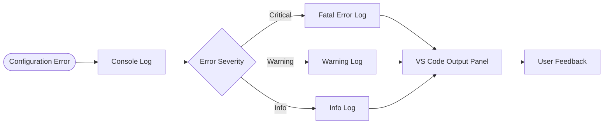

# Configuration Errors

<cite>
**Referenced Files in This Document**
- [appConfig.ts](file://src/config/appConfig.ts)
- [modelFactory.ts](file://src/models/modelFactory.ts)
- [extension.ts](file://src/extension.ts)
- [modelValidator.ts](file://src/models/modelValidator.ts)
- [types.ts](file://src/models/types.ts)
- [ui.ts](file://src/i18n/en/ui.ts)
- [output.ts](file://src/i18n/en/output.ts)
- [package.json](file://package.json)
</cite>

## Table of Contents
1. [Introduction](#introduction)
2. [Configuration System Architecture](#configuration-system-architecture)
3. [Configuration Loading Sequence](#configuration-loading-sequence)
4. [Core Configuration Errors](#core-configuration-errors)
5. [Error Detection and Validation](#error-detection-and-validation)
6. [Error Handling Mechanisms](#error-handling-mechanisms)
7. [Troubleshooting Guide](#troubleshooting-guide)
8. [Best Practices](#best-practices)
9. [Code Examples](#code-examples)

## Introduction

CodeKarmic's configuration system manages essential settings required for AI-powered code review functionality. The extension relies on proper configuration of API keys, model types, and base URLs to operate effectively. Configuration errors can prevent core functionality from working, resulting in various error messages and degraded user experience.

This document covers the comprehensive configuration error handling system, including detection mechanisms, validation processes, and troubleshooting procedures for common configuration issues.

## Configuration System Architecture

CodeKarmic implements a centralized configuration management system built around several key components:



**Diagram sources**
- [appConfig.ts](file://src/config/appConfig.ts#L49-L188)
- [modelFactory.ts](file://src/models/modelFactory.ts#L19-L140)
- [modelValidator.ts](file://src/models/modelValidator.ts#L4-L14)

**Section sources**
- [appConfig.ts](file://src/config/appConfig.ts#L49-L188)
- [modelFactory.ts](file://src/models/modelFactory.ts#L19-L140)

## Configuration Loading Sequence

The configuration loading process follows a specific sequence during extension activation:



**Diagram sources**
- [extension.ts](file://src/extension.ts#L20-L66)
- [modelFactory.ts](file://src/models/modelFactory.ts#L58-L114)

**Section sources**
- [extension.ts](file://src/extension.ts#L20-L66)
- [appConfig.ts](file://src/config/appConfig.ts#L54-L77)

## Core Configuration Errors

CodeKarmic handles several categories of configuration errors that can occur during initialization and operation:

### 1. Missing Model Type Configuration

**Error Message:** "No model type configured"

**Location:** [modelFactory.ts](file://src/models/modelFactory.ts#L64-L66)

**Cause:** The model type configuration is either not set or invalid.

**Detection:** The factory checks if the model type is falsy before proceeding with service creation.

**Impact:** Prevents AI model service instantiation, making code review functionality unavailable.

### 2. Missing Base URL Configuration

**Error Message:** "No base URL provided"

**Location:** [modelFactory.ts](file://src/models/modelFactory.ts#L68-L70)

**Cause:** The base URL for the AI service endpoint is not configured.

**Detection:** The factory validates that the base URL is truthy before attempting to create a model service.

**Impact:** Cannot establish connection to AI service, preventing any API calls.

### 3. API Key Validation Failures

**Error Messages:**
- "API key not configured"
- "API key validation failed"
- "API key validation error"

**Locations:** [extension.ts](file://src/extension.ts#L37-L66), [modelFactory.ts](file://src/models/modelFactory.ts#L89-L91)

**Cause:** API key is missing, invalid, or fails validation against the AI service.

**Detection:** Multiple layers of validation:
- Extension level: Checks for API key presence
- Service level: Validates API key with AI provider
- Factory level: Ensures API key availability for cached services

**Impact:** Prevents AI model service initialization and code review operations.

### 4. Unsupported Model Type

**Error Message:** "Unsupported model type: [model_type]"

**Location:** [modelValidator.ts](file://src/models/modelValidator.ts#L11-L12)

**Cause:** The configured model type is not in the list of supported models.

**Detection:** ModelValidator compares the configured model against supported model types.

**Impact:** Factory cannot instantiate the requested model service.

**Section sources**
- [modelFactory.ts](file://src/models/modelFactory.ts#L58-L114)
- [modelValidator.ts](file://src/models/modelValidator.ts#L4-L14)
- [extension.ts](file://src/extension.ts#L25-L66)

## Error Detection and Validation

CodeKarmic implements a multi-layered validation system for configuration errors:

### Layer 1: Extension Activation Validation

During extension activation, the system performs initial configuration checks:



**Diagram sources**
- [extension.ts](file://src/extension.ts#L20-L66)

### Layer 2: Factory-Level Validation

The AI model factory performs additional validation during service creation:



**Diagram sources**
- [modelFactory.ts](file://src/models/modelFactory.ts#L58-L114)

### Layer 3: Runtime Validation

Runtime validation occurs during code review operations:



**Diagram sources**
- [extension.ts](file://src/extension.ts#L140-L183)

**Section sources**
- [extension.ts](file://src/extension.ts#L20-L66)
- [modelFactory.ts](file://src/models/modelFactory.ts#L58-L114)

## Error Handling Mechanisms

CodeKarmic implements comprehensive error handling strategies for configuration issues:

### Error Propagation Patterns

The extension uses consistent error propagation patterns across different layers:

| Error Type | Propagation Level | Handler | User Feedback |
|------------|------------------|---------|---------------|
| Missing Model Type | Factory → Extension | Exception | Show error message |
| Missing Base URL | Factory → Extension | Exception | Show error message |
| Invalid API Key | Service → Extension | Promise rejection | Show warning dialog |
| Unsupported Model | Factory → Extension | Exception | Show error message |
| Configuration Error | Extension → UI | Error boundary | Show error message |

### Error Recovery Strategies

The system implements several error recovery mechanisms:

1. **Graceful Degradation**: When API key is missing, the extension continues to load but disables AI features
2. **User Guidance**: Provides clear instructions for resolving configuration issues
3. **Automatic Retry**: Some operations include retry mechanisms for transient failures
4. **Caching**: Valid configurations are cached to avoid repeated validation overhead

### Error Logging and Monitoring

Configuration errors are logged with appropriate severity levels:



**Section sources**
- [extension.ts](file://src/extension.ts#L515-L519)
- [modelFactory.ts](file://src/models/modelFactory.ts#L110-L113)

## Troubleshooting Guide

### Common Configuration Issues and Solutions

#### Issue 1: API Key Not Configured

**Symptoms:**
- Warning dialog appears on extension activation
- Code review commands fail with "API key not configured" error
- "Configure API Key" button appears in notifications

**Solution Steps:**
1. **Verify Settings in VS Code Preferences**
   - Open VS Code settings
   - Navigate to CodeKarmic configuration
   - Check if `codekarmic.apiKey` is set

2. **Use Configure API Key Command**
   ```bash
   F1 > Configure API Key
   ```
   - Enter your API key when prompted
   - Extension will validate the key automatically

3. **Check Environment Variables**
   - Ensure API key is not being overridden by environment variables
   - Verify key format matches provider requirements

4. **Validate API Key**
   - Test key with AI provider's API directly
   - Check key permissions and quotas

#### Issue 2: Missing Model Type Configuration

**Symptoms:**
- Extension fails to activate with "Unsupported model type" error
- Model selection dropdown shows empty or incorrect options

**Solution Steps:**
1. **Check Configuration Settings**
   - Verify `codekarmic.modelType` is set to a supported value
   - Supported models: `deepseek-chat`, `deepseek-reasoner`

2. **Reset to Default Configuration**
   ```bash
   F1 > Open Settings (JSON)
   ```
   Add or modify:
   ```json
   "codekarmic.modelType": "deepseek-reasoner"
   ```

3. **Validate Model Type**
   - Ensure the model type matches available providers
   - Check for typos in model configuration

#### Issue 3: Invalid Base URL Configuration

**Symptoms:**
- "No base URL provided" error during service initialization
- Network connectivity issues reported

**Solution Steps:**
1. **Verify Base URL Setting**
   - Check `codekarmic.baseUrl` configuration
   - Ensure URL format is correct (e.g., `https://api.deepseek.com/v1`)

2. **Test Network Connectivity**
   - Verify internet access
   - Check firewall settings
   - Test URL accessibility from browser

3. **Reset to Default URL**
   ```json
   "codekarmic.baseUrl": "https://api.deepseek.com/v1"
   ```

#### Issue 4: Unsupported Model Type

**Symptoms:**
- "Unsupported model type" error message
- Model selection fails validation

**Solution Steps:**
1. **Check Supported Models**
   ```typescript
   // Supported model types
   const supportedModels = ['deepseek-chat', 'deepseek-reasoner', 'openai']
   ```

2. **Update Configuration**
   - Change to a supported model type
   - Verify model type spelling and casing

3. **Clear Model Cache**
   - Restart VS Code to clear cached model configurations
   - Reset model type to default

### Diagnostic Commands

#### Enable Debug Mode
```bash
F1 > Open Settings (JSON)
```
Add:
```json
"codekarmic.debugMode": true
```

#### View Configuration Status
```bash
F1 > Debug Git Functionality
```
This command displays current configuration status and connectivity information.

#### Reset All Configurations
```bash
F1 > Open Settings
```
Manually reset all CodeKarmic settings to defaults.

**Section sources**
- [extension.ts](file://src/extension.ts#L37-L66)
- [extension.ts](file://src/extension.ts#L82-L96)
- [ui.ts](file://src/i18n/en/ui.ts#L40-L42)

## Best Practices

### Configuration Management

1. **Use Environment-Specific Settings**
   - Store sensitive API keys in environment variables
   - Use workspace-specific settings for development
   - Maintain separate configurations for different environments

2. **Implement Configuration Validation**
   - Validate all configuration values on startup
   - Provide meaningful error messages for invalid configurations
   - Use type-safe configuration interfaces

3. **Handle Configuration Changes Gracefully**
   - Monitor configuration changes using event listeners
   - Reinitialize services when critical configurations change
   - Provide seamless transitions during configuration updates

### Error Prevention

1. **Default Safe Values**
   - Always provide sensible default values for all configurations
   - Use nullish coalescing for configuration retrieval
   - Validate default values during initialization

2. **Early Validation**
   - Perform configuration validation as early as possible
   - Fail fast with clear error messages
   - Provide actionable feedback for resolution

3. **Robust Error Handling**
   - Catch and handle all configuration-related exceptions
   - Log detailed error information for debugging
   - Provide fallback mechanisms for critical failures

### Security Considerations

1. **Secure API Key Storage**
   - Use VS Code's secure storage for API keys
   - Avoid hardcoding credentials in source code
   - Implement key rotation and validation

2. **Network Security**
   - Validate base URLs and endpoints
   - Implement proper SSL/TLS verification
   - Monitor network connectivity issues

3. **Access Control**
   - Validate API key permissions
   - Implement rate limiting and quota monitoring
   - Log configuration access attempts

## Code Examples

### Configuration Error Handling in Extension Activation

The extension demonstrates robust error handling during activation:

```typescript
// Example from extension.ts lines 20-66
export function activate() {
    try {
        // Initialize notification manager
        NotificationManager.getInstance().startSession(true);
        
        // Get model type from configuration
        const modelType = AppConfig.getInstance().getModelType();
        
        // Validate model type
        if (!ModelValidator.validateModel(modelType)) {
            throw new Error(ModelValidator.getErrorMessage(modelType));
        }
        
        // Check API key configuration
        const apiKey = config.getApiKey();
        if (!apiKey) {
            // Show warning and offer configuration options
            const configureNow = UI.BUTTONS.CONFIGURE_API_KEY;
            const openSettings = UI.BUTTONS.OPEN_SETTINGS;
            vscode.window.showWarningMessage(
                UI.MESSAGES.API_KEY_MISSING,
                configureNow,
                openSettings
            ).then(selection => {
                // Handle user choices
                if (selection === configureNow) {
                    // Show input box for API key
                    vscode.window.showInputBox({
                        prompt: UI.PLACEHOLDERS.API_KEY,
                        password: true
                    }).then(async apiKey => {
                        if (apiKey) {
                            // Validate and set API key
                            const isValid = await AIService.getInstance().validateApiKey(apiKey);
                            if (isValid) {
                                AIService.getInstance().setApiKey(apiKey);
                                NotificationManager.getInstance().log(UI.MESSAGES.API_KEY_SUCCESS, 'info', true);
                            } else {
                                vscode.window.showErrorMessage(UI.MESSAGES.API_KEY_INVALID);
                            }
                        }
                    });
                }
            });
        }
        
        // Continue with normal activation...
    } catch (error) {
        // Handle activation errors gracefully
        const errorDetails = error instanceof Error ? error.stack || error.message : String(error);
        vscode.window.showErrorMessage(`激活扩展失败: ${errorDetails}`);
        return;
    }
}
```

### Model Factory Error Handling

The model factory implements comprehensive error handling:

```typescript
// Example from modelFactory.ts lines 58-114
createModelService(): AIModelService {
    const config = AppConfig.getInstance();
    const modelType = config.getModelType();
    const baseURL = config.getBaseURL();
    const apiKey = config.getApiKey();
    
    // Validate model type
    if (!modelType) {
        throw new Error(OUTPUT.MODEL.NO_MODEL_TYPE);
    }
    
    // Validate base URL
    if (!baseURL) {
        throw new Error(OUTPUT.MODEL.NO_BASE_URL);
    }
    
    // Create cache key
    const cacheKey = `${modelType}:${baseURL}`;
    
    // Check cached service
    if (this.modelServices.has(cacheKey) && apiKey) {
        const cachedService = this.modelServices.get(cacheKey);
        if (cachedService) {
            return cachedService;
        }
    }
    
    // Create new service
    let service: AIModelService;
    switch (modelType.toLowerCase()) {
        case ModelType.DEEPSEEK_V3:
        case ModelType.DEEPSEEK_R1:
            service = new DeepSeekModelService(modelType, baseURL, apiKey);
            break;
        default:
            const errorMessage = OUTPUT.MODEL.UNSUPPORTED_MODEL_TYPE + modelType;
            throw new Error(errorMessage);
    }
    
    // Initialize service with error handling
    try {
        service.initialize({
            defaultQuery: {
                compressLargeContent: this.factoryConfig.enableLargeFileCompression,
                compressionThreshold: this.factoryConfig.compressionThreshold
            }
        });
        
        // Cache service if API key is available
        if (apiKey) {
            this.modelServices.set(cacheKey, service);
        }
        
        return service;
    } catch (error) {
        console.error(`Failed to initialize model service: ${error instanceof Error ? error.message : String(error)}`);
        throw new Error(`Failed to initialize model service: ${error instanceof Error ? error.message : String(error)}`);
    }
}
```

### Configuration Validation Utilities

The system includes utility functions for configuration validation:

```typescript
// Example from modelValidator.ts lines 4-14
export class ModelValidator {
    private static readonly SUPPORTED_MODELS = getAllModelTypes();
    
    public static validateModel(model: ModelType): boolean {
        return this.SUPPORTED_MODELS.includes(model);
    }
    
    public static getErrorMessage(model: ModelType): string {
        return OUTPUT.MODEL.UNSUPPORTED_MODEL_TYPE(model);
    }
}

// Example from appConfig.ts lines 130-188
public getLanguage(): Language {
    const displayName = this.get<string>(ConfigKey.LANGUAGE);
    return displayName as Language;
}

public getApiKey(): string {
    return this.get<string>(ConfigKey.API_KEY);
}

public getBaseURL(): string {
    return this.get<string>(ConfigKey.BASE_URL);
}

public getModelType(): ModelType {
    const displayName = this.get<string>(ConfigKey.MODEL_TYPE);
    return getModelTypeFromDisplayName(displayName);
}
```

These examples demonstrate the comprehensive error handling and validation strategies implemented throughout the CodeKarmic configuration system, ensuring robust operation even when configuration issues occur.

**Section sources**
- [extension.ts](file://src/extension.ts#L20-L66)
- [modelFactory.ts](file://src/models/modelFactory.ts#L58-L114)
- [modelValidator.ts](file://src/models/modelValidator.ts#L4-L14)
- [appConfig.ts](file://src/config/appConfig.ts#L130-L188)