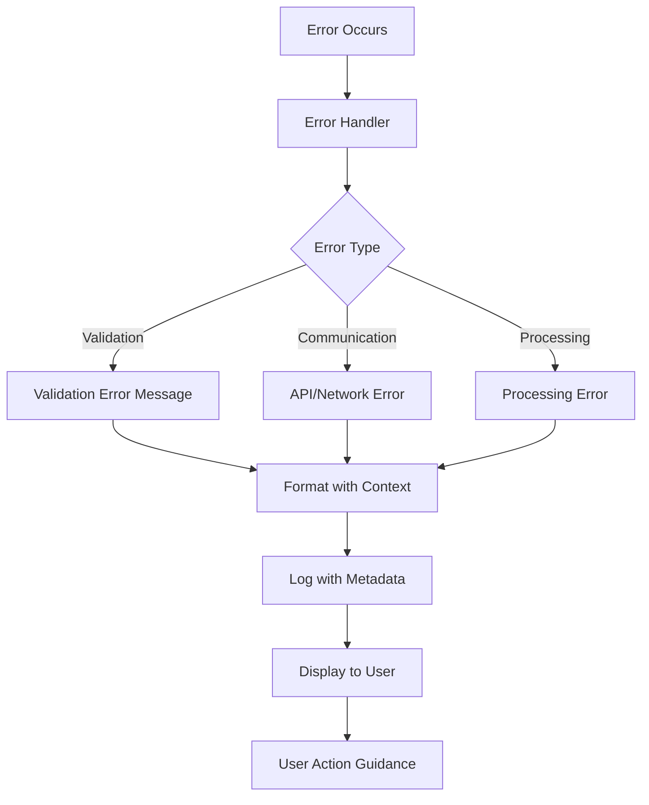
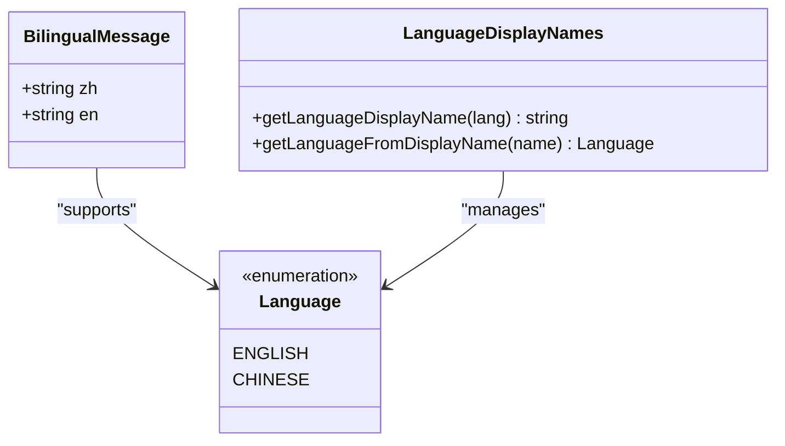
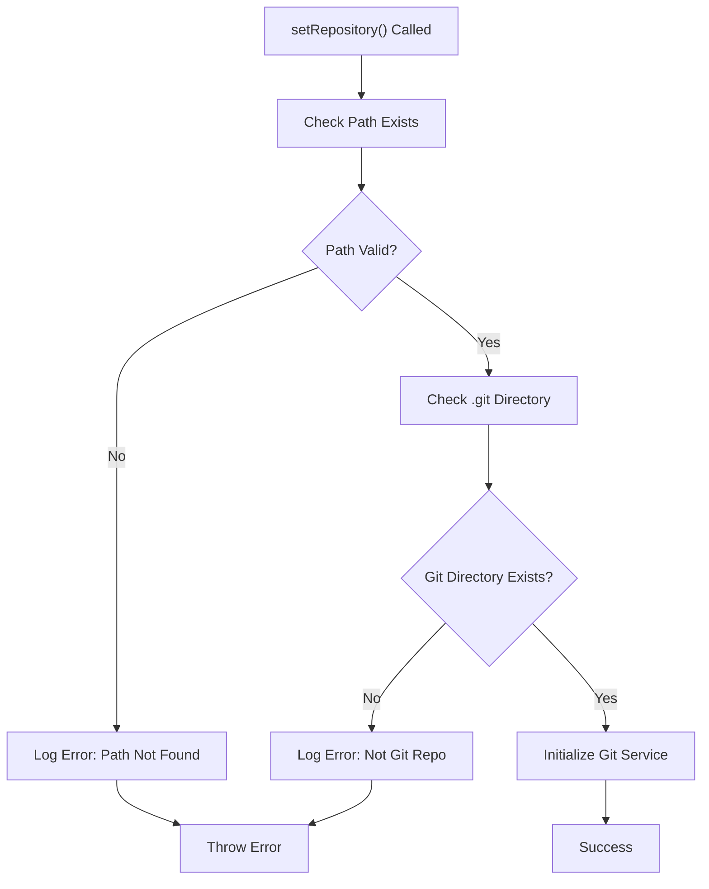
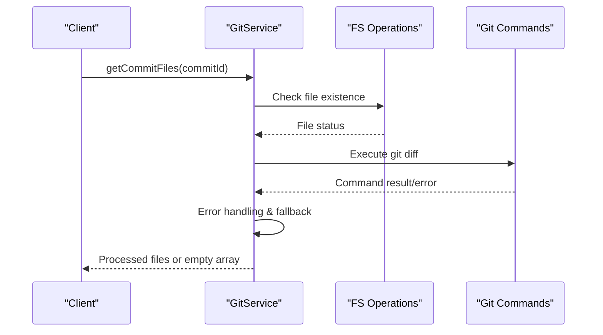
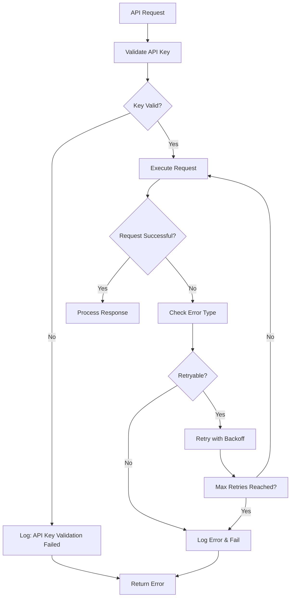
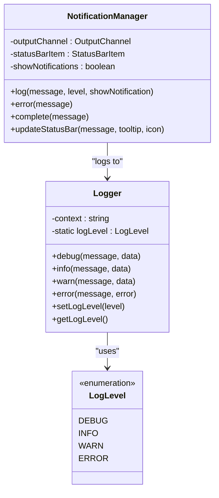
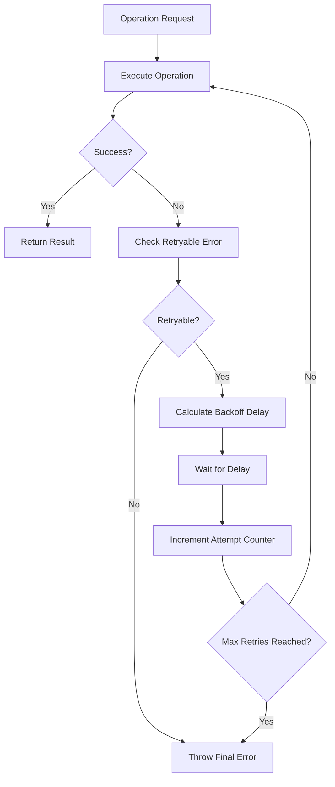

# Error Messages

<cite>
**Referenced Files in This Document**
- [gitService.ts](file://src/services/git/gitService.ts)
- [aiService.ts](file://src/services/ai/aiService.ts)
- [output.ts](file://src/i18n/en/output.ts)
- [logger.ts](file://src/utils/logger.ts)
- [notificationManager.ts](file://src/services/notification/notificationManager.ts)
- [retryUtils.ts](file://src/utils/retryUtils.ts)
- [modelValidator.ts](file://src/models/modelValidator.ts)
- [versionControlTypes.ts](file://src/services/git/versionControlTypes.ts)
- [constants.ts](file://src/constants/constants.ts)
- [types.ts](file://src/i18n/types.ts)
</cite>

## Table of Contents
1. [Introduction](#introduction)
2. [Error Message Structure](#error-message-structure)
3. [Localization System](#localization-system)
4. [Git Service Error Handling](#git-service-error-handling)
5. [AI Service Error Handling](#ai-service-error-handling)
6. [Logging and Diagnostics](#logging-and-diagnostics)
7. [Error Recovery Patterns](#error-recovery-patterns)
8. [Error Code Reference](#error-code-reference)
9. [Best Practices](#best-practices)
10. [Troubleshooting Guide](#troubleshooting-guide)

## Introduction

CodeKarmic implements a comprehensive error handling system designed to provide clear, actionable error messages while maintaining robust error recovery mechanisms. The system handles various types of errors including repository validation failures, Git service initialization issues, AI model communication problems, and file processing errors.

The error handling architecture follows these key principles:
- **User-Friendly Messages**: Clear, actionable error messages for end users
- **Technical Diagnostics**: Detailed error information for debugging
- **Graceful Degradation**: Fallback mechanisms when primary operations fail
- **Consistent Logging**: Structured logging with appropriate severity levels
- **Internationalization**: Multi-language support for global users

## Error Message Structure

CodeKarmic uses a structured approach to error message creation through the OUTPUT constant system, which provides both user-facing messages and technical diagnostic information.

### Message Composition Pattern

**Diagram sources**
- [gitService.ts](file://src/services/git/gitService.ts#L75-L88)
- [aiService.ts](file://src/services/ai/aiService.ts#L691-L710)

### Error Message Categories

The system organizes errors into several categories:

| Category | Purpose | Example Messages |
|----------|---------|------------------|
| **Validation** | Input validation and repository checks | "Repository path does not exist", "Not a git repository" |
| **Communication** | API and network-related errors | "Failed to get commits", "API key validation failed" |
| **Processing** | File and content processing errors | "Error getting commit files", "Failed to generate diff" |
| **Initialization** | Service startup and configuration errors | "Git service not initialized", "AI model service not initialized" |
| **Recovery** | Fallback and retry error messages | "All methods failed", "Fallback method also failed" |

**Section sources**
- [output.ts](file://src/i18n/en/output.ts#L1-L201)

## Localization System

CodeKarmic implements a comprehensive internationalization system using bilingual message structures that support both English and Chinese languages.

### Bilingual Message Structure

**Diagram sources**
- [types.ts](file://src/i18n/types.ts#L12-L36)

### Localization Implementation

The localization system provides:

- **Dual Language Support**: Messages available in both English and Chinese
- **Context-Aware Display**: Automatic language selection based on user preferences
- **Fallback Mechanisms**: Graceful degradation when translations are unavailable
- **Dynamic Language Switching**: Runtime language preference handling

**Section sources**
- [types.ts](file://src/i18n/types.ts#L1-L36)

## Git Service Error Handling

The Git service implements comprehensive error handling for repository operations, commit retrieval, and file processing with multiple fallback strategies.

### Repository Validation Errors

**Diagram sources**
- [gitService.ts](file://src/services/git/gitService.ts#L75-L88)

### Key Error Scenarios

#### Repository Path Validation (Lines 75-88)
- **Error**: "Repository path does not exist"
- **Cause**: Specified repository path doesn't exist on filesystem
- **Resolution**: Verify repository path exists and accessible
- **Context**: Repository initialization failure

#### Missing .git Directory (Lines 83-88)
- **Error**: "Not a git repository - .git directory not found"
- **Cause**: Repository lacks Git metadata directory
- **Resolution**: Initialize repository with `git init` or select valid Git repository
- **Context**: Repository validation failure

#### Commit Retrieval Failures
- **Error**: "Failed to get commits", "Failed to get commit"
- **Cause**: Git command execution failures or repository corruption
- **Resolution**: Check repository integrity and Git installation
- **Context**: Commit history access issues

**Section sources**
- [gitService.ts](file://src/services/git/gitService.ts#L75-L88)
- [gitService.ts](file://src/services/git/gitService.ts#L200-L241)

### File Processing Error Handling

The Git service implements sophisticated error handling for file operations with graceful degradation:

**Diagram sources**
- [gitService.ts](file://src/services/git/gitService.ts#L110-L177)

**Section sources**
- [gitService.ts](file://src/services/git/gitService.ts#L110-L177)

## AI Service Error Handling

The AI service implements robust error handling for API communications, model validation, and content processing with comprehensive retry mechanisms.

### API Authentication Failures

**Diagram sources**
- [aiService.ts](file://src/services/ai/aiService.ts#L712-L723)

### Model Communication Errors

#### API Key Validation Errors
- **Error**: "API key validation failed"
- **Cause**: Invalid or expired API credentials
- **Resolution**: Configure valid API key in settings
- **Context**: Service initialization phase

#### Model Unreachable Errors
- **Error**: "Model service not initialized"
- **Cause**: AI model factory failed to create service
- **Resolution**: Check model configuration and restart extension
- **Context**: Code review initiation

#### Timeout Exceptions
- **Error**: "Request timed out", "Analysis request timeout"
- **Cause**: Network latency or model processing delays
- **Resolution**: Increase timeout settings or retry operation
- **Context**: Long-running AI analysis operations

**Section sources**
- [aiService.ts](file://src/services/ai/aiService.ts#L712-L723)
- [aiService.ts](file://src/services/ai/aiService.ts#L387-L409)

### Error Recovery Strategies

The AI service implements multiple recovery strategies:

1. **Automatic Retry**: Exponential backoff for transient failures
2. **Fallback Processing**: Simplified analysis when primary methods fail
3. **Graceful Degradation**: Reduced functionality with error reporting
4. **Caching**: Results caching to avoid repeated failures

**Section sources**
- [aiService.ts](file://src/services/ai/aiService.ts#L227-L239)
- [aiService.ts](file://src/services/ai/aiService.ts#L387-L409)

## Logging and Diagnostics

CodeKarmic implements a comprehensive logging system with structured error reporting and diagnostic capabilities.

### Logging Architecture

**Diagram sources**
- [logger.ts](file://src/utils/logger.ts#L18-L88)
- [notificationManager.ts](file://src/services/notification/notificationManager.ts#L8-L213)

### Log Level Management

The logging system supports four severity levels:

| Level | Purpose | Usage | Visibility |
|-------|---------|-------|------------|
| **DEBUG** | Development debugging | Detailed execution traces | Conditional (development mode) |
| **INFO** | General information | Operation status updates | Always visible |
| **WARN** | Warning conditions | Recoverable issues | User notifications |
| **ERROR** | Error conditions | Failed operations | User notifications + stack traces |

### Error Context and Stack Traces

Error messages include comprehensive contextual information:

- **Timestamps**: ISO format timestamps for temporal correlation
- **Context Information**: Class/module identification for error origin
- **Stack Traces**: Full call stack for debugging purposes
- **Error Details**: Specific error messages and codes

**Section sources**
- [logger.ts](file://src/utils/logger.ts#L1-L88)
- [gitService.ts](file://src/services/git/gitService.ts#L1195-L1199)

## Error Recovery Patterns

CodeKarmic implements sophisticated error recovery patterns to ensure system resilience and user experience continuity.

### Retry Mechanism

**Diagram sources**
- [retryUtils.ts](file://src/utils/retryUtils.ts#L33-L70)

### Fallback Strategies

The system implements multiple fallback layers:

1. **Primary Method**: Fastest, most reliable approach
2. **Secondary Method**: Alternative implementation with reduced performance
3. **Fallback Method**: Basic functionality with minimal dependencies
4. **Graceful Degradation**: Reduced functionality with error reporting

### Error Propagation

Errors are propagated through the system with appropriate context:

- **Service Layer**: Business logic error handling
- **Presentation Layer**: User-friendly error messages
- **Logging Layer**: Comprehensive diagnostic information
- **Notification Layer**: User notification and status updates

**Section sources**
- [retryUtils.ts](file://src/utils/retryUtils.ts#L33-L70)
- [gitService.ts](file://src/services/git/gitService.ts#L1178-L1182)

## Error Code Reference

This section provides comprehensive reference for all error types in CodeKarmic with detailed explanations and resolution steps.

### Git Service Errors

| Error Code | Message | Cause | Resolution |
|------------|---------|-------|------------|
| **GIT_PATH_INVALID** | "Repository path does not exist" | Specified path doesn't exist | Verify repository path accessibility |
| **GIT_NOT_GIT_REPO** | "Not a git repository" | Missing .git directory | Initialize repository with `git init` |
| **GIT_NOT_INITIALIZED** | "Git service not initialized" | Git operations attempted before initialization | Call `setRepository()` first |
| **GIT_COMMIT_FAILED** | "Failed to get commits" | Git command execution failure | Check Git installation and repository integrity |
| **GIT_FILE_ERROR** | "Error getting commit files" | File processing failure | Verify file permissions and repository state |

### AI Service Errors

| Error Code | Message | Cause | Resolution |
|------------|---------|-------|------------|
| **AI_API_KEY_INVALID** | "API key validation failed" | Invalid or missing API credentials | Configure valid API key in settings |
| **AI_SERVICE_UNAVAILABLE** | "AI model service not initialized" | Model factory failure | Restart extension and check configuration |
| **AI_REQUEST_TIMEOUT** | "Analysis request timeout" | Network or processing delays | Increase timeout settings or retry |
| **AI_PROCESSING_ERROR** | "Failed to generate diff" | Content processing failure | Check file format and content validity |

### General System Errors

| Error Code | Message | Cause | Resolution |
|------------|---------|-------|------------|
| **CONFIG_INVALID** | "Invalid configuration" | Settings validation failure | Reset to default configuration |
| **NOTIFICATION_ERROR** | "Notification system error" | VS Code notification failure | Check VS Code notification settings |
| **FILE_ACCESS_ERROR** | "File access denied" | Permission or file system issue | Verify file permissions and accessibility |

**Section sources**
- [output.ts](file://src/i18n/en/output.ts#L52-L110)
- [modelValidator.ts](file://src/models/modelValidator.ts#L11-L13)

## Best Practices

### Error Message Design

1. **Clarity**: Use clear, unambiguous language
2. **Actionability**: Provide specific resolution steps
3. **Context**: Include relevant operational context
4. **Consistency**: Maintain consistent terminology across the system

### Error Handling Guidelines

1. **Fail Fast**: Detect and report errors early in the process
2. **Graceful Degradation**: Provide fallback functionality when possible
3. **Comprehensive Logging**: Log errors with sufficient context for debugging
4. **User Communication**: Present errors in a user-friendly manner

### Performance Considerations

1. **Minimal Logging**: Avoid excessive logging in production
2. **Efficient Error Handling**: Use appropriate error recovery strategies
3. **Resource Cleanup**: Ensure proper resource cleanup during error conditions
4. **Timeout Management**: Implement reasonable timeouts for external operations

## Troubleshooting Guide

### Common Issues and Solutions

#### Repository Access Problems

**Symptom**: "Repository path does not exist" error
**Diagnosis**: Verify repository path accessibility and Git installation
**Solution**: 
1. Check repository path exists and is accessible
2. Verify Git is installed and accessible from command line
3. Ensure proper file permissions

#### AI Service Connectivity

**Symptom**: API key validation failures
**Diagnosis**: Check API key configuration and network connectivity
**Solution**:
1. Verify API key is correctly configured in settings
2. Check network connectivity to AI service endpoints
3. Validate API key permissions and quota limits

#### Performance Issues

**Symptom**: Slow response times or timeouts
**Diagnosis**: Monitor system resources and network conditions
**Solution**:
1. Increase timeout settings if appropriate
2. Check system resource availability
3. Consider reducing concurrent operations

### Diagnostic Procedures

1. **Enable Debug Logging**: Set log level to DEBUG for detailed traces
2. **Check Output Channel**: Review CodeKarmic output for error details
3. **Verify Configuration**: Confirm all settings are properly configured
4. **Test Connectivity**: Verify network and service connectivity
5. **Review System Resources**: Monitor CPU, memory, and disk usage

**Section sources**
- [constants.ts](file://src/constants/constants.ts#L1-L33)
- [notificationManager.ts](file://src/services/notification/notificationManager.ts#L79-L121)