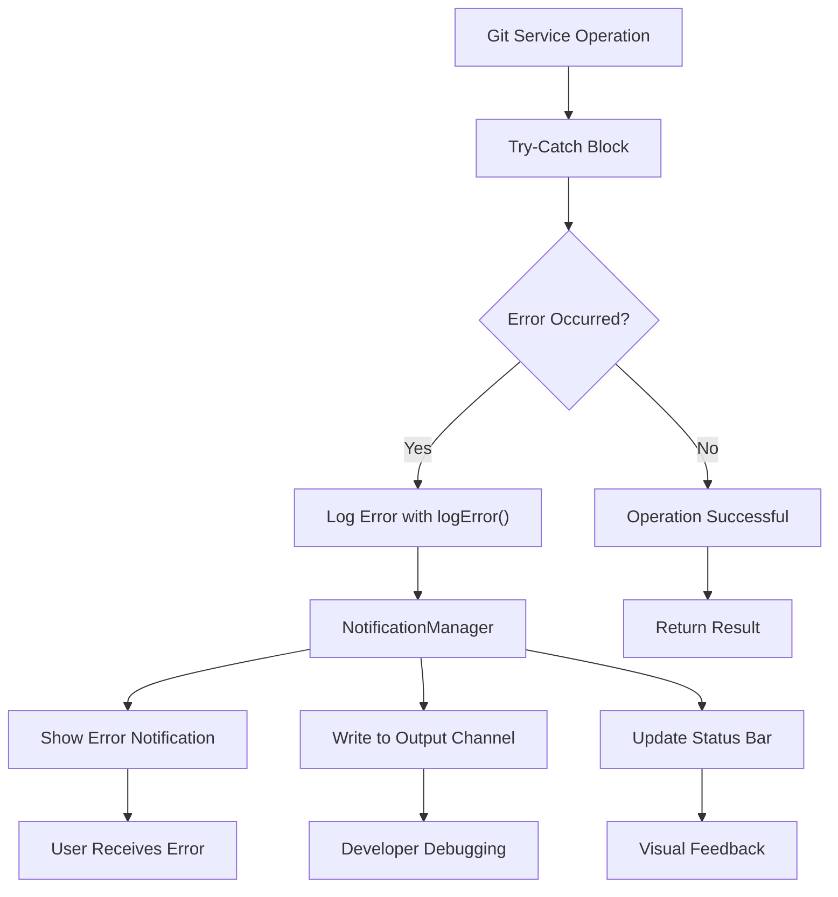
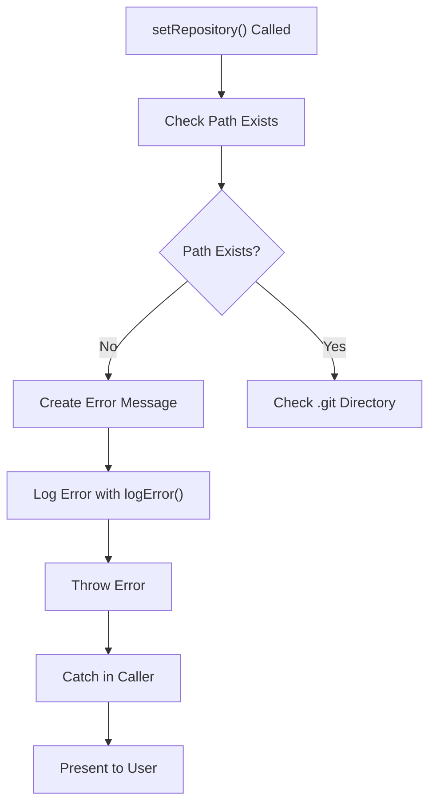
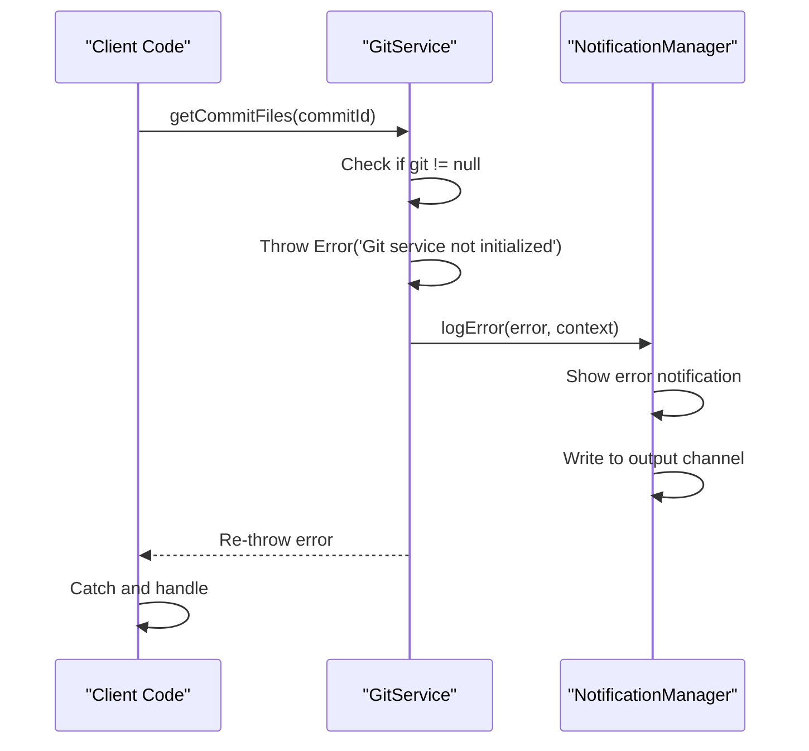
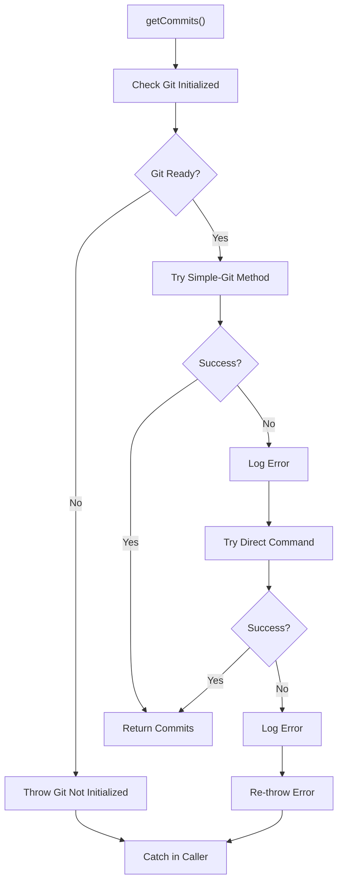
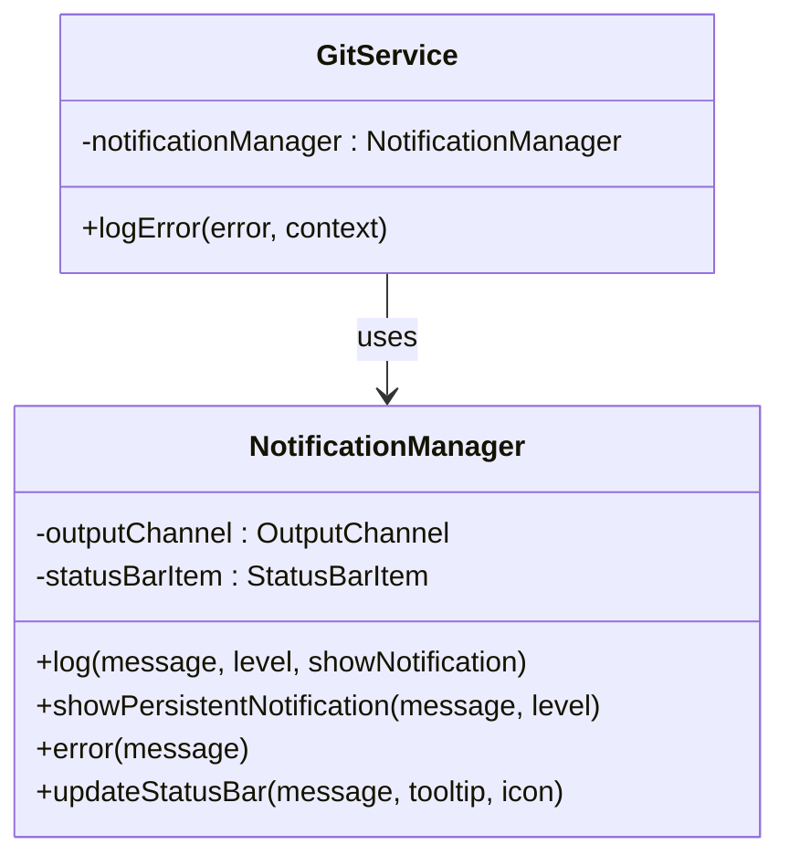

# Git Service Errors

<cite>
**Referenced Files in This Document**
- [gitService.ts](file://src/services/git/gitService.ts)
- [constants.ts](file://src/constants/constants.ts)
- [output.ts](file://src/i18n/en/output.ts)
- [notificationManager.ts](file://src/services/notification/notificationManager.ts)
- [reviewManager.ts](file://src/services/review/reviewManager.ts)
- [reviewPanel.ts](file://src/ui/views/reviewPanel.ts)
</cite>

## Table of Contents
1. [Introduction](#introduction)
2. [Error Handling Architecture](#error-handling-architecture)
3. [Repository Path Validation Errors](#repository-path-validation-errors)
4. [Git Service Initialization Errors](#git-service-initialization-errors)
5. [Commit Retrieval Failures](#commit-retrieval-failures)
6. [Error Localization and Management](#error-localization-and-management)
7. [Error Propagation Patterns](#error-propagation-patterns)
8. [Resolution Strategies](#resolution-strategies)
9. [Best Practices](#best-practices)
10. [Troubleshooting Guide](#troubleshooting-guide)

## Introduction

The CodeKarmic Git service implements a comprehensive error handling system designed to gracefully manage Git-related operations and provide meaningful feedback to users. The system handles various error scenarios including repository path validation, Git service initialization, commit retrieval failures, and file operations. All errors are processed through a centralized logging and notification system that supports localization and user-friendly error presentation.

## Error Handling Architecture

The Git service error handling follows a layered architecture with multiple components working together to provide robust error management:



**Diagram sources**
- [gitService.ts](file://src/services/git/gitService.ts#L1195-L1199)
- [notificationManager.ts](file://src/services/notification/notificationManager.ts#L107-L117)

**Section sources**
- [gitService.ts](file://src/services/git/gitService.ts#L1195-L1199)
- [notificationManager.ts](file://src/services/notification/notificationManager.ts#L79-L117)

## Repository Path Validation Errors

### Repository Path Does Not Exist (Lines 76-80)

The system performs strict validation of repository paths before attempting Git operations. When a repository path is invalid, the service throws a specific error with detailed messaging.

**Error Condition**: Repository path does not exist on the filesystem
**Error Message**: `Repository path does not exist: {repoPath}`
**Error Code**: `OUTPUT.GIT.FAILED_TO_SET_REPOSITORY`



**Diagram sources**
- [gitService.ts](file://src/services/git/gitService.ts#L75-L80)

### Missing .git Directory (Lines 83-88)

Even if the repository path exists, the presence of a `.git` directory is mandatory for Git operations. The service validates this requirement early in the initialization process.

**Error Condition**: Repository path exists but lacks `.git` directory
**Error Message**: `Not a git repository - .git directory not found in {repoPath}`
**Error Code**: `OUTPUT.GIT.FAILED_TO_SET_REPOSITORY`

**Section sources**
- [gitService.ts](file://src/services/git/gitService.ts#L75-L88)

## Git Service Initialization Errors

### Uninitialized Git Service (Lines 113-114)

Many Git operations require the service to be properly initialized with a valid repository. The system checks this condition before proceeding with operations.

**Error Condition**: Git service is not initialized (git instance is null)
**Error Message**: `Git service not initialized`
**Error Code**: Used internally for various operations



**Diagram sources**
- [gitService.ts](file://src/services/git/gitService.ts#L112-L114)
- [gitService.ts](file://src/services/git/gitService.ts#L1195-L1199)

### Repository Setting Failure (Lines 104-107)

When repository setting fails, the error is caught, logged, and re-thrown to allow higher-level components to handle it appropriately.

**Section sources**
- [gitService.ts](file://src/services/git/gitService.ts#L104-L107)
- [gitService.ts](file://src/services/git/gitService.ts#L112-L114)

## Commit Retrieval Failures

### General Commit Retrieval Errors

The system implements multiple fallback strategies for commit retrieval, with comprehensive error handling at each stage.



**Diagram sources**
- [gitService.ts](file://src/services/git/gitService.ts#L197-L241)

### Specific Error Cases

#### Failed to Get Commits (Lines 201-204)
**Error Condition**: Git service not initialized during commit retrieval
**Error Message**: `Git not initialized`
**Error Code**: `OUTPUT.GIT.FAILED_TO_GET_COMMITS`

#### Error Getting Commit Files (Lines 174-177)
**Error Condition**: Error occurs while retrieving commit file information
**Error Message**: Generated from `OUTPUT.GIT.ERROR_GETTING_COMMIT_FILES`
**Error Code**: `OUTPUT.GIT.ERROR_GETTING_COMMIT_FILES`

#### Error Checking Git Repository (Lines 192-194)
**Error Condition**: Error occurs while verifying repository status
**Error Message**: Generated from `OUTPUT.GIT.ERROR_CHECKING_GIT_REPOSITORY`
**Error Code**: `OUTPUT.GIT.ERROR_CHECKING_GIT_REPOSITORY`

**Section sources**
- [gitService.ts](file://src/services/git/gitService.ts#L197-L241)
- [gitService.ts](file://src/services/git/gitService.ts#L174-L177)
- [gitService.ts](file://src/services/git/gitService.ts#L192-L194)

## Error Localization and Management

### OUTPUT Constants Pattern

The system uses a centralized localization system through OUTPUT constants that provide internationalized error messages. These constants are used consistently across the application for error reporting.

| Error Category | Constant | Example Message |
|---------------|----------|-----------------|
| Repository Setting | `OUTPUT.GIT.FAILED_TO_SET_REPOSITORY` | "Failed to set repository" |
| Commit Retrieval | `OUTPUT.GIT.FAILED_TO_GET_COMMITS` | "Failed to get commits" |
| File Operations | `OUTPUT.GIT.ERROR_GETTING_COMMIT_FILES` | "Error getting commit files" |
| Git Status | `OUTPUT.GIT.ERROR_CHECKING_GIT_REPOSITORY` | "Error checking if git repository" |

### Notification Management

The NotificationManager handles error presentation through multiple channels:



**Diagram sources**
- [notificationManager.ts](file://src/services/notification/notificationManager.ts#L8-L29)
- [gitService.ts](file://src/services/git/gitService.ts#L1195-L1199)

**Section sources**
- [output.ts](file://src/i18n/en/output.ts#L52-L110)
- [notificationManager.ts](file://src/services/notification/notificationManager.ts#L79-L117)

## Error Propagation Patterns

### Try-Catch Implementation Pattern

The Git service follows a consistent try-catch pattern for error handling:

```typescript
// Example pattern from gitService.ts
public async getCommitFiles(commitId: string): Promise<CommitFile[]> {
    try {
        if (!this.git) {
            throw new Error('Git service not initialized');
        }
        
        // Operation logic here
        const diffSummary = await this.git.diffSummary([`${commitId}^`, commitId]);
        // More operations...
        
        return files;
    } catch (error) {
        this.logError(error as Error, OUTPUT.GIT.ERROR_GETTING_COMMIT_FILES);
        return [];
    }
}
```

### Error Recovery Strategies

The system implements multiple recovery strategies:

1. **Graceful Degradation**: Return empty results when operations fail
2. **Fallback Methods**: Try alternative approaches when primary methods fail
3. **Caching**: Cache successful results to avoid repeated failures
4. **Logging**: Comprehensive logging for debugging and monitoring

**Section sources**
- [gitService.ts](file://src/services/git/gitService.ts#L110-L177)
- [gitService.ts](file://src/services/git/gitService.ts#L197-L241)

## Resolution Strategies

### Repository Path Issues

**Problem**: Repository path does not exist
**Resolution Steps**:
1. Verify the workspace folder is properly opened in VS Code
2. Check that the repository path is correct and accessible
3. Ensure the user has appropriate permissions for the directory
4. Confirm the repository hasn't been moved or deleted

**Problem**: Missing .git directory
**Resolution Steps**:
1. Verify the directory is a valid Git repository
2. Check if the `.git` directory exists (may be hidden)
3. Run `git status` in the terminal to confirm repository status
4. Reinitialize the repository if necessary

### Git Service Initialization Issues

**Problem**: Git service not initialized
**Resolution Steps**:
1. Ensure the extension is properly activated
2. Verify a workspace folder is open
3. Check that the repository is properly configured
4. Restart the extension if problems persist

### Commit Retrieval Failures

**Problem**: Failed to retrieve commits
**Resolution Steps**:
1. Check network connectivity for remote repositories
2. Verify Git installation and PATH configuration
3. Test with a smaller repository to isolate issues
4. Clear cached commits and retry operation

**Section sources**
- [gitService.ts](file://src/services/git/gitService.ts#L75-L88)
- [gitService.ts](file://src/services/git/gitService.ts#L112-L114)

## Best Practices

### Error Handling Guidelines

1. **Specific Error Messages**: Use descriptive error messages that help users understand the problem
2. **Consistent Logging**: Maintain consistent logging patterns across all error scenarios
3. **User-Friendly Presentation**: Present errors in a way that's understandable to non-technical users
4. **Comprehensive Recovery**: Implement graceful degradation when operations fail
5. **Debug Information**: Include sufficient debug information for troubleshooting

### Code Examples

#### Proper Error Handling Pattern
```typescript
try {
    // Operation that might fail
    const result = await gitService.getCommitFiles(commitId);
    // Process result
} catch (error) {
    // Error is automatically logged and presented to user
    // Continue with graceful degradation
    const safeResult = [];
}
```

#### Custom Error Handling
```typescript
try {
    await gitService.setRepository(repoPath);
} catch (error) {
    // Handle specific error types
    if (error.message.includes('does not exist')) {
        vscode.window.showErrorMessage('Repository path not found');
    } else {
        vscode.window.showErrorMessage('Failed to initialize Git repository');
    }
}
```

## Troubleshooting Guide

### Common Error Scenarios

#### Repository Access Denied
**Symptoms**: Permission denied errors when accessing repository
**Solution**: 
- Check file system permissions
- Run VS Code as administrator (Windows)
- Verify Git is installed and accessible

#### Network Connectivity Issues
**Symptoms**: Remote repository operations failing
**Solution**:
- Check internet connection
- Verify proxy settings
- Test with local repository

#### Git Installation Problems
**Symptoms**: Git commands failing unexpectedly
**Solution**:
- Verify Git is installed (`git --version`)
- Check PATH environment variable
- Reinstall Git if necessary

### Debugging Techniques

1. **Enable Debug Mode**: Set NODE_ENV to development for detailed logging
2. **Check Output Channel**: Review CodeKarmic output channel for detailed error information
3. **Console Logging**: Use browser console for webview-related errors
4. **File System Verification**: Verify repository structure and permissions

### Monitoring and Maintenance

Regular monitoring should include:
- Error frequency tracking
- Performance impact assessment
- User feedback collection
- Automated health checks

**Section sources**
- [gitService.ts](file://src/services/git/gitService.ts#L1185-L1194)
- [notificationManager.ts](file://src/services/notification/notificationManager.ts#L123-L128)