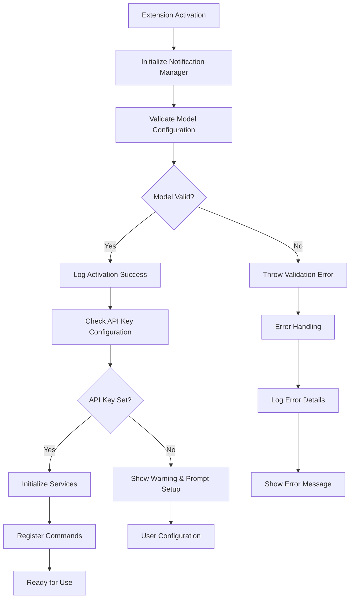
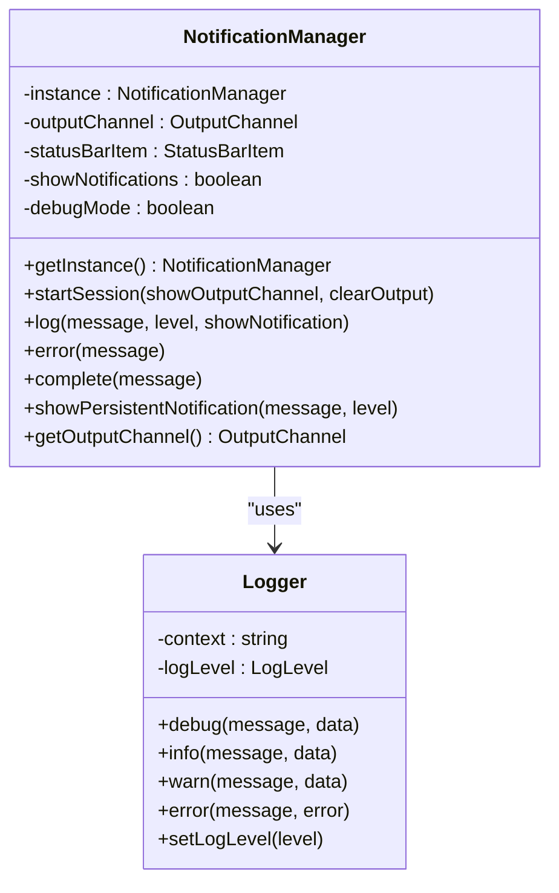
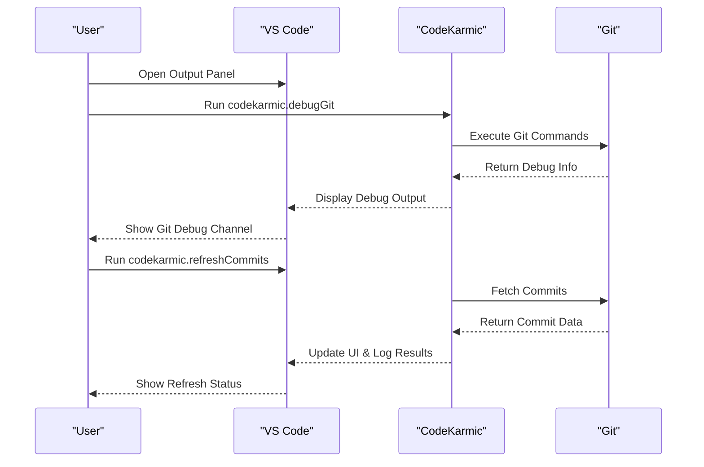

# Bug Reporting

<cite>
**Referenced Files in This Document**
- [package.json](file://package.json)
- [extension.ts](file://src/extension.ts)
- [logger.ts](file://src/utils/logger.ts)
- [notificationManager.ts](file://src/services/notification/notificationManager.ts)
- [gitService.ts](file://src/services/git/gitService.ts)
- [retryUtils.ts](file://src/utils/retryUtils.ts)
- [deepseek.ts](file://src/models/providers/deepseek.ts)
- [index.ts](file://src/i18n/index.ts)
- [README.md](file://README.md)
</cite>

## Table of Contents
1. [Introduction](#introduction)
2. [Understanding CodeKarmic's Diagnostic System](#understanding-codekarmics-diagnostic-system)
3. [Essential Information to Include](#essential-information-to-include)
4. [Step-by-Step Bug Report Process](#step-by-step-bug-report-process)
5. [Diagnostic Commands and Tools](#diagnostic-commands-and-tools)
6. [Well-Structured Bug Report Examples](#well-structured-bug-report-examples)
7. [Common Anti-Patterns to Avoid](#common-anti-patterns-to-avoid)
8. [Capturing Error Messages and Logs](#capturing-error-messages-and-logs)
9. [GitHub Issue Template](#github-issue-template)
10. [Troubleshooting Checklist](#troubleshooting-checklist)

## Introduction

Reporting bugs effectively for CodeKarmic is crucial for maintaining the quality and reliability of this AI-powered Git commit code review extension. This comprehensive guide will walk you through the process of creating detailed, actionable bug reports that help developers quickly identify and resolve issues.

CodeKarmic integrates with VS Code's built-in diagnostic systems and provides its own logging infrastructure to capture comprehensive information about errors and failures. Understanding these systems will enable you to provide the most helpful information when reporting bugs.

## Understanding CodeKarmic's Diagnostic System

CodeKarmic employs a multi-layered diagnostic approach that combines VS Code's native logging with the extension's specialized logging infrastructure.

### Extension Activation and Error Logging

The extension's activation process includes comprehensive error handling and logging mechanisms:



**Diagram sources**
- [extension.ts](file://src/extension.ts#L20-L520)

### Notification Management System

CodeKarmic uses a sophisticated notification management system that handles different types of messages and logging levels:



**Diagram sources**
- [notificationManager.ts](file://src/services/notification/notificationManager.ts#L8-L213)
- [logger.ts](file://src/utils/logger.ts#L18-L88)

**Section sources**
- [extension.ts](file://src/extension.ts#L20-L520)
- [notificationManager.ts](file://src/services/notification/notificationManager.ts#L8-L213)
- [logger.ts](file://src/utils/logger.ts#L18-L88)

## Essential Information to Include

When reporting bugs for CodeKarmic, you must provide comprehensive diagnostic information to help developers reproduce and resolve the issue efficiently.

### Required System Information

| Information Type | How to Obtain | Importance |
|------------------|---------------|------------|
| **Extension Version** | Check VS Code Extensions panel or `package.json` | Critical for identifying affected versions |
| **VS Code Version** | Help → About → Copy Version Info | Essential for compatibility analysis |
| **Operating System** | System settings or `uname -a` (Linux/macOS) | Platform-specific issues require OS context |
| **Node.js Version** | `node --version` in terminal | Runtime environment affects functionality |
| **Git Version** | `git --version` in terminal | Git-related issues depend on version |

### Extension-Specific Information

| Information Type | Command to Run | Purpose |
|------------------|----------------|---------|
| **Git Debug Information** | `codekarmic.debugGit` | Comprehensive Git repository diagnostics |
| **Commit Refresh Status** | `codekarmic.refreshCommits` | Test basic Git functionality |
| **API Key Status** | Check settings (`codekarmic.apiKey`) | Verify AI service configuration |
| **Model Configuration** | Check settings (`codekarmic.modelType`) | Confirm AI model selection |

### Log Collection Procedures

**Section sources**
- [package.json](file://package.json#L1-L311)
- [extension.ts](file://src/extension.ts#L20-L520)

## Step-by-Step Bug Report Process

### Step 1: Reproduce the Issue

Before reporting a bug, ensure you can consistently reproduce the problem:

1. **Document Exact Steps**: List each action taken leading to the error
2. **Test Different Scenarios**: Try variations to confirm reproducibility
3. **Isolate Variables**: Test with different repositories, files, and configurations

### Step 2: Gather Diagnostic Information

Run the appropriate diagnostic commands and collect relevant logs:



**Diagram sources**
- [extension.ts](file://src/extension.ts#L291-L324)
- [extension.ts](file://src/extension.ts#L609-L660)

### Step 3: Capture Error Messages

Pay attention to different types of error messages:

| Message Type | Location | Action Required |
|--------------|----------|-----------------|
| **Notification Dialogs** | VS Code popup windows | Take screenshots or copy text |
| **Status Bar Messages** | Bottom right corner | Hover to see full message |
| **Output Panel** | View → Output panel | Filter by "CodeKarmic" |
| **Terminal Output** | Integrated Terminal | Check for command-line errors |

### Step 4: Document Expected vs Actual Behavior

Clearly describe what should happen versus what actually happens:

- **Expected**: What you believe should occur
- **Actual**: What actually occurs
- **Impact**: How this affects your workflow

**Section sources**
- [extension.ts](file://src/extension.ts#L291-L324)
- [extension.ts](file://src/extension.ts#L609-L660)

## Diagnostic Commands and Tools

### Git Debug Command

The `codekarmic.debugGit` command provides comprehensive Git repository diagnostics:

**Command**: `codekarmic.debugGit`
**Purpose**: Diagnose Git repository issues and provide detailed repository information
**Output Location**: Git Debug Output Panel

**What It Shows**:
- Repository path and current branch
- Available branches
- Recent commit history
- Git configuration details

### Commit Refresh Command

The `codekarmic.refreshCommits` command tests basic Git functionality:

**Command**: `codekarmic.refreshCommits`
**Purpose**: Refresh commit data and test Git connectivity
**Behavior**: Shows loading indicator while fetching commits

### Manual Log Access

Access logs through VS Code's built-in mechanisms:

1. **Output Panel**: View → Output → Select "CodeKarmic" from dropdown
2. **Debug Console**: View → Debug Console
3. **Extensions Log**: Help → Toggle Developer Tools → Console tab

**Section sources**
- [extension.ts](file://src/extension.ts#L291-L324)
- [extension.ts](file://src/extension.ts#L609-L660)

## Well-Structured Bug Report Examples

### Example 1: API Key Configuration Issue

**Title**: "API Key validation fails silently with no error message"

**Description**:
When configuring the DeepSeek API key, the extension accepts invalid keys without providing feedback.

**Steps to Reproduce**:
1. Open VS Code settings
2. Navigate to CodeKarmic configuration
3. Enter invalid API key "invalid-key-123"
4. Press Enter to save
5. No error message appears, but review functionality fails

**Expected Behavior**:
- Clear error message indicating invalid API key
- Option to retry with correct key
- Validation feedback during typing

**Actual Behavior**:
- No visual indication of invalid key
- Code review commands fail silently
- Only error appears in Output panel

**Diagnostic Information**:
- Extension Version: 0.2.0
- VS Code Version: 1.85.0
- Operating System: Windows 11
- API Key entered: "invalid-key-123"
- Output panel shows: "Error validating API key: Invalid API key format"

**Additional Context**:
- Works fine with valid API keys
- Issue persists across VS Code restarts
- No error in Developer Tools console

### Example 2: Git Repository Detection Failure

**Title**: "Extension fails to detect Git repository in valid folder"

**Description**:
CodeKarmic incorrectly identifies a valid Git repository as not being a Git repository.

**Steps to Reproduce**:
1. Open folder containing Git repository
2. Click "Start Code Review"
3. Observe error message
4. Repository is confirmed to be Git via terminal commands

**Expected Behavior**:
- Extension recognizes Git repository
- Displays commit list in sidebar
- Allows code review functionality

**Actual Behavior**:
- Error message: "Not a Git repository"
- No commit data displayed
- Cannot perform code reviews

**Diagnostic Information**:
- Extension Version: 0.2.0
- VS Code Version: 1.85.0
- Operating System: macOS 13.6
- Repository path: `/Users/developer/projects/my-app`
- Git version: 2.39.2
- Debug output shows: "Repository path does not exist: /Users/developer/projects/my-app"

**Additional Context**:
- Git commands work fine in terminal
- Other Git extensions work correctly
- Folder permissions appear normal

### Example 3: Memory Usage Issue During Large Reviews

**Title**: "Extension crashes with memory error during large file review"

**Description**:
When reviewing large files (>1MB), the extension becomes unresponsive and eventually crashes.

**Steps to Reproduce**:
1. Open repository with large JavaScript file (~2MB)
2. Right-click file and select "Review with CodeKarmic"
3. Wait for review to complete
4. Observe memory usage spike and crash

**Expected Behavior**:
- Efficient handling of large files
- Progress indication during processing
- Graceful degradation for large files

**Actual Behavior**:
- Memory usage spikes to 4GB+
- VS Code becomes unresponsive
- Extension crashes with "Out of Memory" error
- Must restart VS Code to recover

**Diagnostic Information**:
- Extension Version: 0.2.0
- VS Code Version: 1.85.0
- Operating System: Linux Ubuntu 22.04 (16GB RAM)
- File size: 2,147,483 bytes
- Max file size setting: 100KB (default)
- Memory usage before review: ~500MB
- Memory usage peak: ~4.2GB

**Additional Context**:
- Review works fine for smaller files
- Same repository works for other users
- No issues with other large file editors

**Section sources**
- [extension.ts](file://src/extension.ts#L20-L520)
- [gitService.ts](file://src/services/git/gitService.ts#L45-L200)

## Common Anti-Patterns to Avoid

### Anti-Pattern 1: Vague Descriptions

**Bad**: "It doesn't work"
**Good**: "Code review fails with 'API key not configured' message when reviewing commit abc123def"

### Anti-Pattern 2: Missing Context

**Bad**: "Extension crashes"
**Good**: "Extension crashes when reviewing files larger than 100KB with 'Memory allocation failed' error"

### Anti-Pattern 3: Insufficient Reproduction Steps

**Bad**: "Can't review commits"
**Good**: 
1. Open repository with 50+ commits
2. Click "Start Code Review"
3. Select commit with hash abc123def
4. Click "Review Code"
5. Error occurs immediately

### Anti-Pattern 4: Ignoring Diagnostic Information

**Bad**: "Nothing happens when I click the button"
**Good**: 
- Screenshot of button click
- Output panel shows: "Error: Permission denied accessing .git directory"
- VS Code version: 1.85.0
- Operating system: Windows 11

### Anti-Pattern 5: Not Testing Alternatives

**Bad**: "Extension stopped working"
**Good**: 
- Confirmed issue persists after VS Code restart
- Tested with different repositories
- Verified API key configuration
- Checked for conflicting extensions

## Capturing Error Messages and Logs

### Method 1: Using the Output Panel

1. **Open Output Panel**: View → Output
2. **Select CodeKarmic**: Dropdown menu shows available channels
3. **Reproduce the Error**: Perform actions that trigger the bug
4. **Copy Log Entries**: Select and copy relevant log entries
5. **Export Logs**: Right-click → Export to File for detailed analysis

### Method 2: Taking Screenshots

1. **Capture Error Dialogs**: Full screen captures of error messages
2. **Status Bar Messages**: Hover over status indicators to see tooltips
3. **UI States**: Show before/after states when applicable
4. **Timing**: Include timestamps if possible

### Method 3: Using Developer Tools

1. **Open Developer Tools**: Help → Toggle Developer Tools
2. **Console Tab**: Monitor real-time error messages
3. **Network Tab**: Check API request failures
4. **Sources Tab**: Debug JavaScript execution

### Method 4: Exporting Diagnostic Data

**Section sources**
- [notificationManager.ts](file://src/services/notification/notificationManager.ts#L166-L169)
- [logger.ts](file://src/utils/logger.ts#L18-L88)

## GitHub Issue Template

Use this template when creating GitHub issues for CodeKarmic:

```markdown
---
name: Bug Report
about: Create a report to help us improve CodeKarmic
title: "[BUG] Brief description of the issue"
labels: bug
assignees: ''

---

## Describe the Bug
A clear and concise description of what the bug is.

## To Reproduce
Steps to reproduce the behavior:
1. Go to '...'
2. Click on '....'
3. Scroll down to '....'
4. See error

## Expected Behavior
A clear and concise description of what you expected to happen.

## Actual Behavior
A clear and concise description of what actually happens.

## Screenshots
If applicable, add screenshots to help explain your problem.

## Environment
- Extension Version: [e.g., 0.2.0]
- VS Code Version: [e.g., 1.85.0]
- Operating System: [e.g., Windows 11, macOS 13.6, Ubuntu 22.04]
- Node.js Version: [e.g., 18.17.1]
- Git Version: [e.g., 2.39.2]

## Additional Context
Add any other context about the problem here.

## Diagnostic Information
### Git Debug Output
```
Paste output from codekarmic.debugGit command here
```

### Error Logs
```
Paste relevant error messages from Output panel here
```

### API Configuration
- API Key configured: [Yes/No]
- Model Type: [e.g., gpt-4-turbo]
- OpenAI Host: [e.g., https://api.openai.com]
```

**Section sources**
- [package.json](file://package.json#L1-L311)
- [extension.ts](file://src/extension.ts#L20-L520)

## Troubleshooting Checklist

### Before Reporting
- [ ] Restart VS Code
- [ ] Check for extension updates
- [ ] Verify API key configuration
- [ ] Test with different repositories
- [ ] Disable conflicting extensions
- [ ] Check VS Code system requirements

### During Investigation
- [ ] Run `codekarmic.debugGit` command
- [ ] Run `codekarmic.refreshCommits` command
- [ ] Check Output panel for errors
- [ ] Verify Git repository accessibility
- [ ] Test with minimal repository setup

### When Reporting
- [ ] Include exact steps to reproduce
- [ ] Provide system and version information
- [ ] Attach relevant screenshots
- [ ] Export diagnostic logs
- [ ] Test potential fixes
- [ ] Verify issue is resolved

This comprehensive approach ensures that bug reports are actionable and help maintainers quickly identify and resolve issues in CodeKarmic.