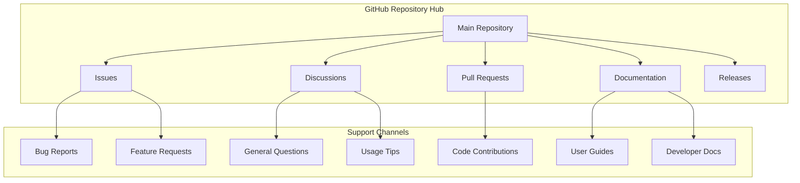

# Community Support

<cite>
**Referenced Files in This Document**
- [README.md](file://README.md)
- [package.json](file://package.json)
- [docs/en/user-guide.md](file://docs/en/user-guide.md)
- [docs/en/developer-guide.md](file://docs/en/developer-guide.md)
- [docs/project-structure.md](file://docs/project-structure.md)
- [docs/release-guide.md](file://docs/release-guide.md)
- [CHANGELOG.md](file://CHANGELOG.md)
- [src/utils/fileUtils.ts](file://src/utils/fileUtils.ts)
- [src/i18n/en/prompts.ts](file://src/i18n/en/prompts.ts)
- [src/i18n/zh/prompts.ts](file://src/i18n/zh/prompts.ts)
- [src/core/review/suggestionGenerator.ts](file://src/core/review/suggestionGenerator.ts)
</cite>

## Table of Contents
1. [Introduction](#introduction)
2. [GitHub Repository as the Primary Hub](#github-repository-as-the-primary-hub)
3. [Communication Channels](#communication-channels)
4. [Effective Participation Guidelines](#effective-participation-guidelines)
5. [Issue Reporting Best Practices](#issue-reporting-best-practices)
6. [Feature Request Process](#feature-request-process)
7. [Pull Request Contribution Guidelines](#pull-request-contribution-guidelines)
8. [Community Etiquette and Standards](#community-etiquette-and-standards)
9. [Support Resources](#support-resources)
10. [Troubleshooting Common Issues](#troubleshooting-common-issues)

## Introduction

CodeKarmic is an AI-powered code review assistant for VS Code derivatives that fosters an active and supportive community. As an open-source project, we rely on our community members to contribute ideas, report issues, share knowledge, and help improve the tool for everyone. This document serves as a comprehensive guide to navigating our community support ecosystem and participating effectively.

Our community thrives on collaboration, transparency, and mutual respect. Whether you're seeking help, reporting bugs, suggesting features, or contributing code, understanding our communication channels and best practices ensures productive interactions and faster resolution of issues.

## GitHub Repository as the Primary Hub

### Repository Structure and Accessibility

The CodeKarmic GitHub repository serves as the central hub for all community interactions, containing essential resources for users and contributors alike. The repository is structured to facilitate easy navigation and access to various support channels.



**Diagram sources**
- [README.md](file://README.md#L1-L24)
- [package.json](file://package.json#L7-L10)

### Repository Metadata and Configuration

The repository contains comprehensive metadata that establishes the foundation for community interaction:

- **Primary URL**: https://github.com/nesnilnehc/codekarmic
- **Package Name**: codekarmic
- **Publisher**: nesnilnehc
- **License**: MIT License
- **Supported VS Code Version**: ^1.85.0

**Section sources**
- [package.json](file://package.json#L1-L10)

## Communication Channels

### GitHub Issues: Bug Reports and Feature Requests

GitHub Issues serve as the primary mechanism for reporting bugs, requesting features, and tracking development tasks. This channel is specifically designed for actionable items that require engineering attention.

#### Purpose and Scope

- **Bug Reports**: Systematic documentation of software defects, crashes, or unexpected behavior
- **Feature Requests**: Proposals for new functionality or enhancements to existing features
- **Task Tracking**: Engineering work items, milestones, and development priorities

#### Issue Categories

| Category | Description | Example Scenarios |
|----------|-------------|-------------------|
| **Bug Report** | Software malfunction or crash | Extension fails to load, incorrect code analysis results |
| **Feature Request** | New functionality or enhancement | Support for additional programming languages, custom review templates |
| **Documentation** | Clarification or improvement needed | Missing setup instructions, unclear API documentation |
| **Performance** | Speed or resource usage concerns | Slow code review processing, high memory consumption |
| **Security** | Vulnerability or security concern | API key exposure, unauthorized access attempts |

### Discussions: General Questions and Usage Tips

GitHub Discussions provides a platform for community engagement, knowledge sharing, and collaborative problem-solving. Unlike Issues, Discussions focus on broader conversations and community support.

#### Discussion Categories

- **Q&A**: General questions about usage, configuration, and best practices
- **Show and Tell**: Sharing experiences, configurations, and success stories
- **Ideas**: Brainstorming new features and improvements
- **Help Wanted**: Seeking assistance with specific challenges
- **General**: Open forum for community conversation

#### When to Use Discussions

- **Getting Started**: First-time user questions about installation and basic setup
- **Configuration Help**: Assistance with API keys, model selection, and preferences
- **Best Practices**: Sharing and learning optimal usage patterns
- **Troubleshooting**: Exploring solutions to common problems
- **Community Building**: Connecting with other users and contributors

### Pull Requests: Code Contributions

Pull Requests represent the formal mechanism for submitting code changes, bug fixes, and feature additions to the CodeKarmic project. This channel facilitates collaborative development and maintains code quality standards.

#### Contribution Types

- **Bug Fixes**: Corrections for identified issues
- **New Features**: Implementation of approved feature requests
- **Documentation Improvements**: Enhancements to guides and references
- **Refactoring**: Code organization and optimization efforts
- **Testing**: Addition or improvement of test coverage

**Section sources**
- [docs/en/developer-guide.md](file://docs/en/developer-guide.md#L60-L66)

## Effective Participation Guidelines

### Search-Before-Posting Practices

Before creating new issues or discussions, community members should conduct thorough research to avoid duplicates and ensure efficient use of community resources.

#### Research Checklist

1. **Issue Search**: Search existing GitHub Issues for similar problems or requests
2. **Discussion Search**: Browse GitHub Discussions for related conversations
3. **Documentation Review**: Check README, user guides, and FAQ sections
4. **Previous Solutions**: Review closed issues for resolved similar problems
5. **Community Guidelines**: Understand submission expectations and requirements

#### Search Strategies

- Use specific keywords related to your issue or question
- Include version numbers and environment details in searches
- Search both open and closed items for comprehensive coverage
- Utilize GitHub's advanced search filters when necessary

### Proper Issue Categorization

Accurate categorization ensures issues reach the appropriate audience and receive timely attention.

#### Issue Template Guidelines

When creating new issues, follow these structural guidelines:

1. **Clear Title**: Concise description of the problem or request
2. **Environment Details**: Operating system, VS Code version, CodeKarmic version
3. **Steps to Reproduce**: Detailed reproduction steps for bugs
4. **Expected Behavior**: What should happen under normal circumstances
5. **Actual Behavior**: What actually occurs
6. **Additional Context**: Screenshots, error messages, and relevant information

### Community Etiquette and Engagement

#### Respectful Communication

- **Be Constructive**: Focus on solutions rather than criticism
- **Stay On Topic**: Keep discussions relevant to the current thread
- **Be Patient**: Allow time for responses from community members
- **Acknowledge Efforts**: Thank contributors for their time and expertise

#### Collaboration Principles

- **Share Knowledge**: Help others by sharing solutions and insights
- **Ask Clear Questions**: Provide sufficient context for effective responses
- **Provide Feedback**: Acknowledge helpful responses and thank contributors
- **Follow Up**: Update issues with new information or resolutions

## Issue Reporting Best Practices

### Providing Reproducible Examples

High-quality bug reports significantly increase the likelihood of swift resolution. Reproducibility is key to understanding and fixing issues.

#### Essential Information to Include

1. **Environment Setup**
   - Operating System and version
   - VS Code version and build number
   - CodeKarmic extension version
   - Node.js version (for development issues)

2. **Step-by-Step Reproduction**
   - Precise actions leading to the issue
   - Specific file types and sizes involved
   - Git repository configuration and state
   - API key and model settings

3. **Expected vs. Actual Results**
   - Clear description of intended behavior
   - Detailed account of observed problems
   - Error messages and stack traces

4. **Additional Context**
   - Screenshots or screen recordings
   - Log files and console output
   - Configuration files and settings

### Environment Details Collection

Systematic collection of environment information ensures accurate diagnosis and prevents unnecessary back-and-forth communication.

#### Environment Information Checklist

- **Operating System**: Windows 11, macOS 14.0, Ubuntu 22.04
- **VS Code Version**: 1.85.0 or later
- **Extension Version**: 0.2.0 or specific version
- **API Configuration**: DeepSeek API key setup status
- **Network Connectivity**: Internet access and proxy settings
- **File System**: Local vs. network-mounted repositories

### Debug Information Gathering

For complex issues, collecting debug information streamlines the troubleshooting process.

#### Debug Commands and Output

- **Extension Activation Logs**: Check VS Code output panel
- **Git Integration Status**: Verify Git repository accessibility
- **API Connectivity**: Test API endpoint responsiveness
- **File Permissions**: Confirm read/write access to repository files

**Section sources**
- [docs/en/user-guide.md](file://docs/en/user-guide.md#L48-L52)

## Feature Request Process

### Proposal Structure and Requirements

Well-crafted feature requests demonstrate thoughtful consideration and increase the likelihood of successful implementation.

#### Feature Request Template

1. **Problem Statement**
   - Describe the current limitation or pain point
   - Explain the impact on workflow and productivity
   - Provide real-world scenarios where the feature would help

2. **Proposed Solution**
   - Detailed description of the desired functionality
   - Expected behavior and user interaction patterns
   - Technical feasibility and implementation considerations

3. **Alternatives Considered**
   - Existing workarounds or third-party solutions
   - Comparison with alternative approaches
   - Trade-offs and limitations of proposed solution

4. **Implementation Details**
   - Technical requirements and dependencies
   - User interface considerations
   - Backward compatibility implications

### Community Feedback and Iteration

Feature development benefits from community input and iterative refinement.

#### Feedback Mechanisms

- **Discussion Threads**: Engage with community members in GitHub Discussions
- **Prototype Reviews**: Share early implementations for validation
- **User Testing**: Invite community members to test beta features
- **Iterative Improvement**: Incorporate feedback into subsequent iterations

### Priority Consideration

Feature requests are evaluated based on community interest, technical feasibility, and alignment with project goals.

#### Evaluation Criteria

- **Community Demand**: Number of upvotes and discussion participants
- **Technical Complexity**: Implementation effort and maintenance burden
- **Strategic Alignment**: Fit with project vision and roadmap
- **Resource Availability**: Contributor capacity and timeline considerations

## Pull Request Contribution Guidelines

### Development Workflow

Contributors should follow established development practices to ensure code quality and maintainability.

#### Pre-Development Steps

1. **Fork and Clone**: Create personal fork and local development environment
2. **Branch Creation**: Establish feature or fix branch from main
3. **Setup Environment**: Configure development tools and dependencies
4. **Initial Testing**: Verify baseline functionality works correctly

#### Development Standards

- **Code Quality**: Adhere to existing coding standards and conventions
- **Testing**: Implement comprehensive unit and integration tests
- **Documentation**: Update relevant documentation for new features
- **Commit Messages**: Use clear, descriptive commit messages

### Code Review Process

Pull requests undergo systematic review to maintain code quality and project standards.

#### Review Criteria

1. **Functionality**: Does the code achieve the intended purpose?
2. **Quality**: Is the code clean, readable, and maintainable?
3. **Testing**: Are adequate tests included and passing?
4. **Documentation**: Is the code properly documented?
5. **Compatibility**: Does it maintain backward compatibility?

#### Review Workflow

1. **Automated Checks**: CI/CD pipeline validation
2. **Peer Review**: Community member evaluation
3. **Maintainer Review**: Core team assessment
4. **Iteration**: Address feedback and resubmit
5. **Approval**: Final sign-off for merging

### Testing and Validation

Comprehensive testing ensures reliability and prevents regression issues.

#### Test Categories

- **Unit Tests**: Individual component functionality
- **Integration Tests**: Component interactions and workflows
- **End-to-End Tests**: Complete user scenarios
- **Performance Tests**: Load and stress testing

**Section sources**
- [docs/en/developer-guide.md](file://docs/en/developer-guide.md#L46-L57)

## Community Etiquette and Standards

### Code of Conduct Foundation

While the repository doesn't explicitly include a separate Code of Conduct document, the project follows standard open-source community norms and expects respectful interaction among all participants.

#### Core Principles

- **Inclusivity**: Welcoming to contributors of all backgrounds and experience levels
- **Professionalism**: Maintaining respectful and constructive communication
- **Collaboration**: Working together toward shared project goals
- **Transparency**: Open communication about decisions and processes

### Communication Standards

#### Written Communication Guidelines

- **Clarity**: Use clear, concise language in all communications
- **Patience**: Allow time for thoughtful responses from community members
- **Constructiveness**: Focus on solutions rather than problems
- **Professionalism**: Maintain respectful tone in all interactions

#### Technical Communication

- **Specificity**: Provide detailed information for technical discussions
- **Context**: Include relevant background information
- **Evidence**: Support claims with data, examples, or references
- **Verification**: Confirm facts and test assumptions

### Conflict Resolution

When disagreements arise, the community follows established conflict resolution principles.

#### Resolution Approach

1. **Open Dialogue**: Encourage direct, respectful communication
2. **Mediation**: Involve community moderators when necessary
3. **Consensus Building**: Seek mutually acceptable solutions
4. **Decision Making**: Follow established governance processes

### Recognition and Appreciation

Acknowledging community contributions fosters positive engagement and encourages continued participation.

#### Ways to Recognize Contributions

- **Thank Contributors**: Express gratitude for helpful responses and contributions
- **Highlight Achievements**: Publicly acknowledge significant contributions
- **Mentorship**: Support new contributors with guidance and encouragement
- **Community Building**: Foster welcoming environment for all participants

## Support Resources

### Documentation and Learning Materials

Comprehensive documentation serves as the primary support resource for users and contributors.

#### Available Documentation

1. **User Guides**
   - [English User Guide](file://docs/en/user-guide.md)
   - [Chinese User Guide](file://docs/zh-CN/user-guide.md)
   - Installation and setup instructions
   - Feature explanations and usage examples

2. **Developer Documentation**
   - [English Developer Guide](file://docs/en/developer-guide.md)
   - [Chinese Developer Guide](file://docs/zh-CN/developer-guide.md)
   - Architecture explanations and technical details
   - Contribution guidelines and development setup

3. **Project Structure**
   - [Project Structure Documentation](file://docs/project-structure.md)
   - Code organization and naming conventions
   - Technical specifications and standards

4. **Release Information**
   - [Release Guide](file://docs/release-guide.md)
   - Version management and publishing process
   - Change tracking and update procedures

### Frequently Asked Questions

Common questions often arise regarding installation, configuration, and basic usage.

#### Common Installation Issues

- **API Key Setup**: How to configure DeepSeek API credentials
- **Extension Loading**: Troubleshooting extension activation problems
- **Permission Issues**: File system access and security restrictions
- **Version Compatibility**: VS Code version requirements and updates

#### Configuration Challenges

- **Model Selection**: Choosing appropriate AI models for different use cases
- **Performance Tuning**: Optimizing settings for large repositories
- **Language Support**: Understanding supported programming languages
- **Customization Options**: Available configuration parameters and their effects

### Getting Help Beyond GitHub

While GitHub serves as the primary support channel, additional resources are available for comprehensive assistance.

#### Alternative Support Channels

- **VS Code Marketplace**: Extension-specific support and ratings
- **Community Forums**: Third-party discussion platforms
- **Social Media**: Project announcements and community updates
- **Official Website**: Project information and documentation

**Section sources**
- [README.md](file://README.md#L16-L20)

## Troubleshooting Common Issues

### Installation and Setup Problems

Many initial issues stem from configuration problems or environment setup challenges.

#### API Configuration Issues

**Problem**: Extension fails to activate or produces API errors
**Solution**: Verify DeepSeek API key configuration and network connectivity

**Problem**: Incorrect model selection causing poor results
**Solution**: Review supported models and adjust configuration accordingly

#### Environment Compatibility

**Problem**: Extension not loading in specific VS Code versions
**Solution**: Check minimum version requirements and update if necessary

**Problem**: Performance issues with large repositories
**Solution**: Adjust file filtering settings and review performance options

### Runtime and Functional Issues

#### Code Review Problems

**Problem**: Incomplete or inaccurate code analysis
**Solution**: Verify file types are supported and repository is properly configured

**Problem**: Missing suggestions or empty review results
**Solution**: Check API quota limits and ensure proper prompt formatting

#### User Interface Issues

**Problem**: Review panel not displaying correctly
**Solution**: Reset VS Code layout and verify extension activation

**Problem**: Command palette not showing available commands
**Solution**: Restart VS Code and verify extension installation

### Advanced Troubleshooting

#### Debug Mode Activation

Enable debug mode to gather detailed diagnostic information:

```json
{
  "codekarmic.debugMode": true
}
```

#### Log Analysis

Review VS Code output panel for detailed error messages and stack traces.

#### Network and Connectivity

Verify internet connectivity and API endpoint accessibility.

**Section sources**
- [docs/en/user-guide.md](file://docs/en/user-guide.md#L48-L52)
- [src/services/review/reviewManager.ts](file://src/services/review/reviewManager.ts#L90-L109)

## Conclusion

CodeKarmic's community support ecosystem provides multiple pathways for users and contributors to engage effectively. By understanding and utilizing our communication channels appropriately, community members can maximize their experience while contributing to the project's continued success.

The GitHub repository serves as the central hub for all interactions, with Issues for actionable engineering tasks, Discussions for community engagement, and Pull Requests for code contributions. Following established guidelines for search-before-posting, proper categorization, and respectful communication ensures productive interactions and faster resolution of issues.

Whether you're reporting bugs, requesting features, seeking help, or contributing code, understanding these community support mechanisms enables you to participate effectively and contribute to building a stronger, more capable CodeKarmic ecosystem. The project's commitment to open-source collaboration, combined with clear communication channels and comprehensive documentation, creates an environment where all community members can thrive and contribute to the project's ongoing evolution.