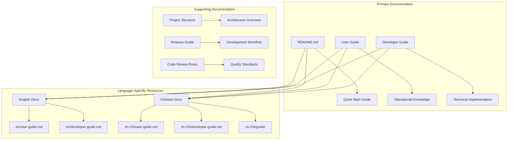
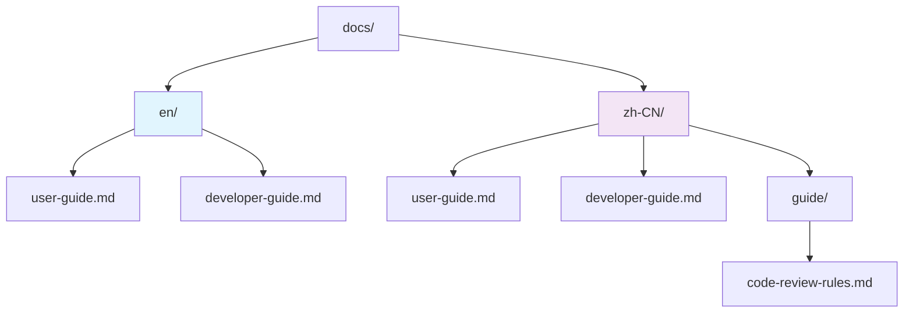

# Documentation Resources

<cite>
**Referenced Files in This Document**
- [README.md](file://README.md)
- [package.json](file://package.json)
- [docs/en/user-guide.md](file://docs/en/user-guide.md)
- [docs/en/developer-guide.md](file://docs/en/developer-guide.md)
- [docs/zh-CN/user-guide.md](file://docs/zh-CN/user-guide.md)
- [docs/zh-CN/developer-guide.md](file://docs/zh-CN/developer-guide.md)
- [docs/zh-CN/guide/code-review-rules.md](file://docs/zh-CN/guide/code-review-rules.md)
- [docs/project-structure.md](file://docs/project-structure.md)
- [docs/release-guide.md](file://docs/release-guide.md)
- [CHANGELOG.md](file://CHANGELOG.md)
</cite>

## Table of Contents
1. [Introduction](#introduction)
2. [Documentation Overview](#documentation-overview)
3. [Learning Progression Roadmap](#learning-progression-roadmap)
4. [Available Documentation Resources](#available-documentation-resources)
5. [Language Organization](#language-organization)
6. [Version Information](#version-information)
7. [Contribution Guidelines](#contribution-guidelines)
8. [Key Sections and References](#key-sections-and-references)
9. [Troubleshooting and Support](#troubleshooting-and-support)
10. [Best Practices](#best-practices)

## Introduction

CodeKarmic provides comprehensive documentation resources designed to support users and developers at every stage of their journey with the AI-powered code review extension. The documentation ecosystem is carefully structured to accommodate different learning styles and technical expertise levels, ensuring that both end-users and contributors can effectively utilize and enhance the platform.

The documentation serves multiple audiences: end-users seeking operational guidance, developers requiring technical implementation details, and contributors wanting to improve or extend the platform. Each documentation resource is tailored to specific needs while maintaining consistency across languages and topics.

## Documentation Overview

CodeKarmic maintains a well-organized documentation structure that spans multiple languages and covers various aspects of the platform. The documentation ecosystem consists of primary guides, specialized resources, and supporting materials that collectively provide comprehensive coverage of the extension's capabilities and development processes.

**Diagram sources**
- [README.md](file://README.md#L1-L24)
- [docs/en/user-guide.md](file://docs/en/user-guide.md#L1-L60)
- [docs/en/developer-guide.md](file://docs/en/developer-guide.md#L1-L74)
- [docs/zh-CN/user-guide.md](file://docs/zh-CN/user-guide.md#L1-L60)
- [docs/zh-CN/developer-guide.md](file://docs/zh-CN/developer-guide.md#L1-L104)

## Learning Progression Roadmap

The documentation is structured to support a logical learning progression that guides users from initial setup through advanced customization and contribution. This roadmap ensures that users build foundational knowledge progressively while accessing appropriate resources for their specific needs.

### Phase 1: Quick Setup and Basic Usage
**Primary Resource**: [README.md](file://README.md#L1-L24)

Begin with the README file for immediate access to essential setup information and basic usage instructions. This foundational document provides the quickest path to getting started with CodeKarmic, covering installation, initial configuration, and fundamental operations.

**Key Learning Outcomes**:
- Understanding of CodeKarmic's purpose and capabilities
- Basic installation and configuration steps
- Familiarity with core commands and interface elements
- Awareness of prerequisite requirements and system compatibility

### Phase 2: Operational Knowledge and Advanced Features
**Primary Resource**: [User Guide](file://docs/en/user-guide.md#L1-L60)

Progress to the comprehensive user guide for detailed operational knowledge. This guide covers advanced features, configuration options, and best practices for effective code review workflows.

**Key Learning Outcomes**:
- Mastery of advanced command usage and shortcuts
- Understanding of configuration options and customization
- Proficiency in review processes and report generation
- Knowledge of troubleshooting techniques and problem resolution

### Phase 3: Technical Implementation and Extension Development
**Primary Resource**: [Developer Guide](file://docs/en/developer-guide.md#L1-L74)

For users interested in technical implementation, extension development, or contributing to the project, the developer guide provides comprehensive technical documentation covering architecture, development setup, and contribution guidelines.

**Key Learning Outcomes**:
- Understanding of CodeKarmic's internal architecture and component relationships
- Ability to set up development environments and build processes
- Knowledge of testing methodologies and quality assurance practices
- Skills for extending functionality and contributing to the codebase

**Section sources**
- [README.md](file://README.md#L1-L24)
- [docs/en/user-guide.md](file://docs/en/user-guide.md#L1-L60)
- [docs/en/developer-guide.md](file://docs/en/developer-guide.md#L1-L74)

## Available Documentation Resources

CodeKarmic maintains a comprehensive collection of documentation resources that serve different purposes and audiences. Each resource is designed to address specific informational needs while maintaining consistency and accessibility across the platform.

### Primary Documentation Resources

| Resource | Purpose | Target Audience | Key Topics |
|----------|---------|-----------------|------------|
| README.md | Quick start and overview | New users, general audience | Installation, basic usage, project overview |
| User Guide | Complete operational guidance | End users, power users | Features, configuration, workflows |
| Developer Guide | Technical implementation details | Developers, contributors | Architecture, development setup, APIs |
| Project Structure | Code organization and standards | Developers, maintainers | Directory structure, naming conventions, coding standards |

### Specialized Documentation

| Resource | Purpose | Target Audience | Content Focus |
|----------|---------|-----------------|---------------|
| Code Review Rules | Quality standards and best practices | Developers, teams | Coding standards, testing requirements, security |
| Release Guide | Development and publishing workflow | Maintainers, contributors | Release process, version management, distribution |
| Language-Specific Guides | Localized operational guidance | Multilingual users | Regional features, localized workflows |

### Documentation Categories

The documentation is organized into several categories that serve different informational needs:

**Getting Started Category**: Provides immediate access to essential information for new users and quick reference materials.

**Operational Category**: Contains detailed guides for daily use, feature exploration, and workflow optimization.

**Technical Category**: Offers comprehensive technical documentation for developers, architects, and contributors.

**Quality Assurance Category**: Includes standards, guidelines, and best practices for maintaining code quality and development excellence.

**Maintenance Category**: Covers ongoing support, troubleshooting, and long-term maintenance considerations.

**Section sources**
- [README.md](file://README.md#L1-L24)
- [docs/en/user-guide.md](file://docs/en/user-guide.md#L1-L60)
- [docs/en/developer-guide.md](file://docs/en/developer-guide.md#L1-L74)
- [docs/zh-CN/user-guide.md](file://docs/zh-CN/user-guide.md#L1-L60)
- [docs/zh-CN/developer-guide.md](file://docs/zh-CN/developer-guide.md#L1-L104)
- [docs/project-structure.md](file://docs/project-structure.md#L1-L123)

## Language Organization

CodeKarmic maintains a sophisticated multilingual documentation system that supports both English and Chinese languages, with plans for additional language expansion. The language organization follows a structured approach that ensures consistency while accommodating regional preferences and requirements.

### Directory Structure

The documentation is organized within the `docs/` directory using a language-based separation approach:

**Diagram sources**
- [docs/project-structure.md](file://docs/project-structure.md#L8-L17)

### Language Coverage

**English Documentation (en/)**
- Primary user guide for international users
- Technical developer documentation
- Global accessibility and reach
- Standardized technical terminology

**Chinese Documentation (zh-CN/)**
- Comprehensive local support for Chinese-speaking users
- Cultural adaptation of technical concepts
- Localized examples and workflows
- Integration with regional development practices

**Specialized Chinese Content**
- Code review rules and quality standards
- Region-specific development guidelines
- Cultural considerations for technical communication

### Translation and Localization Strategy

The documentation employs a translation-first approach where core functionality and user-facing features are documented in English, while specialized content and cultural adaptations are provided in Chinese. This strategy ensures technical consistency while accommodating regional preferences and requirements.

**Section sources**
- [docs/en/user-guide.md](file://docs/en/user-guide.md#L1-L60)
- [docs/en/developer-guide.md](file://docs/en/developer-guide.md#L1-L74)
- [docs/zh-CN/user-guide.md](file://docs/zh-CN/user-guide.md#L1-L60)
- [docs/zh-CN/developer-guide.md](file://docs/zh-CN/developer-guide.md#L1-L104)
- [docs/zh-CN/guide/code-review-rules.md](file://docs/zh-CN/guide/code-review-rules.md#L1-L109)

## Version Information

CodeKarmic maintains strict version alignment between documentation and software releases to ensure users access accurate, up-to-date information. The versioning system provides clear traceability and helps users verify they are consulting the correct documentation version for their installed software.

### Current Version Details

Based on the package.json configuration, CodeKarmic is currently at version **0.2.0**, with specific version information maintained across all documentation resources.

### Version Tracking Mechanism

The version information is centralized in the package.json file and propagated to documentation through several mechanisms:

**Package.json Version Source**: The authoritative version source that drives all version-related decisions and updates.

**Documentation Version Alignment**: All documentation resources reference the current package.json version to ensure consistency.

**Changelog Integration**: Version-specific changes and updates are documented in the CHANGELOG.md file, providing historical context and evolution tracking.

### Version Compatibility Matrix

| Component | Version | Status | Notes |
|-----------|---------|--------|-------|
| Current Release | 0.2.0 | Active | Latest stable version |
| Documentation | 0.2.0 | Up-to-date | Aligned with current release |
| Development | 0.2.0 | In Progress | Unreleased features included |
| Previous Releases | 0.1.0 | Historical | Legacy documentation available |

### Version Management Best Practices

**Documentation Versioning**: Every documentation update is aligned with corresponding software releases to maintain accuracy and prevent confusion.

**Feature Documentation**: New features are documented alongside their implementation, ensuring comprehensive coverage from launch.

**Breaking Change Communication**: Significant changes are clearly documented in version changelogs with migration guidance.

**Historical Documentation**: Previous versions maintain accessible documentation for users who may be using older releases.

**Section sources**
- [package.json](file://package.json#L5-L5)
- [CHANGELOG.md](file://CHANGELOG.md#L28-L92)

## Contribution Guidelines

CodeKarmic welcomes contributions to documentation improvements through a structured process that ensures quality, consistency, and alignment with project goals. The contribution system is designed to facilitate community involvement while maintaining high standards for documentation quality.

### Contribution Process

**Step 1: Identify Improvement Opportunities**
- Review existing documentation for gaps or inaccuracies
- Identify areas needing clarification or enhancement
- Consider user feedback and common questions

**Step 2: Prepare Documentation Updates**
- Follow established writing guidelines and style standards
- Ensure technical accuracy and clarity
- Maintain consistency with existing documentation style

**Step 3: Submit Pull Requests**
- Use descriptive commit messages and PR titles
- Provide clear rationale for proposed changes
- Include relevant examples and supporting evidence

### Documentation Quality Standards

**Content Accuracy**: All technical information must be verified for accuracy and currency.

**Clarity and Accessibility**: Documentation should be written for diverse audiences with varying technical backgrounds.

**Consistency**: Maintain consistent terminology, formatting, and style across all documentation.

**Completeness**: Ensure comprehensive coverage of topics without unnecessary complexity.

### Contribution Areas

**User Documentation Improvements**:
- Clarification of existing features and workflows
- Addition of screenshots and visual aids
- Enhancement of troubleshooting sections
- Expansion of frequently asked questions

**Technical Documentation Enhancements**:
- Architectural diagrams and flow charts
- API reference updates
- Development setup instructions
- Testing and debugging guides

**Multilingual Support**:
- Translation of existing content to additional languages
- Cultural adaptation of technical concepts
- Localization of examples and workflows

**Quality Assurance Documentation**:
- Testing procedures and methodologies
- Code review processes and standards
- Performance optimization guidelines
- Security best practices

### Review and Approval Process

All documentation contributions undergo a review process that ensures quality and alignment with project standards. The review process includes technical accuracy verification, style consistency checks, and community feedback incorporation.

**Section sources**
- [docs/en/developer-guide.md](file://docs/en/developer-guide.md#L60-L74)
- [docs/zh-CN/developer-guide.md](file://docs/zh-CN/developer-guide.md#L60-L104)

## Key Sections and References

CodeKarmic documentation includes several key sections that provide essential information for different aspects of using and developing with the platform. These sections serve as primary references for specific functionality, configuration options, and operational procedures.

### Configuration Options Reference

The configuration system provides extensive customization capabilities through VS Code settings and environment variables. Key configuration areas include:

**API Configuration**:
- DeepSeek API key management and security
- Alternative AI provider integration
- Rate limiting and request optimization

**Feature Configuration**:
- File filtering and exclusion patterns
- Review depth and analysis settings
- Notification and alert preferences

**Interface Configuration**:
- Language and localization settings
- Theme and appearance preferences
- Keyboard shortcuts and command customization

### Command Reference

CodeKarmic provides a comprehensive set of commands accessible through the VS Code command palette and keyboard shortcuts. The command system is designed for efficiency and discoverability.

**Core Commands**:
- `CodeKarmic: Start Code Review` - Primary review initiation
- `CodeKarmic: Configure API Key` - Authentication setup
- `CodeKarmic: Generate Report` - Report creation and export
- `CodeKarmic: Refresh Commits` - Data synchronization

**Navigation Commands**:
- `CodeKarmic: Toggle Pane` - Interface visibility control
- `CodeKarmic: Filter by Date Range` - Temporal filtering
- `CodeKarmic: Filter by Commit ID` - Specific commit targeting

**Utility Commands**:
- `CodeKarmic: Select AI Model` - Model selection and switching
- `CodeKarmic: Open Settings` - Configuration access
- `CodeKarmic: Debug Git` - Diagnostic functionality

### Troubleshooting and Problem Resolution

The documentation includes comprehensive troubleshooting sections that address common issues and provide systematic problem-solving approaches.

**Common Issues and Solutions**:
- API connectivity problems and authentication failures
- Performance issues with large repositories
- Interface and display problems
- Integration conflicts with other extensions

**Diagnostic Procedures**:
- Log analysis and error interpretation
- System compatibility verification
- Configuration validation and correction
- Network and connectivity troubleshooting

### Architecture and Technical References

For developers and advanced users, the documentation provides detailed technical references covering system architecture, component relationships, and implementation details.

**System Architecture**:
- Component interaction diagrams
- Data flow and processing pipelines
- Integration patterns and external dependencies
- Scalability and performance considerations

**API and Extension Interfaces**:
- VS Code extension API integration
- AI service integration patterns
- Git service abstraction layers
- Event handling and notification systems

**Section sources**
- [package.json](file://package.json#L118-L208)
- [docs/en/user-guide.md](file://docs/en/user-guide.md#L31-L39)
- [docs/zh-CN/user-guide.md](file://docs/zh-CN/user-guide.md#L31-L39)

## Troubleshooting and Support

CodeKarmic provides multiple channels and resources for troubleshooting issues and obtaining support when encountering problems with the extension. The support system is designed to address common issues efficiently while providing pathways for more complex problems.

### Self-Service Troubleshooting

**Common Issue Resolution**:
- API key configuration problems
- Git integration failures
- Performance optimization techniques
- Interface and display issues

**Diagnostic Tools and Techniques**:
- Built-in debug functionality
- Log analysis and error reporting
- System compatibility checking
- Configuration validation procedures

### Support Channels

**GitHub Issues**:
- Primary channel for bug reports and feature requests
- Community-driven support and discussion
- Issue tracking and resolution progress
- Community-contributed solutions and workarounds

**Documentation Resources**:
- Comprehensive troubleshooting sections
- Frequently asked questions and answers
- Step-by-step problem-solving guides
- Known issues and limitations documentation

### Professional Support Options

**Community Support**:
- Active community forums and discussion boards
- Peer-to-peer assistance and knowledge sharing
- Community-contributed tutorials and guides
- Regular community events and Q&A sessions

**Professional Services**:
- Commercial support options for enterprise users
- Custom development and integration services
- Training and certification programs
- Priority issue resolution and response times

### Prevention and Best Practices

**Proactive Measures**:
- Regular software updates and maintenance
- Configuration optimization and tuning
- Performance monitoring and alerting
- Backup and recovery procedures

**Quality Assurance Practices**:
- Regular testing and validation procedures
- Performance benchmarking and optimization
- Security scanning and vulnerability assessment
- Compliance monitoring and regulatory adherence

**Section sources**
- [docs/en/user-guide.md](file://docs/en/user-guide.md#L48-L60)
- [docs/zh-CN/user-guide.md](file://docs/zh-CN/user-guide.md#L48-L60)

## Best Practices

CodeKarmic documentation emphasizes several key best practices that enhance user experience, development efficiency, and overall system effectiveness. These practices are derived from industry standards, user feedback, and internal quality assurance processes.

### Documentation Best Practices

**Clarity and Accessibility**:
- Use clear, concise language suitable for diverse audiences
- Provide visual aids and examples where appropriate
- Maintain consistent terminology and formatting
- Ensure accessibility compliance for all users

**Content Organization**:
- Logical information hierarchy and navigation
- Comprehensive cross-referencing and linking
- Progressive disclosure of complex information
- Regular updates and maintenance schedules

**Quality Assurance**:
- Regular review and update cycles
- User testing and feedback incorporation
- Technical accuracy verification
- Style consistency enforcement

### Development Best Practices

**Code Quality**:
- Strict adherence to coding standards and conventions
- Comprehensive testing coverage and validation
- Code review processes and peer validation
- Continuous integration and automated testing

**Architecture and Design**:
- Modular and extensible system design
- Clear separation of concerns and responsibilities
- Robust error handling and recovery mechanisms
- Performance optimization and scalability considerations

**Security and Privacy**:
- Secure coding practices and vulnerability prevention
- Data protection and privacy compliance
- Authentication and authorization best practices
- Audit logging and monitoring capabilities

### User Experience Best Practices

**Interface Design**:
- Intuitive navigation and workflow design
- Consistent visual design and interaction patterns
- Responsive design and accessibility compliance
- Performance optimization and smooth operation

**Feature Management**:
- Gradual feature rollout and user education
- Comprehensive documentation and training materials
- User feedback collection and incorporation
- Regular feature evaluation and improvement

**Support and Maintenance**:
- Proactive monitoring and issue detection
- Efficient problem resolution and escalation
- Regular updates and feature enhancements
- Community engagement and support

These best practices form the foundation for CodeKarmic's documentation philosophy and development approach, ensuring high-quality, reliable, and user-friendly documentation resources that serve the needs of all stakeholders.