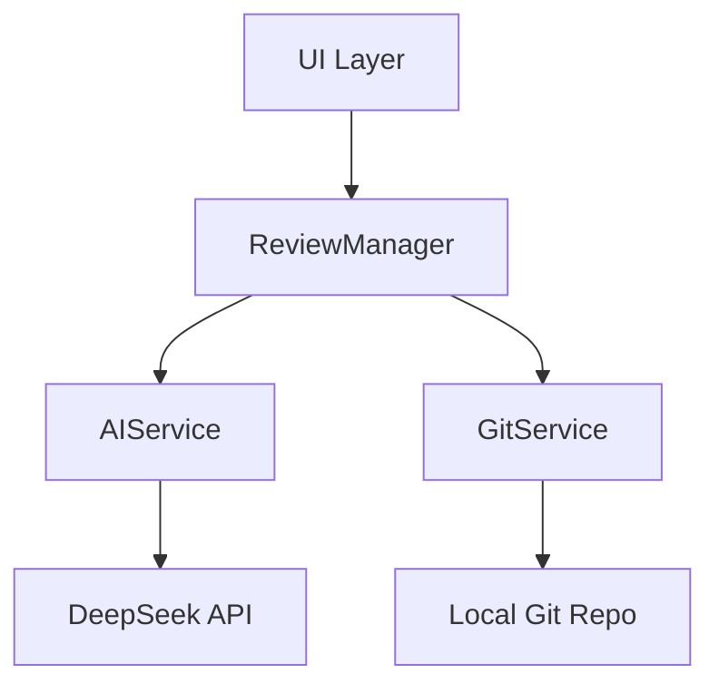

# Feature Requests

<cite>
**Referenced Files in This Document**   
- [user-guide.md](file://docs/en/user-guide.md)
- [developer-guide.md](file://docs/en/developer-guide.md)
- [extension.ts](file://src/extension.ts)
- [reviewManager.ts](file://src/services/review/reviewManager.ts)
- [gitService.ts](file://src/services/git/gitService.ts)
- [aiService.ts](file://src/services/ai/aiService.ts)
- [README.md](file://README.md)
</cite>

## Table of Contents
1. [Introduction](#introduction)
2. [Submitting Feature Requests](#submitting-feature-requests)
3. [Required Information for Feature Requests](#required-information-for-feature-requests)
4. [Project Vision and Alignment](#project-vision-and-alignment)
5. [Maintainers' Evaluation Criteria](#maintainers-evaluation-criteria)
6. [Community Support and Feedback](#community-support-and-feedback)
7. [Examples of Successful Feature Requests](#examples-of-successful-feature-requests)
8. [Conclusion](#conclusion)

## Introduction

CodeKarmic is an AI-powered code review assistant for VS Code derivatives that leverages the DeepSeek R1 model to analyze Git commit history, detect file changes, and provide actionable insights through detailed review reports. The extension enhances the code review process by automatically identifying potential issues, suggesting improvements, and evaluating code quality based on AI analysis.

This document provides comprehensive guidance for users who wish to submit feature requests for CodeKarmic. It outlines the proper process for proposing new features through GitHub Issues using the 'feature request' template, details the information needed for a compelling request, and explains how user feedback directly influences the project's future roadmap.

The project maintains a clear focus on enhancing the code review experience through AI-powered analysis of Git commits, with current capabilities including commit history analysis, file change detection, diff analysis, and generation of detailed review reports. As the project evolves, user input plays a crucial role in shaping its direction and prioritizing new functionality.

**Section sources**
- [README.md](file://README.md#L1-L24)
- [user-guide.md](file://docs/en/user-guide.md#L1-L60)

## Submitting Feature Requests

To submit a feature request for CodeKarmic, users should create a new GitHub Issue using the 'feature request' template. This structured approach ensures that all necessary information is provided for the maintainers to properly evaluate the proposal.

The process begins by navigating to the CodeKarmic repository on GitHub and selecting "Issues" followed by "New Issue." From the available templates, choose "Feature Request" to ensure your submission follows the required format. This template guides you through providing essential details about your proposed feature, including the use case, expected behavior, and potential implementation ideas.

When creating your feature request, it's important to search existing issues first to avoid duplication. Use the GitHub issue search with relevant keywords to check if your idea has already been proposed. If a similar request exists, consider adding your support through a comment or reaction rather than creating a duplicate issue.

The feature request process is designed to be collaborative and transparent. Once submitted, maintainers will review your proposal and may ask clarifying questions to better understand your needs. Community members can also contribute to the discussion, helping to refine the idea and demonstrate user demand.

**Section sources**
- [README.md](file://README.md#L50-L52)
- [user-guide.md](file://docs/en/user-guide.md#L48-L52)

## Required Information for Feature Requests

A compelling feature request should include several key pieces of information to help maintainers understand the value and feasibility of the proposed functionality.

First, provide a clear description of the use case that explains the problem you're trying to solve or the workflow you're trying to improve. This should include specific scenarios where the current functionality falls short and how your proposed feature would address these limitations. For example, if you're requesting additional language support, describe the specific programming languages you work with and how they're currently not adequately supported.

Second, outline the expected behavior of the feature in detail. Describe how users would interact with the new functionality, what outputs or results they would expect, and how it would integrate with existing features. This helps maintainers visualize the implementation and assess its impact on the user experience.

Third, suggest potential implementation ideas when possible. While you don't need to provide a complete technical solution, sharing your thoughts on how the feature might be implemented can be valuable. This could include references to similar functionality in other tools, suggested UI designs, or integration points within the existing codebase architecture.

Finally, explain how your proposed feature aligns with the project's vision as documented in the user guide. Reference specific sections from user-guide.md to demonstrate how your request complements current capabilities and extends the core functionality of AI-powered code review.

**Section sources**
- [user-guide.md](file://docs/en/user-guide.md#L11-L17)
- [user-guide.md](file://docs/en/user-guide.md#L53-L59)

## Project Vision and Alignment

Feature requests should align with CodeKarmic's core mission of providing AI-powered code review assistance for Git commits. The project's vision, as outlined in the documentation, focuses on enhancing the code review process through intelligent analysis of code changes, identification of potential issues, and generation of actionable suggestions.

When framing your feature request, consider how it supports this vision. The extension is designed to analyze Git commit history, detect file changes, and provide detailed review reports with actionable insights. Successful proposals typically extend these core capabilities rather than introducing entirely new, unrelated functionality.

For example, the "Coming Soon" section in the user guide mentions planned features such as additional language support, custom review rules, team collaboration features, and more AI models. These indicate areas where the project is already planning to expand, making related proposals more likely to be accepted.

When proposing a new feature, reference the existing capabilities documented in user-guide.md to show how your idea builds upon the current foundation. This demonstrates that you've understood the project's direction and are contributing to its coherent evolution rather than requesting functionality that might fragment the user experience.

Features that enhance the AI analysis capabilities, improve the review workflow, or extend support for additional programming languages and frameworks are particularly aligned with the project's goals. Similarly, improvements to the user interface, reporting capabilities, or integration with other development tools can be valuable if they support the primary objective of effective code review.

**Section sources**
- [user-guide.md](file://docs/en/user-guide.md#L13-L17)
- [user-guide.md](file://docs/en/user-guide.md#L53-L59)

## Maintainers' Evaluation Criteria

The CodeKarmic maintainers evaluate feature requests based on several key criteria to ensure the project evolves in a sustainable and user-focused manner.

Technical feasibility is a primary consideration. The maintainers assess whether the proposed feature can be implemented within the current architecture, which follows a clear flow from UI Layer to ReviewManager to AIService and GitService. Features that require minimal changes to the core architecture or can leverage existing components like the AIService or GitService are more likely to be accepted.

User impact is another critical factor. The maintainers prioritize features that will benefit a broad segment of the user base or solve significant pain points in the code review process. Features that address common workflows or improve accessibility for developers working with specific technologies are given higher priority.

Alignment with the project roadmap is essential. As mentioned in the user guide, planned features include additional language support, custom review rules, team collaboration features, and support for more AI models. Proposals that complement these planned directions are more likely to be accepted than those that diverge significantly from the established vision.

Implementation complexity is also considered. The maintainers evaluate the amount of code changes required, potential maintenance burden, and impact on performance. Features that can be implemented incrementally or as modular extensions to the existing functionality are preferred over those requiring extensive refactoring.

Finally, the maintainers consider the availability of resources, including their own time and expertise, as well as community contributions. Features that can be implemented by external contributors or have clear implementation paths are more likely to move forward.

**Diagram sources**
- [developer-guide.md](file://docs/en/developer-guide.md#L5-L12)

**Section sources**
- [developer-guide.md](file://docs/en/developer-guide.md#L3-L27)
- [extension.ts](file://src/extension.ts#L20-L520)

## Community Support and Feedback

Community support plays a vital role in the feature request evaluation process. Users are encouraged to gather support for their proposals by sharing them with other CodeKarmic users and encouraging discussion on the GitHub issue.

Positive reactions (thumbs up) on feature request issues help maintainers gauge community interest and prioritize development efforts. A feature request with numerous positive reactions demonstrates clear user demand and increases its chances of being implemented.

Engaging in constructive discussion on feature request issues is also valuable. Providing thoughtful comments that refine the proposal, suggest improvements, or share similar use cases helps the maintainers better understand the requirements and potential implementation approaches.

The maintainers actively monitor community feedback and often use it to shape the final implementation of accepted features. They may ask for additional input on specific design decisions or implementation details, creating a collaborative development process.

Users can also demonstrate support for feature requests by contributing to the discussion with real-world examples of how the feature would be used, sharing related tools or approaches they've used in other contexts, or even offering to help with testing or documentation if the feature is implemented.

This community-driven approach ensures that the most valuable and widely desired features are prioritized, creating a development process that is responsive to user needs while maintaining technical excellence.

**Section sources**
- [user-guide.md](file://docs/en/user-guide.md#L48-L52)
- [README.md](file://README.md#L50-L52)

## Examples of Successful Feature Requests

Several features in CodeKarmic originated from user suggestions and demonstrate how community input directly influences the project's evolution.

The filter functionality for commits by date range and commit ID, accessible through the "Filter by Date Range" and "Filter by Commit ID" commands, was implemented based on user feedback requesting more precise control over which commits to review. This feature allows users to focus their analysis on specific time periods or investigate particular changes, enhancing the efficiency of the code review process.

The support for multiple AI models, accessible through the "Select AI Model" command, was added in response to user requests for flexibility in AI backend selection. This feature allows users to choose the most appropriate AI model for their specific needs, expanding the extension's capabilities beyond its initial DeepSeek R1 integration.

The ability to review individual files or folders directly from the file explorer, enabled by the "Review Selected Items with CodeKarmic" command, was implemented based on user feedback about workflow efficiency. This feature streamlines the review process by allowing users to analyze specific code sections without navigating through the commit history.

These successful implementations demonstrate the project maintainers' commitment to responding to user needs. They show how well-articulated feature requests that align with the project vision and demonstrate clear user benefits can be transformed into valuable functionality that enhances the overall user experience.

**Section sources**
- [package.json](file://package.json#L75-L86)
- [extension.ts](file://src/extension.ts#L279-L285)
- [extension.ts](file://src/extension.ts#L287-L289)

## Conclusion

Submitting feature requests for CodeKarmic is a collaborative process that directly influences the project's future development. By following the structured approach outlined in this document, users can effectively propose new features that enhance the AI-powered code review experience.

When submitting a feature request, remember to search for existing proposals to avoid duplication, use the feature request template to ensure all necessary information is provided, and clearly articulate the use case, expected behavior, and alignment with the project vision. Reference the existing documentation in user-guide.md to frame your request in the context of current capabilities.

The maintainers evaluate proposals based on technical feasibility, user impact, alignment with the roadmap, and implementation complexity. Community support through reactions and constructive discussion plays a crucial role in prioritizing development efforts.

Your feedback is invaluable in shaping CodeKarmic's evolution. Well-crafted feature requests that address genuine user needs and align with the project's mission of enhancing code review through AI analysis have a strong chance of being implemented, contributing to a tool that better serves the development community.

**Section sources**
- [user-guide.md](file://docs/en/user-guide.md#L1-L60)
- [developer-guide.md](file://docs/en/developer-guide.md#L1-L74)