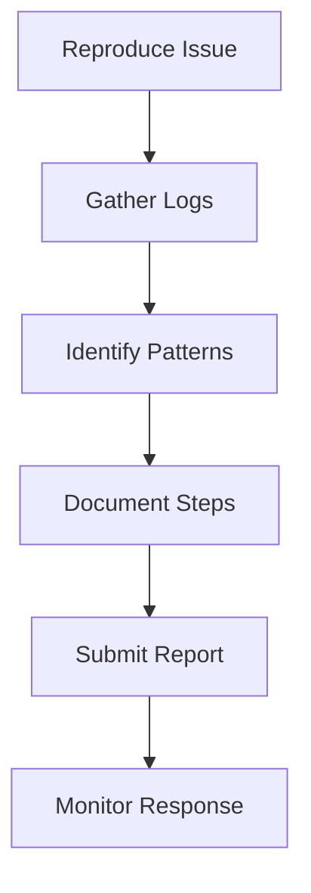
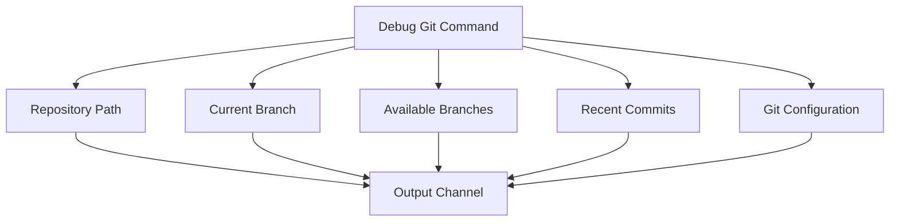
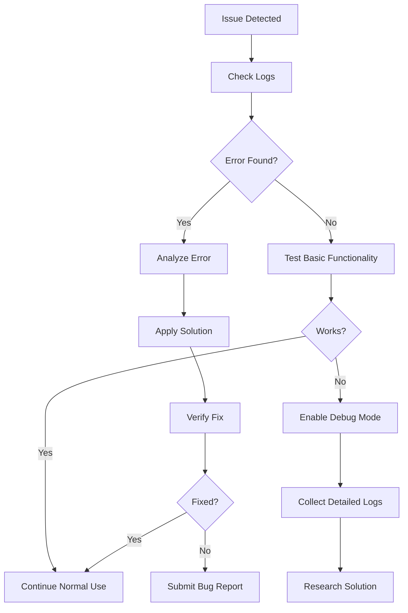
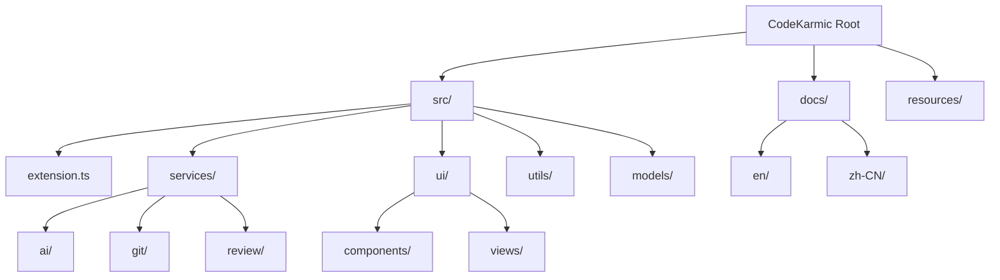
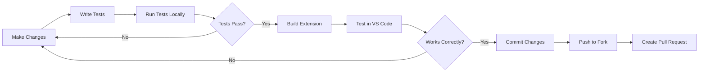
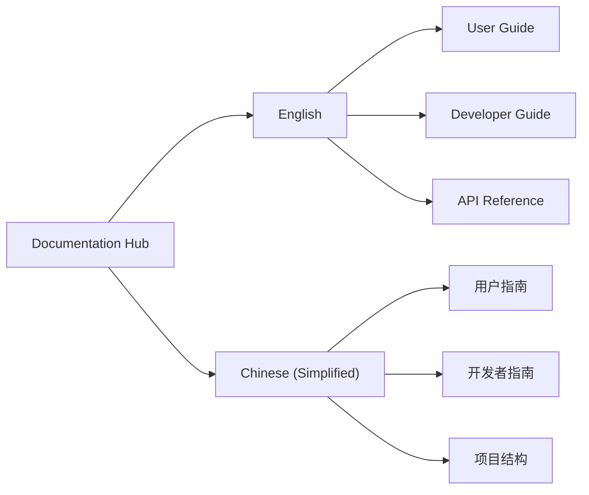

# Support Resources

<cite>
**Referenced Files in This Document**
- [README.md](file://README.md)
- [package.json](file://package.json)
- [docs/en/user-guide.md](file://docs/en/user-guide.md)
- [docs/en/developer-guide.md](file://docs/en/developer-guide.md)
- [docs/project-structure.md](file://docs/project-structure.md)
- [docs/release-guide.md](file://docs/release-guide.md)
- [CHANGELOG.md](file://CHANGELOG.md)
- [src/extension.ts](file://src/extension.ts)
- [src/utils/logger.ts](file://src/utils/logger.ts)
- [src/services/notification/notificationManager.ts](file://src/services/notification/notificationManager.ts)
- [src/services/git/gitService.ts](file://src/services/git/gitService.ts)
- [src/core/review/suggestionGenerator.ts](file://src/core/review/suggestionGenerator.ts)
- [src/services/review/reviewManager.ts](file://src/services/review/reviewManager.ts)
</cite>

## Table of Contents
1. [Introduction](#introduction)
2. [Support Channels](#support-channels)
3. [Bug Reporting Guidelines](#bug-reporting-guidelines)
4. [Feature Requests](#feature-requests)
5. [Community Guidelines](#community-guidelines)
6. [Diagnostic Tools](#diagnostic-tools)
7. [Troubleshooting Resources](#troubleshooting-resources)
8. [Contributing to CodeKarmic](#contributing-to-codekarmic)
9. [Documentation Resources](#documentation-resources)
10. [Response Expectations](#response-expectations)

## Introduction

CodeKarmic is an AI-powered code review assistant for VS Code that leverages the DeepSeek R1 model to provide intelligent code analysis and suggestions. As an open-source project, we offer multiple support channels and resources to help users effectively utilize the extension and contribute to its development.

This support guide covers everything from basic troubleshooting to advanced diagnostic procedures, ensuring users can get the help they need while contributing to the project's growth and improvement.

## Support Channels

### Primary Support Channels

CodeKarmic provides several support channels for different types of inquiries and assistance:

#### 1. GitHub Issues
The primary channel for bug reports, feature requests, and technical discussions.

**When to Use GitHub Issues:**
- Reporting bugs or unexpected behavior
- Requesting new features or enhancements
- Technical questions about extension functionality
- Performance issues or optimization requests
- API integration problems

**GitHub Repository:** [https://github.com/nesnilnehc/CodeKarmic/issues](https://github.com/nesnilnehc/CodeKarmic/issues)

#### 2. Community Forums
While CodeKarmic primarily uses GitHub Issues for support, users can engage in discussions through:

- **GitHub Discussions**: For broader conversations about usage, best practices, and community sharing
- **Stack Overflow**: Tag questions with `codekarmic` for community assistance
- **Discord/Slack**: Check project announcements for community communication channels

#### 3. Documentation Resources
Comprehensive documentation available directly within the extension and online:

- **User Guide**: Step-by-step instructions for all features
- **Developer Guide**: Technical documentation for contributors
- **API Reference**: Detailed API documentation for developers
- **FAQ**: Frequently asked questions and common solutions

### Support Channel Comparison

| Channel | Best For | Response Time | Accessibility |
|---------|----------|---------------|---------------|
| GitHub Issues | Bug reports, Feature requests | 1-3 business days | Public, searchable |
| GitHub Discussions | General questions, Best practices | 1-2 hours | Community-driven |
| Documentation | Self-service learning | Instant | Always available |
| Email | Enterprise support | 2-5 business days | Private, secure |

## Bug Reporting Guidelines

Effective bug reporting is crucial for maintaining CodeKarmic's quality and functionality. Follow these guidelines to ensure your bug report receives timely attention and resolution.

### Essential Information to Include

#### 1. Diagnostic Information Collection

Before submitting a bug report, gather comprehensive diagnostic information:

**Extension Version:**
- Check the extension version in VS Code: `CodeKarmic: About` command
- Verify if you're using the latest version

**Environment Details:**
- VS Code version and platform (Windows/macOS/Linux)
- Node.js version (if applicable)
- Operating system version
- Git version and configuration

**Log Output:**
- Enable debug mode: Set `"codekarmic.debugMode": true` in settings
- Reproduce the issue while debug mode is active
- Copy relevant log entries from the Output panel (select "CodeKarmic")

#### 2. Reproduction Steps

Provide clear, step-by-step instructions to reproduce the issue:



**Example Structure:**
1. **Setup**: Describe your development environment
2. **Action**: Detail the exact steps to reproduce
3. **Expected Result**: What should happen
4. **Actual Result**: What actually happens
5. **Frequency**: How often does it occur

#### 3. Log Analysis

The extension provides comprehensive logging capabilities for effective debugging:

**Log Levels:**
- **DEBUG**: Detailed execution information (enable debug mode)
- **INFO**: General operational messages
- **WARN**: Warning conditions that don't prevent functionality
- **ERROR**: Error conditions that affect functionality

**Accessing Logs:**
- Open VS Code Output panel
- Select "CodeKarmic" from the dropdown
- Look for timestamped entries with `[ERROR]` or `[WARN]` prefixes

### Bug Report Template

Use this template when reporting bugs:

```markdown
**Extension Version:** 0.2.0
**VS Code Version:** 1.85.0
**Operating System:** Windows 11 / macOS 13.0 / Ubuntu 22.04

**Issue Description:**
Brief description of the problem

**Steps to Reproduce:**
1. Step one
2. Step two
3. Step three

**Expected Behavior:**
What should happen

**Actual Behavior:**
What actually happens

**Logs:**
```
Paste relevant log entries here
```

**Additional Context:**
Any other relevant information
```

### Common Bug Categories

#### 1. API Integration Issues
- API key validation failures
- Rate limiting errors
- Network connectivity problems

#### 2. Git Integration Problems
- Repository detection issues
- Commit parsing errors
- Branch switching problems

#### 3. Performance Issues
- Slow response times
- Memory consumption problems
- UI freezing during operations

**Section sources**
- [src/utils/logger.ts](file://src/utils/logger.ts#L1-L88)
- [src/services/notification/notificationManager.ts](file://src/services/notification/notificationManager.ts#L1-L213)
- [src/extension.ts](file://src/extension.ts#L291-L310)

## Feature Requests

We welcome feature requests that enhance CodeKarmic's functionality and user experience. Follow these guidelines to submit effective feature proposals.

### Feature Request Process

#### 1. Research Existing Features
- Check the [CHANGELOG.md](file://CHANGELOG.md) for recently added features
- Search existing GitHub Issues for similar requests
- Review the [Roadmap](file://docs/en/user-guide.md#coming-soon) for planned features

#### 2. Feature Proposal Template

```markdown
**Feature Name:** [Clear, descriptive title]

**Problem Statement:**
Describe the problem or limitation this feature would address

**Proposed Solution:**
Detail how the feature would work and benefit users

**Implementation Considerations:**
- Technical feasibility
- Impact on existing functionality
- Required dependencies

**Alternatives Considered:**
Other approaches to solving the same problem

**Additional Context:**
Screenshots, mockups, or examples
```

### Feature Request Categories

#### 1. Enhancement Requests
- UI/UX improvements
- Performance optimizations
- Usability enhancements

#### 2. New Functionality
- Additional AI model support
- Advanced filtering options
- Export/import capabilities

#### 3. Integration Features
- CI/CD pipeline integration
- Third-party service connections
- API endpoint additions

### Feature Evaluation Criteria

Features are evaluated based on:

- **User Impact**: Number of users benefiting from the feature
- **Technical Complexity**: Implementation difficulty and maintenance cost
- **Alignment with Vision**: How well it fits CodeKarmic's mission
- **Resource Availability**: Developer capacity to implement

## Community Guidelines

CodeKarmic maintains a welcoming and professional community environment. All participants are expected to adhere to these guidelines.

### Code of Conduct

#### Expected Behavior
- **Respectful Communication**: Treat all community members with courtesy and professionalism
- **Constructive Feedback**: Provide helpful, actionable suggestions
- **Collaborative Spirit**: Work together to improve the project
- **Inclusive Environment**: Welcome contributors of all skill levels

#### Unacceptable Behavior
- **Harassment**: Any form of discrimination, bullying, or intimidation
- **Disrespectful Language**: Offensive, derogatory, or inflammatory comments
- **Spam**: Unsolicited promotional content or repetitive posting
- **Privacy Violations**: Sharing personal information without consent

### Contribution Standards

#### 1. Quality Requirements
- **Code Quality**: Follow established coding standards and conventions
- **Testing**: Include appropriate tests for new functionality
- **Documentation**: Update documentation to reflect changes
- **Compatibility**: Ensure backward compatibility when possible

#### 2. Review Process
- **Peer Review**: All contributions undergo code review
- **Feedback Incorporation**: Respond constructively to reviewer feedback
- **Iteration**: Be prepared to refine your contribution based on feedback

### Community Recognition

We recognize and celebrate community contributions through:

- **Contributor Acknowledgment**: Credit in release notes and documentation
- **Issue Triage**: Recognize users who help identify and categorize issues
- **Documentation Improvements**: Highlight valuable documentation contributions
- **Community Support**: Acknowledge users who help others in discussions

## Diagnostic Tools

CodeKarmic includes comprehensive diagnostic capabilities to help identify and resolve issues quickly.

### Built-in Diagnostic Commands

#### 1. Debug Git Functionality
**Command:** `CodeKarmic: Debug Git Functionality`

This command provides detailed information about your Git repository and integration:



**Output Includes:**
- Repository path and structure
- Current branch and HEAD information
- Available remote branches
- Recent commit history with details
- Git configuration settings

#### 2. Debug Mode Activation
**Setting:** `"codekarmic.debugMode": true`

Enables detailed logging for troubleshooting:

**Benefits:**
- Verbose operation logging
- Detailed API request/response tracking
- Performance timing information
- Error stack traces with context

### Diagnostic Information Collection

#### 1. Extension Information
- **Version**: Current installed version
- **Activation Status**: Whether the extension loaded successfully
- **Configuration**: Active settings and preferences
- **Dependencies**: Loaded modules and external libraries

#### 2. Environment Analysis
- **VS Code Version**: Compatible version information
- **Platform**: Operating system and architecture
- **Memory Usage**: Current memory consumption
- **Network Status**: API connectivity verification

#### 3. Integration Diagnostics
- **Git Repository**: Repository detection and status
- **API Connectivity**: DeepSeek API connection testing
- **File System**: Access permissions and file monitoring
- **Cache Status**: Cache hit rates and storage utilization

### Log Analysis Tools

#### 1. Output Panel Monitoring
Access comprehensive logs through VS Code's Output panel:

**Navigation:**
1. View → Output (Ctrl+Shift+U / Cmd+Shift+U)
2. Select "CodeKarmic" from the dropdown
3. Filter by log level if needed

**Log Analysis Tips:**
- Look for `[ERROR]` entries to identify issues
- Check timestamps for chronological analysis
- Search for specific error messages or keywords
- Compare successful vs. failed operation logs

#### 2. Console Debugging
For advanced troubleshooting, use browser developer tools:

**Access Method:**
1. Open VS Code
2. Go to Help → Toggle Developer Tools
3. Navigate to Console tab

**Common Debug Areas:**
- Network requests to API endpoints
- JavaScript errors in extension code
- Performance profiling information

**Section sources**
- [src/extension.ts](file://src/extension.ts#L291-L310)
- [src/services/git/gitService.ts](file://src/services/git/gitService.ts#L1186-L1200)

## Troubleshooting Resources

This section provides systematic approaches to resolving common issues and accessing additional troubleshooting resources.

### Common Issues and Solutions

#### 1. API Key Issues

**Problem:** "API key not configured" or authentication failures

**Solutions:**
1. Verify API key format and validity
2. Check DeepSeek API service status
3. Ensure sufficient API credits remain
4. Validate network connectivity to API endpoints

**Diagnostic Steps:**
- Use `CodeKarmic: Configure API Key` command
- Check settings persistence
- Test API connectivity manually

#### 2. Git Integration Problems

**Problem:** Extension fails to detect Git repositories or commits

**Solutions:**
1. Verify Git is installed and accessible
2. Check repository structure and permissions
3. Ensure Git is initialized in the workspace
4. Review Git configuration settings

**Diagnostic Commands:**
- `CodeKarmic: Debug Git Functionality`
- Manual Git commands in terminal
- VS Code Git integration status

#### 3. Performance Issues

**Problem:** Slow response times or high memory usage

**Solutions:**
1. Reduce file size limits in settings
2. Exclude unnecessary files from review
3. Close other large applications
4. Restart VS Code periodically

**Monitoring Tools:**
- Memory usage in VS Code Activity Monitor
- Extension performance indicators
- Log analysis for bottlenecks

### Troubleshooting Workflow



### Advanced Troubleshooting

#### 1. Extension Reset
If issues persist, try resetting the extension:

**Steps:**
1. Disable CodeKarmic extension
2. Clear extension cache
3. Reload VS Code
4. Re-enable extension
5. Reconfigure settings

#### 2. Clean Installation
For persistent issues, perform a clean installation:

**Procedure:**
1. Uninstall CodeKarmic from VS Code
2. Delete extension folder from VS Code extensions directory
3. Clear VS Code cache
4. Restart VS Code
5. Reinstall CodeKarmic
6. Configure fresh settings

#### 3. Environment Isolation
Test in isolation to identify conflicts:

**Method:**
1. Create new VS Code profile
2. Install only essential extensions
3. Test CodeKarmic functionality
4. Gradually add other extensions to identify conflicts

### External Resources

#### 1. Official Documentation
- [User Guide](docs/en/user-guide.md)
- [Developer Guide](docs/en/developer-guide.md)
- [API Reference](docs/project-structure.md)

#### 2. Community Resources
- GitHub Discussions for user support
- Stack Overflow with `codekarmic` tag
- Community-contributed tutorials and guides

#### 3. Monitoring Resources
- VS Code Activity Monitor
- System Resource Monitor
- Network connectivity tools

**Section sources**
- [src/services/notification/notificationManager.ts](file://src/services/notification/notificationManager.ts#L101-L128)
- [src/services/review/reviewManager.ts](file://src/services/review/reviewManager.ts#L90-L109)

## Contributing to CodeKarmic

CodeKarmic welcomes contributions from the community. Whether you're fixing bugs, adding features, or improving documentation, your contributions help make the project better for everyone.

### Getting Started with Contributions

#### 1. Development Environment Setup

**Prerequisites:**
- Node.js v20 or higher
- VS Code v1.85.0 or higher
- Git installed and configured
- npm package manager

**Setup Steps:**
```bash
# Clone the repository
git clone https://github.com/nesnilnehc/CodeKarmic.git
cd CodeKarmic

# Install dependencies
npm install

# Compile the extension
npm run compile

# Start development server
npm run watch
```

#### 2. Project Structure Overview

Understanding the project structure helps contributors navigate and modify code effectively:



**Key Directories:**
- **src/**: Main source code
- **docs/**: Documentation files
- **resources/**: Icons and assets
- **dist/**: Compiled distribution files

### Contribution Types

#### 1. Bug Fixes
- Identify issues through bug reports or self-discovery
- Create minimal reproducible examples
- Submit focused pull requests
- Include regression tests when possible

#### 2. Feature Development
- Discuss new features in GitHub Issues first
- Design feature specifications
- Implement incrementally with tests
- Update documentation accordingly

#### 3. Documentation Improvements
- Clarify confusing sections
- Add missing information
- Translate documentation to new languages
- Create tutorials and examples

#### 4. Performance Optimizations
- Profile extension performance
- Identify bottlenecks
- Implement optimizations
- Measure impact quantitatively

### Code Contribution Process

#### 1. Fork and Branch
```bash
# Fork the repository on GitHub
# Clone your fork
git clone https://github.com/YOUR_USERNAME/CodeKarmic.git
cd CodeKarmic

# Create feature branch
git checkout -b feature/your-feature-name
```

#### 2. Development Workflow


#### 3. Pull Request Guidelines
- **Clear Title**: Descriptive PR title
- **Detailed Description**: Explain what and why
- **Issue Reference**: Link related GitHub Issues
- **Testing**: Include relevant tests
- **Documentation**: Update documentation if needed

### Testing Requirements

#### 1. Unit Tests
All new functionality should include unit tests:

**Test Coverage Areas:**
- Core business logic
- Utility functions
- API integrations
- Error handling scenarios

#### 2. Integration Tests
Test complete workflows and user interactions:

**Test Scenarios:**
- Full code review process
- Git integration workflows
- API communication patterns
- Error recovery mechanisms

#### 3. Manual Testing
Verify user experience and usability:

**Testing Checklist:**
- UI responsiveness
- Error message clarity
- Performance under load
- Cross-platform compatibility

### Code Quality Standards

#### 1. Coding Conventions
Follow established naming and formatting standards:

**Naming Rules:**
- Classes: PascalCase (e.g., `GitService`)
- Functions: camelCase (e.g., `getCommits`)
- Constants: UPPER_CASE (e.g., `API_BASE_URL`)
- Interfaces: I + PascalCase (e.g., `IGitService`)

#### 2. Documentation Standards
- Document all public APIs
- Explain complex algorithms
- Provide usage examples
- Keep documentation synchronized

#### 3. Security Considerations
- Validate all user inputs
- Sanitize sensitive data
- Handle credentials securely
- Follow security best practices

### Release Process

Contributors should understand the project's release cycle:

#### 1. Version Management
- Follow semantic versioning (SemVer)
- Update version in package.json
- Document changes in CHANGELOG.md
- Create release tags

#### 2. Quality Assurance
- Automated testing suite
- Manual testing procedures
- Performance benchmarks
- Compatibility verification

#### 3. Deployment Process
- GitHub release creation
- VS Code Marketplace publishing
- Documentation updates
- Community announcements

**Section sources**
- [docs/en/developer-guide.md](file://docs/en/developer-guide.md#L1-L74)
- [docs/project-structure.md](file://docs/project-structure.md#L1-L123)
- [docs/release-guide.md](file://docs/release-guide.md#L1-L204)

## Documentation Resources

CodeKarmic provides comprehensive documentation to help users maximize the extension's potential and contributors understand the codebase.

### Available Documentation

#### 1. User Documentation

**Primary User Guide:**
- **English Version**: [User Guide](docs/en/user-guide.md)
- **Chinese Version**: [用户指南](docs/zh-CN/user-guide.md)

**Key Topics Covered:**
- Installation and setup instructions
- Basic usage workflows
- Configuration options
- Feature explanations
- Troubleshooting guides

#### 2. Developer Documentation

**Technical Documentation:**
- **English Version**: [Developer Guide](docs/en/developer-guide.md)
- **Chinese Version**: [开发者指南](docs/zh-CN/developer-guide.md)

**Development Topics:**
- Architecture overview
- Component relationships
- API specifications
- Testing frameworks
- Build processes

#### 3. Project Documentation

**Structural Information:**
- **Project Structure**: [Project Structure](docs/project-structure.md)
- **Release Guide**: [Release Guide](docs/release-guide.md)
- **Changelog**: [CHANGELOG.md](CHANGELOG.md)

**Reference Materials:**
- Naming conventions and standards
- Code quality guidelines
- Contribution workflows
- Release procedures

### Documentation Organization

#### 1. Language Support
CodeKarmic provides documentation in multiple languages:



#### 2. Content Categories
- **Getting Started**: Quick setup and basic usage
- **Advanced Features**: Power user functionality
- **Technical Reference**: API documentation and specifications
- **Troubleshooting**: Problem resolution guides
- **Contributing**: Development and contribution guidelines

### Finding Specific Information

#### 1. Search Strategies
- **Keyword Search**: Use specific terms related to your query
- **Category Navigation**: Browse by documentation type
- **Cross-Reference**: Follow links between related topics
- **Version Filtering**: Check documentation version compatibility

#### 2. Documentation Updates
Stay current with the latest information:

**Update Sources:**
- GitHub repository changes
- Release notes and changelogs
- Community discussions
- Official announcements

**Update Frequency:**
- Major releases: Comprehensive updates
- Bug fixes: Minor corrections
- Feature additions: New content
- Deprecations: Removal notices

### Contributing to Documentation

#### 1. Documentation Issues
Help improve documentation by:

- Reporting unclear or outdated content
- Suggesting improvements
- Providing usage examples
- Translating content to new languages

#### 2. Writing Guidelines
Follow documentation standards:

**Content Standards:**
- Clear, concise language
- Practical examples
- Step-by-step instructions
- Cross-references and links

**Format Standards:**
- Markdown formatting
- Consistent headings
- Code examples
- Screenshots and diagrams

**Section sources**
- [docs/en/user-guide.md](file://docs/en/user-guide.md#L1-L60)
- [docs/en/developer-guide.md](file://docs/en/developer-guide.md#L1-L74)
- [README.md](file://README.md#L1-L24)

## Response Expectations

Understanding typical response times and support availability helps users manage their expectations and plan accordingly.

### Support Response Times

#### 1. GitHub Issues
**Standard Response Times:**
- **Bug Reports**: 1-3 business days
- **Feature Requests**: 3-7 business days  
- **Questions**: 1-2 hours during business hours
- **Critical Issues**: Same-day response

**Factors Affecting Response Time:**
- Issue complexity and priority
- Contributor availability
- Severity of the issue
- Community involvement

#### 2. Community Support
**Response Expectations:**
- **GitHub Discussions**: 1-24 hours
- **Stack Overflow**: 1-48 hours
- **Email Support**: 2-5 business days
- **Social Media**: 1-4 hours

### Support Availability

#### 1. Business Hours Support
**Typical Coverage:**
- Monday to Friday
- 9 AM to 5 PM local timezone
- Weekend and holiday coverage varies

#### 2. Community-Driven Support
**Availability:**
- Global community participation
- Variable response times
- Volunteer-driven assistance
- Best-effort support

#### 3. Emergency Support
**Critical Issues:**
- Security vulnerabilities
- Data loss situations
- System-wide failures
- Legal compliance concerns

**Emergency Procedures:**
1. Contact maintainer directly
2. Escalate through official channels
3. Provide immediate workaround guidance
4. Coordinate emergency response

### Communication Guidelines

#### 1. Effective Communication
**Best Practices:**
- Be specific about your issue
- Provide relevant context and details
- Include error messages and logs
- Demonstrate research effort
- Be patient and respectful

#### 2. Escalation Procedures
**When to Escalate:**
- No response after 7 days
- Critical security concerns
- Legal or compliance issues
- Service disruption affecting users

**Escalation Steps:**
1. Contact primary support channels
2. Mention previous attempts
3. Provide escalation justification
4. Follow up regularly

### Quality Metrics

#### 1. Response Quality
**Expectations:**
- Clear, actionable responses
- Relevant examples and references
- Timely acknowledgment
- Progress updates when appropriate

#### 2. Resolution Quality
**Standards:**
- Complete problem solutions
- Preventive measures
- Documentation improvements
- Community knowledge sharing

### Feedback Mechanisms

#### 1. Support Satisfaction
**Feedback Channels:**
- GitHub Issue reactions
- Community surveys
- Direct contact forms
- Social media engagement

#### 2. Continuous Improvement
**Improvement Areas:**
- Response time optimization
- Documentation enhancement
- Automation implementation
- Community building

**Section sources**
- [CHANGELOG.md](file://CHANGELOG.md#L1-L92)
- [src/services/notification/notificationManager.ts](file://src/services/notification/notificationManager.ts#L101-L128)