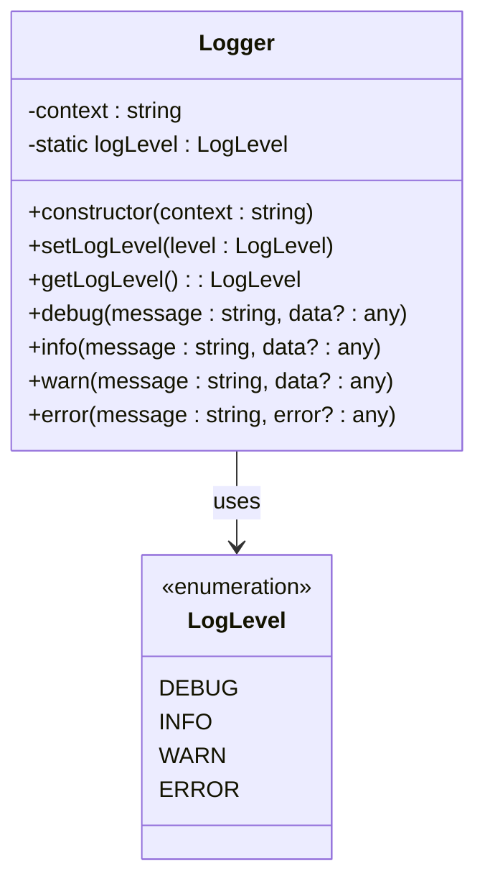
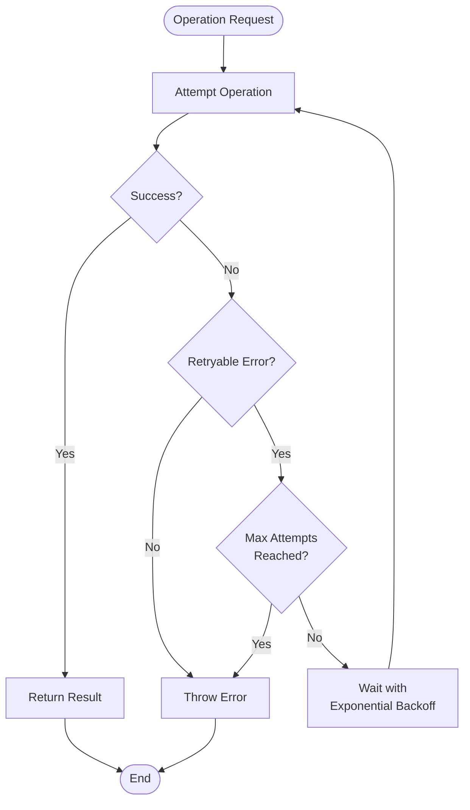

# Troubleshooting

<cite>
**Referenced Files in This Document**
- [logger.ts](file://src/utils/logger.ts)
- [gitService.ts](file://src/services/git/gitService.ts)
- [aiService.ts](file://src/services/ai/aiService.ts)
- [appConfig.ts](file://src/config/appConfig.ts)
- [constants.ts](file://src/constants/constants.ts)
- [extension.ts](file://src/extension.ts)
- [retryUtils.ts](file://src/utils/retryUtils.ts)
- [largeFileProcessor.ts](file://src/core/compression/largeFileProcessor.ts)
- [package.json](file://package.json)
- [ui.ts](file://src/i18n/en/ui.ts)
- [output.ts](file://src/i18n/en/output.ts)
</cite>

## Table of Contents
1. [Introduction](#introduction)
2. [Common Issues and Solutions](#common-issues-and-solutions)
3. [Diagnostic Tools and Commands](#diagnostic-tools-and-commands)
4. [Log Levels and Debug Mode](#log-levels-and-debug-mode)
5. [Error Handling Patterns](#error-handling-patterns)
6. [Network and Connectivity Issues](#network-and-connectivity-issues)
7. [Performance Optimization](#performance-optimization)
8. [Known Limitations](#known-limitations)
9. [Advanced Troubleshooting](#advanced-troubleshooting)

## Introduction

CodeKarmic is an AI-powered Git commit code review extension for Visual Studio Code. This troubleshooting guide covers common issues, diagnostic techniques, and solutions for various problems users may encounter when using the extension.

## Common Issues and Solutions

### Failed API Authentication

**Problem**: API key validation fails or authentication errors occur.

**Symptoms**:
- Error messages indicating "API key not configured"
- "Invalid API key" warnings
- Authentication failures when requesting AI reviews

**Diagnosis Steps**:
1. Check if API key is properly configured in VS Code settings
2. Verify the API key format and validity
3. Test API key with the validation command

**Resolution**:
1. Configure API key using the command palette:
   ```
   Ctrl+Shift+P → CodeKarmic: Configure API Key
   ```
2. Or set directly in VS Code settings:
   ```json
   "codekarmic.apiKey": "your-api-key-here"
   ```
3. Validate the key using the built-in validation mechanism

**Section sources**
- [extension.ts](file://src/extension.ts#L82-L96)
- [appConfig.ts](file://src/config/appConfig.ts#L145-L156)

### Git Repository Access Errors

**Problem**: Extension cannot access Git repository or repository detection fails.

**Symptoms**:
- "Not a Git repository" errors
- Cannot start code review
- Repository path not found errors

**Diagnosis Steps**:
1. Verify the current workspace contains a Git repository
2. Check if `.git` directory exists in the repository root
3. Confirm VS Code has proper permissions to access the repository

**Resolution**:
1. Open a folder containing a Git repository in VS Code
2. Ensure the repository is properly initialized:
   ```bash
   git init
   ```
3. Check repository status:
   ```bash
   git status
   ```

**Section sources**
- [gitService.ts](file://src/services/git/gitService.ts#L64-L107)
- [extension.ts](file://src/extension.ts#L102-L138)

### Timeout During AI Processing

**Problem**: AI analysis takes too long or times out.

**Symptoms**:
- Long delays during code review
- Timeout errors in console
- AI review requests hanging indefinitely

**Diagnosis Steps**:
1. Check network connectivity
2. Monitor API response times
3. Verify AI model availability

**Resolution**:
1. Increase timeout settings if possible
2. Reduce file sizes for analysis
3. Retry the operation after network stabilization

**Section sources**
- [aiService.ts](file://src/services/ai/aiService.ts#L260-L410)
- [retryUtils.ts](file://src/utils/retryUtils.ts#L33-L70)

### Webview Rendering Failures

**Problem**: Code review panel or webview fails to render properly.

**Symptoms**:
- Blank or empty review panels
- JavaScript errors in webview
- Rendering artifacts or layout issues

**Diagnosis Steps**:
1. Check VS Code webview settings
2. Verify extension permissions
3. Examine browser console for errors

**Resolution**:
1. Restart VS Code
2. Clear VS Code cache
3. Disable conflicting extensions
4. Update VS Code to latest version

**Section sources**
- [reviewPanel.ts](file://src/ui/views/reviewPanel.ts#L46-L116)

## Diagnostic Tools and Commands

### Debug Git Functionality

**Command**: `codekarmic.debugGit`

This command provides comprehensive Git debugging information including:
- Repository path verification
- Current branch detection
- Available branches listing
- Recent commit information

**Usage**:
1. Open Command Palette (Ctrl+Shift+P)
2. Type "CodeKarmic: Debug Git Functionality"
3. Review the output in the Git Debug channel

**Expected Output**:
```
Git Debug Information:
---------------------
Repository Path: /path/to/repository
Current Branch: main

Branches:
* main
  develop
  feature/

Recent Commits:
abc1234 - 2024-01-15 - Initial commit
def5678 - 2024-01-16 - Add new feature
```

**Section sources**
- [extension.ts](file://src/extension.ts#L291-L324)

### Console Logging

**Accessing Logs**:
1. Open VS Code Developer Tools (Help → Toggle Developer Tools)
2. Navigate to Console tab
3. Filter for "CodeKarmic" messages

**Log Categories**:
- `[GitService]` - Git operations and repository access
- `[AIService]` - AI model interactions and API calls
- `[LargeFileProcessor]` - Large file handling and compression
- `[ReviewManager]` - Code review orchestration

### Status Bar Indicators

The extension displays real-time status updates in the VS Code status bar:
- **AI Analysis Progress**: Shows current stage of code review
- **Network Status**: Indicates API connectivity
- **Processing Time**: Estimates time remaining for operations

## Log Levels and Debug Mode

### Enabling Debug Mode

**Method 1**: Settings Configuration
1. Open VS Code Settings
2. Search for "codekarmic.debugMode"
3. Enable the debug mode option

**Method 2**: Command Palette
1. Open Command Palette (Ctrl+Shift+P)
2. Type "Preferences: Open Settings (JSON)"
3. Add: `"codekarmic.debugMode": true`

### Log Level Configuration

The extension supports multiple log levels for different verbosity levels:

| Level | Description | Use Case |
|-------|-------------|----------|
| ERROR | Critical errors only | Production troubleshooting |
| WARN | Warnings and errors | General monitoring |
| INFO | Informational messages | Standard operation |
| DEBUG | Detailed debugging info | Development and deep investigation |

**Default Level**: INFO

**Changing Log Level**:
```json
"codekarmic.logLevel": "DEBUG"
```

**Section sources**
- [logger.ts](file://src/utils/logger.ts#L8-L88)
- [constants.ts](file://src/constants/constants.ts#L8-L33)

### Logger Implementation

The extension uses a centralized logging system with structured output:



**Diagram sources**
- [logger.ts](file://src/utils/logger.ts#L8-L88)

## Error Handling Patterns

### Retry Mechanism

The extension implements sophisticated retry logic for network and API operations:



**Diagram sources**
- [retryUtils.ts](file://src/utils/retryUtils.ts#L33-L70)

### Error Categories

**Network Errors**:
- Connection timeouts
- DNS resolution failures
- Network unreachable

**API Errors**:
- Rate limiting
- Authentication failures
- Service unavailability

**Git Errors**:
- Repository not found
- Branch not found
- Permission denied

**Section sources**
- [retryUtils.ts](file://src/utils/retryUtils.ts#L92-L116)

### Error Recovery Strategies

1. **Automatic Retry**: For transient network issues
2. **Graceful Degradation**: Fallback to simpler operations
3. **User Notification**: Clear error messages with suggested actions
4. **Logging**: Comprehensive error logging for debugging

## Network and Connectivity Issues

### Common Network Problems

**Timeout Issues**:
- Slow internet connections
- High latency networks
- Firewall restrictions

**DNS Resolution**:
- Corporate proxy configurations
- DNS blocking
- Network routing issues

**SSL/TLS Problems**:
- Certificate validation failures
- Outdated CA certificates
- Mixed content warnings

### Troubleshooting Network Issues

**Step 1**: Verify Basic Connectivity
```bash
# Test API endpoint accessibility
curl -I https://api.deepseek.com/v1

# Check DNS resolution
nslookup api.deepseek.com
```

**Step 2**: Proxy Configuration
- Configure VS Code proxy settings
- Set environment variables for proxy
- Check corporate firewall rules

**Step 3**: SSL Certificate Validation
- Update system certificates
- Configure certificate authorities
- Verify SSL/TLS handshake

### Rate Limiting

**Problem**: API requests being throttled or blocked.

**Symptoms**:
- "Rate limit exceeded" errors
- Requests timing out frequently
- Intermittent service availability

**Solutions**:
1. Implement exponential backoff
2. Reduce request frequency
3. Use caching mechanisms
4. Contact API provider for higher limits

**Section sources**
- [aiService.ts](file://src/services/ai/aiService.ts#L388-L410)

## Performance Optimization

### Large File Handling

The extension includes specialized processing for large files:

**File Size Thresholds**:
- Default threshold: 100KB
- Configurable via `codekarmic.maxFileSizeKb`
- Automatic compression for files exceeding threshold

**Compression Techniques**:
- Content summarization
- Token reduction
- Intelligent sampling

**Batch Processing**:
- Multiple file analysis
- Parallel processing where possible
- Progress tracking

**Section sources**
- [largeFileProcessor.ts](file://src/core/compression/largeFileProcessor.ts#L44-L81)

### Memory Management

**Optimization Strategies**:
1. Lazy loading of resources
2. Efficient data structures
3. Garbage collection awareness
4. Streaming for large datasets

**Memory Monitoring**:
- Track memory usage during operations
- Implement cleanup routines
- Monitor for memory leaks

### Caching Mechanisms

**Types of Caching**:
- Git commit cache
- AI response cache
- File content cache
- API response cache

**Cache Configuration**:
```json
{
  "codekarmic.cacheEnabled": true,
  "codekarmic.cacheTTL": 3600
}
```

## Known Limitations

### File Type Exclusions

The extension excludes certain file types from code review:

**Excluded File Extensions**:
- Images: `.png`, `.jpg`, `.gif`, `.bmp`, `.ico`, `.svg`
- Documents: `.pdf`, `.docx`, `.xlsx`
- Archives: `.zip`, `.tar`, `.gz`, `.rar`
- Executables: `.exe`, `.dll`, `.so`, `.dylib`
- Binary files: `.bin`, `.class`, `.obj`
- Media: `.mp3`, `.mp4`, `.avi`, `.mov`

**Excluded Directories**:
- `node_modules/**`
- `.git/**`
- `dist/**`, `build/**`
- `target/**`, `out/**`
- `vendor/**`
- `.vscode/**`

### Size Limitations

**File Size Limits**:
- Maximum file size: 100KB (configurable)
- Large file processing: Automatic compression
- Batch processing limits: 100 files per batch

**Token Limits**:
- AI model token limits: Automatic truncation
- Prompt length limits: Intelligent summarization
- Response size limits: Progressive loading

### Network Dependencies

**External Services**:
- AI model APIs (DeepSeek, OpenAI)
- Git hosting services
- CDN for assets

**Offline Capabilities**:
Limited offline functionality
Requires initial setup with network access

**Section sources**
- [package.json](file://package.json#L149-L206)

## Advanced Troubleshooting

### Extension Activation Issues

**Problem**: Extension fails to activate properly.

**Diagnostic Steps**:
1. Check VS Code extension logs
2. Verify dependencies are installed
3. Review activation events

**Resolution**:
1. Reload VS Code window
2. Reinstall the extension
3. Check for conflicting extensions

### Configuration Conflicts

**Problem**: Settings conflicts or corruption.

**Solution**:
1. Reset settings to defaults
2. Clear extension cache
3. Reconfigure problematic settings

### Performance Profiling

**Tools**:
- VS Code Performance Profiler
- Chrome DevTools
- Node.js profiling tools

**Metrics to Monitor**:
- Startup time
- Memory usage
- Network requests
- CPU utilization

### Custom Error Handling

**Implementation Pattern**:
```typescript
try {
    // Operation that might fail
} catch (error) {
    // Custom error handling
    const errorHandler = new ErrorHandler();
    errorHandler.logError(error);
    errorHandler.notifyUser(error);
    errorHandler.reportToAnalytics(error);
}
```

**Error Reporting**:
- Structured error reporting
- User-friendly error messages
- Debug information capture
- Automated bug reporting

**Section sources**
- [extension.ts](file://src/extension.ts#L515-L520)

### Community Support

**Resources**:
- GitHub Issues: Report bugs and feature requests
- Documentation: Comprehensive guides and tutorials
- Discord/Slack: Community discussions
- Stack Overflow: Technical questions

**Contributing**:
- Code contributions welcome
- Documentation improvements
- Bug reports and testing
- Feature suggestions