# Generating Reports

<cite>
**Referenced Files in This Document**
- [reviewPanel.ts](file://src/ui/views/reviewPanel.ts)
- [reviewManager.ts](file://src/services/review/reviewManager.ts)
- [extension.ts](file://src/extension.ts)
- [suggestionGenerator.ts](file://src/core/review/suggestionGenerator.ts)
- [constants.ts](file://src/constants/constants.ts)
- [package.json](file://package.json)
</cite>

## Table of Contents
1. [Introduction](#introduction)
2. [Architecture Overview](#architecture-overview)
3. [Command Registration](#command-registration)
4. [Report Generation Process](#report-generation-process)
5. [Report Content Structure](#report-content-structure)
6. [File Naming and Storage](#file-naming-and-storage)
7. [Prerequisites and Requirements](#prerequisites-and-requirements)
8. [Error Handling and Troubleshooting](#error-handling-and-troubleshooting)
9. [Implementation Details](#implementation-details)
10. [Best Practices](#best-practices)

## Introduction

The CodeKarmic extension provides comprehensive code review report generation capabilities through the `codekarmic.generateReport` command. This system creates detailed Markdown reports summarizing code review findings, including commit details, file changes, AI-generated suggestions, and overall quality assessments. The report generation process involves multiple components working together to analyze Git commits, process AI suggestions, and produce formatted reports for review.

## Architecture Overview

The report generation system follows a layered architecture with clear separation of concerns:

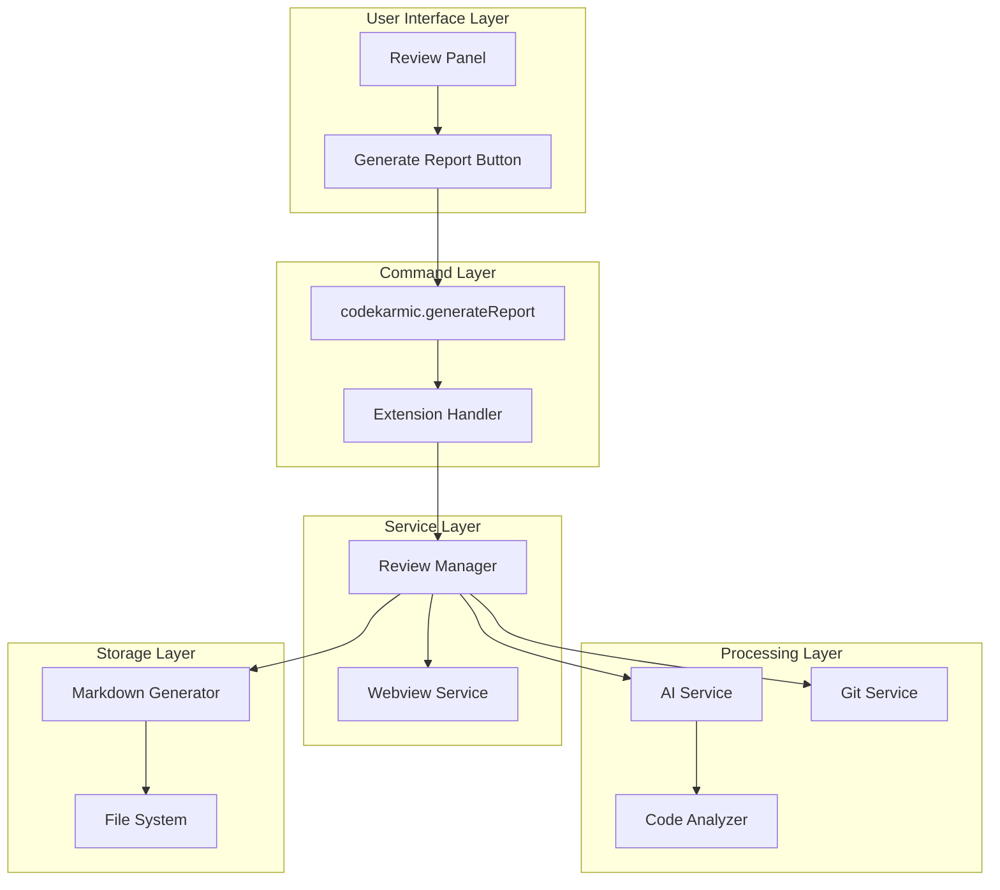

**Diagram sources**
- [reviewPanel.ts](file://src/ui/views/reviewPanel.ts#L58-L70)
- [reviewManager.ts](file://src/services/review/reviewManager.ts#L371-L660)
- [extension.ts](file://src/extension.ts#L187-L243)

## Command Registration

The report generation command is registered through the VS Code extension system and integrated with the file explorer context menu:

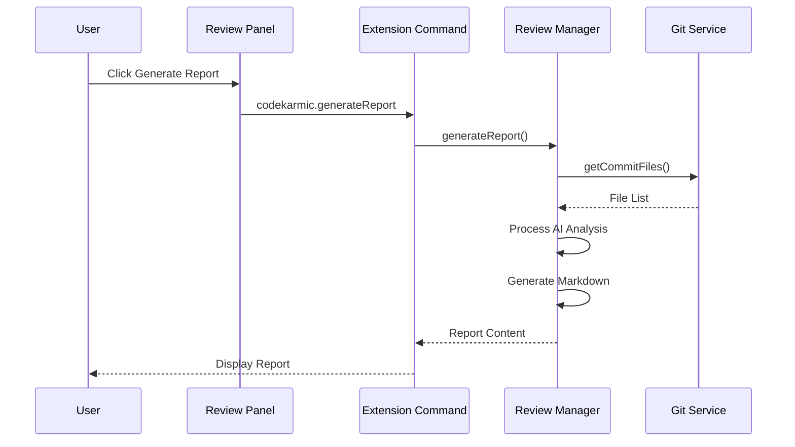

**Diagram sources**
- [reviewPanel.ts](file://src/ui/views/reviewPanel.ts#L58-L70)
- [reviewManager.ts](file://src/services/review/reviewManager.ts#L371-L660)
- [extension.ts](file://src/extension.ts#L187-L243)

**Section sources**
- [reviewPanel.ts](file://src/ui/views/reviewPanel.ts#L58-L70)
- [extension.ts](file://src/extension.ts#L187-L243)
- [package.json](file://package.json#L256-L258)

## Report Generation Process

The report generation process involves several key steps executed in parallel for optimal performance:

### Step 1: Initialization and Validation
The process begins with comprehensive validation of prerequisites:

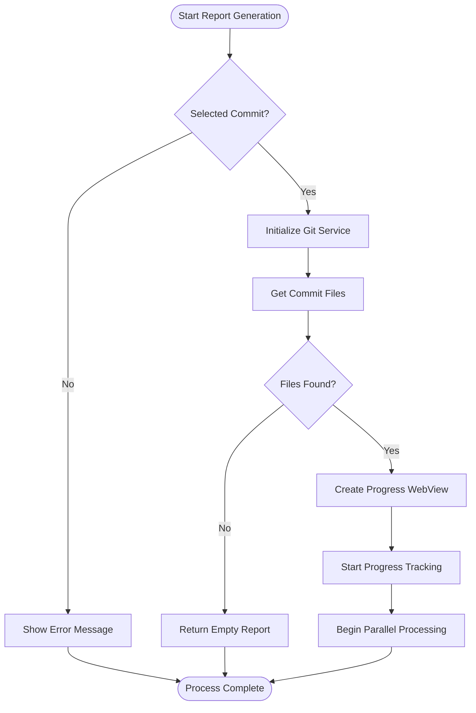

**Diagram sources**
- [reviewManager.ts](file://src/services/review/reviewManager.ts#L371-L442)

### Step 2: Parallel File Processing
The system processes files in parallel batches to maximize efficiency:

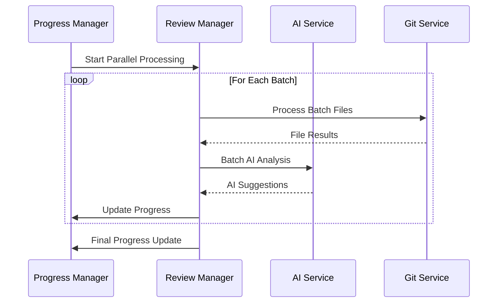

**Diagram sources**
- [reviewManager.ts](file://src/services/review/reviewManager.ts#L474-L550)

### Step 3: AI Analysis and Suggestions
The AI service performs comprehensive code analysis on each file:

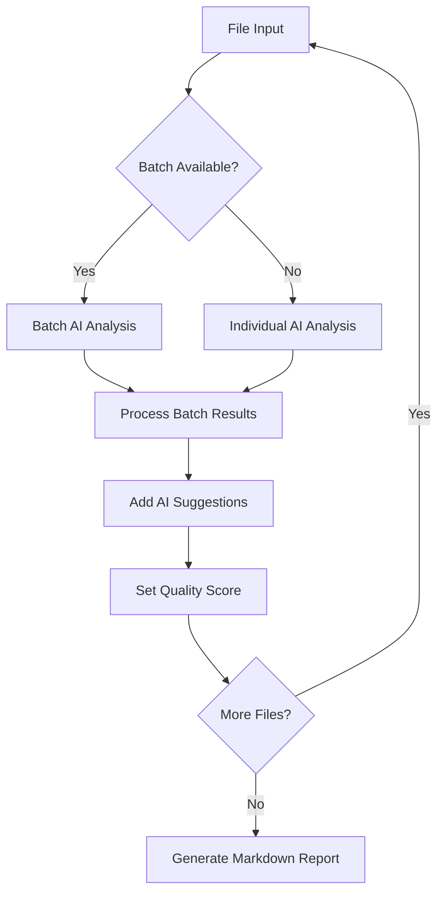

**Diagram sources**
- [reviewManager.ts](file://src/services/review/reviewManager.ts#L499-L645)

**Section sources**
- [reviewManager.ts](file://src/services/review/reviewManager.ts#L371-L660)

## Report Content Structure

The generated Markdown reports follow a standardized structure with clear sections and formatting:

### Report Template Structure

The report generation follows this hierarchical structure:

| Section | Purpose | Content |
|---------|---------|---------|
| **Header** | Document identification | Title, timestamp, extension metadata |
| **Commit Information** | Version control details | Commit hash, message, author, date |
| **File Overview** | Summary statistics | Total files, reviewed files, suggestion counts |
| **Individual File Analysis** | Detailed findings | Per-file suggestions, quality scores, code blocks |
| **Categorized Suggestions** | Organized recommendations | By severity, category, and impact level |

### Markdown Formatting Examples

The system generates reports with proper Markdown formatting:

```markdown
# 代码审核报告

## 提交信息
- 提交 ID: `abc12345`
- 提交信息: 实现用户认证功能
- 作者: 张三
- 日期: 2024-01-15 14:30:22

## 文件总览
- 审核的文件总数: 15
- 有建议的文件: 8

## 文件: src/auth/controller.ts

- 代码质量评分: 7.5/10

### 建议

- ✅ **安全性改进**: 建议添加输入验证以防止SQL注入攻击
- ⚠️ **性能优化**: 用户密码哈希计算过于频繁，建议添加缓存机制
- 📝 **代码可读性**: 函数命名应更具描述性，建议改为`validateUserCredentials`
```

**Section sources**
- [reviewManager.ts](file://src/services/review/reviewManager.ts#L787-L848)

## File Naming and Storage

The system implements a structured approach to report file naming and storage:

### File Naming Convention

Reports are saved using a standardized naming pattern:
- **Format**: `review_{timestamp}_{commit_hash}.md`
- **Example**: `review_2024-01-15T14-30-22Z_abc12345.md`
- **Components**: 
  - `review_`: Prefix indicating report type
  - `{timestamp}`: ISO format timestamp with colons replaced
  - `{commit_hash}`: First 8 characters of commit hash
  - `.md`: Markdown file extension

### Storage Location

Reports are stored in the workspace under the `docs/reviews/` directory:

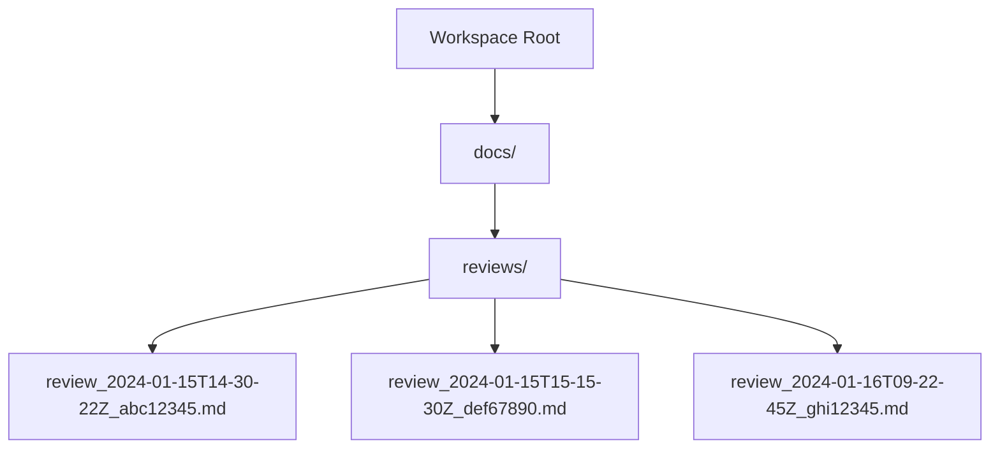

**Diagram sources**
- [extension.ts](file://src/extension.ts#L201-L228)

### Directory Creation and Permissions

The system automatically handles directory creation with appropriate permissions:

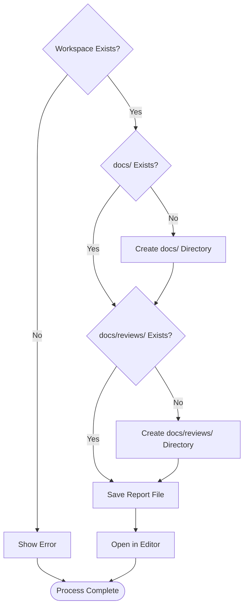

**Diagram sources**
- [extension.ts](file://src/extension.ts#L201-L228)

**Section sources**
- [extension.ts](file://src/extension.ts#L201-L228)

## Prerequisites and Requirements

### Required Selections

Before generating a report, the system requires specific selections:

| Requirement | Description | Validation |
|-------------|-------------|------------|
| **Git Repository** | Active Git repository in workspace | Checks `.git` directory existence |
| **Selected Commit** | Valid commit hash selection | Validates commit hash presence |
| **Workspace Folder** | Open workspace folder | Ensures workspace availability |
| **File Access** | Read permissions for repository files | Verifies file system access |

### Validation Process

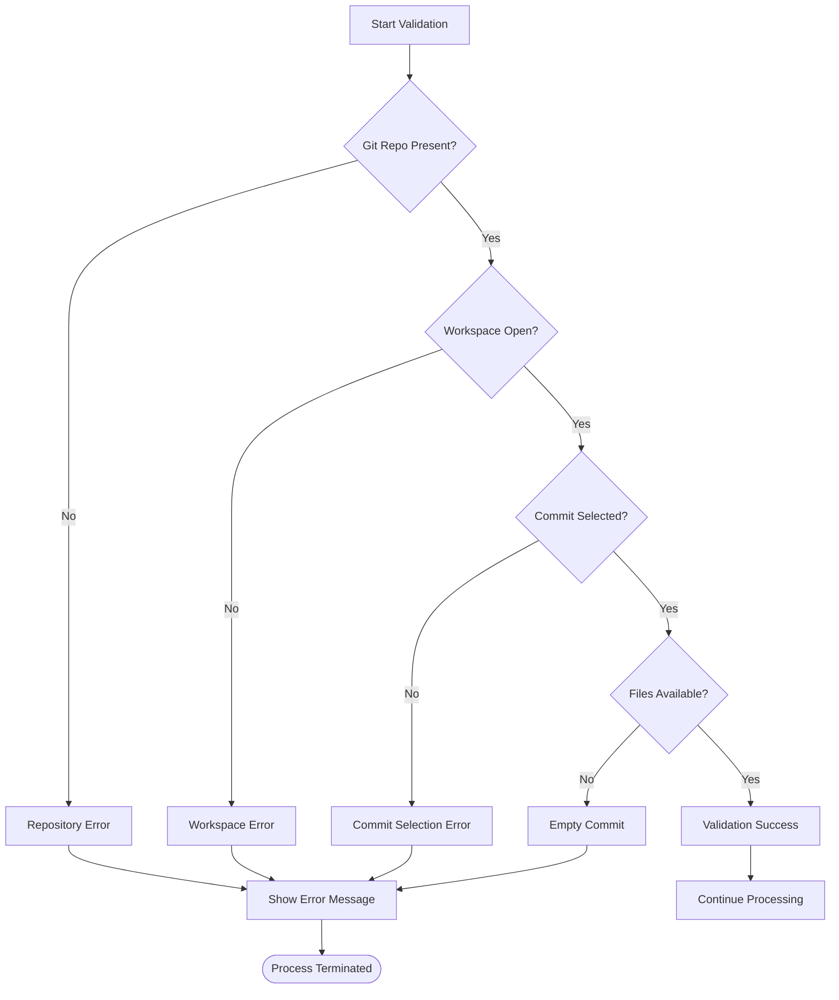

**Diagram sources**
- [reviewManager.ts](file://src/services/review/reviewManager.ts#L387-L432)
- [extension.ts](file://src/extension.ts#L189-L192)

**Section sources**
- [reviewManager.ts](file://src/services/review/reviewManager.ts#L387-L432)
- [extension.ts](file://src/extension.ts#L189-L192)

## Error Handling and Troubleshooting

### Common Issues and Solutions

The system implements comprehensive error handling for various failure scenarios:

| Issue Category | Symptoms | Resolution |
|----------------|----------|------------|
| **Permission Errors** | Cannot write to workspace directory | Verify workspace folder permissions |
| **Empty Reports** | Generated report with no content | Check for valid commit selection |
| **Network Issues** | AI analysis timeouts | Retry with smaller batch sizes |
| **Memory Issues** | Out of memory during processing | Reduce concurrent file processing |
| **Git Errors** | Repository access failures | Verify Git installation and repository integrity |

### Error Recovery Mechanisms

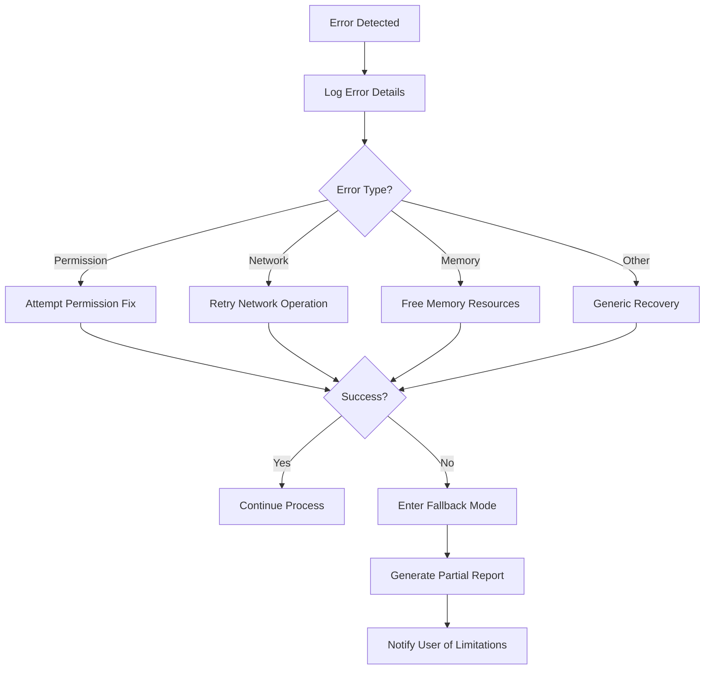

**Diagram sources**
- [reviewManager.ts](file://src/services/review/reviewManager.ts#L648-L654)

### Troubleshooting Commands

The extension provides diagnostic commands for troubleshooting:

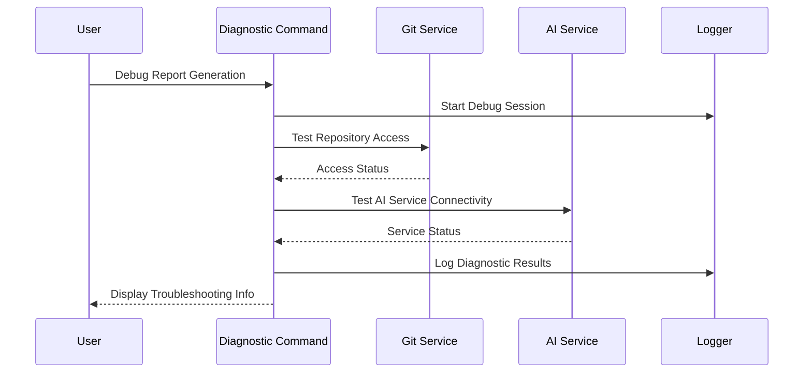

**Diagram sources**
- [reviewManager.ts](file://src/services/review/reviewManager.ts#L648-L654)

**Section sources**
- [reviewManager.ts](file://src/services/review/reviewManager.ts#L648-L654)
- [reviewManager.ts](file://src/services/review/reviewManager.ts#L40-L76)

## Implementation Details

### Webview Integration

The report generation includes real-time progress updates through webview integration:

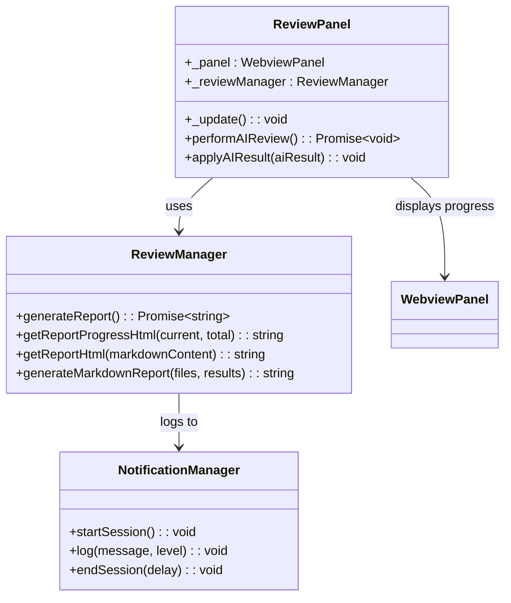

**Diagram sources**
- [reviewPanel.ts](file://src/ui/views/reviewPanel.ts#L5-L12)
- [reviewManager.ts](file://src/services/review/reviewManager.ts#L78-L854)

### Concurrent Processing

The system implements efficient concurrent processing for large repositories:

| Feature | Implementation | Benefits |
|---------|----------------|----------|
| **Batch Processing** | 5-file batches | Balanced memory usage |
| **Parallel AI Analysis** | Async promise processing | Faster completion times |
| **Progress Tracking** | Real-time updates | User feedback |
| **Cancellation Support** | VS Code progress cancellation | User control |

**Section sources**
- [reviewManager.ts](file://src/services/review/reviewManager.ts#L371-L660)
- [reviewPanel.ts](file://src/ui/views/reviewPanel.ts#L58-L70)

## Best Practices

### Report Generation Guidelines

To ensure optimal report generation:

1. **Pre-selection Requirements**: Always select a valid commit before generating reports
2. **Workspace Organization**: Maintain clean workspace structure with proper permissions
3. **AI Service Configuration**: Ensure AI service is properly configured and accessible
4. **Batch Size Tuning**: Adjust batch sizes based on system memory and processing power
5. **Progress Monitoring**: Monitor progress indicators for long-running operations

### Performance Optimization

For large repositories, consider these optimization strategies:

- **Incremental Processing**: Process files in smaller batches for memory-constrained environments
- **Parallel Limits**: Adjust concurrent processing limits based on system capabilities
- **Caching Strategies**: Utilize built-in caching for frequently accessed commit data
- **Resource Management**: Monitor memory usage during large report generation

### Security Considerations

When generating reports containing sensitive code:

- **Access Control**: Ensure proper access controls on repository files
- **Data Privacy**: Review generated reports for sensitive information
- **Workspace Security**: Verify workspace permissions and access rights
- **AI Service Security**: Secure AI service credentials and endpoints

**Section sources**
- [reviewManager.ts](file://src/services/review/reviewManager.ts#L371-L660)
- [extension.ts](file://src/extension.ts#L201-L243)